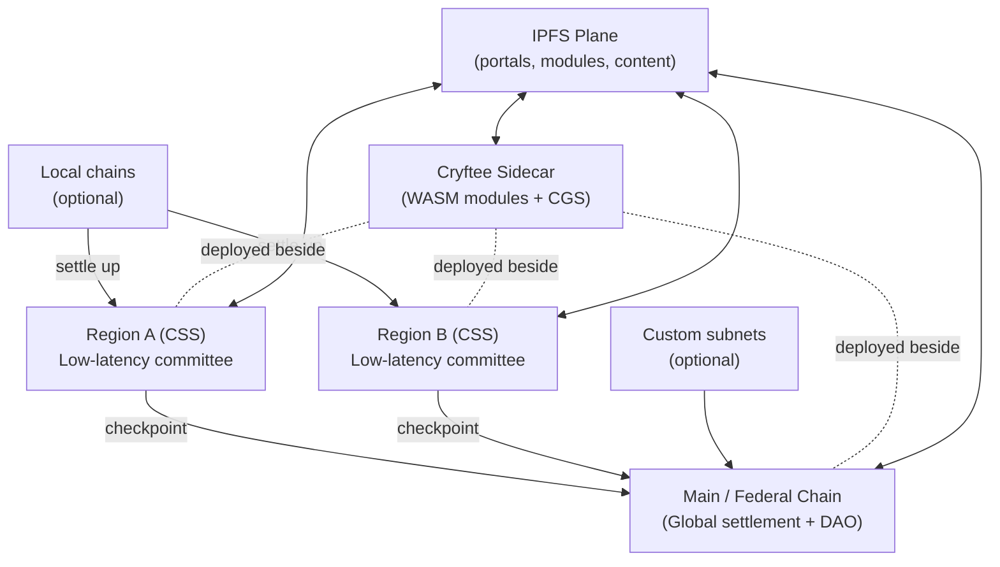
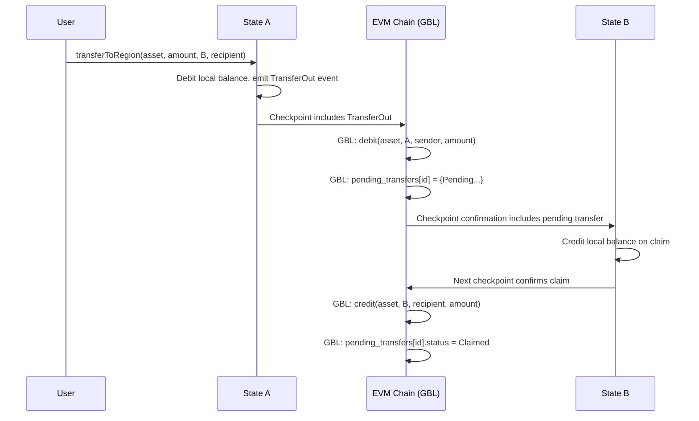
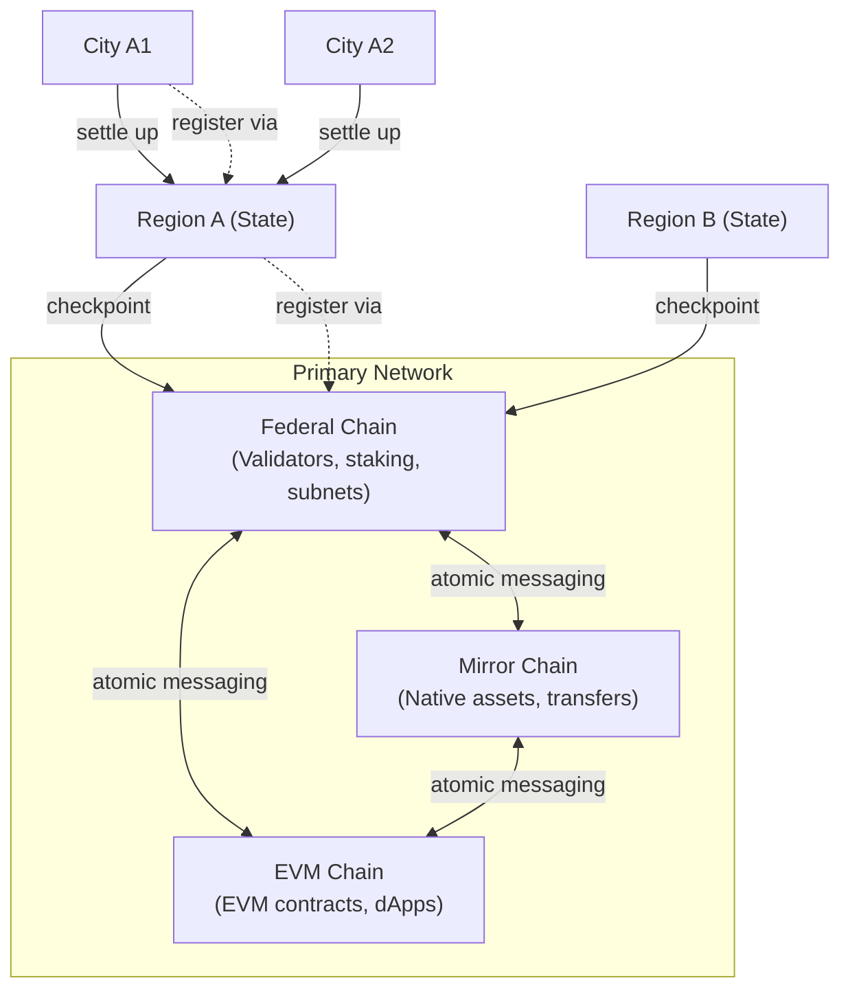
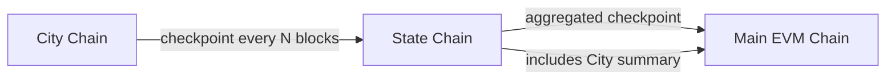
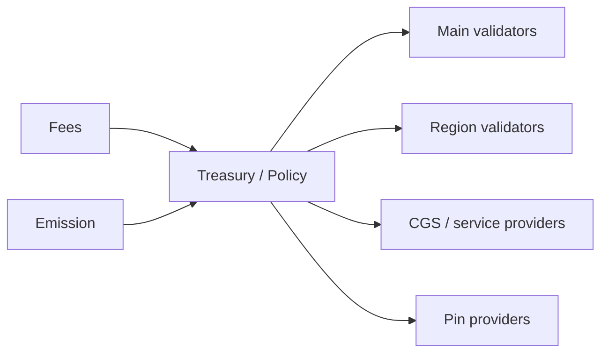

<h1 align="center">CryftNet (Cryft Network) Whitepaper</h1>

<p align="center">
<strong>Revision:</strong> v1.20<br>
<strong>Date:</strong> January 08, 2026<br>
<strong>Status:</strong> Draft<br>
<strong>Authors:</strong> Cryft Labs (Draft)
</p>

<p align="center">
<strong>Latest Changes:</strong> Added production-readiness sections: Smart Slots under-claiming enforcement (7.3.5), CGS consensus boundary clarification (9.5-9.9), decision machine for open questions (16.2), pragmatic Mainnet v1 deployment strategy (15.9).
</p>

<p align="center"><em>
This document is a technical design proposal. Some subsystems (notably CGS privacy and CRVS consensus) require validation via simulation, formal review, and security audits before production use.
</em></p>

---

## 1. Abstract

CryftNet (Cryft Network) is a federation of blockchains designed to feel like Web2 in latency while
retaining cryptographic integrity and democratic governance. The network is anchored by the **Primary Network**, which consists of three specialized chains: **(1) Federal Chain** for validator/subnet coordination and staking, **(2) Mirror Chain** for high-throughput native asset transfers and issuance, and **(3) EVM Chain** for EVM-compatible smart contract execution. When we say "EVM chain," we mean the EVM Chain specifically, not the entire Cryft network. This three-chain architecture prevents governance traffic, asset transfer traffic, and smart contract execution traffic from competing for the same bottleneck. Regional chains ("States") are optimized for low-latency execution and confirmations within a
geographic or network-latency domain. Optional local chains ("Cities") can further reduce latency for
dense communities and settle upward. CryftNet is EVM compatible by default. It introduces an opt-in
deterministic parallel execution mechanism called Smart Slots with Process IDs. Transactions may
declare a process_id and explicit slot claims that map to EVM state (account, storage, or
application-defined resource slots). A deterministic scheduler uses these claims to safely parallelize
execution, confining contention to lanes when necessary while preserving identical results across
validators. Privacy and propagation are addressed by Cryft Global Synchronizer (CGS), a
Cryftee-hosted plane that supports privacy-aware intent gossip, selective disclosure, and region-local
privacy pools, while still enabling scheduling via slot commitments. Cryftee itself is a Rust-based
sidecar runtime that loads signed WASM modules from a manifest, provides a versioned API over
UDS or HTTPS, and includes a kiosk UI for operators. Cryftee modules supply chain utilities including
BLS/TLS staking operations, IPFS node management, and private synchronization. Economic security is complemented by incentive alignment for availability: CryftNet includes explicit IPFS pinning rewards. Pin providers register, bond stake, accept pin jobs, and earn rewards based on verified availability proofs over time. The result is a federation where compute, consensus, privacy propagation, and content availability are governed and incentivized rather than assumed.


---

## 2. Design goals and non-goals

### 2.1 Goals

- Web2-like perceived latency via region-local confirmation and routing.
- EVM compatibility for mainstream wallets and developer tooling.
- Deterministic, opt-in parallel execution without breaking legacy contracts.
- Federated governance: Main chain as primary DAO; subnets as local DAOs; cross-network
voting support.
- Privacy-aware propagation (CGS) that reduces metadata leakage and resists censorship.
- Practical operations: signed module system (Cryftee) to ship chain utilities safely.
- Availability of content and tooling via IPFS pinning incentives.
- Region eligibility measurement using pings so validators serve the region they claim.

### 2.2 Non-goals

- Claiming infinite TPS or zero-latency global finality.
- Forcing all subnets to conform to a single VM or single consensus mechanism.
- Mandatory TEEs for security (TEEs may be used but are optional).
- Perfect anonymity guarantees; privacy is treated as measurable and adversarially tested.
- Assuming IPFS persistence without explicit incentives.


---

## 3. Background and problem statement

Global blockchains face two constraints: physics and contention. The speed of light and the Internet's
routing behavior impose a lower bound on propagation. At the same time, many workloads contend
on shared state (balances, nonces, popular contracts). Larger validator committees increase security
but also increase coordination time and validation bandwidth, creating diminishing returns on latency.
CryftNet treats latency domains as a design primitive. Instead of forcing one global committee to
finalize everything, regional committees provide fast local confirmations for nearby users. The Main
chain acts as a global settlement and governance anchor: regions periodically checkpoint upward,
enabling cross-region settlement without requiring every transaction to wait for global propagation.
Parallel execution is a complementary axis. EVM semantics are serial; naive parallelism breaks
determinism and can lead to chain splits. CryftNet introduces Smart Slots: explicit read/write claims
that enable deterministic, validator-consistent scheduling. When contracts cannot be parallelized,
they fall back to serial lanes. Modern networks also depend on content distribution: portals, module
artifacts, and application assets. IPFS makes this content-addressed and tamper-evident, but
availability remains an economic problem. CryftNet includes pinning rewards and auditable availability proofs so that "the network stays alive" is not a matter of goodwill.


---

## 4. System overview

CryftNet is organized as a federation:

- **Primary Network (Federal + Mirror + EVM):** The canonical foundation consisting of three chains: Federal Chain (validator/subnet management), Mirror Chain (native asset transfers), and EVM Chain (EVM smart contracts). Together they provide settlement, cross-chain registries, global governance, and the primary validator DAO.
- **Regional chains (States):** Low-latency committees tuned for users within a latency domain. Most user activity is expected to be region-local and finalizes quickly.
- **Local chains (Cities):** Optional, for dense communities or enterprise enclaves. These settle to a region.
- **Cryftee plane:** A sidecar runtime deployed alongside validators and infrastructure nodes, hosting signed modules and CGS.
- **IPFS plane:** Content-addressed distribution for portals, modules, and application assets, with incentives for availability.

**Figure 1: CryftNet federation overview (conceptual)**



Main and regions are linked by checkpointing. Regions confirm locally, then periodically anchor a
signed checkpoint to Main. Cross-region transfers use these checkpoints and standard message
formats. The federation is "edge-like" in the sense that regions provide fast service nearby, but it
avoids centralized operators: validator sets are governed by DAOs and measured for eligibility using
network performance signals.

### 4.1 Primary Network architecture (Federal Chain + Mirror Chain + EVM Chain)

Inspired by Avalanche's multi-chain architecture, CryftNet's Primary Network is composed of **three specialized chains**, each optimized for a distinct role. Cryft Labs maintains first-class implementations and long-term governance over all three chains, while subnets may add additional chains as needed:

| Chain | Purpose | VM | Consensus | Typical Operations |
|:------|:--------|:---|:----------|:-------------------|
| **Federal Chain** (Federal) | Validator set management, staking, subnet lifecycle, chain registration/metadata, governance coordination | Native | CRVS (high security) | Validator add/remove, stake/unstake, subnet registration, governance proposals, slashing |
| **Mirror Chain** (Mirror) | Native asset creation and transfers optimized for throughput (UTXO-style), base asset movements | Native (UTXO) | CRVS (high throughput) | CRYFT transfers, asset issuance, cross-chain atomic swaps, high-frequency payments |
| **EVM Chain** (EVM Execution) | Account-based smart contract execution compatible with Solidity/Vyper tooling (the dApp chain) | EVM | CRVS (fast finality) | Token contracts, DEX swaps, NFTs, DeFi protocols, user dApp interactions |

**Why three separate chains?**

1. **Performance isolation:** Validator/staking traffic (Federal Chain), asset transfer traffic (Mirror Chain), and smart contract execution traffic (EVM Chain) do not compete for the same bottleneck. This prevents governance operations from being priced out during DeFi congestion, and prevents EVM gas spikes from affecting base asset transfers.

2. **Security differentiation:** Federal Chain can use more conservative parameters (larger committees, longer finality windows) for critical validator/subnet operations. Mirror Chain optimizes for throughput. EVM Chain balances speed with EVM determinism requirements.

3. **Specialized state models:** Federal Chain uses validator set / stake accounting. Mirror Chain uses UTXO for parallel asset transfers. EVM Chain uses account-based EVM state. Each model is optimal for its domain.

4. **Upgrade isolation:** EVM upgrades (new opcodes, gas changes) affect only EVM Chain. Federal Chain and Mirror Chain native VMs can evolve independently based on federation needs.

5. **Economic clarity:** Staking rewards flow through Federal Chain. Asset issuance/burns happen on Mirror Chain. DeFi fees stay on EVM Chain. Clean separation prevents cross-subsidy confusion.

**Federal Chain responsibilities:**

- **Validator Registry:** Global validator identities, stake bonds, delegation relationships, and slashing records. All staking operations occur on Federal Chain.
- **Subnet Registry:** All State/Region chains register here with their chain_id, validator set commitments, consensus parameters, and CEP compatibility declarations.
- **Checkpoint Acceptance:** Receives and validates checkpoint submissions from all registered subnets; maintains the canonical checkpoint history.
- **Governance Coordination:** Proposal lifecycle, voting tallies, timelocks, and execution triggers. Governance decisions are recorded on Federal Chain.
- **Validator Rewards Distribution:** Emission schedule, reward allocation, and validator/delegator payouts.

**Mirror Chain responsibilities:**

- **Native Asset Issuance:** Creation of new asset types (tokens, NFTs) with UTXO-based ownership.
- **High-Throughput Transfers:** Optimized for CRYFT and other native asset movements (not EVM tokens).
- **Cross-Chain Atomic Swaps:** UTXO-style atomic swaps between Mirror Chain assets and EVM Chain ERC-20 tokens.
- **Base Layer Transfers:** Users moving large amounts of CRYFT between wallets typically use Mirror Chain (lower fees than EVM Chain EVM gas).

**EVM Chain responsibilities:**

- **EVM Smart Contracts:** All Solidity/Vyper contracts, DeFi protocols, NFT marketplaces, and dApps.
- **Global Balance Ledger (GBL):** The authoritative record of partitioned EVM token balances across all regions--tracking which account owns how much of each EVM Chain asset on which region. (Note: Native CRYFT balances live on Mirror Chain; ERC-20 wrapped CRYFT lives on EVM Chain.)
- **Contract Mirror Registry (CMR):** Authoritative record of federation contract deployments--tracking target_regions[], deployed_regions[], mirror_status per region, and deployment fees paid. Updated via region checkpoints.
- **Federation Contract Registry:** Tracks CREATE2 deployments, code hashes, and cross-region contract verification.
- **User-Facing dApp Interface:** When users "interact with CryftNet," they typically transact on EVM Chain (or regional EVM Chain instances).

**Global Balance Ledger (GBL) architecture:**

The GBL tracks **EVM Chain EVM token balances** (ERC-20, ERC-721, etc.) across regions. It does NOT track native CRYFT (that lives on Mirror Chain). The GBL is conceptually part of EVM Chain's state but may be implemented as a native data structure for efficiency:

```text
GlobalBalanceLedger {
  // Per-asset, per-region, per-account balance
  balances: Map<(asset_id, region_id, account) -> uint256>
  
  // Total supply per asset (conservation invariant)
  total_supply: Map<asset_id -> uint256>
  
  // Pending cross-region transfers
  pending_transfers: Map<transfer_id -> PendingTransfer>
  
  // Conservation check: for all asset: sum(balances[asset, *, *]) == total_supply[asset]
}

PendingTransfer {
  transfer_id: bytes32,
  asset_id: address,
  amount: uint256,
  from_region: uint64,
  to_region: uint64,
  sender: address,
  recipient: address,
  initiated_checkpoint: uint64,  // checkpoint where debit occurred
  status: enum { Pending, Claimed, Expired, Refunded }
}
```

**Why GBL lives on EVM Chain (not Federal Chain):**

1. **Native efficiency:** Balance tracking is a simple ledger operation--no EVM overhead needed.
2. **Atomic with checkpoints:** When EVM Chain accepts a State checkpoint, it atomically updates GBL balances.
3. **Single source of truth:** EVM Chain as the EVM execution layer is the natural home for EVM token balance tracking.
4. **Simpler conservation checks:** EVM Chain can enforce sum(regional balances) = total_supply natively.
5. **Cross-region transfers as first-class operations:** Not contract calls, but native EVM Chain transactions.

**GBL update flow:**



**EVM Chain EVM contracts and GBL:**

EVM Chain EVM contracts can **query** GBL state (which tracks EVM Chain token balances across regions):

```text
// EVM Chain EVM contract can query GBL
function getRegionalBalance(address asset, uint64 regionId, address account) 
  returns (uint256) {
  return GBL.balances[asset][regionId][account];
}

// Useful for:
// - DeFi protocols that need to know user's federation-wide balance
// - Governance contracts weighting votes by total holdings
// - Treasury contracts distributing rewards proportionally
```

Note: Native CRYFT balances live on Mirror Chain (UTXO model). EVM Chain sees wrapped CRYFT (ERC-20) only.

**Contract Mirror Registry (CMR) architecture:**

The CMR is EVM Chain's native data structure for tracking federation contract deployments and mirror state:

```text
ContractMirrorRegistry {
  // Per-contract deployment record
  contracts: Map<contract_address ->' ContractMirrorRecord>
  
  // Region deployment queue (contracts pending mirroring)
  pending_mirrors: Map<(contract_address, region_id) ->' PendingMirror>
  
  // Fee tracking per contract
  fees_paid: Map<contract_address ->' FeeRecord>
}

ContractMirrorRecord {
  contract_address: address,
  code_hash: bytes32,
  deployer: address,
  salt: bytes32,
  home_region: uint64,                    // Where initial deployment occurred
  target_regions: uint64[],               // Regions developer opted into
  deployed_regions: uint64[],             // Regions where contract is live
  mirror_status: Map<region_id ->' MirrorStatus>,  // Per-region status
  balance_portability: bool,
  verification_level: VerificationLevel,  // Unverified, Publisher, Federation
  created_at: uint64,
  last_updated: uint64
}

MirrorStatus {
  status: enum { Pending, Deployed, Failed, Revoked },
  deployed_at: uint64,
  init_hash: bytes32,          // Hash of initialization data
  initialized: bool,
  last_checkpoint: uint64      // Last checkpoint confirming this region
}

// Status transitions via region checkpoints:
// 1. Main receives deployment event ->' creates record, status[home] = Deployed
// 2. Main queues mirror to target_regions ->' status[target] = Pending
// 3. Region confirms deployment ->' status[target] = Deployed
// 4. Region reports failure ->' status[target] = Failed (auto-retry)
```

**CMR update flow (region-first deployment):**

```text
1) Developer deploys on Region A:
   - RegionDeployer.deploy(init_code, salt, options={target_regions: [A,B,C]})
   - Emits DeploymentEvent with region IDs and fee payment

2) Region A checkpoint -> Main EVM Chain:
   - EVM Chain processes DeploymentEvent
   - CMR creates: contracts[0xToken] = {
       home_region: A,
       target_regions: [A, B, C],
       deployed_regions: [A],
       mirror_status: {A: Deployed, B: Pending, C: Pending}
     }

3) Main triggers mirror to Regions B, C:
   - CMR updates: pending_mirrors[(0xToken, B)] = {queued}
   - CMR updates: pending_mirrors[(0xToken, C)] = {queued}

4) Region B, C receive mirror instruction and deploy:
   - RegionDeployer.mirror() called on each region
   - Region confirms in next checkpoint

5) Region B checkpoint -> Main EVM Chain:
   - EVM Chain updates CMR: deployed_regions: [A, B], mirror_status[B] = Deployed

6) Region C checkpoint -> Main EVM Chain:
   - EVM Chain updates CMR: deployed_regions: [A, B, C], mirror_status[C] = Deployed

CMR is authoritative - regions derive mirror permissions from EVM Chain state.
```

**CMR region expansion (post-deployment):**

```text
1) Developer requests expansion to Region D:
   - Calls FederationRegistry.expandRegions(0xToken, [D])
   - Pays expansion fee (0.01 CRYFT per region)

2) Checkpoint carries expansion request to Main:
   - EVM Chain verifies caller == deployer
   - EVM Chain verifies fee paid
   - CMR updates: target_regions: [A, B, C, D]
   - CMR updates: mirror_status[D] = Pending

3) Main triggers mirror to Region D

4) Region D confirms deployment in checkpoint:
   - CMR updates: deployed_regions: [A, B, C, D], mirror_status[D] = Deployed
```

**Cross-chain communication (Federal -> Mirror -> EVM):**

The Primary Network's three chains share the same validator set and use atomic messaging:

```text
Federal Chain -> EVM Chain:
- Validator set updates (Federal -> EVM for on-chain verification in EVM Chain contracts)
- Governance execution results (Federal -> EVM to trigger contract upgrades)
- Stake/unstake requests (EVM -> Federal when users interact via EVM Chain interface)
- Checkpoint finality confirmations (Federal -> EVM for subnet validation)
- Slashing events (Federal -> EVM to freeze validator-operated contracts)

Mirror Chain -> EVM Chain:
- CRYFT wrapping/unwrapping (Mirror -> EVM for native -> ERC-20 bridge)
- Cross-chain atomic swaps (Mirror -> EVM for asset exchanges)
- Asset issuance events (Mirror -> EVM when native assets need EVM representation)

Federal Chain -> Mirror Chain:
- Validator reward payouts (Federal -> Mirror for native CRYFT distribution)
- Emission schedule updates (Federal -> Mirror for minting authorization)
```

All three chains share the same block production schedule and validators, ensuring atomic cross-chain messaging without external bridges or delays.



### 4.2 Validator cross-participation requirements

A key architectural question is whether subnet (State/Region) validators must also validate the Primary Network. CryftNet adopts a **tiered requirement model**:

**Tier 1: CSS-1 State chains (required Primary Network participation)**

Validators for Cryft Standard Subnet (CSS-1) State chains **must** also be validators on the Primary Network (validating Federal Chain, Mirror Chain, and EVM Chain). This requirement ensures:

- **Security alignment:** State validators have direct stake in the Primary Network's security (via Federal Chain staking), preventing "vampire" attacks where a State chain extracts value without contributing to federation security.
- **Checkpoint integrity:** Validators who sign State checkpoints also validate those checkpoints on Federal Chain, creating accountability.
- **Governance participation:** State validators participate in Primary Network governance (via Federal Chain), ensuring federation decisions reflect the interests of active State operators.
- **Simplified slashing:** Misbehavior on a State chain can be slashed on Federal Chain without complex cross-chain evidence.

**Tier 2: Custom subnets (optional Primary Network participation)**

Custom subnets (non-CSS) may choose whether their validators participate in the Primary Network:

| Participation Level | Requirements | Benefits | Trade-offs |
|:--------------------|:-------------|:---------|:-----------|
| **Full** | Validate Main + subnet | Full federation services, governance rights, priority routing | Higher operational cost |
| **Partial** | Stake on Main, validate subnet only | Bridge access, registry listing, basic services | No governance votes, standard routing |
| **None** | Subnet-only validation | Maximum independence | No federation services, manual bridging only |

**Minimum stake requirements:**

```text
Main validator:           100,000 CRYFT minimum stake
CSS-1 State validator:    50,000 CRYFT additional stake (per State)
Custom subnet validator:  Defined by subnet parameters
City validator:           Defined by parent State (typically lower)
```

**Cross-validation benefits:**

- Validators earn rewards from both Main and subnet block production.
- Unified slashing: a single misbehavior affects all validator roles.
- Simplified key management: same validator identity across chains.
- Reputation portability: good behavior on Main improves subnet opportunities.

**Exemptions and transitions:**

- New State chains may request a **bootstrap period** (up to 6 months) where validators are not required to validate Main, allowing the State to establish itself before full integration.
- Validators may **delegate** their Main validation duties to a trusted operator while retaining their subnet role, subject to delegation limits.

### 4.3 Hierarchical chain registration (Cities via States)

CryftNet supports a three-tier hierarchy: Main ->' State (Region) ->' City (Local). A critical design decision is whether City chains must register directly with Main or can register only via their parent State.

**Recommended model: State-mediated City registration**

City chains register **only with their parent State chain**, not directly with Main's EVM Chain. This enables:

1. **Faster experimentation:** Launching a City requires only State DAO approval, not Main governance. This allows rapid iteration for local communities, enterprise enclaves, and specialized use cases.

2. **Reduced Main burden:** Main's EVM Chain does not need to track potentially thousands of City chains. It only tracks the ~10-100 State chains.

3. **State sovereignty:** States can define their own City policies--minimum stake, validator requirements, allowed VMs, and compliance rules--without Main override.

4. **Appropriate trust model:** Users of a City chain trust their State chain; they don't need global Main consensus for local operations.

**State-level City Registry:**

Each CSS-1 State chain maintains a **City Registry** contract/module with:

```text
CityRegistration {
  city_id: uint64,
  city_chain_id: uint256,
  parent_state_id: uint64,
  validator_set_hash: bytes32,
  consensus_type: string,
  vm_type: string,                  // "EVM", "WASM", "Custom"
  cep_compatibility: string,        // "CSS-1", "CSS-lite", "none"
  checkpoint_frequency: uint32,     // blocks between checkpoints to State
  registered_at: uint64,
  status: enum { Active, Suspended, Deregistered },
  metadata_cid: string              // IPFS CID for extended metadata
}
```

**City ->' State settlement:**

Cities checkpoint to their parent State (not to Main):



The State's checkpoint to Main **may include** an aggregated City summary (Merkle root of City checkpoints), but this is optional. Main does not verify City checkpoints directly--it trusts the State to manage its Cities.

**City benefits and limitations:**

| Capability | City via State | Direct Main registration |
|:-----------|:---------------|:-------------------------|
| Registration latency | Minutes (State DAO) | Days-weeks (Main governance) |
| Federation Contract Registry | Via State (inherited) | Direct Main access |
| Cross-State bridging | Through State first | Direct (if allowed) |
| Main governance participation | None (vote via State) | Possible |
| Visibility to Main | Aggregated only | Full |
| Slashing authority | State | Main |

**Cross-City transfers (same State):**

Transfers between Cities under the same State settle via the State chain without touching Main:

```text
City A1 ->' City A2 (same State A):
1. City A1 includes transfer in checkpoint to State A
2. State A verifies and includes in State block
3. City A2 claims from State A's confirmed checkpoint
4. No Main involvement required
```

**Cross-City transfers (different States):**

Transfers between Cities under different States route through Main:

```text
City A1 (State A) ->' City B1 (State B):
1. City A1 checkpoints to State A
2. State A checkpoints to Main (includes City A1's outbound message)
3. State B receives from Main
4. City B1 claims from State B
```

**City upgrade path:**

A successful City may choose to "graduate" to State status:

1. City demonstrates sustained activity and validator quality.
2. City applies to Main governance for State registration.
3. Upon approval, City registers directly with EVM Chain.
4. City's existing users and contracts migrate or bridge.
5. City can now spawn its own sub-Cities.

### 4.4 City-level account management (State-mediated balances)

Since Cities register only via their parent State (not directly with Main), their account balances are managed **through the State**, not the federal EVM Chain's Global Balance Ledger. This creates a clean separation:

| Level | Balance Authority | Settlement Target | Account Visibility |
|:------|:------------------|:------------------|:-------------------|
| Main (EVM Chain) | EVM Chain GBL | Final (self) | Global |
| State | EVM Chain GBL (via checkpoints) | Main | Global |
| City | State Balance Ledger (SBL) | Parent State | State-local only |

**State Balance Ledger (SBL):**

Each CSS-1 State maintains its own **State Balance Ledger** for its Cities, mirroring EVM Chain's GBL structure but at the State level:

```text
StateBalanceLedger {
  // Per-asset, per-city, per-account balance
  city_balances: Map<(asset_id, city_id, account) ->' uint256>
  
  // State-level aggregate (what EVM Chain GBL sees for this State)
  state_total: Map<(asset_id, account) ->' uint256>
  
  // Invariant: state_total[asset, account] = 
  //   state_direct[asset, account] + sum(city_balances[asset, *, account])
  
  // Pending City->'City and City->'State transfers
  pending_city_transfers: Map<transfer_id ->' PendingCityTransfer>
}
```

**Key architectural principle: Main doesn't see City accounts**

From Main's perspective, a State is a single entity. The GBL tracks:
- `balances[USDC, State_A, Alice] = 1000`

But within State A, Alice's 1000 USDC might be distributed:
- State A direct: 200 USDC
- City A1: 500 USDC
- City A2: 300 USDC

Main doesn't know or care about this internal distribution--it's State A's responsibility to manage.

**City->'City transfers (same State):**

```text
City A1 ->' City A2 transfer (both under State A):

1) User on City A1 calls cityBridge.transferToCity(asset, amount, cityA2, recipient)
2) City A1 debits local balance, emits CityTransferOut
3) City A1 checkpoints to State A
4) State A's SBL updates:
   - city_balances[USDC, A1, Alice] -= 500
   - pending_city_transfers[id] = {Pending, dest=A2, ...}
5) City A2's next checkpoint sync from State includes pending transfer
6) Recipient claims on City A2
7) City A2 checkpoints claim confirmation to State A
8) State A's SBL updates:
   - city_balances[USDC, A2, Bob] += 500
   - pending_city_transfers[id].status = Claimed

Note: Main EVM Chain is NOT involved. State A's total balance is unchanged.
```

**City->'State transfer (escalation):**

```text
City A1 ->' State A direct transfer:

1) User calls cityBridge.escalateToState(asset, amount, recipient)
2) City A1 debits, checkpoints to State A
3) State A's SBL:
   - city_balances[USDC, A1, Alice] -= 500
   - state_direct[USDC, Alice] += 500
4) Alice can now spend directly on State A (faster, more liquidity)

Main still sees: balances[USDC, State_A, Alice] = 1000 (unchanged)
```

**City->'Different State transfer (requires Main):**

```text
City A1 (State A) ->' State B transfer:

1) City A1: cityBridge.transferToRegion(asset, amount, State_B, recipient)
2) City A1 checkpoints to State A with cross-State intent
3) State A's SBL:
   - city_balances[USDC, A1, Alice] -= 500
   - Cross-State transfer queued for next Main checkpoint
4) State A checkpoints to Main EVM Chain with:
   - TransferOut(USDC, 500, from=State_A, to=State_B, ...)
5) EVM Chain GBL:
   - balances[USDC, State_A, Alice] -= 500
   - pending_transfers[id] = {Pending, to=State_B, ...}
6) State B receives, recipient claims
7) EVM Chain GBL: balances[USDC, State_B, Bob] += 500

Note: Main only sees State-level balances. It doesn't know the transfer originated from a City.
```

**City balance visibility:**

| Query | Where to Ask | Response |
|:------|:-------------|:---------|
| "What's my total balance?" | Main EVM Chain GBL | Sum across all States |
| "What's my State A balance?" | Main EVM Chain GBL | Single State total |
| "What's my City A1 balance?" | State A SBL | City-specific balance |
| "Where exactly are my assets?" | State A SBL + each City | Full breakdown |

**Wallets and City balances:**

Wallets display City-level balances by:
1. Querying EVM Chain GBL for State-level totals
2. For each State with balance > 0, querying the State's SBL for City breakdown
3. Displaying hierarchical view:

```text
Alice's USDC:
|-- Main:           500 USDC
|-- State A:      1,000 USDC
|   |-- Direct:     200 USDC
|   |-- City A1:    500 USDC
|   `-- City A2:    300 USDC
`-- State B:        250 USDC
    `-- Direct:     250 USDC
-----------------------------
Total:            1,750 USDC
```

**Why Cities don't register with Main:**

This hierarchical model provides:

1. **Scalability:** Main GBL tracks ~100 States, not ~10,000 Cities.
2. **State sovereignty:** States control their City ecosystem without Main approval.
3. **Latency:** City->"City transfers within a State are fast (no Main checkpoint wait).
4. **Appropriate trust:** City users trust their State; they don't need global Main consensus.
5. **Simpler Main governance:** Main governs States; States govern Cities.

**City emergency exit:**

If a City chain fails or its State censors it, users can still recover:

1. Prove City balance via State's last confirmed checkpoint
2. Submit proof to State requesting balance escalation to State-direct
3. If State refuses, appeal to Main governance with evidence
4. Main can force-escalate City balances to State level (emergency measure)
5. User then exits State->'Main via normal cross-region transfer

This ensures users are never permanently trapped in a City.

This hierarchical model balances federation coherence with local autonomy, enabling CryftNet to scale to thousands of chains without overwhelming Main governance.

## 5. Network model and latency strategy

### 5.1 Regions as latency domains

A region is defined as a set of validators and routing policies optimized for a latency domain. The
domain can be geographic (e.g., Midwest US) or network-derived (e.g., a set of AS paths). The key
requirement is that a significant portion of users experience low RTT (round-trip time) to a sufficient
number of regional validators.

### 5.2 Validator eligibility via ping measurements

To prevent a "region" from being nominal only, CryftNet uses ping-based eligibility. A validator is
eligible for Region R only if it can demonstrate sustained low-latency connectivity to a quorum of
Region R measurement beacons.
Mechanism (proposal): 1) Region R maintains a Beacon Set: B = {b1..bm}. Beacons are run by
independent operators approved by the region DAO and optionally co-hosted by regional validators.
2) During each epoch, validators perform signed ping sessions to beacons using a fixed protocol
(e.g., QUIC PING or UDP echo with replay protection). Beacons also ping validators. 3) Beacons emit
signed measurement reports containing distribution summaries (p50, p95, loss rate, jitter) and
timestamps. 4) Validators submit an aggregated proof to the region chain. The chain computes an
Eligibility Score.
```text
EligibilityScore(v, R) =

  w1 * clamp(1 - p95_rtt(v,R)/RTT_MAX, 0, 1)
+ w2 * clamp(1 - loss(v,R)/LOSS_MAX, 0, 1)
+ w3 * clamp(1 - jitter(v,R)/JITTER_MAX, 0, 1)
+ w4 * beacon_quorum_ok(v,R)
Constraints:
- beacon_quorum_ok requires at least q of m beacons reporting in-window measurements.
- reports are signed by beacons and include nonces to prevent replay.


---

to ensure their validator sets are actually region-serving. Validators may participate in Main and in
multiple regions, but each region can enforce its own RTT thresholds and scoring. Mitigations against
gaming include: multi-beacon diversity, random challenge timing, cross-check pings from validators to
each other, and penalties for detected proxy/VPN abuse.
```

### 5.3 User routing and failover

Clients choose a region through a combination of DNS hints, signed region metadata (published on
Main), and direct latency probing. If a region degrades (beacon reports, missed blocks, or poor p95),
clients fail over to a nearby region or to the Main chain for safety-critical operations. Regions can also
choose to temporarily increase anchoring frequency to Main during instability.

### 5.4 Diminishing returns: why committee size has a ceiling

For a fixed network, increasing validators increases message fanout and signature verification cost.
Beyond a point, latency improves more by splitting into regions than by growing a single committee.
CryftNet therefore expects: - Main: moderate committee size optimized for security and global
settlement cadence. - Regions: smaller committees optimized for p50/p95 latency. - Local chains:
smallest committees, often for specialized workloads.

### 5.5 Optional overlay mesh transport (Nebula reference implementation)

CryftNet's *architecture* only assumes an authenticated, low-jitter transport between validators and supporting services (Cryftee, beacons, pin auditors). It does **not** require any specific overlay network. However, an overlay mesh can be a pragmatic way to:

- reduce reliance on public IP exposure (validators can keep private addressing and still form a stable mesh),
- enforce mutual authentication and segmentation via cryptographic identities and groups,
- standardize private service discovery for operator tooling and Cryftee modules (UDS/HTTPS endpoints),
- provide an operational "back channel" for upgrades, telemetry, and incident response.

A concrete candidate is **Nebula** (a WireGuard-style encrypted mesh with lighthouses and optional relays). Recommended stance:

- **Consensus plane:** prefer direct, performance-tuned UDP/QUIC links on public or private underlay whenever possible. If Nebula is used for consensus traffic, it should be *measured* and treated as a tunable deployment choice because overlays can add jitter and introduce relay-path outliers.
- **Control plane:** Nebula is an excellent fit (Cryftee management API, beacons, pin-auditor coordination, internal RPC, dashboards), because security and operability dominate micro-latency.

Latency note: Nebula typically adds only small per-packet overhead (encryption + encapsulation). The real risk is *path inflation* when traffic hairpins through lighthouses/relays or when MTU issues cause fragmentation. These risks should be monitored via the existing ping/eligibility telemetry and treated like any other transport variable.

Security note: the main advantage is **cryptographic identity at the network layer** (mutual auth, key rotation, segmentation) and the ability to keep services non-public while still reachable by authorized peers. It is not a substitute for protocol-layer authentication; it is a defense-in-depth layer.

---

## 6. Consensus and finality model (CRVS proposal)

CryftNet's consensus design aims to combine fast propagation, low coordination overhead, and rapid
finality within regions. We propose a stack nicknamed CRVS: Cryft Rotor-Votor Snow. It combines: -
Rotor-like propagation: efficient dissemination of candidate blocks and transaction data using rotating
relay roles. - Votor-like voting: fast-path vote aggregation for quick finality and slow-path recovery
during partial synchrony. - Avalanche-style metastable sampling: leaderless or low-leader
coordination where nodes repeatedly sample peers and converge on a preferred candidate with high
probability.

### 6.1 Data propagation plane (rotor-inspired)

Propagation is about moving bytes, not deciding truth. CRVS uses rotating relays to reduce
redundant broadcast. Relays are chosen deterministically per round (e.g., hash of epoch, round, and
validator key). Relays are not authorities: they only accelerate dissemination. If relays fail or censor,
fallback is direct gossip.
Inputs:
- committee V of size n
- round r within epoch e

- relay_count t (e.g., 3-7)
```text
RelaySet(e,r) = smallest t validators by score( H("relay"||e||r||vk) )
Protocol:
1) proposer sends candidate header to RelaySet(e,r)
2) relays fetch missing tx data by content hash and broadcast compact references
3) peers request missing chunks; relays respond; peers also serve each other
Fallback: if relay responsiveness drops below threshold, revert to all-to-all gossip.
```

### 6.2 Candidate production: leaderless or soft-leader

CRVS can run in a leaderless mode where multiple proposers may submit candidate blocks for the
same slot. The network then converges on one candidate via voting/sampling. A soft-leader variant
reduces forks by selecting a preferred proposer, but nodes remain free to accept alternatives if the
leader is slow or censored.
Slot s:
- Any validator may propose candidate C = (header, tx_list, parent_ref)
- Valid candidates are those with valid parent_ref, correct block time window, and valid txs.
Deterministic tie-break:
```text
PreferredCandidateSet = all valid candidates seen within ∆propagate
Rank(C) = (slot s, H(C.header), proposer_vk)
Choose smallest Rank among candidates that reach vote threshold.
```

### 6.3 Voting and finality (votor-inspired fast/slow paths)

Voting determines finality. CRVS uses a two-path structure: Fast path: when network is healthy and
participation is high, validators aggregate votes quickly to finalize a candidate. Slow path: when
participation is partial or network is unstable, the protocol falls back to repeated rounds and higher
confirmation thresholds before finalizing. Votes are signed; aggregation may use BLS signatures to
reduce bandwidth, or threshold aggregation via Cryftee modules.
Definitions:
- quorum_fast = ceil(0.67 * n)          # target; tunable by governance
- quorum_slow = ceil(0.80 * n)          # more conservative
- rounds_fast = 1..2
- rounds_slow = up to Rmax (e.g., 8)
Fast path:
1) collect votes for candidate C during round r
2) if votes(C) >= quorum_fast and no conflicting candidate with >= quorum_fast, finalize C
Slow path:
1) repeat vote rounds; if conflict persists, prefer candidate with higher confidence score from
2) finalize when votes(C) >= quorum_slow for consecutive k rounds (k >= 2)

### 6.4 Metastable sampling (Avalanche-inspired)


---

queries. Each validator periodically samples k peers and asks which candidate they currently prefer
for slot s (or which parent tip they prefer). If a candidate repeatedly exceeds an acceptance threshold
alpha across consecutive rounds beta, the node increases its confidence. This tends to produce
metastable convergence: once a majority leans one way, it becomes increasingly likely that the whole

network converges.
Parameters (example):
- k = 20               # sample size
- alpha = 15           # acceptance threshold (alpha <= k)
- beta = 12            # consecutive successful samples to decide
```text
Loop for slot s:
conf[C] = 0 for all candidates C
while not finalized:
  S = sample_k_peers()
  counts = query_preference(S, s)
  C* = argmax(counts)
  if counts[C*] >= alpha:
     conf[C*] += 1
  else:
     conf[C*] = max(conf[C*] - 1, 0)
  if conf[C*] >= beta:
     cast_vote(C*)
     (finalization still requires Section 6.3 thresholds)
```

### 6.5 Finality layering: region soft-finality vs Main hard-finality

Regions provide fast soft-finality (practically irreversible under normal operation). Main provides
hard-finality for cross-region settlement by accepting checkpoints. A checkpoint is a region-signed
commitment to a region block height and state root (or output root) plus proof of validator quorum.
Once Main finalizes a checkpoint, cross-region transfers referencing that checkpoint can be treated as final under Main's security assumptions.

### 6.6 Data availability sampling (DAS) extensions

CRVS focuses on consensus efficiency within committees, but does not inherently solve the data availability problem at scale. Data Availability Sampling (DAS), as demonstrated by Ethereum's PeerDAS (introduced via the Fusaka upgrade in December 2025), enables nodes to verify that block data is available for reconstruction by sampling small fragments rather than downloading entire blocks.

CryftNet can integrate DAS as an optional enhancement layer:

**How DAS complements CRVS:**

- **Checkpoint data availability:** Before Main accepts a region checkpoint, light clients or sampling nodes can verify that the underlying region block data is available without downloading the full block. This is especially valuable for cross-region settlement where Main validators should not need to store all region data.
- **Scalability without centralization:** DAS allows larger block sizes (higher throughput) while preserving the ability for resource-constrained nodes to participate in verification. This aligns with CryftNet's goal of Web2-like latency without sacrificing decentralization.
- **BitTorrent-style distribution:** DAS works like "BitTorrent with consensus"--data is erasure-coded and distributed across peers. Nodes sample random chunks and use cryptographic commitments (e.g., KZG polynomial commitments) to verify availability.

**Integration points:**

- **Region block producers** erasure-code block data and publish KZG commitments.
- **Region validators** perform DAS sampling before voting on block validity.
- **Main checkpoint verification** can optionally require DAS proofs that region data was available at checkpoint time.
- **Cryftee modules** can implement DAS sampling logic and commitment verification.

```text
DAS Verification (simplified):
1) Block producer computes erasure-coded chunks: C_1..C_n
2) Producer publishes KZG commitment: commit(C_1..C_n)
3) Sampler requests k random chunks from peers
4) Sampler verifies chunk inclusion against commitment
5) If >= threshold chunks verified, data is considered available
   with high probability (e.g., 99.9% with k=75 samples)
```

DAS is not mandatory for CSS-1 compliance but is recommended for high-throughput regions and for any chain seeking trustless light client support.

### 6.7 ZK-EVM integration for validity proofs

Zero-knowledge Ethereum Virtual Machines (ZK-EVMs) enable cryptographic proof-based validation of transaction batches. Instead of re-executing transactions, validators can verify a succinct proof that execution was performed correctly. This dramatically reduces computational load and enables trustless cross-chain verification.

**Current state (as of January 2026):**

ZK-EVMs have reached production-quality performance, with ongoing safety hardening. Full adoption as the primary validation method is expected between 2027 and 2030. CryftNet is positioned to adopt ZK proofs incrementally.

**ZK-EVM integration points in CryftNet:**

- **Checkpoint validity proofs:** Regions can attach ZK proofs to checkpoints, allowing Main to verify region state transitions without re-executing transactions. This enables:
  - Trustless light clients on Main
  - Reduced Main validator computational requirements
  - Faster checkpoint acceptance (verify proof vs. download and re-execute)

- **Cross-chain settlement:** ZK proofs can replace or supplement quorum signatures for cross-chain message verification, reducing trust assumptions from "2/3 of region validators are honest" to "the ZK proof system is sound."

- **Custom subnet bridging:** Non-EVM subnets can provide validity proofs for their state transitions, enabling trustless bridging to Main without requiring Main to understand the subnet's execution semantics.

- **CGS privacy proofs:** ZK proofs can attest to properties of private transactions (e.g., "this transfer is valid and the sender had sufficient balance") without revealing transaction details.

**Proof types supported:**

| Proof System | Use Case | Trade-offs |
|:-------------|:---------|:-----------|
| ZK-SNARK | Checkpoint validity, cross-chain proofs | Small proofs, fast verification; trusted setup or universal setup required |
| ZK-STARK | High-security applications, post-quantum | Larger proofs, no trusted setup, quantum-resistant |
| Hybrid | Recursive composition | Combine SNARK efficiency with STARK security for critical paths |

**Phased adoption roadmap:**

1. **Phase 1 (2026):** Optional ZK proofs for checkpoint verification; regions may provide proofs for faster Main acceptance.
2. **Phase 2 (2027-2028):** ZK-EVM provers integrated into Cryftee modules; CSS-1 regions encouraged to produce validity proofs.
3. **Phase 3 (2028-2030):** ZK proofs become the default verification method; quorum signatures retained as fallback and for governance.

```text
Checkpoint with ZK validity proof:
Checkpoint_ZK = {
  region_id: 42,
  chain_id: 1001,
  height: 8_240_112,
  block_hash: 0x...,
  state_root: 0x...,
  prev_state_root: 0x...,
  validity_proof: {
    type: "ZK_SNARK" | "ZK_STARK",
    proof: 0x...,
    public_inputs: [prev_state_root, state_root, block_hash],
    verifier_contract: 0xVerifier...
  },
  // quorum signature optional if validity_proof present
  quorum: { ... } | null
}
```

**Relationship to the blockchain trilemma:**

The combination of DAS (Section 6.6) and ZK-EVMs addresses the classic trilemma:

- **Decentralization:** DAS allows resource-constrained nodes to verify data availability; ZK proofs allow lightweight verification of execution.
- **Security:** Cryptographic proofs (KZG for DAS, ZK for execution) provide mathematical guarantees rather than economic/game-theoretic ones.
- **Scalability:** Larger blocks and parallel execution become viable when verification cost is decoupled from execution cost.

CRVS remains the consensus backbone--DAS and ZK-EVMs are complementary technologies that enhance what CRVS-based committees can achieve.

### 6.8 Path to production: making CRVS mainnet-ready

**Current status:** CRVS as described in sections 6.1-6.4 is a **proposal** that combines rotor-inspired propagation, votor-inspired voting, and Avalanche-style metastable sampling. While conceptually sound, it requires significant validation before mainnet deployment.

**The core challenge:** CRVS is currently a "stack of vibes"--combining multiple consensus patterns without:
- Formal safety and liveness proofs
- Simulation-derived parameter bounds
- Explicit fast/slow path transition rules
- Well-defined failure modes under various adversarial conditions

**Pragmatic de-risking strategy: "Proven core, experimental edges"**

The most practical path to mainnet is to:

1. **Use a proven consensus kernel** (the part that decides the canonical chain)
   - If building on AvalancheGo: Don't mutate the core Avalanche consensus until measured gains justify the risk
   - Consider: Avalanche consensus (proven) + optional networking/vote-aggregation optimizations

2. **Treat rotor relays as transport optimization only**
   - Never make relay functionality a safety requirement
   - Fallback to direct gossip must be seamless and well-tested

3. **Treat votor aggregation as compression of already-defined votes**
   - Not a new voting logic, but an optimization of vote collection
   - BLS aggregation or threshold schemes are well-understood; use them conservatively

4. **Leverage regionalization for "web2 feel" first**
   - Fast local committees and region-local confirmation provide low latency
   - Mainnet consensus can be conservative while still achieving user-facing speed

**Required deliverables before mainnet:**

| Artifact | Purpose | Status |
|:---------|:--------|:-------|
| **CRVS Specification (normative)** | Message types, state machine, timeouts, fork-choice, fast/slow triggers, finality definition, misbehavior definitions | ❌ TODO |
| **Failure Model Document** | Behavior under partitions, clock skew, relay censorship, 30% Byzantine | ❌ TODO |
| **Simulator + Parameter Campaign** | Test jitter, loss, topology, adversary strategies; measure safety incidents, liveness, bandwidth | ❌ TODO |
| **Testnet Acceptance Gates** | Define quantitative criteria: "No safety violations across X node-hours under Y adversary", "p95 finality < Z" | ❌ TODO |
| **External Security Review** | At least one independent audit of consensus logic and implementation | ❌ TODO |
| **Soak Test at Scale** | Multi-month testnet with real validator incentives and adversarial testing | ❌ TODO |

**Mainnet gating rule:**

CRVS is mainnet-eligible **only** when all of the following are complete:
1. ✅ Specification locked and published
2. ✅ Simulator results published showing safety/liveness under adversarial conditions
3. ✅ Soak test at scale (>=3 months, >=100 validators, adversarial scenarios)
4. ✅ External security review completed with all critical/high findings resolved
5. ✅ Fast/slow path transition rules validated through testing

**Recommended phases:**

| Phase | Focus | Consensus Approach |
|:------|:------|:-------------------|
| **Phase 0 (Current)** | Architecture design, simulation planning | Testnet only; proven baseline (Avalanche) |
| **Phase 1 (Spec + Sim)** | Complete CRVS spec, run parameter campaigns, identify safety bounds | Devnet with instrumented consensus |
| **Phase 2 (Testnet)** | Deploy CRVS on incentivized testnet with real economic stakes | Public testnet with fallback to proven consensus |
| **Phase 3 (Audit + Soak)** | External review, long-running adversarial testing | Pre-mainnet hardening |
| **Phase 4 (Mainnet)** | Production deployment with monitoring and governance escape hatches | Mainnet with conservative parameters |

**Open research questions (must resolve before Phase 2):**

- What are the exact parameter bounds for k, alpha, beta under various network conditions?
- How do fast/slow path transitions behave under oscillating network conditions?
- What is the fork probability under 20-30% Byzantine adversary with network partition?
- How does relay censorship affect time-to-finality, and what are the fallback performance characteristics?
- What monitoring and alerting infrastructure is needed to detect consensus degradation in production?

**Risk mitigation:**

- **Governance escape hatch:** Main governance can force-downgrade to slower but proven consensus if CRVS exhibits unexpected behavior
- **Regional experimentation:** Test CRVS on low-value regions before deploying to Main
- **Gradual rollout:** Enable CRVS features incrementally (propagation -> voting -> sampling) with ability to disable each layer
- **Telemetry requirements:** All CRVS nodes must report consensus metrics (vote latency, fork rate, relay performance) to monitoring infrastructure

Until these deliverables are complete, **web2-like latency comes from regionalization and fast local committees, not from unvalidated consensus innovation**.

---

## 7. Execution layer: EVM compatibility and deterministic parallelism

### 7.1 Baseline EVM mode

CryftNet remains compatible with standard EVM transactions. Legacy transactions are executed
serially and need not include any Cryft-specific fields. Standard wallets and tooling continue to work
unmodified.

### 7.2 Parallel execution mode (opt-in)

Parallel mode is opt-in. A transaction may declare that it participates in deterministic parallel
scheduling by including:
- **process_id:** identifies a workflow lane and namespace
- **slot_claims:** explicit read/write claims over state slots (consensus-critical, required for execution)
- **slot_commitment:** optional commitment hash over slot_claims for privacy-aware propagation via CGS (mempool transport only; revealed claims must be in block for execution)

### 7.3 Smart Slots and Process IDs (canonical model)

Smart Slots represent the smallest schedulable units of state contention. The goal is not to perfectly
capture every possible data dependency, but to capture enough structure that most real workloads
can safely parallelize while maintaining determinism.

#### 7.3.1 Slot types

- Account Slot: derived from an address. Used for nonce, balance, and code hash transitions. Any
transaction that modifies an account's nonce or balance claims WRITE on the account slot.
- Storage Slot: derived from (contract_address, storage_key). Claims map to EVM
SLOAD/SSTORE keys. A transaction that writes a given key claims WRITE on that slot; reads
claim READ.
- Object/Resource Slot: derived from an application resource ID (e.g., gift_code_id). Used when
an app wants parallelism without over-claiming whole accounts.
#### 7.3.2 Slot derivation

Slot IDs are computed by hashing a canonical encoding. The encoding includes a domain separator,
chain identity, scope, and type-specific data. Scope distinguishes Main from subnets (regions) and
prevents accidental collisions.
```text
slot_id = H(
  domain || chain_id || scope_id || process_id ||
  slot_type || addr || key || extra
)
Where:
- H() is keccak256 (or another fixed hash function) over bytes.
- domain is a constant ASCII tag, e.g., "CRYFT:SLOT:V1"
- chain_id identifies the chain (Main or subnet).
- scope_id = 0 for Main; = subnet_id (or region_id) for subnets.
- slot_type in {ACCOUNT, STORAGE, OBJECT}
- addr/key/extra are type-dependent fields.
Worked input composition examples (illustrative):
Example A (Account Slot): domain='CRYFT:SLOT:V1' | chain_id=1 | scope_id=0 | process_id='payment
Example B (Storage Slot): domain='CRYFT:SLOT:V1' | chain_id=1001 | scope_id=42 | process_id='gif
```

#### 7.3.3 Process IDs

A process_id identifies a workflow lane and its namespace. In the simplest case, process_id is a
human-readable string namespaced by the publisher, e.g., "cryft.giftcodes.v1". Governance may
reserve process_id prefixes for critical system workflows. A process_id can also be derived
deterministically from a contract address and ABI signature, but string-based IDs improve auditability.
#### 7.3.4 Transaction format extensions

Legacy transactions are unchanged. Parallel transactions add an envelope. Example (JSON-like):
```jsonc
// 1) Legacy transaction (unchanged)
{
  "type": "legacy",
  "from": "0xAlice",
  "to": "0xBob",
  "value": "0.05 ETH",
  "data": "0x",
  "gas": 21000,
  "nonce": 17
}

// 2) Parallel transaction with explicit slot claims
{
  "type": "cryft_parallel",
  "from": "0xAlice",
  "to": "0xGiftCodeContract",
  "value": "0",
  "data": "0x...",
  "gas": 100000,
  "nonce": 18,
  "process_id": "cryft.giftcodes.v1",
  "slot_claims": [
    {"slot_id": "0x1234...", "mode": "READ"},   // account slot for Alice
    {"slot_id": "0x5678...", "mode": "WRITE"},  // storage slot for gift code
    {"slot_id": "0xabcd...", "mode": "WRITE"}   // object slot for code_id
  ]
}
```

Smart Slots build on the mental model of [EIP-2930 access lists](https://eips.ethereum.org/EIPS/eip-2930): addresses and storage keys are already familiar to Ethereum developers. Object slots extend this to application-defined resources, reducing "newness tax" and improving tooling compatibility.

#### 7.3.5 Under-claiming enforcement (deterministic access-trace validation)

**The problem:** If a transaction under-claims its access set (e.g., claims to read slot A but actually reads slots A and B), determinism breaks. Different validators may schedule the transaction in different parallel lanes, observe different states, and produce different state roots--**causing chain splits**.

**Solution: Runtime access-trace enforcement**

When a transaction opts into Smart Slots, the VM records the actual accessed set during execution:
- **Accounts touched:** Any address whose nonce, balance, or codehash was read or written
- **Storage slots accessed:** All SLOAD/SSTORE keys (contract_address, storage_key)
- **Object slots accessed:** Application-defined resource IDs (if used)

**Enforcement rule (deterministic):**

```text
After execution:
  actual_access = set of all slots the transaction actually touched
  claimed_access = set of all slots in slot_claims

  IF actual_access ⊄ claimed_access THEN
    tx is INVALID as parallel
    CHOOSE enforcement policy:
      [A1] REVERT + penalty (strictest; best for consensus safety)
      [A2] FALLBACK to serial lane (best UX; more scheduler complexity)
```

**Policy A1: Revert + penalty (recommended for consensus safety)**
- Transaction execution is reverted (no state changes applied)
- Gas is consumed up to the point of under-claim detection
- Optional: charge an additional penalty fee for wasting parallel capacity
- Receipt includes: `status: "REVERTED_UNDERCLAIM"`, `access_hash: H(actual_access)`

**Policy A2: Deterministic fallback to serial lane (best UX)**
- Transaction is removed from parallel scheduler
- Re-executed in the serial lane at end of block
- Fallback order is deterministic: txs are appended to serial tail in `tx_hash` order
- Extra fee charged for wasting parallel capacity
- Receipt includes: `underclaimed: true`, `execution_mode: "SERIAL_FALLBACK"`, `access_hash: H(actual_access)`

**Why this is safe:**

1. **No fraud proofs needed:** Detection happens during execution, not post-hoc
2. **No subjective disputes:** "You claimed X, you touched Y" is a fact, not an opinion
3. **No external oracles:** The VM itself is the source of truth
4. **Deterministic:** All validators follow the same rule and reach the same conclusion
5. **Compatible with legacy txs:** Legacy transactions don't opt into Smart Slots, so they're unaffected

**Relationship to EIP-2930 access lists:**

Smart Slots generalize EIP-2930's concept:
- **EIP-2930:** Optional access lists to reduce gas costs (warm vs. cold SLOAD)
- **Smart Slots:** Mandatory claims for parallel execution, with enforcement

This reduces "newness tax"--Ethereum developers already understand the mental model of declaring accessed addresses and storage keys. Object slots are "extra lanes" for app-defined resources.

**Implementation sketch:**

```text
Execution trace validation (simplified):
1) VM begins execution of tx with slot_claims = [S1, S2, ...]
2) During execution, VM maintains access_log = []
3) On every state access (account read/write, SLOAD/SSTORE):
     slot_id = derive_slot_id(access_type, address, key)
     IF slot_id NOT IN slot_claims THEN
       record_underclaim(slot_id)
4) After execution:
     IF underclaim_detected THEN
       apply_enforcement_policy(tx, access_log)
     ELSE
       commit_state_changes()
```

**Cost analysis:**

- **Overhead:** ~5-10% execution slowdown due to access logging (acceptable for parallel gain)
- **Storage:** Access logs are ephemeral (discarded after block finalization); receipts store only `access_hash`
- **Gas:** Under-claimed txs pay for wasted parallel scheduler capacity

**Fallback policy recommendation:**

For **Phase 1 (testnet):** Use Policy A1 (revert + penalty) to surface under-claiming issues early and force tooling to improve.

For **Phase 2 (mainnet):** Consider Policy A2 (fallback to serial) for better UX, but only after scheduler complexity is validated.

**Escape hatch:**

If a contract legitimately cannot predict its access set (e.g., dynamic dispatch based on block.timestamp), it should:
- Not opt into Smart Slots, OR
- Use a conservative over-claim (claim all possible slots), OR
- Execute in serial lane explicitly


---

  "data": "0x<call redeem(code_id, ...)>",
  "gas": 250000,
  "nonce": 18,
  "process_id": "cryft.giftcodes.v1",
  "slot_claims": [
    {"slot_id": "0xSLOT(account:0xAlice)", "mode": "WRITE"},
    {"slot_id": "0xSLOT(object:gift_code:0xC0DE)", "mode": "WRITE"},
    {"slot_id": "0xSLOT(storage:0xGiftContract:0xKey1)", "mode": "READ"}
  ],
  "slot_commitment": "0xKECCAK(slot_claims_canonical_bytes)",
  "capabilities": ["cap:giftcodes.redeem.v1"],
  "conflict_policy": {"mode": "prelock"}
}
// 3) Private intent envelope (CGS) - claims committed, not revealed publicly until inclusion
{
  "type": "cryft_private_intent",
  "from": "0xAlice",
  "to": "0xGiftContract",
  "data_ciphertext": "0x...",
  "gas": 250000,
  "nonce": 18,
  "process_id": "cryft.giftcodes.v1",
  "slot_commitment": "0xKECCAK(slot_claims_canonical_bytes)",
  "reveal_policy": {"when": "on_inclusion", "scope": "validators_only"},
  "cgs_route": {"region_hint": 42, "privacy_pool": "midwest.v1"}
}
```

#### 7.3.5 Deterministic scheduling and conflict rules (pre-lock design)

CryftNet uses a deterministic pre-lock scheduler for parallel transactions. Validators must arrive at
identical schedules given the same mempool snapshot. The scheduler organizes transactions into
lanes by process_id and attempts to acquire READ and WRITE locks on slots. Locks are acquired in
sorted slot_id order to avoid deadlocks.
Inputs:
- mempool transactions T (including legacy and parallel)
- deterministic ordering key: (process_id, tx_hash, arrival_index)
1) Partition:
   Legacy = [t in T where t.type == legacy]
   Parallel = group by process_id: L[p] = sorted(t in T where t.process_id==p)
2) Initialize lock tables:
   read_locks[slot_id] = set()
   write_lock[slot_id] = optional owner
3) Build block:
   a) Schedule legacy txs serially in canonical order (e.g., tx_hash order).
   b) For each lane p in sorted(process_id):
        for tx in L[p]:
           if acquire_all_locks(tx.slot_claims):

                schedule tx in lane p (may run in parallel with other lanes)
           else:
                defer tx to next block (or later within block deterministically)
Acquire_all_locks(claims):
   for slot in sort_by_slot_id(claims):
       if claim.mode == READ:
           if write_lock[slot] is held by another tx: return false
       if claim.mode == WRITE:
           if write_lock[slot] held OR read_locks[slot] non-empty: return false
```jsonc
   // if all checks pass, take locks
   for slot in sort_by_slot_id(claims):
       if claim.mode == READ: read_locks[slot].add(tx_id)
       else: write_lock[slot] = tx_id
   return true
```

#### 7.3.6 Receipts and proofs

Receipts must prove how a transaction was scheduled and whether it conflicted. For parallel
transactions, receipts include: - lane (process_id) - lane_index (order within lane) - slot_claims_hash
(commitment) - revealed_slot_claims (if reveal policy allows; otherwise a reference) - lock_result
(acquired / deferred) - execution_result (status, logs, gas)
```jsonc
{
  "tx_hash": "0x...",
  "block": 123456,
  "type": "cryft_parallel",
  "process_id": "cryft.giftcodes.v1",
  "lane_index": 7,
  "slot_commitment": "0x...",
  "slot_claims_revealed": true,
  "slot_claims": [
    {"slot_id":"0x...", "mode":"WRITE"},
    {"slot_id":"0x...", "mode":"WRITE"}
  ],
  "lock_result": "acquired",
  "conflict_note": null,
  "status": "success",
  "gas_used": 184321
}
```

### 7.4 Handling normally non-parallel transactions

Not all workloads can be parallelized. Any transaction may choose to omit slot_claims and run in
legacy serial mode. Even in parallel mode, a transaction can intentionally over-claim (e.g., WRITE an
entire account slot) to ensure safety. This reduces parallelism but preserves determinism. Over time,
popular contracts can adopt more precise slot claims, or use Object slots for application-level
resources.

### 7.5 Developer experience and backward compatibility

Developers can adopt parallelism incrementally: - Phase 0: deploy standard Solidity contracts; use
legacy transactions. - Phase 1: clients attach slot claims for known call patterns (SDK supported). -
Phase 2: contracts emit recommended slot hints, or provide view methods to derive slot claims. -
Phase 3: high-value workflows use CGS private intents with slot commitments and selective

disclosure. MetaMask and standard JSON-RPC continue to work; parallel fields are optional extensions.

---

## 8. Standard subnet model vs custom subnets

### 8.1 Cryft Standard Subnet (CSS-1)

CSS-1 is an optional standardized subnet profile intended to maximize interoperability, tooling
support, and federation services. CSS-1 chains are EVM compatible and adopt the canonical Smart
Slot model and CGS interfaces.
CSS-1 guarantees: - EVM JSON-RPC compatibility - Smart Slot envelope support (process_id,
slot_claims, slot_commitment) - Deterministic scheduling rules (pre-lock) - Standard checkpoint
format for anchoring to Main - Compatibility with federation registries and pinning reward primitives

### 8.2 CEP-CSS-1: standardized execution profile

CEP-CSS-1 is a versioned specification published on Main and adopted by CSS chains. It defines: -
slot derivation domain tags and hashing rules - required receipt fields for parallel txs - scheduler
determinism constraints - CGS message types required for private intents - upgrade signaling and
compatibility windows

### 8.3 Custom subnets

Custom subnets may use any VM and any consensus mechanism. They are first-class citizens.
However, to receive federation services (bridging, registry listing, standardized tooling), a custom
subnet can publish a Federation Interface Declaration (FID) on Main.
FID fields (example): - subnet_id, chain_id, VM type - consensus summary and security assumptions
- checkpoint proof model (signatures, light client, validity proof) - message format for cross-chain calls
- asset mapping and replay protection rules - CGS compatibility level (none / partial / full)

### 8.4 Compatibility certification

The federation may offer optional certification for custom subnets. Certification is not a gate to
existence; it is a promise to users and tooling providers. Certified subnets may receive default routing, shared libraries, and aggregated dashboards.

---

## 9. Cantons Global Synchronizer (CGS): privacy propagation and federation sync

CGS is a Cryftee-hosted plane for privacy-aware propagation of intents and synchronization across
regions. It is inspired by canton-style private synchronization in the sense that parties coordinate over
domains and reveal only what is necessary to authorized participants. CGS is not "magic privacy"; it
is a structured messaging and keying system that aims to reduce the amount of public metadata
required for transaction inclusion and cross-chain coordination.

### 9.1 Core design constraints

- Must not break EVM compatibility: legacy transactions remain public and unchanged.
- Must provide liveness under partial censorship: multiple routes, region fallbacks, and
anti-correlation strategies.
- Must limit metadata leakage: minimize public exposure of counterparties, resource IDs, and full
slot claims.
- Must support deterministic scheduling: even private intents require commitments that can be
verified later.

### 9.2 CGS message types (proposal)

CGS defines a small set of message types carried over a privacy-aware gossip layer. Messages are content-addressed where possible, and large payloads may be stored on IPFS with encrypted references.

- **IntentEnvelope:** encrypted transaction intent plus slot_commitment and minimal routing hints.
- **RevealClaims:** reveals slot_claims to validators (or to an auditor committee) at inclusion time.
- **KeyRotate:** rotates threshold encryption keys for a privacy pool or region domain.
- **AvailabilityAttestation:** posts aggregated availability/pinning attestations without revealing private CID details.
- **SyncRequest / SyncConfirm:** domain synchronization for multi-party workflows.
- **DisputeBundle:** evidence package for fraud/slashing (signed transcripts, challenge failures, etc.).

### 9.3 Metadata visibility matrix

| Field | Public observers | Region validators | Main validators | Counterparties | Pin auditors |
|:------|:-----------------|:------------------|:----------------|:---------------|:-------------|
| Sender address | Legacy: yes; CGS: optional | yes (for inclusion) | only if anchored and required | yes | no |
| Recipient address | Legacy: yes; CGS: optional | yes (for execution) | only if required | yes | no |
| Slot claims | Legacy/parallel: yes; CGS intent: commitment only | claims revealed at inclusion or to auditor | commitment only unless dispute | optional | no |
| Process ID | often yes (may be masked in CGS) | yes | yes (in checkpoints) | yes | no |
| Resource IDs (object slots) | optional | only if revealed | only if dispute | yes | no |
| CID of pinned content | public pin job: yes; private pin: commitment only | auditor-only for private pin | aggregate only | optional | auditor yes |
| Proof responses (pin challenges) | public: yes; private: auditor-posted aggregate | yes | yes (if disputed) | no | yes |

### 9.4 Selective disclosure

Selective disclosure means revealing the minimum needed, at the latest safe time, to the minimum
required audience. Examples: - A private intent may reveal slot_claims only to region validators at
inclusion time, while the public chain sees only a commitment. - A private pin job may reveal the CID
only to selected pin providers and auditors; the chain stores only a commitment and aggregated

scores. Selective disclosure is constrained by verifiability: when disputes arise, evidence may need to
be revealed to Main or to a court-like committee.

### 9.5 CGS and Smart Slots via slot commitments

**CRITICAL CONSENSUS BOUNDARY:**

CGS is **mempool transport only**. It is NOT consensus-critical. The consensus-critical data (slot_claims) MUST appear in the block in a form every validator can verify without CGS.

**The rule that resolves the contradiction:**

Slot commitments bridge privacy and determinism, but with a clear separation:
- **slot_commitment** is an anti-equivocation/integrity proof and privacy-preserving placeholder BEFORE inclusion
- **revealed slot_claims** are the consensus-critical data used for execution
- **At inclusion time**, validators MUST receive RevealClaims and the block MUST include enough data to verify H(revealed_claims) == slot_commitment
- **Execution uses revealed claims**, not the commitment

**What this means:**
- CGS failing should NOT halt the chain
- CGS degradation means private intents don't propagate well, but consensus continues
- The block contains either full revealed slot_claims OR a deterministic, verifiable equivalent required for execution
- Legacy (non-private) transactions bypass CGS entirely and work normally

**Intent submission (privacy-aware path):**
```text
1) Client computes slot_claims and slot_commitment = H(canonical(slot_claims))
2) Client encrypts tx data to pool key K_pool (threshold encryption key)
3) Client sends IntentEnvelope(process_id, slot_commitment, ciphertext, routing_hint) via CGS
```

**Inclusion (proposer side):**
```text
1) Proposer selects intent by commitment and policy
2) Proposer requests RevealClaims from sender (or authorized party)
3) Proposer verifies H(revealed_claims) == slot_commitment
4) Proposer includes revealed_claims in block (or equivalent verifiable data)
5) Scheduler runs pre-lock acquisition on revealed_claims
6) If acquired, execute tx and include receipt linking to commitment
```

**Block content (consensus-critical):**
```text
Block = {
  ...,
  transactions: [
    // Legacy tx (unchanged)
    { type: "legacy", from, to, value, data, nonce, ... },
    
    // Private intent (revealed at inclusion)
    { 
      type: "cryft_private",
      slot_commitment: 0x1234...,
      revealed_claims: [...],  // MUST be present for execution
      ciphertext: 0xabcd...,
      proof_of_reveal: signature  // proves sender authorized reveal
    }
  ]
}
```

**Verification (every validator, with or without CGS):**
```text
1) For each private tx in block:
   - Verify H(revealed_claims) == slot_commitment
   - Verify proof_of_reveal signature
   - Decrypt ciphertext (if validator has key) OR trust revealed_claims
   - Execute using revealed_claims (deterministic)
2) All validators reach same state root because revealed_claims are deterministic
```

**Privacy guarantees:**
- **Before inclusion:** slot_commitment hides exact access set from public observers
- **After inclusion:** revealed_claims are in the block (privacy ends at execution)
- **Who sees what:**
  - Public observers: see commitment, revealed claims after inclusion
  - Region validators: see revealed claims at inclusion time (must verify execution)
  - Sender/recipient: always know full transaction details
- **Threat model:** CGS provides privacy from casual observers and timing decorrelation, NOT strong anonymity from determined adversaries

### 9.6 Key management for threshold encryption

**CGS key management was previously hand-wavy. Here is the concrete model:**

**Key committee structure:**
- Each privacy pool has a **key committee** (could be region validators or a designated subset)
- Committee size: recommended 7-15 members with t-of-n threshold (e.g., 5-of-7, 11-of-15)
- Committee members run key generation ceremonies using distributed key generation (DKG)

**Key lifecycle:**
```text
Phase 1: Setup
- Committee runs DKG to generate K_pool (threshold encryption key)
- Each member holds a key share; t shares needed to decrypt
- Public key K_pool_pub is published on-chain

Phase 2: Active use (epoch duration: N blocks, e.g., N=10,000)
- Intents encrypted to K_pool_pub
- Decryption requires t-of-n committee members to cooperate
- Committee publishes availability attestation every M blocks

Phase 3: Rotation (every N epochs, e.g., every 100,000 blocks)
- New committee runs DKG for K_pool_new
- Rotation transaction published on-chain:
  - old_key_id, new_key_id, new_key_pub, rotation_height
- After rotation_height, intents use K_pool_new
- Old key remains available for H blocks for dispute resolution

Phase 4: Compromise response (emergency)
- If compromise detected: immediate rotation trigger
- Governance or committee publishes compromise event:
  - compromised_key_id, compromise_height, severity
- Optionally invalidate envelopes in pre-compromise window
- Affected users re-submit with new key
```

**Key rotation triggers:**
- **Scheduled:** Every N epochs (e.g., 100,000 blocks = ~2 weeks at 12s blocks)
- **Committee change:** When validator set changes significantly
- **Compromise detection:** Immediate rotation if key leakage suspected
- **Governance:** Emergency rotation via Main governance

**Key compromise response:**
```text
Compromise event = {
  event_type: "KEY_COMPROMISE",
  pool_id: 42,
  compromised_key_id: 0x1234...,
  compromise_height: 8_240_000,  // best-guess compromise time
  severity: "HIGH" | "MEDIUM" | "LOW",
  response: {
    rotate_immediately: true,
    invalidate_window: [8_230_000, 8_240_112],  // envelopes in this range invalidated
    resubmit_required: true
  },
  governance_approval: signature
}
```

**Explicit privacy goals (what CGS actually provides):**
1. **Hide recipient from public observers until inclusion** (commitment-based routing)
2. **Decorrelate timing** (batching, cover traffic)
3. **Reduce metadata surface** (encrypted payloads, selective disclosure)
4. **Anti-equivocation** (commitment prevents double-spend before reveal)

**Explicit NON-goals (what CGS does NOT provide):**
1. ❌ Strong anonymity from nation-state adversaries
2. ❌ Protection against global network observers (timing correlation still possible)
3. ❌ Protection against key committee collusion (committee sees plaintext)
4. ❌ Hiding transaction amounts or asset types after inclusion

**Leakage metrics (measurable):**
- **Timing correlation:** Measure correlation between IntentEnvelope arrival and block inclusion
- **Metadata surface:** Count of public fields in IntentEnvelope vs. legacy tx
- **Committee privacy:** Probability that t-of-n committee members collude
- **Network-level leakage:** Traffic analysis correlation tests

**Failure modes (explicit):**
- **Key committee offline:** Intents can't be decrypted -> fallback to legacy (non-private) txs
- **Key committee censorship:** Route intents to different region or Main
- **Key compromise:** Emergency rotation, invalidate affected window
- **DKG failure:** Retry with different committee or fallback to simpler setup

### 9.7 Anti-censorship and liveness

CGS uses multi-route gossip and region fallbacks. If Region A appears censored, intents can be
routed to Region B or to Main, then forwarded. Privacy pools should avoid single points of control:
threshold keys are managed by committees with rotation (see Section 9.6). Residual risk remains: any privacy system
can be degraded by global adversaries controlling network paths; CryftNet treats this as measurable
and provides monitoring via Cryftee modules.

### 9.8 Failure modes and residual risk

- Metadata leakage through timing and traffic analysis (mitigate with batching and cover traffic).
- Threshold key compromise (mitigate with rotations, HSM/TEE options, and slashing).
- Denial of service via junk intents (mitigate with fees, rate limits, and capability gating).
- Complexity risk: CGS must not be consensus-critical without extensive validation.
- Committee collusion: t-of-n members collude to decrypt all intents (mitigate with audits, rotation, slashing).
- Network-level attacks: Global observer correlates IntentEnvelope with inclusion (mitigate with cover traffic, batching, decoy intents).

### 9.9 CGS mainnet gating criteria

**CGS remains "non-consensus-critical experimental" until ALL of the following are complete:**

| Deliverable | Purpose | Status |
|:------------|:--------|:-------|
| **Formal threat model** | Document adversary capabilities, attack vectors, privacy guarantees, and explicit non-guarantees | ❌ TODO |
| **Key ceremony specification** | Normative spec for DKG, rotation, compromise response, committee selection | ❌ TODO |
| **Privacy leakage metrics** | Quantitative tests: timing correlation, metadata surface, traffic analysis resistance | ❌ TODO |
| **Red-team style tests** | External adversarial testing: traffic analysis + denial of service attacks | ❌ TODO |
| **Crypto + protocol audit** | External security review of threshold encryption, commitment scheme, and CGS protocol logic | ❌ TODO |
| **Testnet soak test (>=3 months)** | Real validator incentives, adversarial testing, key rotation under load | ❌ TODO |

**Mainnet deployment strategy:**

**Phase 0 (Current):** CGS design and specification
- Status: Proposal only
- Risk: High (unvalidated)
- Action: Complete formal threat model and key ceremony spec

**Phase 1 (Devnet):** Basic functionality testing
- Threshold encryption with toy parameters
- Key rotation under controlled conditions
- No real economic value at risk

**Phase 2 (Testnet):** Incentivized testing with adversarial scenarios
- Real validator incentives (testnet tokens)
- Red-team attacks: traffic analysis, timing correlation, DoS
- Key compromise drills (deliberate compromise + recovery)
- Leakage metric collection and analysis

**Phase 3 (Audit + Hardening):** External review and fixes
- Independent security audit of crypto + protocol
- Resolve all critical/high findings
- Publish audit report and threat model

**Phase 4 (Mainnet - EXPERIMENTAL):** Limited deployment
- CGS available on Main but marked EXPERIMENTAL
- Clear warnings: "Privacy is best-effort, not guaranteed"
- Monitoring and telemetry required for all CGS participants
- Governance escape hatch: can disable CGS if issues detected

**Phase 5 (Mainnet - PRODUCTION):** Only after all gating criteria met
- Formal threat model published
- Audit complete with no unresolved high/critical issues
- >=3 month testnet soak test with adversarial scenarios
- Leakage metrics below acceptable thresholds
- Key rotation proven under load

**Fallback plan:**
- If CGS validation extends beyond launch window, ship mainnet WITHOUT CGS
- All transactions use legacy (non-private) path
- CGS can be added post-launch via governance upgrade once validated

**Monitoring requirements (Phase 4+):**
- **Key committee health:** Availability, rotation success rate, response time
- **Privacy metrics:** Timing correlation scores, metadata leakage detection
- **Censorship detection:** Intent routing success rate per region
- **Attack detection:** Anomalous traffic patterns, DoS attempts
- **Performance impact:** CGS overhead vs. legacy tx throughput

---

## 10. Cross-chain communication and settlement

### 10.1 Checkpoint format

Regions anchor to Main via checkpoints. A checkpoint commits to:

- region_id and chain_id
- region block height h and block hash
- region state root (or output root) at height h
- validator quorum proof (aggregated signature or threshold proof)
- optional summary of outgoing messages (message root)

```text
Checkpoint = {
  region_id: 42,
  chain_id: 1001,
  height: 8_240_112,
  block_hash: 0x...,
  state_root: 0x...,
  message_root: 0x...,
  quorum: { type: "BLS_AGG", signers_bitmap: 0x..., sig: 0x... },
  epoch: 771,
  ping_epoch: 771,          // binds validator eligibility measurements
  metadata: { cep_css: "1.0.0" }
}
```

### 10.2 Message passing guarantees

Messages from Region A to Region B are routed through Main for final settlement. The guarantee is:

- If a message is included in a checkpoint finalized on Main, it is globally ordered relative to other finalized checkpoints.
- Regions may implement local fast-path transfers (optimistic) but must reconcile with Main anchoring to prevent fraud.

### 10.3 Replay protection and ordering

Replay protection uses (origin_chain_id, origin_height, message_index) as a unique identifier.
Destination chains maintain a consumed set keyed by this tuple. Ordering constraints are defined by
the origin chain's checkpoint. Destination chains may choose strict ordering (process sequentially) or
relaxed ordering (parallelizable) depending on the message type.

### 10.4 Interaction with CGS

CGS can carry private envelopes for cross-chain intents. However, settlement proofs must eventually become verifiable on-chain. A private cross-chain transfer therefore separates:

- private negotiation and intent propagation (CGS),
- public commitment and checkpointing (region and Main),
- selective disclosure only when required for validation or disputes.

### 10.5 ZK-based cross-chain verification

Traditional cross-chain verification relies on quorum signatures: Main trusts that 2/3+ of a region's validators signed the checkpoint honestly. ZK validity proofs offer an alternative with stronger guarantees.

**Verification modes:**

| Mode | Trust Assumption | Verification Cost | Latency |
|:-----|:-----------------|:------------------|:--------|
| Quorum signature only | 2/3 validators honest | O(1) signature verify | Fast (seconds) |
| ZK validity proof only | ZK system soundness | O(1) proof verify | Slower (proof generation) |
| Hybrid (ZK + quorum) | Either assumption | O(1) each | Proof ready ->' fast; else fallback |

**Recommended approach:** Hybrid verification. Regions produce ZK proofs asynchronously. If a proof is available when the checkpoint reaches Main, use it. Otherwise, fall back to quorum verification. Over time, as ZK prover performance improves, proofs become available faster and become the primary path.

**Benefits for cross-chain settlement:**

- **Trustless bridges:** Assets locked on Region A can be minted on Region B with cryptographic proof of the lock, not just validator attestations.
- **Light client support:** Mobile wallets and browsers can verify cross-chain state without trusting RPC providers--they verify the ZK proof directly.
- **Fraud-proof elimination:** With validity proofs, there is no fraud window. The proof either verifies or it doesn't. This simplifies the security model compared to optimistic systems.
- **Custom subnet interoperability:** Non-EVM subnets can bridge to Main by providing validity proofs, enabling heterogeneous federation without requiring Main to execute foreign VMs.

**Integration with CGS:**

Private cross-chain transfers can use ZK proofs to attest to validity without revealing transaction details:

```text
Private cross-chain proof:
1) Sender on Region A creates private transfer intent (CGS)
2) Region A includes transfer in block, generates ZK proof of:
   - sender had sufficient balance
   - transfer is valid per protocol rules
   - commitment to recipient (hidden)
3) Checkpoint to Main includes aggregated proof
4) Recipient on Region B claims with proof of inclusion + recipient key
5) Region B mints without learning sender identity
```

This enables privacy-preserving cross-chain transfers with cryptographic (not just economic) security.

### 10.6 User mobility and cross-region asset portability

A core UX goal of CryftNet is that users are **never region-locked**. If a user physically moves from the Midwest to the West Coast, they should immediately benefit from low-latency access via their nearest region without losing access to assets or requiring complex migrations.

**Unified account model:**

CryftNet uses a unified address space across the federation. The same Ethereum-style address (derived from the user's private key) is valid on Main and all regions. This means:

- A user's identity is portable--no need to create new accounts when switching regions.
- Smart contracts can reference the same addresses across regions.
- Wallets display a unified view of assets regardless of which region holds them.

**Asset location vs. user location:**

Assets exist on specific chains (Main, Region A, Region B, etc.), but users can **interact from any region**. The key mechanisms:

| Scenario | Mechanism | Latency | Notes |
|:---------|:----------|:--------|:------|
| Assets on Region A, user in Region A | Direct transaction | Fastest (local) | Ideal case |
| Assets on Region A, user in Region B | Cross-region relay | Fast (seconds) | Region B forwards intent to Region A via CGS or direct relay |
| Assets on Region A, user wants them on Region B | Cross-region transfer | Minutes (checkpoint) | Lock on A, mint on B after checkpoint |
| Assets on Main, user in any region | Direct to Main or relay | Medium | Main is always reachable |

**Automatic routing layer:**

Wallets and dApps use a routing layer that:

1. **Detects user location** via latency probing to regional RPC endpoints.
2. **Routes transactions** to the optimal region based on:
   - Where the user's assets are located
   - Current region health (congestion, latency)
   - Transaction type (local vs. cross-region)
3. **Abstracts complexity** so users don't need to manually select regions.

```text
Routing decision flow:
1) Wallet probes regional endpoints ->' determines nearest healthy region (R_user)
2) User initiates transaction to contract C on region R_asset
3) If R_user == R_asset:
     Submit directly to R_asset (fastest path)
4) If R_user != R_asset:
     Option A: Relay intent via CGS to R_asset (user pays relay fee)
     Option B: Submit to R_user, trigger cross-region message to R_asset
     Option C: For high-value, submit directly to Main (global settlement)
5) Wallet displays estimated confirmation time based on path chosen
```

**Cross-region asset transfer (migration):**

When a user permanently moves regions and wants to migrate assets for ongoing low-latency access:

1. **Initiate transfer** on origin region (lock assets in bridge contract).
2. **Wait for checkpoint** to finalize on Main (minutes, not hours with ZK proofs).
3. **Claim on destination region** with proof of inclusion from Main.
4. **Assets now local** to user's new region.

For fungible tokens (CRYFT, ERC-20s), this is straightforward. For NFTs and complex state, the destination region must support the same contract interfaces or use a canonical registry on Main.

**"Follow-me" account state (optional, advanced):**

For users who frequently travel, CryftNet can support optional **account mirroring**:

- User opts in to mirror their account state across multiple regions.
- Regions maintain synchronized balances via frequent micro-checkpoints.
- Transactions are accepted on any mirrored region and reconciled.
- Trade-off: higher fees (pays for synchronization overhead), but seamless UX.

```text
Account mirroring flow:
1) User registers for mirroring: regions [A, B, C], asset types [CRYFT, USDC]
2) Mirroring contract on Main tracks authoritative balances
3) User spends on Region B ->' deducted locally, async sync to Main
4) Main reconciles and propagates updated balance to A, C
5) Conflict resolution: if double-spend attempted, Main state is authoritative;
   offending region transaction is reverted, user may face penalty
```

**No region lock guarantee:**

The federation governance charter should include a **user mobility rights** clause:

- Users can always withdraw assets to Main (cannot be blocked by region governance).
- Main provides a "home of last resort" for users whose local region becomes unavailable.
- Regions cannot impose exit fees beyond reasonable gas costs.
- Cross-region transfers are a protocol-level right, not a feature that regions can disable.

This ensures that even if a regional DAO makes unfavorable decisions, users retain sovereignty over their assets and can migrate to a better-governed region or to Main.

### 10.7 Single-location guarantee: preventing cross-region double-spending

A fundamental invariant of CryftNet's cross-region model is that **assets exist in exactly one location at any given time**. This prevents double-spending attacks where a malicious user could spend the same asset on multiple regions before checkpoints reconcile.

**Core principle: Lock-Mint-Burn (LMB) model**

Cross-region asset transfers use a canonical lock-mint-burn pattern:

```text
Transfer from Region A ->' Region B:

1) LOCK on Region A:
   - User calls bridge.lock(asset, amount, dest_region=B, recipient)
   - Asset is locked in bridge contract (user cannot spend it)
   - Lock event emitted with unique transfer_id

2) CHECKPOINT to Main:
   - Region A's next checkpoint includes the lock event in message_root
   - Main finalizes checkpoint ->' lock is now globally ordered

3) MINT on Region B:
   - User (or relayer) submits claim to Region B with:
     - Merkle proof of lock event inclusion in Region A's checkpoint
     - Main's finalization proof for that checkpoint
   - Region B verifies proofs and mints equivalent asset to recipient
   - Mint is linked to transfer_id (prevents replay)

4) Asset now exists ONLY on Region B


---

Transfer back (Region B ->' Region A):

1) BURN on Region B:
   - User calls bridge.burn(asset, amount, dest_region=A, recipient)
   - Asset is destroyed on Region B

2) CHECKPOINT to Main:
   - Burn event included in Region B's checkpoint

3) UNLOCK on Region A:
   - User submits proof of burn to Region A
   - Original locked asset is released to recipient
```

**Why this prevents double-spending:**

| Attack Vector | Prevention Mechanism |
|:--------------|:---------------------|
| Spend on A, then transfer to B | Lock happens first; asset is frozen before checkpoint |
| Transfer to B, then spend on A | Asset is locked; spending fails |
| Claim on B twice | transfer_id is marked as consumed after first claim |
| Forge proof of lock | Merkle proof verification against Main-finalized checkpoint |
| Collude with Region A validators to fake lock | Main checkpoint requires quorum signature; ZK proofs add trustlessness |

**Alternative: Partitioned balance model (recommended)**

Rather than wrapped tokens, CryftNet can use a **partitioned balance model** where:

- The same contract address exists on all regions (deterministic deployment via CREATE2).
- Account balances are **region-specific**: your balance on Region A is independent of Region B.
- Cross-region transfers explicitly move balance from one region to another.
- All regions are aware of the contract's existence, but state is partitioned.

This model is conceptually cleaner and avoids "wrapped token" confusion:

```text
Partitioned Balance Model:

Token: USDC (deployed at 0xUSDC on all regions via CREATE2)

User Alice's balances:
|-- Main:     500 USDC   (Alice can spend on Main)
|-- Region A: 300 USDC   (Alice can spend on Region A)
|-- Region B:   0 USDC   (Alice has no Region B balance)
`-- Region C: 200 USDC   (Alice can spend on Region C)

Total Alice owns: 1000 USDC (sum of all regional balances)

To spend on Region B, Alice must first transfer from another region.
```

**Why partitioned balances are safe:**

1. **No double-spend possible:** Alice's Region A balance can only be spent on Region A. To use it on Region B, she must first transfer (which debits A, then credits B after checkpoint).

2. **Clear ownership:** Each regional balance is fully owned and spendable only on that region until explicitly moved.

3. **Atomic transfers:** The cross-region transfer is atomic at the Main checkpoint level:
   - Debit on origin region is checkpointed to Main.
   - Credit on destination requires proof of the debit checkpoint.


---


4. **Higher latency for cross-region is expected:** If Alice is in Region B but her balance is on Region A:
   - She can relay her transaction to Region A (incurs cross-region latency).
   - Or she transfers balance to Region B first (one-time migration cost, then local speed).

**Contract deployment models:**

CryftNet supports multiple deployment models to balance developer convenience with federation coordination. The most user-friendly approach is **region-first deployment with opt-in federation mirroring**.

**Critical: Region ID requirements**

**Primary Network EVM Chain does NOT require region IDs.** The EVM Chain (EVM execution chain within the Primary Network) is the default chain for dApp interactions--users and developers interact with EVM Chain exactly like a standard EVM chain. Region IDs are only required when operating on State/Region chains or requesting cross-region operations.

| Operation | Chain | Region ID Required? |
|:----------|:------|:--------------------|
| Deploy contract | Primary Network EVM Chain | **NO** |
| Call contract | Primary Network EVM Chain | **NO** |
| Transfer tokens | Primary Network EVM Chain | **NO** |
| Deploy contract | State/Region chain | YES (implicit from submission endpoint) |
| Call contract | State/Region chain | YES (implicit from submission endpoint) |
| Request mirroring to regions | Primary Network EVM Chain | YES (explicit target_regions[]) |
| Cross-region transfer | Any chain | YES (explicit dest_region) |

**Why the Primary Network EVM Chain doesn't need region IDs:**
- The Primary Network (Federal + Mirror + EVM) is the canonical foundation--it has no "region" because it IS the federation anchor
- Transactions submitted to EVM Chain execute on EVM Chain; there's no ambiguity
- This preserves standard EVM UX for EVM Chain interactions
- Region IDs are only needed when the user wants to interact with a specific State/Region chain OR move assets across regions

**Explicit region ID declaration (for federation operations):**

When users or developers want federation-wide operations, they MUST explicitly declare target region IDs. This ensures:

1. **Proper fee collection:** Main receives gas fees proportional to the number of regions being updated
2. **Developer control:** Deployers choose exactly which regions they pay for
3. **No surprise costs:** Users know upfront what they're paying for
4. **Scalability:** Main doesn't automatically push to all regions

```text
Transaction region declaration (federation operations only):

// Deploy or update transaction includes explicit region list
tx.target_regions = [A, B, C]  // Explicit opt-in regions

Fee calculation:
  base_fee = local_gas_cost
  federation_fee = sum(per_region_fee[r] for r in target_regions)
  total_fee = base_fee + federation_fee

If target_regions is empty or omitted:
  ->' Transaction is local only (Main or single region)
  ->' No federation fees charged
  ->' Contract/balance exists only on execution region
```

### 10.8 Region-first deployment with federation mirroring

**Core principle:** Developers deploy to their preferred region first. Main automatically detects new contracts via checkpoints and can mirror them to **explicitly declared regions** if the developer opts in and pays the appropriate fees.

**Region ID requirements:**

| Interaction Type | Region ID Required? | Notes |
|:-----------------|:--------------------|:------|
| **Main EVM Chain transactions** | **NO** | Main is the default home chain; no region declaration needed |
| **Main EVM Chain contract deployment** | **NO** | Deploys directly on Main; mirroring requires target_regions[] |
| **State/Region chain transactions** | YES | Must specify which region to execute on |
| **Cross-region transfers** | YES | Must specify dest_region explicitly |
| **Federation mirroring** | YES | Must declare target_regions[] and pay fees |

**Main as the default chain:** Users interacting with Main EVM Chain do not need to specify any region ID. Main is the "home" chain of the federation--transactions submitted to Main execute on Main. Region IDs are only required when:
1. Deploying or transacting on State/Region chains
2. Requesting federation mirroring to specific regions
3. Initiating cross-region asset transfers

**Deployment modes:**

| Mode | Scope | Region Declaration | Fee Structure |
|:-----|:------|:-------------------|:--------------|
| **Main-direct** | Main EVM Chain only | None required | Main gas only |
| **Region-local** | Single region only | Implicit (current region) | Region gas only |
| **Federation-mirrored** | Declared regions | Explicit target_regions[] | Origin + per-region fee |
| **Main-first (governance)** | All CSS-1 regions | Explicit or "all CSS-1" | Main + per-region fee |

**Main-direct deployment (no region ID needed):**

```text
Developer deploys contract directly on Main EVM Chain:

1) Dev deploys via standard CREATE2 or FederationDeployer on Main
   - NO region ID required - Main is the default chain
   - Transaction: deploy(init_code, salt)
   - Fee: Main gas only
   
2) Contract exists on Main EVM Chain
   - Users interact with contract on Main without specifying region
   - Standard EVM experience, no federation complexity
   
3) Optional: Request mirroring to regions later
   - Call FederationRegistry.requestMirroring(contract, target_regions[])
   - Pay federation fees for each target region
   - Main triggers mirroring via checkpoints

Use case: Main-only contracts, governance, canonical registries
```

**Region-local deployment (requires region context):**

```text
Developer deploys GameContract on Region A:

1) Dev deploys via RegionDeployer on Region A
   - RegionDeployer.deploy(init_code, salt, options={
       target_regions: []  // Empty = local only
     })
   - Contract deployed at address 0xGame (deterministic via CREATE2)
   - Fee: Region A gas only
   
2) Contract exists ONLY on Region A
   - balances[Alice] = 100 tokens (on Region A only)
   - Users in Region A interact normally
   
3) Main sees deployment in Region A's checkpoint
   - Records in registry: {address: 0xGame, home_region: A, target_regions: [A]}
   - Does NOT deploy to other regions (none declared)
   
4) Users in Region B cannot interact with 0xGame
   - Contract doesn't exist on Region B
   - Wallet shows: "This contract is only available on Region A"
```

**Federation-mirrored deployment (explicit region opt-in):**

```text
Developer wants token available on Regions A, B, C (not D or E):

1) Dev deploys via RegionDeployer on Region A (their local region)
   - RegionDeployer.deploy(init_code, salt, options={
       target_regions: [A, B, C],    // EXPLICIT region list
       balance_portability: true,
       home_region: A
     })
   - Contract deployed at 0xToken on Region A


---

   
   Fee breakdown:
   - Region A deployment gas: 500,000 gas Ã-- Region A gas price
   - Federation fee to Main: 
     - Region B mirroring: 0.01 CRYFT
     - Region C mirroring: 0.01 CRYFT
   - Total: local_gas + 0.02 CRYFT federation fee

2) Region A checkpoint includes deployment event:
   - DeploymentEvent(address=0xToken, code_hash, salt, target_regions=[A,B,C], fee_paid=0.02)

3) Main receives checkpoint and processes:
   - Verifies fee_paid >= required fee for target_regions
   - Records in Federation Registry: {
       address: 0xToken, 
       home_region: A,
       target_regions: [A, B, C],  // Only these regions
       balance_portability: true,
       deployed_regions: [A]       // Initially only A
     }
   - Queues deployment to B and C ONLY (not D or E)

4) Main triggers mirroring to Region B, C:
   - RegionDeployer.mirror() called on B and C
   - Region D and E: no deployment (not in target_regions)

5) Contract now exists at 0xToken on Regions A, B, C
   - Region D and E: contract does NOT exist


   - Developer can later expand to D, E by paying additional fee
```

**Expanding to additional regions (post-deployment):**

```text
Developer later wants to add Region D:

1) Dev calls FederationRegistry.expandRegions(contract_addr, [D])
   - On any region where contract exists (A, B, or C)
   - Fee: 0.01 CRYFT for Region D mirroring

2) Checkpoint carries expansion request to Main

3) Main verifies:
   - Caller is original deployer (or authorized)
   - Fee paid for new regions
   - Updates: target_regions: [A, B, C, D]

4) Main triggers mirror to Region D

5) Contract now exists on A, B, C, D
```

**Fee structure for federation operations:**

```text
Federation Fee Schedule (set by Main governance):


Operation                          | Fee per Region
-----------------------------------|----------------
Contract deployment mirroring      | 0.01 CRYFT
Balance portability setup          | 0.005 CRYFT
Cross-region balance update        | 0.001 CRYFT
Region expansion (post-deploy)     | 0.01 CRYFT

Example: Deploy token to 5 regions with balance portability
- Local deployment gas: ~500k gas
- Mirroring to 4 additional regions: 4 Ã-- 0.01 = 0.04 CRYFT
- Balance portability on 5 regions: 5 Ã-- 0.005 = 0.025 CRYFT
- Total federation fee: 0.065 CRYFT + local gas

Fees flow to:
- 50% ->' Main treasury (funds federation operations)
- 30% ->' Target region validators (incentivizes mirroring)
- 20% ->' Checkpoint relayers (incentivizes fast propagation)
```

**RegionDeployer architecture:**

To ensure deterministic addresses across regions, every region has a `RegionDeployer` contract at the same address:

```text
RegionDeployer (exists at 0xRegionDeployer on all chains):

  // Federation fee receiver (Main treasury on each region)
  address public immutable FEE_RECEIVER;
  
  // Per-region mirroring fee (set by Main governance)
  uint256 public mirrorFeePerRegion;
  uint256 public portabilityFeePerRegion;

  // Developer-initiated deployment (region-first)
  function deploy(
    bytes calldata init_code,
    bytes32 salt,
    DeployOptions calldata options
  ) external payable returns (address) {
    
    // Calculate required federation fee
    uint256 requiredFee = calculateFederationFee(options);
    require(msg.value >= requiredFee, "Insufficient federation fee");
    
    // Forward fee to Main treasury
    if (requiredFee > 0) {
      FEE_RECEIVER.transfer(requiredFee);
    }
    
    // Compute deterministic address
    bytes32 final_salt = keccak256(abi.encode(msg.sender, salt));
    address deployed = CREATE2(init_code, final_salt);
    
    // Record deployment with explicit region targets
    deployments[deployed] = DeploymentRecord({
      deployer: msg.sender,
      code_hash: keccak256(init_code),
      salt: salt,
      final_salt: final_salt,
      target_regions: options.target_regions,  // EXPLICIT region list
      balance_portability: options.balance_portability,
      home_region: REGION_ID,
      fee_paid: requiredFee,
      timestamp: block.timestamp
    });
    
    emit ContractDeployed(deployed, msg.sender, options.target_regions, requiredFee);
    return deployed;
  }
  
  function calculateFederationFee(DeployOptions calldata options) 
    public view returns (uint256) {
    
    uint256 fee = 0;
    
    // Mirroring fee for each target region beyond home
    uint256 mirrorRegions = options.target_regions.length > 0 


      ? options.target_regions.length - 1  // Exclude home region
      : 0;
    fee += mirrorRegions * mirrorFeePerRegion;
    
    // Balance portability fee per region
    if (options.balance_portability) {
      fee += options.target_regions.length * portabilityFeePerRegion;
    }
    
    return fee;
  }
  
  // Main-triggered mirroring (after checkpoint, only for declared regions)
  function mirror(
    bytes calldata init_code,
    bytes32 salt,
    address original_deployer,
    uint64[] calldata authorized_regions
  ) external onlyFederationRelay {
    
    // Verify this region is in the authorized list
    require(isRegionAuthorized(REGION_ID, authorized_regions), 
            "Region not in target_regions");
    
    // Use SAME final_salt as original deployment
    bytes32 final_salt = keccak256(abi.encode(original_deployer, salt));
    address deployed = CREATE2(init_code, final_salt);
    
    // Record as mirrored instance
    deployments[deployed].is_mirror = true;
    deployments[deployed].home_region = /* from Main */;
    deployments[deployed].target_regions = authorized_regions;
    
    emit ContractMirrored(deployed, original_deployer, REGION_ID);
  }
  
  // Expand to additional regions (must pay additional fee)
  function expandRegions(
    address contract_addr,
    uint64[] calldata new_regions
  ) external payable {
    
    DeploymentRecord storage record = deployments[contract_addr];
    require(msg.sender == record.deployer, "Not deployer");
    
    // Calculate fee for new regions
    uint256 expansionFee = new_regions.length * mirrorFeePerRegion;
    if (record.balance_portability) {
      expansionFee += new_regions.length * portabilityFeePerRegion;
    }
    require(msg.value >= expansionFee, "Insufficient expansion fee");
    
    // Forward fee
    FEE_RECEIVER.transfer(expansionFee);
    
    // Emit expansion event for checkpoint
    emit RegionExpansionRequested(contract_addr, new_regions, expansionFee);
  }
```

**Why same address is guaranteed:**

```text
Address computation for mirrored contracts:

Original deployment on Region A:
  deployer_contract = 0xRegionDeployer (same on all regions)
  final_salt = keccak256(original_deployer || user_salt)
  address = CREATE2(0xRegionDeployer, final_salt, init_code)
  ->' 0xToken

Mirror deployment on Region B:
  deployer_contract = 0xRegionDeployer (SAME)
  final_salt = keccak256(original_deployer || user_salt) (SAME)
  init_code = (SAME, verified by code_hash)
  address = CREATE2(0xRegionDeployer, final_salt, init_code)
  ->' 0xToken (SAME!)

The original_deployer is baked into the salt, so even though
the actual deployer (RegionDeployer) is the same, each developer
gets their own address namespace.
```

### 10.9 Balance portability modes

When a contract opts into federation mirroring, it can choose how balances work:

**Mode 1: Region-locked balances (default for non-mirrored)**

```text
balances[Alice] exists only on the region where the action occurred.
No cross-region transfers possible.
Simplest model, lowest complexity.

Use case: Local games, region-specific loyalty points, test contracts
```

**Mode 2: Portable balances (opt-in)**

```text
Contract enables balance_portability = true

- Balances are tracked per-region: balances[region][account]
- Users can call transferToRegion(amount, dest_region, recipient)
- Standard debit-checkpoint-credit flow
- EVM Chain GBL tracks conservation: sum(regional balances) = total_supply

Use case: Tokens, stablecoins, any asset users want to move
```

**Mode 3: Replicated balances (advanced, opt-in)**

```text
Contract enables balance_replication = true

- ALL balances are automatically replicated to all mirrored regions
- User has SAME balance on every region (no transferToRegion needed)
- Writes are serialized through Main to prevent conflicts
- Higher latency for writes, but instant reads anywhere

Trade-offs:
- Every balance change requires Main checkpoint (slower)
- Higher fees (pays for replication overhead)
- Simpler UX (no manual transfers)

Use case: Governance tokens (need to vote from any region), identity contracts
```

**Implementation: Portable vs. Replicated:**

```solidity
// Portable balance model (recommended)


contract PortableToken {
    // Balances are region-specific
    mapping(address => uint256) public balances;  // local to this region
    
    // Authorized target regions (set at deployment)
    uint64[] public targetRegions;
    
    function transfer(address to, uint256 amount) external {
        // Normal transfer within region - no federation fee
        balances[msg.sender] -= amount;
        balances[to] += amount;
    }
    
    function transferToRegion(
        uint256 amount, 
        uint64 destRegion, 
        address recipient
    ) external payable {
        // MUST declare valid target region
        require(isValidTargetRegion(destRegion), "Region not in target_regions");
        
        // Must pay cross-region fee
        uint256 requiredFee = federationRegistry.crossRegionFee();
        require(msg.value >= requiredFee, "Insufficient cross-region fee");
        
        // Debit locally
        balances[msg.sender] -= amount;
        
        // Forward fee to Main treasury
        FEDERATION_FEE_RECEIVER.transfer(requiredFee);
        
        // Emit for checkpoint inclusion (includes dest_region explicitly)
        emit CrossRegionTransfer(
            transferId, 
            msg.sender, 
            recipient, 
            amount, 
            destRegion,      // Explicit destination
            requiredFee      // Fee paid
        );
    }
    
    function isValidTargetRegion(uint64 regionId) internal view returns (bool) {
        for (uint i = 0; i < targetRegions.length; i++) {
            if (targetRegions[i] == regionId) return true;
        }
        return false;
    }
}

// Replicated balance model (simpler UX, higher cost)
contract ReplicatedToken {
    // Balances are global (synced via Main)
    // Local storage is just a cache
    mapping(address => uint256) public balanceCache;
    
    function transfer(address to, uint256 amount) external {
        // Must go through Main for global ordering
        // Option A: Queue for next checkpoint (delayed)
        // Option B: Synchronous call to Main (expensive)
        emit GlobalTransfer(msg.sender, to, amount);
    }
    
    // Called by federation relay after Main confirms
    function applyGlobalTransfer(...) external onlyRelay {
        balanceCache[from] -= amount;
        balanceCache[to] += amount;
    }
}
```

### 10.10 Initial supply and home region

**The home region problem:**

When a contract is deployed on Region A and mirrored to B, C, D, where do initial balances exist?

**Solution: Home region holds initial state**

```text
Deployment with initial state:

1) Dev deploys on Region A with constructor that sets initial balances:
   constructor() {
     balances[issuer] = 1_000_000_000;
   }

2) Contract deployed on Region A:
   - balances[issuer] = 1B on Region A âœ"

3) Main mirrors to Region B, C, D:
   - Constructor runs on each region? NO!
   - Mirror deployment uses a DIFFERENT init_code path

Mirror deployment init_code:
   - RegionDeployer.mirror() deploys with MODIFIED init_code
   - Original: constructor sets balances
   - Mirror: constructor sets balances to ZERO + marks as mirror
   
   // Pseudocode for mirror init
   constructor(bool is_mirror, uint64 home_region) {
     if (is_mirror) {
       // NO initial balances - this is a mirror
       _home_region = home_region;
     } else {
       // Original deployment - set initial balances
       balances[msg.sender] = INITIAL_SUPPLY;
     }
   }
```

**Wait - different init_code means different address!**

You're right! This is a problem. If mirror init_code differs, the address differs.

**Solution: Two-phase initialization**

```text
Correct approach: Separate deployment from initialization

1) Contract code has NO constructor logic for balances:
   
   contract Token {
     bool public initialized;
     uint64 public home_region;
     
     constructor() {
       // NOTHING here - same code on all regions
     }
     
     function initialize(uint256 initialSupply) external {
       require(!initialized, "Already initialized");
       require(REGION_ID == home_region || home_region == 0, "Not home region");
       
       if (home_region == 0) {
         // First initialization sets home region
         home_region = REGION_ID;
       }
       
       balances[msg.sender] = initialSupply;
       initialized = true;
     }
   }

2) Deployment flow:
   a) Dev deploys on Region A via RegionDeployer (zero balances)
   b) Dev calls initialize(1_000_000_000) on Region A
   c) Region A now has: home_region=A, balances[dev]=1B
   
   d) Main mirrors contract to Region B, C, D (same code, zero balances)
   e) Mirror regions have: home_region=A (set via mirror params), initialized=true
   f) initialize() cannot be called on mirrors (wrong region OR already initialized)

3) Result:
   - Same address (0xToken) on all regions âœ"
   - Initial supply exists ONLY on Region A âœ"
   - Mirror regions start with zero balances âœ"


   - No supply duplication âœ"
```

**Federation Registry tracks initialization:**

```text
Federation Contract Registry entry:

{
  address: 0xToken,
  code_hash: keccak256(bytecode),
  deployer: 0xDev,
  home_region: A,
  mirrored: true,
  balance_portability: true,
  deployed_regions: [A, B, C, D],
  initialized_on: [A],           // Only home region initialized
  total_supply: 1_000_000_000,   // Tracked by GBL
  conservation_verified: true
}
```

### 10.11 Developer experience summary

**Simplest path (region-local):**

```text
1. Deploy contract on your region
2. Done! Contract works locally, no federation complexity
```

**Federation-wide deployment:**

```text
1. Deploy contract on your region with mirrored=true
2. Call initialize() to set initial state
3. Wait ~1-2 checkpoints for Main to mirror to other regions
4. Contract available everywhere, initial state on your region
5. Users on other regions can receive assets via cross-region transfer
```

**Critical infrastructure (Main-first):**

```text
1. Submit governance proposal for deployment
2. After approval, deploy via FederationDeployer on Main
3. Initialize on Main
4. Automatic mirroring to all CSS-1 regions
5. Highest trust level, shown as "Federation Verified"
```

**Comparison:**

| Aspect | Region-First | Main-First |
|:-------|:-------------|:-----------|
| Deployment latency | Instant | Governance delay (days) |
| Initial availability | Home region only | All regions after approval |
| Mirroring delay | 1-2 checkpoints | Automatic |
| Trust level | Publisher-verified or unverified | Federation-verified |
| Best for | Most dApps, experiments | Canonical tokens, bridges |
| Gas cost | Region gas only | Main + region gas |

**Deterministic addresses guaranteed for both paths** - the key is using RegionDeployer with consistent salt computation.

```text
Deployment propagation flow:

1) Main: FederationDeployer deploys contract ->' emits ContractDeployed(address, code_hash)
2) Main: Registry updated -> included in next EVM Chain checkpoint
3) Regions receive checkpoint with deployment record
4) Region: Authorized deployer calls FederationDeployer.deploy(init_code, salt)
5) Region: Verifies deployed address matches checkpoint record
6) Region: Local registry updated, contract is now live

Timing:
- Main deployment: Instant (governance already approved)
- Region deployment: Within 1-2 checkpoint cycles (minutes)
- All regions get same address: Guaranteed by CREATE2 + same parameters
```

**Edge case: Region deploys before receiving checkpoint**

```text
Scenario: Region B validator tries to deploy USDC before Main checkpoint arrives

1) Validator calls FederationDeployer.deploy(USDC_init_code, salt) on Region B
2) FederationDeployer checks: Is this authorized?
   - Queries local authorization cache (synced from Main)
   - If not yet synced: REVERTS with "Authorization not yet received"
3) Validator must wait for checkpoint
4) After checkpoint: authorization cached, deployment proceeds

This prevents regions from "racing ahead" of Main.
```

**Federation Contract Registry:**

Main maintains a registry of canonical contract deployments:

```text
ContractRegistry on Main:
{
  address: 0xUSDC,
  code_hash: keccak256(USDC_bytecode),
  deployer: 0xFederationDeployer,
  salt: keccak256("USDC.v1"),
  deployed_regions: [Main, A, B, C],
  verified: true
}

Region verification:
- Before interacting with 0xUSDC on Region A, contracts can query:
  Main.ContractRegistry.isVerified(0xUSDC) ->' true
- Wallets display verification status to users
- Unverified contracts are flagged as potentially unsafe
```

**Cross-region transfer in partitioned model:**

```text
Alice transfers 100 USDC from Region A ->' Region B:

1) DEBIT on Region A:
   - Alice calls USDC.transferToRegion(amount=100, dest=B, recipient=Alice)
   - USDC contract on Region A:
     - Debits Alice's balance: balances[A][Alice] -= 100
     - Emits CrossRegionTransfer(id=X, from=Alice, to=Alice, amount=100, dest=B)
     - Records pending_outbound[X] = {amount, dest, recipient, status: pending}

2) CHECKPOINT Region A ->' Main:
   - CrossRegionTransfer event included in checkpoint message_root
   - Main finalizes checkpoint

3) CREDIT on Region B:
   - Alice (or relayer) calls USDC.claimFromRegion(transfer_id=X, proof)
   - USDC contract on Region B:
     - Verifies Merkle proof against Main-finalized checkpoint
     - Verifies transfer_id X not already claimed: claimed[X] == false
     - Credits Alice's balance: balances[B][Alice] += 100
     - Marks claimed[X] = true

4) Result:
   - Region A: Alice has 200 USDC (was 300)
   - Region B: Alice has 100 USDC (was 0)
   - No double-spend possible: A's debit is finalized before B's credit
```

**Critical: Preventing balance duplication on deployment**

A subtle but critical attack vector: if a token contract's constructor initializes balances (e.g., `balances[issuer] = 1_000_000_000`), and that contract is deployed on multiple regions with identical init_code, the issuer would have that balance on EVERY region--effectively multiplying their supply.

**The problem:**

```text
Naive deployment (VULNERABLE):

Token constructor:
  constructor() {
    balances[msg.sender] = 1_000_000_000;  // Initial supply to deployer
    totalSupply = 1_000_000_000;
  }

Deployment via CREATE2 with same deployer/salt/init_code:
- Main: issuer has 1B tokens
- Region A: issuer has 1B tokens  
- Region B: issuer has 1B tokens
- Region C: issuer has 1B tokens

Result: Issuer has 4B tokens total! Supply inflated 4x.
```

**Why this happens:**

CREATE2 guarantees the same ADDRESS for same parameters, but each region executes the constructor INDEPENDENTLY. The constructor runs once per region, initializing local storage on each.

**Solution: EVM Chain GBL is the authoritative source**

The contract's local `balances` mapping is a **cache**, not the source of truth. The EVM Chain Global Balance Ledger (GBL) is authoritative:

```text
Federation-aware token architecture:

1) Constructor initializes ZERO balances:
   constructor() {
     // DO NOT set balances here
     // Initial supply is minted via separate transaction
   }

2) Initial mint happens on ONE region only (typically Main):
   - After deployment, issuer calls mint(amount, home_region=Main)
   - Main's GBL records: balances[USDC, Main, issuer] = 1_000_000_000
   - Main's GBL records: total_supply[USDC] = 1_000_000_000
   - No other region has any balance

3) Regional contract reads from GBL (via checkpoint sync):
   - Region A's USDC contract has balances[issuer] = 0 (no mint occurred here)
   - Region B's USDC contract has balances[issuer] = 0
   - Only Main shows issuer's balance

4) If issuer wants balance on Region A:
   - Must use transferToRegion(Main ->' A)
   - Normal cross-region transfer rules apply
```

**Contract implementation pattern:**

```solidity
// Federation-aware ERC20 (conceptual)
contract FederatedToken {
    // Local balance cache (synced from GBL via checkpoints)
    mapping(address => uint256) public balances;
    
    // Region identifier (set at deployment)
    uint64 public immutable REGION_ID;
    
    // Federation registry reference
    IFederationRegistry public immutable registry;
    
    constructor(uint64 _regionId, address _registry) {
        REGION_ID = _regionId;


        registry = IFederationRegistry(_registry);
        // NO initial balances set here
    }
    
    // Only callable by authorized minter, only on designated home region
    function mint(address to, uint256 amount) external {
        require(msg.sender == registry.authorizedMinter(address(this)));
        require(REGION_ID == registry.homeRegion(address(this)), 
                "Mint only allowed on home region");
        
        balances[to] += amount;
        // Emit event for GBL to record
        emit Mint(to, amount, REGION_ID);
    }
    
    // Credits from cross-region transfers (called after checkpoint verification)
    function creditFromTransfer(
        bytes32 transferId, 
        address to, 
        uint256 amount,
        bytes calldata proof
    ) external {
        require(!claimed[transferId], "Already claimed");
        require(verifyCheckpointProof(proof), "Invalid proof");
        
        balances[to] += amount;
        claimed[transferId] = true;
        emit CreditFromTransfer(transferId, to, amount);
    }
}
```

**Home region concept:**

Each federated token has a designated **home region** where initial minting occurs:

```text
Token Registry entry:
{
  address: 0xUSDC,
  code_hash: ...,
  home_region: Main,          // Only Main can mint new supply
  total_supply: 1_000_000_000,
  authorized_minter: 0xCircle,
  deployed_regions: [Main, A, B, C]
}

Rules:
- mint() only succeeds on home_region
- Existing supply moves between regions via transferToRegion()
- GBL tracks: sum(balances across all regions) = total_supply
- Any discrepancy = bug or attack ->' bridge pause
```

**What about attacker deploying their own token?**


An attacker could deploy their own token (Tier 3: unverified) with inflated balances:

```text
Attacker deploys ScamToken on multiple regions with constructor:
  balances[attacker] = 1_000_000_000 per region

Result:
- Attacker has billions of ScamToken on each region
- BUT: ScamToken is NOT in Federation Registry
- Wallets show: "⚠️ Unverified contract"
- Users know not to trust it
- ScamToken has no relationship to legitimate tokens
- Cannot be traded on federation DEXs (which require verified tokens)
```

**Why same init_code with balances would be detected:**

Even if an attacker tries to deploy the EXACT same code as a legitimate token (to get the same address):

1. They cannot deploy at the same address without using FederationDeployer (which requires authorization)
2. If they deploy with a different deployer, they get a different address
3. FederationDeployer only accepts deployments that match governance-approved code_hash
4. Governance-approved code MUST use the "zero-balance constructor" pattern
5. Any contract with constructor-initialized balances fails code review and isn't approved

```text
Governance code review checklist for token approval:
☐ Constructor does NOT initialize balances
☐ Constructor does NOT set totalSupply to non-zero
☐ mint() restricted to authorized minter
☐ mint() restricted to home region
☐ Code matches submitted code_hash exactly
☐ Contract implements IFederatedToken interface
☐ Cross-region transfer functions are correct
```

**Deployment flow with balance safety:**

```text
Safe federated token deployment:


1) PROPOSAL: Circle submits USDC deployment proposal
   - code_hash: keccak256(USDC_bytecode)
   - home_region: Main
   - initial_supply: 1_000_000_000
   - authorized_minter: 0xCircle
   
2) REVIEW: Governance verifies:
   - Constructor has zero initial balances âœ"
   - mint() is properly restricted âœ"
   - Cross-region logic is correct âœ"
   
3) APPROVAL: Governance approves deployment

4) DEPLOY ON MAIN:
   - FederationDeployer.deploy(USDC_bytecode, salt)
   - Contract deployed at 0xUSDC with zero balances


---

   
5) INITIAL MINT (Main only):
   - Circle calls USDC.mint(Circle, 1_000_000_000)
   - GBL records: balances[USDC, Main, Circle] = 1B
   - GBL records: total_supply[USDC] = 1B
   
6) DEPLOY ON REGIONS (after checkpoint):
   - Each region deploys same code at 0xUSDC
   - All regional contracts start with ZERO balances
   - Only Main has Circle's balance
   
7) DISTRIBUTION:
   - Circle transfers USDC to users via normal transfers
   - Cross-region transfers move balances as needed
   - GBL always enforces: sum(regional) = total_supply
```

**Racing attack is now impossible:**

```text
Attack attempt: Attacker races to deploy on Region B before Main checkpoint

1) Attacker tries to call FederationDeployer.deploy(USDC_bytecode, salt) on Region B
2) FederationDeployer checks authorization from Main checkpoint
3) Authorization not yet received ->' REVERTS
4) Attacker cannot deploy

Even if attacker deploys their own version:
- Uses different deployer ->' different address (not 0xUSDC)
- Not in Federation Registry ->' wallets warn users
- Cannot mint because they're not authorized_minter on a verified contract
```

**Handling native CRYFT:**

The native gas token (CRYFT) uses the same partitioned model, but at the protocol level rather than contract level:

- Each region tracks CRYFT balances independently.
- Cross-region CRYFT transfers use the same debit-checkpoint-credit flow.
- Main tracks total supply and ensures conservation: sum(region_balances) = total_supply.

**Comparison: Partitioned vs. Wrapped model:**

| Aspect | Partitioned Balances | Wrapped Tokens (LMB) |
|:-------|:--------------------|:---------------------|
| User mental model | "I have 300 USDC on Region A" | "I have 300 wUSDC (wrapped) on Region A" |
| Contract address | Same everywhere | Different (bridge + wrapped token) |
| Token symbol | Same (USDC) | Different (wUSDC, USDC.a, etc.) |
| Transfer mechanism | transferToRegion() | lock() + claim() |
| Accounting | Sum of regional balances | Locked on home + wrapped on others |
| Implementation complexity | Simpler | More contracts |
| Wallet UX | Cleaner (one token, regional balances) | Confusing (multiple token symbols) |

**Recommendation:** Use the **partitioned balance model** as the default for CSS-1 regions. The wrapped token model remains available for custom subnets or bridging to external chains (Ethereum, etc.).

**Supply conservation invariant:**

```text
For any token T deployed via federation registry:

sum (balances[region][account] for all accounts, for all regions) = total_supply[T]

This is verified by:
1) Each region reports its total balance in checkpoints
2) Main aggregates and verifies: sum(region_totals) = expected_supply
3) Discrepancy triggers investigation and potential bridge pause
```

**Handling the "follow-me" mirroring case:**

The account mirroring feature (Section 10.6) can work with the partitioned model, but requires careful design. Mirroring allows a user to have **spending authorization** across multiple regions without explicitly transferring each time.

**Important:** Mirroring does NOT duplicate assets. It provides a **credit line** mechanism:

1. User deposits assets on Main into a mirroring contract.
2. Mirroring contract grants spending credit to selected regions.
3. User can spend up to their credit on any mirrored region.
4. Main reconciles all spending after checkpoints and adjusts remaining credit.
5. If user overspends (double-spend attempt), later transactions are reverted.

```text
Mirroring with partitioned balances:

User Alice enables mirroring for 1000 USDC across regions [A, B, C]:

Step 1: Deposit
- Alice transfers 1000 USDC from her Region A balance to Main mirroring contract
- Her Region A balance: 1000 ->' 0 USDC
- Main mirroring contract holds: 1000 USDC for Alice

Step 2: Credit allocation
- Main grants Alice credit_line = 1000 on each mirrored region
- This is NOT balance duplication--it's spending authorization

Step 3: Spending
- Alice spends 300 on Region A ->' local_spent[A] = 300
- Alice spends 200 on Region B ->' local_spent[B] = 200
- Total spent: 500, within 1000 limit âœ"

Step 4: Reconciliation (on checkpoint)
- Main receives: spent_A=300, spent_B=200, spent_C=0
- Main debits mirroring contract: 1000 - 500 = 500 remaining
- New credit_line pushed to regions: 500 each

Step 5: Double-spend attempt (attack)
- Alice tries to spend 400 on A and 400 on B simultaneously (total 800)
- Before sync: both succeed locally (each within 500 credit)
- Checkpoint order: A finalizes first ->' spent_A=400, remaining=100
- B's checkpoint arrives ->' spent_B=400 would exceed remaining
- Main rejects B's spend, marks for revert on Region B
- Alice penalized; mirroring may be suspended
```

The key insight: **mirroring converts partitioned balances into a credit system**, where Main is the source of truth and regions operate optimistically with reconciliation.

**Protocol-level enforcement:**

The single-location invariant (or partitioned balance integrity) is enforced at multiple layers:

1. **Partitioned balance contracts** track per-region balances separately.
2. **Cross-region transfers** require debit-checkpoint-credit flow.
3. **Checkpoint verification** (on Main) ensures only valid debits are recognized.
4. **Claim verification** (on destination) verifies Merkle proofs and tracks consumed transfer_ids.
5. **ZK validity proofs** (optional) make forgery computationally infeasible.
6. **Federation Contract Registry** ensures same code at same address across regions.
7. **Slashing** for validators who sign invalid checkpoints.

**Emergency procedures:**

If a bug or attack causes balance discrepancy:

1. **Pause cross-region transfers** via federation governance emergency action.
2. **Audit discrepancy** using checkpoint history on Main.
3. **Reconcile** by adjusting balances on affected region(s) or compensating from treasury.
4. **Post-mortem** and protocol upgrade to prevent recurrence.

The combination of partitioned balances, cryptographic proofs, deterministic deployment, and governance oversight ensures that the sum of all regional balances always equals the canonical supply.

---

## 11. Asset model, rewards, and monetary policy

### 11.1 Native gas asset across the federation

CryftNet uses a native gas asset (denoted CRYFT in this document) for transaction fees on Main and
on CSS chains by default. Custom subnets may use alternative fee assets, but must publish their fee
asset policy in their Federation Interface Declaration. A consistent fee asset simplifies routing, pricing,
and cross-chain UX, but is not mandatory for all subnets.

### 11.2 Fee markets

There are multiple fee markets: - Execution fees: EVM gas fees on Main and on subnets. - Settlement
fees: fees for anchoring checkpoints and relaying cross-chain messages. - CGS fees: fees for private
intent propagation, threshold services, and spam resistance. - Storage/pinning fees: budgets
attached to pin jobs for IPFS availability.

### 11.3 Validator rewards: Main and regions

Reward sources are a sum of: - base emission (optional): E_epoch - transaction fees: F_epoch (gas
fees) net of burns (if any) - settlement fees: S_epoch - treasury subsidies: T_epoch (optional) Let

```text
R_epoch = E_epoch + F_epoch + S_epoch + T_epoch. Rewards are split: - Main validator set:
R_main = R_epoch * w_main - Region validator sets: R_regions = R_epoch * w_regions (distributed
among participating regions by activity and stake) - CGS service providers: R_cgs = R_epoch *
w_cgs - Pin providers: R_pin = P_epoch (separately budgeted by pin jobs, plus optional treasury
top-ups) Where w_main + w_regions + w_cgs <= 1; remaining may be burned or sent to treasury.
```

#### 11.3.1 Parameter table (example defaults)

| Parameter | Symbol | Example | Notes |
|:----------|:-------|:--------|:------|
| Epoch length | EPOCH | 10 minutes (regions), 30 minutes (Main) | Regions shorter; Main longer for stability |
| Fast quorum | q_fast | 67% | Used in CRVS fast path |
| Slow quorum | q_slow | 80% | Used in CRVS slow path |
| Ping RTT max (region) | RTT_MAX | 80 ms | Eligibility gate; region-specific |
| Ping quorum | q_beacon | >= 3 of 5 beacons | Prevents single beacon bias |
| Slashing max | SLASH_MAX | up to 5% stake | For provable misbehavior; governed |

```text
Example weight policy (governance-controlled):
w_main   = 0.35
w_regions= 0.45
w_cgs    = 0.10
w_treas  = 0.10   // treasury accumulation
(These are illustrative, not fixed.)
```

Within a validator set, rewards are distributed by a combination of stake weight and performance:

- **stake_weight(v):** based on bonded stake (and delegated stake where supported)
- **perf(v):** based on uptime, vote participation, relay responsiveness, and (for regions) eligibility score from pings

```text
RewardShare(v) = stake_weight(v)^a * perf(v)^b / Z
```

with exponents a,b set by governance (typical: a near 1, b in [0.3, 1.0]).

**Figure 2: Reward flows (illustrative)**



### 11.4 IPFS pinning rewards: availability as a protocol primitive

CryftNet treats IPFS availability as a rewarded service rather than a background assumption. Pinning
rewards are designed to keep critical content (portals, module binaries, and app assets) available
with measurable reliability. Key components: 1) Pin Provider Registry: providers stake/bond and
advertise a service endpoint (or declare they operate via Cryftee ipfs_v1). 2) Pin Jobs: on-chain


---

contracts describing what to pin, how long, replication targets, and budgets. 3) Proof of Availability:
periodic challenges and attestations to verify that providers can actually serve the pinned content. 4)
Reward distribution and slashing: providers earn per-epoch rewards based on verified availability;
repeated failure or fraud is penalized.
#### 11.4.1 Pin Provider Registry

Providers register on Main or on a CSS region chain (or both). Registration includes: - provider_id
(pubkey or address) - service endpoint metadata (optional; can be hidden for private providers) -
supported regions / latency hints - bonded stake and slashing terms - supported proof method
(challenge-response, auditor, or hybrid)
PinProvider {
  provider_id: 0xPubKey,
  stake_bond: 10000 CRYFT,
  endpoints: ["https://pin.midwest.example", "ipfs-peer:12D3KooW..."],
  regions: [42],                   // optional
  proof_method: "HYBRID",
  max_jobs: 1000,
  terms: { slash_missed: 0.1%, slash_fraud: 5%, grace: 2 epochs }
}
#### 11.4.2 Pin Jobs and markets

A pin job is a contract created by a user/app/treasury. Jobs can be public or private. Public job: CID is
visible on-chain. Private job: chain stores only a commitment; CID is disclosed to selected providers
via CGS envelopes.
PinJob {
  job_id: 771_000_0042,
  cid_or_commitment: "cid:Qm..." | "commitment:0x...",
  replication_target: 7,
  duration_epochs: 4320,            // e.g., 30 days if epoch=10min
  budget: 2500 CRYFT,
  region_hint: 42,
  privacy: { mode: "public" | "private", auditors: [a1,a2,a3] },
  sla: { max_p95_retrieval_ms: 400, min_availability: 0.98 }
}
#### 11.4.3 Proof of Availability (hybrid scheme)

Primary proposal: Hybrid challenge-response plus auditor sampling. - The chain (or a region
committee) issues challenges derived from a randomness beacon. - Each challenge references the
CID and a random block index. Providers must return a proof within a time window. - Auditors
randomly verify a subset by fetching content from the provider and comparing hashes. Auditors then
sign attestations. This avoids trusting providers alone while limiting on-chain bandwidth.
Challenge(epoch, job_id, provider_id):
  idx = H(rand || provider_id) mod N_blocks
  nonce = H(rand || "nonce" || provider_id)
ProviderResponse:

```jsonc
{
  job_id: ...,
  provider_id: ...,
  epoch: ...,
  idx: ...,
  nonce: ...,
  // proof depends on chunking scheme:
  // - block_hash + raw block bytes OR
  // - merkle proof if CID references a merklized DAG
  block_hash: 0x...,
  block_bytes_b64: "...",
  sig: Sign(provider_sk, H(job_id||epoch||idx||nonce||block_hash))
}
AuditorAttestation:
{
  job_id: ...,
  provider_id: ...,
  epoch: ...,
  checked: true,
  retrieval_ms_p95: 312,
  ok: true,
  auditor_sig: Sign(auditor_sk, H(...))
}
```

#### 11.4.4 Availability scoring and rewards

Providers earn rewards based on an Availability Score computed per job per epoch. Score =
0.5*success_rate + 0.3*audit_ok + 0.2*latency_score + diversity_bonus Reward(job, provider, epoch)
= (job_budget_per_epoch) * Score / sum_provider_scores
job_budget_per_epoch = job.budget / job.duration_epochs
If provider misses challenges:
- apply slash_missed per epoch beyond grace
If fraud proven (forged response or impossible content):
- slash_fraud and ban provider for ban_epochs
#### 11.4.5 Pinning and portals/IPNS

Critical CryftNet web portals and module artifacts are content-addressed and often referenced via
IPNS keys. To keep "latest portal" reliable, the network can: - pin the portal index CID set referenced
by the current IPNS record, - additionally pin the last N historical portal versions for rollback
resilience, - run private pin jobs for sensitive modules or private portals, using CGS to reveal CIDs
only to authorized providers. Pinning rewards thus become part of the chain's operational backbone.

---

## 12. Governance: federated DAO and cross-network democracy

CryftNet governance is federated. The Main chain hosts the primary DAO that defines
federation-wide rules, registries, and security parameters. Each subnet/region can host its own DAO
for local parameters. The key design tension is: - local autonomy for regions and custom subnets, -
global coordination for shared UX, security, and registries. The governance system therefore
distinguishes: Federation Proposals vs Local Proposals.

### 12.1 Federation Proposals (Main chain)

Federation Proposals affect the shared layer:

- protocol upgrades for Main (CRVS params, scheduler rules, checkpoint format)
- registry changes (region list, subnet listings, certification programs)
- global economic parameters (emission schedule, base fee policy, treasury policy)
- Cryftee trust roots: publisher allowlists, GitHub verification policy
- global CGS standards (message formats, key rotation cadence)
- disputes and slashing appeals that affect cross-chain trust
### 12.2 Local Proposals (Regions and subnets)

Local Proposals affect a single subnet or region:

- committee membership policies and staking minimums
- ping beacon set membership and RTT thresholds
- local fee policies and subsidy allocation
- local pinning reward programs and auditor committees
- optional features (e.g., enabling CGS pools, enabling parallel tx envelope by default)
### 12.3 The Federated DAO: broader votes across all networks

Federation governance is strengthened by including votes from across the federation, not only Main validators. Proposal: a two-chamber model with cross-network aggregation.

**Chamber A: Validator Council (Main)**
- stake-weighted vote of Main validators
- optimized for rapid security decisions and technical upgrades

**Chamber B: Federation Assembly (All networks)**
- voting power aggregated from regions and certified subnets
- allows broader representation of users and local validator sets
- each network may choose its own internal voting method, then export a signed aggregate to Main
#### 12.3.1 Cross-network vote export (Governance Adapters)

A subnet that wants to participate in federation governance registers a Governance Adapter on Main:


---


- adapter_type (EVM contract, validity proof system, or external committee)
- vote_weight policy (stake-based, token-based, mixed, or capped)
- export format (signed root of votes, merkle proofs for audits)
- dispute and audit rules

```text
VoteExport {
  proposal_id: 0xP...,
  subnet_id: 42,
  totals: { yes: 1_230_000, no: 120_000, abstain: 50_000 },
  eligible_weight: 1_500_000,
  merkle_root: 0x...,
  proof: { type: "SUBNET_QUORUM_SIG", sig: 0x..., signers: bitmap },
  timestamp: 1700000000
}
```
#### 12.3.2 Aggregation and decision rules

Main computes a final decision using both chambers. Example rule (illustrative): - A proposal passes
if: (ValidatorCouncil_yes >= 2/3 of stake AND Assembly_yes >= 1/2 of exported weight) OR
(ValidatorCouncil_yes >= 3/4) for emergency security patch class
### 12.4 Governance safety: timelocks, signaling, and staged activation

Upgrades and parameter changes use:

- on-chain signaling period (days to weeks)
- timelock before activation
- activation height for deterministic deployment
- rollback plan and kill-switch conditions for emergencies

Regions may adopt federation upgrades on their own cadence, but CSS-1 compatibility requires staying within supported version windows.
### 12.5 Validator eligibility governance via pings

Ping-based eligibility is itself governed. Regions can vote on:

- which beacons are trusted
- RTT/loss/jitter thresholds (and how strict they are)
- how eligibility affects rewards (e.g., linear scaling vs hard gate)
- penalties for falsified measurement attempts

Main can set federation minimums to prevent "fake regions" that degrade user routing or security assumptions.
### 12.6 Dispute resolution and appeals

Some decisions require adjudication: - slashing disputes (validator misbehavior, pin provider fraud,
CGS key compromise) - governance export disputes (subnet reported totals vs audited votes)
CryftNet may use a "court-like" committee elected by federation governance. The committee can
require selective disclosure of evidence (CGS DisputeBundle). Decisions are recorded on Main and
can trigger slashing or registry changes.

---

## 13. Cryftee: signed WASM module runtime for chain utilities

Cryftee is a Rust-based TEE-style sidecar runtime designed to integrate with cryftgo and
Web3Signer. It is deliberately stateless: it does not store long-term secrets on disk and instead relies
on external key managers (Web3Signer, Vault) or ephemeral key material. Cryftee loads signed
WASM modules from a manifest and exposes a versioned API over UDS or HTTPS. It also ships with
a kiosk-style web UI for operators on port 3232.
### 13.1 Why a sidecar runtime?

- Keeps the consensus client lean: consensus and execution code stays minimal; auxiliary features
live in modules.
- Upgrades and experiments are safer: modules are signed and version-gated; incompatible code
can be rejected.
- Operational consistency: the same module APIs can be used across Main and subnets.
- Security boundaries: key operations can be isolated behind Web3Signer and attestation hooks.
### 13.2 Runtime properties

- Loads and manages signed WASM modules from a manifest.json registry.
- Provides BLS/TLS staking key operations via modular plugins.
- Exposes a versioned API over Unix Domain Socket (default) or HTTPS.
- Includes a kiosk web UI on port 3232 with per-module GUIs rendered as tabs.
- Enforces version compatibility (minCryftteeVersion) and publisher trust.
### 13.3 Embedding CGS inside Cryftee

| Module | Version | Purpose | Representative capabilities |
|:-------|:--------|:--------|:----------------------------|
| bls_tls_signer_v1 | 1.2.0 | BLS + TLS staking module with Web3Signer integration and module signing | bls_register, bls_sign, bls_verify, tls_register, tls_sign, tls_verify, sign_module, verify_module |
| debug_v1 | 1.0.0 | Diagnostics and runtime inspection | debug_echo, debug_info, debug_panic |
| llm_chat_v1 | 1.0.0 | Operator assistance via LLM interface | llm_chat, llm_stream |
| ipfs_v1 | 2.0.0 | Embedded IPFS node management (full/light modes) | node_start, ipfs_add, ipfs_pin, ipns_publish, peer_connect |
| redeemable_codes_v1 | 1.0.0 | On-chain redeemable gift code system | code_generate, code_redeem, code_freeze, validator_code_redeem |
| private_sync_v1 | 1.0.0 | Cryft-style private transaction synchronizer (CGS domain module) | domain_create, party_register, tx_submit, view_decrypt, mediator_confirm |

CGS is embedded in Cryftee in two layers:

- A CGS core service in the runtime that manages routing, pools, and key rotation schedules.
- A set of modules (starting with private_sync_v1) that implement domain logic: party registration, tx submit/confirm, view requests, and mediator flows.

This mirrors Cryft-style constructs while remaining pluggable. Embedding CGS in Cryftee keeps the synchronizer close to the validator, reducing latency and enabling tight integration with mempool selection and Smart Slot scheduling (via slot commitments).
### 13.4 Trust model: signed modules and publisher verification

All modules are verified before load:

- hash verification against manifest.json
- signature verification (Ed25519) against trust.toml or
- GitHub-based verification (signed commits, CI builds, attestations) under policy

Rejected modules do not load and do not affect runtime stability.
```jsonc
// trust.toml (example)
[[publishers]]
id        = "cryft-labs"
algo      = "ed25519"
publicKey = "BASE64_PUBLIC_KEY_HERE"
[[github_publishers]]
id                     = "cryft-labs"
github_org             = "cryft-labs"
allowed_repos          = ["cryfttee-modules"]
require_signed_commits = true
require_actions_build  = true
allowed_workflows      = ["release.yml"]
allow_prereleases      = false
```

### 13.5 Initial module set (v0.4.x runtime)

The initial module set provides staking, diagnostics, IPFS services, redeemable codes, and private synchronization. Modules may include GUIs served through the kiosk interface and sandboxed in iframes.
### 13.6 API surface (summary)

Cryftee provides:

- **Staking endpoints:** BLS/TLS register and sign
- **Runtime endpoints:** attestation, schema, reload modules
- **Module GUI endpoints**

The transport can be UDS (default) or HTTPS.

**Staking:**
```text
POST /v1/staking/bls/register
POST /v1/staking/bls/sign
POST /v1/staking/tls/register
POST /v1/staking/tls/sign
GET  /v1/staking/status
```

**Runtime/Admin:**
```text
GET  /v1/runtime/attestation
GET  /v1/schema/modules
POST /v1/admin/reload-modules
```

**Module GUIs:**
```text
GET  /api/modules/{module_id}/gui/
```
### 13.7 Operational integration with cryftgo

cryftgo launches Cryftee as a child process and configures it via environment variables. cryftgo can
verify the Cryftee binary hash before launch and optionally require attestation for sensitive operations.

**Core:**
```text
CRYFTTEE_MODULE_DIR=./modules
CRYFTTEE_MODULES=bls_tls_signer_v1,ipfs_v1,private_sync_v1
CRYFTTEE_API_TRANSPORT=uds
CRYFTTEE_UDS_PATH=/tmp/cryfttee.sock
```

**Web3Signer:**


---

```text
CRYFTTEE_WEB3SIGNER_URL=http://localhost:9000
CRYFTTEE_WEB3SIGNER_TIMEOUT=30
```

**Key derivation:**
```text
CRYFTTEE_KEY_SEED=<hex>
CRYFTTEE_NODE_ID=<node_id>
```

**Security:**
```text
CRYFTTEE_VERIFIED_BINARY_HASH=sha256:<hex>
CRYFTTEE_REQUIRE_ATTESTATION=false
```

---

## 14. Security model and threat analysis

CryftNet security spans multiple planes: consensus, execution determinism, cross-region asset integrity, governance, privacy propagation, and availability incentives. This section lists key threat classes and mitigations. It is not exhaustive; it is a starting point for formal review.

### 14.1 Consensus threats

- **Network partition:** regions may split. Mitigation: slow-path voting, increased anchoring to Main, conservative checkpoint acceptance.
- **Relay censorship:** rotor relays could delay data. Mitigation: relays are non-authoritative; fallback gossip; relay performance affects rewards.
- **Adaptive adversary:** targets soft leaders. Mitigation: leaderless option; rotate relay sets; use sampling.
- **Checkpoint withholding:** region produces blocks but delays checkpointing to Main. Mitigation: checkpoint liveness requirements; rewards tied to checkpoint frequency; user failover to Main.

### 14.2 Smart Slot threats

- **Under-claiming:** tx claims fewer slots than it touches, breaking determinism. Mitigation: runtime detection where possible; slashing if provable; SDKs; contract-provided hints; conservative policies for high-risk calls.
- **Over-claiming:** reduces parallelism (safe). Mitigation: tooling and incentives (lower fees for precise claims).
- **Slot collision:** bad derivation leads to collisions. Mitigation: strict canonical encoding and domain separators; versioned CEP.

### 14.3 CGS threats

- **Traffic analysis:** timing correlates sender/receiver. Mitigation: batching, cover traffic, delayed reveals.
- **Key compromise:** threshold key compromised. Mitigation: frequent rotation; multi-party control; optional HSM/TEE.
- **Spam intents:** adversary floods. Mitigation: fees, rate limits, capability gating, proof-of-work optional.
- **Complexity:** bugs introduce consensus risk. Mitigation: keep CGS non-consensus-critical where possible; staged rollouts.

### 14.4 Ping eligibility threats

- **Proxy/VPN gaming:** validator tunnels into region. Mitigation: multi-beacon diversity, random challenges, jitter/loss scoring, correlation across peers.
- **Beacon capture:** beacons collude. Mitigation: beacon governance, rotating beacons, audits, optional federation beacon set.
- **Measurement falsification:** forged reports. Mitigation: signed reports, nonces, on-chain verification of signatures.

### 14.5 Pinning incentive threats

- **Fake pin proofs:** provider claims availability without serving. Mitigation: random challenges, auditor fetches, fraud slashing.
- **Sybil providers:** same operator registers many providers. Mitigation: stake requirements, identity policies, diversity bonuses weighted by independent attestations.
- **Auditor corruption:** auditors lie. Mitigation: multiple auditors, randomized sampling, auditor staking and slashing.

### 14.6 Cross-region and partitioned balance threats

The partitioned balance model introduces specific threat vectors that must be addressed:

- **Cross-region double-spend (race condition):** User initiates transfer from A->'B, then tries to spend on A before checkpoint. Mitigation: balance is debited immediately on A; spending fails because balance is already reduced.

- **Replay attack on claims:** Attacker replays a valid claim proof to credit balance multiple times on destination region. Mitigation: each transfer_id is marked as consumed after first claim; claimed[transfer_id] = true prevents replay.

- **Forged checkpoint proof:** Attacker forges a Merkle proof of a debit that never happened. Mitigation: proofs are verified against Main-finalized checkpoint roots; ZK validity proofs make forgery computationally infeasible; validators who sign invalid checkpoints are slashed.

- **Region validator collusion:** Majority of region validators conspire to create fake debit events. Mitigation: Main requires quorum signatures on checkpoints; ZK proofs provide trustless verification; users can always withdraw to Main as escape hatch.

- **Checkpoint reorg attack:** Region finalizes a checkpoint, then reorgs to remove the debit while destination already credited. Mitigation: Main does not accept checkpoints until region finality is confirmed; ZK proofs bind to specific state transitions.

- **Supply inflation via multiple regions:** Bug or attack causes same tokens to exist on multiple regions without proper debit. Mitigation: Main tracks sum(region_balances) per token; discrepancy triggers bridge pause and investigation; conservation invariant is checked on every checkpoint.

- **Contract address mismatch:** Malicious region deploys different code at the "same" address. Mitigation: Federation Contract Registry on Main records (address, code_hash); regions must match; wallets verify registry status before displaying tokens.

- **CREATE2 front-running (malicious code):** Attacker tries to deploy malicious contract at predicted address before legitimate deployment. **Natural protection:** CREATE2 address depends on init_code hash; different code = different address. Attacker cannot deploy different code at the same address. **Residual risk:** Deployer key compromise. Mitigation: federation-controlled deployer with governance authorization; multisig or threshold signatures; tiered deployment model.

- **Deployment race condition (same code):** Multiple parties attempt to deploy identical code simultaneously on different regions. **Not harmful:** Whoever deploys first on a region simply succeeds; the code is identical. Federation Contract Registry ensures only governance-approved deployments are marked as verified.

- **Uncoordinated region deployment:** Region deploys contract before receiving Main checkpoint authorization. Mitigation: FederationDeployer requires authorization from Main checkpoint before allowing deployment; unauthorized calls revert.

- **Constructor balance duplication:** Token constructor initializes balances (e.g., `balances[issuer] = 1B`), and deploying on multiple regions multiplies the supply. **Critical mitigation:** Federation-verified tokens MUST use zero-balance constructors; initial supply is minted via separate transaction on designated home_region only; EVM Chain GBL is authoritative source of truth, not local contract storage; governance code review rejects contracts with constructor-initialized balances.

- **Home region bypass:** Attacker tries to call mint() on non-home region. Mitigation: mint() function checks `REGION_ID == registry.homeRegion(address(this))` and reverts otherwise; only authorized_minter on home_region can create new supply.

- **Mirroring credit abuse:** User enables mirroring, spends on multiple regions simultaneously before reconciliation. Mitigation: Main orders checkpoints globally; later transactions that exceed remaining credit are reverted; user penalized and mirroring suspended.

- **Stale credit line exploitation:** User's mirroring credit is reduced on Main, but region hasn't received update. User spends stale credit. Mitigation: credit lines have epoch validity; regions must refresh from Main periodically; transactions using stale credit are subject to revert.

- **Griefing via transfer spam:** Attacker initiates many small cross-region transfers to congest checkpoint message roots. Mitigation: minimum transfer amounts; fees proportional to cross-region message size; rate limits per account.

- **Unclaimed transfers (stuck funds):** User initiates transfer but never claims on destination. Mitigation: transfers can be reclaimed on origin after timeout (e.g., 30 days); refund requires proof of non-claim.

- **Region exit scam:** Region validators collude to steal all regional balances before abandoning the chain. Mitigation: users can always exit to Main via checkpoint proof; Main serves as "home of last resort"; region slashing and reputation systems.

### 14.7 Data availability and ZK threats

- **DAS sampling failure:** Insufficient samples to guarantee availability. Mitigation: conservative sampling parameters; fallback to full download for critical operations.
- **ZK prover centralization:** Few parties can generate proofs, creating censorship risk. Mitigation: multiple prover implementations; prover decentralization incentives; fallback to quorum verification.
- **ZK soundness bug:** Flaw in ZK system allows invalid proofs. Mitigation: multiple proof systems; formal verification; staged rollout with quorum fallback.

### 14.8 Multi-chain Main and hierarchical registration threats

- **Federal Chain / EVM Chain desync:** Atomic messaging between Federal Chain and EVM Chain fails, causing inconsistent state. Mitigation: shared validator set ensures atomic block production; recovery protocol for rare edge cases.
- **EVM Chain governance capture:** Attacker gains control of EVM Chain to manipulate subnet registrations. Mitigation: same governance protections as Federal Chain; two-chamber votes; timelocks.
- **Rogue State chain registering malicious Cities:** State DAO approves a City designed to defraud users. Mitigation: State reputation systems; user warnings for new Cities; exit to State as escape hatch.
- **City checkpoint withholding:** City validators delay checkpointing to State to enable fraud. Mitigation: checkpoint liveness requirements enforced by State; City slashing; user failover to State.
- **Cross-participation evasion:** CSS-1 validator stops validating Main while continuing State validation. Mitigation: Main monitors CSS-1 validator participation; automatic suspension from State if Main duties lapse.
- **State-mediated censorship of Cities:** State refuses to include City checkpoints. Mitigation: Cities can appeal to Main governance; emergency City-to-Main bridge for exit; State reputation damage.

### 14.9 Global Balance Ledger (GBL), Contract Mirror Registry (CMR), and State Balance Ledger (SBL) threats

- **GBL manipulation:** Attacker attempts to modify EVM Chain GBL records to inflate regional balances. Mitigation: GBL updates require checkpoint proofs from origin region; Main validator consensus on all GBL state transitions; slashing for malicious proposals.
- **GBL-regional desync:** Region's local balance tracking diverges from GBL. Mitigation: periodic reconciliation audits; discrepancy detection triggers bridge pause; conservation invariant checked on every checkpoint.
- **CMR manipulation:** Attacker attempts to modify EVM Chain CMR to add unauthorized target_regions or mark non-deployed contracts as deployed. Mitigation: CMR updates only via verified checkpoint proofs; fee verification before region addition; Main validator consensus on all CMR state transitions.
- **CMR-region desync:** Region's local deployment registry diverges from EVM Chain CMR. Mitigation: regions derive mirror permissions from CMR state in checkpoints; unauthorized local deployments not recognized by federation; periodic reconciliation audits.
- **CMR status forgery:** Region checkpoint falsely claims successful deployment. Mitigation: Main can verify deployment by querying region; ZK proof of contract existence; slashing for false checkpoint claims.
- **SBL-GBL desync:** City's State Balance Ledger diverges from State's view of City balances. Mitigation: State checkpoints include City balance summaries; discrepancies flagged for investigation; City suspension pending resolution.
- **City balance inflation:** City attempts to credit users with balances not backed by State allocation. Mitigation: SBL credits must not exceed State-allocated balance for City; checkpoints rejected if SBL sum exceeds allocation.
- **State blocking City transfers:** State refuses to process legitimate City-to-State balance movements. Mitigation: City can appeal to Main; emergency exit mechanism via Main governance; State reputation damage.
- **Orphaned regional balances:** Region becomes permanently unreachable, leaving GBL balances stranded. Mitigation: governance can trigger balance recovery after extended unreachability; Main serves as arbiter of final state.

### 14.10 Region-first deployment and federation fee threats

- **RegionDeployer compromise:** Attacker gains control of RegionDeployer on one region. Mitigation: RegionDeployer is immutable; only allows CREATE2 with predetermined logic; no admin keys; upgrade requires governance-approved chain migration.
- **Unauthorized mirror triggering:** Attacker calls `mirror()` on regions not declared in target_regions[]. Mitigation: mirror() verifies caller authorization from Main checkpoint; unauthorized calls revert; only Main can authorize mirroring.
- **target_regions[] manipulation:** Developer changes target_regions[] after deployment to add regions without paying fees. Mitigation: target_regions[] is immutable after deployment transaction; expanding requires new governance proposal and fee payment.
- **Federation fee evasion:** Developer deploys on region, then manually deploys on other regions to avoid federation fees. Mitigation: manual deployments are not marked as Federation-verified; users see warning for unverified contracts; no mirroring benefits.
- **Fee underpayment:** Developer provides insufficient fee for declared target_regions[]. Mitigation: RegionDeployer calculates required fee dynamically; transaction reverts if msg.value < requiredFee.
- **Fee oracle manipulation:** Attacker manipulates on-chain price oracle to reduce federation fees. Mitigation: fee rates are governance-controlled parameters; oracle aggregation; rate limits on fee changes.
- **Two-phase initialization griefing:** Attacker front-runs initialize() call on mirrored contract to set malicious parameters. Mitigation: initialize() requires deployer signature or is restricted to authorized_initializer set by constructor.
- **Initialization replay:** Attacker replays initialize() call on newly mirrored region. Mitigation: initialize() sets initialized = true; subsequent calls revert; pattern enforced by OpenZeppelin Initializable.
- **Cross-region initialization race:** Same contract initialized with different parameters on different regions. Mitigation: RegionDeployer requires init_data to be identical across regions; hash of init_data recorded on Main; mismatched initializations flagged.
- **Region expansion DoS:** Attacker declares maximum target_regions[] to congest checkpoints. Mitigation: per-deployment maximum regions (e.g., 50); checkpoint size limits; gas costs scale with region count.

### 14.11 Threat matrix (comprehensive summary)

| Threat | Plane | Impact | Mitigation summary |
|:-------|:------|:-------|:-------------------|
| Under-claimed slots | Execution | Nondeterminism / forks | SDK enforcement, audit, provable slashing, conservative policies |
| Relay censorship | Network | Delayed inclusion | Fallback gossip, performance-weighted rewards |
| Beacon capture | Eligibility | Fake regions | Beacon rotation, federation audits, quorum requirements |
| Pin provider fraud | Availability | Content loss | Challenge-response, auditors, slashing |
| CGS key compromise | Privacy | Disclosure risk | Threshold rotation, multi-party control, monitoring |
| Governance capture | Governance | Bad upgrades | Two-chamber votes, timelocks, veto and emergency policies |
| Cross-region double-spend | Asset integrity | Token duplication | Immediate debit, checkpoint ordering, transfer_id consumption |
| Forged checkpoint proof | Asset integrity | Unauthorized minting | Merkle verification, ZK proofs, validator slashing |
| Region validator collusion | Asset integrity | Fake debits/credits | Main quorum verification, ZK proofs, exit to Main |
| Supply inflation | Asset integrity | Economic damage | Conservation invariant check, bridge pause, checkpoint audits |
| Contract address mismatch | Execution | Malicious code execution | Federation Contract Registry, code_hash verification |
| Mirroring credit abuse | Asset integrity | Overspending | Global checkpoint ordering, revert mechanism, penalties |
| Region exit scam | Asset integrity | Total loss on region | Exit to Main via proof, slashing, reputation systems |
| Checkpoint withholding | Liveness | Delayed settlement | Liveness requirements, reward incentives, user failover |
| ZK soundness bug | Asset integrity | Invalid state accepted | Multiple proof systems, formal verification, quorum fallback |
| Federal Chain / EVM Chain desync | Consistency | Split-brain state | Shared validators, atomic blocks, recovery protocol |
| Rogue City registration | Asset integrity | User fraud via City | State reputation, user warnings, exit to State |
| Cross-participation evasion | Security | Weakened Main | Participation monitoring, automatic State suspension |
| GBL manipulation | Asset integrity | Regional balance inflation | Checkpoint proofs, Main consensus, slashing |
| GBL-regional desync | Consistency | Balance divergence | Reconciliation audits, bridge pause, invariant checks |
| CMR manipulation | Deployment | Unauthorized mirror expansion | Checkpoint proofs, fee verification, Main consensus |
| CMR-region desync | Consistency | Mirror state divergence | CMR as authority, periodic reconciliation |
| CMR status forgery | Security | False deployment claims | Main verification queries, ZK proofs, slashing |
| SBL-GBL desync | Consistency | City/State imbalance | State checkpoint audits, discrepancy flags, City suspension |
| City balance inflation | Asset integrity | Unbacked credits | SBL sum validation, allocation enforcement |
| Orphaned regional balances | Asset integrity | Stranded funds | Governance recovery, Main arbitration |
| RegionDeployer compromise | Security | Unauthorized deployments | Immutable contracts, no admin keys, governance migration |
| Unauthorized mirroring | Deployment | Unintended region spread | Main checkpoint authorization, target_regions[] enforcement |
| target_regions[] manipulation | Economics | Fee evasion | Immutable after deployment, governance for expansion |
| Federation fee evasion | Economics | Revenue loss | Unverified contract warnings, no mirroring benefits |
| Fee underpayment | Economics | Service denial | Dynamic fee calculation, revert on insufficient payment |
| Two-phase init griefing | Security | Malicious initialization | Deployer signature, authorized_initializer restriction |
| Initialization replay | Security | Parameter hijacking | initialized flag, OpenZeppelin Initializable pattern |
| Cross-region init race | Consistency | Parameter mismatch | Identical init_data requirement, Main hash recording |
| Region expansion DoS | Availability | Checkpoint congestion | Max regions limit, size limits, scaled gas costs |

---

## 15. Implementation roadmap and engineering checklist

This roadmap is a pragmatic decomposition into testable milestones. Each milestone should produce
artifacts: code, tests, benchmarks, and documented threat reviews. The checklist is intentionally
exhaustive: it is easier to delete items later than to discover them during an outage.
### 15.1 Milestone 0: Specification and simulation

- Finalize CEP-CSS-1 slot derivation and scheduler determinism rules.
- Define CRVS parameter ranges and implement a simulator (network + adversary models).
- Define checkpoint formats and message roots; build light verifier library.
- Define ping protocol (packet formats, nonce rules, signing, report encoding).
- Threat modeling workshops for Smart Slots, CGS, and pinning incentives.
### 15.2 Milestone 1: Primary Network prototype (Federal + Mirror + EVM)

- Fork and bootstrap consensus client (cryftgo baseline) and integrate Cryftee sidecar launch.
- Implement three-chain Primary Network: Federal Chain (native VM for validators/governance), Mirror Chain (native UTXO for assets), and EVM Chain (EVM for smart contracts).
- Implement EVM Chain Global Balance Ledger (GBL) with per-region balance tracking.
- Implement EVM Chain Contract Mirror Registry (CMR) for deployment mirror state tracking.
- Implement CMR synchronization with Federal Chain subnet registry.
- Implement Main chain registry contracts (regions, subnets, publishers, pin providers).
- Implement Federation Contract Registry with CREATE2 verification and code_hash tracking.
- Implement RegionDeployer and FederationDeployer contracts on Main.
- Implement checkpoint acceptance contract and quorum verification (BLS aggregate or equivalent).
- Implement cross-region transfer tracking and conservation invariant verification.
- Implement federation fee collection and treasury distribution.
- Implement governance framework (proposal lifecycle, timelocks, two-chamber vote scaffolding).
- Implement basic fee market and reward distribution accounting (no pinning yet).

### 15.3 Milestone 2: CSS-1 region chain prototype

- Implement CRVS region consensus prototype (fast/slow path; relay plane fallback).
- Implement Smart Slot envelope parsing and deterministic scheduler in the EVM engine.
- Deploy RegionDeployer on region chains with identical address to Main.
- Implement region-first deployment with target_regions[] declaration.
- Implement federation mirroring receiver (mirror() function with authorization verification).
- Implement two-phase initialization pattern for mirrored contracts.


---

- Implement partitioned balance contracts with transferToRegion() and claimFromRegion().
- Implement balance portability modes (region-locked, portable, replicated).
- Implement transfer_id generation, tracking, and replay protection.
- Add receipt extensions for parallel txs and commitment verification for CGS reveal.
- Implement region checkpoint producer and submitter to Main (including cross-region message roots).
- Implement ping beacon set governance and eligibility scoring.
- Implement cross-region transfer timeout and refund mechanism.
- Implement State Balance Ledger (SBL) for City balance tracking.
- Implement City registration via State (not Main).
### 15.4 Milestone 3: CGS and private intents

- Implement CGS core service in Cryftee runtime (routing, pools, key rotation cadence).
- Implement private_sync_v1 module support for domains, parties, tx submit/confirm, view
requests.

- Implement slot commitment workflow: IntentEnvelope -> RevealClaims -> scheduler -> execution.
- Implement dispute bundles and evidence retention policies.
- Add observability: metrics, dashboards, and privacy leak tests (timing correlation).
### 15.5 Milestone 4: CRVS consensus validation (CRITICAL PATH)

**This milestone gates mainnet deployment.** CRVS must move from "proposal" to "production-ready" through rigorous validation.

**Deliverables:**

- **CRVS formal specification** (normative document):
  - Complete state machine with message types and transitions
  - Explicit timing assumptions (partial synchrony bounds, clock drift tolerance)
  - Fork-choice rule with deterministic tie-breaking
  - Fast/slow path transition triggers (quantitative thresholds, not heuristics)
  - Finality definition (soft vs hard, cross-region implications)
  - Misbehavior definitions with slashing criteria (equivocation, withholding, invalid votes)
  - Safety and liveness properties with formal proofs or bounded analysis

- **Failure mode analysis**:
  - Behavior under network partitions (1-way, 2-way, oscillating)
  - Clock skew tolerance bounds (max drift before safety violations)
  - Relay censorship scenarios (centralized, coordinated, random)
  - Byzantine adversary models (20%, 30%, adaptive)
  - Edge cases: simultaneous forks, quorum split, stuck finalizer

- **Consensus simulator**:
  - Network topology models (mesh, hierarchical, lossy links)
  - Configurable jitter, packet loss, bandwidth constraints
  - Adversary strategies (withholding, equivocation, timing attacks)
  - Metrics: fork probability, time-to-finality (p50/p95/p99), bandwidth usage, vote efficiency
  - Parameter campaign outputs: validated ranges for k, alpha, beta, quorum thresholds

- **Testnet acceptance gates** (quantitative criteria):
  - No safety violations across >=10,000 simulated validator-hours under 30% Byzantine adversary
  - p95 finality < 3 seconds under normal conditions (< 5% packet loss, < 100ms jitter)
  - Graceful degradation: partition recovery without permanent lock within 2 epochs
  - Relay failure: fallback to direct gossip increases latency by < 50% (not ∞)
  - Fast/slow path transition: no oscillation under simulated variable network conditions

- **External security review**:
  - At least one independent audit of CRVS specification and reference implementation
  - All critical/high findings resolved before testnet Phase 2
  - Audit report published for community review

- **Instrumented devnet deployment**:
  - Deploy CRVS with full telemetry (vote latency, fork events, relay performance, transition triggers)
  - Run for >=3 months with adversarial testing (manual and automated)
  - Demonstrate acceptance gates are met in real-world conditions

**Mainnet gate:** CRVS may proceed to mainnet **only** if all above deliverables are complete and community consensus approves the audit results.

**Fallback plan:** If CRVS validation timeline extends beyond launch window, deploy mainnet with proven baseline consensus (e.g., Avalanche) and upgrade to CRVS post-launch via governance.

### 15.6 Milestone 5: IPFS pinning rewards

- Implement Pin Provider Registry and bonding/slashing rules.
- Implement Pin Job contract (public + private job modes).
- Implement challenge-response protocol and auditor committee tooling.
- Integrate with Cryftee ipfs_v1 module for node management and pin operations.
- Launch testnet with real pin providers and measure availability + fraud attempts.
### 15.7 Milestone 6: Federation hardening and production readiness

- Formal verification / property tests for scheduler determinism and slot lock rules.
- Security audits for Cryftee runtime, module verification, and key management integrations.
- Governance audits: vote export integrity, aggregation correctness, and timelock safety.
- Operational playbooks: upgrades, rollback, emergency pause policies, key rotation procedures.
- Multi-region stress testing: simultaneous State launches, cross-region transfer congestion, GBL conservation under load.
- Disaster recovery testing: Main partition scenarios, checkpoint withholding, orphaned region recovery.

### 15.8 Whitepaper completeness checklist (for publication)

- Clear definitions: Main, region, subnet, local chain, Cryftee, CGS, Smart Slots.
- Consensus description: safety/liveness assumptions, parameters, and finality guarantees.
- Execution model: EVM compatibility, tx formats, scheduler determinism, receipts, and conflict
handling.
- Federation model: checkpoints, cross-chain messages, replay protection, bridging assumptions.
- Governance: chambers, vote export, aggregation rules, proposal lifecycle, and upgrade safety.
- Validator eligibility: ping protocol, beacon governance, scoring, and incentives.
- Economics: fee markets, reward splits, emissions, and slashing policies.
- IPFS incentives: pin provider registry, job format, proof scheme, scoring, and fraud handling.
- Privacy: CGS message types, metadata matrix, key management, and dispute evidence rules.
- Security: threat model, mitigation list, audit plan, and monitoring metrics.
- Roadmap: milestones, test plans, benchmarks, and deployment strategy.
- Appendices: glossary, parameter ranges, JSON schema definitions, and reference implementations.

---

### 15.9 Pragmatic Mainnet v1: what to ship first

**Philosophy:** Don't invent a rocket and a new kind of gravity in the same sprint.

This section defines a **sane Mainnet v1** that avoids catastrophic risks while still delivering CryftNet's core value proposition: low-latency regions with EVM compatibility. Experimental features are gated behind feature flags or deferred to post-launch upgrades.

#### 15.9.1 Mainnet v1 scope (conservative launch)

| Component | Mainnet v1 Status | Rationale |
|:----------|:------------------|:----------|
| **Consensus** | Proven baseline (Avalanche or similar) | No novel CRVS logic in safety kernel until Milestone 15.5 complete and audited |
| **EVM Chain** | Standard EVM compatibility | Works with MetaMask, Hardhat, standard tooling; no surprises |
| **Regions (CSS-1)** | ✅ YES (enabled) | This is where "web2 feel" comes from; already proven in subnet architectures |
| **Federal Chain** | ✅ YES (validator management, checkpoints) | Core federation coordination; uses native VM (proven, not experimental) |
| **Mirror Chain** | ✅ YES (native CRYFT transfers) | High-throughput UTXO chain; proven design |
| **GBL/CMR** | ✅ YES (with enforced invariants) | Partitioned balances + contract registry; ensure chain responsibilities consistent and invariants mechanically enforceable |
| **Smart Slots** | ⚠️ TESTNET-ONLY or WHITELISTED | Feature flag: disabled by default; enable only for governance-approved contracts with enforced under-claim detection (Section 7.3.5) |
| **CGS (privacy)** | ❌ TESTNET-ONLY | Not mainnet until Section 9.9 gating criteria met; all txs use legacy (non-private) path initially |
| **CRVS consensus** | ❌ DEFERRED | Deploy with proven consensus; upgrade to CRVS post-launch via governance after Milestone 15.5 validation complete |
| **DAS (Data Availability Sampling)** | ❌ OPTIONAL/POST-LAUNCH | Nice-to-have; not required for CSS-1; add incrementally |
| **ZK-EVM validity proofs** | ❌ OPTIONAL/POST-LAUNCH | Checkpoint verification uses quorum signatures initially; ZK proofs added later |

#### 15.9.2 What Mainnet v1 delivers

**User-facing value:**
- ✅ Low-latency regions (sub-second finality for region-local transactions)
- ✅ EVM compatibility (deploy Solidity contracts, use MetaMask, no code changes)
- ✅ Cross-region asset transfers (via GBL debit-checkpoint-credit flow)
- ✅ Federation-verified contracts (deterministic addresses across regions)
- ✅ Proven security (Avalanche-style consensus, no unvalidated experiments in safety kernel)

**Developer-facing value:**
- ✅ Standard EVM tooling works (Hardhat, Foundry, Remix, ethers.js, viem)
- ✅ Region-first deployment (deploy to preferred region, opt-in to federation mirroring)
- ✅ Partitioned balances (scale horizontally across regions without global state bottleneck)
- ✅ Clear operational model (checkpoints, cross-region messages, governance)

**What Mainnet v1 does NOT deliver (deferred to post-launch):**
- ❌ Novel consensus optimizations (CRVS) - proven baseline only
- ❌ Privacy-aware propagation (CGS) - all txs public initially
- ❌ Deterministic parallelism (Smart Slots) - serial EVM execution only, or whitelisted contracts
- ❌ ZK validity proofs - quorum signatures for checkpoints initially
- ❌ Advanced data availability (DAS) - optional for regions, not required

#### 15.9.3 Conservative deployment principles

**Principle 1: Proven core, experimental edges**
- Use battle-tested consensus (Avalanche) for safety kernel
- Use standard EVM for execution (no experimental VM features in critical path)
- Defer optimizations (CRVS, Smart Slots, CGS) until validated via decision machine (Section 16.2)

**Principle 2: Feature flags for experiments**
- Smart Slots: `--enable-smart-slots=false` by default; governance can enable per-contract
- CGS: `--enable-cgs=false` by default; testnet-only until Section 9.9 criteria met
- Parallel execution: `--enable-parallel-scheduler=false` by default; serial execution proven safe

**Principle 3: Mechanical invariant enforcement**
- GBL conservation: `sum(regional_balances) == total_supply` enforced by EVM Chain state machine
- CMR consistency: Region deployments verified against Main registry before execution
- Checkpoint validity: Quorum signatures required; optional ZK proofs post-launch

**Principle 4: Clear upgrade path**
- Governance can enable CRVS via consensus upgrade once Milestone 15.5 complete
- Governance can enable CGS via protocol upgrade once Section 9.9 criteria met
- Governance can enable Smart Slots per-contract basis with enforced under-claim detection
- No breaking changes required; experimental features opt-in via config or contract flags

#### 15.9.4 Mainnet v1 acceptance gates

Before launching Mainnet v1, ALL of the following must be complete:

| Gate | Acceptance Criteria | Status |
|:-----|:--------------------|:-------|
| **Baseline consensus audit** | External audit of Avalanche integration; all critical/high findings resolved | ❌ TODO |
| **EVM Chain compatibility** | Passes Ethereum test suite; MetaMask/Hardhat work without modifications | ❌ TODO |
| **GBL invariant validation** | Formal verification or exhaustive property tests: no balance creation/loss; conservation holds under 1M cross-region transfers | ❌ TODO |
| **Checkpoint security** | Quorum signature verification; replay protection; no checkpoint forgery in adversarial tests | ❌ TODO |
| **Region interop testing** | 3+ regions with cross-region transfers, contract mirroring, checkpoint flow; p95 settlement <30s | ❌ TODO |
| **Testnet soak (>=3 months)** | Incentivized testnet with real validator economics; no critical bugs; uptime >99.9% | ❌ TODO |
| **Operational playbooks** | Documented upgrade, rollback, emergency pause, validator onboarding procedures | ❌ TODO |
| **Governance launch** | Federal Chain governance live; >=3 governance proposals executed successfully on testnet | ❌ TODO |

#### 15.9.5 Post-launch upgrade roadmap

**Phase 1 (Months 1-3): Stabilization**
- Monitor Mainnet v1 metrics: finality time, cross-region latency, validator participation
- Address any operational issues discovered in production
- Begin CRVS simulator validation (Milestone 15.5)

**Phase 2 (Months 4-6): CRVS validation**
- Complete Milestone 15.5 deliverables (formal spec, simulator, testnet)
- External audit of CRVS specification and reference implementation
- Community governance proposal: upgrade to CRVS consensus

**Phase 3 (Months 7-9): CGS hardening**
- Complete Section 9.9 deliverables (threat model, key ceremony, red-team tests)
- Deploy CGS on testnet with incentivized adversarial testing
- External audit of CGS crypto + protocol logic

**Phase 4 (Months 10-12): Experimental features**
- Enable Smart Slots for whitelisted contracts (with under-claim enforcement)
- Enable CGS for opt-in privacy (marked EXPERIMENTAL)
- Collect metrics and iterate based on real-world usage

**Phase 5 (Year 2+): Production-grade optimizations**
- CRVS consensus graduates from experimental to default (if validation successful)
- CGS graduates from experimental to production (if hardening successful)
- Smart Slots available to all contracts (if determinism validation successful)
- ZK-EVM validity proofs for checkpoint verification
- DAS for high-throughput regions

#### 15.9.6 Risk mitigation

**What could go wrong with Mainnet v1 (and how we mitigate):**

| Risk | Mitigation |
|:-----|:-----------|
| **Avalanche consensus bug** | Use well-audited codebase (AvalancheGo); extensive testnet soak; emergency pause governance |
| **GBL balance creation bug** | Formal verification of conservation invariant; property-based tests; real-time monitoring with alerts |
| **Cross-region checkpoint forgery** | Quorum signature verification; replay protection; slashing for invalid checkpoints |
| **Region validator cartel** | Minimum validator overlap requirements; Main governance can blacklist malicious regions |
| **EVM compatibility regression** | Run Ethereum test suite in CI; bounty program for compatibility issues |
| **Testnet doesn't surface issues** | Incentivized testnet with real economics; adversarial testing budget; external security reviews |

**What we're NOT trying to solve in v1:**
- Novel consensus optimizations (CRVS) - use proven baseline
- Privacy guarantees (CGS) - all txs public initially
- Parallel execution (Smart Slots) - serial EVM proven safe
- Advanced cryptography (ZK-EVMs) - quorum signatures sufficient

**Philosophy:** Ship a **boring, reliable foundation** that delivers core value (low-latency regions + EVM compatibility). Add experimental features post-launch via governance upgrades once validated through decision machine (Section 16.2).

This is not "giving up." This is **risk management**. You can iterate on CRVS, CGS, and Smart Slots in production once you've proven the foundation works.

## 16. Appendices

### 16.1 Glossary (selected)

- **Primary Network:** The canonical foundation of CryftNet, consisting of three specialized chains: Federal Chain (Federal), Mirror Chain (Mirror), and EVM Chain (EVM Execution). Cryft Labs maintains first-class implementations and long-term governance over all three chains.
- **Federal Chain (Federal):** The validator management and staking chain within the Primary Network. Handles validator set coordination, subnet registration, staking/delegation, checkpoint acceptance, and governance. Uses a native VM (not EVM).
- **Mirror Chain (Mirror):** The high-throughput native asset transfer chain within the Primary Network. Optimized for CRYFT transfers and native asset issuance using a UTXO model. Default chain for base asset movements.
- **EVM Chain (EVM Execution):** The account-based smart contract execution chain within the Primary Network. Compatible with Solidity/Vyper tooling--the dApp chain. When we say "EVM chain," we mean the EVM Chain specifically, not the entire Cryft network. Interactions with EVM Chain do not require region ID specification.
- **Region ID:** Unique identifier for a State/Region chain within the federation. Required for State/Region chain transactions and cross-region operations. NOT required for Primary Network EVM Chain interactions.
- **Global Balance Ledger (GBL):** The authoritative data structure (part of EVM Chain or Federal Chain) tracking partitioned EVM Chain token balances across all regions--which account owns how much of each EVM Chain asset on which region. Native CRYFT balances live on Mirror Chain.
- **Contract Mirror Registry (CMR):** The authoritative data structure (part of EVM Chain or Federal Chain) tracking federation contract deployments--target_regions[], deployed_regions[], mirror_status per region; updated via region checkpoints.
- **State Balance Ledger (SBL):** A State-level ledger tracking City balances within that State; not visible to the Primary Network.
- **Region chain / State chain:** A low-latency chain serving a latency domain and anchoring to the Primary Network (via Federal Chain checkpoints). Requires region ID for transaction submission.
- **City chain / Local chain:** A sub-chain that registers via its parent State, not directly with the Primary Network; balances tracked in parent State's SBL.
- **CSS-1:** Cryft Standard Subnet profile for interoperability.
- **Smart Slot:** A deterministic schedulable resource representing a state dependency.
- **Process ID:** A lane identifier and namespace for parallel scheduling.
- **CGS:** Cryft Global Synchronizer, the privacy-aware propagation and synchronization plane.
- **Cryftee:** Signed WASM module runtime sidecar providing chain utilities and CGS hosting.
- **Pin provider:** An operator who earns rewards by keeping content available on IPFS.
- **Partitioned balance:** An asset accounting model where balances are tracked per-region; the same contract address exists on all regions but balances are region-specific.
- **Federation Contract Registry:** Main-hosted registry of canonical contract deployments, recording address, code_hash, deployer, and verified regions.
- **CREATE2 deployment:** Deterministic contract deployment using CREATE2 opcode, ensuring same address across all regions given identical deployer, salt, and init_code.
- **Cross-region transfer:** Movement of assets from one region to another via debit-checkpoint-credit flow, recorded in EVM Chain GBL.
- **Cross-City transfer:** Movement of assets between Cities under the same State, recorded in State's SBL (does not touch Main).
- **Transfer_id:** Unique identifier for a cross-region transfer, used to prevent replay attacks.
- **Credit line (mirroring):** Spending authorization granted to regions for a user's mirrored balance, backed by assets held on Main.
- **Conservation invariant:** The rule that sum(regional balances) must equal total supply for any token; enforced natively by EVM Chain GBL.
- **Home region:** The designated region where a token's initial supply is minted; mint() calls only succeed on this region.
- **Zero-balance constructor:** Required pattern for federation-verified tokens where constructor initializes no balances; prevents supply duplication on multi-region deployment.
- **FederationDeployer:** A contract deployed on Main and all regions that enforces governance-approved deployments via CREATE2; requires Main checkpoint authorization before deploying.
- **RegionDeployer:** A contract at the same address on all regions enabling region-first deployment with deterministic addresses; supports opt-in federation mirroring.
- **Region-first deployment:** Developer-friendly model where contracts deploy to a region first, then Main mirrors to other regions via checkpoints if opted in.
- **Federation mirroring:** Process where Main propagates a contract deployment to other regions, maintaining the same address via deterministic CREATE2.
- **Balance portability:** Opt-in feature allowing contract balances to transfer across regions via debit-checkpoint-credit flow.
- **Target regions (target_regions[]):** Explicit list of region IDs a contract opts into for federation mirroring; deployer must pay federation fees for each declared region.
- **Federation fee:** Fee paid to Main for multi-region operations including contract mirroring, balance portability setup, and cross-region transfers; ensures Main receives appropriate gas for federation coordination.
- **Region expansion:** Post-deployment process to add additional regions to a contract's target_regions[]; requires payment of additional federation fees.
- **Two-phase initialization:** Pattern where contract deployment (zero state) is separate from initialization (setting initial balances), ensuring same address across regions.
- **DAS (Data Availability Sampling):** Technique allowing nodes to verify block data availability by sampling fragments rather than downloading entire blocks.
- **ZK-EVM:** Zero-knowledge Ethereum Virtual Machine enabling cryptographic proof-based validation of transaction batches.

### 16.2 Open decisions: decision machine

This section transforms open questions into actionable decision items with clear ownership, milestones, and acceptance criteria. Each item is categorized by type and assigned to a functional owner with measurable outcomes.

**Legend:**
- **Type:** `spec` (specification decision), `research` (theoretical analysis), `simulation` (parameter validation via testing), `governance` (on-chain parameter), `ops` (operational policy)
- **Owner:** `dev` (core development), `research` (research team), `tokenomics` (economic modeling), `ops` (operations/DevOps), `governance` (community decision)
- **Milestone:** `testnet-0` (devnet), `testnet-1` (incentivized testnet), `pre-mainnet` (launch blocker), `post-mainnet` (can iterate after launch)
- **Status:** `BLOCKED` (waiting on other work), `TODO` (ready to start), `IN PROGRESS`, `DONE`

---

#### 16.2.1 Consensus and execution decisions

| # | Decision | Type | Owner | Milestone | Acceptance Test | Status |
|:--|:---------|:-----|:------|:----------|:----------------|:-------|
| **D-01** | Under-claim enforcement mechanism | `spec` | dev | pre-mainnet | No observed nondeterminism in >=10M tx fuzz runs; deterministic fallback works with zero safety violations | TODO |
| **D-02** | CRVS parameter optimization | `simulation` | research | pre-mainnet | Supports 50-500 validator committees with p99 finality <5s under 20% Byzantine + realistic jitter; fork rate <0.001% | BLOCKED (needs simulator) |
| **D-03** | CRVS fast/slow path transition rules | `spec` | research | pre-mainnet | Formal specification published; no oscillation under adversarial partition scenarios in 100K rounds | TODO |
| **D-04** | Federal vs. EVM Chain responsibility split | `spec` | dev + governance | testnet-1 | Clear separation documented; no circular dependencies; staking decision finalized with security audit | TODO |

#### 16.2.2 Privacy and CGS decisions

| # | Decision | Type | Owner | Milestone | Acceptance Test | Status |
|:--|:---------|:-----|:------|:----------|:----------------|:-------|
| **D-05** | CGS privacy guarantees (threat model) | `research` | research + ops | pre-mainnet | Formal threat model published; timing correlation <X%, red-team test passed | TODO |
| **D-06** | CGS key committee size and rotation frequency | `governance` + `simulation` | tokenomics + ops | testnet-1 | Key compromise drills pass; rotation completes in <1 epoch; committee liveness >99.9% | TODO |
| **D-07** | CGS mainnet readiness criteria | `spec` | dev + research | pre-mainnet | All 6 gating criteria from Section 9.9 met; external audit complete | BLOCKED (needs audit) |

#### 16.2.3 Cross-chain and federation decisions

| # | Decision | Type | Owner | Milestone | Acceptance Test | Status |
|:--|:---------|:-----|:------|:----------|:----------------|:-------|
| **D-08** | Optimal checkpoint frequency | `simulation` | research + dev | testnet-1 | Supports X msg/s at Y regions with p95 settlement <Z minutes; Main throughput degradation <10% | TODO |
| **D-09** | Mirroring credit line sizing policy | `spec` + `simulation` | tokenomics + dev | testnet-1 | No double-spend in 1M cross-region tx; UX acceptable (refresh frequency <1/day for 90% of users) | TODO |
| **D-10** | Unclaimed transfer timeout period | `governance` | tokenomics + governance | testnet-1 | <0.1% of transfers timeout; user complaints <acceptable threshold; reclaim mechanism works | TODO |
| **D-11** | Cross-region transfer fee pricing | `governance` + `simulation` | tokenomics | testnet-1 | Spam rate <0.01%; affordable for legitimate users (cost <$0.50 for 90% of transfers) | TODO |
| **D-12** | ZK proof requirement threshold for high-value transfers | `governance` | governance + dev | post-mainnet | Reduces trust assumptions for transfers >$X without breaking UX | TODO |
| **D-13** | Federation fee structure (base + per-region) | `governance` + `simulation` | tokenomics | testnet-1 | Sustainable Main revenue; developer cost acceptable (<$50 for 5-region deployment) | TODO |
| **D-14** | Maximum target_regions per deployment | `spec` + `simulation` | dev | testnet-1 | Main checkpoint congestion <10% at peak; deployment succeeds in <20 regions | TODO |
| **D-15** | Orphaned balance recovery mechanism (unreachable regions) | `spec` | dev + governance | post-mainnet | Governance can reclaim balances after timeout; no griefing vectors | TODO |
| **D-16** | RegionDeployer upgrade coordination mechanism | `spec` + `ops` | dev + ops | pre-mainnet | Upgrade completes across all regions within 1 epoch; no deployment failures | TODO |

#### 16.2.4 Data availability and storage decisions

| # | Decision | Type | Owner | Milestone | Acceptance Test | Status |
|:--|:---------|:-----|:------|:----------|:----------------|:-------|
| **D-17** | IPFS proof of availability mechanism | `spec` + `simulation` | dev + research | testnet-1 | Fraud detection rate >99%; proof verification cost <$0.01/GB; false positive rate <0.001% | TODO |
| **D-18** | Pin provider scoring and slashing policy | `governance` + `simulation` | tokenomics + ops | testnet-1 | Honest providers earn >95% expected rewards; malicious providers slashed >95% of time | TODO |

#### 16.2.5 Governance and economics decisions

| # | Decision | Type | Owner | Milestone | Acceptance Test | Status |
|:--|:---------|:-----|:------|:----------|:----------------|:-------|
| **D-19** | Cross-network vote weight cap mechanism | `governance` + `research` | tokenomics + governance | testnet-1 | Sybil-resistant (attack cost >$X million); not plutocratic (top 10 holders control <30% of vote) | TODO |
| **D-20** | Validator reward split (Main vs. State duties) | `governance` + `simulation` | tokenomics | testnet-1 | Validators incentivized to validate both; State validation participation >80% of Main validators | TODO |
| **D-21** | CSS-1 State bootstrap period before Main validation required | `governance` | governance + ops | testnet-1 | New States can experiment safely; migration to Main validation smooth (>90% success rate) | TODO |

#### 16.2.6 Subnet topology and scaling decisions

| # | Decision | Type | Owner | Milestone | Acceptance Test | Status |
|:--|:---------|:-----|:------|:----------|:----------------|:-------|
| **D-22** | Cities per State scalability limit | `simulation` | research + dev | testnet-1 | State checkpoint aggregation <5s for <=100 Cities; Main accepts aggregated checkpoint in <10s | TODO |
| **D-23** | Minimum validator overlap requirement (State-City) | `spec` + `governance` | dev + tokenomics | testnet-1 | Security analysis shows overlap prevents censorship; operational overhead acceptable | TODO |
| **D-24** | City emergency bridge to Main (censorship escape) | `spec` + `governance` | dev + governance | post-mainnet | Censorship-resistant; anti-griefing mechanisms prevent abuse; governance approval required | TODO |
| **D-25** | Region-first deployment cooling period | `governance` | governance + ops | testnet-1 | Prevents rushed malicious deployments; false positive rate <1%; delay acceptable to developers | TODO |
| **D-26** | Two-phase initialization timeout (anti-griefing) | `spec` + `governance` | dev | testnet-1 | Prevents initialization griefing; timeout period balances security and UX | TODO |
| **D-27** | State-City SBL dispute resolution mechanism | `spec` + `governance` | dev + governance | post-mainnet | Disputes resolvable in <7 days; Main governance can arbitrate; no fund loss | TODO |

---

#### 16.2.7 Decision process workflow

**For each decision:**

1. **Assign owner** (if not already assigned)
2. **Define success criteria** (refine "Acceptance Test" column)
3. **Identify dependencies** (what must be done first?)
4. **Schedule milestone** (which testnet phase or pre-mainnet blocker?)
5. **Execute work** (spec writing, simulation, governance proposal, etc.)
6. **Validate** (run acceptance test)
7. **Document** (publish decision and rationale)
8. **Mark DONE** (move to implementation)

**Blockers and dependencies:**

- D-02 (CRVS parameters) is BLOCKED until consensus simulator is complete (Milestone 15.5)
- D-07 (CGS mainnet) is BLOCKED until external audit is funded and scheduled
- Governance decisions (D-10, D-12, D-19, D-21, D-24, D-25, D-27) require community RFC process before testnet-1

**Priority tiers:**

- **P0 (pre-mainnet blockers):** D-01, D-02, D-03, D-04, D-07, D-16
- **P1 (testnet-1 required):** D-05, D-06, D-08, D-09, D-11, D-13, D-14, D-17, D-19, D-20, D-22, D-23, D-26
- **P2 (post-mainnet, can iterate):** D-10, D-12, D-15, D-18, D-21, D-24, D-25, D-27


---


**Note:** Section 16 (Appendices) open questions have been transformed into a decision machine with 27 actionable decision items (D-01 through D-27). See Section 16.2 in 15-roadmap.md for the complete decision table with ownership, milestones, and acceptance criteria.

**All open questions from the original list have been converted to decision items with:**
- Type classification (spec/research/simulation/governance/ops)
- Clear ownership (dev/research/tokenomics/ops/governance)
- Milestone assignment (testnet-0/testnet-1/pre-mainnet/post-mainnet)
- Measurable acceptance tests
- Priority tiers (P0=pre-mainnet blockers, P1=testnet-1 required, P2=post-mainnet)

**Example decision items:**
- D-08: Optimal checkpoint frequency -> simulation + throughput model -> "supports X msg/s at Y regions with p95 settlement < Z minutes"
- D-01: Under-claim enforcement -> spec decision -> "no observed nondeterminism in >=10M tx fuzz runs; deterministic fallback works"
- D-24: City emergency bridge to Main (censorship escape hatch) -> spec + governance -> post-mainnet priority


<p align="center"><em>End of document.</em></p>
