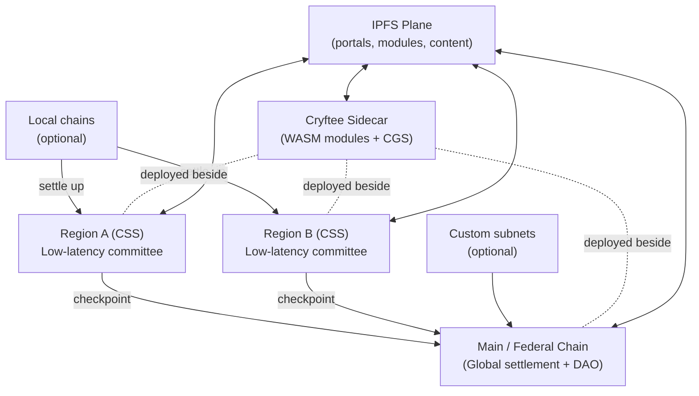
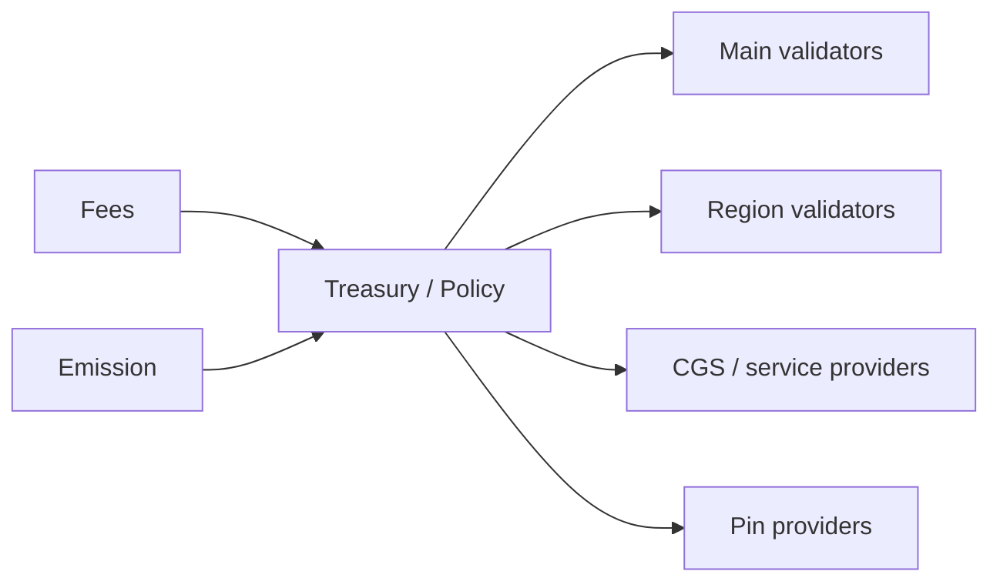

# CryftNet (Cryft Network) Whitepaper

**Version:** v1.6 (GitHub edition)  
**Based on:** v1.5 (January 02, 2026)  
**Status:** Draft  
**Authors:** Cryft Labs (Draft)

> This document is a technical design proposal. Some subsystems (notably CGS privacy and CRVS consensus) are specified as implementable designs, but require validation via simulation, formal review, and security audits before production use.

## 0.1 Revision history

| Version | Date | Notes |
|---|---|---|
| v1.6 | January 02, 2026 | GitHub edition: reformatted as Markdown for version control; adds an optional “overlay mesh transport” note (Nebula as a reference implementation) without making it consensus-critical. |
| v1.5 | January 02, 2026 | Initial consolidated draft including Smart Slots, CRVS consensus proposal, CGS, Cryftee modules, IPFS pinning rewards, and cross-network federated DAO governance. |

## Contents

- [1. Abstract](#1-abstract)
- [2. Design goals and non-goals](#2-design-goals-and-non-goals)
- [3. Background and problem statement](#3-background-and-problem-statement)
- [4. System overview](#4-system-overview)
- [5. Network model and latency strategy](#5-network-model-and-latency-strategy)
- [6. Consensus and finality model (CRVS proposal)](#6-consensus-and-finality-model-crvs-proposal)
- [7. Execution layer: EVM compatibility and deterministic parallelism](#7-execution-layer-evm-compatibility-and-deterministic-parallelism)
- [8. Standard subnet model vs custom subnets](#8-standard-subnet-model-vs-custom-subnets)
- [9. Cantons Global Synchronizer (CGS)](#9-cantons-global-synchronizer-cgs-privacy-propagation-and-federation-sync)
- [10. Cross-chain communication and settlement](#10-cross-chain-communication-and-settlement)
- [11. Asset model, rewards, and monetary policy](#11-asset-model-rewards-and-monetary-policy)
- [12. Governance: federated DAO and cross-network democracy](#12-governance-federated-dao-and-cross-network-democracy)
- [13. Cryftee: signed WASM module runtime for chain utilities](#13-cryftee-signed-wasm-module-runtime-for-chain-utilities)
- [14. Security model and threat analysis](#14-security-model-and-threat-analysis)
- [15. Implementation roadmap and engineering checklist](#15-implementation-roadmap-and-engineering-checklist)
- [16. Appendices](#16-appendices)

## 1 Abstract

CryftNet (Cryft Network) is a federation of blockchains designed to feel like Web2 in latency while
retaining cryptographic integrity and democratic governance. The network is anchored by a Main
(Federal) chain that provides global settlement, shared registries, and the primary validator DAO.
Regional chains ("States") are optimized for low-latency execution and confirmations within a
geographic or network-latency domain. Optional local chains ("Cities") can further reduce latency for
dense communities and settle upward. CryftNet is EVM compatible by default. It introduces an opt-in
deterministic parallel execution mechanism called Smart Slots with Process IDs. Transactions may
declare a process_id and explicit slot claims that map to EVM state (account, storage, or
application-defined resource slots). A deterministic scheduler uses these claims to safely parallelize
execution, confining contention to lanes when necessary while preserving identical results across
validators. Privacy and propagation are addressed by Cantons Global Synchronizer (CGS), a
Cryftee-hosted plane that supports privacy-aware intent gossip, selective disclosure, and region-local
privacy pools, while still enabling scheduling via slot commitments. Cryftee itself is a Rust-based
sidecar runtime that loads signed WASM modules from a manifest, provides a versioned API over
UDS or HTTPS, and includes a kiosk UI for operators. Cryftee modules supply chain utilities including
BLS/TLS staking operations, IPFS node management, and private synchronization. Economic
security is complemented by incentive alignment for availability: CryftNet includes explicit IPFS
pinning rewards. Pin providers register, bond stake, accept pin jobs, and earn rewards based on
verified availability proofs over time. The result is a federation where compute, consensus, privacy
propagation, and content availability are governed and incentivized rather than assumed.

## 2 Design goals and non-goals

### 2.1 Goals

- Web2-like perceived latency via region-local confirmation and routing.
- EVM compatibility for mainstream wallets and developer tooling.
- Deterministic, opt-in parallel execution without breaking legacy contracts.
- Federated governance: Main chain as primary DAO; subnets as local DAOs; cross-network
voting support.
- Privacy-aware propagation (CGS) that reduces metadata leakage and resists censorship.
- Practical operations: signed module system (Cryftee) to ship chain utilities safely.
- Availability of content and tooling via IPFS pinning incentives.
- Region eligibility measurement using pings so validators serve the region they claim.

### 2.2 Non-goals

- Claiming infinite TPS or zero-latency global finality.
- Forcing all subnets to conform to a single VM or single consensus mechanism.
- Mandatory TEEs for security (TEEs may be used but are optional).
- Perfect anonymity guarantees; privacy is treated as measurable and adversarially tested.
- Assuming IPFS persistence without explicit incentives.

## 3 Background and problem statement

Global blockchains face two constraints: physics and contention. The speed of light and the Internet's
routing behavior impose a lower bound on propagation. At the same time, many workloads contend
on shared state (balances, nonces, popular contracts). Larger validator committees increase security
but also increase coordination time and validation bandwidth, creating diminishing returns on latency.
CryftNet treats latency domains as a design primitive. Instead of forcing one global committee to
finalize everything, regional committees provide fast local confirmations for nearby users. The Main
chain acts as a global settlement and governance anchor: regions periodically checkpoint upward,
enabling cross-region settlement without requiring every transaction to wait for global propagation.
Parallel execution is a complementary axis. EVM semantics are serial; naive parallelism breaks
determinism and can lead to chain splits. CryftNet introduces Smart Slots: explicit read/write claims
that enable deterministic, validator-consistent scheduling. When contracts cannot be parallelized,
they fall back to serial lanes. Modern networks also depend on content distribution: portals, module
artifacts, and application assets. IPFS makes this content-addressed and tamper-evident, but
availability remains an economic problem. CryftNet includes pinning rewards and auditable
availability proofs so that "the network stays alive" is not a matter of goodwill.

## 4 System overview

CryftNet is organized as a federation: - Main / Federal Chain: canonical settlement, cross-chain
registries, global governance, and final anchor of shared state. - Regional chains: low-latency
committees tuned for users within a latency domain. Most user activity is expected to be region-local
and finalizes quickly. - Local chains: optional, for dense communities or enterprise enclaves. These
settle to a region. - Cryftee plane: a sidecar runtime deployed alongside validators and infrastructure
nodes, hosting signed modules and CGS. - IPFS plane: content-addressed distribution for portals,
modules, and application assets, with incentives for availability.

**Figure 1: CryftNet federation overview (conceptual)**



Main and regions are linked by checkpointing. Regions confirm locally, then periodically anchor a
signed checkpoint to Main. Cross-region transfers use these checkpoints and standard message
formats. The federation is "edge-like" in the sense that regions provide fast service nearby, but it
avoids centralized operators: validator sets are governed by DAOs and measured for eligibility using
network performance signals.

## 5 Network model and latency strategy

### 5.1 Regions as latency domains

A region is defined as a set of validators and routing policies optimized for a latency domain. The
domain can be geographic (e.g., Midwest US) or network-derived (e.g., a set of AS paths). The key
requirement is that a significant portion of users experience low RTT (round-trip time) to a sufficient
number of regional validators.
### 5.2 Validator eligibility via ping measurements

To prevent a "region" from being nominal only, CryftNet uses ping-based eligibility. A validator is
eligible for Region R only if it can demonstrate sustained low-latency connectivity to a quorum of
Region R measurement beacons.
Mechanism (proposal): 1) Region R maintains a Beacon Set: B = {b1..bm}. Beacons are run by
independent operators approved by the region DAO and optionally co-hosted by regional validators.
2) During each epoch, validators perform signed ping sessions to beacons using a fixed protocol
(e.g., QUIC PING or UDP echo with replay protection). Beacons also ping validators. 3) Beacons emit
signed measurement reports containing distribution summaries (p50, p95, loss rate, jitter) and
timestamps. 4) Validators submit an aggregated proof to the region chain. The chain computes an
Eligibility Score.
```text
EligibilityScore(v, R) =

  w1 * clamp(1 - p95_rtt(v,R)/RTT_MAX, 0, 1)
+ w2 * clamp(1 - loss(v,R)/LOSS_MAX, 0, 1)
+ w3 * clamp(1 - jitter(v,R)/JITTER_MAX, 0, 1)
+ w4 * beacon_quorum_ok(v,R)
Constraints:
- beacon_quorum_ok requires at least q of m beacons reporting in-window measurements.
- reports are signed by beacons and include nonces to prevent replay.
Eligibility is not a gate for all subnets. It is specifically used by region DAOs (especially CSS regions)
to ensure their validator sets are actually region-serving. Validators may participate in Main and in
multiple regions, but each region can enforce its own RTT thresholds and scoring. Mitigations against
gaming include: multi-beacon diversity, random challenge timing, cross-check pings from validators to
each other, and penalties for detected proxy/VPN abuse.
```

### 5.3 User routing and failover

Clients choose a region through a combination of DNS hints, signed region metadata (published on
Main), and direct latency probing. If a region degrades (beacon reports, missed blocks, or poor p95),
clients fail over to a nearby region or to the Main chain for safety-critical operations. Regions can also
choose to temporarily increase anchoring frequency to Main during instability.
### 5.4 Diminishing returns: why committee size has a ceiling

For a fixed network, increasing validators increases message fanout and signature verification cost.
Beyond a point, latency improves more by splitting into regions than by growing a single committee.
CryftNet therefore expects: - Main: moderate committee size optimized for security and global
settlement cadence. - Regions: smaller committees optimized for p50/p95 latency. - Local chains:
smallest committees, often for specialized workloads.
### 5.5 Optional overlay mesh transport (Nebula reference implementation)

CryftNet’s *architecture* only assumes an authenticated, low-jitter transport between validators and supporting services (Cryftee, beacons, pin auditors). It does **not** require any specific overlay network. However, an overlay mesh can be a pragmatic way to:

- reduce reliance on public IP exposure (validators can keep private addressing and still form a stable mesh),
- enforce mutual authentication and segmentation via cryptographic identities and groups,
- standardize private service discovery for operator tooling and Cryftee modules (UDS/HTTPS endpoints),
- provide an operational “back channel” for upgrades, telemetry, and incident response.

A concrete candidate is **Nebula** (a WireGuard-style encrypted mesh with lighthouses and optional relays). Recommended stance:

- **Consensus plane:** prefer direct, performance-tuned UDP/QUIC links on public or private underlay whenever possible. If Nebula is used for consensus traffic, it should be *measured* and treated as a tunable deployment choice because overlays can add jitter and introduce relay-path outliers.
- **Control plane:** Nebula is an excellent fit (Cryftee management API, beacons, pin-auditor coordination, internal RPC, dashboards), because security and operability dominate micro-latency.

Latency note: Nebula typically adds only small per-packet overhead (encryption + encapsulation). The real risk is *path inflation* when traffic hairpins through lighthouses/relays or when MTU issues cause fragmentation. These risks should be monitored via the existing ping/eligibility telemetry and treated like any other transport variable.

Security note: the main advantage is **cryptographic identity at the network layer** (mutual auth, key rotation, segmentation) and the ability to keep services non-public while still reachable by authorized peers. It is not a substitute for protocol-layer authentication; it is a defense-in-depth layer.

## 6 Consensus and finality model (CRVS proposal)

CryftNet's consensus design aims to combine fast propagation, low coordination overhead, and rapid
finality within regions. We propose a stack nicknamed CRVS: Cryft Rotor-Votor Snow. It combines: -
Rotor-like propagation: efficient dissemination of candidate blocks and transaction data using rotating
relay roles. - Votor-like voting: fast-path vote aggregation for quick finality and slow-path recovery
during partial synchrony. - Avalanche-style metastable sampling: leaderless or low-leader
coordination where nodes repeatedly sample peers and converge on a preferred candidate with high
probability.
### 6.1 Data propagation plane (rotor-inspired)

Propagation is about moving bytes, not deciding truth. CRVS uses rotating relays to reduce
redundant broadcast. Relays are chosen deterministically per round (e.g., hash of epoch, round, and
validator key). Relays are not authorities: they only accelerate dissemination. If relays fail or censor,
fallback is direct gossip.
Inputs:
- committee V of size n
- round r within epoch e

- relay_count t (e.g., 3-7)
```text
RelaySet(e,r) = smallest t validators by score( H("relay"||e||r||vk) )
Protocol:
1) proposer sends candidate header to RelaySet(e,r)
2) relays fetch missing tx data by content hash and broadcast compact references
3) peers request missing chunks; relays respond; peers also serve each other
Fallback: if relay responsiveness drops below threshold, revert to all-to-all gossip.
```

### 6.2 Candidate production: leaderless or soft-leader

CRVS can run in a leaderless mode where multiple proposers may submit candidate blocks for the
same slot. The network then converges on one candidate via voting/sampling. A soft-leader variant
reduces forks by selecting a preferred proposer, but nodes remain free to accept alternatives if the
leader is slow or censored.
Slot s:
- Any validator may propose candidate C = (header, tx_list, parent_ref)
- Valid candidates are those with valid parent_ref, correct block time window, and valid txs.
Deterministic tie-break:
```text
PreferredCandidateSet = all valid candidates seen within ∆propagate
Rank(C) = (slot s, H(C.header), proposer_vk)
Choose smallest Rank among candidates that reach vote threshold.
```

### 6.3 Voting and finality (votor-inspired fast/slow paths)

Voting determines finality. CRVS uses a two-path structure: Fast path: when network is healthy and
participation is high, validators aggregate votes quickly to finalize a candidate. Slow path: when
participation is partial or network is unstable, the protocol falls back to repeated rounds and higher
confirmation thresholds before finalizing. Votes are signed; aggregation may use BLS signatures to
reduce bandwidth, or threshold aggregation via Cryftee modules.
Definitions:
- quorum_fast = ceil(0.67 * n)          # target; tunable by governance
- quorum_slow = ceil(0.80 * n)          # more conservative
- rounds_fast = 1..2
- rounds_slow = up to Rmax (e.g., 8)
Fast path:
1) collect votes for candidate C during round r
2) if votes(C) >= quorum_fast and no conflicting candidate with >= quorum_fast, finalize C
Slow path:
1) repeat vote rounds; if conflict persists, prefer candidate with higher confidence score from
2) finalize when votes(C) >= quorum_slow for consecutive k rounds (k >= 2)
### 6.4 Metastable sampling (Avalanche-inspired)

Sampling reduces coordination overhead by replacing all-to-all agreement with repeated small
queries. Each validator periodically samples k peers and asks which candidate they currently prefer
for slot s (or which parent tip they prefer). If a candidate repeatedly exceeds an acceptance threshold
alpha across consecutive rounds beta, the node increases its confidence. This tends to produce
metastable convergence: once a majority leans one way, it becomes increasingly likely that the whole

network converges.
Parameters (example):
- k = 20               # sample size
- alpha = 15           # acceptance threshold (alpha <= k)
- beta = 12            # consecutive successful samples to decide
```text
Loop for slot s:
conf[C] = 0 for all candidates C
while not finalized:
  S = sample_k_peers()
  counts = query_preference(S, s)
  C* = argmax(counts)
  if counts[C*] >= alpha:
     conf[C*] += 1
  else:
     conf[C*] = max(conf[C*] - 1, 0)
  if conf[C*] >= beta:
     cast_vote(C*)
     (finalization still requires Section 6.3 thresholds)
```

### 6.5 Finality layering: region soft-finality vs Main hard-finality

Regions provide fast soft-finality (practically irreversible under normal operation). Main provides
hard-finality for cross-region settlement by accepting checkpoints. A checkpoint is a region-signed
commitment to a region block height and state root (or output root) plus proof of validator quorum.
Once Main finalizes a checkpoint, cross-region transfers referencing that checkpoint can be treated
as final under Main's security assumptions.

## 7 Execution layer: EVM compatibility and deterministic parallelism

### 7.1 Baseline EVM mode

CryftNet remains compatible with standard EVM transactions. Legacy transactions are executed
serially and need not include any Cryft-specific fields. Standard wallets and tooling continue to work
unmodified.
### 7.2 Parallel execution mode (opt-in)

Parallel mode is opt-in. A transaction may declare that it participates in deterministic parallel
scheduling by including: - process_id: identifies a workflow lane and namespace - slot_claims: explicit
read/write claims over state slots - slot_commitment: a commitment hash over slot_claims, enabling
private propagation via CGS
### 7.3 Smart Slots and Process IDs (canonical model)

Smart Slots represent the smallest schedulable units of state contention. The goal is not to perfectly
capture every possible data dependency, but to capture enough structure that most real workloads
can safely parallelize while maintaining determinism.

#### 7.3.1 Slot types

- Account Slot: derived from an address. Used for nonce, balance, and code hash transitions. Any
transaction that modifies an account's nonce or balance claims WRITE on the account slot.
- Storage Slot: derived from (contract_address, storage_key). Claims map to EVM
SLOAD/SSTORE keys. A transaction that writes a given key claims WRITE on that slot; reads
claim READ.
- Object/Resource Slot: derived from an application resource ID (e.g., gift_code_id). Used when
an app wants parallelism without over-claiming whole accounts.
#### 7.3.2 Slot derivation

Slot IDs are computed by hashing a canonical encoding. The encoding includes a domain separator,
chain identity, scope, and type-specific data. Scope distinguishes Main from subnets (regions) and
prevents accidental collisions.
```text
slot_id = H(
  domain || chain_id || scope_id || process_id ||
  slot_type || addr || key || extra
)
Where:
- H() is keccak256 (or another fixed hash function) over bytes.
- domain is a constant ASCII tag, e.g., "CRYFT:SLOT:V1"
- chain_id identifies the chain (Main or subnet).
- scope_id = 0 for Main; = subnet_id (or region_id) for subnets.
- slot_type in {ACCOUNT, STORAGE, OBJECT}
- addr/key/extra are type-dependent fields.
Worked input composition examples (illustrative):
Example A (Account Slot): domain='CRYFT:SLOT:V1' | chain_id=1 | scope_id=0 | process_id='payment
Example B (Storage Slot): domain='CRYFT:SLOT:V1' | chain_id=1001 | scope_id=42 | process_id='gif
```

#### 7.3.3 Process IDs

A process_id identifies a workflow lane and its namespace. In the simplest case, process_id is a
human-readable string namespaced by the publisher, e.g., "cryft.giftcodes.v1". Governance may
reserve process_id prefixes for critical system workflows. A process_id can also be derived
deterministically from a contract address and ABI signature, but string-based IDs improve auditability.
#### 7.3.4 Transaction format extensions

Legacy transactions are unchanged. Parallel transactions add an envelope. Example (JSON-like):
```jsonc
// 1) Legacy transaction (unchanged)
{
  "type": "legacy",
  "from": "0xAlice",
  "to": "0xBob",
  "value": "0.05 ETH",
  "data": "0x",
  "gas": 21000,
  "nonce": 17
}

// 2) Parallel transaction with explicit slot claims
{
  "type": "cryft_parallel",
  "from": "0xAlice",
  "to": "0xGiftContract",
  "data": "0x<call redeem(code_id, ...)>",
  "gas": 250000,
  "nonce": 18,
  "process_id": "cryft.giftcodes.v1",
  "slot_claims": [
    {"slot_id": "0xSLOT(account:0xAlice)", "mode": "WRITE"},
    {"slot_id": "0xSLOT(object:gift_code:0xC0DE)", "mode": "WRITE"},
    {"slot_id": "0xSLOT(storage:0xGiftContract:0xKey1)", "mode": "READ"}
  ],
  "slot_commitment": "0xKECCAK(slot_claims_canonical_bytes)",
  "capabilities": ["cap:giftcodes.redeem.v1"],
  "conflict_policy": {"mode": "prelock"}
}
// 3) Private intent envelope (CGS) - claims committed, not revealed publicly until inclusion
{
  "type": "cryft_private_intent",
  "from": "0xAlice",
  "to": "0xGiftContract",
  "data_ciphertext": "0x...",
  "gas": 250000,
  "nonce": 18,
  "process_id": "cryft.giftcodes.v1",
  "slot_commitment": "0xKECCAK(slot_claims_canonical_bytes)",
  "reveal_policy": {"when": "on_inclusion", "scope": "validators_only"},
  "cgs_route": {"region_hint": 42, "privacy_pool": "midwest.v1"}
}
```

#### 7.3.5 Deterministic scheduling and conflict rules (pre-lock design)

CryftNet uses a deterministic pre-lock scheduler for parallel transactions. Validators must arrive at
identical schedules given the same mempool snapshot. The scheduler organizes transactions into
lanes by process_id and attempts to acquire READ and WRITE locks on slots. Locks are acquired in
sorted slot_id order to avoid deadlocks.
Inputs:
- mempool transactions T (including legacy and parallel)
- deterministic ordering key: (process_id, tx_hash, arrival_index)
1) Partition:
   Legacy = [t in T where t.type == legacy]
   Parallel = group by process_id: L[p] = sorted(t in T where t.process_id==p)
2) Initialize lock tables:
   read_locks[slot_id] = set()
   write_lock[slot_id] = optional owner
3) Build block:
   a) Schedule legacy txs serially in canonical order (e.g., tx_hash order).
   b) For each lane p in sorted(process_id):
        for tx in L[p]:
           if acquire_all_locks(tx.slot_claims):

                schedule tx in lane p (may run in parallel with other lanes)
           else:
                defer tx to next block (or later within block deterministically)
Acquire_all_locks(claims):
   for slot in sort_by_slot_id(claims):
       if claim.mode == READ:
           if write_lock[slot] is held by another tx: return false
       if claim.mode == WRITE:
           if write_lock[slot] held OR read_locks[slot] non-empty: return false
```jsonc
   // if all checks pass, take locks
   for slot in sort_by_slot_id(claims):
       if claim.mode == READ: read_locks[slot].add(tx_id)
       else: write_lock[slot] = tx_id
   return true
```

#### 7.3.6 Receipts and proofs

Receipts must prove how a transaction was scheduled and whether it conflicted. For parallel
transactions, receipts include: - lane (process_id) - lane_index (order within lane) - slot_claims_hash
(commitment) - revealed_slot_claims (if reveal policy allows; otherwise a reference) - lock_result
(acquired / deferred) - execution_result (status, logs, gas)
```jsonc
{
  "tx_hash": "0x...",
  "block": 123456,
  "type": "cryft_parallel",
  "process_id": "cryft.giftcodes.v1",
  "lane_index": 7,
  "slot_commitment": "0x...",
  "slot_claims_revealed": true,
  "slot_claims": [
    {"slot_id":"0x...", "mode":"WRITE"},
    {"slot_id":"0x...", "mode":"WRITE"}
  ],
  "lock_result": "acquired",
  "conflict_note": null,
  "status": "success",
  "gas_used": 184321
}
```

### 7.4 Handling normally non-parallel transactions

Not all workloads can be parallelized. Any transaction may choose to omit slot_claims and run in
legacy serial mode. Even in parallel mode, a transaction can intentionally over-claim (e.g., WRITE an
entire account slot) to ensure safety. This reduces parallelism but preserves determinism. Over time,
popular contracts can adopt more precise slot claims, or use Object slots for application-level
resources.
### 7.5 Developer experience and backward compatibility

Developers can adopt parallelism incrementally: - Phase 0: deploy standard Solidity contracts; use
legacy transactions. - Phase 1: clients attach slot claims for known call patterns (SDK supported). -
Phase 2: contracts emit recommended slot hints, or provide view methods to derive slot claims. -
Phase 3: high-value workflows use CGS private intents with slot commitments and selective

disclosure. MetaMask and standard JSON-RPC continue to work; parallel fields are optional
extensions.

## 8 Standard subnet model vs custom subnets

### 8.1 Cryft Standard Subnet (CSS-1)

CSS-1 is an optional standardized subnet profile intended to maximize interoperability, tooling
support, and federation services. CSS-1 chains are EVM compatible and adopt the canonical Smart
Slot model and CGS interfaces.
CSS-1 guarantees: - EVM JSON-RPC compatibility - Smart Slot envelope support (process_id,
slot_claims, slot_commitment) - Deterministic scheduling rules (pre-lock) - Standard checkpoint
format for anchoring to Main - Compatibility with federation registries and pinning reward primitives
### 8.2 CEP-CSS-1: standardized execution profile

CEP-CSS-1 is a versioned specification published on Main and adopted by CSS chains. It defines: -
slot derivation domain tags and hashing rules - required receipt fields for parallel txs - scheduler
determinism constraints - CGS message types required for private intents - upgrade signaling and
compatibility windows
### 8.3 Custom subnets

Custom subnets may use any VM and any consensus mechanism. They are first-class citizens.
However, to receive federation services (bridging, registry listing, standardized tooling), a custom
subnet can publish a Federation Interface Declaration (FID) on Main.
FID fields (example): - subnet_id, chain_id, VM type - consensus summary and security assumptions
- checkpoint proof model (signatures, light client, validity proof) - message format for cross-chain calls
- asset mapping and replay protection rules - CGS compatibility level (none / partial / full)
### 8.4 Compatibility certification

The federation may offer optional certification for custom subnets. Certification is not a gate to
existence; it is a promise to users and tooling providers. Certified subnets may receive default routing,
shared libraries, and aggregated dashboards.

## 9 Cantons Global Synchronizer (CGS): privacy propagation and federation sync

CGS is a Cryftee-hosted plane for privacy-aware propagation of intents and synchronization across
regions. It is inspired by canton-style private synchronization in the sense that parties coordinate over
domains and reveal only what is necessary to authorized participants. CGS is not "magic privacy"; it
is a structured messaging and keying system that aims to reduce the amount of public metadata
required for transaction inclusion and cross-chain coordination.

### 9.1 Core design constraints

- Must not break EVM compatibility: legacy transactions remain public and unchanged.
- Must provide liveness under partial censorship: multiple routes, region fallbacks, and
anti-correlation strategies.
- Must limit metadata leakage: minimize public exposure of counterparties, resource IDs, and full
slot claims.
- Must support deterministic scheduling: even private intents require commitments that can be
verified later.
### 9.2 CGS message types (proposal)

CGS defines a small set of message types carried over a privacy-aware gossip layer. Messages are
content-addressed where possible, and large payloads may be stored on IPFS with encrypted
references.
- IntentEnvelope: encrypted transaction intent plus slot_commitment and minimal routing hints.
- RevealClaims: reveals slot_claims to validators (or to an auditor committee) at inclusion time.
- KeyRotate: rotates threshold encryption keys for a privacy pool or region domain.
- AvailabilityAttestation: posts aggregated availability/pinning attestations without revealing
private CID details.
- SyncRequest / SyncConfirm: domain synchronization for multi-party workflows.
- DisputeBundle: evidence package for fraud/slashing (signed transcripts, challenge failures,
etc.).
### 9.3 Metadata visibility matrix

| Field | Public observers | Region validators | Main validators | Counterparties | Pin auditors |
|---|---|---|---|---|---|
| Sender address | Legacy: yes; CGS: optional | yes (for inclusion) | only if anchored and required | yes | no |
| Recipient address | Legacy: yes; CGS: optional | yes (for execution) | only if required | yes | no |
| CID of pinned content | public pin job: yes; private pin: commitment only | auditor-only for private pin | aggregate only | optional | auditor yes |
| Proof responses (pin challenges) | public: yes; private: auditor-posted aggregate | yes | yes (if disputed) | no | yes |

### 9.4 Selective disclosure

Selective disclosure means revealing the minimum needed, at the latest safe time, to the minimum
required audience. Examples: - A private intent may reveal slot_claims only to region validators at
inclusion time, while the public chain sees only a commitment. - A private pin job may reveal the CID
only to selected pin providers and auditors; the chain stores only a commitment and aggregated

scores. Selective disclosure is constrained by verifiability: when disputes arise, evidence may need to
be revealed to Main or to a court-like committee.
### 9.5 CGS and Smart Slots via slot commitments

Slot commitments bridge privacy and determinism. A private intent includes slot_commitment =
H(canonical(slot_claims)). Validators can: 1) reserve scheduling capacity using the commitment
(without seeing claims), 2) require RevealClaims during inclusion, and 3) verify that revealed claims
match the commitment before executing.
Intent submission:
- client computes slot_claims and slot_commitment
- client encrypts tx data to pool key K_pool (threshold key)
- sends IntentEnvelope(process_id, slot_commitment, ciphertext, routing_hint)
Inclusion:
- proposer selects intent by commitment and policy
- proposer requests RevealClaims from sender (or authorized party)
- proposer verifies H(revealed_claims) == slot_commitment
- scheduler runs pre-lock acquisition on revealed_claims
- if acquired, execute tx and include receipt linking to commitment
### 9.6 Anti-censorship and liveness

CGS uses multi-route gossip and region fallbacks. If Region A appears censored, intents can be
routed to Region B or to Main, then forwarded. Privacy pools should avoid single points of control:
threshold keys are managed by committees with rotation. Residual risk remains: any privacy system
can be degraded by global adversaries controlling network paths; CryftNet treats this as measurable
and provides monitoring via Cryftee modules.
### 9.7 Failure modes and residual risk

- Metadata leakage through timing and traffic analysis (mitigate with batching and cover traffic).
- Threshold key compromise (mitigate with rotations, HSM/TEE options, and slashing).
- Denial of service via junk intents (mitigate with fees, rate limits, and capability gating).
- Complexity risk: CGS must not be consensus-critical without extensive validation.

## 10 Cross-chain communication and settlement

### 10.1 Checkpoint format

Regions anchor to Main via checkpoints. A checkpoint commits to: - region_id and chain_id - region
block height h and block hash - region state root (or output root) at height h - validator quorum proof
(aggregated signature or threshold proof) - optional summary of outgoing messages (message root)
Checkpoint = {
  region_id: 42,
  chain_id: 1001,
  height: 8_240_112,
  block_hash: 0x...,

  state_root: 0x...,
  message_root: 0x...,
  quorum: { type: "BLS_AGG", signers_bitmap: 0x..., sig: 0x... },
  epoch: 771,
  ping_epoch: 771,          // binds validator eligibility measurements
  metadata: { cep_css: "1.0.0" }
}
### 10.2 Message passing guarantees

Messages from Region A to Region B are routed through Main for final settlement. The guarantee is:
- If a message is included in a checkpoint finalized on Main, it is globally ordered relative to other
finalized checkpoints. - Regions may implement local fast-path transfers (optimistic) but must
reconcile with Main anchoring to prevent fraud.
### 10.3 Replay protection and ordering

Replay protection uses (origin_chain_id, origin_height, message_index) as a unique identifier.
Destination chains maintain a consumed set keyed by this tuple. Ordering constraints are defined by
the origin chain's checkpoint. Destination chains may choose strict ordering (process sequentially) or
relaxed ordering (parallelizable) depending on the message type.
### 10.4 Interaction with CGS

CGS can carry private envelopes for cross-chain intents. However, settlement proofs must eventually
become verifiable on-chain. A private cross-chain transfer therefore separates: - private negotiation
and intent propagation (CGS), - public commitment and checkpointing (region and Main), - selective
disclosure only when required for validation or disputes.

## 11 Asset model, rewards, and monetary policy

### 11.1 Native gas asset across the federation

CryftNet uses a native gas asset (denoted CRYFT in this document) for transaction fees on Main and
on CSS chains by default. Custom subnets may use alternative fee assets, but must publish their fee
asset policy in their Federation Interface Declaration. A consistent fee asset simplifies routing, pricing,
and cross-chain UX, but is not mandatory for all subnets.
### 11.2 Fee markets

There are multiple fee markets: - Execution fees: EVM gas fees on Main and on subnets. - Settlement
fees: fees for anchoring checkpoints and relaying cross-chain messages. - CGS fees: fees for private
intent propagation, threshold services, and spam resistance. - Storage/pinning fees: budgets
attached to pin jobs for IPFS availability.
### 11.3 Validator rewards: Main and regions

Reward sources are a sum of: - base emission (optional): E_epoch - transaction fees: F_epoch (gas
fees) net of burns (if any) - settlement fees: S_epoch - treasury subsidies: T_epoch (optional) Let

```text
R_epoch = E_epoch + F_epoch + S_epoch + T_epoch. Rewards are split: - Main validator set:
R_main = R_epoch * w_main - Region validator sets: R_regions = R_epoch * w_regions (distributed
among participating regions by activity and stake) - CGS service providers: R_cgs = R_epoch *
w_cgs - Pin providers: R_pin = P_epoch (separately budgeted by pin jobs, plus optional treasury
top-ups) Where w_main + w_regions + w_cgs <= 1; remaining may be burned or sent to treasury.
Example weight policy (governance-controlled):
w_main   = 0.35
w_regions= 0.45
w_cgs    = 0.10
w_treas  = 0.10   // treasury accumulation
(These are illustrative, not fixed.)
Within a validator set, rewards are distributed by a combination of stake weight and performance: -
stake_weight(v) based on bonded stake (and delegated stake where supported) - perf(v) based on
uptime, vote participation, relay responsiveness, and (for regions) eligibility score from pings
RewardShare(v) = stake_weight(v)^a * perf(v)^b / Z with exponents a,b set by governance (typical: a
near 1, b in [0.3, 1.0]).
```

**Figure 2: Reward flows (illustrative)**



### 11.4 IPFS pinning rewards: availability as a protocol primitive

CryftNet treats IPFS availability as a rewarded service rather than a background assumption. Pinning
rewards are designed to keep critical content (portals, module binaries, and app assets) available
with measurable reliability. Key components: 1) Pin Provider Registry: providers stake/bond and
advertise a service endpoint (or declare they operate via Cryftee ipfs_v1). 2) Pin Jobs: on-chain
contracts describing what to pin, how long, replication targets, and budgets. 3) Proof of Availability:
periodic challenges and attestations to verify that providers can actually serve the pinned content. 4)
Reward distribution and slashing: providers earn per-epoch rewards based on verified availability;
repeated failure or fraud is penalized.
#### 11.4.1 Pin Provider Registry

Providers register on Main or on a CSS region chain (or both). Registration includes: - provider_id
(pubkey or address) - service endpoint metadata (optional; can be hidden for private providers) -
supported regions / latency hints - bonded stake and slashing terms - supported proof method
(challenge-response, auditor, or hybrid)
PinProvider {
  provider_id: 0xPubKey,
  stake_bond: 10000 CRYFT,
  endpoints: ["https://pin.midwest.example", "ipfs-peer:12D3KooW..."],
  regions: [42],                   // optional
  proof_method: "HYBRID",
  max_jobs: 1000,
  terms: { slash_missed: 0.1%, slash_fraud: 5%, grace: 2 epochs }
}
#### 11.4.2 Pin Jobs and markets

A pin job is a contract created by a user/app/treasury. Jobs can be public or private. Public job: CID is
visible on-chain. Private job: chain stores only a commitment; CID is disclosed to selected providers
via CGS envelopes.
PinJob {
  job_id: 771_000_0042,
  cid_or_commitment: "cid:Qm..." | "commitment:0x...",
  replication_target: 7,
  duration_epochs: 4320,            // e.g., 30 days if epoch=10min
  budget: 2500 CRYFT,
  region_hint: 42,
  privacy: { mode: "public" | "private", auditors: [a1,a2,a3] },
  sla: { max_p95_retrieval_ms: 400, min_availability: 0.98 }
}
#### 11.4.3 Proof of Availability (hybrid scheme)

Primary proposal: Hybrid challenge-response plus auditor sampling. - The chain (or a region
committee) issues challenges derived from a randomness beacon. - Each challenge references the
CID and a random block index. Providers must return a proof within a time window. - Auditors
randomly verify a subset by fetching content from the provider and comparing hashes. Auditors then
sign attestations. This avoids trusting providers alone while limiting on-chain bandwidth.
Challenge(epoch, job_id, provider_id):
  idx = H(rand || provider_id) mod N_blocks
  nonce = H(rand || "nonce" || provider_id)
ProviderResponse:

```jsonc
{
  job_id: ...,
  provider_id: ...,
  epoch: ...,
  idx: ...,
  nonce: ...,
  // proof depends on chunking scheme:
  // - block_hash + raw block bytes OR
  // - merkle proof if CID references a merklized DAG
  block_hash: 0x...,
  block_bytes_b64: "...",
  sig: Sign(provider_sk, H(job_id||epoch||idx||nonce||block_hash))
}
AuditorAttestation:
{
  job_id: ...,
  provider_id: ...,
  epoch: ...,
  checked: true,
  retrieval_ms_p95: 312,
  ok: true,
  auditor_sig: Sign(auditor_sk, H(...))
}
```

#### 11.4.4 Availability scoring and rewards

Providers earn rewards based on an Availability Score computed per job per epoch. Score =
0.5*success_rate + 0.3*audit_ok + 0.2*latency_score + diversity_bonus Reward(job, provider, epoch)
= (job_budget_per_epoch) * Score / sum_provider_scores
job_budget_per_epoch = job.budget / job.duration_epochs
If provider misses challenges:
- apply slash_missed per epoch beyond grace
If fraud proven (forged response or impossible content):
- slash_fraud and ban provider for ban_epochs
#### 11.4.5 Pinning and portals/IPNS

Critical CryftNet web portals and module artifacts are content-addressed and often referenced via
IPNS keys. To keep "latest portal" reliable, the network can: - pin the portal index CID set referenced
by the current IPNS record, - additionally pin the last N historical portal versions for rollback
resilience, - run private pin jobs for sensitive modules or private portals, using CGS to reveal CIDs
only to authorized providers. Pinning rewards thus become part of the chain's operational backbone.

## 12 Governance: federated DAO and cross-network democracy

CryftNet governance is federated. The Main chain hosts the primary DAO that defines
federation-wide rules, registries, and security parameters. Each subnet/region can host its own DAO
for local parameters. The key design tension is: - local autonomy for regions and custom subnets, -
global coordination for shared UX, security, and registries. The governance system therefore
distinguishes: Federation Proposals vs Local Proposals.

### 12.1 Federation Proposals (Main chain)

Federation Proposals affect the shared layer: - protocol upgrades for Main (CRVS params, scheduler
rules, checkpoint format) - registry changes (region list, subnet listings, certification programs) - global
economic parameters (emission schedule, base fee policy, treasury policy) - Cryftee trust roots:
publisher allowlists, GitHub verification policy - global CGS standards (message formats, key rotation
cadence) - disputes and slashing appeals that affect cross-chain trust
### 12.2 Local Proposals (Regions and subnets)

Local Proposals affect a single subnet or region: - committee membership policies and staking
minimums - ping beacon set membership and RTT thresholds - local fee policies and subsidy
allocation - local pinning reward programs and auditor committees - optional features (e.g., enabling
CGS pools, enabling parallel tx envelope by default)
### 12.3 The Federated DAO: broader votes across all networks

Federation governance is strengthened by including votes from across the federation, not only Main
validators. Proposal: a two-chamber model with cross-network aggregation. Chamber A: Validator
Council (Main) - stake-weighted vote of Main validators - optimized for rapid security decisions and
technical upgrades Chamber B: Federation Assembly (All networks) - voting power aggregated from
regions and certified subnets - allows broader representation of users and local validator sets - each
network may choose its own internal voting method, then export a signed aggregate to Main
#### 12.3.1 Cross-network vote export (Governance Adapters)

A subnet that wants to participate in federation governance registers a Governance Adapter on Main:
- adapter_type (EVM contract, validity proof system, or external committee) - vote_weight policy
(stake-based, token-based, mixed, or capped) - export format (signed root of votes, merkle proofs for
audits) - dispute and audit rules
VoteExport {
  proposal_id: 0xP...,
  subnet_id: 42,
  totals: { yes: 1_230_000, no: 120_000, abstain: 50_000 },
  eligible_weight: 1_500_000,
  merkle_root: 0x...,
  proof: { type: "SUBNET_QUORUM_SIG", sig: 0x..., signers: bitmap },
  timestamp: 1700000000
}
#### 12.3.2 Aggregation and decision rules

Main computes a final decision using both chambers. Example rule (illustrative): - A proposal passes
if: (ValidatorCouncil_yes >= 2/3 of stake AND Assembly_yes >= 1/2 of exported weight) OR
(ValidatorCouncil_yes >= 3/4) for emergency security patch class
### 12.4 Governance safety: timelocks, signaling, and staged activation

Upgrades and parameter changes use: - on-chain signaling period (days to weeks) - timelock before
activation - activation height for deterministic deployment - rollback plan and kill-switch conditions for
emergencies Regions may adopt federation upgrades on their own cadence, but CSS-1 compatibility

requires staying within supported version windows.
### 12.5 Validator eligibility governance via pings

Ping-based eligibility is itself governed. Regions can vote on: - which beacons are trusted -
RTT/loss/jitter thresholds (and how strict they are) - how eligibility affects rewards (e.g., linear scaling
vs hard gate) - penalties for falsified measurement attempts Main can set federation minimums to
prevent "fake regions" that degrade user routing or security assumptions.
### 12.6 Dispute resolution and appeals

Some decisions require adjudication: - slashing disputes (validator misbehavior, pin provider fraud,
CGS key compromise) - governance export disputes (subnet reported totals vs audited votes)
CryftNet may use a "court-like" committee elected by federation governance. The committee can
require selective disclosure of evidence (CGS DisputeBundle). Decisions are recorded on Main and
can trigger slashing or registry changes.

## 13 Cryftee: signed WASM module runtime for chain utilities

Cryftee is a Rust-based TEE-style sidecar runtime designed to integrate with cryftgo and
Web3Signer. It is deliberately stateless: it does not store long-term secrets on disk and instead relies
on external key managers (Web3Signer, Vault) or ephemeral key material. Cryftee loads signed
WASM modules from a manifest and exposes a versioned API over UDS or HTTPS. It also ships with
a kiosk-style web UI for operators on port 3232.
### 13.1 Why a sidecar runtime?

- Keeps the consensus client lean: consensus and execution code stays minimal; auxiliary features
live in modules.
- Upgrades and experiments are safer: modules are signed and version-gated; incompatible code
can be rejected.
- Operational consistency: the same module APIs can be used across Main and subnets.
- Security boundaries: key operations can be isolated behind Web3Signer and attestation hooks.
### 13.2 Runtime properties

- Loads and manages signed WASM modules from a manifest.json registry.
- Provides BLS/TLS staking key operations via modular plugins.
- Exposes a versioned API over Unix Domain Socket (default) or HTTPS.
- Includes a kiosk web UI on port 3232 with per-module GUIs rendered as tabs.
- Enforces version compatibility (minCryftteeVersion) and publisher trust.
### 13.3 Embedding CGS inside Cryftee


CGS is embedded in Cryftee in two layers: - A CGS core service in the runtime that manages routing,
pools, and key rotation schedules. - A set of modules (starting with private_sync_v1) that implement
domain logic: party registration, tx submit/confirm, view requests, and mediator flows. This mirrors
canton-style constructs while remaining pluggable. Embedding CGS in Cryftee keeps the
synchronizer close to the validator, reducing latency and enabling tight integration with mempool
selection and Smart Slot scheduling (via slot commitments).
### 13.4 Trust model: signed modules and publisher verification

All modules are verified before load: - hash verification against manifest.json - signature verification
(Ed25519) against trust.toml or - GitHub-based verification (signed commits, CI builds, attestations)
under policy Rejected modules do not load and do not affect runtime stability.
```jsonc
// trust.toml (example)
[[publishers]]
id        = "cryft-labs"
algo      = "ed25519"
publicKey = "BASE64_PUBLIC_KEY_HERE"
[[github_publishers]]
id                     = "cryft-labs"
github_org             = "cryft-labs"
allowed_repos          = ["cryfttee-modules"]
require_signed_commits = true
require_actions_build  = true
allowed_workflows      = ["release.yml"]
allow_prereleases      = false
```

### 13.5 Initial module set (v0.4.x runtime)

The initial module set provides staking, diagnostics, IPFS services, redeemable codes, and private
synchronization. Modules may include GUIs served through the kiosk interface and sandboxed in
iframes.

| Module | Version | Purpose | Representative capabilities |
|---|---|---|---|
| bls_tls_signer_v1 | 1.2.0 | BLS + TLS staking module with Web3Signer integration and module signing | bls_register, bls_sign, bls_verify, tls_register, tls_sign, tls_verify, sign_module |
| debug_v1 | 1.0.0 | Diagnostics and runtime inspection | debug_echo, debug_info, debug_panic |
| llm_chat_v1 | 1.0.0 | Operator assistance via LLM interface | llm_chat, llm_stream |
| ipfs_v1 | 2.0.0 | Embedded IPFS node management (full/light modes) | node_start, ipfs_add, ipfs_pin, ipns_publish, peer_connect |
| redeemable_codes_v1 | 1.0.0 | On-chain redeemable gift code system | code_generate, code_redeem, code_freeze, validator_code_redeem |
| private_sync_v1 | 1.0.0 | Canton-style private transaction synchronizer (CGS domain module) | domain_create, party_register, tx_submit, view_decrypt, mediator_confirm |
### 13.6 API surface (summary)

Cryftee provides: - Staking endpoints (BLS/TLS register and sign) - Runtime endpoints (attestation,
schema, reload modules) - Module GUI endpoints The transport can be UDS (default) or HTTPS.
Staking:
POST /v1/staking/bls/register
POST /v1/staking/bls/sign

POST /v1/staking/tls/register
POST /v1/staking/tls/sign
GET  /v1/staking/status
Runtime/Admin:
GET  /v1/runtime/attestation
GET  /v1/schema/modules
POST /v1/admin/reload-modules
Module GUIs:
GET  /api/modules/{module_id}/gui/
### 13.7 Operational integration with cryftgo

cryftgo launches Cryftee as a child process and configures it via environment variables. cryftgo can
verify the Cryftee binary hash before launch and optionally require attestation for sensitive operations.
Core:
CRYFTTEE_MODULE_DIR=./modules
CRYFTTEE_MODULES=bls_tls_signer_v1,ipfs_v1,private_sync_v1
CRYFTTEE_API_TRANSPORT=uds
CRYFTTEE_UDS_PATH=/tmp/cryfttee.sock
Web3Signer:
CRYFTTEE_WEB3SIGNER_URL=http://localhost:9000
CRYFTTEE_WEB3SIGNER_TIMEOUT=30
Key derivation:
CRYFTTEE_KEY_SEED=<hex>
CRYFTTEE_NODE_ID=<node_id>
Security:
CRYFTTEE_VERIFIED_BINARY_HASH=sha256:<hex>
CRYFTTEE_REQUIRE_ATTESTATION=false

## 14 Security model and threat analysis

CryftNet security spans multiple planes: consensus, execution determinism, governance, privacy
propagation, and availability incentives. This section lists key threat classes and mitigations. It is not
exhaustive; it is a starting point for formal review.
### 14.1 Consensus threats

- Network partition: regions may split. Mitigation: slow-path voting, increased anchoring to Main,
conservative checkpoint acceptance.
- Relay censorship: rotor relays could delay data. Mitigation: relays are non-authoritative; fallback
gossip; relay performance affects rewards.
- Adaptive adversary: targets soft leaders. Mitigation: leaderless option; rotate relay sets; use
sampling.
### 14.2 Smart Slot threats


- Under-claiming: tx claims fewer slots than it touches, breaking determinism. Mitigation: runtime
detection where possible; slashing if provable; SDKs; contract-provided hints; conservative
policies for high-risk calls.
- Over-claiming: reduces parallelism (safe). Mitigation: tooling and incentives (lower fees for
precise claims).
- Slot collision: bad derivation leads to collisions. Mitigation: strict canonical encoding and domain
separators; versioned CEP.
### 14.3 CGS threats

- Traffic analysis: timing correlates sender/receiver. Mitigation: batching, cover traffic, delayed
reveals.
- Key compromise: threshold key compromised. Mitigation: frequent rotation; multi-party control;
optional HSM/TEE.
- Spam intents: adversary floods. Mitigation: fees, rate limits, capability gating, proof-of-work
optional.
- Complexity: bugs introduce consensus risk. Mitigation: keep CGS non-consensus-critical where
possible; staged rollouts.
### 14.4 Ping eligibility threats

- Proxy/VPN gaming: validator tunnels into region. Mitigation: multi-beacon diversity, random
challenges, jitter/loss scoring, correlation across peers.
- Beacon capture: beacons collude. Mitigation: beacon governance, rotating beacons, audits,
optional federation beacon set.
- Measurement falsification: forged reports. Mitigation: signed reports, nonces, on-chain
verification of signatures.
### 14.5 Pinning incentive threats

- Fake pin proofs: provider claims availability without serving. Mitigation: random challenges,
auditor fetches, fraud slashing.
- Sybil providers: same operator registers many providers. Mitigation: stake requirements, identity
policies, diversity bonuses weighted by independent attestations.
- Auditor corruption: auditors lie. Mitigation: multiple auditors, randomized sampling, auditor
staking and slashing.
### 14.6 Threat matrix (summary)

| Threat | Plane | Impact | Mitigation summary |
|---|---|---|---|
| Under-claimed slots | Execution | Nondeterminism / forks | SDK enforcement, audit, provable slashing, conservative policies |
| Relay censorship | Network | Delayed inclusion | Fallback gossip, performance-weighted rewards |
| Beacon capture | Eligibility | Fake regions | Beacon rotation, federation audits, quorum requirements |
| Pin provider fraud | Availability | Content loss | Challenge-response, auditors, slashing |
| CGS key compromise | Privacy | Disclosure risk | Threshold rotation, multi-party control, monitoring |
| Governance capture | Governance | Bad upgrades | Two-chamber votes, timelocks, veto and emergency policies |

## 15 Implementation roadmap and engineering checklist

This roadmap is a pragmatic decomposition into testable milestones. Each milestone should produce
artifacts: code, tests, benchmarks, and documented threat reviews. The checklist is intentionally
exhaustive: it is easier to delete items later than to discover them during an outage.
### 15.1 Milestone 0: Specification and simulation

- Finalize CEP-CSS-1 slot derivation and scheduler determinism rules.
- Define CRVS parameter ranges and implement a simulator (network + adversary models).
- Define checkpoint formats and message roots; build light verifier library.
- Define ping protocol (packet formats, nonce rules, signing, report encoding).
- Threat modeling workshops for Smart Slots, CGS, and pinning incentives.
### 15.2 Milestone 1: Main chain prototype

- Fork and bootstrap consensus client (cryftgo baseline) and integrate Cryftee sidecar launch.
- Implement Main chain registry contracts (regions, subnets, publishers, pin providers).
- Implement checkpoint acceptance contract and quorum verification (BLS aggregate or
equivalent).
- Implement governance framework (proposal lifecycle, timelocks, two-chamber vote scaffolding).
- Implement basic fee market and reward distribution accounting (no pinning yet).
### 15.3 Milestone 2: CSS-1 region chain prototype

- Implement CRVS region consensus prototype (fast/slow path; relay plane fallback).
- Implement Smart Slot envelope parsing and deterministic scheduler in the EVM engine.
- Add receipt extensions for parallel txs and commitment verification for CGS reveal.
- Implement region checkpoint producer and submitter to Main.
- Implement ping beacon set governance and eligibility scoring.
### 15.4 Milestone 3: CGS and private intents

- Implement CGS core service in Cryftee runtime (routing, pools, key rotation cadence).
- Implement private_sync_v1 module support for domains, parties, tx submit/confirm, view
requests.

- Implement slot commitment workflow: IntentEnvelope -> RevealClaims -> scheduler -> execution.
- Implement dispute bundles and evidence retention policies.
- Add observability: metrics, dashboards, and privacy leak tests (timing correlation).
### 15.5 Milestone 4: IPFS pinning rewards

- Implement Pin Provider Registry and bonding/slashing rules.
- Implement Pin Job contract (public + private job modes).
- Implement challenge-response protocol and auditor committee tooling.
- Integrate with Cryftee ipfs_v1 module for node management and pin operations.
- Launch testnet with real pin providers and measure availability + fraud attempts.
### 15.6 Milestone 5: Federation hardening and production readiness

- Formal verification / property tests for scheduler determinism and slot lock rules.
- Consensus adversarial simulations (network partitions, equivocation, relay censorship).
- Security audits for Cryftee runtime, module verification, and key management integrations.
- Governance audits: vote export integrity, aggregation correctness, and timelock safety.
- Operational playbooks: upgrades, rollback, emergency pause policies, key rotation procedures.
### 15.7 Whitepaper completeness checklist (for publication)

- Clear definitions: Main, region, subnet, local chain, Cryftee, CGS, Smart Slots.
- Consensus description: safety/liveness assumptions, parameters, and finality guarantees.
- Execution model: EVM compatibility, tx formats, scheduler determinism, receipts, and conflict
handling.
- Federation model: checkpoints, cross-chain messages, replay protection, bridging assumptions.
- Governance: chambers, vote export, aggregation rules, proposal lifecycle, and upgrade safety.
- Validator eligibility: ping protocol, beacon governance, scoring, and incentives.
- Economics: fee markets, reward splits, emissions, and slashing policies.
- IPFS incentives: pin provider registry, job format, proof scheme, scoring, and fraud handling.
- Privacy: CGS message types, metadata matrix, key management, and dispute evidence rules.
- Security: threat model, mitigation list, audit plan, and monitoring metrics.
- Roadmap: milestones, test plans, benchmarks, and deployment strategy.
- Appendices: glossary, parameter ranges, JSON schema definitions, and reference implementations.

## 16 Appendices


### 16.1 Glossary (selected)

- Main / Federal chain: The canonical settlement and governance anchor of the federation.
- Region chain: A low-latency chain serving a latency domain and anchoring to Main.
- CSS-1: Cryft Standard Subnet profile for interoperability.
- Smart Slot: A deterministic schedulable resource representing a state dependency.
- Process ID: A lane identifier and namespace for parallel scheduling.
- CGS: Cantons Global Synchronizer, the privacy-aware propagation and synchronization plane.
- Cryftee: Signed WASM module runtime sidecar providing chain utilities and CGS hosting.
- Pin provider: An operator who earns rewards by keeping content available on IPFS.
### 16.2 Key open questions (research and engineering)

- What is the best enforcement mechanism against under-claimed slots without making the EVM
slower (static analysis vs runtime tracing vs economic incentives)?
- What are optimal CRVS parameters under realistic Internet jitter for committees of size 50-500
across regions?
- How can CGS provide strong privacy guarantees without becoming consensus-critical
complexity?
- What is the most robust and low-cost proof of availability for IPFS DAGs at scale?
- How should cross-network vote weight be capped to prevent plutocracy while still being
Sybil-resistant?
End of document.