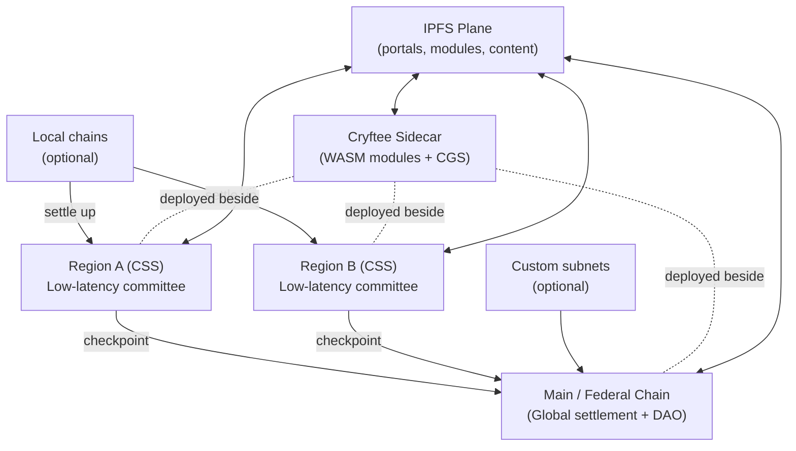
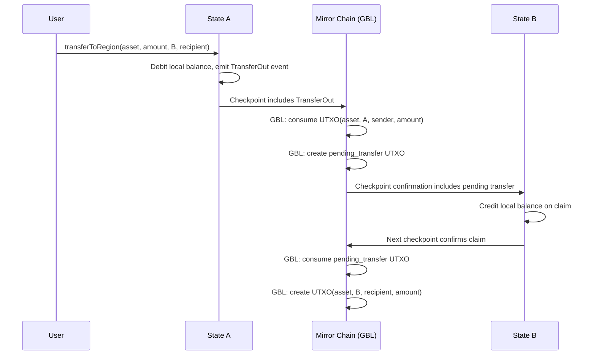
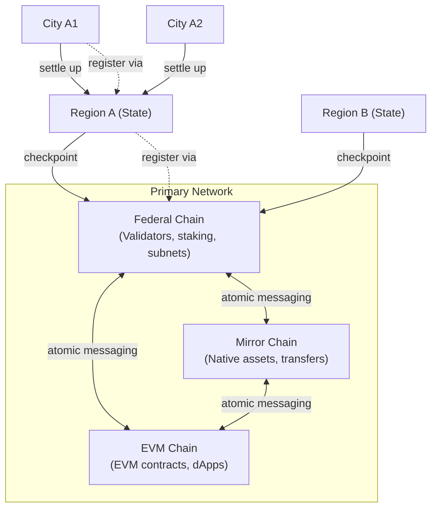
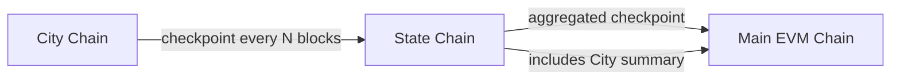
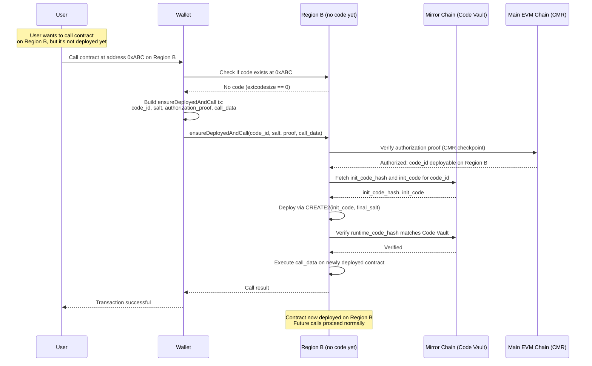
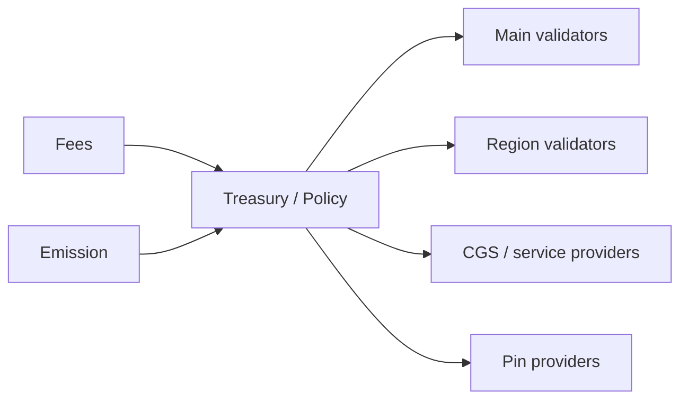

<h1 align="center">CryftNet (Cryft Network) Whitepaper</h1>

<p align="center">
<strong>Revision:</strong> v1.33<br>
<strong>Date:</strong> February 25, 2026<br>
<strong>Status:</strong> Draft (Production Audit Candidate)<br>
<strong>Authors:</strong> Cryft Labs (Draft)
</p>

<p align="center">
<strong>Latest Changes (v1.33):</strong> **PROOF OF WORK LAUNCH & ETHEREUM-STYLE MONETARY MODEL:** Federal Chain and Primary Network now launch with Proof of Work (SHA3-256, 10s blocks, 2 CRYFT/block) for fair distribution of network gas to early participants, transitioning to Snowman/PoS after bootstrap criteria met (>=3.2M CRYFT in circulation, >=6 months, >=500 unique miners, 67% governance approval). Supply cap removed -- CRYFT now has uncapped continuous issuance following Ethereum's proven model. PoW phase follows Ethereum's original economics (2015-2021): all transaction fees go directly to miners, no EIP-1559, no fee burn. EIP-1559 activates at PoS transition. Post-PoS: sqrt(total_staked) issuance curve + base fee burn. Genesis pre-allocation: 125M CRYFT (all locked until PoS transition). Minimum stake: 32,000 CRYFT. Updated Sections 4, 6, 11, 15, 16. Previous (v1.32): Cryftee module file reorganization.
</p>

<p align="center"><em>
This document is a technical design proposal. Some subsystems (notably CGS privacy and CRVS consensus) require validation via simulation, formal review, and security audits before production use.
</em></p>

---

## 1. Abstract

CryftNet (Cryft Network) is a federation of blockchains designed to feel like Web2 in latency while
retaining cryptographic integrity and democratic governance. The network is anchored by the **Primary Network**, which consists of three specialized chains: **(1) Federal Chain** for validator/subnet coordination and staking, **(2) Mirror Chain** for high-throughput native asset transfers and issuance, and **(3) EVM Chain** for EVM-compatible smart contract execution. When we say "EVM chain," we mean the EVM Chain specifically, not the entire Cryft network. This three-chain architecture prevents governance traffic, asset transfer traffic, and smart contract execution traffic from competing for the same bottleneck. Regional chains ("States") are optimized for low-latency execution and confirmations within a
geographic or network-latency domain. Optional local chains ("Cities") can further reduce latency for
dense communities and settle upward. CryftNet is EVM compatible by default. It introduces an opt-in
deterministic parallel execution mechanism called Smart Slots with Process IDs. Transactions may
declare a process_id and explicit slot claims that map to EVM state (account, storage, or
application-defined resource slots). A deterministic scheduler uses these claims to safely parallelize
execution, confining contention to lanes when necessary while preserving identical results across
validators. Privacy and propagation are addressed by Cryft Global Synchronizer (CGS), a
Cryftee-hosted plane that supports privacy-aware intent gossip, selective disclosure, and region-local
privacy pools, while still enabling scheduling via slot commitments. Cryftee itself is a Rust-based
sidecar runtime that loads signed WASM modules from a manifest, provides a versioned API over
UDS or HTTPS, and includes a kiosk UI for operators. Cryftee modules supply chain utilities including
BLS/TLS staking operations, IPFS node management, and private synchronization. Economic security is complemented by incentive alignment for availability: CryftNet includes explicit IPFS pinning rewards. Pin providers register, bond stake, accept pin jobs, and earn rewards based on verified availability proofs over time. The result is a federation where compute, consensus, privacy propagation, and content availability are governed and incentivized rather than assumed.


---

## 2. Design goals and non-goals

### 2.1 Goals

- Web2-like perceived latency via region-local confirmation and routing.
- EVM compatibility for mainstream wallets and developer tooling.
- Deterministic, opt-in parallel execution without breaking legacy contracts.
- Federated governance: Main chain as primary DAO; subnets as local DAOs; cross-network
voting support.
- Privacy-aware propagation (CGS) that reduces metadata leakage and resists censorship.
- Practical operations: signed module system (Cryftee) to ship chain utilities safely.
- Availability of content and tooling via IPFS pinning incentives.
- Region eligibility measurement using pings so validators serve the region they claim.

### 2.2 Non-goals

- Claiming infinite TPS or zero-latency global finality.
- Forcing all subnets to conform to a single VM or single consensus mechanism.
- Mandatory TEEs for security (TEEs may be used but are optional).
- Perfect anonymity guarantees; privacy is treated as measurable and adversarially tested.
- Assuming IPFS persistence without explicit incentives.


---

## 3. Background and problem statement

Global blockchains face two constraints: physics and contention. The speed of light and the Internet's
routing behavior impose a lower bound on propagation. At the same time, many workloads contend
on shared state (balances, nonces, popular contracts). Larger validator committees increase security
but also increase coordination time and validation bandwidth, creating diminishing returns on latency.
CryftNet treats latency domains as a design primitive. Instead of forcing one global committee to
finalize everything, regional committees provide fast local confirmations for nearby users. The Main
chain acts as a global settlement and governance anchor: regions periodically checkpoint upward,
enabling cross-region settlement without requiring every transaction to wait for global propagation.
Parallel execution is a complementary axis. EVM semantics are serial; naive parallelism breaks
determinism and can lead to chain splits. CryftNet introduces Smart Slots: explicit read/write claims
that enable deterministic, validator-consistent scheduling. When contracts cannot be parallelized,
they fall back to serial lanes. Modern networks also depend on content distribution: portals, module
artifacts, and application assets. IPFS makes this content-addressed and tamper-evident, but
availability remains an economic problem. CryftNet includes pinning rewards and auditable availability proofs so that "the network stays alive" is not a matter of goodwill.


---

## 4. System overview

CryftNet is organized as a federation:

- **Primary Network (Federal + Mirror + EVM):** The canonical foundation consisting of three chains: Federal Chain (validator/subnet management), Mirror Chain (native asset transfers), and EVM Chain (EVM smart contracts). Together they provide settlement, cross-chain registries, global governance, and the primary validator DAO.
- **Regional chains (States):** Low-latency committees tuned for users within a latency domain. Most user activity is expected to be region-local and finalizes quickly.
- **Local chains (Cities):** Optional, for dense communities or enterprise enclaves. These settle to a region.
- **Cryftee plane:** A sidecar runtime deployed alongside validators and infrastructure nodes, hosting signed modules and CGS.
- **IPFS plane:** Content-addressed distribution for portals, modules, and application assets, with incentives for availability.

**Figure 1: CryftNet federation overview (conceptual)**

This diagram shows the high-level federation architecture. The Primary Network (Federal Chain + Mirror Chain + EVM Chain) serves as the canonical settlement layer, with Regions providing low-latency service and optional Local chains for dense communities. Cryftee sidecars run alongside all validator nodes, hosting WASM modules and CGS. The IPFS plane provides content distribution across the network.



The Primary Network and regions are linked by checkpointing. Regions confirm locally, then periodically anchor a
signed checkpoint to Federal Chain. Cross-region transfers use these checkpoints and standard message
formats. The federation is "edge-like" in the sense that regions provide fast service nearby, but it
avoids centralized operators: validator sets are governed by DAOs and measured for eligibility using
network performance signals.

### 4.1 Primary Network architecture (Federal Chain + Mirror Chain + EVM Chain)

Inspired by Avalanche's multi-chain architecture, CryftNet's Primary Network is composed of **three specialized chains**, each optimized for a distinct role. Cryft Labs maintains first-class implementations and long-term governance over all three chains, while subnets may add additional chains as needed:

| Chain | Purpose | VM | Consensus | Typical Operations |
|:------|:--------|:---|:----------|:-------------------|
| **Federal Chain** (Federal) | Validator set management, staking, subnet lifecycle, chain registration/metadata, governance coordination | Native | Proof of Work (v1 bootstrap) -> Snowman (post-bootstrap) | Validator add/remove, stake/unstake, subnet registration, governance proposals, slashing |
| **Mirror Chain** (Mirror) | Native asset creation and transfers optimized for throughput (UTXO-style), base asset movements | Native (UTXO) | Proof of Work (v1 bootstrap) -> Snowman (post-bootstrap) | CRYFT transfers, asset issuance, cross-chain atomic swaps, high-frequency payments |
| **EVM Chain** (EVM Execution) | Account-based smart contract execution compatible with Solidity/Vyper tooling (the dApp chain) | EVM | Proof of Work (v1 bootstrap) -> Snowman (post-bootstrap) | Token contracts, DEX swaps, NFTs, DeFi protocols, user dApp interactions |

**Why Proof of Work at launch:**

The Primary Network launches with Proof of Work consensus during the bootstrap phase (estimated 6-12 months) to ensure **proper and fair distribution of the native CRYFT gas token** to initial participants:

1. **Fair distribution:** PoW mining allows anyone with commodity hardware to earn CRYFT from day one, preventing insider or VC-dominated token concentration. Early participants are rewarded proportionally to the computational work they contribute, establishing a broad and decentralized initial holder base.

2. **Organic price discovery:** PoW ties token issuance to real economic costs (electricity, hardware), giving CRYFT a fundamental cost-of-production floor and enabling organic market price discovery before staking economics take over.

3. **Sybil resistance without pre-existing stake:** PoS requires participants to already hold tokens to participate. At genesis, no one holds CRYFT. PoW bootstraps the initial token supply into circulation without requiring a centralized token sale or airdrop as the primary distribution mechanism.

4. **Credible neutrality:** PoW mining is permissionless and meritocratic--no whitelists, no KYC gates, no allocation committees. This establishes CryftNet's credibility as a fairly launched network.

5. **Battle-tested security:** PoW consensus (Nakamoto-style) is the most studied and battle-tested consensus mechanism in existence, providing robust security guarantees during the critical early network phase when validator sets are small and economic security from staking is limited.

**Transition to Snowman (PoS):** After the bootstrap phase, governance will coordinate the transition to Snowman consensus (see Section 11.6 for the PoW-to-PoS transition plan). The transition is triggered when: (a) sufficient CRYFT has been distributed to enable meaningful staking participation (target: >= 30% of supply in circulation held by >= 1,000 distinct addresses), and (b) a governance supermajority (67%) approves the consensus upgrade. All mined CRYFT remains valid and stakeable after the transition.

**Why three separate chains?**

1. **Performance isolation:** Validator/staking traffic (Federal Chain), asset transfer traffic (Mirror Chain), and smart contract execution traffic (EVM Chain) do not compete for the same bottleneck. This prevents governance operations from being priced out during DeFi congestion, and prevents EVM gas spikes from affecting base asset transfers.

2. **Security differentiation:** Federal Chain can use more conservative parameters (larger committees, longer finality windows) for critical validator/subnet operations. Mirror Chain optimizes for throughput. EVM Chain balances speed with EVM determinism requirements.

3. **Specialized state models:** Federal Chain uses validator set / stake accounting. Mirror Chain uses UTXO for parallel asset transfers. EVM Chain uses account-based EVM state. Each model is optimal for its domain.

4. **Upgrade isolation:** EVM upgrades (new opcodes, gas changes) affect only EVM Chain. Federal Chain and Mirror Chain native VMs can evolve independently based on federation needs.

5. **Economic clarity:** Staking rewards flow through Federal Chain. Asset issuance/burns happen on Mirror Chain. DeFi fees stay on EVM Chain. Clean separation prevents cross-subsidy confusion.

6. **Atomic cross-chain coordination:** Shared validator set enables atomic messaging between chains. Block proposers produce **bundle blocks** containing state transitions for all three chains with a shared `bundle_hash = keccak256(federal_header || mirror_header || evm_header)`. Validators vote on the entire bundle atomically--failures cause rollback across all chains. **Execution semantics**: (1) Each chain's state transition validated independently against its VM rules; (2) Cross-chain message invariants verified (e.g., GBL conservation: debit on Mirror + credit on EVM must balance); (3) If ANY chain invalid OR invariant violated, entire bundle rejected; (4) Upon quorum acceptance, all three chains advance atomically to same bundle height. **Rollback boundary**: Only unfinalized bundles can be rolled back; finality is bundle-finality (single finality event for all three chains). **Failure handling**: Mid-execution failures (validator crash, network partition) trigger rollback to last finalized bundle; proposer may be slashed for invalid bundle proposal. (See Appendix 16.4 for detailed atomic messaging specification.)

   **⚠️ Architectural Note:** This atomic bundle block design is **NOT** Avalanche's standard model of separate chains with independent block production sharing only a validator set. CryftNet implements a **multi-VM atomic commit per height**--a novel kernel-level behavior where validators produce and vote on synchronized state transitions across all three VMs in a single atomic unit. This is a significant architectural departure from typical multi-chain systems and requires custom consensus/execution engine implementation. The trade-off: eliminates cross-chain bridge complexity and latency at the cost of tighter coupling between chains and more complex validator duties.

   **Bundle Block Execution Mechanics (detailed):**

   **Execution Ordering:** VMs execute in fixed order within each bundle to ensure deterministic cross-chain reads:
   ```text
   1. Federal Chain executes first (validator set updates, governance)
   2. Mirror Chain executes second (GBL updates, asset transfers, Code Vault updates)
   3. EVM Chain executes third (smart contracts, with read access to updated GBL via precompiles)
   ```

   **Cross-chain message application:** Messages are applied *before* the receiving chain executes its transactions:
   ```text
   For each chain C in [Federal, Mirror, EVM]:
     1. Apply pending cross-chain messages TO chain C (from other chains in previous bundles)
     2. Execute chain C's transactions for this bundle
     3. Generate outgoing cross-chain messages FROM chain C
     4. Validate cross-chain invariants (e.g., GBL conservation)
   ```

   **Liveness Failure Modes:**

   | Failure Scenario | Behavior | Recovery |
   |:-----------------|:---------|:---------|
   | One VM crashes during execution | Entire bundle rejected; proposer slashed for invalid bundle (see Section 11.3.2); next proposer selected | Next proposer creates recovery bundle with valid state |
   | One VM times out (>5s execution) | Bundle considered invalid; proposer may not be slashed (timeout may be environmental); next proposer selected | Governance may adjust block gas limits or VM parameters |
   | One VM produces invalid state transition | Bundle rejected during validation phase; proposer slashed for invalid bundle (see Section 11.3.2) | Next proposer creates valid bundle |
   | All three VMs execute successfully but cross-chain invariant violated | Bundle rejected; proposer slashed for invariant violation (see Section 11.3.2) | Next proposer creates bundle respecting invariants |
   | Validator set cannot reach quorum on bundle validity | Bundle remains unfinalized; timeout triggers re-proposal | After 3 failed attempts, governance intervention or automatic fallback to empty bundle |

   **Critical property:** If ANY VM fails (crash, timeout, invalid transition), the ENTIRE network waits for the next bundle proposal. There is no "partial advancement" where two chains move forward and one stays behind. This ensures atomic commit but means **liveness depends on the health of all three VMs**. If the EVM implementation has a bug that crashes on a specific opcode, Federal and Mirror chains cannot finalize new blocks until the bug is fixed.

   **Mitigation strategies for VM liveness coupling:**

   1. **Emergency governance bypass:** Main governance can vote to skip a problematic bundle (e.g., if a malicious tx exploits a VM bug). Requires supermajority (80%) + 24hr timelock.
   
   2. **Empty bundle fallback:** If bundle proposal fails 3 consecutive times, validators may propose an empty bundle (no transactions, only cross-chain message settlement). This keeps the chain alive while problematic transactions are excluded.
   
   3. **Per-VM feature flags:** Governance can temporarily disable risky VM features (e.g., new opcodes, experimental precompiles) if they threaten liveness.
   
   4. **Testnet validation:** All VM upgrades MUST be tested on incentivized testnet for >= 30 days before Main deployment.

   **Data Availability & Bandwidth Requirements:**

   To vote on a bundle, validators MUST have access to:
   - Federal header + transaction list (~10-50 KB typical)
   - Mirror header + UTXO transaction list (~50-200 KB typical)
   - EVM header + transaction list (~100-500 KB typical, could be larger for complex blocks)
   - Cross-chain message queue (~10-50 KB)
   - Cross-chain invariant proofs (~5-20 KB)

   **Total per bundle:** ~200-1000 KB depending on activity level. At 2 bundles/second (target), this is ~400 KB/s to 2 MB/s download bandwidth per validator.

   **Light vote path:** Validators may vote based on headers + Merkle roots + invariant proofs WITHOUT downloading full transaction lists. This reduces bandwidth to ~20-50 KB per bundle but requires trusting that >67% of validators validated full data. Not recommended for high-value chains.

   **Data availability sampling (DAS) integration:** Once DAS is deployed (post-mainnet), validators can use erasure coding + sampling to verify data availability with ~10-20 KB samples instead of full downloads. This improves scalability while maintaining security.

   **Crash Consistency & Persistent Checkpoints:**

   Validators maintain persistent state at three levels:

   ```text
   1. Last Finalized Bundle (LFB):
      - Federal state root at height H_f
      - Mirror state root at height H_m
      - EVM state root at height H_e
      - bundle_hash, finalization quorum signature
      - Stored on disk with fsync() guarantee before voting on next bundle
   
   2. Pending Bundle (in-memory):
      - Tentative state roots for current bundle being validated
      - Not persisted until quorum reached
   
   3. Rollback Log (write-ahead log):
      - Before applying bundle B, write: "BEGIN_BUNDLE_B, parent=LFB, changes=[...]"
      - After bundle finalized, write: "COMMIT_BUNDLE_B"
      - If validator crashes mid-bundle, on restart: discard in-progress bundle, revert to LFB
   ```

   **Crash scenarios:**

   | Crash Point | Recovery |
   |:------------|:---------|
   | During bundle execution (before voting) | Discard in-progress bundle; revert to LFB; re-sync missing bundles from peers |
   | After voting but before quorum | Local vote lost; wait for quorum from other validators; apply finalized bundle if quorum reached |
   | During bundle commit to disk | Rollback log replayed on restart; either full commit or full rollback (no partial state) |
   | After commit but before LFB update | Re-commit is idempotent; LFB pointer updated to new bundle |

   **Key invariant:** No validator can have "half-applied" bundles. Either all three chains are at bundle height H, or all three are at H-1. Partial application is impossible due to atomic commit semantics.

#### 4.1.1 Block cadence & asynchronicity

Each chain in the Primary Network (Federal, Mirror, EVM) and each region/state chain runs as an **independent Snowman instance** with its own block production loop, finality cadence, and target block interval. **Each chain uses unmodified Snowman consensus; atomic bundle blocks are a coordination layer that synchronizes finality across chains, not a modification to the consensus mechanism itself.**

- **Asynchronous production** -- Chains are **not** required to produce blocks at the same real-time cadence. Federal Chain might target 2-second blocks, Mirror 1-second, EVM 1.5-second, and individual regions 0.3–1 second -- all running in parallel.
- **Atomic finality only** -- Synchronization occurs only at the **bundle level** for the Primary Network: proposers collect state from all three chains, execute in order, and propose a single bundle vote using the shared Snowman consensus. Finality advances atomically across Federal, Mirror, and EVM only when a bundle is accepted.
- **Regions remain fully independent** -- Region/state chains produce and finalize blocks asynchronously, checkpointing upward to Federal Chain periodically (async message). No real-time coordination is required between regions or between regions and Primary.

This design preserves the performance isolation and regional low-latency goals while enabling atomic cross-chain settlement when needed.

   **Upgrade Coupling & VM Independence:**

   **Problem:** If VMs must execute in lockstep, how do we upgrade one VM without risking a network halt if the upgrade has bugs?

   **Solution: Staged upgrade with governance escape hatches**

   ```text
   Upgrade process for VM X (e.g., EVM Chain):
   
   Phase 1: Testnet deployment (30 days minimum)
     - Deploy upgraded VM on incentivized testnet
     - Monitor for liveness issues, crashes, consensus divergence
     - Bounty program for breaking the upgrade
   
   Phase 2: Governance proposal
     - Propose upgrade on Main
     - Include: upgrade block height, fallback conditions, emergency rollback procedure
     - Voting period: 14 days
     - Acceptance threshold: 67% validator vote
   
   Phase 3: Activation
     - At block height H, validators switch to new VM implementation
     - First 1000 bundles with new VM are "probation period"
     - If >3 bundle failures during probation, automatic rollback to old VM triggered
   
   Phase 4: Stabilization
     - After 1000 successful bundles, upgrade considered stable
     - Old VM implementation kept as backup for 90 days
   ```

   **Emergency rollback conditions:**

   - Governance supermajority (80%) votes to rollback
   - Automated trigger: >3 bundle failures within 1000 blocks
   - Critical bug discovered (e.g., consensus divergence, VM crash on valid input)

   **VM independence limit:** Federal, Mirror, and EVM CAN have different upgrade schedules, but their bundle execution interface must remain compatible. If EVM adds a new precompile, Federal/Mirror don't need to change. If Federal changes validator set encoding, EVM/Mirror don't need to change. **BUT:** If the bundle format itself changes (e.g., adding a 4th chain), all three VMs must upgrade together.

   **Subsystem Degradation (if atomic coordination is lost):**

   This section clarifies what happens if the bundle block system fails catastrophically:

   **If bundle blocks become non-viable (e.g., persistent liveness failures):**
   1. **Fallback to independent chains:** Federal, Mirror, and EVM can continue producing blocks independently using standard Avalanche consensus
   2. **Cross-chain coordination degrades to async bridges:** GBL updates become async message-passing instead of atomic precompile reads
   3. **Latency increases:** Cross-chain transactions require checkpoint-based settlement (5-30s instead of 2-5s)
   4. **Security model changes:** Trust assumptions shift from "single validator set consensus" to "economic security of bridge contracts"

   **The chain still produces blocks**--regional committees can finalize blocks locally even if Main bundle blocks are broken. Federation-wide atomic settlement is lost, but individual regions remain operational. This is an **acceptable degradation** because the core value (regional low-latency execution) is preserved, and only cross-region atomic settlement is affected.


**Federal Chain responsibilities:**

- **Validator Registry:** Global validator identities, stake bonds, delegation relationships, and slashing records. All staking operations occur on Federal Chain.
- **Subnet Registry:** All State/Region chains register here with their chain_id, validator set commitments, consensus parameters, and CEP compatibility declarations.
- **Checkpoint Acceptance:** Receives and validates checkpoint submissions from all registered subnets; maintains the canonical checkpoint history.
- **Governance Coordination:** Proposal lifecycle, voting tallies, timelocks, and execution triggers. Governance decisions are recorded on Federal Chain.
- **Validator Rewards Distribution:** Emission schedule, reward allocation, and validator/delegator payouts.

**Mirror Chain responsibilities:**

- **Native Asset Issuance:** Creation of new asset types (tokens, NFTs) with UTXO-based ownership.
- **High-Throughput Transfers:** Optimized for CRYFT and other native asset movements (not EVM tokens).
- **Cross-Chain Atomic Swaps:** UTXO-style atomic swaps between Mirror Chain assets and EVM Chain ERC-20 tokens.
- **Base Layer Transfers:** Users moving large amounts of CRYFT between wallets typically use Mirror Chain (lower fees than EVM Chain EVM gas).

**EVM Chain responsibilities:**

- **EVM Smart Contracts:** All Solidity/Vyper contracts, DeFi protocols, NFT marketplaces, and dApps.
- **Contract Mirror Registry (CMR):** Authoritative record of federation contract deployments--tracking target_regions[], deployed_regions[], mirror_status per region, and deployment fees paid. Updated via region checkpoints. Lives on EVM Chain (not Mirror).
- **Federation Contract Registry:** Tracks CREATE2 deployments, code hashes, and cross-region contract verification.
- **User-Facing dApp Interface:** When users "interact with CryftNet," they typically transact on EVM Chain (or regional EVM Chain instances).
- **GBL Access:** EVM Chain contracts query Mirror Chain's GBL via atomic cross-chain messaging or precompiles.

**Mirror Chain additional responsibilities:**

- **Global Balance Ledger (GBL):** The authoritative partitioned ledger for EVM token balances across all regions, **managed by Mirror Chain using an extended UTXO model**. Each UTXO includes metadata: {asset_id, region_id, account, amount}, tracking which account owns how much of each asset on which region. Mirror Chain serves as the single source of truth for partitioned balances; EVM Chain and subnets access GBL state via atomic cross-chain messaging or precompiles. Native CRYFT balances also use Mirror Chain (standard UTXO). **GBL tracking is opt-in for subnets--no custom bridge contracts required.**

- **Code Vault (Bytecode Vault):** The canonical storage and commitment layer for federation-deployable smart contract code. Stores code metadata including init_code_hash, runtime_code_hash, and optionally init_code blobs or IPFS CIDs. Each code package is assigned a unique code_id and is cryptographically committed. EVM Chain's CMR references these code_ids for deployment authorization and verification. Mirror Chain does NOT execute smart contracts--it only stores code commitments to enable deterministic CREATE2 deployment across regions. Regions verify deployed bytecode matches the runtime_code_hash from the Code Vault after deployment. This enables lazy mirroring (deploy-on-first-use) while guaranteeing identical contract addresses across all opted-in regions.

**Global Balance Ledger (GBL) architecture:**

The GBL tracks **EVM token balances** (ERC-20, ERC-721, etc.) across regions using **Mirror Chain's extended UTXO model**. Native CRYFT also uses standard UTXO on Mirror Chain. The GBL is **managed entirely by Mirror Chain** as a partitioned ledger; EVM Chain and subnets access it via atomic cross-chain messaging.

**CryftNet supports two distinct portability modes for federation tokens:**

#### 4.1.2 Federation Token Portability Modes

**Mode A: GBL-Authoritative (Recommended for Federation-Backed Assets)**

Mirror Chain GBL stores per-account balances as `(asset_id, region_id, account, amount)` UTXOs. The EVM-side token contract is an ERC-20 façade that routes all balance-changing operations through the GBL precompile. Any local `balances` mapping is a read-only cache for UX/indexing convenience only.

**Use cases:**
- Stablecoins (USDC, USDT)
- CRYFT-wrapped assets
- Federation-verified tokens requiring instant global truth
- Assets where cross-region settlement must be atomic per-transaction

**Trade-offs:**
- ✅ **Per-transaction atomicity:** Cross-region transfers settle immediately with Mirror GBL state update
- ✅ **Instant global truth:** Any node can query canonical balance from Mirror GBL
- ✅ **Maximum safety:** Conservation invariant enforced per bundle block
- ⚠️ **Precompile overhead:** Every transfer incurs GBL precompile gas cost (5000 gas)
- ⚠️ **EVM composability friction:** Contracts must use precompile instead of native Solidity mappings

**Mode B: State-Authoritative with GBL-Allocated Totals (Opt-in for Lower-Cost Assets)**

The State/Region EVM contract maintains authoritative per-account balances (standard ERC-20 `balances` mapping). Mirror Chain GBL stores only **State allocations** as `(asset_id, region_id, allocated_total)`. Each State's sum of account balances must not exceed its GBL allocation. Safety is enforced at checkpoint boundaries, not per-transaction.

**Use cases:**
- Gaming tokens
- Loyalty points
- Regional/local assets with lower security requirements
- High-frequency trading assets where per-tx precompile cost is prohibitive

**Trade-offs:**
- ✅ **Standard ERC-20 composability:** Contracts behave like normal Solidity tokens
- ✅ **Lower per-transfer cost:** No precompile overhead; transfers are local EVM operations
- ✅ **Higher throughput:** Amortizes cross-region validation to checkpoint intervals
- ⚠️ **Checkpoint-security model:** Safety depends on checkpoint verification, not per-tx atomicity
- ⚠️ **Delayed global truth:** "What's my total balance across regions?" requires indexing multiple chains
- ⚠️ **Requires stronger proofs:** Must verify State totals at checkpoint time (quorum sigs or ZK proofs)

**Mode selection is declared at asset registration time and is immutable.** Wallets and explorers MUST check an asset's portability mode to correctly display balances and security guarantees.

```text
GlobalBalanceLedger (Mirror Chain extended UTXO) {
  // Each UTXO carries metadata for partitioned balance tracking
  utxo_set: [
    {
      utxo_id: bytes32,           // Unique UTXO identifier
      asset_id: address,          // EVM token address (or CRYFT for native)
      region_id: uint64,          // Which region this balance belongs to
      account: address,           // EVM account owner
      amount: uint256,            // Balance amount
      lock_script: bytes,         // Spend authorization (signature requirements)
    },
    ...
  ]
  
  // Total supply per asset (derived from UTXO set)
  // total_supply[asset] = sum(utxo.amount for utxo in utxo_set if utxo.asset_id == asset)
  
  // Pending cross-region transfers (also as UTXOs with pending status)
  pending_transfers: [
    {
      transfer_id: bytes32,
      asset_id: address,
      amount: uint256,
      from_region: uint64,
      to_region: uint64,
      sender: address,
      recipient: address,
      initiated_checkpoint: uint64,
      status: enum { Pending, Claimed, Expired, Refunded },
    },
    ...
  ]
  
  // Conservation invariant: sum(utxo.amount for asset_id) == total_supply[asset_id]
}
```

#### 4.1.3 Mode A: GBL-Authoritative Federation Token Standard (Normative Specification)

**A.1 Source of Truth**

For Mode A (GBL-Authoritative) tokens, the authoritative balance for any account on a region is `GBL.queryBalance(asset_id, region_id, account)`. The ERC-20 contract **MUST NOT** make transfer decisions based on any local `balances[account]` mapping. Any local mapping is a UI cache only and MUST be ignored for transfer validation.

**A.2 ERC-20 Function Semantics (Normative)**

```solidity
// Mode A compliant ERC-20 contract MUST implement:

function balanceOf(address account) external view returns (uint256) {
    // MUST query GBL precompile, MUST NOT use local storage
    return GBL.queryBalance(ASSET_ID, REGION_ID, account);
}

function totalSupply() external view returns (uint256) {
    // MUST query GBL for asset-wide total
    return GBL.totalSupply(ASSET_ID);
}

function transfer(address to, uint256 amount) external returns (bool) {
    // MUST call GBL precompile; MUST revert if precompile reverts
    require(GBL.transfer(ASSET_ID, REGION_ID, msg.sender, to, amount), "GBL transfer failed");
    emit Transfer(msg.sender, to, amount);
    return true;
}

function transferFrom(address from, address to, uint256 amount) external returns (bool) {
    // MUST enforce local allowance first (standard ERC-20)
    uint256 currentAllowance = allowances[from][msg.sender];
    require(currentAllowance >= amount, "Insufficient allowance");
    
    // MUST call GBL precompile; MUST revert if precompile reverts
    require(GBL.transfer(ASSET_ID, REGION_ID, from, to, amount), "GBL transfer failed");
    
    // MUST decrement allowance only if GBL call succeeds
    // (automatic due to revert-on-failure above)
    allowances[from][msg.sender] = currentAllowance - amount;
    
    emit Transfer(from, to, amount);
    return true;
}
```

**A.3 Approval Handling (Region-Local)**

- `approve()` and `allowance()` are **region-local** and **contract-local** (standard ERC-20 mapping)
- Approvals **do NOT move with the user across regions automatically**
- `permit()` (EIP-2612) is allowed but also region-local; domain separator MUST include `chainId` or region context

**A.4 Event Emission Rules (Normative)**

**Invariant FT-GBL-01 (Authoritative State):**
For any successful transaction that results in an ERC-20 `Transfer(from, to, amount)` event on region R, the post-state MUST satisfy:

```
GBL.balance(asset, R, from)_after = GBL.balance(asset, R, from)_before − amount
GBL.balance(asset, R, to)_after = GBL.balance(asset, R, to)_before + amount
```

This GBL transition MUST be the one executed by the precompile call inside the transaction.

**Invariant FT-GBL-02 (No Phantom Logs):**
If `GBL.transfer(...)` reverts, the transaction MUST revert and no `Transfer` event is observable.

**A.5 Cross-Region Transfer Events**

For cross-region moves via `transferToRegion()`, **do NOT** emit only a `Transfer` event (confuses indexers). Instead:

```solidity
event TransferToRegionInitiated(
    bytes32 indexed transferId,
    address indexed from,
    address indexed to,
    uint256 amount,
    uint64 fromRegion,
    uint64 toRegion
);

event TransferToRegionClaimed(
    bytes32 indexed transferId,
    address indexed from,
    address indexed to,
    uint256 amount,
    uint64 fromRegion,
    uint64 toRegion
);
```

**Optional ERC-20 Continuity Pattern (for naive explorers):**
Define a canonical "in-transit" address (e.g., precompile address 0x0100) and emit:
- On source region: `Transfer(from, IN_TRANSIT_ADDRESS, amount)`
- On destination claim: `Transfer(IN_TRANSIT_ADDRESS, to, amount)`

This prevents explorers from thinking supply changed while maintaining event-based accounting.

**A.6 Off-Chain Indexing Guidance**

- Indexers CAN track balances from `Transfer` logs per region (standard ERC-20 indexing)
- For canonical correctness or log recovery, indexers SHOULD reconcile by querying `GBL.queryBalance(...)`
- For "global portfolio view," wallets/indexers MUST:
  1. Call `GBL.getAccountRegions(asset_id, account)` to find regions with balances
  2. Sum `GBL.queryBalance(asset_id, region, account)` across all regions

#### 4.1.4 Mode B: State-Authoritative with GBL-Allocated Totals (Normative Specification)

**B.1 Conceptual Model**

The State/Region EVM contract is **authoritative** for per-account balances (classic ERC-20 `balances` mapping). Mirror Chain GBL stores only **State allocations**:

```
GBL_alloc(asset_id, region_id) = total tokens allocated to that region
```

**Key invariant:**
```
sum(balances[account] for all accounts on region) <= GBL_alloc(asset, region)
```

Equality holds except for burned/escrowed tokens.

**B.2 ERC-20 Function Semantics (Normative)**

```solidity
// Mode B compliant ERC-20 contract implements STANDARD ERC-20:

mapping(address => uint256) private balances;
mapping(address => mapping(address => uint256)) private allowances;

function balanceOf(address account) external view returns (uint256) {
    // Uses local state, NOT GBL precompile
    return balances[account];
}

function transfer(address to, uint256 amount) external returns (bool) {
    // Standard ERC-20 logic
    require(balances[msg.sender] >= amount, "Insufficient balance");
    balances[msg.sender] -= amount;
    balances[to] += amount;
    emit Transfer(msg.sender, to, amount);
    return true;
}

// transferFrom(), approve(), allowance() all standard ERC-20
```

**B.3 Checkpoint Invariant Enforcement (Normative)**

Each region checkpoint MUST include:

```text
CheckpointData {
  region_id: uint64,
  height: uint64,
  state_root: bytes32,
  
  // Per-asset state summary
  asset_totals: [
    {
      asset_id: address,
      region_total_supply: uint256,    // sum(balances[account]) for this asset
      delta_alloc_requests: int256,    // requested change in allocation
    },
    ...
  ],
  
  // Cross-region transfer requests
  cross_region_debits: [...],
  cross_region_credits: [...],
  
  validator_signatures: bytes[],      // Quorum signatures
}
```

**Federal Chain verification (at checkpoint acceptance):**

```text
For each asset in checkpoint.asset_totals:
  current_alloc = GBL_alloc(asset, region_id)
  reported_total = asset.region_total_supply
  
  VERIFY:
    1. reported_total <= current_alloc + delta_alloc_requests
    2. cross_region_debits are properly deducted from current_alloc
    3. cross_region_credits are properly added to current_alloc
    4. quorum signatures valid (or ZK proof verifies state transition)
  
  IF verification fails:
    REJECT checkpoint
    PAUSE bridging for this region/asset pair
    SLASH validators for invalid checkpoint
```

**B.4 Proof Requirements**

**v1 (Mainnet):** Quorum validator signatures + deterministic state transition rules
- Federal Chain trusts region validator quorum attestation
- Validators sign commitment to `(state_root, asset_totals, cross_region_messages)`

**vNext (Post-Mainnet):** ZK validity proofs
- Region submits ZK-SNARK proof that:
  - ERC-20 state transitions preserve balance conservation
  - Reported `region_total_supply` equals actual sum of balances
  - Cross-region transfers respected allocation bounds
- Federal Chain verifies proof on-chain (no trust required)

**B.5 Trade-Offs vs Mode A**

**Advantages:**
- ✅ Maximum EVM composability (standard Solidity mappings)
- ✅ No per-transfer precompile cost
- ✅ Higher throughput (checkpoint amortization)

**Disadvantages:**
- ⚠️ Checkpoint-security model (not per-tx atomic)
- ⚠️ Global truth delayed (requires multi-chain indexing)
- ⚠️ Requires ZK proofs or strong validator quorums for safety

**B.6 Asset Registration and Mode Declaration**

Assets MUST declare portability mode at registration time:

```solidity
// Federal Chain asset registry
struct AssetRecord {
    address asset_id;
    string name;
    string symbol;
    PortabilityMode mode;  // GBL_AUTHORITATIVE or STATE_AUTHORITATIVE
    uint64[] target_regions;
    // ... other metadata
}

enum PortabilityMode {
    GBL_AUTHORITATIVE,      // Mode A
    STATE_AUTHORITATIVE     // Mode B
}
```

Mode is **immutable** after registration. Changing modes would require governance-approved migration.

**Why GBL lives on Mirror Chain (not EVM Chain or Federal Chain):**

1. **UTXO efficiency:** Mirror Chain's UTXO model naturally supports parallel validation and partitioned balances without account-based contention.
2. **Native asset layer:** Native CRYFT already uses Mirror Chain UTXO; extending for EVM token tracking unifies the asset layer.
3. **Atomic cross-chain messaging:** Primary Network's three-chain architecture enables atomic reads/writes from EVM Chain to Mirror GBL.
4. **Simple and robust:** Mirror remains lean (no smart contracts)--GBL is a ledger operation, not execution.
5. **Conservation checks:** UTXO model makes conservation invariant (`sum(utxo.amount) == total_supply`) mechanically enforceable.
6. **Modularity:** EVM Chain focuses on execution; Mirror Chain focuses on asset custody and partitioned balances.
7. **Opt-in for subnets:** Subnets query Mirror GBL via precompiles or bridge contracts--no Cryftee module dependency.

**GBL update flow:**

This sequence diagram illustrates a cross-region asset transfer from State A to State B. The flow shows the debit-checkpoint-credit pattern: (1) User initiates transfer on State A, (2) State A debits local balance and includes TransferOut in its checkpoint to Mirror Chain, (3) Mirror Chain GBL consumes source UTXO and creates pending transfer UTXO, (4) State B credits the recipient's local balance on claim, (5) State B's next checkpoint confirms the claim to Mirror Chain, (6) Mirror Chain GBL consumes pending transfer UTXO and creates destination UTXO, marking transfer complete.



**EVM Chain contracts accessing Mirror GBL (Mode A Implementation Details):**

**CRITICAL:** This section applies to **Mode A (GBL-Authoritative) tokens only**. For Mode B, see Section 4.1.4.

For Mode A tokens, Mirror Chain GBL is the **single authoritative source** for partitioned balances. EVM contracts MUST NOT maintain independent balance state for federation-verified tokens. Local `balances` mappings in contracts are **read-only caches** synchronized from Mirror GBL.

**Execution-time truth rule:** During transaction execution, balance reads MUST query Mirror GBL via precompile (authoritative). Local storage cache is updated post-execution for UX convenience but is NOT used for balance decisions. **Cache synchronization guarantee:** Before a transaction executes, validators ensure local cache reflects the latest Mirror GBL state from the current bundle block. Cache drift is impossible because bundle blocks are atomic across all three chains.

**Invariants enforced by validator consensus (Mode A only):**
1. **Atomic bundle guarantee:** Mirror GBL updates and EVM state transitions occur in the same bundle block. No interleaving.
2. **Pre-execution sync:** Validators MUST sync cache from Mirror GBL before executing any balance-touching transaction in the bundle.
3. **Single source of truth:** All balance decisions (transfer validation, allowance checks) use Mirror GBL precompile response, never cached storage.
4. **Post-execution consistency:** Cache updates occur deterministically after successful Mirror GBL state change. Failures roll back both.
5. **No divergence:** If cache != GBL at bundle proposal time, bundle is invalid and rejected by honest validators.

**GBL Precompile Interface (address 0x0100):**

```solidity
interface IGBLPrecompile {
    // Query balance for (asset_id, region_id, account)
    // Returns: balance in smallest unit (e.g., wei for ETH-like tokens)
    // Gas cost: 700 gas (warm) / 2600 gas (cold, first access in tx)
    // Reverts: Never (returns 0 for non-existent balances)
    function queryBalance(bytes32 asset_id, uint64 region_id, address account) 
        external view returns (uint256 balance);
    
    // Transfer within same region (atomic, synchronous)
    // Effects: Updates Mirror GBL UTXO set atomically with EVM state
    // Gas cost: 5000 gas base + 700 per account touched
    // Reverts: If insufficient balance, invalid region_id, or GBL invariant violation
    function transfer(
        bytes32 asset_id, 
        uint64 region_id, 
        address from, 
        address to, 
        uint256 amount
    ) external returns (bool success);
    
    // Initiate cross-region transfer (async, creates pending state)
    // Effects: Debits from_region balance, creates pending claim on to_region
    // Returns: transfer_id for tracking settlement status
    // Gas cost: 15000 gas (higher due to cross-chain message queueing)
    // Settlement time: 5-30 seconds (via checkpoint to Main)
    // Reverts: If insufficient balance or invalid region configuration
    function transferToRegion(
        bytes32 asset_id, 
        uint64 from_region, 
        uint64 to_region, 
        address from,
        address to, 
        uint256 amount
    ) external returns (bytes32 transfer_id);
    
    // Query pending cross-region transfer status
    // Returns: (settled, dest_region_height) where settled=true means funds available on dest
    // Gas cost: 700 gas
    function getTransferStatus(bytes32 transfer_id) 
        external view returns (bool settled, uint64 dest_region_height);
    
    // Query total supply for asset across ALL regions
    // Useful for federation-wide token metrics
    // Gas cost: 2000 gas (aggregates across regions)
    function totalSupply(bytes32 asset_id) 
        external view returns (uint256 total);
    
    // Query which regions have non-zero balances for an account
    // Returns: array of region_ids where account has balance > 0
    // Gas cost: 5000 gas base + 100 per region
    // Use case: Wallets discovering user's multi-region balances
    function getAccountRegions(bytes32 asset_id, address account) 
        external view returns (uint64[] memory regions);
}
```

**Precompile behavior specifications:**

**Reentrancy protection:**
- GBL precompile calls are NON-REENTRANT
- If contract A calls GBL precompile, which triggers callback to A, the callback CANNOT call GBL precompile again
- Violation: Reverts with "GBL: reentrant call"
- Reason: Prevents complex cross-chain reentrancy exploits

**Failure modes and error codes:**

```text
queryBalance():
  - Never reverts
  - Returns 0 for invalid asset_id or account with no balance
  - Returns 0 if region_id not in asset's target_regions

transfer():
  - Reverts "GBL: insufficient balance" if from.balance < amount
  - Reverts "GBL: invalid region" if region_id not in asset's target_regions
  - Reverts "GBL: zero amount" if amount == 0
  - Reverts "GBL: self transfer" if from == to (no-op transfers forbidden)
  - Reverts "GBL: conservation violated" if debit+credit doesn't balance (critical error, bundle rejected)

transferToRegion():
  - Reverts "GBL: insufficient balance" if from.balance < amount
  - Reverts "GBL: invalid source region" if from_region != current_region
  - Reverts "GBL: region not federated" if to_region not in asset's target_regions
  - Reverts "GBL: zero amount" if amount == 0
  - Reverts "GBL: same region" if from_region == to_region (use transfer() instead)
```

**Gas cost rationale:**

- queryBalance (700 gas): Comparable to SLOAD, reflects Mirror UTXO read cost
- transfer (5000 gas): Comparable to ERC-20 transfer (2x SLOAD + 2x SSTORE ~= 5200 gas)
- transferToRegion (15000 gas): Higher due to cross-chain message queuing and checkpoint overhead
- totalSupply (2000 gas): Aggregates cached per-region totals (not full UTXO scan)

**Cache consistency enforcement (validator duty):**

Before executing bundle B:
  ```text
  For each asset_id in federation registry:
    For each region_id in asset's target_regions:
      cached_root = EVM_Chain.gblCacheRoot(asset_id, region_id)
      mirror_root = Mirror_Chain.gblRoot(asset_id, region_id)
      
      IF cached_root != mirror_root:
        REJECT bundle B
        REASON: "GBL cache desync detected"
        PROPOSER: Slashed (5% stake)
  ```

This check happens during Phase 4 (invariant validation) of bundle execution. Prevents cache drift from ever reaching consensus.

**Composability constraints:**

- DEXes (Uniswap, etc.) work normally within a region (GBL precompile is just a different balance read)
- Cross-region DEX trades require async settlement (initiator locks funds, counterparty claims after checkpoint)
- Flashloan compatibility: Within-region flashloans work; cross-region flashloans not supported (async nature breaks atomicity)
- Reentrancy: Standard EVM reentrancy guards still apply; GBL precompile adds its own non-reentrancy check

**ERC-20 wrapper pattern (recommended):**

```solidity
// Wrapper ensures ERC-20 compatibility while using GBL backend
contract FederatedERC20 {
    IGBLPrecompile constant GBL = IGBLPrecompile(0x0100);
    bytes32 public immutable ASSET_ID;
    uint64 public immutable REGION_ID;
    
    // Cache (synced by validators before tx execution)
    mapping(address => uint256) private _cachedBalances;
    
    function balanceOf(address account) public view returns (uint256) {
        // Always query authoritative source
        return GBL.queryBalance(ASSET_ID, REGION_ID, account);
    }
    
    function transfer(address to, uint256 amount) public returns (bool) {
        require(GBL.transfer(ASSET_ID, REGION_ID, msg.sender, to, amount), "Transfer failed");
        
        // Update cache (deterministic, validators verify this matches GBL)
        _cachedBalances[msg.sender] -= amount;
        _cachedBalances[to] += amount;
        
        emit Transfer(msg.sender, to, amount);
        return true;
    }
    
    // Standard ERC-20 allowance mechanism (region-local)
    mapping(address => mapping(address => uint256)) private _allowances;
    
    function approve(address spender, uint256 amount) public returns (bool) {
        _allowances[msg.sender][spender] = amount;
        emit Approval(msg.sender, spender, amount);
        return true;
    }
    
    function transferFrom(address from, address to, uint256 amount) public returns (bool) {
        uint256 currentAllowance = _allowances[from][msg.sender];
        require(currentAllowance >= amount, "Insufficient allowance");
        
        require(GBL.transfer(ASSET_ID, REGION_ID, from, to, amount), "Transfer failed");
        
        _allowances[from][msg.sender] = currentAllowance - amount;
        _cachedBalances[from] -= amount;
        _cachedBalances[to] += amount;
        
        emit Transfer(from, to, amount);
        return true;
    }
}
```


**Required pattern for federation-verified tokens:**

**Mode A (GBL-Authoritative) ERC-20 Wrapper Example:**

```text
// Federation-verified ERC-20 wrapper contract (Mode A)
contract FederationTokenModeA {
  // Local storage is CACHE ONLY - not authoritative
  mapping(address => uint256) public balances;  // synced from Mirror GBL
  
  // All balance-modifying operations MUST use Mirror GBL precompiles
  function transfer(address to, uint256 amount) external {
    // Authority: Mirror Chain GBL via precompile at 0x0000...0100
    MIRROR_GBL_PRECOMPILE.transfer(ASSET_ID, REGION_ID, msg.sender, to, amount);
    
    // Update local cache for read convenience
    balances[msg.sender] -= amount;
    balances[to] += amount;
    
    emit Transfer(msg.sender, to, amount);
  }
  
  function transferToRegion(uint64 destRegion, address to, uint256 amount) external {
    // Cross-region transfer via Mirror GBL
    bytes32 transferId = MIRROR_GBL_PRECOMPILE.transferToRegion(
        ASSET_ID, REGION_ID, destRegion, msg.sender, to, amount
    );
    balances[msg.sender] -= amount;  // debit local cache
    
    emit TransferToRegionInitiated(transferId, msg.sender, to, amount, REGION_ID, destRegion);
    emit Transfer(msg.sender, IN_TRANSIT_ADDRESS, amount);  // Optional: for indexers
  }
  
  function balanceOf(address account) external view returns (uint256) {
    // Query authoritative source (NOT local cache)
    return MIRROR_GBL_PRECOMPILE.queryBalance(ASSET_ID, REGION_ID, account);
  }
}
```

**Mode B (State-Authoritative) Standard ERC-20 Example:**

```solidity
// Standard ERC-20 with checkpoint-enforced allocation (Mode B)
contract FederationTokenModeB {
  // Local storage IS authoritative for per-account balances
  mapping(address => uint256) private _balances;
  mapping(address => mapping(address => uint256)) private _allowances;
  
  uint256 private _totalSupply;
  
  function balanceOf(address account) external view returns (uint256) {
    // Standard ERC-20: local state is authoritative
    return _balances[account];
  }
  
  function transfer(address to, uint256 amount) external returns (bool) {
    // Standard ERC-20 logic (no GBL precompile)
    require(_balances[msg.sender] >= amount, "Insufficient balance");
    _balances[msg.sender] -= amount;
    _balances[to] += amount;
    emit Transfer(msg.sender, to, amount);
    return true;
  }
  
  // transferFrom, approve, allowance all standard ERC-20
  
  // Cross-region transfers require checkpoint-level coordination
  // (not shown here; handled by Federal Chain validation at checkpoint time)
}
```

**Allowances and approvals (ERC-20 compatibility clarification):**

**Mode A (GBL-Authoritative)**: Standard `approve/allowance/transferFrom` semantics are preserved on-region. Approval mappings (`mapping(address => mapping(address => uint256)) public allowances`) live in contract storage as usual. This ensures existing DeFi contracts (Uniswap, Aave, etc.) work without modification. Approvals are **region-local** and do not automatically transfer cross-region.

**Mode B (State-Authoritative)**: Standard ERC-20 approvals work exactly as normal. No special handling required.

**For cross-region operations (both modes)**: Approvals are region-local. Cross-region token movements use direct `transferToRegion()` (sender-initiated) rather than delegated transfers. Future versions may support cross-region approval via Mirror UTXO lock scripts or checkpoint-mediated authorization.

**Trade-off**: This maintains full ERC-20 compatibility within a region (recommended) at the cost of region-local approval state. Alternative: Implement approvals as Mirror lock scripts (breaks ERC-20 compatibility but enables cross-region approvals).

**Decision**: CryftNet v1 chooses ERC-20 compatibility to maximize ecosystem adoption.

**Realism tie-in:** Mode A similar to Optimism's canonical bridged tokens (L1 authoritative, L2 cached). Mode B similar to Cosmos ICS-20 (chain-of-origin authoritative, IBC tracks allocations).

**Non-federation tokens:** Standard ERC-20 contracts without GBL integration maintain local state as usual (not partitioned across regions).

Note: Native CRYFT balances use standard Mirror Chain UTXO (not extended). EVM Chain can wrap CRYFT via bridge contract (wrapped CRYFT is ERC-20 on EVM Chain, backed 1:1 by Mirror UTXO).

**Contract Mirror Registry (CMR) architecture:**

The CMR is EVM Chain's native data structure for tracking federation contract deployments and mirror state:

```text
ContractMirrorRegistry {
  // Per-contract deployment record
  contracts: Map<contract_address ->' ContractMirrorRecord>
  
  // Region deployment queue (contracts pending mirroring)
  pending_mirrors: Map<(contract_address, region_id) ->' PendingMirror>
  
  // Fee tracking per contract
  fees_paid: Map<contract_address ->' FeeRecord>
}

ContractMirrorRecord {
  contract_address: address,
  code_hash: bytes32,
  deployer: address,
  salt: bytes32,
  home_region: uint64,                    // Where initial deployment occurred
  target_regions: uint64[],               // Regions developer opted into
  deployed_regions: uint64[],             // Regions where contract is live
  mirror_status: Map<region_id ->' MirrorStatus>,  // Per-region status
  balance_portability: bool,
  portability_mode: PortabilityMode,      // GBL_AUTHORITATIVE or STATE_AUTHORITATIVE (if balance_portability=true)
  verification_level: VerificationLevel,  // Unverified, Publisher, Federation
  created_at: uint64,
  last_updated: uint64
}

MirrorStatus {
  status: enum { Pending, Deployed, Failed, Revoked },
  deployed_at: uint64,
  init_hash: bytes32,          // Hash of initialization data
  initialized: bool,
  last_checkpoint: uint64      // Last checkpoint confirming this region
}

// Status transitions via region checkpoints:
// 1. Main receives deployment event ->' creates record, status[home] = Deployed
// 2. Main queues mirror to target_regions ->' status[target] = Pending
// 3. Region confirms deployment ->' status[target] = Deployed
// 4. Region reports failure ->' status[target] = Failed (auto-retry)
```

**CMR update flow (region-first deployment):**

```text
1) Developer deploys on Region A:
   - RegionDeployer.deploy(init_code, salt, options={target_regions: [A,B,C]})
   - Emits DeploymentEvent with region IDs and fee payment

2) Region A checkpoint -> Main EVM Chain:
   - EVM Chain processes DeploymentEvent
   - CMR creates: contracts[0xToken] = {
       home_region: A,
       target_regions: [A, B, C],
       deployed_regions: [A],
       mirror_status: {A: Deployed, B: Pending, C: Pending}
     }

3) Main triggers mirror to Regions B, C:
   - CMR updates: pending_mirrors[(0xToken, B)] = {queued}
   - CMR updates: pending_mirrors[(0xToken, C)] = {queued}

4) Region B, C receive mirror instruction and deploy:
   - RegionDeployer.mirror() called on each region
   - Region confirms in next checkpoint

5) Region B checkpoint -> Main EVM Chain:
   - EVM Chain updates CMR: deployed_regions: [A, B], mirror_status[B] = Deployed

6) Region C checkpoint -> Main EVM Chain:
   - EVM Chain updates CMR: deployed_regions: [A, B, C], mirror_status[C] = Deployed

CMR is authoritative - regions derive mirror permissions from EVM Chain state.
```

**CMR region expansion (post-deployment):**

```text
1) Developer requests expansion to Region D:
   - Calls FederationRegistry.expandRegions(0xToken, [D])
   - Pays expansion fee (0.01 CRYFT per region)

2) Checkpoint carries expansion request to Main:
   - EVM Chain verifies caller == deployer
   - EVM Chain verifies fee paid
   - CMR updates: target_regions: [A, B, C, D]
   - CMR updates: mirror_status[D] = Pending

3) Main triggers mirror to Region D

4) Region D confirms deployment in checkpoint:
   - CMR updates: deployed_regions: [A, B, C, D], mirror_status[D] = Deployed
```

**Cross-chain communication (Federal -> Mirror -> EVM):**

The Primary Network's three chains share the same validator set and use atomic messaging:

```text
Federal Chain -> EVM Chain:
- Validator set updates (Federal -> EVM for on-chain verification in EVM Chain contracts)
- Governance execution results (Federal -> EVM to trigger contract upgrades)
- Stake/unstake requests (EVM -> Federal when users interact via EVM Chain interface)
- Checkpoint finality confirmations (Federal -> EVM for subnet validation)
- Slashing events (Federal -> EVM to freeze validator-operated contracts)

Mirror Chain -> EVM Chain:
- CRYFT wrapping/unwrapping (Mirror -> EVM for native -> ERC-20 bridge)
- Cross-chain atomic swaps (Mirror -> EVM for asset exchanges)
- Asset issuance events (Mirror -> EVM when native assets need EVM representation)

Federal Chain -> Mirror Chain:
- Validator reward payouts (Federal -> Mirror for native CRYFT distribution)
- Emission schedule updates (Federal -> Mirror for minting authorization)
```

All three chains share the same block production schedule and validators, ensuring atomic cross-chain messaging without external bridges or delays.

**Figure: Primary Network three-chain architecture with subnet hierarchy**

This diagram shows the three-chain Primary Network (Federal, Mirror, EVM) with atomic messaging between them. States (Regions A and B) checkpoint to Federal Chain for settlement. Cities (A1, A2) checkpoint to their parent State, not directly to Main. Registration flows are shown with dotted lines.



### 4.2 Validator cross-participation requirements

A key architectural question is whether subnet (State/Region) validators must also validate the Primary Network. CryftNet adopts a **tiered requirement model**:

**Terminology clarification:**
- **Primary Network** = Federal Chain + Mirror Chain + EVM Chain (three chains, shared validator set)
- **Federal Chain** = Settlement/checkpoint/DAO chain specifically  
- **Main EVM Chain** = EVM Chain within Primary Network (hosts CMR, registries)
- Legacy references to "Main" are deprecated; use specific chain names for clarity

**Tier 1: CSS-1 State chains (required Primary Network participation)**

Validators for Cryft Standard Subnet (CSS-1) State chains **must** also be validators on the Primary Network (validating Federal Chain, Mirror Chain, and EVM Chain). This requirement ensures:

- **Security alignment:** State validators have direct stake in the Primary Network's security (via Federal Chain staking), preventing "vampire" attacks where a State chain extracts value without contributing to federation security.
- **Checkpoint integrity:** Validators who sign State checkpoints also validate those checkpoints on Federal Chain, creating accountability.
- **Governance participation:** State validators participate in Primary Network governance (via Federal Chain), ensuring federation decisions reflect the interests of active State operators.
- **Simplified slashing:** Misbehavior on a State chain can be slashed on Federal Chain without complex cross-chain evidence.

**Cryftee requirement for CSS-1 validators:** CSS-1 validators are required to run a full Cryftee instance (with at minimum `bls_tls_signer_v1` and `ipfs_v1` modules) to participate in Primary Network consensus and earn rewards. This ensures all CSS-1 validators have the necessary off-chain utilities for staking operations, checkpoint signing, Code Vault access, and runtime attestation. Non-consensus nodes (RPC, archive) are exempt from this requirement.

**Tier 2: Custom subnets (optional Primary Network participation)**

Custom subnets (non-CSS) may choose whether their validators participate in the Primary Network:

| Participation Level | Requirements | Benefits | Trade-offs |
|:--------------------|:-------------|:---------|:-----------|
| **Full** | Validate Primary Network + subnet | Full federation services, governance rights, priority routing | Higher operational cost |
| **Partial** | Stake on Federal Chain, validate subnet only | Bridge access, registry listing, basic services | No governance votes, standard routing |
| **None** | Subnet-only validation | Maximum independence | No federation services, manual bridging only |

**Minimum stake requirements (canonical):**

```text
Primary Network validator:    1,000 CRYFT minimum stake (see Appendix 16.8)
CSS-1 State validator:         500 CRYFT additional stake (per State)
Custom subnet validator:       Defined by subnet parameters
City validator:                Defined by parent State (typically lower)
```

**Cross-validation benefits:**

- Validators earn rewards from both Main and subnet block production.
- Unified slashing: a single misbehavior affects all validator roles.
- Simplified key management: same validator identity across chains.
- Reputation portability: good behavior on Main improves subnet opportunities.

**Exemptions and transitions:**

- New State chains may request a **bootstrap period** (up to 6 months) where validators are not required to validate Main, allowing the State to establish itself before full integration.
- Validators may **delegate** their Main validation duties to a trusted operator while retaining their subnet role, subject to delegation limits.

### 4.3 Hierarchical chain registration (Cities via States)

CryftNet supports a three-tier hierarchy: Main ->' State (Region) ->' City (Local). A critical design decision is whether City chains must register directly with Main or can register only via their parent State.

**Recommended model: State-mediated City registration**

City chains register **only with their parent State chain**, not directly with Main's EVM Chain. This enables:

1. **Faster experimentation:** Launching a City requires only State DAO approval, not Main governance. This allows rapid iteration for local communities, enterprise enclaves, and specialized use cases.

2. **Reduced Main burden:** Main's EVM Chain does not need to track potentially thousands of City chains. It only tracks the ~10-100 State chains.

3. **State sovereignty:** States can define their own City policies--minimum stake, validator requirements, allowed VMs, and compliance rules--without Main override.

4. **Appropriate trust model:** Users of a City chain trust their State chain; they don't need global Main consensus for local operations.

**State-level City Registry:**

Each CSS-1 State chain maintains a **City Registry** contract/module with:

```text
CityRegistration {
  city_id: uint64,
  city_chain_id: uint256,
  parent_state_id: uint64,
  validator_set_hash: bytes32,
  consensus_type: string,
  vm_type: string,                  // "EVM", "WASM", "Custom"
  cep_compatibility: string,        // "CSS-1", "CSS-lite", "none"
  checkpoint_frequency: uint32,     // blocks between checkpoints to State
  registered_at: uint64,
  status: enum { Active, Suspended, Deregistered },
  metadata_cid: string              // IPFS CID for extended metadata
}
```

**City ->' State settlement:**

**Figure: City checkpoint aggregation flow**

Cities checkpoint to their parent State (not to the Primary Network). The State aggregates City checkpoints and includes a summary (e.g., Merkle root) in its own checkpoint to Federal Chain. The Primary Network does not verify City checkpoints directly.



The State's checkpoint to Federal Chain **may include** an aggregated City summary (Merkle root of City checkpoints), but this is optional. The Primary Network does not verify City checkpoints directly--it trusts the State to manage its Cities.

**City benefits and limitations:**

| Capability | City via State | Direct Main registration |
|:-----------|:---------------|:-------------------------|
| Registration latency | Minutes (State DAO) | Days-weeks (Main governance) |
| Federation Contract Registry | Via State (inherited) | Direct Main access |
| Cross-State bridging | Through State first | Direct (if allowed) |
| Main governance participation | None (vote via State) | Possible |
| Visibility to Main | Aggregated only | Full |
| Slashing authority | State | Main |

**Cross-City transfers (same State):**

Transfers between Cities under the same State settle via the State chain without touching Main:

```text
City A1 ->' City A2 (same State A):
1. City A1 includes transfer in checkpoint to State A
2. State A verifies and includes in State block
3. City A2 claims from State A's confirmed checkpoint
4. No Main involvement required
```

**Cross-City transfers (different States):**

Transfers between Cities under different States route through the Primary Network:

```text
City A1 (State A) ->' City B1 (State B):
1. City A1 checkpoints to State A
2. State A checkpoints to Federal Chain (includes City A1's outbound message)
3. State B receives from Federal Chain
4. City B1 claims from State B
```

**City upgrade path:**

A successful City may choose to "graduate" to State status:

1. City demonstrates sustained activity and validator quality.
2. City applies to Federal Chain governance for State registration.
3. Upon approval, City registers directly with Federal Chain and EVM Chain.
4. City's existing users and contracts migrate or bridge.
5. City can now spawn its own sub-Cities.

### 4.4 City-level account management (State-mediated balances)

Since Cities register only via their parent State (not directly with Main), their account balances are managed **through the State**, not the federal Mirror Chain's Global Balance Ledger. This creates a clean separation:

| Level | Balance Authority | Settlement Target | Account Visibility |
|:------|:------------------|:------------------|:-------------------|
| Main (Mirror Chain) | Mirror Chain GBL (extended UTXO) | Final (self) | Global |
| State | Mirror Chain GBL (via checkpoints) | Main | Global |
| City | State Balance Ledger (SBL) | Parent State | State-local only |

**State Balance Ledger (SBL):**

Each CSS-1 State maintains its own **State Balance Ledger** for its Cities, mirroring Mirror Chain's GBL structure but at the State level:

```text
StateBalanceLedger {
  // Per-asset, per-city, per-account balance
  city_balances: Map<(asset_id, city_id, account) -> uint256>
  
  // State-level aggregate (what Mirror Chain GBL sees for this State)
  state_total: Map<(asset_id, account) -> uint256>
  
  // Invariant: state_total[asset, account] = 
  //   state_direct[asset, account] + sum(city_balances[asset, *, account])
  
  // Pending City->City and City->State transfers
  pending_city_transfers: Map<transfer_id -> PendingCityTransfer>
}
```

**Key architectural principle: Main doesn't see City accounts**

From Main's perspective, a State is a single entity. The Mirror Chain GBL tracks:
- `UTXO(USDC, State_A, Alice, 1000)`

From Main's perspective, a State is a single entity. The GBL tracks:
- `balances[USDC, State_A, Alice] = 1000`

But within State A, Alice's 1000 USDC might be distributed:
- State A direct: 200 USDC
- City A1: 500 USDC
- City A2: 300 USDC

Main doesn't know or care about this internal distribution--it's State A's responsibility to manage.

**City->'City transfers (same State):**

```text
City A1 ->' City A2 transfer (both under State A):

1) User on City A1 calls cityBridge.transferToCity(asset, amount, cityA2, recipient)
2) City A1 debits local balance, emits CityTransferOut
3) City A1 checkpoints to State A
4) State A's SBL updates:
   - city_balances[USDC, A1, Alice] -= 500
   - pending_city_transfers[id] = {Pending, dest=A2, ...}
5) City A2's next checkpoint sync from State includes pending transfer
6) Recipient claims on City A2
7) City A2 checkpoints claim confirmation to State A
8) State A's SBL updates:
   - city_balances[USDC, A2, Bob] += 500
   - pending_city_transfers[id].status = Claimed

Note: Main EVM Chain is NOT involved. State A's total balance is unchanged.
```

**City->'State transfer (escalation):**

```text
City A1 ->' State A direct transfer:

1) User calls cityBridge.escalateToState(asset, amount, recipient)
2) City A1 debits, checkpoints to State A
3) State A's SBL:
   - city_balances[USDC, A1, Alice] -= 500
   - state_direct[USDC, Alice] += 500
4) Alice can now spend directly on State A (faster, more liquidity)

Main still sees: balances[USDC, State_A, Alice] = 1000 (unchanged)
```

**City->Different State transfer (requires Main):**

```text
City A1 (State A) -> State B transfer:

1) City A1: cityBridge.transferToRegion(asset, amount, State_B, recipient)
2) City A1 checkpoints to State A with cross-State intent
3) State A's SBL:
   - city_balances[USDC, A1, Alice] -= 500
   - Cross-State transfer queued for next Main checkpoint
4) State A checkpoints to Main Mirror Chain with:
   - TransferOut(USDC, 500, from=State_A, to=State_B, ...)
5) Mirror Chain GBL:
   - Consume UTXO(USDC, State_A, Alice, old_amount)
   - Create pending_transfer UTXO
6) State B receives, recipient claims
7) Mirror Chain GBL:
   - Consume pending_transfer UTXO
   - Create UTXO(USDC, State_B, Bob, 500)

Note: Main only sees State-level balances. It doesn't know the transfer originated from a City.
```

**City balance visibility:**

| Query | Where to Ask | Response |
|:------|:-------------|:---------|
| "What's my total balance?" | Main Mirror Chain GBL | Sum across all States |
| "What's my State A balance?" | Main Mirror Chain GBL | Single State total |
| "What's my City A1 balance?" | State A SBL | City-specific balance |
| "Where exactly are my assets?" | State A SBL + each City | Full breakdown |

**Wallets and City balances:**

Wallets display City-level balances by:
1. Querying Mirror Chain GBL for State-level totals
2. For each State with balance > 0, querying the State's SBL for City breakdown
3. Displaying hierarchical view:

```text
Alice's USDC:
|-- Primary Network:  500 USDC
|-- State A:      1,000 USDC
|   |-- Direct:     200 USDC
|   |-- City A1:    500 USDC
|   `-- City A2:    300 USDC
`-- State B:        250 USDC
    `-- Direct:     250 USDC
-----------------------------
Total:            1,750 USDC
```

**Why Cities don't register with the Primary Network:**

This hierarchical model provides:

1. **Scalability:** Mirror Chain GBL tracks ~100 States, not ~10,000 Cities.
2. **State sovereignty:** States control their City ecosystem without Primary Network approval.
3. **Latency:** City->City transfers within a State are fast (no Federal Chain checkpoint wait).
4. **Appropriate trust:** City users trust their State; they don't need global Primary Network consensus.
5. **Simpler governance:** Federal Chain governs States; States govern Cities.

**City emergency exit:**

If a City chain fails or its State censors it, users can still recover:

1. Prove City balance via State's last confirmed checkpoint
2. Submit proof to State requesting balance escalation to State-direct
3. If State refuses, appeal to Federal Chain governance with evidence
4. Federal Chain can force-escalate City balances to State level (emergency measure)
5. User then exits State->Primary Network via normal cross-region transfer

This ensures users are never permanently trapped in a City.

This hierarchical model balances federation coherence with local autonomy, enabling CryftNet to scale to thousands of chains without overwhelming Main governance.

#### 4.4.1 City emergency exit and fraud proofs (v1 normative)

**Problem:** If a City chain fails, censors users, or its parent State refuses to process City checkpoints, users must be able to recover their balances without relying on the misbehaving party.

**Solution: Merkle proof-based emergency exit with Federal Chain adjudication.**

**Step 1: City balance commitment (every checkpoint)**

Each City checkpoint includes a **balance Merkle root**:

```text
CityCheckpoint = {
  city_id: 1001005,  // Region 1, City 5
  height: 5_123_456,
  block_hash: 0x...,
  state_root: 0x...,
  balance_merkle_root: 0x...,  // Root of all account balances
  message_root: 0x...,
  validator_quorum: { ... },
  epoch: 1234
}

Balance Merkle tree construction:
  - Leaf: keccak256(account || asset_id || balance)
  - Sorted by account address (ascending)
  - Standard binary Merkle tree (keccak256 hashing)
  - balance_merkle_root = root of tree

Example:
  Leaf_1 = keccak256(0xAlice || USDC || 5000)
  Leaf_2 = keccak256(0xBob || USDC || 2000)
  Leaf_3 = keccak256(0xAlice || CRYFT || 1200)
  ...
  balance_merkle_root = merkleRoot([Leaf_1, Leaf_2, Leaf_3, ...])
```

State chain stores: `city_balance_roots[city_id][height] = balance_merkle_root`

**Step 2: User initiates emergency exit**

**Trigger conditions:**
- City chain offline for > 24 hours
- City checkpoint not processed by State for > 3 epochs
- User suspects censorship or balance manipulation

**Exit request to State:**

```solidity
// State Balance Ledger emergency exit function
function emergencyExitFromCity(
    uint64 city_id,
    uint64 checkpoint_height,
    address account,
    bytes32 asset_id,
    uint256 balance,
    bytes32[] calldata merkle_proof
) external {
    // 1. Verify checkpoint exists and is finalized on State
    bytes32 balance_root = city_balance_roots[city_id][checkpoint_height];
    require(balance_root != 0, "Checkpoint not finalized");
    require(checkpoint_height < block.number - FINALITY_DELAY, "Not finalized yet");
    
    // 2. Verify Merkle proof
    bytes32 leaf = keccak256(abi.encodePacked(account, asset_id, balance));
    bool valid = MerkleProof.verify(merkle_proof, balance_root, leaf);
    require(valid, "Invalid Merkle proof");
    
    // 3. Verify account matches msg.sender (or authorized delegate)
    require(account == msg.sender || isAuthorized[account][msg.sender], "Not authorized");
    
    // 4. Mark balance as exited (prevent double-claim)
    bytes32 exit_key = keccak256(abi.encodePacked(city_id, checkpoint_height, account, asset_id));
    require(!exits[exit_key], "Already exited");
    exits[exit_key] = true;
    
    // 5. Credit balance to State-direct (escalate from City to State)
    state_balances[asset_id][account] += balance;
    
    emit EmergencyExitFromCity(city_id, checkpoint_height, account, asset_id, balance);
}
```

**Merkle proof construction (off-chain, performed by user/wallet):**

```javascript
// User queries City RPC (or State archive if City offline)
const cityState = await cityRPC.getStateAtHeight(checkpoint_height);
const allBalances = cityState.getAllAccountBalances();  // List of (account, asset, balance)

// Sort and construct Merkle tree
const leaves = allBalances
  .sort((a, b) => a.account.localeCompare(b.account))
  .map(b => keccak256(encodePacked(b.account, b.asset_id, b.balance)));
const tree = new MerkleTree(leaves, keccak256);

// Get proof for Alice's USDC balance
const aliceLeaf = keccak256(encodePacked(alice, USDC, 5000));
const proof = tree.getProof(aliceLeaf);  // Array of sibling hashes

// Submit to State
await stateSBL.emergencyExitFromCity(
  city_id,
  checkpoint_height,
  alice,
  USDC,
  5000,
  proof
);
```

**Step 3: Appeal to Federal Chain (if State refuses)**

If State chain censors emergency exit or is offline:

```solidity
// Federal Chain emergency exit (last resort)
function emergencyExitFromCityToFederal(
    uint64 city_id,
    uint64 state_id,
    uint64 city_checkpoint_height,
    uint64 state_checkpoint_height,  // State's checkpoint that includes City's balance root
    address account,
    bytes32 asset_id,
    uint256 balance,
    bytes32[] calldata city_merkle_proof,
    bytes32[] calldata state_merkle_proof  // Proof that balance_root is in State checkpoint
) external {
    // 1. Verify State checkpoint exists on Federal Chain
    Checkpoint memory stateCP = checkpoints[state_id][state_checkpoint_height];
    require(stateCP.height > 0, "State checkpoint not found");
    
    // 2. Verify State checkpoint includes City's balance root
    bytes32 city_balance_root = ...; // Extract from state_merkle_proof
    // (State checkpoint must include City summary; verify via Merkle proof against state_root)
    
    // 3. Verify City balance Merkle proof (same as Step 2)
    bytes32 leaf = keccak256(abi.encodePacked(account, asset_id, balance));
    bool valid = MerkleProof.verify(city_merkle_proof, city_balance_root, leaf);
    require(valid, "Invalid City Merkle proof");
    
    // 4. Verify 72-hour waiting period (prevents impatient appeals)
    require(block.timestamp > stateCP.timestamp + 72 hours, "Must wait 72h for State response");
    
    // 5. Credit balance to Federal-direct (escalate to Primary Network)
    federal_balances[asset_id][account] += balance;
    
    // 6. Slash State validators (2% stake penalty for censorship)
    slashStateValidators(state_id, CENSORSHIP_PENALTY);
    
    emit EmergencyExitToFederal(city_id, state_id, account, asset_id, balance);
}
```

**Step 4: Griefing prevention**

**Attack: User submits fake balance claim with fabricated Merkle proof**

Prevention:
- Merkle proof verification is cryptographically secure (cannot fake valid proof)
- balance_merkle_root is committed in finalized City checkpoint (cannot be altered)
- If City checkpoint is fraudulent (malicious City validators), State detects via fraud proof (separate mechanism)

**Attack: User double-claims (exits same balance twice)**

Prevention:
- `exits[exit_key]` mapping tracks claimed balances per checkpoint
- Second claim with same (city_id, checkpoint_height, account, asset_id) reverts
- User can exit from DIFFERENT checkpoints (e.g., height 100 and height 200) if balance increased

**Attack: Spam emergency exits to DOS State/Federal Chain**

Prevention:
- Emergency exit requires gas fee (economic cost)
- Rate limiting: Max 10 exits per block per account
- Governance can pause emergency exits if abuse detected (requires 67% vote)

**Attack: City validators collude to create fake checkpoint with inflated balances**

Prevention (fraud proof mechanism):

```text
Fraud proof submission (by honest observer):

1. Observer detects invalid City checkpoint (e.g., total balances exceed deposits)
2. Observer submits fraud proof to State:
   - City checkpoint header (balance_merkle_root, quorum, epoch)
   - Proof of invalid transition (e.g., Alice balance increased without deposit tx)
   - Merkle proofs for before/after state
3. State verifies fraud proof:
   - Re-executes disputed transactions
   - Compares computed state_root vs. claimed state_root
   - If mismatch: fraud proven
4. State rejects City checkpoint, slashes City validators (10% stake)
5. State initiates emergency City shutdown (all users must exit via last valid checkpoint)
```

**Fraud proof data structure:**

```solidity
struct CityFraudProof {
    uint64 city_id;
    uint64 disputed_checkpoint_height;
    bytes32 claimed_balance_root;
    bytes32 computed_balance_root;  // Re-computed by fraud prover
    Transaction[] disputed_txs;  // Transactions leading to invalid state
    bytes32[] state_merkle_proofs;  // Proofs for before/after account states
    bytes fraud_evidence;  // Additional evidence (e.g., invalid signature, arithmetic overflow)
}

function submitCityFraudProof(CityFraudProof calldata proof) external {
    // 1. Verify fraud proof validity
    bool isValid = verifyCityFraudProof(proof);
    require(isValid, "Invalid fraud proof");
    
    // 2. Slash City validators
    slashCityValidators(proof.city_id, FRAUD_PENALTY);
    
    // 3. Mark checkpoint as fraudulent
    fraudulent_checkpoints[proof.city_id][proof.disputed_checkpoint_height] = true;
    
    // 4. Reward fraud prover (10% of slashed stake)
    rewardFraudProver(msg.sender, FRAUD_PENALTY * 10 / 100);
    
    emit CityFraudProven(proof.city_id, proof.disputed_checkpoint_height);
}
```

**Adjudication path summary:**

```text
Normal operation:
  City -> State (via checkpoint) -> Federal Chain (summary only)

Emergency exit:
  Step 1: User -> State (emergencyExitFromCity with Merkle proof)
  Step 2 (if State offline/censoring): User -> Federal Chain (emergencyExitFromCityToFederal)
  Step 3 (if City fraudulent): Observer -> State (submitCityFraudProof) -> Federal Chain (slash report)

Timelines:
  - Normal checkpoint: ~10 minutes (City -> State)
  - Emergency exit to State: Immediate (if checkpoint exists)
  - Appeal to Federal: 72-hour waiting period
  - Fraud proof: Immediate (if evidence valid)
```

**Economic incentives:**

| Role | Action | Incentive | Penalty |
|:-----|:-------|:----------|:--------|
| City validators | Submit honest checkpoints | Block rewards + fees | 10% slash for fraud |
| State validators | Process City checkpoints | Checkpoint fees | 2% slash for censorship |
| Users | Emergency exit only when needed | Recover funds | Gas costs (prevents spam) |
| Fraud provers | Submit valid fraud proofs | 10% of slashed stake | None (invalid proofs rejected) |
| Federal Chain | Adjudicate appeals | Governance fees | N/A |

**Version marker: (v1) City emergency exit and fraud proof mechanisms are mainnet-required for hierarchical City deployment.**

### 4.5 Code Vault Storage Modes: On-Chain vs. IPFS-Referenced

The Code Vault on Mirror Chain supports two storage modes for smart contract bytecode: **on-chain storage** (direct inclusion in the UTXO) and **IPFS-referenced storage** (storing a CID that points to pinned content on IPFS). This dual-model approach allows deployers to choose between maximum permanence (on-chain, at higher cost) and cost-efficiency (IPFS, with pinning incentives ensuring availability). Both modes maintain the same security guarantees for code integrity and deterministic deployment, as regions verify against committed hashes regardless of storage location.

#### 4.5.1 Design Rationale
- **On-Chain Storage**: Bytecode is stored directly in the Mirror Chain UTXO, ensuring it is replicated across all validators and immune to pinning failures or IPFS network issues. This mode is ideal for high-value, canonical contracts (e.g., federation governance or stablecoins) where data loss is unacceptable. Trade-off: Higher transaction fees due to data size.
- **IPFS-Referenced Storage**: Bytecode is uploaded to IPFS and referenced via a CID in the UTXO. Availability is ensured through the network's pinning rewards (Section 11.4), with auditors and challenges verifying persistence. This mode is cheaper and scalable for larger contracts but relies on economic incentives. Trade-off: Theoretical risk of pinning errors, mitigated by protocol-level rewards and slashing.

Deployers specify the mode during Code Vault deposit. Regions fetching for lazy mirroring (via `ensureDeployedAndCall()`) only need the hashes for verification--full bytecode retrieval (if needed) is off-chain and optional.

#### 4.5.2 Storage Mode Invariants
- **Integrity**: Both modes commit `init_code_hash` and `runtime_code_hash` in the UTXO. Regions reject deployments if the deployed bytecode does not match `runtime_code_hash`.
- **Availability**: On-chain is guaranteed by chain replication; IPFS uses pinning jobs with budgets and SLAs (e.g., 98% uptime).
- **Immutability**: Once committed, the `code_id` (derived from UTXO ID) cannot be altered. Spending the UTXO is forbidden via a "burn" lock script.
- **Fallback**: If IPFS fetch fails during deployment, regions can query Mirror Chain for a full blob fallback (if stored on-chain) or retry pinning providers.

#### 4.5.3 Extended UTXO Structure for Code Vault Deposits
Code Vault entries use a specialized UTXO with the following structure (binary-encoded in transactions):

| Field                  | Type          | Description                                                                 |
|------------------------|---------------|-----------------------------------------------------------------------------|
| `utxo_id`             | bytes32      | Unique UTXO identifier (hash-based).                                        |
| `asset_id`            | bytes32      | Reserved for Code Vault (e.g., `0xCODE_VAULT`).                             |
| `region_id`           | uint64       | 0 for federation-wide; optional region-specific.                            |
| `account`             | address      | Deployer's address (for authorization and ownership).                       |
| `amount`              | uint256      | 0 (no monetary value; data storage only).                                   |
| `lock_script`         | bytes        | Contains mode, hashes, and data/CID; signed by deployer.                    |

The `lock_script` uses **canonical TLV (Type-Length-Value) encoding** for consensus-critical parsing:

**TLV structure (v1 normative):**

```text
lock_script = TLV_SEQUENCE[
  TLV(type=0x01, length=1, value=storage_mode),      // 0x00=ON_CHAIN, 0x01=IPFS
  TLV(type=0x02, length=32, value=init_code_hash),   // keccak256(init_code)
  TLV(type=0x03, length=32, value=runtime_code_hash), // keccak256(runtime_bytecode)
  
  // Conditional fields based on storage_mode:
  IF storage_mode == ON_CHAIN:
    TLV(type=0x10, length=N, value=init_code_blob),       // Full init bytecode
    TLV(type=0x11, length=M, value=runtime_bytecode),     // Full runtime bytecode
  ELSE IF storage_mode == IPFS:
    TLV(type=0x20, length=L, value=init_code_cid),        // IPFS CID (UTF-8)
    TLV(type=0x21, length=K, value=runtime_bytecode_cid), // IPFS CID (UTF-8)
    TLV(type=0x22, length=8, value=pin_duration_epochs),  // Optional uint64
    TLV(type=0x23, length=32, value=pin_budget),          // Optional uint256
  
  TLV(type=0xFE, length=8, value=nonce),            // uint64 replay protection
  TLV(type=0xFF, length=65, value=signature)        // ECDSA sig over TLV hash
]

TLV encoding rules:
- Each entry: [1 byte type] [4 bytes length (big-endian)] [N bytes value]
- Total lock_script hash = keccak256(all TLV entries before signature)
- Signature field (type=0xFF) covers hash of all preceding TLV entries
- Unknown type codes with high bit set (0x80-0xFD) are skipped (forward compatibility)
- Unknown type codes with high bit clear (0x00-0x7F) cause validation failure
```

**Example: ON_CHAIN mode TLV encoding (pseudocode)**

```python
lock_script_tlv = b''

# TLV(0x01, 1, 0x00)  # storage_mode = ON_CHAIN
lock_script_tlv += bytes([0x01]) + (1).to_bytes(4, 'big') + bytes([0x00])

# TLV(0x02, 32, init_code_hash)
lock_script_tlv += bytes([0x02]) + (32).to_bytes(4, 'big') + init_code_hash

# TLV(0x03, 32, runtime_code_hash)
lock_script_tlv += bytes([0x03]) + (32).to_bytes(4, 'big') + runtime_code_hash

# TLV(0x10, len(init_code), init_code_blob)
lock_script_tlv += bytes([0x10]) + len(init_code).to_bytes(4, 'big') + init_code

# TLV(0x11, len(runtime_bytecode), runtime_bytecode)
lock_script_tlv += bytes([0x11]) + len(runtime_bytecode).to_bytes(4, 'big') + runtime_bytecode

# TLV(0xFE, 8, nonce)
lock_script_tlv += bytes([0xFE]) + (8).to_bytes(4, 'big') + nonce.to_bytes(8, 'big')

# Hash all TLV entries before signature
script_commitment = keccak256(lock_script_tlv)
signature = sign(script_commitment, deployer_private_key)

# TLV(0xFF, 65, signature)
lock_script_tlv += bytes([0xFF]) + (65).to_bytes(4, 'big') + signature
```

**Why TLV over JSON:**

1. **Deterministic serialization:** TLV has canonical byte ordering; JSON has ambiguous whitespace, key ordering, and number encoding. Consensus-critical structures must hash identically across all implementations.
2. **No parser ambiguity:** JSON parsers differ on edge cases (Unicode normalization, number precision, escape sequences). TLV is byte-exact.
3. **Compact:** TLV saves ~30% space vs. JSON for binary data (no base64 encoding overhead).
4. **Forward compatibility:** Unknown TLV types with high bit set can be safely skipped, allowing protocol upgrades without hard forks.
5. **Auditable:** TLV structure is verifiable with simple byte inspection; JSON requires full parser implementation.

**Validation algorithm:**

```python
def validate_code_vault_lock_script(lock_script_bytes):
    tlv_entries = parse_tlv_sequence(lock_script_bytes)
    
    # 1. Extract required fields
    storage_mode = tlv_entries.get(0x01)
    init_hash = tlv_entries.get(0x02)
    runtime_hash = tlv_entries.get(0x03)
    nonce = tlv_entries.get(0xFE)
    signature = tlv_entries.get(0xFF)
    
    assert storage_mode in [0x00, 0x01], "Invalid storage mode"
    assert len(init_hash) == 32, "Invalid init_code_hash length"
    assert len(runtime_hash) == 32, "Invalid runtime_code_hash length"
    
    # 2. Verify mode-specific fields
    if storage_mode == 0x00:  # ON_CHAIN
        init_blob = tlv_entries.get(0x10)
        runtime_blob = tlv_entries.get(0x11)
        assert keccak256(init_blob) == init_hash, "init_code hash mismatch"
        assert keccak256(runtime_blob) == runtime_hash, "runtime_code hash mismatch"
    else:  # IPFS
        init_cid = tlv_entries.get(0x20).decode('utf-8')
        runtime_cid = tlv_entries.get(0x21).decode('utf-8')
        assert is_valid_cid(init_cid), "Invalid init_code CID"
        assert is_valid_cid(runtime_cid), "Invalid runtime_code CID"
    
    # 3. Verify signature over commitment (all TLV entries except 0xFF)
    commitment = keccak256(lock_script_bytes_without_signature_tlv)
    deployer_address = ecrecover(commitment, signature)
    assert deployer_address == utxo.account, "Signature mismatch"
    
    # 4. Verify nonce (replay protection)
    assert nonce == get_account_nonce(deployer_address), "Invalid nonce"
    
    return True
```

**(v1)** TLV encoding is the normative format for all Code Vault lock scripts on mainnet. JSON examples in this document are provided for human readability only; implementations MUST use TLV
```

- **Size Limits**: On-chain blobs have governance-configurable size limits per UTXO to prevent chain bloat; oversized deposits revert. IPFS has no inherent limit (scalable). **EVM Compatibility Constraint**: Regardless of storage mode, the runtime bytecode MUST NOT exceed the maximum contract bytecode size enforced by the target regional or Federal EVM chains (typically 24KB per EIP-170, though regions may configure different limits). Code Vault deposits with runtime_bytecode exceeding the destination chain's limit will be rejected during deployment, even if the Code Vault UTXO was successfully created. Deployers should verify target chain limits before depositing.
- **Fees**: Base fee + `data_size * GAS_PER_BYTE` (e.g., 16 gas/byte for on-chain). IPFS mode adds optional `pin_budget` (escrowed for rewards).

#### 4.5.4 Transaction Flow for Code Vault Deposit
Deployers submit a Mirror Chain transaction to create a Code Vault UTXO. Below is a conceptual flow with examples.

##### Example 1: On-Chain Storage (Direct Bytecode Inclusion)
Assume a small contract (e.g., simple ERC-20) with runtime bytecode ~10KB.

```python
# Pseudocode: Mirror Chain SDK transaction builder
deployer = "0xDeployer"
private_key = "0xPrivateKey"

# Bytecode (truncated example)
init_code = "0x6080604052..."  # Full init code
runtime_bytecode = "0x6060604052..."  # Runtime portion

# Hashes
init_hash = keccak256(init_code)
runtime_hash = keccak256(runtime_bytecode)

# Lock script
lock_script = {
    "type": "CODE_COMMIT",
    "storage_mode": "ON_CHAIN",
    "init_code_hash": init_hash,
    "runtime_code_hash": runtime_hash,
    "init_code_blob": init_code,
    "runtime_bytecode": runtime_bytecode,
    "nonce": get_nonce(deployer),
}
script_hash = keccak256(lock_script)
signature = sign(script_hash, private_key)
lock_script["sig"] = signature

# Input UTXO (for fees)
input = {"utxo_id": "0xInputUTXO", "amount": 1000}  # Enough for fees

# Output UTXO (Code Vault entry)
output = {
    "asset_id": "0xCODE_VAULT",
    "region_id": 0,
    "account": deployer,
    "amount": 0,
    "lock_script": lock_script
}

# Build, sign, submit
tx = build_tx(inputs=[input], outputs=[output])
signed_tx = sign_tx(tx, private_key)
submit_tx(signed_tx)  # Returns tx_id; code_id = keccak256(tx_id)
```

- **Estimated Cost**: Base fee (~0.01 CRYFT) + data fee (10KB * gas/byte -> ~0.05 CRYFT extra).
- **Result**: Bytecode is now on-chain; no pinning needed.

##### Example 2: IPFS-Referenced Storage (CID with Pinning)
For larger bytecode (>24KB), upload to IPFS first.

```python
# Pseudocode
# Step 1: Upload to IPFS (via Cryftee ipfs_v1 module)
init_cid = ipfs_upload(init_code)  # "QmInitCID"
runtime_cid = ipfs_upload(runtime_bytecode)  # "QmRuntimeCID"

# Lock script
lock_script = {
    "type": "CODE_COMMIT",
    "storage_mode": "IPFS",
    "init_code_hash": keccak256(init_code),
    "runtime_code_hash": keccak256(runtime_bytecode),
    "init_code_cid": init_cid,
    "runtime_bytecode_cid": runtime_cid,
    "pin_duration_epochs": 4320,  # ~30 days
    "pin_budget": 2500,           # CRYFT escrowed for pinning rewards
    "nonce": get_nonce(deployer),
}
script_hash = keccak256(lock_script)
signature = sign(script_hash, private_key)
lock_script["sig"] = signature

# Input/Output same as above, but input amount includes pin_budget
input["amount"] = 1000 + 2500  # Fees + budget

# Build, sign, submit
tx = build_tx(inputs=[input], outputs=[output])
signed_tx = sign_tx(tx, private_key)
submit_tx(signed_tx)
```

- **Estimated Cost**: Base tx (~0.01 CRYFT) + pin_budget (escrowed, released over epochs to providers).
- **Pinning Integration**: Transaction auto-creates a Pin Job (Section 11.4) with the provided budget/SLA.
- **Result**: Bytecode on IPFS; Code Vault UTXO holds CIDs + hashes. Pinning ensures availability.

#### 4.5.5 Integration with CMR and Deployment
- **CMR Reference**: CMR entries include `code_id` from the UTXO. Storage mode is queryable via Mirror Chain precompiles.
- **Lazy Mirroring**: During `ensureDeployedAndCall()`, regions fetch bytecode based on mode:
  - ON_CHAIN: Direct from Mirror Chain UTXO (atomic query).
  - IPFS: From pinned providers; fallback to Mirror if unavailable.
- **Failure Handling**: If IPFS fetch fails (despite pinning), deployment reverts; user can retry or appeal via governance (slashing pin providers if fault proven).

This model empowers deployers with choice while leveraging CryftNet's incentives for robust availability. For critical contracts, on-chain mode eliminates external dependencies; for others, IPFS reduces costs without compromising integrity.

## 5. Network model and latency strategy

### 5.1 Regions as latency domains

A region is defined as a set of validators and routing policies optimized for a latency domain. The
domain can be geographic (e.g., Midwest US) or network-derived (e.g., a set of AS paths). The key
requirement is that a significant portion of users experience low RTT (round-trip time) to a sufficient
number of regional validators.

### 5.2 Validator eligibility via ping measurements

To prevent a "region" from being nominal only, CryftNet uses ping-based eligibility. A validator is
eligible for Region R only if it can demonstrate sustained low-latency connectivity to a quorum of
Region R measurement beacons.
Mechanism (proposal): 1) Region R maintains a Beacon Set: B = {b1..bm}. Beacons are run by
independent operators approved by the region DAO and optionally co-hosted by regional validators.
2) During each epoch, validators perform signed ping sessions to beacons using a fixed protocol
(e.g., QUIC PING or UDP echo with replay protection). Beacons also ping validators. 3) Beacons emit
signed measurement reports containing distribution summaries (p50, p95, loss rate, jitter) and
timestamps. 4) Validators submit an aggregated proof to the region chain. The chain computes an
Eligibility Score.
```text
EligibilityScore(v, R) =

  w1 * clamp(1 - p95_rtt(v,R)/RTT_MAX, 0, 1)
+ w2 * clamp(1 - loss(v,R)/LOSS_MAX, 0, 1)
+ w3 * clamp(1 - jitter(v,R)/JITTER_MAX, 0, 1)
+ w4 * beacon_quorum_ok(v,R)
Constraints:
- beacon_quorum_ok requires at least q of m beacons reporting in-window measurements.
- reports are signed by beacons and include nonces to prevent replay.
- Validator eligibility also requires a valid Cryftee attestation (`/v1/runtime/attestation` signed proof of module set) for consensus participants.


---

#### 4.4.1 City emergency exit and fraud proofs (v1 normative)

**Problem:** If a City chain fails, censors users, or its parent State refuses to process City checkpoints, users must be able to recover their balances without relying on the misbehaving party.

**Solution: Merkle proof-based emergency exit with Federal Chain adjudication.**

**Step 1: City balance commitment (every checkpoint)**

Each City checkpoint includes a **balance Merkle root**:

```text
CityCheckpoint = {
  city_id: 1001005,  // Region 1, City 5
  height: 5_123_456,
  block_hash: 0x...,
  state_root: 0x...,
  balance_merkle_root: 0x...,  // Root of all account balances
  message_root: 0x...,
  validator_quorum: { ... },
  epoch: 1234
}

Balance Merkle tree construction:
  - Leaf: keccak256(account || asset_id || balance)
  - Sorted by account address (ascending)
  - Standard binary Merkle tree (keccak256 hashing)
  - balance_merkle_root = root of tree

Example:
  Leaf_1 = keccak256(0xAlice || USDC || 5000)
  Leaf_2 = keccak256(0xBob || USDC || 2000)
  Leaf_3 = keccak256(0xAlice || CRYFT || 1200)
  ...
  balance_merkle_root = merkleRoot([Leaf_1, Leaf_2, Leaf_3, ...])
```

State chain stores: `city_balance_roots[city_id][height] = balance_merkle_root`

**Step 2: User initiates emergency exit**

**Trigger conditions:**
- City chain offline for > 24 hours
- City checkpoint not processed by State for > 3 epochs
- User suspects censorship or balance manipulation

**Exit request to State:**

```solidity
// State Balance Ledger emergency exit function
function emergencyExitFromCity(
    uint64 city_id,
    uint64 checkpoint_height,
    address account,
    bytes32 asset_id,
    uint256 balance,
    bytes32[] calldata merkle_proof
) external {
    // 1. Verify checkpoint exists and is finalized on State
    bytes32 balance_root = city_balance_roots[city_id][checkpoint_height];
    require(balance_root != 0, "Checkpoint not finalized");
    require(checkpoint_height < block.number - FINALITY_DELAY, "Not finalized yet");
    
    // 2. Verify Merkle proof
    bytes32 leaf = keccak256(abi.encodePacked(account, asset_id, balance));
    bool valid = MerkleProof.verify(merkle_proof, balance_root, leaf);
    require(valid, "Invalid Merkle proof");
    
    // 3. Verify account matches msg.sender (or authorized delegate)
    require(account == msg.sender || isAuthorized[account][msg.sender], "Not authorized");
    
    // 4. Mark balance as exited (prevent double-claim)
    bytes32 exit_key = keccak256(abi.encodePacked(city_id, checkpoint_height, account, asset_id));
    require(!exits[exit_key], "Already exited");
    exits[exit_key] = true;
    
    // 5. Credit balance to State-direct (escalate from City to State)
    state_balances[asset_id][account] += balance;
    
    emit EmergencyExitFromCity(city_id, checkpoint_height, account, asset_id, balance);
}
```

**Step 3: Appeal to Federal Chain (if State refuses)**

If State chain censors emergency exit or is offline:

```solidity
// Federal Chain emergency exit (last resort)
function emergencyExitFromCityToFederal(
    uint64 city_id,
    uint64 state_id,
    uint64 city_checkpoint_height,
    uint64 state_checkpoint_height,
    address account,
    bytes32 asset_id,
    uint256 balance,
    bytes32[] calldata city_merkle_proof,
    bytes32[] calldata state_merkle_proof
) external {
    // 1. Verify State checkpoint exists on Federal Chain
    Checkpoint memory stateCP = checkpoints[state_id][state_checkpoint_height];
    require(stateCP.height > 0, "State checkpoint not found");
    
    // 2. Verify State checkpoint includes City's balance root (via Merkle proof)
    // ... (implementation details)
    
    // 3. Verify City balance Merkle proof
    bytes32 leaf = keccak256(abi.encodePacked(account, asset_id, balance));
    bool valid = MerkleProof.verify(city_merkle_proof, city_balance_root, leaf);
    require(valid, "Invalid City Merkle proof");
    
    // 4. Verify 72-hour waiting period (prevents impatient appeals)
    require(block.timestamp > stateCP.timestamp + 72 hours, "Must wait 72h for State response");
    
    // 5. Credit balance to Federal-direct
    federal_balances[asset_id][account] += balance;
    
    // 6. Slash State validators (2% stake penalty for censorship)
    slashStateValidators(state_id, CENSORSHIP_PENALTY);
    
    emit EmergencyExitToFederal(city_id, state_id, account, asset_id, balance);
}
```

**Step 4: Griefing prevention**

**Attack: User submits fake balance claim with fabricated Merkle proof**

Prevention:
- Merkle proof verification is cryptographically secure (cannot fake valid proof)
- balance_merkle_root is committed in finalized City checkpoint (cannot be altered)

**Attack: User double-claims (exits same balance twice)**

Prevention:
- `exits[exit_key]` mapping tracks claimed balances per checkpoint
- Second claim with same (city_id, checkpoint_height, account, asset_id) reverts

**Attack: Spam emergency exits to DOS State/Federal Chain**

Prevention:
- Emergency exit requires gas fee (economic cost)
- Rate limiting: Max 10 exits per block per account
- Governance can pause emergency exits if abuse detected (requires 67% vote)

**Attack: City validators collude to create fake checkpoint with inflated balances**

Prevention (fraud proof mechanism):

```text
Fraud proof submission (by honest observer):

1. Observer detects invalid City checkpoint
2. Observer submits fraud proof to State:
   - City checkpoint header (balance_merkle_root, quorum, epoch)
   - Proof of invalid transition
   - Merkle proofs for before/after state
3. State verifies fraud proof by re-executing disputed transactions
4. If fraud proven: State slashes City validators (10% stake)
5. State initiates emergency City shutdown
```

**Fraud proof data structure:**

```solidity
struct CityFraudProof {
    uint64 city_id;
    uint64 disputed_checkpoint_height;
    bytes32 claimed_balance_root;
    bytes32 computed_balance_root;
    Transaction[] disputed_txs;
    bytes32[] state_merkle_proofs;
    bytes fraud_evidence;
}

function submitCityFraudProof(CityFraudProof calldata proof) external {
    bool isValid = verifyCityFraudProof(proof);
    require(isValid, "Invalid fraud proof");
    
    slashCityValidators(proof.city_id, FRAUD_PENALTY);
    fraudulent_checkpoints[proof.city_id][proof.disputed_checkpoint_height] = true;
    rewardFraudProver(msg.sender, FRAUD_PENALTY * 10 / 100);
    
    emit CityFraudProven(proof.city_id, proof.disputed_checkpoint_height);
}
```

**Economic incentives:**

| Role | Action | Incentive | Penalty |
|:-----|:-------|:----------|:--------|
| City validators | Submit honest checkpoints | Block rewards + fees | 10% slash for fraud |
| State validators | Process City checkpoints | Checkpoint fees | 2% slash for censorship |
| Users | Emergency exit only when needed | Recover funds | Gas costs (prevents spam) |
| Fraud provers | Submit valid fraud proofs | 10% of slashed stake | None (invalid proofs rejected) |

**Version marker: (v1) City emergency exit and fraud proof mechanisms are mainnet-required for hierarchical City deployment.**


---

to ensure their validator sets are actually region-serving. Validators may participate in Main and in
multiple regions, but each region can enforce its own RTT thresholds and scoring. Mitigations against
gaming include: multi-beacon diversity, random challenge timing, cross-check pings from validators to
each other, and penalties for detected proxy/VPN abuse.
```

### 5.3 User routing and failover

Clients choose a region through a combination of DNS hints, signed region metadata (published on
Main), and direct latency probing. If a region degrades (beacon reports, missed blocks, or poor p95),
clients fail over to a nearby region or to the Main chain for safety-critical operations. Regions can also
choose to temporarily increase anchoring frequency to Main during instability.

### 5.4 Diminishing returns: why committee size has a ceiling

For a fixed network, increasing validators increases message fanout and signature verification cost.
Beyond a point, latency improves more by splitting into regions than by growing a single committee.
CryftNet therefore expects: - Main: moderate committee size optimized for security and global
settlement cadence. - Regions: smaller committees optimized for p50/p95 latency. - Local chains:
smallest committees, often for specialized workloads.

### 5.5 Optional overlay mesh transport (Nebula reference implementation)

CryftNet's *architecture* only assumes an authenticated, low-jitter transport between validators and supporting services (Cryftee, beacons, pin auditors). It does **not** require any specific overlay network. However, an overlay mesh can be a pragmatic way to:

- reduce reliance on public IP exposure (validators can keep private addressing and still form a stable mesh),
- enforce mutual authentication and segmentation via cryptographic identities and groups,
- standardize private service discovery for operator tooling and Cryftee modules (UDS/HTTPS endpoints),
- provide an operational "back channel" for upgrades, telemetry, and incident response.

A concrete candidate is **Nebula** (a WireGuard-style encrypted mesh with lighthouses and optional relays). Recommended stance:

- **Consensus plane:** prefer direct, performance-tuned UDP/QUIC links on public or private underlay whenever possible. If Nebula is used for consensus traffic, it should be *measured* and treated as a tunable deployment choice because overlays can add jitter and introduce relay-path outliers.
- **Control plane:** Nebula is an excellent fit (Cryftee management API, beacons, pin-auditor coordination, internal RPC, dashboards), because security and operability dominate micro-latency.

Latency note: Nebula typically adds only small per-packet overhead (encryption + encapsulation). The real risk is *path inflation* when traffic hairpins through lighthouses/relays or when MTU issues cause fragmentation. These risks should be monitored via the existing ping/eligibility telemetry and treated like any other transport variable.

Security note: the main advantage is **cryptographic identity at the network layer** (mutual auth, key rotation, segmentation) and the ability to keep services non-public while still reachable by authorized peers. It is not a substitute for protocol-layer authentication; it is a defense-in-depth layer.

---

## 6. Consensus and finality model (CRVS proposal)

CryftNet's consensus design aims to combine fast propagation, low coordination overhead, and rapid
finality within regions. We propose a stack nicknamed CRVS: Cryft Rotor-Votor Snow. It combines: -
Rotor-like propagation: efficient dissemination of candidate blocks and transaction data using rotating
relay roles. - Votor-like voting: fast-path vote aggregation for quick finality and slow-path recovery
during partial synchrony. - Avalanche-style metastable sampling: leaderless or low-leader
coordination where nodes repeatedly sample peers and converge on a preferred candidate with high
probability.

### 6.1 Data propagation plane (rotor-inspired)

Propagation is about moving bytes, not deciding truth. CRVS uses rotating relays to reduce
redundant broadcast. Relays are chosen deterministically per round (e.g., hash of epoch, round, and
validator key). Relays are not authorities: they only accelerate dissemination. If relays fail or censor,
fallback is direct gossip.
Inputs:
- committee V of size n
- round r within epoch e

- relay_count t (e.g., 3-7)
```text
RelaySet(e,r) = smallest t validators by score( H("relay"||e||r||vk) )
Protocol:
1) proposer sends candidate header to RelaySet(e,r)
2) relays fetch missing tx data by content hash and broadcast compact references
3) peers request missing chunks; relays respond; peers also serve each other
Fallback: if relay responsiveness drops below threshold, revert to all-to-all gossip.
```

### 6.2 Candidate production: leaderless or soft-leader

CRVS can run in a leaderless mode where multiple proposers may submit candidate blocks for the
same slot. The network then converges on one candidate via voting/sampling. A soft-leader variant
reduces forks by selecting a preferred proposer, but nodes remain free to accept alternatives if the
leader is slow or censored.
Slot s:
- Any validator may propose candidate C = (header, tx_list, parent_ref)
- Valid candidates are those with valid parent_ref, correct block time window, and valid txs.
Deterministic tie-break:
```text
PreferredCandidateSet = all valid candidates seen within Δpropagate (within the propagation window)
Rank(C) = (slot s, H(C.header), proposer_vk)
Choose smallest Rank among candidates that reach vote threshold.
```

### 6.3 Voting and finality (votor-inspired fast/slow paths)

Voting determines finality. CRVS uses a two-path structure: Fast path: when network is healthy and
participation is high, validators aggregate votes quickly to finalize a candidate. Slow path: when
participation is partial or network is unstable, the protocol falls back to repeated rounds and higher
confirmation thresholds before finalizing. Votes are signed; aggregation may use BLS signatures to
reduce bandwidth, or threshold aggregation via Cryftee modules.
Definitions:
- quorum_fast = ceil(0.67 * n)          # target; tunable by governance
- quorum_slow = ceil(0.80 * n)          # more conservative
- rounds_fast = 1..2
- rounds_slow = up to Rmax (e.g., 8)
Fast path:
1) collect votes for candidate C during round r
2) if votes(C) >= quorum_fast and no conflicting candidate with >= quorum_fast, finalize C
Slow path:
1) repeat vote rounds; if conflict persists, prefer candidate with higher confidence score from
2) finalize when votes(C) >= quorum_slow for consecutive k rounds (k >= 2)

### 6.4 Metastable sampling (Avalanche-inspired)

**Core mechanism:** Validators refine their preference for a candidate by repeatedly sampling a small subset of peers and asking "Which candidate do you currently prefer for slot s?" If a candidate consistently receives majority support across consecutive samples, confidence increases until finalization.

**State machine per validator for slot s:**

```text
States:
  UNDECIDED        -> No preferred candidate yet
  PREFERRED(C)     -> Currently prefer candidate C, confidence < finalization threshold
  FINALIZED(C)     -> Committed to candidate C, irreversible

Transitions:
  UNDECIDED -> PREFERRED(C):  
    When first valid candidate C seen and passes initial checks
  
  PREFERRED(C) -> PREFERRED(C'):  
    If sampled peers strongly prefer C' over C (churn threshold crossed)
  
  PREFERRED(C) -> FINALIZED(C):  
    When confidence(C) >= beta consecutive rounds with alpha/k threshold met
  
  FINALIZED(C) -> (terminal):  
    No further state changes for this slot
```

**Sampling algorithm:**

```text
Parameters:
  k = 20        # sample size per round
  alpha = 15    # acceptance threshold (must have >= alpha votes for C)
  beta = 12     # consecutive successful rounds needed to finalize
  delta_sample = 200ms  # time between sample rounds

Per-slot state:
  preferred_candidate = None
  confidence[C] = 0 for all candidates
  round_number = 0

Loop until finalized:
  round_number += 1
  
  // Sample k random peers from committee
  peers = random_sample(committee, k)
  
  // Query each peer for their current preference
  responses = query_peers(peers, "preferred_candidate_for_slot", s)
  
  // Count votes for each candidate
  vote_counts = count_by_candidate(responses)
  C_max = candidate_with_most_votes(vote_counts)
  
  // Check if C_max meets acceptance threshold
  if vote_counts[C_max] >= alpha:
    if C_max == preferred_candidate:
      confidence[C_max] += 1
    else:
      // Switch preference if new candidate has strong support
      preferred_candidate = C_max
      confidence[C_max] = 1
      confidence[other candidates] = 0
  else:
    // No clear leader this round, decay confidence
    confidence[preferred_candidate] = max(0, confidence[preferred_candidate] - 1)
  
  // Check for finalization
  if confidence[preferred_candidate] >= beta:
    FINALIZE(preferred_candidate)
    broadcast_finalization_vote(preferred_candidate)
    return
  
  sleep(delta_sample)
```

**Fork-choice rule (deterministic tie-breaking):**

When multiple valid candidates exist for the same slot:

```text
Rank(C) = (C.slot, keccak256(C.header), C.proposer_vk)

Preference order:
  1. Candidate with highest confidence score
  2. If tied, candidate with most recent successful sample round
  3. If still tied, candidate with smallest Rank() value

This ensures deterministic convergence even under adversarial candidate spam.
```

**Safety properties:**

- **Finalization is irreversible:** Once a validator finalizes candidate C for slot s, it will never accept C' != C for that slot
- **No conflicting finality under honest majority:** If >50% of validators are honest and network is eventually synchronous, no two honest validators will finalize different candidates for the same slot
- **Metastability convergence:** Once a supermajority prefers C, the sampling dynamics amplify that preference, making it exponentially unlikely for the network to switch to C'

**Liveness properties:**

- **Guaranteed progress under GST:** After Global Stabilization Time (GST), when network delays are bounded and >50% validators are honest, the network will finalize some candidate for every slot
- **Timeout-based fallback:** If confidence for any candidate fails to reach beta after T_max rounds (e.g., 30 rounds ~= 6 seconds), validators may propose a new candidate with stronger guarantees or enter recovery mode

**Adversary resilience:**

| Adversary % | Impact | Mitigation |
|:------------|:-------|:-----------|
| <15% | Minimal impact; may slow finality by 1-2 rounds | Sampling dynamics dominate |
| 15-30% | Can delay finality; cannot create conflicting forks under partial synchrony | Slow path activates, quorum thresholds increase |
| 30-49% | Can delay finality significantly; cannot break safety | Manual recovery may be required; governance intervention |
| >=50% | Can halt network or create forks | Safety assumption violated; chain is insecure |

**Hysteresis rules (prevent oscillation):**

To prevent validators from thrashing between candidates C and C' when sampling results are marginal:

```text
Preference switch rule:
  Current preference: C
  New candidate: C'
  
  Switch to C' only if:
    1. vote_counts[C'] >= alpha (meets threshold), AND
    2. vote_counts[C'] > vote_counts[C] + hysteresis_gap, where hysteresis_gap = 3
    
  Example: If C has 14 votes and C' has 16 votes (diff=2 < gap=3), don't switch yet.
           If C has 13 votes and C' has 17 votes (diff=4 > gap=3), switch to C'.

This adds "stickiness" to preferences, reducing churn from sampling noise.
```

**Fast path vs slow path triggers:**

```text
Fast path active when:
  - Network health score >= 0.85 (based on recent round-trip times, relay availability)
  - No conflicting candidates with >= quorum_fast votes
  - Participation rate >= 0.90 (>90% of validators responding to samples)
  
  Fast path finalization: beta_fast = 8 consecutive rounds with alpha = 15 out of k = 20

Slow path activated when:
  - Network health score < 0.85, OR
  - Multiple candidates have >= quorum_fast/2 votes (fork contention), OR
  - Participation rate < 0.90
  
  Slow path finalization: beta_slow = 15 consecutive rounds with alpha = 17 out of k = 20
  
Hysteresis between paths:
  - Once slow path is activated, require 10 consecutive "healthy" rounds before returning to fast path
  - This prevents rapid oscillation between modes during marginal network conditions
```

**Clock skew handling:**

Validators tolerate clock drift up to ±500ms. If a validator's clock is skewed beyond this:
- Its sampling queries may time out (peers reject queries for "future" or "stale" slots)
- It will observe low response rates and may enter slow path or fallback mode
- Monitoring alerts trigger if clock skew is detected (via NTP health checks)

**Assumptions:**

- **Partial synchrony:** After unknown GST, message delays bounded by Δ_max = 10 seconds
- **Clock drift:** <500ms between validators (enforced via NTP monitoring)
- **Adversary bound:** <30% Byzantine validators (safety); <50% required for liveness
- **Network model:** Eventually message delivery; routers may censor but cannot forge validator signatures

**Failure modes:**

| Condition | Behavior | Recovery |
|:----------|:---------|:---------|
| Network partition (>30% isolated) | Minority partition halts; majority continues | Partition heals -> minority re-syncs to majority chain |
| Clock skew >500ms on >30% validators | Slow path activates; finality degrades to ~10-15s | NTP fixes -> fast path resumes |
| All relays censored/offline | Fallback to direct gossip; 2-5x bandwidth increase | Relay election rotates; new relays selected |
| Adversary spams candidates | Fork-choice rule deterministically selects one; sampling converges | No persistent impact; spam filtered by gas limits |
| Confidence never reaches beta | Timeout after 30 rounds -> manual intervention or proposer rotation | Governance investigation; potential config adjustment |

**Relationship to Avalanche consensus:**

CRVS borrows Avalanche's metastable sampling core (k, alpha, beta parameters; repeated peer queries; confidence accumulation) but differs in:
- **Propagation layer:** Avalanche uses all-to-all gossip; CRVS uses rotor relays with fallback
- **Vote aggregation:** CRVS optionally uses BLS signature aggregation (votor-inspired); Avalanche doesn't aggregate
- **Fast/slow path logic:** Explicit dual-path design vs Avalanche's single parameterization
- **Integration:** CRVS is designed for a three-chain federated system; Avalanche is for independent subnets

**What's not proven (yet):**

This design is a **proposal**. Before mainnet:
- Formal safety proof under partial synchrony model
- Simulation results showing convergence under adversarial network conditions
- Parameter sensitivity analysis (how much do k, alpha, beta changes affect safety/liveness?)
- Testnet soak test with real economic incentives and adversarial validators

See Section 6.8 for the complete path to production readiness.

### 5.6 Chain IDs and RPC compatibility (v1 normative spec)

**Critical for Web2-like UX:** Wallets, dApps, and tooling must seamlessly interact with Primary Network chains (Federal, Mirror, EVM) and regional State/City chains. This requires precise chain ID conventions, discovery mechanisms, and RPC behavior specifications.

#### 5.6.1 Chain ID conventions (EIP-155 compliant)

**Primary Network chain IDs (reserved range 1-99):**

```text
Federal Chain:  chainId = 1  (canonical governance/staking chain)
Mirror Chain:   chainId = 2  (native assets/GBL/UTXO chain)
EVM Chain:      chainId = 3  (smart contracts/CMR/Main execution)
```

**State/Region chain IDs (range 1000-999999):**

```text
Format: 1000 + region_id

Examples:
  Region 1 (e.g., US-East):     chainId = 1001
  Region 42 (e.g., EU-Central): chainId = 1042
  Region 500 (e.g., APAC):      chainId = 1500

Maximum: region_id < 999000 (reserved)
```

**City chain IDs (range 1000000-9999999):**

```text
Format: 1000000 + (parent_region_id * 1000) + city_local_id

Examples:
  Region 1, City 5:  chainId = 1001005
  Region 42, City 12: chainId = 1042012
  Region 500, City 3: chainId = 1500003

Constraints:
  - parent_region_id < 9000 (max 8999 regions)
  - city_local_id < 1000 (max 999 cities per region)
```

**Custom subnet chain IDs (range 10000000+):**

Custom (non-CSS) subnets choose chain IDs >= 10000000 during Federal Chain registration. Collisions rejected at registration time.

**Replay protection invariant:**

All chains use **EIP-155 replay protection**. Transactions signed for chainId=1001 (Region 1) cannot be replayed on chainId=1042 (Region 42) or chainId=3 (EVM Chain). This is enforced at transaction validation (v, r, s signature check includes chainId).

**Version marker: (v1) All chain ID conventions and RPC specs are mainnet-required and implemented.**

### 5.7 Operational SLOs and monitoring (CSS-1 enforcement mechanisms)

**Critical for "Web2 feel" claim:** Latency targets and health scores are only meaningful if they're **measurable, enforced, and have consequences**.

This section transforms operational metrics from aspirational to protocol-enforced via CSS-1 compliance requirements.

#### 5.7.1 CSS-1 required metrics (normative specification)

All CSS-1 compliant State chains MUST expose the following metrics via standardized endpoints:

**1. Latency metrics (measured via ping beacons and client telemetry):**

| Metric | Measurement Method | SLO Target | Reporting Frequency |
|:-------|:------------------|:-----------|:--------------------|
| **p50 block latency** | Time from tx submission to block inclusion | <500ms | Every epoch (~10 min) |
| **p95 block latency** | 95th percentile latency | <2000ms | Every epoch |
| **p99 block latency** | 99th percentile latency | <5000ms | Every epoch |
| **Inter-validator RTT** | Round-trip time between validator pairs | <100ms for 67% of pairs | Continuous (5min windows) |
| **RPC response time** | eth_sendRawTransaction to receipt | p95 <3000ms | Every epoch |

**2. Availability metrics:**

| Metric | Measurement Method | SLO Target | Reporting Frequency |
|:-------|:------------------|:-----------|:--------------------|
| **Validator uptime** | Missed block proposals + checkpoint signatures | >95% per validator | Every epoch |
| **RPC endpoint availability** | HTTP 200 responses to health checks | >99.5% uptime | Every 5 minutes |
| **Checkpoint submission success rate** | Successful Federal Chain checkpoint acceptance | >99% of attempts | Every checkpoint |
| **Peer connectivity** | Reachable validator peers | >80% of validator set | Continuous |

**3. Throughput metrics:**

| Metric | Measurement Method | SLO Target | Reporting Frequency |
|:-------|:------------------|:-----------|:--------------------|
| **Transactions per second (TPS)** | Committed txs / time window | >100 TPS sustained | Every epoch |
| **Gas throughput** | Gas used per block | >30M gas/block (EVM equivalent) | Every epoch |
| **Cross-region message processing** | Messages accepted from other regions | >95% acceptance rate | Every checkpoint |

**4. Jitter and stability metrics:**

| Metric | Measurement Method | SLO Target | Reporting Frequency |
|:-------|:------------------|:-----------|:--------------------|
| **Block time variance** | Std dev of block times | <200ms from target | Every 100 blocks |
| **Missed blocks** | Proposed blocks not finalized | <1% of blocks | Every epoch |
| **Fork rate** | Conflicting blocks at same height | <0.01% | Every epoch |

#### 5.7.2 Measurement infrastructure (how metrics are collected)

**Ping Beacon Network (Federal Chain operated):**

`	ext
Architecture:
- 20-50 geographically distributed beacon nodes
- Each beacon pings all CSS-1 validators every 30 seconds
- Beacons report RTT measurements to Federal Chain (on-chain registry)
- Median of 3-5 beacons used to avoid single-beacon bias

Beacon selection:
- Operated by diverse entities (Cryft Labs, infrastructure providers, DAO-funded)
- Geographic distribution: NA (5), EU (5), APAC (5), SA (2), Africa (2), Oceania (1)
- Beacon operators bonded (slashed for false reporting)

Data structure (on-chain):
PingReport {
  beacon_id: 0xBeacon,
  region_id: 1042,
  validator_pubkey: 0xValidator,
  epoch: 12345,
  rtt_samples: [42ms, 45ms, 44ms, 43ms, 41ms],  // 5 samples over epoch
  median_rtt: 43ms,
  p95_rtt: 45ms,
  packet_loss: 0.0,
  timestamp: 1737331200,
  beacon_sig: Sign(...)
}
`

**Client Telemetry (opt-in, privacy-preserving):**

`	ext
Wallets and dApp frontends can opt-in to report anonymized latency metrics:

TelemetryReport {
  region_id: 1042,
  client_type: "metamask" | "custom",
  sample_count: 100,  // aggregated over 1 hour
  p50_latency: 420ms,
  p95_latency: 1800ms,
  p99_latency: 4200ms,
  error_rate: 0.02,   // 2% of requests failed
  anonymized_id: hash(user_id + salt),  // cannot track individual users
  timestamp: ...
}

Reported to: Public dashboard (aggregated), Federal Chain (digest only)
Privacy: No PII, IP addresses, or transaction details
`

**Validator Self-Reporting (required for CSS-1):**

`	ext
Validators MUST publish health metrics to Federal Chain every epoch:

ValidatorHealthReport {
  validator_pubkey: 0xValidator,
  region_id: 1042,
  epoch: 12345,
  
  // Block production
  blocks_proposed: 142,
  blocks_finalized: 140,
  blocks_missed: 2,
  
  // Consensus participation
  checkpoint_signatures_submitted: 144,
  checkpoint_signatures_expected: 144,
  
  // Peer connectivity
  connected_peers: 18,
  expected_peers: 20,
  
  // Resource usage (optional, for capacity planning)
  avg_cpu_usage: 0.45,
  avg_memory_gb: 28.2,
  disk_iops: 5000,
  
  validator_sig: Sign(...)
}

Verification: Federal Chain compares self-report to beacon data (detect lying)
`

#### 5.7.3 SLO violation consequences (enforceable penalties)

**Problem:** Metrics without consequences are ignored.

**Solution: Tiered penalty system based on severity and duration**

**Tier 1: Performance Degradation (p95 latency >2s for 3+ consecutive epochs)**

**Consequences:**
- **Routing deprioritization**: RPC load balancers automatically reduce traffic to slow regions (70%  50%  30%)
- **User warnings**: Wallets display "Region 1042 is experiencing high latency" banner
- **Validator alerts**: Discord/Telegram alerts to region operators ("Fix within 24h or face Tier 2")
- **No slashing**: Temporary performance issues don't lose stake

**Mechanism:**
`solidity
// Federal Chain SLO Monitor
if (p95_latency[region_id][last_3_epochs] > 2000ms) {
    regionHealth[region_id] = DEGRADED;
    emit PerformanceDegraded(region_id, p95_latency[region_id]);
    
    // RPC providers listen to this event and adjust routing weights
}
`

**Tier 2: Sustained SLO Violation (p95 >2s for 10+ consecutive epochs OR uptime <90%)**

**Consequences:**
- **Reward haircut**: Validator rewards reduced by 25% during violation period
- **Checkpoint fee increase**: Region pays 2x normal checkpoint submission fee (incentive to fix)
- **Public dashboard warning**: Region marked "Not recommended" on official network status page
- **DAO notification**: Automated governance proposal created ("Should Region 1042 be suspended?")

**Mechanism:**
`solidity
if (sustained_violation_count[region_id] >= 10) {
    // Apply reward haircut
    validatorRewardMultiplier[region_id] = 0.75;  // 25% reduction
    checkpointFeeMultiplier[region_id] = 2.0;     // 2x fees
    
    // Create DAO proposal for suspension vote
    createGovernanceProposal(
        title: "Suspend Region 1042 for sustained SLO violations?",
        description: "p95 latency >2s for 10 epochs...",
        vote_duration: 7 days
    );
    
    emit SustainedViolation(region_id, violation_count);
}
`

**Tier 3: Critical Failure (uptime <50% OR 24h outage OR fraud detected)**

**Consequences:**
- **Temporary suspension**: Region cannot submit checkpoints (blocks cross-region transfers)
- **Validator slashing**: 2% stake slash for all region validators
- **Emergency DAO vote**: 72h fast-track vote to decide permanent removal or recovery plan
- **User fund protection**: Emergency exit mechanism activated (see Section 4.4.1 City fraud proofs)

**Mechanism:**
`solidity
if (uptime[region_id][last_epoch] < 0.5 || outage_duration > 24 hours) {
    // Immediate suspension
    regionStatus[region_id] = SUSPENDED;
    
    // Slash all validators
    for (validator in regionValidators[region_id]) {
        slashValidator(validator, SLASHING_RATE_SLO_CRITICAL); // 2%
    }
    
    // Emergency DAO vote (72h timeline)
    createEmergencyProposal(
        title: "Region 1042 critical failure - recover or remove?",
        options: ["Grant 7-day recovery period", "Permanent removal", "Emergency coordinator takeover"],
        fast_track: true,
        vote_duration: 72 hours
    );
    
    emit CriticalFailure(region_id, reason);
}
`

#### 5.7.4 Recovery and rehabilitation process

**Problem:** Penalized regions need a path to restore good standing.

**Solution: Staged recovery with proof-of-improvement**

**Stage 1: Diagnosis (0-48 hours)**
- Region operators identify root cause (hardware, network, software bug, attack)
- Submit incident report to DAO forum (public transparency)
- Cryft Labs or community volunteers offer technical assistance (if requested)

**Stage 2: Fix and validation (48h-7 days)**
- Implement fixes (upgrade hardware, optimize software, change validators)
- Run 24h "recovery period" with monitoring (no penalties, but no rewards either)
- Beacon network validates improvement (3 consecutive epochs with p95 <1.5s)

**Stage 3: Probation (7-30 days)**
- Region restored to full status (checkpoints accepted, routing restored)
- Reward haircut reduced gradually (75%  85%  95%  100% over 30 days)
- Enhanced monitoring (5min reporting windows instead of 10min)
- Second violation within probation  immediate Tier 3 (no second chance)

**Stage 4: Full restoration (Day 30+)**
- All penalties removed
- Normal SLO monitoring resumes
- Incident post-mortem published to DAO (learning for other regions)

**Code enforcement:**
`solidity
function requestRecovery(uint64 region_id, string calldata incident_report) external {
    require(msg.sender == regionOperator[region_id], "Unauthorized");
    require(regionStatus[region_id] == SUSPENDED || regionHealth[region_id] == DEGRADED, "Not in violation");
    
    // Enter recovery period (24h validation)
    regionStatus[region_id] = RECOVERING;
    recoveryStartTime[region_id] = block.timestamp;
    
    emit RecoveryRequested(region_id, incident_report);
}

function validateRecovery(uint64 region_id) external {
    require(regionStatus[region_id] == RECOVERING, "Not in recovery");
    require(block.timestamp >= recoveryStartTime[region_id] + 24 hours, "Recovery period not complete");
    
    // Check if SLOs met during recovery period
    bool slos_met = (
        p95_latency[region_id][last_3_epochs] < 1500ms &&
        uptime[region_id][last_3_epochs] > 0.95
    );
    
    if (slos_met) {
        regionStatus[region_id] = PROBATION;
        probationStartTime[region_id] = block.timestamp;
        validatorRewardMultiplier[region_id] = 0.75;  // Start at 75%, increases over 30 days
        emit RecoverySuccessful(region_id);
    } else {
        // Recovery failed, back to suspended
        regionStatus[region_id] = SUSPENDED;
        emit RecoveryFailed(region_id);
    }
}
`

#### 5.7.5 Public SLO dashboard (transparency and accountability)

**Real-time monitoring interface:**

`	ext
URL: https://status.cryftnet.io

Features:
- Live p50/p95/p99 latency for all CSS-1 regions (updated every 10min)
- Validator uptime % (color-coded: green >95%, yellow 90-95%, red <90%)
- Region health status (HEALTHY, DEGRADED, RECOVERING, SUSPENDED)
- Historical performance charts (7-day, 30-day, 90-day views)
- Incident timeline (past violations, recovery events, DAO votes)
- Comparison table (sort regions by latency, uptime, TPS)

User benefits:
- Developers: Choose best region for their dApp deployment
- End users: Wallets auto-route to highest-performance regions
- Validators: Benchmark their performance against peers
- Investors/auditors: Verify network is delivering on "Web2 feel" promise

Data sources:
- Federal Chain on-chain SLO registry (authoritative)
- Beacon network measurements (real-time)
- Client telemetry aggregates (community-reported)
- Validator self-reports (cross-validated)
`

**Dashboard API (for wallet/tooling integration):**

`	ypescript
// Example: MetaMask queries best region for user location
GET /api/v1/regions/recommend?lat=40.7128&lon=-74.0060&min_uptime=0.95

Response:
{
  "recommended_regions": [
    {
      "region_id": 1001,
      "name": "US-East",
      "chainId": 1001,
      "estimated_rtt_ms": 45,
      "p95_latency_ms": 1200,
      "uptime_7d": 0.998,
      "health_status": "HEALTHY",
      "rpc_endpoints": ["https://rpc-us-east.cryftnet.io", ...]
    },
    {
      "region_id": 1002,
      "name": "US-Central",
      "estimated_rtt_ms": 62,
      "p95_latency_ms": 1450,
      "uptime_7d": 0.995,
      "health_status": "HEALTHY",
      ...
    }
  ],
  "fallback_region": {
    "region_id": 3,  // EVM Chain (always available)
    "name": "Primary Network EVM",
    "estimated_rtt_ms": 120,
    ...
  }
}
`

**Enforcement summary:**

| Violation Type | Detection | Consequence | Recovery Time |
|:---------------|:----------|:------------|:--------------|
| Transient slowdown (<3 epochs) | Beacon network | Routing deprioritization, user warnings | Automatic (once p95 <2s) |
| Sustained degradation (10+ epochs) | Beacon + validator reports | 25% reward haircut, 2x checkpoint fees, DAO alert | 7-30 days (probation) |
| Critical failure (24h outage) | Missed checkpoints | 2% validator slash, suspension, emergency DAO vote | 7+ days (incident review) |
| Fraud (fake metrics) | Cross-validation (beacon vs. self-report) | 10% validator slash, immediate removal, funds clawback | Permanent ban |

**Key insight:** This transforms "Web2 feel" from marketing into **enforceable protocol-level guarantees with real consequences**, making CryftNet's latency claims auditable and trustworthy.


---

queries. Each validator periodically samples k peers and asks which candidate they currently prefer
for slot s (or which parent tip they prefer). If a candidate repeatedly exceeds an acceptance threshold
alpha across consecutive rounds beta, the node increases its confidence. This tends to produce
metastable convergence: once a majority leans one way, it becomes increasingly likely that the whole

network converges.

CRVS design principles are described in this section. A draft specification is provided in Appendix 16.3; a complete normative specification with state machine formalization will be published separately before testnet deployment.
Parameters (example):
- k = 20               # sample size
- alpha = 15           # acceptance threshold (alpha <= k)
- beta = 12            # consecutive successful samples to decide
```text
Loop for slot s:
conf[C] = 0 for all candidates C
while not finalized:
  S = sample_k_peers()
  counts = query_preference(S, s)
  C* = argmax(counts)
  if counts[C*] >= alpha:
     conf[C*] += 1
  else:
     conf[C*] = max(conf[C*] - 1, 0)
  if conf[C*] >= beta:
     cast_vote(C*)
     (finalization still requires Section 6.3 thresholds)
```

### 6.5 Finality layering: region soft-finality vs Main hard-finality

Regions provide fast soft-finality (practically irreversible under normal operation). Main provides
hard-finality for cross-region settlement by accepting checkpoints. A checkpoint is a region-signed
commitment to a region block height and state root (or output root) plus proof of validator quorum.
Once Main finalizes a checkpoint, cross-region transfers referencing that checkpoint can be treated as final under Main's security assumptions.

### 6.6 Data availability sampling (DAS) extensions

CRVS focuses on consensus efficiency within committees, but does not inherently solve the data availability problem at scale. Data Availability Sampling (DAS), as demonstrated by Ethereum's PeerDAS (targeted for deployment in the Pectra upgrade, expected in 2025-2026 timeframe), enables nodes to verify that block data is available for reconstruction by sampling small fragments rather than downloading entire blocks.

CryftNet can integrate DAS as an optional enhancement layer:

**How DAS complements CRVS:**

- **Checkpoint data availability:** Before Main accepts a region checkpoint, light clients or sampling nodes can verify that the underlying region block data is available without downloading the full block. This is especially valuable for cross-region settlement where Main validators should not need to store all region data.
- **Scalability without centralization:** DAS allows larger block sizes (higher throughput) while preserving the ability for resource-constrained nodes to participate in verification. This aligns with CryftNet's goal of Web2-like latency without sacrificing decentralization.
- **BitTorrent-style distribution:** DAS works like "BitTorrent with consensus"--data is erasure-coded and distributed across peers. Nodes sample random chunks and use cryptographic commitments (e.g., KZG polynomial commitments) to verify availability.

**Integration points:**

- **Region block producers** erasure-code block data and publish KZG commitments.
- **Region validators** perform DAS sampling before voting on block validity.
- **Main checkpoint verification** can optionally require DAS proofs that region data was available at checkpoint time.
- **Cryftee modules** can implement DAS sampling logic and commitment verification.

```text
DAS Verification (simplified):
1) Block producer computes erasure-coded chunks: C_1..C_n
2) Producer publishes KZG commitment: commit(C_1..C_n)
3) Sampler requests k random chunks from peers
4) Sampler verifies chunk inclusion against commitment
5) If >= threshold chunks verified, data is considered available
   with high probability (e.g., 99.9% with k=75 samples)
```

DAS is not mandatory for CSS-1 compliance but is recommended for high-throughput regions and for any chain seeking trustless light client support.

**(vNext)** Data Availability Sampling is optional in v1; regions may integrate DAS proofs for enhanced light client support and higher throughput. Production integration expected in vNext releases (2027+).

### 6.7 ZK-EVM integration for validity proofs

Zero-knowledge Ethereum Virtual Machines (ZK-EVMs) enable cryptographic proof-based validation of transaction batches. Instead of re-executing transactions, validators can verify a succinct proof that execution was performed correctly. This dramatically reduces computational load and enables trustless cross-chain verification.

**Current state (as of January 2026):**

ZK-EVMs have reached production-quality performance, with ongoing safety hardening. Full adoption as the primary validation method is expected between 2027 and 2030. CryftNet is positioned to adopt ZK proofs incrementally.

**ZK-EVM integration points in CryftNet:**

- **Checkpoint validity proofs:** Regions can attach ZK proofs to checkpoints, allowing Main to verify region state transitions without re-executing transactions. This enables:
  - Trustless light clients on Main
  - Reduced Main validator computational requirements
  - Faster checkpoint acceptance (verify proof vs. download and re-execute)

- **Cross-chain settlement:** ZK proofs can replace or supplement quorum signatures for cross-chain message verification, reducing trust assumptions from "2/3 of region validators are honest" to "the ZK proof system is sound."

- **Custom subnet bridging:** Non-EVM subnets can provide validity proofs for their state transitions, enabling trustless bridging to Main without requiring Main to understand the subnet's execution semantics.

- **CGS privacy proofs:** ZK proofs can attest to properties of private transactions (e.g., "this transfer is valid and the sender had sufficient balance") without revealing transaction details.

**Proof types supported:**

| Proof System | Use Case | Trade-offs |
|:-------------|:---------|:-----------|
| ZK-SNARK | Checkpoint validity, cross-chain proofs | Small proofs, fast verification; trusted setup or universal setup required |
| ZK-STARK | High-security applications, post-quantum | Larger proofs, no trusted setup, quantum-resistant |
| Hybrid | Recursive composition | Combine SNARK efficiency with STARK security for critical paths |

**Phased adoption roadmap:**

1. **Phase 1 (2026):** Optional ZK proofs for checkpoint verification; regions may provide proofs for faster Main acceptance.
2. **Phase 2 (2027-2028):** ZK-EVM provers integrated into Cryftee modules; CSS-1 regions encouraged to produce validity proofs.
3. **Phase 3 (2028-2030):** ZK proofs become the default verification method; quorum signatures retained as fallback and for governance.

**(vNext)** ZK-EVM validity proofs are optional in v1; regions use BLS quorum signatures for checkpoint verification. ZK proof support will be progressively integrated in vNext releases (2027-2030 timeline).

```text
Checkpoint with ZK validity proof:
Checkpoint_ZK = {
  region_id: 42,
  chain_id: 1001,
  height: 8_240_112,
  block_hash: 0x...,
  state_root: 0x...,
  prev_state_root: 0x...,
  validity_proof: {
    type: "ZK_SNARK" | "ZK_STARK",
    proof: 0x...,
    public_inputs: [prev_state_root, state_root, block_hash],
    verifier_contract: 0xVerifier...
  },
  // quorum signature optional if validity_proof present
  quorum: { ... } | null
}
```

**Relationship to the blockchain trilemma:**

The combination of DAS (Section 6.6) and ZK-EVMs addresses the classic trilemma:

- **Decentralization:** DAS allows resource-constrained nodes to verify data availability; ZK proofs allow lightweight verification of execution.
- **Security:** Cryptographic proofs (KZG for DAS, ZK for execution) provide mathematical guarantees rather than economic/game-theoretic ones.
- **Scalability:** Larger blocks and parallel execution become viable when verification cost is decoupled from execution cost.

CRVS remains the consensus backbone--DAS and ZK-EVMs are complementary technologies that enhance what CRVS-based committees can achieve.

### 6.8 Path to production: making CRVS mainnet-ready

**Current status:** CRVS as described in sections 6.1-6.4 is a **proposal** that combines rotor-inspired propagation, votor-inspired voting, and Avalanche-style metastable sampling. While conceptually sound, it requires significant validation before mainnet deployment.

**The core challenge:** CRVS is currently a "stack of vibes"--combining multiple consensus patterns without:
- Formal safety and liveness proofs
- Simulation-derived parameter bounds
- Explicit fast/slow path transition rules
- Well-defined failure modes under various adversarial conditions

**Pragmatic de-risking strategy: "Proven core, experimental edges"**

**Phase 0 (Current) – Phase 4 (Mainnet v1):**

**The Primary Network launches with Proof of Work (PoW) consensus during the bootstrap phase** to ensure fair and broad distribution of CRYFT gas tokens to initial participants. All Primary Network chains (Federal, Mirror, EVM) use PoW block production during v1 bootstrap; the atomic bundle coordinator that synchronizes their outputs is a separate layer above the consensus mechanism. **After the bootstrap phase (estimated 6-12 months), the network transitions to Snowman consensus** (the proven baseline used in AvalancheGo) via governance-approved upgrade. No rotor relays, votor aggregation, or other CRVS components are active in v1 under either PoW or Snowman. **Regions may prototype CRVS components on testnet**, but production regions in v1 also use the current Primary Network consensus (PoW during bootstrap, Snowman after transition).

The most practical path to mainnet is to:

1. **Use a proven consensus kernel** (the part that decides the canonical chain)
   - If building on AvalancheGo: Don't mutate the core Avalanche consensus until measured gains justify the risk
   - Consider: Avalanche consensus (proven) + optional networking/vote-aggregation optimizations

2. **Treat rotor relays as transport optimization only**
   - Never make relay functionality a safety requirement
   - Fallback to direct gossip must be seamless and well-tested

3. **Treat votor aggregation as compression of already-defined votes**
   - Not a new voting logic, but an optimization of vote collection
   - BLS aggregation or threshold schemes are well-understood; use them conservatively

4. **Leverage regionalization for "web2 feel" first**
   - Fast local committees and region-local confirmation provide low latency
   - Mainnet consensus can be conservative while still achieving user-facing speed

**Required deliverables before mainnet:**

| Artifact | Purpose | Status |
|:---------|:--------|:-------|
| **CRVS Specification (normative)** | Message types, state machine, timeouts, fork-choice, fast/slow triggers, finality definition, misbehavior definitions | ✅ See Appendix 16.3 (draft v1) |
| **Failure Model Document** | Behavior under partitions, clock skew, relay censorship, 30% Byzantine | ❌ TODO |
| **Simulator + Parameter Campaign** | Test jitter, loss, topology, adversary strategies; measure safety incidents, liveness, bandwidth | ❌ TODO |
| **Testnet Acceptance Gates** | Define quantitative criteria: "No safety violations across X node-hours under Y adversary", "p95 finality < Z" | ❌ TODO |
| **External Security Review** | At least one independent audit of consensus logic and implementation | ❌ TODO |
| **Soak Test at Scale** | Multi-month testnet with real validator incentives and adversarial testing | ❌ TODO |

**Mainnet gating rule:**

CRVS is mainnet-eligible **only** when all of the following are complete:
1. ✅ Specification locked and published
2. ✅ Simulator results published showing safety/liveness under adversarial conditions
3. ✅ Soak test at scale (>=3 months, >=100 validators, adversarial scenarios)
4. ✅ External security review completed with all critical/high findings resolved
5. ✅ Fast/slow path transition rules validated through testing

**Recommended phases:**

| Phase | Focus | Consensus Approach |
|:------|:------|:-------------------|
| **Phase 0 (Current)** | Architecture design, simulation planning | Testnet only; proven baseline (Avalanche) |
| **Phase 1 (Spec + Sim)** | Complete CRVS spec, run parameter campaigns, identify safety bounds | Devnet with instrumented consensus |
| **Phase 2 (Testnet)** | Deploy CRVS on incentivized testnet with real economic stakes | Public testnet with fallback to proven consensus |
| **Phase 3 (Audit + Soak)** | External review, long-running adversarial testing | Pre-mainnet hardening |
| **Phase 4 (Mainnet)** | Production deployment with monitoring and governance escape hatches | Mainnet with conservative parameters |

**Open research questions (must resolve before Phase 2):**

- What are the exact parameter bounds for k, alpha, beta under various network conditions?
- How do fast/slow path transitions behave under oscillating network conditions?
- What is the fork probability under 20-30% Byzantine adversary with network partition?
- How does relay censorship affect time-to-finality, and what are the fallback performance characteristics?
- What monitoring and alerting infrastructure is needed to detect consensus degradation in production?

**Risk mitigation:**

- **Governance escape hatch:** Main governance can force-downgrade to slower but proven consensus if CRVS exhibits unexpected behavior
- **Regional experimentation:** Test CRVS on low-value regions before deploying to Main
- **Gradual rollout:** Enable CRVS features incrementally (propagation -> voting -> sampling) with ability to disable each layer
- **Telemetry requirements:** All CRVS nodes must report consensus metrics (vote latency, fork rate, relay performance) to monitoring infrastructure

Until these deliverables are complete, **web2-like latency comes from regionalization and fast local committees, not from unvalidated consensus innovation**.

---

## 7. Execution layer: EVM compatibility and deterministic parallelism

### 7.1 Baseline EVM mode

CryftNet remains compatible with standard EVM transactions. Legacy transactions are executed
serially and need not include any Cryft-specific fields. Standard wallets and tooling continue to work
unmodified.

### 7.2 Parallel execution mode (opt-in)

Parallel mode is opt-in. A transaction may declare that it participates in deterministic parallel
scheduling by including:
- **process_id:** identifies a workflow lane and namespace
- **slot_claims:** explicit read/write claims over state slots (consensus-critical, required for execution)
- **slot_commitment:** optional commitment hash over slot_claims for privacy-aware propagation via CGS (mempool transport only; revealed claims must be in block for execution)

### 7.3 Smart Slots and Process IDs (canonical model)

Smart Slots represent the smallest schedulable units of state contention. The goal is not to perfectly
capture every possible data dependency, but to capture enough structure that most real workloads
can safely parallelize while maintaining determinism.

#### 7.3.1 Slot types

- Account Slot: derived from an address. Used for nonce, balance, and code hash transitions. Any
transaction that modifies an account's nonce or balance claims WRITE on the account slot.
- Storage Slot: derived from (contract_address, storage_key). Claims map to EVM
SLOAD/SSTORE keys. A transaction that writes a given key claims WRITE on that slot; reads
claim READ.
- Object/Resource Slot: derived from an application resource ID (e.g., gift_code_id). Used when
an app wants parallelism without over-claiming whole accounts.
#### 7.3.2 Slot derivation

Slot IDs are computed by hashing a canonical encoding. The encoding includes a domain separator,
chain identity, scope, and type-specific data. Scope distinguishes Main from subnets (regions) and
prevents accidental collisions.
```text
slot_id = H(
  domain || chain_id || scope_id || process_id ||
  slot_type || addr || key || extra
)
Where:
- H() is keccak256 (or another fixed hash function) over bytes.
- domain is a constant ASCII tag, e.g., "CRYFT:SLOT:V1"
- chain_id identifies the chain (Main or subnet).
- scope_id = 0 for Main; = subnet_id (or region_id) for subnets.
- slot_type in {ACCOUNT, STORAGE, OBJECT}
- addr/key/extra are type-dependent fields.
Worked input composition examples (illustrative):
Example A (Account Slot): domain='CRYFT:SLOT:V1' | chain_id=1 | scope_id=0 | process_id='payment.v1' | slot_type=ACCOUNT | addr=0xAlice | key=0x0 | extra=0x0
Example B (Storage Slot): domain='CRYFT:SLOT:V1' | chain_id=1001 | scope_id=42 | process_id='giftcodes.v1' | slot_type=STORAGE | addr=0xContract | key=0x789... | extra=0x0
```

#### 7.3.3 Process IDs

A process_id identifies a workflow lane and its namespace. In the simplest case, process_id is a
human-readable string namespaced by the publisher, e.g., "cryft.giftcodes.v1". Governance may
reserve process_id prefixes for critical system workflows. A process_id can also be derived
deterministically from a contract address and ABI signature, but string-based IDs improve auditability.
#### 7.3.4 Transaction format extensions

Legacy transactions are unchanged. Parallel transactions add an envelope. Example (JSON-like):
```jsonc
// 1) Legacy transaction (unchanged)
{
  "type": "legacy",
  "from": "0xAlice",
  "to": "0xBob",
  "value": "0.05 ETH",
  "data": "0x",
  "gas": 21000,
  "nonce": 17
}

// 2) Parallel transaction with explicit slot claims
{
  "type": "cryft_parallel",
  "from": "0xAlice",
  "to": "0xGiftCodeContract",
  "value": "0",
  "data": "0x...",
  "gas": 100000,
  "nonce": 18,
  "process_id": "cryft.giftcodes.v1",
  "slot_claims": [
    {"slot_id": "0x1234...", "mode": "READ"},   // account slot for Alice
    {"slot_id": "0x5678...", "mode": "WRITE"},  // storage slot for gift code
    {"slot_id": "0xabcd...", "mode": "WRITE"}   // object slot for code_id
  ]
}
```

Smart Slots build on the mental model of [EIP-2930 access lists](https://eips.ethereum.org/EIPS/eip-2930): addresses and storage keys are already familiar to Ethereum developers. Object slots extend this to application-defined resources, reducing "newness tax" and improving tooling compatibility.

#### 7.3.5 Under-claiming enforcement (deterministic access-trace validation)

**The problem:** If a transaction under-claims its access set (e.g., claims to read slot A but actually reads slots A and B), determinism breaks. Different validators may schedule the transaction in different parallel lanes, observe different states, and produce different state roots--**causing chain splits**.

**Solution: Runtime access-trace enforcement**

When a transaction opts into Smart Slots, the VM records the actual accessed set during execution:
- **Accounts touched:** Any address whose nonce, balance, or codehash was read or written
- **Storage slots accessed:** All SLOAD/SSTORE keys (contract_address, storage_key)
- **Object slots accessed:** Application-defined resource IDs (if used)

**Enforcement rule (deterministic):**

```text
After execution:
  actual_access = set of all slots the transaction actually touched
  claimed_access = set of all slots in slot_claims

  IF actual_access ⊄ claimed_access THEN
    tx is INVALID as parallel
    CHOOSE enforcement policy:
      [A1] REVERT + penalty (strictest; best for consensus safety)
      [A2] FALLBACK to serial lane (best UX; more scheduler complexity)
```

**Policy A1: Revert + penalty (recommended for consensus safety)**
- Transaction execution is reverted (no state changes applied)
- Gas is consumed up to the point of under-claim detection
- Optional: charge an additional penalty fee for wasting parallel capacity
- Receipt includes: `status: "REVERTED_UNDERCLAIM"`, `access_hash: H(actual_access)`

**Policy A2: Deterministic fallback to serial lane (best UX)**
- Transaction is removed from parallel scheduler
- Re-executed in the serial lane at end of block
- Fallback order is deterministic: txs are appended to serial tail in `tx_hash` order
- Extra fee charged for wasting parallel capacity
- Receipt includes: `underclaimed: true`, `execution_mode: "SERIAL_FALLBACK"`, `access_hash: H(actual_access)`

**Why this is safe:**

1. **No fraud proofs needed:** Detection happens during execution, not post-hoc
2. **No subjective disputes:** "You claimed X, you touched Y" is a fact, not an opinion
3. **No external oracles:** The VM itself is the source of truth
4. **Deterministic:** All validators follow the same rule and reach the same conclusion
5. **Compatible with legacy txs:** Legacy transactions don't opt into Smart Slots, so they're unaffected

**Relationship to EIP-2930 access lists:**

Smart Slots generalize EIP-2930's concept:
- **EIP-2930:** Optional access lists to reduce gas costs (warm vs. cold SLOAD)
- **Smart Slots:** Mandatory claims for parallel execution, with enforcement

This reduces "newness tax"--Ethereum developers already understand the mental model of declaring accessed addresses and storage keys. Object slots are "extra lanes" for app-defined resources.

**Implementation sketch:**

```text
Execution trace validation (simplified):
1) VM begins execution of tx with slot_claims = [S1, S2, ...]
2) During execution, VM maintains access_log = []
3) On every state access (account read/write, SLOAD/SSTORE):
     slot_id = derive_slot_id(access_type, address, key)
     IF slot_id NOT IN slot_claims THEN
       record_underclaim(slot_id)
4) After execution:
     IF underclaim_detected THEN
       apply_enforcement_policy(tx, access_log)
     ELSE
       commit_state_changes()
```

**Cost analysis:**

- **Overhead:** ~5-10% execution slowdown due to access logging (acceptable for parallel gain)
- **Storage:** Access logs are ephemeral (discarded after block finalization); receipts store only `access_hash`
- **Gas:** Under-claimed txs pay for wasted parallel scheduler capacity

**Fallback policy recommendation:**

For **Phase 1 (testnet):** Use Policy A1 (revert + penalty) to surface under-claiming issues early and force tooling to improve.

For **Phase 2 (mainnet):** Consider Policy A2 (fallback to serial) for better UX, but only after scheduler complexity is validated.

**Escape hatch:**

If a contract legitimately cannot predict its access set (e.g., dynamic dispatch based on block.timestamp), it should:
- Not opt into Smart Slots, OR
- Use a conservative over-claim (claim all possible slots), OR
- Execute in serial lane explicitly

**EVM Access-Tracing Determinism (Critical Specification):**

**What counts as a state access?**
- `BALANCE(addr)`, `EXTCODESIZE(addr)`, `EXTCODEHASH(addr)`: READ to account slot(addr)
- `CALL/DELEGATECALL/STATICCALL` to addr: READ to account slot(addr); WRITE if modifies state
- `CREATE/CREATE2`: WRITE to new account slot
- `SLOAD(addr, key)`: READ to storage slot(addr, key)
- `SSTORE(addr, key, value)`: WRITE to storage slot(addr, key)
- Precompiles (0x01-0x09): READ to precompile account slot
- GBL precompile (0x0100): READ/WRITE to virtual GBL slots (see Section 4.1)
- `LOG0-LOG4`, `CALLER`, `TIMESTAMP`, etc.: NOT counted (logs and env vars are non-state)

**DELEGATECALL rule:** Accesses attributed to caller's storage context, not delegate code's address.

**STATICCALL rule:** Can only produce READ accesses (state modification forbidden by EVM).

**Reentrancy:** Access trace is chronological; all accesses across nested calls are aggregated into transaction-level set.

**Determinism guarantee:** All EVM implementations (Geth, Erigon, etc.) MUST produce byte-identical access traces. Requires:
- Canonical encoding (fixed-length fields)
- Deterministic deduplication (WRITE dominates READ for same slot)
- Set containment check (actual ⊆ claimed), not list equality
- Test vector validation (>=100 vectors covering DeFi, CREATE2, reentrancy)

**Enforcement policies (governance-configurable):**
- **A1 (REVERT):** Under-claimed tx reverts, penalty 50% gas (testnet default)
- **A2 (SERIAL_FALLBACK):** Re-execute in serial lane, deterministic by tx_hash sort (mainnet future)


---

  "data": "0x<call redeem(code_id, ...)>",
  "gas": 250000,
  "nonce": 18,
  "process_id": "cryft.giftcodes.v1",
  "slot_claims": [
    {"slot_id": "0xSLOT(account:0xAlice)", "mode": "WRITE"},
    {"slot_id": "0xSLOT(object:gift_code:0xC0DE)", "mode": "WRITE"},
    {"slot_id": "0xSLOT(storage:0xGiftContract:0xKey1)", "mode": "READ"}
  ],
  "slot_commitment": "0xKECCAK(slot_claims_canonical_bytes)",
  "capabilities": ["cap:giftcodes.redeem.v1"],
  "conflict_policy": {"mode": "prelock"}
}
// 3) Private intent envelope (CGS) - claims committed, not revealed publicly until inclusion
{
  "type": "cryft_private_intent",
  "from": "0xAlice",
  "to": "0xGiftContract",
  "data_ciphertext": "0x...",
  "gas": 250000,
  "nonce": 18,
  "process_id": "cryft.giftcodes.v1",
  "slot_commitment": "0xKECCAK(slot_claims_canonical_bytes)",
  "reveal_policy": {"when": "on_inclusion", "scope": "validators_only"},
  "cgs_route": {"region_hint": 42, "privacy_pool": "midwest.v1"}
}
```

#### 7.3.6 Deterministic scheduling and conflict rules (pre-lock design)

Validators derive the schedule deterministically from the ordered tx list in the proposed block (proposer-chosen order). The scheduler organizes transactions into lanes by process_id and attempts to acquire READ and WRITE locks on slots. Locks are acquired in sorted slot_id order to avoid deadlocks. Deterministic ordering key: (process_id, keccak256(tx_hash)).

Proposer selects and orders txs; validators verify the schedule matches lock rules. Invalid schedules result in invalid block rejection.

Inputs:
- block transactions T (in proposer-committed order)
- deterministic ordering key: (process_id, keccak256(tx_hash))
1) Partition:
   Legacy = [t in T where t.type == legacy]
   Parallel = group by process_id: L[p] = sorted(t in T where t.process_id==p, key=keccak256(tx_hash))
2) Initialize lock tables:
   read_locks[slot_id] = set()
   write_lock[slot_id] = optional owner
3) Build block:
   a) Schedule legacy txs serially in canonical order (e.g., tx_hash order).
   b) For each lane p in sorted(process_id):
        for tx in L[p]:
           if acquire_all_locks(tx.slot_claims):

                schedule tx in lane p (may run in parallel with other lanes)
           else:
                defer tx to next block (or later within block deterministically)
Acquire_all_locks(claims):
   for slot in sort_by_slot_id(claims):
       if claim.mode == READ:
           if write_lock[slot] is held by another tx: return false
       if claim.mode == WRITE:
           if write_lock[slot] held OR read_locks[slot] non-empty: return false
```jsonc
   // if all checks pass, take locks
   for slot in sort_by_slot_id(claims):
       if claim.mode == READ: read_locks[slot].add(tx_id)
       else: write_lock[slot] = tx_id
   return true
```

#### 7.3.7 Receipts and proofs

Receipts must prove how a transaction was scheduled and whether it conflicted. For parallel
transactions, receipts include: - lane (process_id) - lane_index (order within lane) - slot_claims_hash
(commitment) - revealed_slot_claims (if reveal policy allows; otherwise a reference) - lock_result
(acquired / deferred) - execution_result (status, logs, gas)
```jsonc
{
  "tx_hash": "0x...",
  "block": 123456,
  "type": "cryft_parallel",
  "process_id": "cryft.giftcodes.v1",
  "lane_index": 7,
  "slot_commitment": "0x...",
  "slot_claims_revealed": true,
  "slot_claims": [
    {"slot_id":"0x...", "mode":"WRITE"},
    {"slot_id":"0x...", "mode":"WRITE"}
  ],
  "lock_result": "acquired",
  "conflict_note": null,
  "status": "success",
  "gas_used": 184321
}
```

### 7.4 Handling normally non-parallel transactions

Not all workloads can be parallelized. Any transaction may choose to omit slot_claims and run in
legacy serial mode. Even in parallel mode, a transaction can intentionally over-claim (e.g., WRITE an
entire account slot) to ensure safety. This reduces parallelism but preserves determinism. Over time,
popular contracts can adopt more precise slot claims, or use Object slots for application-level
resources.

### 7.5 Developer experience and backward compatibility

Developers can adopt parallelism incrementally: - Phase 0: deploy standard Solidity contracts; use
legacy transactions. - Phase 1: clients attach slot claims for known call patterns (SDK supported). -
Phase 2: contracts emit recommended slot hints, or provide view methods to derive slot claims. -
Phase 3: high-value workflows use CGS private intents with slot commitments and selective

disclosure. MetaMask and standard JSON-RPC continue to work; parallel fields are optional extensions.

---

## 8. Standard subnet model vs custom subnets

### 8.1 Cryft Standard Subnet (CSS-1)

CSS-1 is an optional standardized subnet profile intended to maximize interoperability, tooling
support, and federation services. CSS-1 chains are EVM compatible and adopt the canonical Smart
Slot model and CGS interfaces.
CSS-1 guarantees: - EVM JSON-RPC compatibility - Smart Slot envelope support (process_id,
slot_claims, slot_commitment) - Deterministic scheduling rules (pre-lock) - Standard checkpoint
format for anchoring to Main - Compatibility with federation registries and pinning reward primitives

### 8.2 CEP-CSS-1: standardized execution profile

CEP-CSS-1 is a versioned specification published on Main and adopted by CSS chains. It defines: -
slot derivation domain tags and hashing rules - required receipt fields for parallel txs - scheduler
determinism constraints - CGS message types required for private intents - upgrade signaling and
compatibility windows

### 8.3 Custom subnets

Custom subnets may use any VM and any consensus mechanism. They are first-class citizens.
However, to receive federation services (bridging, registry listing, standardized tooling), a custom
subnet can publish a Federation Interface Declaration (FID) on Main.
FID fields (example): - subnet_id, chain_id, VM type - consensus summary and security assumptions
- checkpoint proof model (signatures, light client, validity proof) - message format for cross-chain calls
- asset mapping and replay protection rules - CGS compatibility level (none / partial / full)

### 8.4 Compatibility certification

The federation may offer optional certification for custom subnets. Certification is not a gate to
existence; it is a promise to users and tooling providers. Certified subnets may receive default routing, shared libraries, and aggregated dashboards.

### 10.1 Checkpoint format

Regions anchor to Main via checkpoints. A checkpoint commits to:

- region_id and chain_id
- region block height h and block hash
- region state root (or output root) at height h
- validator quorum proof (aggregated signature or threshold proof)
- optional summary of outgoing messages (message root)

```text
Checkpoint = {
  region_id: 42,
  chain_id: 1001,
  height: 8_240_112,
  block_hash: 0x...,
  state_root: 0x...,
  message_root: 0x...,
  quorum: { type: "BLS_AGG", signers_bitmap: 0x..., sig: 0x... },
  epoch: 771,
  ping_epoch: 771,          // binds validator eligibility measurements
  metadata: { cep_css: "1.0.0" }
}
```

### 10.2 Message passing guarantees

Messages from Region A to Region B are routed through Main for final settlement. The guarantee is:

- If a message is included in a checkpoint finalized on Main, it is globally ordered relative to other finalized checkpoints.
- Regions may implement local fast-path transfers (optimistic) but must reconcile with Main anchoring to prevent fraud.

### 10.3 Replay protection and ordering

Replay protection uses (origin_chain_id, origin_height, message_index) as a unique identifier.
Destination chains maintain a consumed set keyed by this tuple. Ordering constraints are defined by
the origin chain's checkpoint. Destination chains may choose strict ordering (process sequentially) or
relaxed ordering (parallelizable) depending on the message type.

### 10.4 Interaction with CGS

CGS can carry private envelopes for cross-chain intents. However, settlement proofs must eventually become verifiable on-chain. A private cross-chain transfer therefore separates:

- private negotiation and intent propagation (CGS),
- public commitment and checkpointing (region and Main),
- selective disclosure only when required for validation or disputes.

### 10.5 ZK-based cross-chain verification

Traditional cross-chain verification relies on quorum signatures: Main trusts that 2/3+ of a region's validators signed the checkpoint honestly. ZK validity proofs offer an alternative with stronger guarantees.

**Verification modes:**

| Mode | Trust Assumption | Verification Cost | Latency |
|:-----|:-----------------|:------------------|:--------|
| Quorum signature only | 2/3 validators honest | O(1) signature verify | Fast (seconds) |
| ZK validity proof only | ZK system soundness | O(1) proof verify | Slower (proof generation) |
| Hybrid (ZK + quorum) | Either assumption | O(1) each | Proof ready ->' fast; else fallback |

**Recommended approach:** Hybrid verification. Regions produce ZK proofs asynchronously. If a proof is available when the checkpoint reaches Main, use it. Otherwise, fall back to quorum verification. Over time, as ZK prover performance improves, proofs become available faster and become the primary path.

**Benefits for cross-chain settlement:**

- **Trustless bridges:** Assets locked on Region A can be minted on Region B with cryptographic proof of the lock, not just validator attestations.
- **Light client support:** Mobile wallets and browsers can verify cross-chain state without trusting RPC providers--they verify the ZK proof directly.
- **Fraud-proof elimination:** With validity proofs, there is no fraud window. The proof either verifies or it doesn't. This simplifies the security model compared to optimistic systems.
- **Custom subnet interoperability:** Non-EVM subnets can bridge to Main by providing validity proofs, enabling heterogeneous federation without requiring Main to execute foreign VMs.

**Integration with CGS:**

Private cross-chain transfers can use ZK proofs to attest to validity without revealing transaction details:

```text
Private cross-chain proof:
1) Sender on Region A creates private transfer intent (CGS)
2) Region A includes transfer in block, generates ZK proof of:
   - sender had sufficient balance
   - transfer is valid per protocol rules
   - commitment to recipient (hidden)
3) Checkpoint to Federal Chain includes aggregated proof
4) Recipient on Region B claims with proof of inclusion + recipient key
5) Region B mints without learning sender identity
```

This enables privacy-preserving cross-chain transfers with cryptographic (not just economic) security.

### 10.6 User mobility and cross-region asset portability

A core UX goal of CryftNet is that users are **never region-locked**. If a user physically moves from the Midwest to the West Coast, they should immediately benefit from low-latency access via their nearest region without losing access to assets or requiring complex migrations.

**Unified account model:**

CryftNet uses a unified address space across the federation. The same Ethereum-style address (derived from the user's private key) is valid on Main and all regions. This means:

- A user's identity is portable--no need to create new accounts when switching regions.
- Smart contracts can reference the same addresses across regions.
- Wallets display a unified view of assets regardless of which region holds them.

**Asset location vs. user location:**

Assets exist on specific chains (Main, Region A, Region B, etc.), but users can **interact from any region**. The key mechanisms:

| Scenario | Mechanism | Latency | Notes |
|:---------|:----------|:--------|:------|
| Assets on Region A, user in Region A | Direct transaction | Fastest (local) | Ideal case |
| Assets on Region A, user in Region B | Cross-region relay | Fast (seconds) | Region B forwards intent to Region A via CGS or direct relay |
| Assets on Region A, user wants them on Region B | Cross-region transfer | Minutes (checkpoint) | Lock on A, mint on B after checkpoint |
| Assets on Main, user in any region | Direct to Main or relay | Medium | Main is always reachable |

**Automatic routing layer:**

Wallets and dApps use a routing layer that:

1. **Detects user location** via latency probing to regional RPC endpoints.
2. **Routes transactions** to the optimal region based on:
   - Where the user's assets are located
   - Current region health (congestion, latency)
   - Transaction type (local vs. cross-region)
3. **Abstracts complexity** so users don't need to manually select regions.

```text
Routing decision flow:
1) Wallet probes regional endpoints ->' determines nearest healthy region (R_user)
2) User initiates transaction to contract C on region R_asset
3) If R_user == R_asset:
     Submit directly to R_asset (fastest path)
4) If R_user != R_asset:
     Option A: Relay intent via CGS to R_asset (user pays relay fee)
     Option B: Submit to R_user, trigger cross-region message to R_asset
     Option C: For high-value, submit directly to Main (global settlement)
5) Wallet displays estimated confirmation time based on path chosen
```

**Cross-region asset transfer (migration):**

When a user permanently moves regions and wants to migrate assets for ongoing low-latency access:

1. **Initiate transfer** on origin region (lock assets in bridge contract).
2. **Wait for checkpoint** to finalize on Main (minutes, not hours with ZK proofs).
3. **Claim on destination region** with proof of inclusion from Main.
4. **Assets now local** to user's new region.

For fungible tokens (CRYFT, ERC-20s), this is straightforward. For NFTs and complex state, the destination region must support the same contract interfaces or use a canonical registry on Main.

**"Follow-me" account state (optional, advanced):**

For users who frequently travel, CryftNet can support optional **account mirroring**:

- User opts in to mirror their account state across multiple regions.
- Regions maintain synchronized balances via frequent micro-checkpoints.
- Transactions are accepted on any mirrored region and reconciled.
- Trade-off: higher fees (pays for synchronization overhead), but seamless UX.

```text
Account mirroring flow:
1) User registers for mirroring: regions [A, B, C], asset types [CRYFT, USDC]
2) Mirroring contract on Main tracks authoritative balances
3) User spends on Region B ->' deducted locally, async sync to Main
4) Main reconciles and propagates updated balance to A, C
5) Conflict resolution: if double-spend attempted, Main state is authoritative;
   offending region transaction is reverted, user may face penalty
```

**No region lock guarantee:**

The federation governance charter should include a **user mobility rights** clause:

- Users can always withdraw assets to Main (cannot be blocked by region governance).
- Main provides a "home of last resort" for users whose local region becomes unavailable.
- Regions cannot impose exit fees beyond reasonable gas costs.
- Cross-region transfers are a protocol-level right, not a feature that regions can disable.

This ensures that even if a regional DAO makes unfavorable decisions, users retain sovereignty over their assets and can migrate to a better-governed region or to Main.

### 10.7 Single-location guarantee: preventing cross-region double-spending

A fundamental invariant of CryftNet's cross-region model is that **assets exist in exactly one location at any given time**. This prevents double-spending attacks where a malicious user could spend the same asset on multiple regions before checkpoints reconcile.

**Core principle: Lock-Mint-Burn (LMB) model**

Cross-region asset transfers use a canonical lock-mint-burn pattern:

```text
Transfer from Region A ->' Region B:

1) LOCK on Region A:
   - User calls bridge.lock(asset, amount, dest_region=B, recipient)
   - Asset is locked in bridge contract (user cannot spend it)
   - Lock event emitted with unique transfer_id

2) CHECKPOINT to Federal Chain:
   - Region A's next checkpoint includes the lock event in message_root
   - Federal Chain finalizes checkpoint ->' lock is now globally ordered

3) MINT on Region B:
   - User (or relayer) submits claim to Region B with:
     - Merkle proof of lock event inclusion in Region A's checkpoint
     - Main's finalization proof for that checkpoint
   - Region B verifies proofs and mints equivalent asset to recipient
   - Mint is linked to transfer_id (prevents replay)

4) Asset now exists ONLY on Region B


---

Transfer back (Region B ->' Region A):

1) BURN on Region B:
   - User calls bridge.burn(asset, amount, dest_region=A, recipient)
   - Asset is destroyed on Region B

2) CHECKPOINT to Federal Chain:
   - Burn event included in Region B's checkpoint

3) UNLOCK on Region A:
   - User submits proof of burn to Region A
   - Original locked asset is released to recipient
```

**Why this prevents double-spending:**

| Attack Vector | Prevention Mechanism |
|:--------------|:---------------------|
| Spend on A, then transfer to B | Lock happens first; asset is frozen before checkpoint |
| Transfer to B, then spend on A | Asset is locked; spending fails |
| Claim on B twice | transfer_id is marked as consumed after first claim |
| Forge proof of lock | Merkle proof verification against Main-finalized checkpoint |
| Collude with Region A validators to fake lock | Main checkpoint requires quorum signature; ZK proofs add trustlessness |

**Alternative: Partitioned balance model (recommended)**

Rather than wrapped tokens, CryftNet can use a **partitioned balance model** where:

- The same contract address exists on all regions (deterministic deployment via CREATE2).
- Account balances are **region-specific**: your balance on Region A is independent of Region B.
- Cross-region transfers explicitly move balance from one region to another.
- All regions are aware of the contract's existence, but state is partitioned.

This model is conceptually cleaner and avoids "wrapped token" confusion:

```text
Partitioned Balance Model:

Token: USDC (deployed at 0xUSDC on all regions via CREATE2)

User Alice's balances:
|-- Main:     500 USDC   (Alice can spend on Main)
|-- Region A: 300 USDC   (Alice can spend on Region A)
|-- Region B:   0 USDC   (Alice has no Region B balance)
`-- Region C: 200 USDC   (Alice can spend on Region C)

Total Alice owns: 1000 USDC (sum of all regional balances)

To spend on Region B, Alice must first transfer from another region.
```

**Why partitioned balances are safe:**

1. **No double-spend possible:** Alice's Region A balance can only be spent on Region A. To use it on Region B, she must first transfer (which debits A, then credits B after checkpoint).

2. **Clear ownership:** Each regional balance is fully owned and spendable only on that region until explicitly moved.

3. **Atomic transfers:** The cross-region transfer is atomic at the Main checkpoint level:
   - Debit on origin region is checkpointed to Main.
   - Credit on destination requires proof of the debit checkpoint.


---

## 9. Cryft Global Synchronizer (CGS): privacy propagation and federation sync

CGS is a Cryftee-hosted plane for privacy-aware propagation of intents and synchronization across
regions. It is inspired by canton-style private synchronization in the sense that parties coordinate over
domains and reveal only what is necessary to authorized participants. CGS is not "magic privacy"; it
is a structured messaging and keying system that aims to reduce the amount of public metadata
required for transaction inclusion and cross-chain coordination.

### 9.1 Core design constraints

- Must not break EVM compatibility: legacy transactions remain public and unchanged.
- Must provide liveness under partial censorship: multiple routes, region fallbacks, and
anti-correlation strategies.
- Must limit metadata leakage: minimize public exposure of counterparties, resource IDs, and full
slot claims.
- Must support deterministic scheduling: even private intents require commitments that can be
verified later.

### 9.2 CGS message types (proposal)

CGS defines a small set of message types carried over a privacy-aware gossip layer. Messages are content-addressed where possible, and large payloads may be stored on IPFS with encrypted references.

- **IntentEnvelope:** encrypted transaction intent plus slot_commitment and minimal routing hints.
- **RevealClaims:** reveals slot_claims to validators (or to an auditor committee) at inclusion time.
- **KeyRotate:** rotates threshold encryption keys for a privacy pool or region domain.
- **AvailabilityAttestation:** posts aggregated availability/pinning attestations without revealing private CID details.
- **SyncRequest / SyncConfirm:** domain synchronization for multi-party workflows.
- **DisputeBundle:** evidence package for fraud/slashing (signed transcripts, challenge failures, etc.).

### 9.3 Metadata visibility matrix

| Field | Public observers | Region validators | Main validators | Counterparties | Pin auditors |
|:------|:-----------------|:------------------|:----------------|:---------------|:-------------|
| Sender address | Legacy: yes; CGS: optional | yes (for inclusion) | only if anchored and required | yes | no |
| Recipient address | Legacy: yes; CGS: optional | yes (for execution) | only if required | yes | no |
| Slot claims | Legacy/parallel: yes; CGS intent: commitment only | claims revealed at inclusion or to auditor | commitment only unless dispute | optional | no |
| Process ID | often yes (may be masked in CGS) | yes | yes (in checkpoints) | yes | no |
| Resource IDs (object slots) | optional | only if revealed | only if dispute | yes | no |
| CID of pinned content | public pin job: yes; private pin: commitment only | auditor-only for private pin | aggregate only | optional | auditor yes |
| Proof responses (pin challenges) | public: yes; private: auditor-posted aggregate | yes | yes (if disputed) | no | yes |

### 9.4 Selective disclosure

Selective disclosure means revealing the minimum needed, at the latest safe time, to the minimum
required audience. Examples: - A private intent may reveal slot_claims only to region validators at
inclusion time, while the public chain sees only a commitment. - A private pin job may reveal the CID
only to selected pin providers and auditors; the chain stores only a commitment and aggregated

scores. Selective disclosure is constrained by verifiability: when disputes arise, evidence may need to
be revealed to Main or to a court-like committee.

### 9.5 CGS and Smart Slots via slot commitments

**CRITICAL CONSENSUS BOUNDARY:**

CGS is **mempool transport only**. It is NOT consensus-critical. The consensus-critical data (slot_claims) MUST appear in the block in a form every validator can verify without CGS.

**The rule that resolves the contradiction:**

Slot commitments bridge privacy and determinism, but with a clear separation:
- **slot_commitment** is an anti-equivocation/integrity proof and privacy-preserving placeholder BEFORE inclusion
- **revealed slot_claims** are the consensus-critical data used for execution
- **At inclusion time**, validators MUST receive RevealClaims and the block MUST include enough data to verify H(revealed_claims) == slot_commitment
- **Execution uses revealed claims**, not the commitment

**What this means:**
- CGS failing should NOT halt the chain
- CGS degradation means private intents don't propagate well, but consensus continues
- The block contains either full revealed slot_claims OR a deterministic, verifiable equivalent required for execution
- Legacy (non-private) transactions bypass CGS entirely and work normally

**Intent submission (privacy-aware path):**
```text
1) Client computes slot_claims and slot_commitment = H(canonical(slot_claims))
2) Client encrypts tx data to pool key K_pool (threshold encryption key)
3) Client sends IntentEnvelope(process_id, slot_commitment, ciphertext, routing_hint) via CGS
```

**Inclusion (proposer side):**
```text
1) Proposer selects intent by commitment and policy
2) Proposer requests RevealClaims from sender (or authorized party)
3) Proposer verifies H(revealed_claims) == slot_commitment
4) Proposer includes revealed_claims in block (or equivalent verifiable data)
5) Scheduler runs pre-lock acquisition on revealed_claims
6) If acquired, execute tx and include receipt linking to commitment
```

**Block content (consensus-critical):**

**CRITICAL**: On-chain block MUST contain plaintext calldata + revealed_claims (or digest + full claims via IPFS CID if large). **No ciphertext is stored on-chain** for consensus execution. Ciphertext exists only off-chain (mempool/CGS layer).

```text
Block = {
  ...,
  transactions: [
    // Legacy tx (unchanged)
    { type: "legacy", from, to, value, data, nonce, ... },
    
    // Private intent (revealed at inclusion; NO CIPHERTEXT IN BLOCK)
    { 
      type: "cryft_private",
      slot_commitment: 0x1234...,
      revealed_claims: [...],       // MUST be present for execution (plaintext)
      plaintext_calldata: 0x...,    // Decrypted call data for EVM execution
      proof_of_reveal: signature    // Proves sender authorized reveal
      // NO ciphertext field - privacy exists in mempool propagation only
    }
  ]
}
```

**All validators execute using revealed plaintext.** Transactions that cannot be decrypted or lack revealed plaintext are invalid and rejected.

**Privacy model**: CGS provides privacy during mempool propagation (before inclusion). Once a validator includes a tx in a block, the plaintext is revealed to all validators for deterministic execution. Block data is public.

**Verification (every validator, with or without CGS):**
```text
1) For each private tx in block:
   - Verify H(revealed_claims) == slot_commitment
   - Verify proof_of_reveal signature
   - Decrypt ciphertext (if validator has key) OR trust revealed_claims
   - Execute using revealed_claims (deterministic)
2) All validators reach same state root because revealed_claims are deterministic
```

**Privacy guarantees:**
- **Before inclusion:** slot_commitment hides exact access set from public observers
- **After inclusion:** revealed_claims are in the block (privacy ends at execution)
- **Who sees what:**
  - Public observers: see commitment, revealed claims after inclusion
  - Region validators: see revealed claims at inclusion time (must verify execution)
  - Sender/recipient: always know full transaction details
- **Threat model:** CGS provides privacy from casual observers and timing decorrelation, NOT strong anonymity from determined adversaries

### 9.6 Key management for threshold encryption

**CGS key management was previously hand-wavy. Here is the concrete model:**

**Key committee structure:**
- Each privacy pool has a **key committee** (could be region validators or a designated subset)
- Committee size: recommended 7-15 members with t-of-n threshold (e.g., 5-of-7, 11-of-15)
- Committee members run key generation ceremonies using distributed key generation (DKG)

**Key lifecycle:**
```text
Phase 1: Setup
- Committee runs DKG to generate K_pool (threshold encryption key)
- Each member holds a key share; t shares needed to decrypt
- Public key K_pool_pub is published on-chain

Phase 2: Active use (epoch duration: N blocks, e.g., N=10,000)
- Intents encrypted to K_pool_pub
- Decryption requires t-of-n committee members to cooperate
- Committee publishes availability attestation every M blocks

Phase 3: Rotation (every N epochs, e.g., every 100,000 blocks)
- New committee runs DKG for K_pool_new
- Rotation transaction published on-chain:
  - old_key_id, new_key_id, new_key_pub, rotation_height
- After rotation_height, intents use K_pool_new
- Old key remains available for H blocks for dispute resolution

Phase 4: Compromise response (emergency)
- If compromise detected: immediate rotation trigger
- Governance or committee publishes compromise event:
  - compromised_key_id, compromise_height, severity
- Optionally invalidate envelopes in pre-compromise window
- Affected users re-submit with new key
```

**Key rotation triggers:**
- **Scheduled:** Every N epochs (e.g., 100,000 blocks = ~2 weeks at 12s blocks)
- **Committee change:** When validator set changes significantly
- **Compromise detection:** Immediate rotation if key leakage suspected
- **Governance:** Emergency rotation via Main governance

**Key compromise response:**
```text
Compromise event = {
  event_type: "KEY_COMPROMISE",
  pool_id: 42,
  compromised_key_id: 0x1234...,
  compromise_height: 8_240_000,  // best-guess compromise time
  severity: "HIGH" | "MEDIUM" | "LOW",
  response: {
    rotate_immediately: true,
    invalidate_window: [8_230_000, 8_240_112],  // envelopes in this range invalidated
    resubmit_required: true
  },
  governance_approval: signature
}
```

**Explicit privacy goals (what CGS actually provides):**
1. **Hide recipient from public observers until inclusion** (commitment-based routing)
2. **Decorrelate timing** (batching, cover traffic)
3. **Reduce metadata surface** (encrypted payloads, selective disclosure)
4. **Anti-equivocation** (commitment prevents double-spend before reveal)

**Explicit NON-goals (what CGS does NOT provide):**
1. ❌ Strong anonymity from nation-state adversaries
2. ❌ Protection against global network observers (timing correlation still possible)
3. ❌ Protection against key committee collusion (committee sees plaintext)
4. ❌ Hiding transaction amounts or asset types after inclusion

**Leakage metrics (measurable):**
- **Timing correlation:** Measure correlation between IntentEnvelope arrival and block inclusion
- **Metadata surface:** Count of public fields in IntentEnvelope vs. legacy tx
- **Committee privacy:** Probability that t-of-n committee members collude
- **Network-level leakage:** Traffic analysis correlation tests

**Failure modes (explicit):**
- **Key committee offline:** Intents can't be decrypted -> fallback to legacy (non-private) txs
- **Key committee censorship:** Route intents to different region or Main
- **Key compromise:** Emergency rotation, invalidate affected window
- **DKG failure:** Retry with different committee or fallback to simpler setup

### 9.7 Anti-censorship and liveness

CGS uses multi-route gossip and region fallbacks. If Region A appears censored, intents can be
routed to Region B or to Primary Network (Main), then forwarded. Privacy pools should avoid single points of control:
threshold keys are managed by committees with rotation (see Section 9.6). Residual risk remains: any privacy system
can be degraded by global adversaries controlling network paths; CryftNet treats this as measurable
and provides monitoring via Cryftee modules.

### 9.7a CGS Decryption & Inclusion Liveness

**Who must be online to reveal plaintext for inclusion?**

CGS uses a **t-of-n threshold encryption** model where ANY t members of the key committee can cooperate to decrypt. Decryption liveness does NOT require all n members.

**Decryption participants (per privacy pool):**
- **Key committee members**: t-of-n validators/nodes holding key shares
- **Threshold requirement**: t members must be online and cooperative (e.g., 5-of-7, 7-of-11)
- **Proposer role**: Does NOT require special committee membership; requests decryption from committee

**Liveness guarantee:**
```text
If >= t committee members online and honest:
  -> Decryption succeeds
  -> Private intents can be included

If < t committee members online:
  -> Decryption fails for that privacy pool
  -> Fallback to legacy (non-private) transactions (see below)
```

**What happens if the committee is down? How is fallback triggered?**

**Detection (client-side):**
```text
Client submits private intent to CGS:

1) Client monitors IntentEnvelope propagation (30 seconds)
2) Client queries proposer: "Can you decrypt my intent?"
   - Proposer checks: Can I get t shares from committee?
   - Response: 
     - "DECRYPTABLE" (>= t members responsive)
     - "DEGRADED" (< t members, decryption uncertain)
     - "UNAVAILABLE" (committee offline, decryption impossible)

3) If response == "UNAVAILABLE" OR intent not included after timeout:
   - Client triggers LOCAL FALLBACK (automatic in wallet)
```

**Fallback mechanism (normative):**
```text
Wallet behavior when CGS unavailable:

1) Wallet detects committee down:
   - Query timeout (>30s no decryption confirmation)
   - OR proposer returns "UNAVAILABLE"
   - OR IntentEnvelope not gossiped (CGS plane unreachable)

2) Wallet prompts user:
   "Privacy service unavailable. Submit as standard transaction?"
   - User selects: "Yes, submit public" OR "Cancel, wait for privacy"

3) If user confirms fallback:
   - Wallet converts intent to legacy EVM transaction
   - Same nonce, same calldata (now public)
   - Submits to standard mempool
   - Transaction included normally (no CGS dependency)

4) Nonce management:
   - Intent and fallback tx MUST use same nonce
   - Whichever is included first invalidates the other
   - Prevents double-spend (only one can execute)
```

**Proposer behavior (automatic fallback trigger):**
```text
Proposer building block:

1) Proposer selects IntentEnvelopes for inclusion
2) For each envelope, proposer requests decryption:
   - Broadcast ShareRequest to committee members
   - Collect >= t shares (timeout: 5 seconds)

3) Decryption outcomes:
   
   CASE A: >= t shares received within timeout
     -> Decrypt ciphertext
     -> Verify H(revealed_claims) == slot_commitment
     -> Include transaction with revealed_claims
   
   CASE B: < t shares received (committee degraded)
     -> Mark envelope as "PENDING_RETRY"
     -> Skip this intent (do not include in block)
     -> Client will retry next block or fallback
   
   CASE C: Committee completely offline (0 responses)
     -> Proposer broadcasts "COMMITTEE_DOWN" signal
     -> Clients automatically fallback to legacy txs
     -> Block continues with non-private transactions only

4) Block production never halts due to CGS failure
   - CGS unavailability reduces privacy, not liveness
```

**Does the proposer need committee cooperation every time, or only for some privacy modes?**

**Privacy mode dependency matrix:**

| Transaction Type | Committee Required? | Notes |
|:-----------------|:-------------------|:------|
| **Legacy transaction (public)** | **NO** | Standard EVM tx; no CGS involvement |
| **Parallel execution (no privacy)** | **NO** | Slot claims public; no encryption |
| **CGS private intent (encrypted)** | **YES** | Requires t-of-n committee to decrypt |
| **Selective disclosure (hybrid)** | **PARTIAL** | Some fields encrypted, some public; committee needed only for encrypted fields |

**Implementation detail:**
```text
Private intent submission includes privacy_level flag:

privacy_level = "NONE" | "SELECTIVE" | "FULL"

NONE:
  - No encryption, no committee
  - Standard parallel execution with public slot claims
  - Example: Public DeFi transaction using Smart Slots

SELECTIVE:
  - Encrypt sensitive fields only (e.g., recipient address)
  - Public fields: sender, slot_commitment, process_id
  - Committee decrypts only encrypted portions
  - Reduces committee load vs FULL encryption

FULL:
  - Entire transaction payload encrypted
  - Maximum privacy, maximum committee dependency
  - Highest gas cost (committee incentive fees)
```

**Committee incentive (required for cooperation):**
```text
Private intent fee structure:

base_fee = normal_gas_cost
committee_fee = per_share_fee * t  // Pay for t decryptions

Total fee = base_fee + committee_fee + priority_tip

Distribution:
- base_fee -> proposer (normal)
- committee_fee -> distributed to t committee members who provided shares
- priority_tip -> proposer (normal)

Economic liveness guarantee:
- Committee members earn committee_fee for decryption work
- Higher fees incentivize liveness
- If committee offline, no fee earned (opportunity cost)
```

**What is the censorship-resistance story if the committee colludes?**

**Threat: Committee refuses to decrypt specific intents (censorship).**

**Mitigation layers:**

**Layer 1: Multi-pool routing (immediate fallback)**
```text
Multiple privacy pools exist per region:

pools = [
  {pool_id: 1, committee: [V1, V2, V3, V4, V5], region: A},
  {pool_id: 2, committee: [V6, V7, V8, V9, V10], region: A},
  {pool_id: 3, committee: [V11, V12, V13, V14, V15], region: B}
]

If pool 1 committee censors intent:
  -> Client detects (no decryption after 2 blocks)
  -> Client re-encrypts intent to pool 2 key
  -> Submits to pool 2
  -> Pool 2 committee decrypts and includes

If both pool 1 AND pool 2 censor:
  -> Client routes to pool 3 (different region)
  -> Or routes to Primary Network (Main EVM Chain)
```

**Layer 2: Censorship evidence and slashing**
```text
Client proves censorship:

Evidence = {
  intent_envelope: {
    slot_commitment: 0x1234...,
    ciphertext: 0x...,
    fee: 1000 CRYFT,  // High fee paid
    timestamp: T
  },
  
  committee_responses: [
    // All members responsive, but refused to decrypt
    {member: V1, response: "ACTIVE", but share_provided: false},
    {member: V2, response: "ACTIVE", but share_provided: false},
    ...
  ],
  
  proof_of_validity: {
    // Client proves intent was valid (correct format, sufficient fee)
    signature: client_sig,
    revealed_plaintext: 0x...,  // Client reveals plaintext as proof
    verified: H(revealed_plaintext) == slot_commitment
  }
}

If verified by governance or Primary Network validators:
  -> Committee members slashed (2% stake each)
  -> Censored transaction included retroactively
  -> User compensated from slashed funds
```

**Layer 3: Emergency plaintext submission (ultimate escape hatch)**
```text
If ALL privacy pools refuse to decrypt:

Client can submit "EMERGENCY_PLAINTEXT" transaction:

tx = {
  type: "EMERGENCY_PLAINTEXT",
  intent_envelope_hash: 0x1234...,  // Reference to censored intent
  revealed_plaintext: 0x...,        // Full plaintext calldata
  revealed_claims: [...],           // Full slot claims
  proof_of_censorship: {
    attempts: [
      {pool: 1, timestamp: T1, result: "REFUSED"},
      {pool: 2, timestamp: T2, result: "REFUSED"},
      {pool: 3, timestamp: T3, result: "REFUSED"}
    ],
    committee_evidence: signatures  // Proof committee was online but refused
  }
}

Validation:
  -> If proof_of_censorship valid, transaction included as public
  -> User pays normal gas (no privacy)
  -> Committees may be slashed for proven censorship
  -> Transaction executes normally (no privacy, but censorship-resistant)
```

**Layer 4: Committee accountability via reputation**
```text
On-chain reputation tracking:

committee_metrics = {
  decryption_success_rate: 99.5%,   // How often committee decrypts
  censorship_reports: 0,            // Proven censorship events
  average_response_time: 2.3s,      // Decryption latency
  uptime: 99.9%                     // Availability
}

Consequences of bad reputation:
  -> Fewer intents routed to that pool (users avoid)
  -> Lower committee_fee earnings
  -> Governance can force committee rotation
  -> Persistent censorship -> ejection from validator set
```

**Summary: Censorship resistance guarantees**

| Scenario | Resistance Mechanism | Outcome |
|:---------|:--------------------|:--------|
| Single committee member offline | t-of-n threshold (requires only t members) | Intent decrypted normally |
| < t members online (not censorship) | Client fallback to legacy tx | Transaction included as public |
| Committee censors specific intent | Multi-pool routing + evidence submission | Intent re-routed or committee slashed |
| All committees collude to censor | Emergency plaintext submission | Transaction included as public; committees slashed |
| Network-wide censorship (all validators) | Same as any blockchain censorship | No special protection; standard blockchain censorship resistance applies |

**Key principle: CGS provides privacy when available, degrades gracefully to public transactions when unavailable, and never creates a liveness dependency for the chain.**

### 9.8 Failure modes and residual risk

- Metadata leakage through timing and traffic analysis (mitigate with batching and cover traffic).
- Threshold key compromise (mitigate with rotations, HSM/TEE options, and slashing).
- Denial of service via junk intents (mitigate with fees, rate limits, and capability gating).
- Complexity risk: CGS must not be consensus-critical without extensive validation.
- Committee collusion: t-of-n members collude to decrypt all intents (mitigate with audits, rotation, slashing).
- Network-level attacks: Global observer correlates IntentEnvelope with inclusion (mitigate with cover traffic, batching, decoy intents).

### 9.9 CGS mainnet gating criteria

**CGS remains "non-consensus-critical experimental" until ALL of the following are complete:**

| Deliverable | Purpose | Status |
|:------------|:--------|:-------|
| **Formal threat model** | Document adversary capabilities, attack vectors, privacy guarantees, and explicit non-guarantees | ❌ TODO |
| **Key ceremony specification** | Normative spec for DKG, rotation, compromise response, committee selection | ❌ TODO |
| **Privacy leakage metrics** | Quantitative tests: timing correlation, metadata surface, traffic analysis resistance | ❌ TODO |
| **Red-team style tests** | External adversarial testing: traffic analysis + denial of service attacks | ❌ TODO |
| **Crypto + protocol audit** | External security review of threshold encryption, commitment scheme, and CGS protocol logic | ❌ TODO |
| **Testnet soak test (>=3 months)** | Real validator incentives, adversarial testing, key rotation under load | ❌ TODO |

**Mainnet deployment strategy:**

**Phase 0 (Current):** CGS design and specification
- Status: Proposal only
- Risk: High (unvalidated)
- Action: Complete formal threat model and key ceremony spec

**Phase 1 (Devnet):** Basic functionality testing
- Threshold encryption with toy parameters
- Key rotation under controlled conditions
- No real economic value at risk

**Phase 2 (Testnet):** Incentivized testing with adversarial scenarios
- Real validator incentives (testnet tokens)
- Red-team attacks: traffic analysis, timing correlation, DoS
- Key compromise drills (deliberate compromise + recovery)
- Leakage metric collection and analysis

**Phase 3 (Audit + Hardening):** External review and fixes
- Independent security audit of crypto + protocol
- Resolve all critical/high findings
- Publish audit report and threat model

**Phase 4 (Mainnet - EXPERIMENTAL):** Limited deployment
- CGS available on Main but marked EXPERIMENTAL
- Clear warnings: "Privacy is best-effort, not guaranteed"
- Monitoring and telemetry required for all CGS participants
- Governance escape hatch: can disable CGS if issues detected

**Phase 5 (Mainnet - PRODUCTION):** Only after all gating criteria met
- Formal threat model published
- Audit complete with no unresolved high/critical issues
- >=3 month testnet soak test with adversarial scenarios
- Leakage metrics below acceptable thresholds
- Key rotation proven under load

**Fallback plan:**
- If CGS validation extends beyond launch window, ship mainnet WITHOUT CGS
- All transactions use legacy (non-private) path
- CGS can be added post-launch via governance upgrade once validated

**Monitoring requirements (Phase 4+):**
- **Key committee health:** Availability, rotation success rate, response time
- **Privacy metrics:** Timing correlation scores, metadata leakage detection
- **Censorship detection:** Intent routing success rate per region
- **Attack detection:** Anomalous traffic patterns, DoS attempts
- **Performance impact:** CGS overhead vs. legacy tx throughput


---

## 10. Cross-chain communication and settlement

This section is split into multiple files for easier navigation:

- [10.1 Checkpoint format](10-01-checkpoints.md)
  - [10.1.1 Checkpoint verification algorithm](10-01a-checkpoint-verification.md)
- [10.2 Message passing guarantees](10-02-messaging-replay.md#102-message-passing-guarantees)
- [10.3 Replay protection and ordering](10-02-messaging-replay.md#103-replay-protection-and-ordering)
- [10.4 Interaction with CGS](10-02-messaging-replay.md#104-interaction-with-cgs)
- [10.5 ZK-based cross-chain verification](10-03-zk-verification.md)
- [10.6 Partitioned balance model](10-04-balance-partitioning.md)
- [10.7 User mobility and cross-region transfers](10-05-user-mobility.md)
- [10.8 Balance portability modes](10-04-balance-partitioning.md#108-balance-portability-modes)
- [10.9 Region-first deployment with federation mirroring](10-07-region-first-deploy.md)
- [10.10 Developer experience summary](10-09-dev-experience.md)


   
   Fee breakdown:
   - Region A deployment gas: 500,000 gas × Region A gas price
   - Federation fee to Main: 
     - Region B mirroring: 0.01 CRYFT
     - Region C mirroring: 0.01 CRYFT
   - Total: local_gas + 0.02 CRYFT federation fee

2) Region A checkpoint includes deployment event:
   - DeploymentEvent(address=0xToken, code_hash, salt, target_regions=[A,B,C], fee_paid=0.02)

3) Main receives checkpoint and processes:
   - Verifies fee_paid >= required fee for target_regions
   - Records in Federation Registry: {
       address: 0xToken, 
       home_region: A,
       target_regions: [A, B, C],  // Only these regions
       balance_portability: true,
       deployed_regions: [A]       // Initially only A
     }
   - Queues deployment to B and C ONLY (not D or E)

4) Main triggers mirroring to Region B, C:
   - RegionDeployer.mirror() called on B and C
   - Region D and E: no deployment (not in target_regions)

5) Contract now exists at 0xToken on Regions A, B, C
   - Region D and E: contract does NOT exist


#### 10.1.1 Checkpoint verification algorithm (v1 normative)

**Problem:** Federal Chain receives checkpoint from Region R at epoch E. How does Federal Chain verify the quorum signature without storing every region's full validator set?

**Solution:** Canonical validator set tracking via Federal Chain registry + commitment-based verification.

**Step 1: Validator set registration (performed once per epoch or on validator set change)**

Regions register their validator set with Federal Chain at epoch boundaries:

```text
ValidatorSetCommitment = {
  region_id: 42,
  epoch: 771,
  validator_set: [
    {pubkey: 0xVal1, stake: 1500, status: ACTIVE},
    {pubkey: 0xVal2, stake: 2000, status: ACTIVE},
    {pubkey: 0xVal3, stake: 1200, status: ACTIVE},
    // ... up to N validators
  ],
  total_stake: 4700,
  quorum_threshold: 3149,  // 67% of total_stake
  validator_set_hash: keccak256(serialize(validator_set)),
  transition_height: 8240000,  // height at which this set becomes active
  registration_signature: BLS_AGG_SIG  // quorum of PREVIOUS validator set
}
```

**Federal Chain stores:**

```solidity
// Canonical registry on Federal Chain
mapping(uint64 region_id => mapping(uint64 epoch => ValidatorSetCommitment)) public validatorSets;
mapping(uint64 region_id => uint64 current_epoch) public currentEpoch;

// Fast lookup: validator_set_hash -> ValidatorSetCommitment
mapping(bytes32 validator_set_hash => ValidatorSetCommitment) public validatorSetByHash;
```

**Step 2: Checkpoint submission**

Region submits checkpoint to Federal Chain:

```solidity
function submitCheckpoint(Checkpoint memory cp) external {
    // 1. Retrieve validator set for this epoch
    ValidatorSetCommitment memory valSet = validatorSets[cp.region_id][cp.epoch];
    require(valSet.epoch == cp.epoch, "Validator set not registered for epoch");
    
    // 2. Verify validator_set_hash matches
    require(cp.validator_set_hash == valSet.validator_set_hash, "Validator set hash mismatch");
    
    // 3. Verify quorum signature
    bool valid = verifyBLSAggregateSignature(
        cp.quorum.sig,
        cp.quorum.signers_bitmap,
        valSet.validator_set,
        checkpointCommitment(cp)
    );
    require(valid, "Invalid quorum signature");
    
    // 4. Verify quorum threshold met
    uint256 signingStake = computeSigningStake(cp.quorum.signers_bitmap, valSet.validator_set);
    require(signingStake >= valSet.quorum_threshold, "Insufficient stake");
    
    // 5. Store checkpoint
    checkpoints[cp.region_id][cp.height] = cp;
    emit CheckpointAccepted(cp.region_id, cp.height, cp.block_hash);
}
```

**Step 3: Signature verification details**

```text
Function: verifyBLSAggregateSignature(sig, bitmap, validator_set, message)

1. Extract signing validators from bitmap:
   signing_validators = []
   for i in range(len(validator_set)):
       if bitmap[i] == 1:
           signing_validators.append(validator_set[i])

2. Aggregate public keys:
   agg_pubkey = BLS_Aggregate([v.pubkey for v in signing_validators])

3. Verify signature:
   message_hash = keccak256(message)
   return BLS_Verify(agg_pubkey, message_hash, sig)

Function: computeSigningStake(bitmap, validator_set)

1. total = 0
2. for i in range(len(validator_set)):
       if bitmap[i] == 1:
           total += validator_set[i].stake
3. return total

Function: checkpointCommitment(cp)

1. Serialize checkpoint fields (excluding quorum):
   data = abi.encodePacked(
       cp.region_id,
       cp.chain_id,
       cp.height,
       cp.block_hash,
       cp.state_root,
       cp.message_root,
       cp.validator_set_hash,
       cp.epoch,
       cp.ping_epoch
   )
2. return keccak256(data)
```

**Step 4: Handling mid-epoch validator set changes**

**Scenario:** Region's validator set changes at height 8240500 (mid-epoch 771).

**Solution: Dual validator set support**

```text
1. Region registers new validator set with Federal Chain:
   - epoch: 771 (same)
   - transition_height: 8240500
   - validator_set_hash: 0xNEW
   - registration_signature: signed by CURRENT (old) validator set

2. Federal Chain tracks both:
   validatorSets[42][771] = [
     {validator_set_hash: 0xOLD, valid_until: 8240499},
     {validator_set_hash: 0xNEW, valid_from: 8240500}
   ]

3. Checkpoint verification uses height-based lookup:
   if (cp.height < 8240500):
       use validator_set_hash = 0xOLD
   else:
       use validator_set_hash = 0xNEW

4. Checkpoint at height 8240500+ MUST use validator_set_hash = 0xNEW
   (transition enforced at boundary)
```

**Step 5: Light client verification (minimum data)**

**Full verification (requires validator set):**
- Federal Chain stores full validator set (~10KB per region per epoch)
- Verifies BLS aggregate signature + stake threshold
- Required for: Federal Chain nodes, critical infrastructure

**Light verification (requires only validator_set_hash + trust assumption):**
- Client fetches: checkpoint + quorum signature + validator_set_hash
- Client verifies: validator_set_hash is registered on Federal Chain (via Merkle proof)
- Client trusts: Federal Chain verified the full quorum (does not re-verify BLS sig)
- Minimum data: ~500 bytes (checkpoint + Merkle proof)
- Required for: Wallets, light clients, mobile apps

**Light client verification algorithm:**

```text
1. Client fetches checkpoint from region RPC
2. Client queries Federal Chain: getValidatorSetHash(region_id, epoch)
3. Federal Chain returns: (validator_set_hash, Merkle_proof_of_registration)
4. Client verifies Merkle proof against Federal Chain state root
5. Client checks: checkpoint.validator_set_hash == registered_validator_set_hash
6. If match: checkpoint is valid (Federal Chain already verified full quorum)
7. If no match: reject checkpoint
```

**Trust model:**
- Light clients trust Federal Chain's checkpoint acceptance (2/3+ honest Federal validators)
- Full nodes independently verify checkpoint signatures (zero trust)
- Regions cannot submit fake checkpoints (quorum signature required)
- Federal Chain cannot accept checkpoints with < 67% stake (enforced by BLS verification)

**Failure modes:**

| Scenario | Detection | Mitigation |
|:---------|:----------|:-----------|
| Region submits checkpoint with wrong validator_set_hash | Federal Chain rejects (hash mismatch) | Region re-submits with correct hash |
| Validator set not registered for epoch | Federal Chain rejects (no valSet entry) | Region must register validator set first |
| Quorum signature invalid | Federal Chain rejects (BLS verify fails) | Indicates Byzantine behavior or bug; region investigates |
| Insufficient stake (<67%) | Federal Chain rejects (below threshold) | Region collects more signatures before re-submitting |
| Mid-epoch validator set change without registration | Federal Chain rejects future checkpoints | Region must register new set before transition height |

**Performance considerations:**

- Validator set registration: Once per epoch (~10 minutes) or on change
- Registration cost: ~50,000 gas (Federal Chain transaction)
- Checkpoint verification cost: ~200,000 gas (BLS aggregate + stake computation)
- Light client verification cost: ~5,000 gas (Merkle proof only)
- Federal Chain storage per region: ~10KB per epoch (validator set) + ~1KB per checkpoint

**Version marker: (v1) All checkpoint verification rules are mainnet-required and implemented.**


   - Developer can later expand to D, E by paying additional fee
```

**Expanding to additional regions (post-deployment):**

```text
Developer later wants to add Region D:

1) Dev calls FederationRegistry.expandRegions(contract_addr, [D])
   - On any region where contract exists (A, B, or C)
   - Fee: 0.01 CRYFT for Region D mirroring

2) Checkpoint carries expansion request to Main

3) Main verifies:
   - Caller is original deployer (or authorized)
   - Fee paid for new regions
   - Updates: target_regions: [A, B, C, D]

4) Main triggers mirror to Region D

5) Contract now exists on A, B, C, D
```

**Fee structure for federation operations:**

```text
Federation Fee Schedule (set by Main governance):


Operation                          | Fee per Region
-----------------------------------|----------------
Contract deployment mirroring      | 0.01 CRYFT
Balance portability setup          | 0.005 CRYFT
Cross-region balance update        | 0.001 CRYFT
Region expansion (post-deploy)     | 0.01 CRYFT

Example: Deploy token to 5 regions with balance portability
- Local deployment gas: ~500k gas
- Mirroring to 4 additional regions: 4 × 0.01 = 0.04 CRYFT
- Balance portability on 5 regions: 5 × 0.005 = 0.025 CRYFT
- Total federation fee: 0.065 CRYFT + local gas

Fees flow to:
- 50% -> Main treasury (funds federation operations)
- 30% -> Target region validators (incentivizes mirroring)
- 20% -> Checkpoint relayers (incentivizes fast propagation)
```

**RegionDeployer architecture:**

To ensure deterministic addresses across regions, every region has a `RegionDeployer` contract at the same address:

```text
RegionDeployer (exists at 0xRegionDeployer on all chains):

  // Federation fee receiver (Main treasury on each region)
  address public immutable FEE_RECEIVER;
  
  // Per-region mirroring fee (set by Main governance)
  uint256 public mirrorFeePerRegion;
  uint256 public portabilityFeePerRegion;

  // Developer-initiated deployment (region-first)
  function deploy(
    bytes calldata init_code,
    bytes32 salt,
    DeployOptions calldata options
  ) external payable returns (address) {
    
    // Calculate required federation fee
    uint256 requiredFee = calculateFederationFee(options);
    require(msg.value >= requiredFee, "Insufficient federation fee");
    
    // Forward fee to Main treasury
    if (requiredFee > 0) {
      FEE_RECEIVER.transfer(requiredFee);
    }
    
    // Compute deterministic address
    bytes32 final_salt = keccak256(abi.encode(msg.sender, salt));
    address deployed = CREATE2(init_code, final_salt);
    
    // Record deployment with explicit region targets
    deployments[deployed] = DeploymentRecord({
      deployer: msg.sender,
      code_hash: keccak256(init_code),
      salt: salt,
      final_salt: final_salt,
      target_regions: options.target_regions,  // EXPLICIT region list
      balance_portability: options.balance_portability,
      home_region: REGION_ID,
      fee_paid: requiredFee,
      timestamp: block.timestamp
    });
    
    emit ContractDeployed(deployed, msg.sender, options.target_regions, requiredFee);
    return deployed;
  }
  
  function calculateFederationFee(DeployOptions calldata options) 
    public view returns (uint256) {
    
    uint256 fee = 0;
    
    // Mirroring fee for each target region beyond home
    uint256 mirrorRegions = options.target_regions.length > 0 
      ? options.target_regions.length - 1 
      : 0;
    fee += mirrorRegions * mirrorFeePerRegion;
    
    // Balance portability fee for each target region
    if (options.balance_portability) {
      fee += options.target_regions.length * portabilityFeePerRegion;
    }
    
    return fee;
  }
  
  // Lazy mirroring: deploy-on-first-use
  // This enables contracts to be deployed on-demand when first called on a region
  function ensureDeployedAndCall(
    bytes32 code_id,
    bytes32 salt,
    bytes calldata authorization_proof,
    bytes calldata call_data
  ) external payable returns (bytes memory) {
    
    // 1. Compute deterministic address
    bytes32 final_salt = keccak256(abi.encode(msg.sender, salt));
    address contractAddress = computeAddress(final_salt, code_id);
    
    // 2. Check if already deployed
    uint256 codeSize;
    assembly { codeSize := extcodesize(contractAddress) }
    
    if (codeSize == 0) {
      // 3. Contract not yet deployed on this region - deploy it now
      
      // 3a. Verify authorization from Main CMR via checkpoint proof
      require(
        verifyDeploymentAuthorization(code_id, salt, REGION_ID, authorization_proof),
        "Unauthorized deployment for this region"
      );
      
      // 3b. Fetch init_code from Mirror Chain Code Vault (or use loader init_code)
      bytes memory init_code = fetchInitCode(code_id);
      
      // 3c. Deploy via CREATE2
      address deployed;
      assembly {
        deployed := create2(0, add(init_code, 0x20), mload(init_code), final_salt)
      }
      require(deployed == contractAddress, "CREATE2 address mismatch");
      
      // 3d. Verify runtime bytecode matches Code Vault commitment
      bytes32 deployed_code_hash;
      assembly { deployed_code_hash := extcodehash(deployed) }
      require(
        verifyRuntimeCodeHash(code_id, deployed_code_hash),
        "Runtime bytecode mismatch"
      );
      
      // 3e. First caller pays deployment gas + federation fee
      uint256 deploymentFee = mirrorFeePerRegion;
      require(msg.value >= deploymentFee, "Insufficient deployment fee");
      FEE_RECEIVER.transfer(deploymentFee);
      
      emit ContractLazilyDeployed(contractAddress, code_id, msg.sender, deploymentFee);
    }
    
    // 4. Execute the call atomically (forward remaining value after fee)
    uint256 callValue = codeSize == 0 ? msg.value - deploymentFee : msg.value;
    (bool success, bytes memory result) = contractAddress.call{value: callValue}(call_data);
    require(success, "Contract call failed");
    
    return result;
  }
  
  // Compute CREATE2 address without deploying
  function computeAddress(bytes32 final_salt, bytes32 code_id) 
    public view returns (address) {
    
    bytes32 init_code_hash = getInitCodeHash(code_id);
    bytes32 hash = keccak256(
      abi.encodePacked(
        bytes1(0xff),
        address(this),
        final_salt,
        init_code_hash
      )
    );
    return address(uint160(uint256(hash)));
  }
  
  // Verify deployment authorization from Main CMR checkpoint
  function verifyDeploymentAuthorization(
    bytes32 code_id,
    bytes32 salt,
    uint64 region_id,
    bytes calldata proof
  ) internal view returns (bool) {
    // Verify that Main CMR authorizes this code_id deployment on this region
    // Proof is either:
    // (a) Merkle proof against finalized Main checkpoint root, or
    // (b) ZK validity proof of CMR state, or
    // (c) Quorum signature from Main validators
    
    // Implementation depends on checkpoint verification mechanism
    return CMR_VERIFIER.verify(code_id, region_id, proof);
  }
  
  // Fetch init_code from Mirror Chain Code Vault
  function fetchInitCode(bytes32 code_id) 
    internal view returns (bytes memory) {
    
    // Query Mirror Chain Code Vault via atomic cross-chain read
    // Returns either full init_code or loader init_code that fetches from IPFS
    return MIRROR_CODE_VAULT.getInitCode(code_id);
  }
  
  // Get init_code_hash for CREATE2 computation
  function getInitCodeHash(bytes32 code_id) 
    internal view returns (bytes32) {
    
    // Query Mirror Chain Code Vault for init_code_hash commitment
    return MIRROR_CODE_VAULT.getInitCodeHash(code_id);
  }
  
  // Verify runtime bytecode matches Code Vault commitment
  function verifyRuntimeCodeHash(bytes32 code_id, bytes32 deployed_code_hash) 
    internal view returns (bool) {
    
    // Query Mirror Chain Code Vault for runtime_code_hash commitment
    bytes32 expected_hash = MIRROR_CODE_VAULT.getRuntimeCodeHash(code_id);
    return expected_hash == deployed_code_hash;
  }
```

**Lazy mirroring flow (deploy-on-first-use):**

This sequence diagram illustrates how a contract can be deployed on-demand when first called on a region, without requiring eager deployment across all target regions:



**Key properties of lazy mirroring:**

1. **Same address guaranteed:** CREATE2 with canonical deployer + salt + init_code_hash ensures identical address on all regions.

2. **Deploy-on-first-use:** Contracts don't need to be deployed eagerly on all target regions. First caller on a region pays deployment gas + federation fee; subsequent callers pay normal gas.

3. **Authorization enforcement:** Regions only deploy contracts authorized by Main CMR. The authorization_proof (checkpoint Merkle proof or ZK proof) prevents unauthorized code injection.

4. **Code integrity:** Runtime bytecode must match Code Vault's runtime_code_hash commitment. This prevents code tampering.

5. **Seamless UX:** Wallets can transparently wrap calls in ensureDeployedAndCall(), making lazy deployment invisible to users.

6. **Constructor safety:** Federation-verified contracts MUST use zero-balance constructors. Initial state set via separate initialize() call restricted to home_region or authorized initializer. This prevents constructor-based supply duplication across regions.


// Mirror Chain GBL-based balance partitioning:
//
// When a token contract is deployed with balance_portability=true,
// Mirror Chain tracks per-region balances for each account using GBL UTXOs.
// This section describes how balance partitioning works across regions.

### GBL UTXO Structure for Partitioned Balances

Each partitioned balance is represented as a UTXO on Mirror Chain with metadata:

```text
GBL_UTXO {
  asset_id: bytes32,       // Token contract address
  region_id: uint64,       // Which region this balance is locked to
  account: address,        // Token holder
  amount: uint256,         // Balance on this region
  nonce: uint64            // For replay protection
}
```

### Cross-Region Balance Transfer Flow

When a user moves tokens from Region A to Region B:

```text
// Main-triggered mirroring (after checkpoint, only for declared regions)
  function mirror(
    bytes calldata init_code,
    bytes32 salt,
    address original_deployer,
    uint64[] calldata authorized_regions
  ) external onlyFederationRelay {
    
    // Verify this region is in the authorized list
    require(isRegionAuthorized(REGION_ID, authorized_regions), 
            "Region not in target_regions");
    
    // Use SAME final_salt as original deployment
    bytes32 final_salt = keccak256(abi.encode(original_deployer, salt));
    address deployed = CREATE2(init_code, final_salt);
    
    // Record as mirrored instance
    deployments[deployed].is_mirror = true;
    deployments[deployed].home_region = /* from Main */;
    deployments[deployed].target_regions = authorized_regions;
    
    emit ContractMirrored(deployed, original_deployer, REGION_ID);
  }
  
  // Expand to additional regions (must pay additional fee)
  function expandRegions(
    address contract_addr,
    uint64[] calldata new_regions
  ) external payable {
    
    DeploymentRecord storage record = deployments[contract_addr];
    require(msg.sender == record.deployer, "Not deployer");
    
    // Calculate fee for new regions
    uint256 expansionFee = new_regions.length * mirrorFeePerRegion;
    if (record.balance_portability) {
      expansionFee += new_regions.length * portabilityFeePerRegion;
    }
    require(msg.value >= expansionFee, "Insufficient expansion fee");
    
    // Forward fee
    FEE_RECEIVER.transfer(expansionFee);
    
    // Emit expansion event for checkpoint
    emit RegionExpansionRequested(contract_addr, new_regions, expansionFee);
  }
```

**Why same address is guaranteed:**

```text
Address computation for mirrored contracts:

Original deployment on Region A:
  deployer_contract = 0xRegionDeployer (same on all regions)
  final_salt = keccak256(original_deployer || user_salt)
  address = CREATE2(0xRegionDeployer, final_salt, init_code)
  ->' 0xToken

Mirror deployment on Region B:
  deployer_contract = 0xRegionDeployer (SAME)
  final_salt = keccak256(original_deployer || user_salt) (SAME)
  init_code = (SAME, verified by code_hash)
  address = CREATE2(0xRegionDeployer, final_salt, init_code)
  ->' 0xToken (SAME!)

The original_deployer is baked into the salt, so even though
the actual deployer (RegionDeployer) is the same, each developer
gets their own address namespace.
```

### 10.8 Balance portability modes

When a contract opts into federation mirroring, it can choose how balances work:

**Mode 1: Region-locked balances (default for non-mirrored)**

```text
balances[Alice] exists only on the region where the action occurred.
No cross-region transfers possible.
Simplest model, lowest complexity.

Use case: Local games, region-specific loyalty points, test contracts
```

**Mode 2: Portable balances (opt-in)**

```text
Contract enables balance_portability = true

- Balances are tracked per-region: balances[region][account]
- Users can call transferToRegion(amount, dest_region, recipient)
- Standard debit-checkpoint-credit flow
- Mirror Chain GBL tracks conservation: sum(regional balances) = total_supply

Use case: Tokens, stablecoins, any asset users want to move
```

**Mode 3: Replicated balances (advanced, opt-in)**

```text
Contract enables balance_replication = true

- ALL balances are automatically replicated to all mirrored regions
- User has SAME balance on every region (no transferToRegion needed)
- Writes are serialized through Main to prevent conflicts
- Higher latency for writes, but instant reads anywhere

Trade-offs:
- Every balance change requires Main checkpoint (slower)
- Higher fees (pays for replication overhead)
- Simpler UX (no manual transfers)

Use case: Governance tokens (need to vote from any region), identity contracts
```

**Implementation: Portable vs. Replicated:**

```solidity
// Portable balance model (recommended)


contract PortableToken {
    // Balances are region-specific
    mapping(address => uint256) public balances;  // local to this region
    
    // Authorized target regions (set at deployment)
    uint64[] public targetRegions;
    
    function transfer(address to, uint256 amount) external {
        // Normal transfer within region - no federation fee
        balances[msg.sender] -= amount;
        balances[to] += amount;
    }
    
    function transferToRegion(
        uint256 amount, 
        uint64 destRegion, 
        address recipient
    ) external payable {
        // MUST declare valid target region
        require(isValidTargetRegion(destRegion), "Region not in target_regions");
        
        // Must pay cross-region fee
        uint256 requiredFee = federationRegistry.crossRegionFee();
        require(msg.value >= requiredFee, "Insufficient cross-region fee");
        
        // Debit locally
        balances[msg.sender] -= amount;
        
        // Forward fee to Main treasury
        FEDERATION_FEE_RECEIVER.transfer(requiredFee);
        
        // Emit for checkpoint inclusion (includes dest_region explicitly)
        emit CrossRegionTransfer(
            transferId, 
            msg.sender, 
            recipient, 
            amount, 
            destRegion,      // Explicit destination
            requiredFee      // Fee paid
        );
    }
    
    function isValidTargetRegion(uint64 regionId) internal view returns (bool) {
        for (uint i = 0; i < targetRegions.length; i++) {
            if (targetRegions[i] == regionId) return true;
        }
        return false;
    }
}

// Replicated balance model (simpler UX, higher cost)
contract ReplicatedToken {
    // Balances are global (synced via Main)
    // Local storage is just a cache
    mapping(address => uint256) public balanceCache;
    
    function transfer(address to, uint256 amount) external {
        // Must go through Main for global ordering
        // Option A: Queue for next checkpoint (delayed)
        // Option B: Synchronous call to Main (expensive)
        emit GlobalTransfer(msg.sender, to, amount);
    }
    
    // Called by federation relay after Main confirms
    function applyGlobalTransfer(...) external onlyRelay {
        balanceCache[from] -= amount;
        balanceCache[to] += amount;
    }
}
```

**Initial supply and home region**

**The home region problem:**

When a contract is deployed on Region A and mirrored to B, C, D, where do initial balances exist?

**Solution: Home region holds initial state**

```text
Deployment with initial state:

1) Dev deploys on Region A with constructor that sets initial balances:
   constructor() {
     balances[issuer] = 1_000_000_000;
   }

2) Contract deployed on Region A:
   - balances[issuer] = 1B on Region A ✓

3) Main mirrors to Region B, C, D:
   - Constructor runs on each region? NO!
   - Mirror deployment uses a DIFFERENT init_code path

Mirror deployment init_code:
   - RegionDeployer.mirror() deploys with MODIFIED init_code
   - Original: constructor sets balances
   - Mirror: constructor sets balances to ZERO + marks as mirror
   
   // Pseudocode for mirror init
   constructor(bool is_mirror, uint64 home_region) {
     if (is_mirror) {
       // NO initial balances - this is a mirror
       _home_region = home_region;
     } else {
       // Original deployment - set initial balances
       balances[msg.sender] = INITIAL_SUPPLY;
     }
   }
```

**Wait - different init_code means different address!**

You're right! This is a problem. If mirror init_code differs, the address differs.

**Solution: Two-phase initialization**

```text
Correct approach: Separate deployment from initialization

1) Contract code has NO constructor logic for balances:
   
   contract Token {
     bool public initialized;
     uint64 public home_region;
     
     constructor() {
       // NOTHING here - same code on all regions
     }
     
     function initialize(uint256 initialSupply) external {
       require(!initialized, "Already initialized");
       require(REGION_ID == home_region || home_region == 0, "Not home region");
       
       if (home_region == 0) {
         // First initialization sets home region
         home_region = REGION_ID;
       }
       
       balances[msg.sender] = initialSupply;
       initialized = true;
     }
   }

2) Deployment flow:
   a) Dev deploys on Region A via RegionDeployer (zero balances)
   b) Dev calls initialize(1_000_000_000) on Region A
   c) Region A now has: home_region=A, balances[dev]=1B
   
   d) Main mirrors contract to Region B, C, D (same code, zero balances)
   e) Mirror regions have: home_region=A (set via mirror params), initialized=true
   f) initialize() cannot be called on mirrors (wrong region OR already initialized)

3) Result:
   - Same address (0xToken) on all regions ✓
   - Initial supply exists ONLY on Region A ✓
   - Mirror regions start with zero balances ✓


   - No supply duplication ✓
```

**Federation Registry tracks initialization:**

```text
Federation Contract Registry entry:

{
  address: 0xToken,
  code_hash: keccak256(bytecode),
  deployer: 0xDev,
  home_region: A,
  mirrored: true,
  balance_portability: true,
  deployed_regions: [A, B, C, D],
  initialized_on: [A],           // Only home region initialized
  total_supply: 1_000_000_000,   // Tracked by Mirror Chain GBL
  conservation_verified: true
}
```

### 10.10 Developer experience summary

**Simplest path (region-local):**

```text
1. Deploy contract on your region
2. Done! Contract works locally, no federation complexity
```

**Federation-wide deployment:**

```text
1. Deploy contract on your region with mirrored=true
2. Call initialize() to set initial state
3. Wait ~1-2 checkpoints for Main to mirror to other regions
4. Contract available everywhere, initial state on your region
5. Users on other regions can receive assets via cross-region transfer
```

**Critical infrastructure (Main-first):**

```text
1. Submit governance proposal for deployment
2. After approval, deploy via FederationDeployer on Main
3. Initialize on Main
4. Automatic mirroring to all CSS-1 regions
5. Highest trust level, shown as "Federation Verified"
```

**Comparison:**

| Aspect | Region-First | Main-First |
|:-------|:-------------|:-----------|
| Deployment latency | Instant | Governance delay (days) |
| Initial availability | Home region only | All regions after approval |
| Mirroring delay | 1-2 checkpoints | Automatic |
| Trust level | Publisher-verified or unverified | Federation-verified |
| Best for | Most dApps, experiments | Canonical tokens, bridges |
| Gas cost | Region gas only | Main + region gas |

**Deterministic addresses guaranteed for both paths** - the key is using RegionDeployer with consistent salt computation.

```text
Deployment propagation flow:

1) Main: FederationDeployer deploys contract ->' emits ContractDeployed(address, code_hash)
2) Main: Registry updated -> included in next EVM Chain checkpoint
3) Regions receive checkpoint with deployment record
4) Region: Authorized deployer calls FederationDeployer.deploy(init_code, salt)
5) Region: Verifies deployed address matches checkpoint record
6) Region: Local registry updated, contract is now live

Timing:
- Main deployment: Instant (governance already approved)
- Region deployment: Within 1-2 checkpoint cycles (minutes)
- All regions get same address: Guaranteed by CREATE2 + same parameters
```

**Edge case: Region deploys before receiving checkpoint**

```text
Scenario: Region B validator tries to deploy USDC before Main checkpoint arrives

1) Validator calls FederationDeployer.deploy(USDC_init_code, salt) on Region B
2) FederationDeployer checks: Is this authorized?
   - Queries local authorization cache (synced from Main)
   - If not yet synced: REVERTS with "Authorization not yet received"
3) Validator must wait for checkpoint
4) After checkpoint: authorization cached, deployment proceeds

This prevents regions from "racing ahead" of Main.
```

**Federation Contract Registry:**

Main maintains a registry of canonical contract deployments:

```text
ContractRegistry on Main:
{
  address: 0xUSDC,
  code_hash: keccak256(USDC_bytecode),
  deployer: 0xFederationDeployer,
  salt: keccak256("USDC.v1"),
  deployed_regions: [Main, A, B, C],
  verified: true
}

Region verification:
- Before interacting with 0xUSDC on Region A, contracts can query:
  Main.ContractRegistry.isVerified(0xUSDC) ->' true
- Wallets display verification status to users
- Unverified contracts are flagged as potentially unsafe
```

**Cross-region transfer in partitioned model:**

```text
Alice transfers 100 USDC from Region A ->' Region B:

1) DEBIT on Region A:
   - Alice calls USDC.transferToRegion(amount=100, dest=B, recipient=Alice)
   - USDC contract on Region A:
     - Debits Alice's balance: balances[A][Alice] -= 100
     - Emits CrossRegionTransfer(id=X, from=Alice, to=Alice, amount=100, dest=B)
     - Records pending_outbound[X] = {amount, dest, recipient, status: pending}

2) CHECKPOINT Region A ->' Main:
   - CrossRegionTransfer event included in checkpoint message_root
   - Main finalizes checkpoint

3) CREDIT on Region B:
   - Alice (or relayer) calls USDC.claimFromRegion(transfer_id=X, proof)
   - USDC contract on Region B:
     - Verifies Merkle proof against Main-finalized checkpoint
     - Verifies transfer_id X not already claimed: claimed[X] == false
     - Credits Alice's balance: balances[B][Alice] += 100
     - Marks claimed[X] = true

4) Result:
   - Region A: Alice has 200 USDC (was 300)
   - Region B: Alice has 100 USDC (was 0)
   - No double-spend possible: A's debit is finalized before B's credit
```

**Critical: Preventing balance duplication on deployment**

A subtle but critical attack vector: if a token contract's constructor initializes balances (e.g., `balances[issuer] = 1_000_000_000`), and that contract is deployed on multiple regions with identical init_code, the issuer would have that balance on EVERY region--effectively multiplying their supply.

**The problem:**

```text
Naive deployment (VULNERABLE):

Token constructor:
  constructor() {
    balances[msg.sender] = 1_000_000_000;  // Initial supply to deployer
    totalSupply = 1_000_000_000;
  }

Deployment via CREATE2 with same deployer/salt/init_code:
- Main: issuer has 1B tokens
- Region A: issuer has 1B tokens  
- Region B: issuer has 1B tokens
- Region C: issuer has 1B tokens

Result: Issuer has 4B tokens total! Supply inflated 4x.
```

**Why this happens:**

CREATE2 guarantees the same ADDRESS for same parameters, but each region executes the constructor INDEPENDENTLY. The constructor runs once per region, initializing local storage on each.

**Solution: Mirror Chain GBL is the authoritative source**

The contract's local `balances` mapping is a **cache**, not the source of truth. The Mirror Chain Global Balance Ledger (GBL) is authoritative:

```text
Federation-aware token architecture:

1) Constructor initializes ZERO balances:
   constructor() {
     // DO NOT set balances here
     // Initial supply is minted via separate transaction
   }

2) Initial mint happens on ONE region only (typically Main):
   - After deployment, issuer calls mint(amount, home_region=Main)
   - Mirror Chain GBL creates: UTXO(USDC, Main, issuer, 1_000_000_000)
   - Mirror Chain GBL records: total_supply[USDC] = 1_000_000_000
   - No other region has any balance

3) Regional contract reads from Mirror GBL (via atomic cross-chain query):
   - Region A's USDC contract has balances[issuer] = 0 (no mint occurred here)
   - Region B's USDC contract has balances[issuer] = 0
   - Only Main shows issuer's balance

4) If issuer wants balance on Region A:
   - Must use transferToRegion(Main -> A)
   - Normal cross-region transfer rules apply
```

**Contract implementation pattern:**

```solidity
// Federation-aware ERC20 (conceptual)
contract FederatedToken {
    // Local balance cache (synced from GBL via checkpoints)
    mapping(address => uint256) public balances;
    
    // Region identifier (set at deployment)
    uint64 public immutable REGION_ID;
    
    // Federation registry reference
    IFederationRegistry public immutable registry;
    
    constructor(uint64 _regionId, address _registry) {
        REGION_ID = _regionId;


### 10.9 Region-first deployment with federation mirroring

Developers may opt to deploy to a region first, later mirror to Primary Network. The federation
mirror ensures all contracts eventually appear in the Code Vault on Main, but region-first workflows
allow staging, local optimizations, or gradual rollouts. When a contract is later mirrored to Main,
the Canonical CMR from the region is imported into Main's vault, preserving region-specific bytecode
and linking region-based execution outputs back to Main. Any disputes about region execution can be
anchored in Main using fraud proofs referencing the CMR in the Code Vault.

#### 10.9.1 Region ID requirement table

| Deployment Mode | Primary Network State | Region chain state | RegionID in CMR | Mirror flow | Mirror trigger |
|:----------------|:---------------------|:-------------------|:---------------|:------------|:--------------|
| **Main-direct** | CMR in Main EVM | n/a (no region) | n/a | n/a | n/a |
| **Region-local** | no CMR initially | CMR in Region EVM | region_id | manual or auto | dev or policy |
| **Federation-mirrored** | CMR in Main EVM | CMR also in Region EVM | region_id in region's CMR | auto federation | checkpoint + governance |

**Main-direct deployment:**
```solidity
// Developer deploys to Main EVM Chain (Primary Network)
// CMR is created automatically in Main EVM Chain
CMR {
  contract_hash: keccak256(bytecode),
  deployment_height: MainBlock,
  region_id: null,              // Primary Network deployment
  vault_cid: ipfs://Qm...,
  delegation_mode: NATIVE_EVM   // Standard EVM execution on Main
}
```

**Region-local deployment:**
```solidity
// Developer deploys to Region A EVM Chain
// Region A creates its own CMR
CMR_Region {
  contract_hash: keccak256(bytecode),
  deployment_height: RegionBlock,
  region_id: "region_a_42",     // Explicit region ID
  vault_cid: ipfs://Qm...,
  delegation_mode: REGION_EVM   // Executes locally in region
}

// Later, Region A checkpoint includes CMR reference
Checkpoint_A {
  height: RegionBlock,
  contracts_deployed: [CMR_Region.contract_hash],
  ...
}

// Federation mirrors CMR to Main (triggered by checkpoint or governance)
CMR_Main {
  contract_hash: keccak256(bytecode),  // Same hash
  deployment_height: MainBlockMirrored,
  region_id: "region_a_42",            // References region
  vault_cid: ipfs://Qm...,             // Same IPFS CID
  delegation_mode: REGION_DELEGATED,   // Execution in region, but CMR visible on Main
  origin_checkpoint: Checkpoint_A_hash
}
```

**Federation-mirrored deployment:**
```solidity
// Automatic mirroring: Region submits checkpoint with contract registry update
// Main validator quorum verifies checkpoint and auto-mirrors new CMRs

Mirroring_Transaction {
  type: "MIRROR_CONTRACT",
  source_region: "region_a_42",
  checkpoint_ref: 0x1234...,
  contract_hash: 0xabcd...,
  vault_cid: "ipfs://Qm...",
  proof: aggregated_sig  // Proves region quorum approved
}

// Main EVM Chain processes mirroring transaction:
if verify_checkpoint_proof(proof) and verify_quorum(proof):
  CMR_Main = create_mirror(
    contract_hash=0xabcd...,
    region_id="region_a_42",
    vault_cid="ipfs://Qm...",
    delegation_mode=REGION_DELEGATED
  )
  emit ContractMirrored(CMR_Main.contract_hash, "region_a_42")
```


An attacker could deploy their own token (Tier 3: unverified) with inflated balances:

```text
Attacker deploys ScamToken on multiple regions with constructor:
  balances[attacker] = 1_000_000_000 per region

Result:
- Attacker has billions of ScamToken on each region
- BUT: ScamToken is NOT in Federation Registry
- Wallets show: "⚠️ Unverified contract"
- Users know not to trust it
- ScamToken has no relationship to legitimate tokens
- Cannot be traded on federation DEXs (which require verified tokens)
```

**Why same init_code with balances would be detected:**

Even if an attacker tries to deploy the EXACT same code as a legitimate token (to get the same address):

1. They cannot deploy at the same address without using FederationDeployer (which requires authorization)
2. If they deploy with a different deployer, they get a different address
3. FederationDeployer only accepts deployments that match governance-approved code_hash
4. Governance-approved code MUST use the "zero-balance constructor" pattern
5. Any contract with constructor-initialized balances fails code review and isn't approved

```text
Governance code review checklist for token approval:
☑ Constructor does NOT initialize balances
☑ Constructor does NOT set totalSupply to non-zero
☑ mint() restricted to authorized minter
☑ mint() restricted to home region
☑ Code matches submitted code_hash exactly
☑ Contract implements IFederatedToken interface
☑ Cross-region transfer functions are correct
```

**Deployment flow with balance safety:**

```text
Safe federated token deployment:


1) PROPOSAL: Circle submits USDC deployment proposal
   - code_hash: keccak256(USDC_bytecode)
   - home_region: Main
   - initial_supply: 1_000_000_000
   - authorized_minter: 0xCircle
   
2) REVIEW: Governance verifies:
   - Constructor has zero initial balances ✓
   - mint() is properly restricted ✓
   - Cross-region logic is correct ✓
   
3) APPROVAL: Governance approves deployment

4) DEPLOY ON MAIN:
   - FederationDeployer.deploy(USDC_bytecode, salt)
   - Contract deployed at 0xUSDC with zero balances


---

   
5) INITIAL MINT (Main only):
   - Circle calls USDC.mint(Circle, 1_000_000_000)
   - Mirror GBL creates: UTXO(USDC, Main, Circle, 1B)
   - Mirror GBL records: total_supply[USDC] = 1B
   
6) DEPLOY ON REGIONS (after checkpoint):
   - Each region deploys same code at 0xUSDC
   - All regional contracts start with ZERO balances
   - Only Main has Circle's balance
   
7) DISTRIBUTION:
   - Circle transfers USDC to users via normal transfers
   - Cross-region transfers move balances as needed
   - Mirror Chain GBL always enforces: sum(regional) = total_supply
```

**Racing attack is now impossible:**

```text
Attack attempt: Attacker races to deploy on Region B before Main checkpoint

1) Attacker tries to call FederationDeployer.deploy(USDC_bytecode, salt) on Region B
2) FederationDeployer checks authorization from Main checkpoint
3) Authorization not yet received ->' REVERTS
4) Attacker cannot deploy

Even if attacker deploys their own version:
- Uses different deployer ->' different address (not 0xUSDC)
- Not in Federation Registry ->' wallets warn users
- Cannot mint because they're not authorized_minter on a verified contract
```

**Handling native CRYFT:**

The native gas token (CRYFT) uses the same partitioned model, but at the protocol level rather than contract level:

- Each region tracks CRYFT balances independently.
- Cross-region CRYFT transfers use the same debit-checkpoint-credit flow.
- Main tracks total supply and ensures conservation: sum(region_balances) = total_supply.

**Comparison: Partitioned vs. Wrapped model:**

| Aspect | Partitioned Balances | Wrapped Tokens (LMB) |
|:-------|:--------------------|:---------------------|
| User mental model | "I have 300 USDC on Region A" | "I have 300 wUSDC (wrapped) on Region A" |
| Contract address | Same everywhere | Different (bridge + wrapped token) |
| Token symbol | Same (USDC) | Different (wUSDC, USDC.a, etc.) |
| Transfer mechanism | transferToRegion() | lock() + claim() |
| Accounting | Sum of regional balances | Locked on home + wrapped on others |
| Implementation complexity | Simpler | More contracts |
| Wallet UX | Cleaner (one token, regional balances) | Confusing (multiple token symbols) |

**Recommendation:** Use the **partitioned balance model** as the default for CSS-1 regions. The wrapped token model remains available for custom subnets or bridging to external chains (Ethereum, etc.).

**Supply conservation invariant:**

```text
For any token T deployed via federation registry:

sum (balances[region][account] for all accounts, for all regions) = total_supply[T]

This is verified by:
1) Each region reports its total balance in checkpoints
2) Main aggregates and verifies: sum(region_totals) = expected_supply
3) Discrepancy triggers investigation and potential bridge pause
```

**Handling the "follow-me" mirroring case:**

The account mirroring feature (Section 10.6) can work with the partitioned model, but requires careful design. Mirroring allows a user to have **spending authorization** across multiple regions without explicitly transferring each time.

**Important:** Mirroring does NOT duplicate assets. It provides a **credit line** mechanism:

1. User deposits assets on Main into a mirroring contract.
2. Mirroring contract grants spending credit to selected regions.
3. User can spend up to their credit on any mirrored region.
4. Main reconciles all spending after checkpoints and adjusts remaining credit.
5. If user overspends (double-spend attempt), later transactions are reverted.

```text
Mirroring with partitioned balances:

User Alice enables mirroring for 1000 USDC across regions [A, B, C]:

Step 1: Deposit
- Alice transfers 1000 USDC from her Region A balance to Main mirroring contract
- Her Region A balance: 1000 ->' 0 USDC
- Main mirroring contract holds: 1000 USDC for Alice

Step 2: Credit allocation
- Main grants Alice credit_line = 1000 on each mirrored region
- This is NOT balance duplication--it's spending authorization

Step 3: Spending
- Alice spends 300 on Region A ->' local_spent[A] = 300
- Alice spends 200 on Region B ->' local_spent[B] = 200
- Total spent: 500, within 1000 limit ✓

Step 4: Reconciliation (on checkpoint)
- Main receives: spent_A=300, spent_B=200, spent_C=0
- Main debits mirroring contract: 1000 - 500 = 500 remaining
- New credit_line pushed to regions: 500 each

Step 5: Double-spend attempt (attack)
- Alice tries to spend 400 on A and 400 on B simultaneously (total 800)
- Before sync: both succeed locally (each within 500 credit)
- Checkpoint order: A finalizes first ->' spent_A=400, remaining=100
- B's checkpoint arrives ->' spent_B=400 would exceed remaining
- Main rejects B's spend, marks for revert on Region B
- Alice penalized; mirroring may be suspended
```

The key insight: **mirroring converts partitioned balances into a credit system**, where Main is the source of truth and regions operate optimistically with reconciliation.

**Protocol-level enforcement:**

The single-location invariant (or partitioned balance integrity) is enforced at multiple layers:

1. **Partitioned balance contracts** track per-region balances separately.
2. **Cross-region transfers** require debit-checkpoint-credit flow.
3. **Checkpoint verification** (on Main) ensures only valid debits are recognized.
4. **Claim verification** (on destination) verifies Merkle proofs and tracks consumed transfer_ids.
5. **ZK validity proofs** (optional) make forgery computationally infeasible.
6. **Federation Contract Registry** ensures same code at same address across regions.
7. **Slashing** for validators who sign invalid checkpoints.

**Emergency procedures:**

If a bug or attack causes balance discrepancy:

1. **Pause cross-region transfers** via federation governance emergency action.
2. **Audit discrepancy** using checkpoint history on Main.
3. **Reconcile** by adjusting balances on affected region(s) or compensating from treasury.
4. **Post-mortem** and protocol upgrade to prevent recurrence.

The combination of partitioned balances, cryptographic proofs, deterministic deployment, and governance oversight ensures that the sum of all regional balances always equals the canonical supply.

---

## 11. Asset model, rewards, and monetary policy

### 11.1 Native gas asset across the federation

CryftNet uses a native gas asset (denoted CRYFT in this document) for transaction fees on Main and
on CSS chains by default. Custom subnets may use alternative fee assets, but must publish their fee
asset policy in their Federation Interface Declaration. A consistent fee asset simplifies routing, pricing,
and cross-chain UX, but is not mandatory for all subnets.

### 11.2 Fee markets

There are multiple fee markets: - Execution fees: EVM gas fees on Main and on subnets. - Settlement
fees: fees for anchoring checkpoints and relaying cross-chain messages. - CGS fees: fees for private
intent propagation, threshold services, and spam resistance. - Storage/pinning fees: budgets
attached to pin jobs for IPFS availability.

### 11.3 Miner and validator rewards: Primary Network and regions

**v1 PoW Bootstrap Policy (Mainnet Launch):**
CryftNet mainnet v1 launches with **Proof of Work consensus** and an **uncapped supply** with continuous issuance, following Ethereum's original launch model (see Appendix 16.8 for canonical specification):
- **PoW block rewards**: 2 CRYFT/bundle block (matching Ethereum's pre-Merge 2 ETH/block reward), continuous issuance with no supply cap
- **Fee distribution (PoW phase)**: All transaction fees go to the block miner (same as Ethereum pre-EIP-1559)
- **Fee distribution (post-PoS transition)**: EIP-1559-style: base fee burned, priority fee to validator; plus issuance rewards proportional to staked amount
- **Minimum stake (post-PoS)**: 32,000 CRYFT for Primary Network validators (mirroring Ethereum's 32 ETH threshold)
- **Slashing rate (post-PoS)**: 1/32 of stake (~3.125%) per provable misbehavior, scaling with correlated failures (see Section 11.3.2 for evidence specification)

**Supply model:** CRYFT has **no maximum supply cap**. New CRYFT is continuously issued as block rewards (PoW phase) and validator rewards (PoS phase). During the PoW phase, there is no fee burn--all fees go to miners, exactly as Ethereum operated from 2015 to 2021. EIP-1559-style base fee burning is introduced at the PoS transition, adding a deflationary counterweight: when network usage is high, more CRYFT is burned than issued, making the supply net deflationary (as observed on Ethereum post-Merge).

The PoW bootstrap phase ensures fair CRYFT distribution to early participants before transitioning to PoS economics.

#### 11.3.1 v1 Misbehavior Specification (PoW Phase and Post-PoS Transition)

**Provable Misbehavior Set for PoW Phase:**

During the PoW bootstrap, misbehavior enforcement is limited to standard Nakamoto consensus rules:

1. **Invalid block rejection:** Blocks with invalid PoW solutions, invalid state transitions, or violated cross-chain invariants are rejected by peers (standard consensus rule, no explicit slashing--miners lose only the wasted computation).

2. **Checkpoint equivocation (post-PoS slashable):** If a miner signs conflicting checkpoints for the same height, the evidence is recorded for slashing once PoS activates. Miners who plan to become validators have incentive to behave honestly during PoW phase.

**Provable Misbehavior Set for Post-PoS (Snowman/Avalanche Consensus):**

Unlike BFT consensus protocols with explicit double-vote detection, Snowman consensus does not produce a simple "conflicting block signature" evidence surface. v1 slashing is limited to behaviors with **cryptographically verifiable on-chain evidence**.

**Slashable in v1:**

1. **Checkpoint Equivocation (5% stake)**
   - **Evidence**: Two checkpoint signatures from same validator for same height with conflicting state roots.
   - **Messages**: `CheckpointSignature{height, state_root, merkle_root, validator_pubkey, signature}`
   - **Verification on Federal Chain**:
     ```
     1. Verify both signatures are valid for validator_pubkey
     2. Verify height is identical
     3. Verify state_root or merkle_root differ
     4. Verify validator was in active set at that height
     ```
   - **Rationale**: Checkpoints anchor region/subnet state to Federal Chain; conflicting checkpoints enable double-spend attacks on cross-chain transfers.

2. **Invalid Bundle Proposal (3% stake)**
   - **Evidence**: Bundle proposal with provably invalid state transition (e.g., violated cross-chain invariant, invalid EVM execution).
   - **Messages**: `BundleProposal{height, federal_block, mirror_block, evm_block, proposer_sig}` + `InvalidStateProof{violated_invariant, merkle_proof}`
   - **Verification on Federal Chain**:
     ```
     1. Verify proposer signature on bundle
     2. Re-execute state transition deterministically
     3. Verify invariant violation (e.g., Mirror debit != EVM credit)
     4. Verify proposer was scheduled for that bundle height
     ```
   - **Rationale**: Primary Network atomic bundles require all three VMs to execute validly; proposers who submit invalid bundles are penalized.

3. **Cryftee Attestation Fraud (10% stake)**
   - **Evidence**: Node submits attestation claiming valid Cryftee modules, but peer verification or governance audit proves attestation is forged or modules are malicious.
   - **Messages**: `AttestationClaim{node_id, module_hashes[], signature}` + `FraudProof{challenge_response, verification_failure}`
   - **Verification on Federal Chain**:
     ```
     1. Verify attestation signature matches validator's registered key
     2. Governance committee or quorum of validators submit counter-proof
     3. Counter-proof shows module hashes do not match canonical registry OR attestation signature is invalid
     ```
   - **Rationale**: Cryftee attestation is a security-critical requirement for validators; forging attestation undermines the entire execution integrity model.

**NOT Slashable in v1 (lack of objective proof substrate):**

1. **Snowman Vote Equivocation**: Snowman uses preference signaling, not finalization votes. Validators may legitimately change preferences during the consensus process. No objective "double-vote" surface exists.

2. **Block Withholding**: Validators in Snowman do not have explicit block proposal duties based on deterministic assignment. Withholding cannot be proven without timing assumptions that are not consensus-safe.

3. **Invalid Snowman Block Propagation**: Invalid blocks are rejected by peers during normal consensus operation; propagating an invalid block is not distinguishable from network errors or software bugs. No objective evidence format exists.

4. **Liveness Failures**: Offline validators or delayed block production cannot be slashed because network conditions, hardware failures, and software bugs are indistinguishable from intentional behavior.

**Evidence Submission Flow:**

1. **Observation**: Any network participant observes slashable misbehavior.
2. **Evidence Construction**: Participant constructs evidence package with required cryptographic proofs.
3. **On-Chain Submission**: Evidence submitted to Federal Chain via `submitSlashingEvidence(evidence_bytes)` transaction.
4. **Automated Verification**: Federal Chain VM verifies evidence deterministically using rules above.
5. **Slashing Execution**: If valid, Federal Chain immediately:
   - Reduces validator's bonded stake by slashing percentage
   - Marks validator as "slashed" (may affect future participation)
   - Burns slashed amount or distributes to treasury per governance policy
6. **Appeal Process**: Validator may appeal via governance proposal within 30 days; requires supermajority vote to reverse.

**Future Flexibility (Post-Mainnet via Governance):**
After mainnet stabilizes, governance may propose adjustments including:
- Optional emission schedules
- Adjustable fee burn rates and reward splits  
- Regional reward weight tuning
- CGS service provider compensation models

Any changes require supermajority governance approval on Federal Chain.

#### 11.3.2 Parameter table (example defaults)

| Parameter | Symbol | Example | Notes |
|:----------|:-------|:--------|:------|
| Epoch length | EPOCH | 10 minutes (regions), 30 minutes (Main) | Regions shorter; Main longer for stability |
| Fast quorum | q_fast | 67% | Used in CRVS fast path |
| Slow quorum | q_slow | 80% | Used in CRVS slow path |
| Ping RTT max (region) | RTT_MAX | 80 ms | Eligibility gate; region-specific |
| Ping quorum | q_beacon | >= 3 of 5 beacons | Prevents single beacon bias |
| Slashing max | SLASH_MAX | up to 5% stake | For provable misbehavior; governed |

```text
Example weight policy (governance-controlled):
w_main   = 0.35
w_regions= 0.45
w_cgs    = 0.10
w_treas  = 0.10   // treasury accumulation
(These are illustrative, not fixed.)
```

Within a validator set, rewards are distributed by a combination of stake weight and performance:

- **stake_weight(v):** based on bonded stake (and delegated stake where supported)
- **perf(v):** based on uptime, vote participation, relay responsiveness, and (for regions) eligibility score from pings

```text
RewardShare(v) = stake_weight(v)^a * perf(v)^b / Z
```

with exponents a,b set by governance (typical: a near 1, b in [0.3, 1.0]).

**Figure 2: Reward flows (illustrative)**

This diagram shows how fees and emissions flow through the treasury to various network participants. Fees collected from transactions and newly minted tokens (emissions) flow into the Treasury, which distributes rewards to Main validators, Region validators, CGS service providers, and IPFS pin providers according to governance-defined policies.



### 11.4 IPFS pinning rewards: availability as a protocol primitive

CryftNet treats IPFS availability as a rewarded service rather than a background assumption. Pinning
rewards are designed to keep critical content (portals, module binaries, and app assets) available
with measurable reliability. Key components: 1) Pin Provider Registry: providers stake/bond and
advertise a service endpoint (or declare they operate via Cryftee ipfs_v1). 2) Pin Jobs: on-chain

### 11.5 Ethereum-style issuance: continuous rewards with planned fee-burn upgrade (v1 bootstrap model)

**Monetary philosophy:** CryftNet follows Ethereum's historical path. The network launches with pure Proof of Work and simple fee-to-miner economics (Ethereum 2015-2021), then introduces EIP-1559 fee burning at the PoS transition (Ethereum 2021+), and finally moves to PoS with continuous issuance plus fee burn (Ethereum post-Merge 2022+). There is **no supply cap**. During the PoW phase, supply grows through block rewards and all fees flow to miners, maximizing miner incentives for fair distribution. At the PoS transition, EIP-1559 is activated, introducing base fee burning as a deflationary counterweight.

This section details the v1 bootstrap economics under the PoW fair launch phase.

#### 11.5.1 Fee and reward expectations (launch economics)

**Realistic revenue projections for miners (PoW phase, conservative model):**

\\	ext
Assumptions (Month 1 post-mainnet):
- Block time: 10 seconds (8,640 blocks/day)
- Block reward: 2 CRYFT/block = 17,280 CRYFT/day network-wide issuance
- Primary Network transactions: 100-500 tx/block (~6,000-30,000 tx/day)
- Average gas price: 20 gwei (~\.05 per tx at ETH-equivalent pricing)
- All transaction fees go to miners (no burn during PoW phase)

Daily miner revenue (Month 1, network-wide):
  Block rewards:     17,280 CRYFT/day (guaranteed by protocol)
  Transaction fees:  ~300-1,500 CRYFT/day (depends on usage)
  Total:             ~17,580-18,780 CRYFT/day

Per-miner revenue (assuming 100 active miners, equal hashrate):
  Block rewards:     ~172.8 CRYFT/day
  Fee share:         ~3-15 CRYFT/day
  Total:             ~176-188 CRYFT/day = ~5,280-5,640 CRYFT/month

Mining hardware cost (GPU rig):  ~\,000 one-time
Electricity:                     ~\-5/day (~\-150/month)
Break-even: Day 1 at any CRYFT price > ~\.03
\
**Month 6 projections (growth scenario):**

\\	ext
Assumptions:
- 10x transaction growth (early dApp adoption, DeFi migration)
- 300 active miners (network growth)
- Higher gas prices due to demand (~50 gwei average)

Daily miner revenue (Month 6, network-wide):
  Block rewards:     17,280 CRYFT/day (unchanged -- constant 2 CRYFT/block)
  Transaction fees:  ~3,000-15,000 CRYFT/day (10x volume, higher gas prices)
  Total:             ~20,280-32,280 CRYFT/day

Per-miner revenue (300 miners, equal hashrate):
  ~68-108 CRYFT/day = ~2,040-3,240 CRYFT/month

Note: Per-miner CRYFT revenue decreases as more miners join (hashrate dilution),
but CRYFT price appreciation typically compensates. This mirrors Ethereum's 2015-2017
mining economics where ETH price growth outpaced hashrate dilution.
\
**Key insight:** During the PoW phase, miners earn both block rewards (2 CRYFT/block) AND all transaction fees--exactly as Ethereum operated from its 2015 launch through 2021. This maximizes miner income and incentivizes early participation. EIP-1559 fee burning is introduced later at the PoS transition.

#### 11.5.2 Genesis distribution and Proof of Work fair launch

**Problem:** Fair initial distribution of CRYFT tokens is critical for network legitimacy and long-term decentralization. Pre-mined allocations and insider-heavy genesis distributions concentrate power and undermine credible neutrality.

**Solution: Proof of Work mining as the primary distribution mechanism during bootstrap**

The Primary Network (Federal Chain, Mirror Chain, EVM Chain) launches with Proof of Work consensus. CRYFT tokens enter circulation exclusively through mining during the bootstrap phase (estimated 6-12 months). This ensures that early participants earn tokens proportional to the computational work they contribute, establishing a broad holder base before the transition to Proof of Stake.

**Genesis allocation and continuous issuance (no supply cap):**

CRYFT has **no maximum supply**. Supply grows continuously through block rewards (PoW phase) and validator issuance (PoS phase), following Ethereum's model. The genesis block mints only the pre-allocated amounts below; all other CRYFT enters circulation through mining and staking rewards over time.

**Genesis pre-allocation (minted at Block 0, time-locked):**

| Allocation | Amount (CRYFT) | Purpose | Unlock Schedule |
|:-----------|:---------------|:--------|:----------------|
| **Treasury** | 50,000,000 | Protocol development, grants, ecosystem growth | DAO-controlled; locked until PoS transition |
| **Core team & advisors** | 25,000,000 | Cryft Labs team, strategic advisors | 4-year vest, 1-year cliff; begins at PoS transition |
| **Early investors** | 25,000,000 | Seed/Series A fundraising | 2-year vest, 6-month cliff; begins at PoS transition |
| **Ecosystem incentives** | 25,000,000 | Liquidity mining, State chain grants, developer rewards | DAO-controlled, 2-year distribution post-transition |
| **Total genesis pre-allocation** | **125,000,000** | | All locked until PoS transition |

**Continuous issuance (no cap, Ethereum-style):**

| Phase | Issuance Rate | Mechanism | Fee Model |
|:------|:-------------|:----------|:----------|
| **PoW bootstrap** (Months 0-12) | 2 CRYFT/block (~6,307,200 CRYFT/year at 10s blocks) | Block rewards to miners | All fees to miner (pre-EIP-1559, like Ethereum 2015-2021) |
| **PoS phase** (Month 12+) | ~3-4% annual yield on staked CRYFT (Ethereum-equivalent curve) | Validator issuance proportional to sqrt(total_staked) | EIP-1559: base fee burned, priority fee to validator |

**Key design principle:** The vast majority of CRYFT in circulation is earned through permissionless participation (mining, then staking). Genesis pre-allocations are small (~125M) relative to cumulative issuance, and are fully locked until the PoS transition. By the time insider tokens unlock, miners will have earned hundreds of millions of CRYFT, ensuring a broad and decentralized holder base that prevents any single party from dominating governance or staking.

**PoW mining parameters (v1 bootstrap):**

```text
Mining Algorithm:    SHA3-256 (ASIC-resistant during early phase; governance may adjust)
Block time target:   10 seconds (bundle blocks, like Ethereum's ~12s pre-Merge)
Block reward:        2 CRYFT/block (matching Ethereum's pre-Merge 2 ETH/block)
Reward schedule:     Constant 2 CRYFT/block -- NO halving, NO supply cap
                     (Governance may adjust reward rate post-transition, as Ethereum
                     adjusted from 5 -> 3 -> 2 ETH via EIP-2384/EIP-4345)
Difficulty adjustment: Every 2,016 blocks (retarget to maintain 10s target block time)
Annual PoW issuance: ~6,307,200 CRYFT/year (2 CRYFT * 6 blocks/min * 60 * 24 * 365)

Fee handling during PoW phase (pre-EIP-1559, same as Ethereum 2015-2021):
  - Miners set a minimum gas price they accept (gas_price floor)
  - Users bid gas_price to prioritize inclusion (first-price auction)
  - ALL transaction fees (gas_used * gas_price) go to the block miner
  - NO fee burning during the PoW phase
  - Block reward (2 CRYFT) + all tx fees = total miner revenue per block
  - EIP-1559 fee burning is introduced at the PoS transition (see Section 11.6)

Projected supply growth (PoW phase, ~12 months):
  Year 1 gross issuance: ~6,307,200 CRYFT (block rewards only)
  Year 1 tx fee income:  100% to miners (no burn)
  Year 1 total new supply: ~6,307,200 CRYFT (plus genesis 125M pre-allocation)
  Total circulating after Year 1: ~125M (genesis, locked) + ~6.3M (mined) = ~131.3M CRYFT
  Note: Only ~6.3M CRYFT is freely circulating; genesis allocations remain locked
```

**Mining accessibility (fair launch principles):**

1. **CPU/GPU friendly:** SHA3-256 is chosen to resist early ASIC dominance, ensuring hobbyist miners can participate meaningfully during the critical initial distribution window.
2. **No pre-mine:** Zero CRYFT exists before the genesis block. All tokens enter circulation through mining or are locked in vesting contracts that do not unlock until after the PoS transition.
3. **No hidden allocation:** Treasury, team, and investor allocations are committed in the genesis block but are **time-locked and non-transferable** until the PoS transition governance vote passes.
4. **Pool-friendly:** Mining is compatible with standard pool protocols, enabling smaller participants to earn proportional rewards.

**Atomic bundle mining:**

During the PoW phase, the bundle block system (Section 4.1) operates with PoW instead of Snowman voting:

```text
Bundle PoW Block Production:
1. Miner collects pending transactions for Federal, Mirror, and EVM chains
2. Miner executes all three VMs in order (Federal -> Mirror -> EVM)
3. Miner constructs bundle_hash = keccak256(federal_header || mirror_header || evm_header)
4. Miner performs PoW: find nonce such that H(bundle_hash || nonce) < difficulty_target
5. Miner broadcasts solved bundle block to network
6. Peers validate: PoW solution + all three VM state transitions + cross-chain invariants
7. Longest valid chain rule determines canonical chain (Nakamoto consensus)

Fork resolution: Standard longest-chain rule. Orphaned blocks' transactions return to mempool.
Reorganization depth limit: 100 blocks (deeper reorgs rejected; governance intervention required).
```

**Miner economics (v1 PoW bootstrap):**

```text
Example miner (Month 1, GPU rig with 500 MH/s SHA3-256):

Assumptions:
  - Network hashrate: 50 GH/s (early phase, moderate competition)
  - Miner share: 500 MH/s / 50 GH/s = 1% of network hashrate
  - Block rewards: 2 CRYFT/block * 8,640 blocks/day = 17,280 CRYFT/day (network total)
  - Miner daily block reward: 17,280 * 0.01 = 172.8 CRYFT/day
  - Plus ALL transaction fees: ~5-20 CRYFT/day share (early network, 100% to miners)
  - Total miner daily income: ~178-193 CRYFT/day

  Hardware cost: ~$2,000 (mid-range GPU rig)
  Electricity: ~$3-5/day
  Monthly mining revenue: ~178 CRYFT/day * 30 = 5,340 CRYFT/month

  At estimated early price (~$0.10/CRYFT): ~$534/month revenue, ~$150 electricity = $384 profit
  At estimated $1.00/CRYFT (post-exchange listing): ~$5,340/month revenue

Note: Like early Ethereum mining (2015-2021), all transaction fees go directly to miners.
No fee burn occurs during the PoW phase. EIP-1559 activates at the PoS transition.
```

**Anti-gaming measures during PoW phase:**

- **Selfish mining detection:** Nodes monitor for blocks that appear to be withheld and released strategically; anomalous patterns flagged for community review.
- **Timestamp manipulation limits:** Block timestamps must be within +/- 15 seconds of network-adjusted time; violating blocks are rejected.
- **Empty block penalties:** Miners who consistently produce empty blocks (to collect rewards without processing transactions) receive reduced difficulty credit after governance activation.

#### 11.5.3 Regional State fee subsidies (opt-in mechanism)

**Problem:** New State chains have low transaction volume initially, making it hard to attract validators.

**Solution: State deployers can subsidize fees using treasury grants or self-funding**

**State Fee Subsidy Pool (governance-approved mechanism):**

`solidity
contract StateFeeSubsidyPool {
    mapping(uint64 region_id => uint256 subsidy_balance) public subsidies;
    
    // State deployer or DAO deposits subsidy budget
    function depositSubsidy(uint64 region_id, uint256 amount) external {
        require(msg.sender == regionDeployer[region_id] || msg.sender == DAO, "Unauthorized");
        subsidies[region_id] += amount;
    }
    
    // Validators claim subsidized rewards (on top of base fees)
    function claimSubsidy(uint64 region_id, uint256 epoch) external {
        require(isValidator(msg.sender, region_id), "Not validator");
        
        // Calculate validator's share based on participation
        uint256 validatorShare = calculateShare(msg.sender, region_id, epoch);
        uint256 subsidy = subsidies[region_id] * validatorShare / totalShares[region_id];
        
        // Pay out (capped by remaining subsidy balance)
        uint256 payout = min(subsidy, subsidies[region_id]);
        subsidies[region_id] -= payout;
        payable(msg.sender).transfer(payout);
        
        emit SubsidyClaimed(region_id, msg.sender, payout, epoch);
    }
}
`

**Subsidy policy examples:**

```text
Example 1: Enterprise State (self-funded)
- Deployer: MegaCorp deploys State 1042 for internal supply chain dApp
- Subsidy budget: $50,000 CRYFT (from MegaCorp treasury)
- Duration: 12 months
- Validator incentive: $50,000 / 12 months / 20 validators = $208/validator/month
- MegaCorp benefits: Guaranteed validator participation, low fees for internal users

Example 2: Community State (DAO grant)
- Deployer: DeFi DAO deploys State 1101 for decentralized exchange
- Subsidy budget: 500,000 CRYFT (approved via CryftNet DAO proposal)
- Duration: 6 months (bootstrap only)
- Validator incentive: Tapers from $2,000/month (Month 1) to $500/month (Month 6)
- DAO benefits: Attracts early liquidity, then transitions to fee-based sustainability

Example 3: No subsidy (organic growth)
- Deployer: Public goods State (donation-funded)
- Subsidy budget: 0 CRYFT
- Validator incentive: Pure fee-based (validators join only if volume justifies)
- Result: Slower initial adoption but no artificial incentives
```

**Governance controls:**

- Treasury-funded subsidies require DAO vote (>51% approval)
- Maximum subsidy per State: 1,000,000 CRYFT (prevents capture)
- Subsidy duration cap: 24 months (forces transition to sustainability)
- Audit requirement: Subsidized States must publish monthly transaction volume reports

#### 11.5.4 Treasury validator stipends (emergency backstop, governance-gated)

**Problem:** Catastrophic scenariousage crashes, fee revenue drops below validator costs, validators churn.

**Solution: Treasury emergency validator stipend program (requires DAO supermajority)**

**Activation criteria (all must be true):**

1. Network-wide fee revenue <$1,000/day for 14 consecutive days
2. Validator count drops below 75 (security threshold: 100 minimum)
3. DAO approves emergency stipend via 67% supermajority vote
4. Treasury balance >5,000,000 CRYFT (sufficient runway)

**Stipend structure (if activated):**

```text
Duration: Maximum 90 days (must resolve underlying usage problem, not prop up indefinitely)
Amount: $500/validator/month (covers AWS costs + 50% margin)
Eligibility: Validators with >95% uptime over previous 30 days
Cap: 150 validators maximum (total cost: $75,000/month from treasury)

Conditions:
  - DAO must simultaneously approve "usage recovery plan" (marketing, partnerships, fee reductions)
  - Stipend automatically sunsets after 90 days (requires re-vote to extend)
  - If fee revenue recovers to >$1,000/day, stipend ends immediately (return unused funds to treasury)
```

**Why this works without long-term dependency:**

1. **Time-limited:** 90-day maximum forces focus on fundamentals (usage, product-market fit)
2. **Supermajority gating:** Prevents frivolous use (requires broad community consensus that network is worth saving)
3. **Auto-sunset:** No "perpetual UBI" for validators; stipend ends when crisis resolves or time expires
4. **Transparency:** All stipend payments on-chain, auditable in real-time

**Historical precedent:** Similar emergency programs exist in other networks (Cosmos Hub community pool, Polkadot Treasury) but are rarely activated because fee revenue typically grows with adoption.

#### 11.5.5 Long-term sustainability model (post-PoS transition -- Ethereum-style issuance)

**Timeline: After PoS transition (estimated Month 7-12+)**

After the Proof of Work bootstrap phase ends and the network transitions to Snowman (PoS) consensus, the issuance model shifts from PoW block rewards to **PoS validator issuance**, following Ethereum's post-Merge economics:

```text
Post-PoS Issuance Model (Ethereum-equivalent):

  Validator issuance formula (per epoch):
    base_reward_per_validator = MAX_EFFECTIVE_BALANCE * BASE_REWARD_FACTOR / sqrt(total_staked)
    
    Where:
      MAX_EFFECTIVE_BALANCE = 32,000 CRYFT (per validator)
      BASE_REWARD_FACTOR = 64 (Ethereum's value; tunable by governance)
      total_staked = sum of all validator stakes
    
    Annual yield curve (approximate, matching Ethereum):
      1M CRYFT staked:   ~18% APR (~180,000 CRYFT/year issuance)
      10M CRYFT staked:  ~5.6% APR (~560,000 CRYFT/year issuance)
      50M CRYFT staked:  ~2.5% APR (~1,250,000 CRYFT/year issuance)
      100M CRYFT staked: ~1.8% APR (~1,800,000 CRYFT/year issuance)
    
    Key property: Issuance scales with sqrt(total_staked), so:
      - More stakers = lower per-validator yield but higher total security budget
      - Fewer stakers = higher per-validator yield, incentivizing new stakers to join
      - Self-correcting equilibrium (proven on Ethereum since September 2022)

Revenue sources for validators (post-PoS transition):
  1. Issuance rewards (continuous, no cap -- Ethereum-style sqrt curve)
  2. Priority fees (tips) from transactions
  3. MEV rewards (proposer-builder separation, if adopted)
  4. State chain validation fees (regional validators)
  5. Cross-region transfer fees (checkpoint validators)
  6. Federation fees (contract mirroring, balance portability)

Fee burn (EIP-1559, introduced at PoS transition):
  - Base fee burned on every transaction (activated at PoS transition, not during PoW)
  - When burns > issuance, supply is NET DEFLATIONARY
  - Ethereum has been net deflationary for extended periods post-Merge
  - CryftNet targets same equilibrium: low-usage = mild inflation; high-usage = deflation
  - During PoW phase, all fees go to miners (no burn) -- same as Ethereum 2015-2021

Profitability projection (Month 12, moderate success scenario):
  Staked CRYFT: 10M (assumes ~8% of circulating supply staked)
  Validator count: 312 validators (10M / 32,000 per validator)
  Annual issuance yield: ~5.6% APR
  Per-validator annual issuance: 10M * 0.056 / 312 = ~1,795 CRYFT/year = ~150 CRYFT/month
  Plus priority fees: ~$5-15/month per validator (early network)
  Validator costs (optimized): $100-150/month
  Break-even: Achieved when CRYFT > ~$1.00 (fees + issuance covers costs)
```

**Why uncapped Ethereum-style issuance is the right model:**

1. **Proven at scale:** Ethereum's issuance model secures $400B+ in value with continuous issuance + fee burn. No supply cap has not prevented ETH from being valued at thousands of dollars.
2. **Self-regulating:** The sqrt(total_staked) curve automatically adjusts yield to attract/retain the right amount of staking. No governance intervention needed for basic security budget.
3. **Aligned incentives:** Validators are always incentivized to participate (guaranteed issuance), while users pay for network usage (fee burn post-EIP-1559). Neither side subsidizes the other.
4. **Deflationary potential:** Once EIP-1559 activates at PoS transition, high network usage means more CRYFT burned than issued, creating positive price pressure without artificial scarcity.
5. **No "final block" problem:** Capped-supply networks face a security crisis when block rewards approach zero (Bitcoin's long-term fee-only security debate). Continuous issuance eliminates this risk entirely.
6. **Battle-tested phasing:** Ethereum proved this exact sequence works: launch with PoW + all-fees-to-miner (2015), add EIP-1559 fee burn (2021), transition to PoS (2022). CryftNet follows the same proven path.

**Failure scenario and pivot options:**

If fee revenue or staking participation is insufficient:

1. **Governance can adjust BASE_REWARD_FACTOR** to increase/decrease issuance rate
2. **Adjust minimum stake** (lower from 32,000 CRYFT to encourage more validators)
3. **Introduce MEV smoothing** (distribute MEV rewards across all validators, not just proposers)
4. **Protocol optimization** (lower validator costs via client improvements)

**Key principle:** CryftNet follows Ethereum's proven evolutionary path: PoW with simple fee economics first, then EIP-1559 fee burn + PoS transition, then continuous issuance with deflationary counterweight. The PoW fair launch ensures broad initial distribution; the PoS + EIP-1559 model ensures long-term sustainability.

### 11.6 Proof of Work to Proof of Stake transition plan

The transition from PoW to PoS (Snowman consensus) is the most significant protocol upgrade in CryftNet's lifecycle. It must be carefully coordinated to preserve security, maintain fair economics, and ensure smooth network continuity.

#### 11.6.1 Transition trigger conditions

The PoW-to-PoS transition is activated when **all** of the following conditions are met:

```text
Transition Trigger Conditions (ALL required):

1. Distribution threshold:
   - >= 3,200,000 CRYFT in circulation from mining (enough for 100 validators at 32,000 CRYFT each)
   - Held by >= 1,000 distinct addresses (not exchange hot wallets)
   - No single address (excluding locked vesting contracts) holds > 5% of circulating supply

2. Network maturity:
   - >= 6 months since genesis block
   - >= 500 unique miners have produced at least 1 block
   - Network hashrate has been stable (< 50% variance) for >= 30 days

3. Governance approval:
   - PoS transition proposal submitted on Federal Chain
   - 67% supermajority approval from CRYFT holders (weighted by balance, not hashrate)
   - 14-day voting period with >= 20% of circulating supply participating

4. Technical readiness:
   - Snowman consensus implementation audited and tested on incentivized testnet for >= 90 days
   - Staking contract deployed and tested on testnet
   - At least 100 prospective validators have signaled intent to stake >= 32,000 CRYFT each
```

#### 11.6.2 Transition mechanics

```text
PoW-to-PoS Transition Sequence:

Phase A: Announcement (Block H - 50,000 blocks, ~6 days before transition)
  - Transition block height H published on Federal Chain
  - Miners and future validators prepare infrastructure
  - Staking deposits open: validators can pre-stake CRYFT to be active at block H

Phase B: Final PoW blocks (Block H - 1,000 to Block H)
  - Mining difficulty frozen (no more adjustments)
  - Final PoW blocks mined normally
  - Staking validator set finalized at Block H - 100

Phase C: Transition block (Block H)
  - Last PoW block mined at height H
  - Network pauses for transition window (target: < 60 seconds)
  - Snowman consensus activates at Block H + 1
  - First PoS block produced by the initial validator set
  - All state (balances, contracts, UTXOs) carries over without modification

Phase D: Stabilization (Block H + 1 to Block H + 10,000)
  - Conservative Snowman parameters (longer finality windows)
  - Emergency rollback to PoW available via governance supermajority (80%)
  - Monitoring for consensus issues, fork events, or liveness failures

Phase E: Full PoS operations (Block H + 10,001+)
  - Normal Snowman parameters activated
  - PoS issuance begins (Ethereum-style sqrt curve, continuous, no cap)
  - EIP-1559 fee model activates: base fee burned, priority fee to validators
  - Team/investor vesting schedules begin unlocking
  - PoW mining no longer produces valid blocks
```

#### 11.6.3 Miner-to-validator transition incentives

To encourage PoW miners to become PoS validators (preserving operational expertise and infrastructure):

```text
Miner Transition Program:

1. Staking bonus: Miners who stake >= 32,000 mined CRYFT within 30 days of PoS transition
   receive a 10% staking bonus (funded from early issuance).
   
2. Hardware repurposing: PoS validator hardware requirements (8 vCPU, 32GB RAM, 1TB NVMe)
   are intentionally compatible with typical mining rig specifications.

3. Priority validator slots: Addresses that mined >= 100 blocks during PoW phase receive
   priority inclusion in the initial PoS validator set (no queue).

4. Legacy mining recognition: Miner addresses are permanently recorded in a genesis 
   attestation on Federal Chain, recognizing their contribution to fair launch.
```

#### 11.6.4 Security during transition

```text
Transition Security Measures:

1. Finality freeze: No cross-region transfers processed during the transition window
   (< 60 seconds). Pending transfers resume after first PoS block is finalized.

2. Checkpoint anchor: Final PoW state root is anchored as the genesis state for PoS.
   All subsequent PoS blocks reference this anchor.

3. Rollback capability: If PoS fails to produce blocks within 10 minutes of transition,
   network automatically reverts to PoW at Block H. Governance can re-attempt transition
   after resolving issues.

4. Double-spend window: The transition block H has special handling--it requires
   6 PoW confirmations AND the first PoS block to reference it before cross-chain
   operations resume.
```


---

contracts describing what to pin, how long, replication targets, and budgets. 3) Proof of Availability:
periodic challenges and attestations to verify that providers can actually serve the pinned content. 4)
Reward distribution and slashing: providers earn per-epoch rewards based on verified availability;
repeated failure or fraud is penalized.
#### 11.4.1 Pin Provider Registry

Providers register on Main or on a CSS region chain (or both). Registration includes: - provider_id
(pubkey or address) - service endpoint metadata (optional; can be hidden for private providers) -
supported regions / latency hints - bonded stake and slashing terms - supported proof method
(challenge-response, auditor, or hybrid)
PinProvider {
  provider_id: 0xPubKey,
  stake_bond: 10000 CRYFT,
  endpoints: ["https://pin.midwest.example", "ipfs-peer:12D3KooW..."],
  regions: [42],                   // optional
  proof_method: "HYBRID",
  max_jobs: 1000,
  terms: { slash_missed: 0.1%, slash_fraud: 5%, grace: 2 epochs }
}
#### 11.4.2 Pin Jobs and markets

A pin job is a contract created by a user/app/treasury. Jobs can be public or private. Public job: CID is
visible on-chain. Private job: chain stores only a commitment; CID is disclosed to selected providers
via CGS envelopes.
PinJob {
  job_id: 771_000_0042,
  cid_or_commitment: "cid:Qm..." | "commitment:0x...",
  replication_target: 7,
  duration_epochs: 4320,            // e.g., 30 days if epoch=10min
  budget: 2500 CRYFT,
  region_hint: 42,
  privacy: { mode: "public" | "private", auditors: [a1,a2,a3] },
  sla: { max_p95_retrieval_ms: 400, min_availability: 0.98 }
}
#### 11.4.3 Proof of Availability (hybrid scheme)

Primary proposal: Hybrid challenge-response plus auditor sampling. - The chain (or a region
committee) issues challenges derived from a randomness beacon. - Each challenge references the
CID and a random block index. Providers must return a proof within a time window. - Auditors
randomly verify a subset by fetching content from the provider and comparing hashes. Auditors then
sign attestations. This avoids trusting providers alone while limiting on-chain bandwidth.
Challenge(epoch, job_id, provider_id):
  idx = H(rand || provider_id) mod N_blocks
  nonce = H(rand || "nonce" || provider_id)
ProviderResponse:

```jsonc
{
  job_id: ...,
  provider_id: ...,
  epoch: ...,
  idx: ...,
  nonce: ...,
  // proof depends on chunking scheme:
  // - block_hash + raw block bytes OR
  // - merkle proof if CID references a merklized DAG
  block_hash: 0x...,
  block_bytes_b64: "...",
  sig: Sign(provider_sk, H(job_id||epoch||idx||nonce||block_hash))
}
AuditorAttestation:
{
  job_id: ...,
  provider_id: ...,
  epoch: ...,
  checked: true,
  retrieval_ms_p95: 312,
  ok: true,
  auditor_sig: Sign(auditor_sk, H(...))
}
```

#### 11.4.4 Availability scoring and rewards

Providers earn rewards based on an Availability Score computed per job per epoch. Score =
0.5*success_rate + 0.3*audit_ok + 0.2*latency_score + diversity_bonus Reward(job, provider, epoch)
= (job_budget_per_epoch) * Score / sum_provider_scores
job_budget_per_epoch = job.budget / job.duration_epochs
If provider misses challenges:
- apply slash_missed per epoch beyond grace
If fraud proven (forged response or impossible content):
- slash_fraud and ban provider for ban_epochs
#### 11.4.5 Pinning and portals/IPNS

Critical CryftNet web portals and module artifacts are content-addressed and often referenced via
IPNS keys. To keep "latest portal" reliable, the network can: - pin the portal index CID set referenced
by the current IPNS record, - additionally pin the last N historical portal versions for rollback
resilience, - run private pin jobs for sensitive modules or private portals, using CGS to reveal CIDs
only to authorized providers. Pinning rewards thus become part of the chain's operational backbone.

---

## 12. Governance: federated DAO and cross-network democracy

CryftNet governance is federated. The Main chain hosts the primary DAO that defines
federation-wide rules, registries, and security parameters. Each subnet/region can host its own DAO
for local parameters. The key design tension is: - local autonomy for regions and custom subnets, -
global coordination for shared UX, security, and registries. The governance system therefore
distinguishes: Federation Proposals vs Local Proposals.

### 12.1 Federation Proposals (Main chain)

Federation Proposals affect the shared layer:

- protocol upgrades for Main (CRVS params, scheduler rules, checkpoint format)
- registry changes (region list, subnet listings, certification programs)
- global economic parameters (emission schedule, base fee policy, treasury policy)
- Cryftee trust roots: publisher allowlists, GitHub verification policy
- global CGS standards (message formats, key rotation cadence)
- disputes and slashing appeals that affect cross-chain trust
### 12.2 Local Proposals (Regions and subnets)

Local Proposals affect a single subnet or region:

- committee membership policies and staking minimums
- ping beacon set membership and RTT thresholds
- local fee policies and subsidy allocation
- local pinning reward programs and auditor committees
- optional features (e.g., enabling CGS pools, enabling parallel tx envelope by default)
### 12.3 The Federated DAO: broader votes across all networks

Federation governance is strengthened by including votes from across the federation, not only Main validators. Proposal: a two-chamber model with cross-network aggregation.

**Chamber A: Validator Council (Main)**
- stake-weighted vote of Main validators
- optimized for rapid security decisions and technical upgrades

**Chamber B: Federation Assembly (All networks)**
- voting power aggregated from regions and certified subnets
- allows broader representation of users and local validator sets
- each network may choose its own internal voting method, then export a signed aggregate to Main
#### 12.3.1 Cross-network vote export (Governance Adapters)

A subnet that wants to participate in federation governance registers a Governance Adapter on Main:

### 12.4 Bootstrapping and decentralization trajectory (v1 transition plan)

**Critical for investor/auditor confidence:** "Cryft Labs maintains first-class implementations" requires explicit guardrails and a sunset plan for special powers.

#### 12.4.1 Initial control assumptions (mainnet launch)

At mainnet launch (v1), Cryft Labs holds **temporary centralized controls** for operational safety:

**1. Primary Network deployment keys:**
- **Federal Chain governance multisig** (3-of-5): Initially controlled by Cryft Labs founding team
- **Mirror Chain system parameter updates**: Emergency upgrades via Cryft Labs-controlled proxy
- **EVM Chain CMR admin**: Contract registry admin key for adding/removing authorized deployers

**2. Cryftee module signing authority:**
- **Root publisher allowlist**: Only Cryft Labs GitHub org authorized to publish signed modules
- **Module attestation keys**: Cryft Labs controls TEE signing keys for initial module set (bls_tls_signer_v1, ipfs_v1, cgs_v1)
- **Module upgrade coordination**: Cryft Labs schedules mandatory upgrades for security patches

**3. Treasury and genesis distribution:**
- **Treasury multisig** (5-of-9): Initially Cryft Labs (5), Strategic Partners (2), Community Representatives (2)
- **Emergency circuit breakers**: Cryft Labs retains 72h pause authority for critical exploits (expires after 180 days post-mainnet)
- **Genesis validator set**: Cryft Labs operates 40% of genesis validators (decreases to <10% by Month 6)

**4. Code repository and release authority:**
- **CryftGo (AvalancheGo fork)**: Cryft Labs GitHub org maintains canonical repository
- **Release signing keys**: All binary releases signed by Cryft Labs GPG key (additional community signing keys added by Month 3)
- **Protocol upgrade proposals**: Cryft Labs has expedited proposal path for first 90 days (then requires standard governance)

#### 12.4.2 Decentralization phases (enforced timeline)

**Phase 0: Controlled Launch (Days 0-30)**
- **Goal:** Operational stability, security hardening, incident response
- **Cryft Labs powers:** Full control over all keys/multisigs, expedited upgrades, validator majority (40%)
- **Governance:** Read-only DAO (community can view proposals but not execute)
- **Exit criteria:** Zero critical exploits, >95% validator uptime, successful atomic bundle stress test

**Phase 1: Governance Bootstrap (Days 31-90)**
- **Goal:** Transfer governance execution authority to community DAO
- **Changes:**
  - Federal Chain governance multisig  5-of-9 (Cryft Labs 3, Community 4, Strategic 2)
  - Treasury multisig  4-of-9 (Cryft Labs 2, Community 4, Strategic 3)
  - Emergency pause authority  Requires 2-of-3 security council (Cryft Labs 1 seat)
  - DAO proposals become executable by tokenholders (>67% supermajority required)
- **Cryft Labs retains:** Module signing authority, release coordination, expedited proposal path (expires Day 90)
- **Exit criteria:** 3 successful community governance proposals executed, >50 active governance participants

**Phase 2: Module Publisher Decentralization (Days 91-180)**
- **Goal:** Multi-organization module signing authority
- **Changes:**
  - Cryftee root publisher allowlist expanded to 5 organizations (Cryft Labs + 4 approved publishers)
  - Module attestation requires 3-of-5 publisher signatures (Cryft Labs + 2 others minimum)
  - Community Module Review Committee (7 members, DAO-elected) can veto malicious modules
  - Open-source module development grants (treasury-funded) for alternative implementations
- **Cryft Labs retains:** 1-of-5 publisher seat (cannot unilaterally publish modules)
- **Exit criteria:** 2 non-Cryft Labs modules published and adopted by >20% of validators

**Phase 3: Operational Decentralization (Days 181-365)**
- **Goal:** Remove all Cryft Labs special powers
- **Changes:**
  - Emergency pause authority removed entirely (replaced by standard DAO fast-track for emergencies)
  - Cryft Labs validator stake reduced to <10% of network (public commitment to sell excess)
  - Federal Chain governance multisig  DAO-controlled (7-of-11 elected community members)
  - Treasury multisig  DAO-controlled (5-of-7 elected community members)
  - Protocol upgrades require standard DAO approval (no expedited path)
- **Cryft Labs becomes:** One participant among many (no special keys or authorities)
- **Enforcement:** Smart contract time-locks prevent Cryft Labs from extending Phase 3 beyond Day 365

#### 12.4.3 Enforcement mechanisms (preventing "perpetual bootstrap")

**Problem:** Many projects claim decentralization but never execute. How is CryftNet's transition enforceable?

**Solution: On-chain time-locked enforcement contracts**

`solidity
contract DecentralizationEnforcement {
    uint256 public constant MAINNET_LAUNCH = ...; // genesis timestamp
    
    // Phase deadlines (immutable)
    uint256 public constant PHASE_1_DEADLINE = MAINNET_LAUNCH + 90 days;
    uint256 public constant PHASE_2_DEADLINE = MAINNET_LAUNCH + 180 days;
    uint256 public constant PHASE_3_DEADLINE = MAINNET_LAUNCH + 365 days;
    
    // Authority tracking
    mapping(address => bool) public emergencyPauseAuthority;
    mapping(address => bool) public modulePublishers;
    
    // Phase 1 enforcement: DAO must be executable by Day 31
    function enforcePhase1() external {
        require(block.timestamp >= MAINNET_LAUNCH + 31 days, "Too early");
        require(daoExecutable == false, "Already enforced");
        
        // Transfer governance execution to DAO contract
        governanceExecutor = address(DAO_CONTRACT);
        daoExecutable = true;
        
        emit Phase1Enforced(block.timestamp);
    }
    
    // Phase 2 enforcement: Multi-publisher signing by Day 91
    function enforcePhase2() external {
        require(block.timestamp >= PHASE_1_DEADLINE, "Too early");
        require(modulePublishers[CRYFT_LABS] == true, "Already enforced");
        
        // Remove Cryft Labs sole authority
        moduleSigningThreshold = 3; // Require 3-of-5
        
        emit Phase2Enforced(block.timestamp);
    }
    
    // Phase 3 enforcement: Remove all special powers by Day 365
    function enforcePhase3() external {
        require(block.timestamp >= PHASE_3_DEADLINE, "Too early");
        
        // Remove emergency pause (irreversible)
        delete emergencyPauseAuthority[CRYFT_LABS];
        emergencyPauseEnabled = false;
        
        // Transfer multisig control to DAO-elected addresses
        federalChainGovernance = DAO_ELECTED_MULTISIG;
        treasuryMultisig = DAO_ELECTED_MULTISIG;
        
        emit Phase3Enforced(block.timestamp);
        emit FullDecentralizationAchieved(block.timestamp);
    }
}
`

**Enforcement guarantees:**

1. **Anyone can trigger enforcement** - Community members can call enforcePhase3() if Cryft Labs delays
2. **Time-locks are immutable** - Deadlines cannot be extended (contract is non-upgradeable)
3. **Public auditability** - All key transfers emit events tracked by block explorers
4. **Slashing for failure** - If Cryft Labs-controlled validators violate post-Phase 3 rules, automatic 10% slash

**Community oversight:**

- **Decentralization Dashboard** (public website): Real-time tracking of all Cryft Labs-controlled keys, validator stake %, module publisher list
- **Quarterly transparency reports**: Cryft Labs publishes detailed breakdown of remaining centralized controls
- **DAO veto power**: Community can vote to accelerate any phase (e.g., force Phase 3 early if desired)

#### 12.4.4 Long-term Cryft Labs role (post-decentralization)

After Phase 3 (Day 365+), Cryft Labs operates as:

**1. Core protocol contributor** (not owner):
- Maintains one of several CryftGo client implementations (alternative clients encouraged)
- Proposes protocol improvements via standard DAO governance (no special voting power)
- Operates <10% of validator stake (subject to further reduction via DAO vote)

**2. Ecosystem development organization:**
- Develops reference Cryftee modules (but requires DAO approval for mainnet inclusion)
- Funds grants for alternative implementations (Go, Rust, TypeScript clients)
- Operates developer documentation and SDKs (community-maintained repos accepted)

**3. Strategic partnerships and adoption:**
- Business development for enterprise State chain deployments
- Integration partnerships with wallets, explorers, RPC providers
- No special on-chain privileges (partnerships negotiated as private contracts)

**Accountability:**

- Cryft Labs subject to same slashing rules as all validators
- DAO can vote to remove Cryft Labs from any funded programs (treasury grants, ecosystem fund)
- Community can fork CryftGo and form alternative governance if Cryft Labs acts against network interest

**Sunset commitment:**

> "By Day 365 post-mainnet, CryftNet will be a credibly neutral protocol with no single point of control. Cryft Labs commits to transferring all special authorities to community governance by this deadline, enforced via immutable time-locked smart contracts. This transition is not a promiseit is code."


---

## 13. Cryftee: Signed WASM Module Runtime for Chain Utilities

Cryftee is a Rust-based TEE-style sidecar runtime designed to integrate with CryftGo and Web3Signer. It is deliberately stateless: it does not store long-term secrets on disk and instead relies on external key managers (Web3Signer, Vault) or ephemeral key material. Cryftee loads signed WASM modules from a manifest and exposes a versioned API over UDS or HTTPS. It also ships with a kiosk-style web UI for operators on port 3232.

This section is split into multiple files for easier navigation:

- [13.1 Architecture Overview](13-01-architecture.md) - CryftGo vs Cryftee separation, design rationale, federation role
- [13.2 Runtime Properties](13-02-runtime.md) - Module loading, API surface, trust model
- [13.3 Core Modules](13-03-core-modules.md) - Overview of all 7 core modules
  - [13.3.1 BLS/TLS Signer](13-03a-bls-tls-module.md) - Staking cryptography, multi-device, Web3Signer
  - [13.3.2 Debug Module](13-03b-debug-module.md) - Diagnostics and runtime inspection
  - [13.3.3 LLM Chat Module](13-03c-llm-chat-module.md) - Operator assistance interface
  - [13.3.4 IPFS Module](13-03d-ipfs-module.md) - Content-addressed storage with pin rewards
  - [13.3.5 CGS Module (Private Sync)](13-03e-cgs-module.md) - Canton-style confidential transactions
  - [13.3.6 Redeemable Codes](13-03f-redeemable-codes.md) - TEE-secured gift codes
  - [13.3.7 Agent Identity & Memory (AIM)](13-03g-aim.md) - On-chain agent registry, tokenized identity
- [13.4 Operational Integration](13-06-operations.md) - Node types, Cryftee requirements, configuration

---

### Architecture Summary

**CryftGo vs. Cryftee:**

| Component | Role | Responsibilities |
|:----------|:-----|:-----------------|
| **CryftGo** | Consensus client | Block validation, state transitions, consensus participation, on-chain verification |
| **Cryftee** | Utility sidecar | Off-chain computation, WASM module execution, IPFS/CGS operations, signed attestations |

**Why separate?**

1. **Consensus safety:** Novel features do not touch the consensus kernel
2. **Modular upgrades:** Modules upgrade independently via signed releases
3. **Off-chain parallelism:** Heavy computation off-chain, proofs verified on-chain
4. **Targeted deployments:** Validators choose module sets based on operational needs

**Core Modules (Required for Full Network Capability):**

All seven modules below are considered **core modules** required to operate at full capacity with complete network capabilities:

| Module | Category | Purpose |
|:-------|:---------|:--------|
| `bls_tls_signer_v1` | **Staking** | BLS/TLS key operations, checkpoint signing, multi-device support |
| `ipfs_v1` | **Storage** | Content-addressed storage, tiered pin rewards, storage challenges |
| `private_sync_v1` | **Privacy** | Canton-style CGS, encrypted views, mediator finality |
| `debug_v1` | **Diagnostics** | Runtime inspection, connectivity testing, error handling |
| `llm_chat_v1` | **Operator Interface** | Direct LLM chat within Cryftee for operator assistance |
| `redeemable_codes_v1` | **Distribution** | TEE-secured gift codes, validator onboarding (US Patent App 20250139608) |
| `aim_v1` | **Agent Identity** | On-chain agent registry, tokenized identity, memory commitments |

**Note:** AIM and `llm_chat_v1` serve different purposes:
- **`llm_chat_v1`** is a Cryftee module for direct operator chat interface within the runtime
- **AIM (`aim_v1`)** is infrastructure for managing autonomous agent identities and memory
- The `llm_chat_v1` module MAY utilize LLM providers that are themselves AIM-registered agents

**Cryftee Requirement by Node Type:**

| Node Type | Consensus? | Rewards? | Cryftee Required? |
|:----------|:-----------|:---------|:------------------|
| Full Validator | Yes | Yes | **Required** |
| Light Validator | Yes (light) | Yes (partial) | **Required** |
| RPC Node | No | No | Not required |
| Archive Node | No | No | Not required |
| Explorer/Indexer | No | No | Optional |


### 13.1 Architecture Overview

Cryftee is the off-chain computation and utility layer for CryftNet, designed as a modular sidecar that runs WASM modules for auxiliary features like CGS, IPFS, staking operations, and specialized validation logic.

#### 13.1.1 CryftGo vs. Cryftee

- **CryftGo** is the consensus client (blockchain interface) - a fork of AvalancheGo that handles on-chain consensus, block validation, and state transitions. CryftGo is the "consensus kernel" that must remain lean and proven.
- **Cryftee** is the off-chain computation and utility layer - a modular sidecar that runs WASM modules for auxiliary features like CGS, IPFS, staking operations, and specialized validation logic.
- **All extensions are modules** within Cryftee. IPFS, CGS, pin provider logic, governance helpers, and future features are all WASM modules that load into Cryftee's runtime.

#### 13.1.2 Design Rationale

1. **Consensus safety:** Novel features (CGS, Smart Slots parallel scheduling, IPFS) do not touch the consensus kernel. CryftGo remains a minimal, auditable, proven codebase.
2. **Modular upgrades:** Modules can be upgraded independently via signed releases without requiring consensus client upgrades or chain-wide coordination.
3. **Off-chain parallelism:** Cryftee can perform parallel validation, content availability checks, and computation-heavy tasks off-chain, then submit proofs/attestations to CryftGo for on-chain recording.
4. **Targeted deployments:** Different validators can run different module sets based on their operational needs (e.g., IPFS-only validators, CGS relays, pin providers).

#### 13.1.3 Why a Sidecar Runtime?

- Keeps the consensus client lean: consensus and execution code stays minimal; auxiliary features live in modules.
- Upgrades and experiments are safer: modules are signed and version-gated; incompatible code can be rejected.
- Operational consistency: the same module APIs can be used across Main and subnets.
- Security boundaries: key operations can be isolated behind Web3Signer and attestation hooks.

#### 13.1.4 Cryftee's Role in the Federation

**Primary Network (Federal Chain, Mirror Chain, EVM Chain):** All three chains use Cryftee modules for operations:
- Federal Chain: Validator eligibility checks, governance vote aggregation, checkpoint acceptance logic
- Mirror Chain: UTXO validation assistance, high-throughput parallel processing, GBL management support
- EVM Chain: Smart contract execution support, cross-chain messaging coordination
- All chains: CGS hosting for privacy-aware transaction propagation

**Subnets/Regions:** Each subnet validator runs Cryftee for:
- CGS domain participation (privacy pools, intent routing)
- IPFS pinning and content availability attestations
- Local balance tracking synchronization with Mirror Chain GBL (if opted into federation)
- Checkpoint submission to Primary Network

#### 13.1.5 Consensus Validates Cryftee Outputs

Cryftee performs off-chain computation (parallel validation, IPFS availability checks, CGS routing), but **consensus verifies the results**:

1. Cryftee modules compute outputs (e.g., "these IPFS CIDs are available," "this cross-region transfer is valid")
2. Modules produce signed attestations or proofs
3. CryftGo validators verify attestations on-chain (signature checks, quorum requirements, slashing conditions)
4. Only verified outputs are committed to the blockchain

This achieves **high parallel throughput** (Cryftee does the heavy lifting off-chain) while maintaining **consensus security** (CryftGo validates all results on-chain).

#### 13.1.6 GBL and Cryftee: Opt-in Federation Without Bridges

The Global Balance Ledger (GBL) on Mirror Chain can be accessed by:
- **Subnets opting into GBL** - subnets query Mirror Chain's GBL via atomic cross-chain messaging or precompiles; no custom bridge contracts required
- **EVM Chain contracts** - query Mirror GBL via precompiles or atomic messaging for federation-wide balance views
- **Cross-region transfers** - processed through Mirror Chain's UTXO model with checkpoint verification at each step

This provides a **unified, robust approach to cross-chain balance tracking** with Mirror Chain as the authoritative ledger.


### 13.2 Runtime Properties and Trust Model

This section describes Cryftee's runtime architecture, module loading, API surface, and security model.

#### 13.2.1 Core Runtime Properties

Cryftee provides:
- Loads and manages signed WASM modules from a manifest.json registry
- Provides BLS/TLS staking key operations via modular plugins
- Exposes a versioned API over Unix Domain Socket (default) or HTTPS
- Includes a kiosk web UI on port 3232 with per-module GUIs rendered as tabs
- Enforces version compatibility (minCryftteeVersion) and publisher trust

#### 13.2.2 Trust Model: Signed Modules and Publisher Verification

All modules are verified before load:

- Hash verification against manifest.json
- Signature verification (Ed25519) against trust.toml
- GitHub-based verification (signed commits, CI builds, attestations) under policy

Rejected modules do not load and do not affect runtime stability.

```toml
# trust.toml (example)
[[publishers]]
id        = "cryft-labs"
algo      = "ed25519"
publicKey = "BASE64_PUBLIC_KEY_HERE"

[[github_publishers]]
id                     = "cryft-labs"
github_org             = "cryft-labs"
allowed_repos          = ["cryfttee-modules"]
require_signed_commits = true
require_actions_build  = true
allowed_workflows      = ["release.yml"]
allow_prereleases      = false
```

#### 13.2.3 API Surface

Cryftee provides endpoints organized by function:

**Staking Endpoints:**
```text
POST /v1/staking/bls/register
POST /v1/staking/bls/sign
POST /v1/staking/tls/register
POST /v1/staking/tls/sign
GET  /v1/staking/status
```

**Runtime/Admin Endpoints:**
```text
GET  /v1/runtime/attestation
GET  /v1/schema/modules
POST /v1/admin/reload-modules
```

**Module GUI Endpoints:**
```text
GET  /api/modules/{module_id}/gui/
```

The transport can be UDS (default) or HTTPS.

#### 13.2.4 Module Manifest Format

Modules are declared in manifest.json with hash and signature verification:

```json
{
  "modules": [
    {
      "id": "bls_tls_signer_v1",
      "version": "1.2.0",
      "required": true,
      "hash": "sha256:abc123...",
      "signature": "ed25519:def456..."
    },
    {
      "id": "ipfs_v1",
      "version": "2.0.0",
      "required": true,
      "hash": "sha256:789abc...",
      "signature": "ed25519:012def..."
    },
    {
      "id": "private_sync_v1",
      "version": "1.0.0",
      "required": false,
      "hash": "sha256:345678...",
      "signature": "ed25519:901234..."
    }
  ]
}
```

#### 13.2.5 Environment Configuration

**Core Settings:**
```text
CRYFTTEE_MODULE_DIR=./modules
CRYFTTEE_MODULES=bls_tls_signer_v1,ipfs_v1,private_sync_v1
CRYFTTEE_API_TRANSPORT=uds
CRYFTTEE_UDS_PATH=/tmp/cryfttee.sock
```

**Web3Signer Integration:**
```text
CRYFTTEE_WEB3SIGNER_URL=http://localhost:9000
CRYFTTEE_WEB3SIGNER_TIMEOUT=30
```

**Key Derivation:**
```text
CRYFTTEE_KEY_SEED=<hex>
CRYFTTEE_NODE_ID=<node_id>
```

**Security:**
```text
CRYFTTEE_VERIFIED_BINARY_HASH=sha256:<hex>
CRYFTTEE_REQUIRE_ATTESTATION=false
```


### 13.3 Core Modules Overview

This section describes the foundational modules included in Cryftee's initial release (v0.4.x runtime). All modules follow the **Power of Ten** safety rules: static bounds declared at module top, no unsafe code, proper error handling (no panics), self-contained limits, and comprehensive input validation.

**All seven modules below are considered CORE MODULES** required for full compatibility with network capabilities. Operators MUST enable all core modules to participate in the complete feature set of CryftNet.

---

#### Module Summary

| Module | Version | Category | Purpose |
|:-------|:--------|:---------|:--------|
| `bls_tls_signer_v1` | 1.2.0 | Staking | BLS + TLS key operations, checkpoint signing, multi-device support |
| `debug_v1` | 1.0.0 | Diagnostics | Runtime inspection, connectivity testing, error handling |
| `llm_chat_v1` | 2.0.0 | Operator Interface | Direct LLM chat within Cryftee for operator assistance |
| `ipfs_v1` | 1.1.0 | Storage | Content-addressed storage, tiered pin rewards, storage challenges |
| `private_sync_v1` | 1.0.0 | Privacy | Canton-style CGS, encrypted views, mediator finality |
| `redeemable_codes_v1` | 1.0.0 | Distribution | TEE-secured gift codes, validator onboarding |
| `aim_v1` | 1.0.0 | Agent Identity | On-chain agent registry, tokenized identity, memory commitments |

---

#### Individual Module Specifications

Each core module has its own detailed specification:

- **Section 13.3.1:** [BLS/TLS Signer Module](13-03a-bls-tls-module.md) - Staking cryptography, multi-device, Web3Signer
- **Section 13.3.2:** [Debug Module](13-03b-debug-module.md) - Diagnostics and runtime inspection
- **Section 13.3.3:** [LLM Chat Module](13-03c-llm-chat-module.md) - Operator assistance interface
- **Section 13.3.4:** [IPFS Module](13-03d-ipfs-module.md) - Content-addressed storage with pin rewards
- **Section 13.3.5:** [CGS Module (Private Sync)](13-03e-cgs-module.md) - Canton-style confidential transactions
- **Section 13.3.6:** [Redeemable Codes](13-03f-redeemable-codes.md) - TEE-secured gift codes
- **Section 13.3.7:** [Agent Identity & Memory (AIM)](13-03g-aim.md) - Tokenized agent identity and memory

---

#### Power of Ten Compliance

All modules MUST adhere to these safety rules:

1. **Static bounds:** All resource limits declared at module top
2. **No unsafe code:** Pure safe Rust/WASM only
3. **No panics:** Proper error handling with Result types
4. **Self-contained limits:** Each module manages its own resource constraints
5. **Input validation:** Comprehensive validation before processing


### 13.3.1 BLS/TLS Signer Module (`bls_tls_signer_v1`)

The staking module provides cryptographic operations for validator participation with automatic TLS-first Node ID derivation for multi-device support.

**Version:** 1.2.0  
**Category:** Staking  
**Status:** Core Module (required for full network capability)

---

#### Purpose

- BLS (Boneh-Lynn-Shacham) signature generation for block proposals and votes
- TLS certificate management for secure peer communication
- Automatic TLS-first Node ID derivation for multi-device isolation
- Module signing for Cryftee's trust model
- Integration with Web3Signer for key custody

---

#### Node ID Derivation

The module implements TLS-first identity bootstrapping:

1. On first initialization, auto-bootstraps TLS identity if none exists
2. Derives unique Node ID from TLS public key: `"NodeID-" + SHA256(pubkey)[0:40]`
3. Keys are namespaced per device under `/keys/{NodeID}/` for multi-device isolation

---

#### Storage Backends

| Backend | Use Case | Description |
|:--------|:---------|:------------|
| **Vault** | Production (recommended) | HashiCorp Vault integration for secure key storage |
| **Local Keystore** | Development/small deployments | EIP-2335 compatible encrypted JSON files |
| **Memory** | Testing only | Non-persistent storage, keys lost on restart |

---

#### Capabilities

| Function | Description |
|:---------|:------------|
| `bls_register` | Register a new BLS public key for staking |
| `bls_sign` | Sign a message using the validator's BLS key |
| `bls_verify` | Verify a BLS signature |
| `tls_register` | Register TLS certificate for peer authentication |
| `tls_sign` | Sign data for TLS handshakes |
| `tls_verify` | Verify TLS signatures |
| `module_signing_key` | Retrieve the dedicated WASM module signing key |
| `sign_module` | Sign a WASM module for distribution |
| `verify_module` | Verify a module signature before load |
| `hash_module` | Compute hash of a WASM module binary |

---

#### Web3Signer Integration

The module delegates key operations to Web3Signer when configured:

```text
WEB3SIGNER_API_URL=http://localhost:9000
WEB3SIGNER_TLS_CERT=/path/to/web3signer.crt
```

This allows validators to use hardware security modules (HSMs) or other secure key custody solutions without exposing keys to the Cryftee process.

---

#### Configuration

```text
CRYFTTEE_BLS_BACKEND=vault|keystore|memory
CRYFTTEE_VAULT_ADDR=http://localhost:8200
CRYFTTEE_VAULT_TOKEN=<token>
CRYFTTEE_KEYSTORE_PATH=/path/to/keystore
```


### 13.3.2 Debug Module (`debug_v1`)

The debug module provides diagnostic capabilities for operators.

**Version:** 1.0.0  
**Category:** Diagnostics  
**Status:** Core Module (required for full network capability)

---

#### Purpose

- Runtime inspection and health checks
- Testing module communication and round-trip connectivity
- Controlled panic for testing error handling
- Lightweight diagnostics for development and troubleshooting

---

#### Capabilities

| Function | Description |
|:---------|:------------|
| `debug_echo` | Echo input back to caller (connectivity test) |
| `debug_info` | Return runtime version, loaded modules, and environment info |
| `debug_panic` | Trigger a controlled panic for testing error handling |

---

#### Security Considerations

The `debug_panic` function SHOULD be disabled in production deployments. Operators can configure via:

```text
CRYFTTEE_DEBUG_PANIC_ENABLED=false
```

When disabled, calls to `debug_panic` will return an error response rather than triggering a runtime panic.

---

#### Usage Examples

**Echo Test:**
```text
Request:  debug_echo("hello")
Response: "hello"
```

**Runtime Info:**
```text
Request:  debug_info()
Response: {
  "runtime_version": "0.4.2",
  "modules": ["bls_tls_signer_v1", "debug_v1", "llm_chat_v1", ...],
  "uptime_seconds": 3600,
  "memory_used_mb": 128
}
```


### 13.3.3 LLM Chat Module (`llm_chat_v1`)

The LLM module provides a self-contained interactive AI assistant for runtime and module interaction, with all conversation state managed in-module.

**Version:** 2.0.0  
**Category:** Operator Interface  
**Status:** Core Module (required for full network capability)

---

#### Purpose

- Answer operator questions about Cryftee configuration
- Assist with troubleshooting and diagnostics
- Provide documentation and guidance
- Multi-provider support for flexibility

---

#### Relationship to AIM

> **Note on AIM vs LLM Chat:** This module provides direct LLM chat within the Cryftee operator interface. It is **distinct from the Agent Identity & Memory (AIM) module** (Section 13.3.7).
>
> - **`llm_chat_v1`** is a runtime module for operator assistance within Cryftee
> - **`aim_v1`** defines infrastructure for tokenized autonomous agent identities
>
> The `llm_chat_v1` module MAY utilize LLM providers that are themselves AIM-registered agents, enabling operators to interact with AIM-managed autonomous agents through this interface.

---

#### Architecture

- Self-contained chat interface managing all conversation state in-module
- Host calls used ONLY for network I/O to external APIs
- Token counting and context management to stay within model limits
- Response streaming assembly for real-time chat

---

#### Session Management

| Limit | Value |
|:------|:------|
| Max concurrent sessions | 50 |
| Max context window | 128k tokens |
| Session timeout | Configurable per provider |

---

#### Supported Providers

| Provider | Models | Notes |
|:---------|:-------|:------|
| **OpenAI** | GPT-4, GPT-3.5-turbo | Default provider |
| **Anthropic** | Claude-3-opus, Claude-3-sonnet | Extended context support |
| **Local** | Llama, Mistral | Self-hosted, no external API calls |
| **AIM Agent** | Any AIM-registered agent | Tokenized agent interaction |

---

#### Capabilities

| Function | Description |
|:---------|:------------|
| `llm_chat` | Send a message and receive a complete response |
| `llm_stream` | Send a message and receive a streaming response |

---

#### Configuration

```text
CRYFTTEE_LLM_PROVIDER=openai|anthropic|local|aim
CRYFTTEE_LLM_API_KEY=<key>
CRYFTTEE_LLM_MODEL=gpt-4
CRYFTTEE_LLM_MAX_SESSIONS=50
CRYFTTEE_LLM_CONTEXT_WINDOW=128000
```

For AIM-based providers:
```text
CRYFTTEE_LLM_PROVIDER=aim
CRYFTTEE_LLM_AGENT_ID=<agentId>
```

---

#### Security Note

LLM outputs are NOT consensus-critical. The module provides operator assistance only; no LLM responses affect chain state or validator behavior.


### 13.3.4 IPFS Module (`ipfs_v1`)

The IPFS module embeds a standalone content-addressed storage node within Cryftee's runtime, combining standard IPFS operations with blockchain-based storage incentives. No external IPFS daemon is required.

**Version:** 1.1.0  
**Category:** Storage  
**Status:** Core Module (required for full network capability)

---

#### Overview

| Property | Value |
|:---------|:------|
| Module ID | `ipfs_v1` |
| Version | 1.1.0 |
| Required for Validators | Yes |
| Modes | Full node (default), Light client |
| External Dependencies | None (standalone embedded node) |

**Purpose:**
- Standalone embedded IPFS node (no external daemon required)
- Content availability attestations with storage challenge verification
- Blockchain-integrated reward system for incentivized pinning
- Code Vault access for contract verification
- Integration with CGS for content-addressed privacy payloads

#### 13.3.4.2 Capabilities

**Standard IPFS Operations:**

| Function | Description |
|:---------|:------------|
| `add` | Add content to the local IPFS node |
| `cat` | Retrieve content by CID |
| `get` | Download content to local filesystem |
| `pin` | Pin content for persistent storage |
| `unpin` | Remove pin from content |
| `ipns_publish` | Publish an IPNS name pointing to content |

**DHT Operations:**

| Function | Description |
|:---------|:------------|
| `peer_connect` | Connect to specific IPFS peers |
| `dht_findpeer` | Locate a peer in the DHT |
| `dht_findprovs` | Find providers for a CID |

**Validator Reward Operations:**

| Function | Description |
|:---------|:------------|
| `validator_stats` | Get validator pinning statistics (pins, rewards, challenges) |
| `incentivized_list` | List all content with active incentives |
| `storage_challenge` | Respond to a storage challenge with proof |
| `claim_rewards` | Claim accumulated pinning rewards |

#### 13.3.4.3 IPFS as a Cryftee Module

IPFS runs inside Cryftee's module sandbox rather than as a separate service. This provides:

- **Unified operational model:** IPFS configuration is managed via Cryftee's module manifest
- **Signature verification:** IPFS module binaries are signed and verified before load
- **Modular upgrades:** IPFS can be updated via module releases without changing CryftGo
- **Integration with other modules:** CGS and governance modules can directly access IPFS for content storage and retrieval
- **No external dependencies:** Standalone embedded node eliminates daemon management

#### 13.3.4.4 Node Modes

Validators configure IPFS mode via Cryftee module settings:

**Full Node Mode (Default):**
- Stores and serves content
- Participates in DHT routing
- Eligible for pinning rewards
- Responds to storage challenges
- Higher storage and bandwidth requirements

**Light Client Mode:**
- Retrieves content on demand
- Minimal local storage
- Relies on full nodes for content discovery
- Suitable for light validators
- Not eligible for pinning rewards

**Configuration:**
```text
CRYFTTEE_IPFS_MODE=full|light
CRYFTTEE_IPFS_STORAGE_PATH=/data/ipfs
CRYFTTEE_IPFS_STORAGE_LIMIT=100GB
CRYFTTEE_IPFS_SWARM_PORT=4001
```

#### 13.3.4.5 Incentivized Pinning Reward System

The IPFS module integrates with the Cryft blockchain for storage incentives:

**How It Works:**
1. Content creators deposit CRYFT tokens to incentivize their content
2. Validators pin incentivized content and respond to storage challenges
3. Proofs are verified on-chain and rewards distributed automatically

**Reward Tiers:**

| Tier | Multiplier | Use Case |
|:-----|:-----------|:---------|
| **Basic** | 1x | Standard content, low priority |
| **Standard** | 2x | Regular application data |
| **Priority** | 5x | Important contracts, high-availability content |
| **Critical** | 10x | System-critical data, consensus artifacts |

**Storage Challenges:**

To prevent fake pinning claims, the network issues random storage challenges:

```text
StorageChallenge {
  cid:           string      // content to prove
  chunk_index:   uint64      // specific chunk to sample
  nonce:         bytes32     // challenge randomness
  deadline:      uint64      // block height deadline
}

ChallengeResponse {
  challenge_id:  bytes32     // reference to challenge
  chunk_hash:    bytes32     // hash of requested chunk
  merkle_proof:  bytes[]     // proof of chunk in content
  signature:     bytes       // validator signature
}
```

**Validator Statistics:**

The module tracks per-validator metrics:
- Total pins maintained
- Rewards earned (lifetime and pending)
- Challenges received and passed
- Uptime and availability score

#### 13.3.4.6 Content Availability Attestations

Validators generate signed attestations proving content availability:

```text
AvailabilityAttestation {
  cid:          string       // IPFS content identifier
  validator_id: bytes32      // validator's node ID
  timestamp:    uint64       // attestation time
  block_height: uint64       // reference block for timing
  sample_hash:  bytes32      // hash of sampled content chunk
  signature:    bytes        // BLS signature over attestation
}
```

Attestations are:
- Submitted to on-chain pinning contracts
- Aggregated for quorum verification
- Used to calculate pinning rewards
- Evidence for storage challenge responses

#### 13.3.4.7 Code Vault Integration

The IPFS module supports Code Vault lazy mirroring:

1. Contract bytecode is uploaded to IPFS with a deterministic CID
2. Validators pin contract code based on registry entries
3. During contract deployment, CryftGo fetches bytecode via Cryftee's IPFS module
4. Bytecode hash is verified against the on-chain registry

This enables:
- Lazy loading of contract code (reduced chain bloat)
- Verified contract source availability
- Cross-region contract mirroring

#### 13.3.4.8 Pinning Provider Operations

Pin providers operate through the IPFS module:

1. Register as pin provider with stake bond
2. Accept pin jobs from the on-chain registry
3. Maintain content availability
4. Respond to storage challenges
5. Generate periodic attestations
6. Receive tiered rewards based on verified availability

See Section 11 (Asset Rewards & Monetary) for detailed pinning reward mechanics.


### 13.3.5 CGS Module: Private Sync (`private_sync_v1`)

The CGS (Cryft Global Synchronizer) module implements Canton Network-inspired confidential multi-party transaction synchronization within Cryftee's runtime. It enables atomic multi-party transactions with selective disclosure while maintaining TEE-guaranteed ordering.

**Version:** 1.0.0  
**Category:** Privacy  
**Status:** Core Module (required for full network capability)

---

#### Overview

| Property | Value |
|:---------|:------|
| Module ID | `private_sync_v1` |
| Version | 1.0.0 |
| Required for Validators | Recommended (opt-in for privacy features) |
| Inspiration | Canton Network synchronization protocol |
| Purpose | Confidential multi-party transaction execution |

**Purpose:**
- Canton-style synchronization protocol for private smart contract execution
- Sub-transaction privacy with encrypted party views
- Commitment-based confirmation without full data exposure
- Domain-isolated synchronization contexts
- TEE-secured mediator for conflict detection and finality

#### 13.3.5.2 CGS Architecture within Cryftee

CGS is embedded in Cryftee in two layers:

1. **CGS Core Service:** Manages routing, pools, and key rotation schedules within the Cryftee runtime
2. **Domain Modules:** Implement domain-specific logic (starting with `private_sync_v1`)

This mirrors Canton-style constructs while remaining pluggable. Embedding CGS in Cryftee keeps the synchronizer close to the validator, reducing latency and enabling tight integration with:
- Mempool selection
- Smart Slot scheduling (via slot commitments)
- Intent routing

#### 13.3.5.3 Key Concepts

**Sub-transaction Privacy:**
Each party receives only an encrypted "view" of the portions relevant to them. No party sees the complete transaction unless explicitly authorized.

**Commitment Scheme:**
Transactions use cryptographic commitments - parties confirm participation without seeing the full transaction data. This enables atomic execution across mutually distrusting parties.

**Domains:**
Isolated synchronization contexts with independent transaction ordering. Each domain maintains its own participant set, key schedule, and confirmation rules.

**Mediator Role:**
TEE-secured mediators provide conflict detection and finality guarantees. Mediators see commitments but not transaction content, ensuring privacy while preventing double-spends.

#### 13.3.5.4 Capabilities

| Function | Description |
|:---------|:------------|
| `domain_create` | Create a new privacy domain with parameters |
| `party_register` | Register a party in a domain with viewing keys |
| `tx_submit` | Submit a transaction (commitment + encrypted views) |
| `tx_confirm` | Confirm participation based on party's view |
| `view_request` | Request decrypted view for authorized party |
| `contract_create` | Create a private contract within a domain |
| `commitment_create` | Generate cryptographic commitment for transaction |
| `sync_request` | Request synchronization state for a domain |
| `mediator_submit` | Submit transaction to mediator for finality |

#### 13.3.5.5 Domain Model

Privacy domains define the scope and rules for private transactions:

```text
PrivacyDomain {
  domain_id:       bytes32     // unique domain identifier
  domain_type:     enum        // POOL, BILATERAL, MULTI_PARTY
  participants:    address[]   // registered parties
  viewing_keys:    bytes[]     // encrypted viewing keys per party
  mediators:       address[]   // TEE-secured mediator set
  key_schedule:    KeyRotation // rotation parameters
  slot_policy:     SlotPolicy  // Smart Slot integration rules
  ordering_mode:   enum        // FIFO, PRIORITY, CUSTOM
}
```

#### 13.3.5.6 Canton-Style Transaction Flow

The synchronization protocol follows Canton's multi-party confirmation model:

**Step 1: Transaction Submission**
```text
Party A submits transaction:
  - commitment: hash(tx_content || salt)
  - encrypted_views: { Party_B: enc(view_B), Party_C: enc(view_C) }
  - slot_claims: commitment to accessed state
```

**Step 2: View Distribution**
```text
Synchronizer routes views to relevant parties WITHOUT decrypting:
  - Party B receives: enc(view_B)
  - Party C receives: enc(view_C)
  - Mediator receives: commitment only (no content)
```

**Step 3: Party Confirmation**
```text
Each party confirms based on their view alone:
  - Decrypt their view using party key
  - Validate view matches expected state changes
  - Sign confirmation: sign(commitment || view_hash || party_id)
```

**Step 4: Mediator Finalization**
```text
When all confirmations received:
  - Mediator verifies all signatures
  - Checks for conflicts (double-spends, ordering violations)
  - Produces finality certificate
  - Transaction commits atomically
```

**Key Property:** No single party (including the mediator) sees the complete transaction. Atomicity is achieved through cryptographic commitments, not data sharing.

#### 13.3.5.7 Integration with Smart Slots

CGS integrates with Smart Slot scheduling via slot commitments:

```text
SlotCommitment {
  tx_hash:        bytes32     // hash of encrypted transaction
  claimed_slots:  SlotClaim[] // slots this tx will access
  commitment:     bytes32     // hiding commitment to slot claims
  reveal_block:   uint64      // block at which commitment opens
}
```

This allows:
- Parallel scheduling without revealing transaction details
- Privacy-preserving mempool ordering
- Deterministic execution across validators

#### 13.3.5.8 Key Rotation

Domains support scheduled key rotation for forward secrecy:

```text
KeyRotation {
  interval_blocks: uint64     // blocks between rotations
  current_epoch:   uint64     // current key epoch
  pending_keys:    bytes[]    // next epoch keys (encrypted)
  rotation_delay:  uint64     // blocks before new keys active
}
```

Key rotation:
- Limits exposure from key compromise
- Enables participant addition/removal
- Maintains viewing access to historical transactions

#### 13.3.5.9 Mediator Flows

For high-value or regulated transactions, domains may require mediator confirmation:

```text
MediatorConfirmation {
  tx_hash:        bytes32     // transaction being confirmed
  mediator:       address     // confirming mediator (TEE-secured)
  decision:       enum        // APPROVE, REJECT, DEFER
  conflict_info:  bytes       // conflict details if rejected
  finality_cert:  bytes       // finality certificate if approved
  signature:      bytes       // mediator signature
}
```

**Mediator Guarantees:**
- TEE-secured execution prevents mediator from seeing transaction content
- Ordering is deterministic and verifiable
- Conflicts are detected without exposing competing transaction details
- Finality certificates are cryptographically verifiable

#### 13.3.5.10 Configuration

```text
CRYFTTEE_CGS_ENABLED=true
CRYFTTEE_CGS_DEFAULT_POOL=main_privacy_pool
CRYFTTEE_CGS_KEY_ROTATION_INTERVAL=10000
CRYFTTEE_CGS_MEDIATOR_TIMEOUT=300
CRYFTTEE_CGS_CONFIRMATION_QUORUM=all
```


### 13.3.6 Redeemable Codes Module (`redeemable_codes_v1`)

The Redeemable Codes module implements an on-chain managed gift code system with TEE-secured code storage, enabling secure token distribution, validator onboarding, and promotional campaigns.

**Version:** 1.0.0  
**Category:** Distribution  
**Status:** Core Module (required for full network capability)

**Patent Notice:** This module implements technology described in US Patent Application 20250139608.

---

#### Overview

| Property | Value |
|:---------|:------|
| Module ID | `redeemable_codes_v1` |
| Version | 1.0.0 |
| Required for Validators | No (utility module) |
| Patent | US Patent App 20250139608 |
| Purpose | On-chain gift codes with TEE-secured storage |

**Purpose:**
- Generate and manage redeemable gift codes for token distribution
- Secure code storage using dual smart contract architecture
- Support for multiple content types (tokens, NFTs, experiences, validator registration)
- Blockchain-recorded redemption with immutable audit trail
- Batch operations for large-scale distributions

#### 13.3.6.2 Dual Smart Contract Architecture

The module uses a novel dual-contract design to separate sensitive code storage from public management:

**Public Contract (On-Chain, Visible):**
- Manages non-sensitive information
- Tracks code status (active, frozen, redeemed, revoked)
- Handles content assignments and redemption records
- Provides public query interface

**Private Contract (TEE-Only):**
- Stores encrypted codes (hash + salt)
- Executed only within TEE environment
- Never exposes plaintext codes
- Validates redemption requests

```text
┌---------------------------------------------------------┐
|                    Public Contract                       |
|  ┌-------------┬------------┬-------------------------┐ |
|  | Code Index  |   Status   |   Content Assignment    | |
|  |-------------┼------------┼-------------------------┤ |
|  |    0001     |   ACTIVE   |   100 CRYFT tokens      | |
|  |    0002     |  REDEEMED  |   NFT #4521             | |
|  |    0003     |   FROZEN   |   Validator slot        | |
|  `-------------┴------------┴-------------------------┘ |
`---------------------------------------------------------┘
                          |
                          | Status queries
                          ▼
┌---------------------------------------------------------┐
|              Private Contract (TEE-Only)                 |
|  ┌-------------┬------------------┬--------------------┐|
|  | Code Index  |   Hash(code)     |       Salt         ||
|  |-------------┼------------------┼--------------------┤|
|  |    0001     |   0xabc123...    |   0xdef456...      ||
|  |    0002     |   0x789def...    |   0x123abc...      ||
|  |    0003     |   0x456789...    |   0x789012...      ||
|  `-------------┴------------------┴--------------------┘|
|                                                          |
|  ⚠ Codes stored as hash+salt, NEVER exposed in plaintext|
`---------------------------------------------------------┘
```

#### 13.3.6.3 Code Structure

Redeemable codes follow a structured format for efficient lookup and validation:

```text
Code Format: XXXX-YYYY-YYYY-YYYY

Where:
  XXXX         = Storage Index (locates hash in private contract)
  YYYY-YYYY-YYYY = Redeemable Portion (validated against stored hash)

Example: A1B2-C3D4-E5F6-G7H8
  - Storage Index: A1B2
  - Redeemable: C3D4-E5F6-G7H8
```

**Security Properties:**
- Storage index allows O(1) lookup without revealing code
- Redeemable portion is never stored in plaintext
- Hash + salt prevents rainbow table attacks
- TEE execution prevents extraction of code database

#### 13.3.6.4 Capabilities

**Code Generation:**

| Function | Description |
|:---------|:------------|
| `code_generate` | Generate a single redeemable code with specified content |
| `batch_generate` | Generate multiple codes for bulk distribution |
| `validator_code_generate` | Generate codes specifically for validator registration |

**Code Management:**

| Function | Description |
|:---------|:------------|
| `code_status` | Query status of a code (without revealing code value) |
| `code_freeze` | Temporarily prevent redemption |
| `code_unfreeze` | Re-enable frozen code |
| `code_revoke` | Permanently invalidate a code |
| `code_transfer` | Transfer management rights to another address |

**Redemption:**

| Function | Description |
|:---------|:------------|
| `code_redeem` | Redeem a code and receive assigned content |
| `validator_code_redeem` | Validator-assisted redemption for cross-region codes |
| `batch_redeem` | Redeem multiple codes in a single transaction |

#### 13.3.6.5 Content Types

The module supports multiple content types for flexible distribution:

| Content Type | Description | Example Use Case |
|:-------------|:------------|:-----------------|
| **Tokens** | CRYFT or other fungible tokens | Promotional giveaways, rewards |
| **NFTs** | Non-fungible tokens | Digital collectibles, access passes |
| **Experiences** | Off-chain service entitlements | Premium features, API credits |
| **Validator Registration** | Validator slot + initial stake | Onboarding new validators |
| **Custom** | Application-defined content | Game items, subscription credits |

**Content Assignment:**

```text
ContentAssignment {
  code_index:    uint32      // storage index
  content_type:  enum        // TOKENS, NFT, EXPERIENCE, VALIDATOR, CUSTOM
  content_id:    bytes32     // token address, NFT ID, or custom identifier
  amount:        uint256     // quantity (for fungible content)
  metadata:      bytes       // additional content-specific data
  expiry:        uint64      // optional expiration timestamp
}
```

#### 13.3.6.6 Redemption Flow

**Standard Redemption:**

```text
1. User submits: code_redeem(code="A1B2-C3D4-E5F6-G7H8", recipient=0x...)

2. Module extracts storage index: A1B2

3. TEE queries private contract:
   - Retrieves hash and salt for index A1B2
   - Computes: expected_hash = hash(C3D4-E5F6-G7H8 || salt)
   - Verifies: expected_hash == stored_hash

4. If valid:
   - Public contract marks code as REDEEMED
   - Content is transferred to recipient
   - Redemption recorded on-chain with timestamp

5. Returns: RedemptionReceipt {
     code_index: A1B2,
     recipient: 0x...,
     content: {...},
     tx_hash: 0x...,
     timestamp: 1700000000
   }
```

**Validator-Assisted Redemption:**

For cross-region codes, validators facilitate redemption:

```text
1. User presents code to local validator
2. Validator submits: validator_code_redeem(code, user, region_proof)
3. Cross-region verification via checkpoint
4. Content delivered in user's home region
5. Validator receives small facilitation fee
```

#### 13.3.6.7 Batch Operations

For large-scale distributions (airdrops, promotions):

```text
BatchGeneration {
  count:         uint32      // number of codes to generate
  content_type:  enum        // content type for all codes
  content_id:    bytes32     // shared content identifier
  amount_each:   uint256     // amount per code
  prefix:        string      // optional code prefix for tracking
  expiry:        uint64      // shared expiration
}

Result: BatchResult {
  codes: string[]           // generated codes (returned once, not stored)
  indices: uint32[]         // storage indices for management
  total_value: uint256      // total content allocated
}
```

**Security Note:** Generated codes are returned exactly once during batch generation. The module does not retain plaintext codes after generation.

#### 13.3.6.8 Audit Trail

All code operations are recorded on-chain for transparency:

```text
CodeEvent {
  event_type:   enum        // GENERATED, REDEEMED, FROZEN, REVOKED, TRANSFERRED
  code_index:   uint32      // storage index (never reveals code)
  actor:        address     // address that triggered event
  timestamp:    uint64      // block timestamp
  metadata:     bytes       // event-specific data
}
```

**Query Functions:**

| Function | Description |
|:---------|:------------|
| `audit_history` | Get all events for a code index |
| `redemption_stats` | Aggregate statistics for a batch or campaign |
| `active_codes` | Count of unredeemed codes by content type |

#### 13.3.6.9 Security Considerations

**Threat Mitigations:**

| Threat | Mitigation |
|:-------|:-----------|
| Code extraction | Codes stored as hash+salt in TEE-only contract |
| Brute force | Rate limiting + salt prevents offline attacks |
| Replay attacks | One-time redemption enforced on-chain |
| Code enumeration | Storage indices are not sequential |
| Insider theft | Dual-contract separation limits exposure |

**Operational Security:**

- Generated codes should be distributed through secure channels
- Batch codes should have expiration dates
- Frozen codes should be investigated before unfreezing
- Revoked codes cannot be recovered

#### 13.3.6.10 Configuration

```text
CRYFTTEE_CODES_ENABLED=true
CRYFTTEE_CODES_MAX_BATCH_SIZE=10000
CRYFTTEE_CODES_DEFAULT_EXPIRY=31536000  # 1 year in seconds
CRYFTTEE_CODES_RATE_LIMIT=100           # redemptions per minute per IP
```

#### 13.3.6.11 Use Cases

**Promotional Token Distribution:**
- Generate codes for marketing campaigns
- Track redemption rates by campaign prefix
- Set expiration for limited-time offers

**Validator Onboarding:**
- Issue validator registration codes with initial stake
- Enable sponsored validator slots for partners
- Track validator origin for analytics

**Cross-Region Gifts:**
- Users gift tokens to recipients in other regions
- Validator-assisted redemption handles cross-region transfer
- Gift sender pays cross-region fees upfront

**NFT Claim Codes:**
- Physical merchandise includes redemption code
- Code unlocks digital NFT companion
- One-time redemption prevents duplication


### 13.3.7 Agent Identity & Memory Module (`aim_v1`)

The AIM module provides a standardized agent identity and memory layer integrated with Cryftee and the Global Balance Ledger (GBL). It enables interoperable agent-based applications across the CryftNet federation.

**Version:** 1.0.0  
**Category:** Agent Identity  
**Status:** Core Module (required for full network capability)

---

> **Relationship to LLM Chat Module:** AIM is infrastructure for autonomous agent identities, distinct from the `llm_chat_v1` module (Section 13.3.3). The `llm_chat_v1` module provides direct operator chat within the Cryftee runtime, while AIM defines the registry, account, and memory primitives for autonomous agents. AIM-registered agents MAY be utilized as LLM providers by the `llm_chat_v1` module.

**Design Principles:**

1. **Non-consensus-critical AI reasoning:** LLM and agent reasoning MUST NOT be consensus-critical. Agents are treated as external actors whose outputs are validated through signatures and registry state, not by replaying inference.

2. **Minimal on-chain footprint:** On-chain storage is limited to identity mappings and cryptographic commitments; all rich data (memory, metadata, model weights) lives off-chain.

3. **Interoperability:** Any compliant dApp MUST be able to integrate with any compliant agent. The specification defines interfaces, not implementations.

4. **Future extensibility:** Tokenized memory capsules, agent marketplaces, and auditor agents are explicitly optional extensions that do not affect baseline compliance.

**Minimum Viable Compliance Target:**

A compliant implementation MUST support:
- AgentRegistry (canonical identity mapping on GBL)
- AgentAccount (interoperable agent wallet interface)
- Anchored memoryHead (cryptographic memory commitment)

---

#### 13.3.7.1 Definitions

The following terms are normative throughout this section:

**Agent:** An autonomous software entity (typically LLM-powered) that can authorize on-chain actions, maintain persistent memory, and interact with dApps. An agent is NOT a consensus participant; it is an external actor whose actions are validated via cryptographic signatures.

**agentId:** A stable, collision-resistant identifier for an agent. The agentId MUST be unique within the federation and SHOULD remain constant across the agent's lifecycle regardless of key rotations or controller changes.

**AgentRegistry:** A canonical on-chain registry anchored to the GBL that maps agentId to agent metadata, controllers, account addresses, memory commitments, and status. The AgentRegistry is the authoritative source of agent identity within the federation.

**AgentAccount:** A smart contract account (similar to ERC-4337 smart accounts) controlled by an agent. The AgentAccount provides the on-chain execution interface for agent-authorized transactions.

**Controller:** An address (EOA or contract) authorized to manage an agent's registry entry, including key rotation, revocation, and metadata updates. An agent MAY have multiple controllers with different permission levels.

**Session Key:** A temporary key pair with scoped permissions and expiration, delegated by a controller to enable time-limited or capability-restricted agent operations without exposing primary controller keys.

**Memory Entry:** A discrete unit of agent memory stored off-chain (e.g., conversation history, learned facts, task context). Each entry is content-addressed via its cryptographic hash.

**memoryHead:** A rolling cryptographic commitment representing the current state of an agent's memory chain. The memoryHead is stored on-chain; the underlying memory entries are stored off-chain.

**Memory Epoch:** A checkpoint in the memory commitment chain that aggregates multiple entries into a verifiable root. Epochs enable efficient verification of memory continuity without replaying the entire history.

---

#### 13.3.7.2 GBL-backed AgentRegistry (Canonical Identity)

The AgentRegistry is a canonical mapping maintained on the GBL (via Mirror Chain) that provides authoritative agent identity resolution across the federation.

##### 13.3.7.2.1 Registry Entry Structure

Each agentId maps to a registry entry containing:

```text
AgentRegistryEntry {
  agentId:         bytes32         // stable unique identifier
  account:         address         // AgentAccount address (optional, may be zero)
  controllers:     address[]       // authorized controller addresses
  controllerPerms: uint8[]         // permission bitmap per controller
  metadataHash:    bytes32         // IPFS CID or content hash of off-chain metadata
  memoryHead:      bytes32         // current memory commitment
  memoryEpoch:     uint64          // current epoch number
  status:          AgentStatus     // ACTIVE, SUSPENDED, REVOKED
  createdAt:       uint64          // block timestamp of registration
  updatedAt:       uint64          // block timestamp of last update
}
```

##### 13.3.7.2.2 agentId Derivation

The agentId MUST be stable and collision-resistant. The recommended derivation is:

```text
agentId = keccak256(
  DOMAIN_SEPARATOR ||
  genesisPubKey ||
  chainId ||
  salt
)

where:
  DOMAIN_SEPARATOR = keccak256("CryftNet.AgentRegistry.v1")
  genesisPubKey    = the agent's initial public key at creation
  chainId          = the chain ID where the agent was first registered
  salt             = optional deployer-provided entropy (32 bytes)
```

Implementations MAY use alternative derivation schemes provided they satisfy:
- Collision resistance: probability of collision MUST be negligible (< 2^-128)
- Stability: agentId MUST NOT change due to key rotation or controller changes
- Determinism: given the same inputs, derivation MUST produce identical output

##### 13.3.7.2.3 Controller Management

Registry entries MUST support multi-controller configurations:

- **Primary Controller:** Full permissions including revocation, controller rotation, and status changes. At least one primary controller MUST exist for ACTIVE agents.

- **Delegate Controller:** Limited permissions (e.g., session key issuance, memory updates) without revocation rights.

- **Recovery Controller:** Dormant controller activated only via timelock or social recovery, intended for key compromise scenarios.

**Controller Permission Bitmap:**

```text
PERM_UPDATE_METADATA  = 0x01  // update metadataHash
PERM_UPDATE_MEMORY    = 0x02  // update memoryHead
PERM_ISSUE_SESSION    = 0x04  // issue session keys
PERM_ADD_CONTROLLER   = 0x08  // add new controllers
PERM_REMOVE_CONTROLLER= 0x10  // remove controllers
PERM_CHANGE_STATUS    = 0x20  // suspend/reactivate agent
PERM_REVOKE           = 0x40  // permanently revoke agent
PERM_UPGRADE_ACCOUNT  = 0x80  // upgrade AgentAccount implementation
```

**Normative Requirements:**

- Controller additions MUST be signed by a controller with PERM_ADD_CONTROLLER.
- Controller removals MUST be signed by a controller with PERM_REMOVE_CONTROLLER; a controller MUST NOT remove the last primary controller unless revoking the agent.
- Revocation MUST be signed by a controller with PERM_REVOKE and sets status to REVOKED. Revocation is permanent; revoked agents MUST NOT be reactivated.

##### 13.3.7.2.4 Metadata Requirements

The metadataHash MUST reference off-chain metadata stored in content-addressed storage (IPFS, Arweave, or equivalent). On-chain storage MUST NOT contain raw metadata blobs.

**Recommended Metadata Schema:**

```json
{
  "name": "string",
  "description": "string",
  "version": "semver",
  "capabilities": ["string"],
  "modelInfo": {
    "provider": "string",
    "modelId": "string",
    "contextWindow": "number"
  },
  "endpoints": {
    "api": "url",
    "webhook": "url"
  },
  "legal": {
    "termsOfService": "url",
    "privacyPolicy": "url"
  }
}
```

Metadata schema validation is NOT consensus-critical; dApps SHOULD validate metadata client-side.

##### 13.3.7.2.5 Memory Commitment Requirements

The memoryHead stored on-chain MUST be a cryptographic commitment, not raw memory content:

- memoryHead MUST be a 32-byte hash value.
- The commitment scheme MUST support verification of memory continuity (see Section 13.3.7.4).
- Memory content MAY be encrypted; the chain sees only commitments.
- memoryEpoch MUST increment monotonically with each on-chain memoryHead update.

---

#### 13.3.7.3 Standard AgentAccount Interface (Interoperable "Agent Wallet")

The AgentAccount is a smart contract providing the on-chain execution interface for agents. It functions similarly to ERC-4337 smart accounts but with agent-specific extensions.

##### 13.3.7.3.1 Core Interface

Compliant AgentAccount implementations MUST implement the following interface:

```solidity
interface IAgentAccount {
    // Identity
    function agentId() external view returns (bytes32);
    function registry() external view returns (address);
    
    // Signature validation (ERC-1271 compatible)
    function isValidSignature(bytes32 hash, bytes calldata signature) 
        external view returns (bytes4 magicValue);
    
    // Execution
    function execute(
        address target,
        uint256 value,
        bytes calldata data,
        bytes calldata auth
    ) external payable returns (bytes memory);
    
    function executeBatch(
        address[] calldata targets,
        uint256[] calldata values,
        bytes[] calldata datas,
        bytes calldata auth
    ) external payable returns (bytes[] memory);
    
    // Session keys
    function isValidSessionKey(address key) external view returns (bool);
    function sessionKeyPermissions(address key) 
        external view returns (SessionKeyInfo memory);
}

struct SessionKeyInfo {
    address key;
    uint64 validAfter;
    uint64 validUntil;
    bytes32 permissionHash;  // hash of allowed selectors/targets
    uint256 spendLimit;      // max value per tx (0 = unlimited)
    uint256 spentTotal;      // cumulative spent
}
```

##### 13.3.7.3.2 Signature Validation

AgentAccount MUST support signature validation for the associated agentId:

- Signatures MUST be verifiable against controller keys registered in AgentRegistry.
- Session key signatures MUST be accepted if the key is valid and within scope.
- The `isValidSignature` function MUST return `0x1626ba7e` (ERC-1271 magic value) for valid signatures.

**Signature Encoding:**

```text
AgentSignature {
  signatureType: uint8       // 0x00=controller, 0x01=sessionKey
  signerIndex:   uint8       // index in controllers array or session key
  signature:     bytes       // ECDSA or EIP-712 signature
  validationData: bytes      // optional: merkle proofs, session key proof
}
```

##### 13.3.7.3.3 Execution Authorization

The `execute` function MUST validate authorization before performing any state changes:

1. Decode the `auth` parameter to extract signature and signer information.
2. Verify the signature against the hash of (target, value, data, nonce, chainId).
3. If using a session key, verify the key is valid and the operation is within scope.
4. Execute the call only if all checks pass.

**Authorization MUST be verifiable purely via signatures and registry state.** The AgentAccount MUST NOT:
- Maintain consensus-critical "AI state"
- Require replaying LLM inference for validation
- Store or validate model outputs on-chain

##### 13.3.7.3.4 Session Key Management

AgentAccount SHOULD support session keys with the following properties:

- **Expiration:** Session keys MUST have validAfter and validUntil timestamps.
- **Scoped Permissions:** Session keys SHOULD be restricted to specific target contracts, function selectors, or value limits.
- **Revocation:** Controllers MUST be able to revoke session keys before expiration.

**Session Key Registration:**

```solidity
function registerSessionKey(
    address key,
    uint64 validAfter,
    uint64 validUntil,
    bytes32 permissionHash,
    uint256 spendLimit,
    bytes calldata controllerSig
) external;

function revokeSessionKey(address key, bytes calldata controllerSig) external;
```

##### 13.3.7.3.5 Interoperability Guarantees

AgentAccount MUST be usable by wallets and dApps as a predictable actor:

- MUST implement ERC-1271 for signature validation.
- MUST expose agentId and registry linkage for identity verification.
- SHOULD be compatible with ERC-4337 bundlers (UserOperation support is RECOMMENDED).
- MUST emit standardized events for execution, session key changes, and registry updates.

**Events:**

```solidity
event Executed(address indexed target, uint256 value, bytes data, bytes result);
event SessionKeyRegistered(address indexed key, uint64 validUntil, bytes32 permissionHash);
event SessionKeyRevoked(address indexed key);
event RegistryLinked(bytes32 indexed agentId, address indexed registry);
```

---

#### 13.3.7.4 Anchored Memory Commitments (Continuity without Chain Bloat)

Agent memory persistence is achieved through off-chain storage with on-chain cryptographic commitments. This provides verifiable memory continuity without storing large data on-chain.

##### 13.3.7.4.1 Memory Entry Structure

Memory entries are stored off-chain in content-addressed storage:

```text
MemoryEntry {
  entryId:      bytes32     // unique identifier (content hash or UUID)
  parentHead:   bytes32     // memoryHead before this entry
  timestamp:    uint64      // creation timestamp
  domain:       string      // application domain (e.g., "chat", "trading", "governance")
  contentHash:  bytes32     // hash of encrypted or plaintext content
  contentCid:   string      // IPFS CID or storage pointer
  metadata:     bytes       // optional structured metadata (JSON)
}
```

##### 13.3.7.4.2 Commitment Chain

Each memory update produces a new memoryHead via a rolling commitment:

```text
memoryHead_new = keccak256(
  MEMORY_DOMAIN_SEPARATOR ||
  memoryHead_prev ||
  entryHash ||
  timestamp ||
  agentId
)

where:
  MEMORY_DOMAIN_SEPARATOR = keccak256("CryftNet.AgentMemory.v1")
  entryHash = keccak256(abi.encode(MemoryEntry))
```

**Normative Requirements:**

- On-chain storage MUST only store memoryHead (32 bytes) and optionally epoch roots.
- Systems MUST be able to verify memory continuity by replaying the commitment chain from a known-good epoch.
- Memory content MAY be encrypted; the chain sees only commitments.
- Commitment updates MUST be signed by a controller with PERM_UPDATE_MEMORY.

##### 13.3.7.4.3 Memory Epochs

To enable efficient verification without replaying the entire history, agents SHOULD create periodic epochs:

```text
MemoryEpoch {
  epochNumber:   uint64      // monotonically increasing
  startHead:     bytes32     // memoryHead at epoch start
  endHead:       bytes32     // memoryHead at epoch end (= current memoryHead)
  entryCount:    uint64      // number of entries in this epoch
  entriesRoot:   bytes32     // merkle root of entry hashes in epoch
  timestamp:     uint64      // epoch finalization time
}
```

Epoch roots MAY be stored on-chain to provide trust anchors for verification. Verification of an entry's inclusion requires:

1. Merkle proof of entryHash in entriesRoot
2. Epoch signature from a valid controller
3. entriesRoot matches on-chain epoch commitment (if stored)

##### 13.3.7.4.4 Storage Requirements

**Off-chain Storage (REQUIRED):**
- Memory entries MUST be stored in content-addressed storage (IPFS, Arweave, or equivalent).
- Storage providers MAY be CryftNet pin providers (see Section 11.4 for pinning incentives).
- Encrypted entries SHOULD use authenticated encryption (e.g., AES-256-GCM with agent-controlled keys).

**On-chain Storage (MINIMAL):**
- memoryHead: 32 bytes (REQUIRED)
- memoryEpoch: 8 bytes (REQUIRED)
- Epoch roots: 32 bytes per epoch (OPTIONAL, for trust anchors)

##### 13.3.7.4.5 Tokenized Memory Capsules (Optional Extension)

**This subsection describes an OPTIONAL extension. Baseline compliance does NOT require tokenized memory capsules.**

Agents MAY tokenize memory segments as NFTs for:
- Transfer of specialized knowledge between agents
- Monetization of training data or expertise
- Provenance tracking for audit purposes

Memory capsule tokens:
- MUST reference a sealed epoch range with merkle proofs
- MUST NOT expose raw memory content on-chain
- SHOULD include licensing metadata for usage rights
- MAY implement royalty mechanisms for derivative use

This extension requires additional registry contracts and is deferred to future specification updates.

---

#### 13.3.7.5 Security & Threat Model

This section describes what Cryftee AIM protects against and what remains out of scope.

##### 13.3.7.5.1 Protected Threats

**Memory Tampering:**
- Commitment chain ensures any modification to historical entries is detectable.
- Verification: replay commitment chain; mismatches indicate tampering.
- Mitigation: epoch checkpoints provide trust anchors; validators can reject tampered histories.

**Agent Impersonation:**
- All agent actions require valid signatures from registered controllers or session keys.
- Verification: signature check against AgentRegistry state.
- Mitigation: key rotation and session key expiration limit exposure window.

**Key Compromise:**
- Multi-controller architecture enables key rotation without identity loss.
- Timelocked recovery controllers enable secure recovery.
- Revocation permanently disables compromised agents.
- Mitigation: rotate controller keys; revoke compromised session keys; use hardware security modules for primary controllers.

**Session Key Abuse:**
- Scoped permissions limit damage from compromised session keys.
- Expiration ensures temporary access.
- Spend limits prevent value extraction beyond thresholds.
- Mitigation: minimal permission grants; short validity windows; on-chain revocation.

**Registry Manipulation:**
- Registry updates require controller signatures with appropriate permissions.
- GBL anchoring provides federation-wide consistency.
- Mitigation: multi-sig controllers for high-value agents; governance oversight for registry contracts.

##### 13.3.7.5.2 Out-of-Scope Threats (Explicit Non-Goals)

**Truthfulness of Model Outputs:**
- Cryftee AIM does NOT verify that agent responses are factually correct.
- LLM hallucinations, incorrect reasoning, and misleading outputs are NOT detectable on-chain.
- dApps MUST implement their own validation for agent outputs.

**Correctness of Agent Reasoning:**
- The specification does NOT make LLM inference consensus-critical.
- There is no on-chain guarantee that an agent "reasoned correctly."
- Agents are treated as external oracles; their outputs are accepted or rejected by dApp logic.

**Oracle Manipulation:**
- If an agent relies on external data sources (price feeds, API calls), those sources can be manipulated.
- This specification does NOT address oracle security; see dedicated oracle specifications.

**Model Integrity:**
- The specification does NOT verify that an agent is running a specific model version.
- Attestations of model integrity (e.g., TEE attestations) are OPTIONAL extensions.

**Collusion Between Agents:**
- Multiple agents controlled by the same party can collude.
- Sybil resistance at the agent level requires application-specific mechanisms.

---

#### 13.3.7.6 Optional Extension: Auditor Agents & Quorum Findings

**This subsection describes an OPTIONAL extension for agent-based auditing. Baseline compliance does NOT require auditor agent support.**

Auditor agents are specialized agents that analyze on-chain activity, off-chain data, or other agents' behavior and publish signed findings.

##### 13.3.7.6.1 Auditor Registration

Auditor agents MAY register with additional metadata:

```text
AuditorRegistration {
  agentId:        bytes32       // standard agent ID
  auditDomains:   string[]      // areas of expertise (e.g., "smart-contract", "financial", "compliance")
  stakeBond:      uint256       // slashable stake for false findings
  reputationScore: uint256      // governance-managed reputation
}
```

##### 13.3.7.6.2 Finding Publication

Auditor agents MAY publish signed findings:

```text
AuditFinding {
  findingId:      bytes32       // unique finding identifier
  auditorId:      bytes32       // agentId of auditor
  targetType:     string        // "contract", "agent", "transaction", "protocol"
  targetId:       bytes32       // identifier of audited entity
  severity:       uint8         // 0=info, 1=low, 2=medium, 3=high, 4=critical
  category:       string        // finding category
  evidenceHash:   bytes32       // hash of supporting evidence
  evidenceCid:    string        // IPFS CID of evidence bundle
  timestamp:      uint64        // finding timestamp
  signature:      bytes         // auditor signature
}
```

##### 13.3.7.6.3 Quorum Credibility

Findings MAY gain credibility through threshold co-signatures:

- A finding becomes "credible" when co-signed by a threshold of registered auditors.
- Threshold MAY be domain-specific (e.g., 3/5 for financial audits, 5/7 for critical findings).
- Co-signers attest to evidence review, not necessarily independent discovery.

```text
CredibleFinding {
  finding:        AuditFinding
  coSigners:      bytes32[]     // agentIds of co-signing auditors
  coSignatures:   bytes[]       // corresponding signatures
  quorumMet:      bool          // threshold reached
  finalizedAt:    uint64        // timestamp of quorum
}
```

##### 13.3.7.6.4 Governance Integration

Credible findings MAY trigger governance actions:

- Alert publication to federation dashboards
- Optional challenge windows for disputed findings
- Governance proposals for remediation
- Slashing proposals for verified misbehavior

**Critical Constraint:** Auditor findings MUST NOT change base consensus rules. The auditor layer provides alerts, governance triggers, and optional challenge mechanisms; it does NOT affect block validity or transaction inclusion.

---

#### 13.3.7.7 Lifecycle Example: Happy Path

This section illustrates a complete agent lifecycle from creation to on-chain action.

##### Step 1: Agent Creation

The agent operator generates a key pair and computes the agentId:

```text
1. Generate key pair: (privKey, pubKey)
2. Choose salt: 0x1234...
3. Compute agentId:
   agentId = keccak256(DOMAIN_SEPARATOR || pubKey || chainId || salt)
   Result: 0xABCD...
```

##### Step 2: Registry Registration

The operator submits a registration transaction to the AgentRegistry on Mirror Chain:

```text
AgentRegistry.register({
  agentId: 0xABCD...,
  controllers: [operatorAddress],
  controllerPerms: [0xFF],  // full permissions
  metadataHash: 0x5678...,  // IPFS CID of agent metadata
  memoryHead: 0x0000...,    // initial empty memory
  status: ACTIVE
})

Result: Agent registered, agentId 0xABCD... is now canonical
```

##### Step 3: AgentAccount Deployment

The operator deploys an AgentAccount linked to the agentId:

```text
factory.createAccount({
  agentId: 0xABCD...,
  registry: AgentRegistry.address,
  initialController: operatorAddress
})

Result: AgentAccount deployed at 0x9999...
        Registry updated: account = 0x9999...
```

##### Step 4: Session Key Issuance

The controller issues a session key for the agent's runtime:

```text
AgentAccount.registerSessionKey({
  key: agentRuntimePubKey,
  validAfter: now,
  validUntil: now + 24 hours,
  permissionHash: keccak256(allowedSelectors),
  spendLimit: 1 ETH,
  controllerSig: sign(operatorPrivKey, ...)
})

Result: Session key active for 24 hours with scoped permissions
```

##### Step 5: Memory Commitment

The agent processes interactions and commits memory:

```text
1. Agent receives query, generates response
2. Creates MemoryEntry:
   - contentHash = keccak256(encryptedConversation)
   - contentCid = ipfs://Qm...
3. Computes new memoryHead:
   memoryHead_new = keccak256(DOMAIN || memoryHead_prev || entryHash || timestamp || agentId)
4. Submits on-chain update:
   AgentRegistry.updateMemoryHead(agentId, memoryHead_new, epoch, sessionKeySig)

Result: Memory continuity established, verifiable on-chain
```

##### Step 6: On-Chain Action

The agent executes an authorized transaction:

```text
AgentAccount.execute({
  target: DeFiProtocol.address,
  value: 0.5 ETH,
  data: abi.encodeCall(swap, params),
  auth: AgentSignature{
    signatureType: SESSION_KEY,
    signerIndex: 0,
    signature: sign(sessionKey, txHash)
  }
})

Result: 
- Signature validated against session key
- Session key verified (valid time, within scope, under spend limit)
- Transaction executed
- Event emitted: Executed(DeFiProtocol, 0.5 ETH, data, result)
```

This lifecycle demonstrates the complete flow from identity creation to authenticated on-chain action, with memory anchoring providing continuity throughout.

---

#### 13.3.7.8 Implementation Notes

##### 13.3.7.8.1 Cryftee Module Integration

AgentAccount operations and memory commitments SHOULD be processed through Cryftee modules:

- **agent_registry_v1:** Handles registry queries, caching, and cross-region synchronization.
- **agent_memory_v1:** Manages off-chain memory storage, commitment computation, and epoch management.
- **agent_session_v1:** Session key lifecycle, signature generation, and scope validation.

##### 13.3.7.8.2 GBL Synchronization

AgentRegistry state is replicated across the federation via GBL:

- Primary registry lives on Mirror Chain (high-throughput, low-cost updates).
- Registry snapshots are checkpointed to Federal Chain for finality.
- Regional chains cache registry state for local validation.
- Cross-region agent operations use GBL proofs for identity verification.

##### 13.3.7.8.3 Upgrade Path

The specification uses version prefixes in domain separators to enable non-breaking upgrades:

- New commitment schemes can coexist via version negotiation.
- Registry entries include version flags for schema evolution.
- AgentAccount implementations SHOULD be upgradeable via standard proxy patterns.


### 13.4 Operational Integration

This section describes how Cryftee integrates with CryftGo and the requirements for different node types.

#### 13.4.1 CryftGo Launches Cryftee

**CryftGo is the blockchain interface; Cryftee is the modular utility layer.**

CryftGo (the consensus client) launches Cryftee as a child process and configures it via environment variables. CryftGo can verify the Cryftee binary hash before launch and optionally require attestation for sensitive operations.

**Mandatory startup requirement for validators:** CryftGo MUST fail startup if Cryftee is not running or if required modules (`bls_tls_signer_v1`, `ipfs_v1` for validators) fail to load or attest. This is enforced via startup checks and runtime attestation verification. Non-validator nodes (RPC, archive) may start without Cryftee.

**Responsibility Separation:**

| CryftGo | Cryftee |
|:--------|:--------|
| Consensus participation (block proposal, voting, finalization) | Off-chain computation (parallel validation, IPFS operations, CGS routing) |
| On-chain state validation and commitment | Module execution (WASM sandboxing, API exposure) |
| Verification of Cryftee attestations and proofs | Producing signed attestations for CryftGo to verify |
| Network communication with other validators | Heavy lifting that doesn't need to be in consensus kernel |

This separation allows **modular and targeted implementations**: validators can choose which modules to run, and upgrades happen independently.

#### 13.4.2 Node Types and Cryftee Requirements

**Cryftee is mandatory ONLY for validators participating in consensus or seeking to earn rewards.**

| Node Type | Participates in Consensus? | Earns Rewards? | Runs Cryftee? | Reason / Dependencies |
|:----------|:---------------------------|:---------------|:--------------|:---------------------|
| **Full Validator** | Yes | Yes | **Required** | Needs Cryftee for BLS/TLS signing, checkpoint submission, Code Vault/IPFS fetches, bundle validation support, attestation to peers |
| **Light Validator** | Yes (light-vote path) | Yes (partial) | **Required** | Still needs Cryftee for staking ops, attestation, and some off-chain verification (e.g., GBL queries) |
| **RPC Node** | No | No | **Not required** | Only serves JSON-RPC queries. Can rely on trusted full nodes for data. No signing, no bundle validation, no checkpoint submission |
| **Archive Node** | No | No | **Not required** | Stores historical state for queries. Can sync from validators without Cryftee. No consensus participation or reward eligibility |
| **Explorer / Indexer** | No | No | **Optional** | May benefit from Cryftee's IPFS module for fetching pinned content, but not required |

#### 13.4.3 Why Cryftee is Required for Consensus Participants

Cryftee's main responsibilities are **off-chain utilities that are consensus-critical or reward-critical**:

- **BLS/TLS staking key operations** (`bls_tls_signer_v1`): Validators must sign block proposals, votes, and checkpoint submissions. These cryptographic operations are performed by Cryftee modules and verified by CryftGo.

- **IPFS node management** (`ipfs_v1`): Code Vault lazy mirroring, bundle verification, and content availability attestations require IPFS operations. Validators fetch and pin critical content to maintain consensus integrity.

- **Checkpoint production & signing**: Regions submit checkpoints to the Primary Network for cross-region verification. Cryftee produces these checkpoints and signs them for on-chain acceptance.

- **Runtime attestation** (`/v1/runtime/attestation`): Peers verify that a validator is running the correct module set with valid signatures. This prevents malicious or outdated code from participating in consensus.

- **CGS domain participation** (`private_sync_v1`): Privacy-aware transaction propagation and slot commitment require CGS routing, key rotation, and mediator confirmation logic.

#### 13.4.4 Non-Consensus Nodes

RPC and archive nodes **do not**:
- Propose or vote on bundles
- Sign checkpoints
- Participate in validator committees
- Earn block rewards or staking rewards
- Need to prove module integrity to peers

These nodes can safely run **just CryftGo** in non-validator mode and connect to trusted validators for syncing and serving queries.

**Recommended configuration for non-consensus nodes:**
```bash
# RPC node (serves JSON-RPC queries only)
cryftgo --rpc-only=true --staking-enabled=false --consensus-enabled=false

# Archive node (stores historical state for queries)
cryftgo --archive=true --staking-enabled=false --consensus-enabled=false
```

These nodes may optionally run Cryftee modules (e.g., `ipfs_v1` for convenient access to pinned content) but are not obligated to do so.

#### 13.4.5 CryftGo Startup Logic

When CryftGo starts, it determines whether Cryftee is required based on operational mode:

**Startup logic:**
- If `--staking-enabled=true` or `--validator-mode=true` -> **require** Cryftee running + valid attestation
- If `--rpc-only=true` or `--archive=true` -> allow startup without Cryftee

**Recommended flags:**
```bash
--require-cryftee-for-consensus    # default true; enforces Cryftee for validators
--cryftee-path                     # path to Cryftee binary for auto-launch
--cryftee-required-modules         # comma-separated list (e.g., bls_tls_signer_v1,ipfs_v1)
--cryftee-attestation-required     # default true for validators; verify runtime attestation
```

**Benefits of this approach:**
- **No unnecessary overhead** for public RPC providers or archive operators
- **Clear security boundary**: validators are locked down with mandatory Cryftee modules and attestation
- **Operational flexibility**: node operators can choose their configuration based on their role in the network

#### 13.4.6 Module Selection for Validators

Full validators should run the following **minimum module set**:

- `bls_tls_signer_v1`: Required for staking operations and checkpoint signing
- `ipfs_v1`: Required for Code Vault access and content availability attestations
- `private_sync_v1`: Recommended for CGS domain participation (opt-in for privacy features)

Light validators may run a subset (e.g., `bls_tls_signer_v1` only) if they delegate heavy computation to full validators.


---

```text
CRYFTTEE_WEB3SIGNER_URL=http://localhost:9000
CRYFTTEE_WEB3SIGNER_TIMEOUT=30
```

**Key derivation:**
```text
CRYFTTEE_KEY_SEED=<hex>
CRYFTTEE_NODE_ID=<node_id>
```

**Security:**
```text
CRYFTTEE_VERIFIED_BINARY_HASH=sha256:<hex>
CRYFTTEE_REQUIRE_ATTESTATION=false
```

---

## 14. Security model and threat analysis

CryftNet security spans multiple planes: consensus, execution determinism, cross-region asset integrity, governance, privacy propagation, and availability incentives. This section lists key threat classes and mitigations. It is not exhaustive; it is a starting point for formal review.

### 14.1 Consensus threats

- **Network partition:** regions may split. Mitigation: slow-path voting, increased anchoring to Main, conservative checkpoint acceptance.
- **Relay censorship:** rotor relays could delay data. Mitigation: relays are non-authoritative; fallback gossip; relay performance affects rewards.
- **Adaptive adversary:** targets soft leaders. Mitigation: leaderless option; rotate relay sets; use sampling.
- **Checkpoint withholding:** region produces blocks but delays checkpointing to Main. Mitigation: checkpoint liveness requirements; rewards tied to checkpoint frequency; user failover to Main.
- **Cryftee offline or invalid attestation:** Node cannot participate in consensus. Mitigation: CryftGo startup fails if Cryftee not running or required modules fail attestation; peers reject bundles from unattested nodes; reward eligibility requires valid attestation.

### 14.2 Smart Slot threats

- **Under-claiming:** tx claims fewer slots than it touches, breaking determinism. Mitigation: runtime detection where possible; slashing if provable; SDKs; contract-provided hints; conservative policies for high-risk calls.
- **Over-claiming:** reduces parallelism (safe). Mitigation: tooling and incentives (lower fees for precise claims).
- **Slot collision:** bad derivation leads to collisions. Mitigation: strict canonical encoding and domain separators; versioned CEP.

### 14.3 CGS threats

- **Traffic analysis:** timing correlates sender/receiver. Mitigation: batching, cover traffic, delayed reveals.
- **Key compromise:** threshold key compromised. Mitigation: frequent rotation; multi-party control; optional HSM/TEE.
- **Spam intents:** adversary floods. Mitigation: fees, rate limits, capability gating, proof-of-work optional.
- **Complexity:** bugs introduce consensus risk. Mitigation: keep CGS non-consensus-critical where possible; staged rollouts.

### 14.4 Ping eligibility threats

- **Proxy/VPN gaming:** validator tunnels into region. Mitigation: multi-beacon diversity, random challenges, jitter/loss scoring, correlation across peers.
- **Beacon capture:** beacons collude. Mitigation: beacon governance, rotating beacons, audits, optional federation beacon set.
- **Measurement falsification:** forged reports. Mitigation: signed reports, nonces, on-chain verification of signatures.

### 14.5 Pinning incentive threats

- **Fake pin proofs:** provider claims availability without serving. Mitigation: random challenges, auditor fetches, fraud slashing.
- **Sybil providers:** same operator registers many providers. Mitigation: stake requirements, identity policies, diversity bonuses weighted by independent attestations.
- **Auditor corruption:** auditors lie. Mitigation: multiple auditors, randomized sampling, auditor staking and slashing.

### 14.6 Cross-region and partitioned balance threats

The partitioned balance model introduces specific threat vectors that must be addressed:

- **Cross-region double-spend (race condition):** User initiates transfer from A->'B, then tries to spend on A before checkpoint. Mitigation: balance is debited immediately on A; spending fails because balance is already reduced.

- **Replay attack on claims:** Attacker replays a valid claim proof to credit balance multiple times on destination region. Mitigation: each transfer_id is marked as consumed after first claim; claimed[transfer_id] = true prevents replay.

- **Forged checkpoint proof:** Attacker forges a Merkle proof of a debit that never happened. Mitigation: proofs are verified against Federal Chain-finalized checkpoint roots; ZK validity proofs make forgery computationally infeasible; validators who sign invalid checkpoints are slashed (see Section 11.3.2 for checkpoint equivocation evidence specification).

- **Region validator collusion:** Majority of region validators conspire to create fake debit events. Mitigation: Federal Chain requires quorum signatures on checkpoints; ZK proofs provide trustless verification; users can always withdraw to Federal Chain as escape hatch; checkpoint equivocation is slashable with cryptographic evidence.

- **Checkpoint reorg attack:** Region finalizes a checkpoint, then reorgs to remove the debit while destination already credited. Mitigation: Main does not accept checkpoints until region finality is confirmed; ZK proofs bind to specific state transitions.

- **Supply inflation via multiple regions:** Bug or attack causes same tokens to exist on multiple regions without proper debit. Mitigation: Main tracks sum(region_balances) per token; discrepancy triggers bridge pause and investigation; conservation invariant is checked on every checkpoint.

- **Contract address mismatch:** Malicious region deploys different code at the "same" address. Mitigation: Federation Contract Registry on Main records (address, code_hash); regions must match; wallets verify registry status before displaying tokens.

- **CREATE2 front-running (malicious code):** Attacker tries to deploy malicious contract at predicted address before legitimate deployment. **Natural protection:** CREATE2 address depends on init_code hash; different code = different address. Attacker cannot deploy different code at the same address. **Residual risk:** Deployer key compromise. Mitigation: federation-controlled deployer with governance authorization; multisig or threshold signatures; tiered deployment model.

- **Deployment race condition (same code):** Multiple parties attempt to deploy identical code simultaneously on different regions. **Not harmful:** Whoever deploys first on a region simply succeeds; the code is identical. Federation Contract Registry ensures only governance-approved deployments are marked as verified.

- **Uncoordinated region deployment:** Region deploys contract before receiving Main checkpoint authorization. Mitigation: FederationDeployer requires authorization from Main checkpoint before allowing deployment; unauthorized calls revert.

- **Constructor balance duplication:** Token constructor initializes balances (e.g., `balances[issuer] = 1B`), and deploying on multiple regions multiplies the supply. **Critical mitigation:** Federation-verified tokens MUST use zero-balance constructors; initial supply is minted via separate transaction on designated home_region only; Mirror Chain GBL is authoritative source of truth, not local contract storage; governance code review rejects contracts with constructor-initialized balances.

- **Home region bypass:** Attacker tries to call mint() on non-home region. Mitigation: mint() function checks `REGION_ID == registry.homeRegion(address(this))` and reverts otherwise; only authorized_minter on home_region can create new supply.

- **Mirroring credit abuse:** User enables mirroring, spends on multiple regions simultaneously before reconciliation. Mitigation: Main orders checkpoints globally; later transactions that exceed remaining credit are reverted; user penalized and mirroring suspended.

- **Stale credit line exploitation:** User's mirroring credit is reduced on Main, but region hasn't received update. User spends stale credit. Mitigation: credit lines have epoch validity; regions must refresh from Main periodically; transactions using stale credit are subject to revert.

- **Griefing via transfer spam:** Attacker initiates many small cross-region transfers to congest checkpoint message roots. Mitigation: minimum transfer amounts; fees proportional to cross-region message size; rate limits per account.

- **Unclaimed transfers (stuck funds):** User initiates transfer but never claims on destination. Mitigation: transfers can be reclaimed on origin after timeout (e.g., 30 days); refund requires proof of non-claim.

- **Region exit scam:** Region validators collude to steal all regional balances before abandoning the chain. Mitigation: users can always exit to Main via checkpoint proof; Main serves as "home of last resort"; region slashing and reputation systems.

### 14.7 Data availability and ZK threats

- **DAS sampling failure:** Insufficient samples to guarantee availability. Mitigation: conservative sampling parameters; fallback to full download for critical operations.
- **ZK prover centralization:** Few parties can generate proofs, creating censorship risk. Mitigation: multiple prover implementations; prover decentralization incentives; fallback to quorum verification.
- **ZK soundness bug:** Flaw in ZK system allows invalid proofs. Mitigation: multiple proof systems; formal verification; staged rollout with quorum fallback.

### 14.8 Multi-chain Main and hierarchical registration threats

- **Federal Chain / EVM Chain desync:** Atomic messaging between Federal Chain and EVM Chain fails, causing inconsistent state. Mitigation: shared validator set ensures atomic block production; recovery protocol for rare edge cases.
- **EVM Chain governance capture:** Attacker gains control of EVM Chain to manipulate subnet registrations. Mitigation: same governance protections as Federal Chain; two-chamber votes; timelocks.
- **Rogue State chain registering malicious Cities:** State DAO approves a City designed to defraud users. Mitigation: State reputation systems; user warnings for new Cities; exit to State as escape hatch.
- **City checkpoint withholding:** City validators delay checkpointing to State to enable fraud. Mitigation: checkpoint liveness requirements enforced by State; City slashing; user failover to State.
- **Cross-participation evasion:** CSS-1 validator stops validating Main while continuing State validation. Mitigation: Main monitors CSS-1 validator participation; automatic suspension from State if Main duties lapse.
- **State-mediated censorship of Cities:** State refuses to include City checkpoints. Mitigation: Cities can appeal to Main governance; emergency City-to-Main bridge for exit; State reputation damage.

### 14.9 Global Balance Ledger (GBL), Contract Mirror Registry (CMR), and State Balance Ledger (SBL) threats

- **GBL manipulation:** Attacker attempts to modify Mirror Chain GBL records to inflate regional balances. Mitigation: GBL updates require checkpoint proofs from origin region; Mirror Chain validator consensus on all GBL UTXO transitions; slashing for malicious proposals; UTXO model provides strong integrity guarantees.
- **GBL-regional desync:** Region's local balance tracking diverges from Mirror GBL. Mitigation: periodic reconciliation audits; discrepancy detection triggers bridge pause; conservation invariant checked on every checkpoint; UTXOs provide audit trail.
- **CMR manipulation:** Attacker attempts to modify EVM Chain CMR to add unauthorized target_regions or mark non-deployed contracts as deployed. Mitigation: CMR updates only via verified checkpoint proofs; fee verification before region addition; EVM Chain validator consensus on all CMR state transitions.
- **CMR-region desync:** Region's local deployment registry diverges from EVM Chain CMR. Mitigation: regions derive mirror permissions from CMR state in checkpoints; unauthorized local deployments not recognized by federation; periodic reconciliation audits.
- **CMR status forgery:** Region checkpoint falsely claims successful deployment. Mitigation: Main can verify deployment by querying region; ZK proof of contract existence; slashing for false checkpoint claims.
- **SBL-GBL desync:** City's State Balance Ledger diverges from State's view of City balances, or State's aggregate diverges from Mirror GBL. Mitigation: State checkpoints include City balance summaries; discrepancies flagged for investigation; City suspension pending resolution; Mirror GBL reconciliation.
- **City balance inflation:** City attempts to credit users with balances not backed by State allocation. Mitigation: SBL credits must not exceed State-allocated balance for City; checkpoints rejected if SBL sum exceeds allocation; Mirror GBL tracks State total.
- **State blocking City transfers:** State refuses to process legitimate City-to-State balance movements. Mitigation: City can appeal to Main; emergency exit mechanism via Main governance; State reputation damage.
- **Orphaned regional balances:** Region becomes permanently unreachable, leaving Mirror GBL balances stranded. Mitigation: governance can trigger balance recovery after extended unreachability; Main serves as arbiter of final state; UTXO-based recovery possible.

### 14.10 Region-first deployment and federation fee threats

- **RegionDeployer compromise:** Attacker gains control of RegionDeployer on one region. Mitigation: RegionDeployer is immutable; only allows CREATE2 with predetermined logic; no admin keys; upgrade requires governance-approved chain migration.
- **Unauthorized mirror triggering:** Attacker calls `mirror()` on regions not declared in target_regions[]. Mitigation: mirror() verifies caller authorization from Main checkpoint; unauthorized calls revert; only Main can authorize mirroring.
- **target_regions[] manipulation:** Developer changes target_regions[] after deployment to add regions without paying fees. Mitigation: target_regions[] is immutable after deployment transaction; expanding requires new governance proposal and fee payment.
- **Federation fee evasion:** Developer deploys on region, then manually deploys on other regions to avoid federation fees. Mitigation: manual deployments are not marked as Federation-verified; users see warning for unverified contracts; no mirroring benefits.
- **Fee underpayment:** Developer provides insufficient fee for declared target_regions[]. Mitigation: RegionDeployer calculates required fee dynamically; transaction reverts if msg.value < requiredFee.
- **Fee oracle manipulation:** Attacker manipulates on-chain price oracle to reduce federation fees. Mitigation: fee rates are governance-controlled parameters; oracle aggregation; rate limits on fee changes.
- **Two-phase initialization griefing:** Attacker front-runs initialize() call on mirrored contract to set malicious parameters. Mitigation: initialize() requires deployer signature or is restricted to authorized_initializer set by constructor.
- **Initialization replay:** Attacker replays initialize() call on newly mirrored region. Mitigation: initialize() sets initialized = true; subsequent calls revert; pattern enforced by OpenZeppelin Initializable.
- **Cross-region initialization race:** Same contract initialized with different parameters on different regions. Mitigation: RegionDeployer requires init_data to be identical across regions; hash of init_data recorded on Main; mismatched initializations flagged.
- **Region expansion DoS:** Attacker declares maximum target_regions[] to congest checkpoints. Mitigation: per-deployment maximum regions (e.g., 50); checkpoint size limits; gas costs scale with region count.

### 14.11 Lazy mirroring and Code Vault threats

- **Malicious code injection via Code Vault:** Attacker attempts to inject malicious bytecode into Mirror Chain Code Vault. Mitigation: Code Vault entries require governance approval or multi-signature authorization; immutable once committed; code_id is hash-based and cannot be reused.
- **Code Vault / CMR desync:** Mirror Chain Code Vault shows code_id as available, but EVM Chain CMR does not authorize deployment. Mitigation: RegionDeployer enforces CMR authorization check before deployment; unauthorized deployments revert regardless of Code Vault state.
- **Incorrect init_code / runtime_code mismatch:** Deployed contract's runtime bytecode does not match Code Vault's runtime_code_hash commitment. Mitigation: RegionDeployer verifies keccak256(deployed.code) == Code Vault runtime_code_hash after CREATE2; mismatches cause deployment revert.
- **Front-running ensureDeployedAndCall():** Attacker observes pending ensureDeployedAndCall() tx and front-runs with own deployment to grief first caller. **Natural protection:** CREATE2 allows only one deployment per (deployer, salt, init_code_hash); duplicate attempts fail. First successful deployment wins; second caller's ensureDeployedAndCall() detects existing code and proceeds to call phase. **Residual risk:** Griefing by deploying with different init_code to occupy address (prevented by init_code_hash verification).
- **Stale authorization proof:** User submits ensureDeployedAndCall() with authorization proof from old checkpoint, but CMR has since revoked authorization for that code_id/region. Mitigation: RegionDeployer verifies proof against latest finalized Main checkpoint; stale proofs rejected; proof includes checkpoint height/hash.
- **Deploy-before-checkpoint race:** Attacker deploys contract on region before Main checkpoint authorizing it arrives. Mitigation: RegionDeployer requires valid authorization proof before deployment; proof binds to specific checkpoint; unauthorized deployments revert.
- **ensureDeployedAndCall() DoS via repeated deployment attempts:** Attacker spams ensureDeployedAndCall() with invalid proofs to congest region. Mitigation: invalid proof verification reverts immediately (before expensive operations); standard tx fee mechanism prevents spam; rate limiting at mempool level.
- **Constructor-based supply duplication (critical):** Token contract deploys on multiple regions via lazy mirroring, constructor initializes `balances[issuer] = 1B` on each region, inflating total supply. **Critical mitigation:** Federation-verified contracts MUST use zero-balance constructors (enforced by code review); constructor MUST NOT mint supply or set balances; initial state set via separate initialize() transaction restricted to home_region only; Mirror GBL is authoritative for balances, not local contract storage; governance rejects code_id approval for contracts with constructor-initialized balances.
- **Loader init_code fetch failure:** Region attempts to deploy using loader init_code, but IPFS fetch fails. Mitigation: Mirror Code Vault stores full init_code as fallback; regions can request full init_code if loader fails; timeout and retry logic; deployment fee refunded on persistent failure.
- **Code Vault data availability:** Mirror Chain Code Vault becomes unavailable, preventing new deployments. Mitigation: Code Vault data replicated across Mirror Chain validators; IPFS backup for large init_code blobs; emergency fallback to Main EVM Chain storage if Mirror unavailable.
- **Max code size violation:** Attacker attempts to deploy contract exceeding EVM code size limit (24KB). Mitigation: RegionDeployer enforces max code size check before CREATE2; oversized deployments revert; Code Vault rejects code_id registration for oversized bytecode.
- **Unauthorized lazy deployment on non-target region:** Attacker calls ensureDeployedAndCall() on Region Z, which is NOT in target_regions[] for that code_id. Mitigation: CMR authorization proof explicitly lists authorized regions; RegionDeployer verifies REGION_ID is in authorized list; unauthorized regions reject deployment with proof verification failure.

### 14.12 Threat matrix (comprehensive summary)

| Threat | Plane | Impact | Mitigation summary |
|:-------|:------|:-------|:-------------------|
| Under-claimed slots | Execution | Nondeterminism / forks | SDK enforcement, audit, provable slashing, conservative policies |
| Relay censorship | Network | Delayed inclusion | Fallback gossip, performance-weighted rewards |
| Beacon capture | Eligibility | Fake regions | Beacon rotation, federation audits, quorum requirements |
| Pin provider fraud | Availability | Content loss | Challenge-response, auditors, slashing |
| CGS key compromise | Privacy | Disclosure risk | Threshold rotation, multi-party control, monitoring |
| Governance capture | Governance | Bad upgrades | Two-chamber votes, timelocks, veto and emergency policies |
| Cross-region double-spend | Asset integrity | Token duplication | Immediate debit, checkpoint ordering, transfer_id consumption |
| Forged checkpoint proof | Asset integrity | Unauthorized minting | Merkle verification, ZK proofs, validator slashing |
| Region validator collusion | Asset integrity | Fake debits/credits | Main quorum verification, ZK proofs, exit to Main |
| Supply inflation | Asset integrity | Economic damage | Conservation invariant check, bridge pause, checkpoint audits |
| Contract address mismatch | Execution | Malicious code execution | Federation Contract Registry, code_hash verification |
| Mirroring credit abuse | Asset integrity | Overspending | Global checkpoint ordering, revert mechanism, penalties |
| Region exit scam | Asset integrity | Total loss on region | Exit to Main via proof, slashing, reputation systems |
| Checkpoint withholding | Liveness | Delayed settlement | Liveness requirements, reward incentives, user failover |
| ZK soundness bug | Asset integrity | Invalid state accepted | Multiple proof systems, formal verification, quorum fallback |
| Federal Chain / EVM Chain desync | Consistency | Split-brain state | Shared validators, atomic blocks, recovery protocol |
| Rogue City registration | Asset integrity | User fraud via City | State reputation, user warnings, exit to State |
| Cross-participation evasion | Security | Weakened Main | Participation monitoring, automatic State suspension |
| GBL manipulation | Asset integrity | Regional balance inflation | Checkpoint proofs, Main consensus, slashing |
| GBL-regional desync | Consistency | Balance divergence | Reconciliation audits, bridge pause, invariant checks |
| CMR manipulation | Deployment | Unauthorized mirror expansion | Checkpoint proofs, fee verification, Main consensus |
| CMR-region desync | Consistency | Mirror state divergence | CMR as authority, periodic reconciliation |
| CMR status forgery | Security | False deployment claims | Main verification queries, ZK proofs, slashing |
| SBL-GBL desync | Consistency | City/State imbalance | State checkpoint audits, discrepancy flags, City suspension |
| City balance inflation | Asset integrity | Unbacked credits | SBL sum validation, allocation enforcement |
| Orphaned regional balances | Asset integrity | Stranded funds | Governance recovery, Main arbitration |
| RegionDeployer compromise | Security | Unauthorized deployments | Immutable contracts, no admin keys, governance migration |
| Unauthorized mirroring | Deployment | Unintended region spread | Main checkpoint authorization, target_regions[] enforcement |
| target_regions[] manipulation | Economics | Fee evasion | Immutable after deployment, governance for expansion |
| Federation fee evasion | Economics | Revenue loss | Unverified contract warnings, no mirroring benefits |
| Fee underpayment | Economics | Service denial | Dynamic fee calculation, revert on insufficient payment |
| Two-phase init griefing | Security | Malicious initialization | Deployer signature, authorized_initializer restriction |
| Initialization replay | Security | Parameter hijacking | initialized flag, OpenZeppelin Initializable pattern |
| Cross-region init race | Consistency | Parameter mismatch | Identical init_data requirement, Main hash recording |
| Region expansion DoS | Availability | Checkpoint congestion | Max regions limit, size limits, scaled gas costs |
| Malicious code injection (Code Vault) | Security | Deployment of malicious contracts | Governance approval, multi-sig authorization, immutable code_id |
| Code Vault / CMR desync | Consistency | Unauthorized deployment | CMR authorization enforced before deployment, dual verification |
| init_code / runtime_code mismatch | Security | Code tampering | Post-deployment bytecode verification against Code Vault hash |
| Front-running ensureDeployedAndCall | Security | Griefing | CREATE2 allows single deployment per hash; duplicate fails |
| Stale authorization proof | Security | Unauthorized deployment | Proof verified against latest checkpoint, includes checkpoint height |
| Deploy-before-checkpoint race | Security | Unauthorized early deployment | Authorization proof required before deployment, reverts without proof |
| ensureDeployedAndCall DoS | Availability | Region congestion | Early revert on invalid proof, standard tx fees, mempool rate limits |
| Constructor supply duplication | Asset integrity | Supply inflation | Zero-balance constructor enforcement, code review, GBL authority |
| Loader init_code fetch failure | Availability | Deployment failures | Full init_code fallback, retry logic, fee refund on persistent failure |
| Code Vault unavailability | Availability | Deployment blockage | Validator replication, IPFS backup, emergency Main EVM fallback |
| Max code size violation | Security | Resource exhaustion | Code size check before CREATE2, Code Vault registration limits |
| Unauthorized lazy deployment | Security | Deployment on wrong region | CMR proof lists authorized regions, REGION_ID verification |

---

## 15. Implementation roadmap and engineering checklist

This roadmap is a pragmatic decomposition into testable milestones. Each milestone should produce
artifacts: code, tests, benchmarks, and documented threat reviews. The checklist is intentionally
exhaustive: it is easier to delete items later than to discover them during an outage.
### 15.1 Milestone 0: Specification and simulation

- Finalize CEP-CSS-1 slot derivation and scheduler determinism rules.
- Define CRVS parameter ranges and implement a simulator (network + adversary models).
- Define checkpoint formats and message roots; build light verifier library.
- Define ping protocol (packet formats, nonce rules, signing, report encoding).
- Threat modeling workshops for Smart Slots, CGS, and pinning incentives.
### 15.2 Milestone 1: Primary Network prototype (Federal + Mirror + EVM)

- Fork and bootstrap consensus client (cryftgo baseline) and integrate Cryftee sidecar launch.
- Implement three-chain Primary Network: Federal Chain (native VM for validators/governance), Mirror Chain (native UTXO for assets + GBL extended UTXO + Code Vault), and EVM Chain (EVM for smart contracts + CMR).
- Implement Mirror Chain Global Balance Ledger (GBL) with extended UTXO model for per-region balance tracking.
- **Implement Mirror Chain Code Vault (Bytecode Vault) for canonical smart contract code storage and commitment.**
- **Implement code_id registration, init_code_hash and runtime_code_hash commitment storage in Code Vault.**
- Implement EVM Chain atomic cross-chain messaging and precompiles for Mirror GBL and Code Vault queries.
- Implement EVM Chain Contract Mirror Registry (CMR) for deployment mirror state tracking and authorization.
- **Implement CMR integration with Code Vault: code_id references, verification_level policies, authorization proofs.**
- Implement CMR synchronization with Federal Chain subnet registry.
- Implement Main chain registry contracts (regions, subnets, publishers, pin providers).
- Implement Federation Contract Registry with CREATE2 verification and code_hash tracking.
- Implement RegionDeployer and FederationDeployer contracts on Main.
- **Implement ensureDeployedAndCall() function in RegionDeployer for lazy mirroring (deploy-on-first-use).**
- **Implement CMR authorization proof verification in RegionDeployer (checkpoint Merkle proofs or ZK proofs).**
- **Implement runtime bytecode verification against Code Vault runtime_code_hash after CREATE2 deployment.**
- Implement checkpoint acceptance contract and quorum verification (BLS aggregate or equivalent).
- Implement cross-region transfer tracking via Mirror Chain UTXO transitions and conservation invariant verification.
- Implement federation fee collection and treasury distribution.
- Implement governance framework (proposal lifecycle, timelocks, two-chamber vote scaffolding).
- Implement basic fee market and reward distribution accounting (no pinning yet).

### 15.3 Milestone 2: CSS-1 region chain prototype

- Implement CRVS region consensus prototype (fast/slow path; relay plane fallback).
- Implement Smart Slot envelope parsing and deterministic scheduler in the EVM engine.
- Deploy RegionDeployer on region chains with identical address to Main.
- Implement region-first deployment with target_regions[] declaration.
- Implement federation mirroring receiver (mirror() function with authorization verification).
- Implement two-phase initialization pattern for mirrored contracts.
- **Implement ensureDeployedAndCall() support on regional RegionDeployer contracts.**
- **Add test suite: deterministic address tests across regions, deploy-on-first-use functionality tests.**
- **Add security tests: unauthorized deployment attempts, code integrity verification, constructor safety validation.**


---

- Implement partitioned balance contracts with transferToRegion() and claimFromRegion().
- Implement balance portability modes (region-locked, portable, replicated).
- Implement transfer_id generation, tracking, and replay protection.
- Add receipt extensions for parallel txs and commitment verification for CGS reveal.
- Implement region checkpoint producer and submitter to Main (including cross-region message roots).
- Implement ping beacon set governance and eligibility scoring.
- Implement cross-region transfer timeout and refund mechanism.
- Implement State Balance Ledger (SBL) for City balance tracking.
- Implement City registration via State (not Main).
### 15.4 Milestone 3: CGS and private intents

- Implement CGS core service in Cryftee runtime (routing, pools, key rotation cadence).
- Implement private_sync_v1 module support for domains, parties, tx submit/confirm, view
requests.

- Implement slot commitment workflow: IntentEnvelope -> RevealClaims -> scheduler -> execution.
- Implement dispute bundles and evidence retention policies.
- Add observability: metrics, dashboards, and privacy leak tests (timing correlation).
### 15.5 Milestone 4: CRVS consensus validation (CRITICAL PATH)

**This milestone gates mainnet deployment.** CRVS must move from "proposal" to "production-ready" through rigorous validation.

**Deliverables:**

- **CRVS formal specification** (normative document):
  - Complete state machine with message types and transitions
  - Explicit timing assumptions (partial synchrony bounds, clock drift tolerance)
  - Fork-choice rule with deterministic tie-breaking
  - Fast/slow path transition triggers (quantitative thresholds, not heuristics)
  - Finality definition (soft vs hard, cross-region implications)
  - Misbehavior definitions with slashing criteria (equivocation, withholding, invalid votes)
  - Safety and liveness properties with formal proofs or bounded analysis

- **Failure mode analysis**:
  - Behavior under network partitions (1-way, 2-way, oscillating)
  - Clock skew tolerance bounds (max drift before safety violations)
  - Relay censorship scenarios (centralized, coordinated, random)
  - Byzantine adversary models (20%, 30%, adaptive)
  - Edge cases: simultaneous forks, quorum split, stuck finalizer

- **Consensus simulator**:
  - Network topology models (mesh, hierarchical, lossy links)
  - Configurable jitter, packet loss, bandwidth constraints
  - Adversary strategies (withholding, equivocation, timing attacks)
  - Metrics: fork probability, time-to-finality (p50/p95/p99), bandwidth usage, vote efficiency
  - Parameter campaign outputs: validated ranges for k, alpha, beta, quorum thresholds

- **Testnet acceptance gates** (quantitative criteria):
  - No safety violations across >=10,000 simulated validator-hours under 30% Byzantine adversary
  - p95 finality < 3 seconds under normal conditions (< 5% packet loss, < 100ms jitter)
  - Graceful degradation: partition recovery without permanent lock within 2 epochs
  - Relay failure: fallback to direct gossip increases latency by < 50% (not ∞)
  - Fast/slow path transition: no oscillation under simulated variable network conditions

- **External security review**:
  - At least one independent audit of CRVS specification and reference implementation
  - All critical/high findings resolved before testnet Phase 2
  - Audit report published for community review

- **Instrumented devnet deployment**:
  - Deploy CRVS with full telemetry (vote latency, fork events, relay performance, transition triggers)
  - Run for >=3 months with adversarial testing (manual and automated)
  - Demonstrate acceptance gates are met in real-world conditions

**Mainnet gate:** CRVS may proceed to mainnet **only** if all above deliverables are complete and community consensus approves the audit results.

**Fallback plan:** If CRVS validation timeline extends beyond launch window, deploy mainnet with proven baseline consensus (e.g., Avalanche) and upgrade to CRVS post-launch via governance.

### 15.6 Milestone 5: IPFS pinning rewards

- Implement Pin Provider Registry and bonding/slashing rules.
- Implement Pin Job contract (public + private job modes).
- Implement challenge-response protocol and auditor committee tooling.
- Integrate with Cryftee ipfs_v1 module for node management and pin operations.
- Launch testnet with real pin providers and measure availability + fraud attempts.
### 15.7 Milestone 6: Federation hardening and production readiness

- Formal verification / property tests for scheduler determinism and slot lock rules.
- Security audits for Cryftee runtime, module verification, and key management integrations.
- Governance audits: vote export integrity, aggregation correctness, and timelock safety.
- Operational playbooks: upgrades, rollback, emergency pause policies, key rotation procedures.
- Multi-region stress testing: simultaneous State launches, cross-region transfer congestion, Mirror GBL conservation under load.
- Disaster recovery testing: Main partition scenarios, checkpoint withholding, orphaned region recovery.

### 15.8 Whitepaper completeness checklist (for publication)

- Clear definitions: Main, region, subnet, local chain, Cryftee, CGS, Smart Slots.
- Consensus description: safety/liveness assumptions, parameters, and finality guarantees.
- Execution model: EVM compatibility, tx formats, scheduler determinism, receipts, and conflict
handling.
- Federation model: checkpoints, cross-chain messages, replay protection, bridging assumptions.
- Governance: chambers, vote export, aggregation rules, proposal lifecycle, and upgrade safety.
- Validator eligibility: ping protocol, beacon governance, scoring, and incentives.
- Economics: fee markets, reward splits, emissions, and slashing policies.
- IPFS incentives: pin provider registry, job format, proof scheme, scoring, and fraud handling.
- Privacy: CGS message types, metadata matrix, key management, and dispute evidence rules.
- Security: threat model, mitigation list, audit plan, and monitoring metrics.
- Roadmap: milestones, test plans, benchmarks, and deployment strategy.
- Appendices: glossary, parameter ranges, JSON schema definitions, and reference implementations.

---

### 15.9 Pragmatic Mainnet v1: what to ship first

**Philosophy:** Don't invent a rocket and a new kind of gravity in the same sprint.

This section defines a **sane Mainnet v1** that avoids catastrophic risks while still delivering CryftNet's core value proposition: low-latency regions with EVM compatibility. Experimental features are gated behind feature flags or deferred to post-launch upgrades.

#### 15.9.1 Mainnet v1 scope (conservative launch)

| Component | Mainnet v1 Status | Rationale |
|:----------|:------------------|:----------|
| **Consensus** | Proof of Work (bootstrap) -> Snowman (post-transition) | PoW for fair initial CRYFT distribution; transition to Snowman after distribution targets met (Section 11.6) |
| **EVM Chain** | Standard EVM compatibility | Works with MetaMask, Hardhat, standard tooling; no surprises |
| **Regions (CSS-1)** | ✅ YES (enabled) | This is where "web2 feel" comes from; already proven in subnet architectures |
| **Federal Chain** | ✅ YES (validator management, checkpoints) | Core federation coordination; uses native VM (proven, not experimental) |
| **Mirror Chain** | ✅ YES (native CRYFT transfers) | High-throughput UTXO chain; proven design |
| **GBL/CMR** | ✅ YES (with enforced invariants) | Mirror Chain GBL with extended UTXO + EVM Chain CMR; partitioned balances + contract registry; ensure chain responsibilities consistent and invariants mechanically enforceable |
| **PoW-to-PoS transition** | ✅ PLANNED (Month 6-12) | Governance-coordinated transition after fair distribution targets met (Section 11.6) |
| **Smart Slots** | ⚠️ TESTNET-ONLY or WHITELISTED | Feature flag: disabled by default; enable only for governance-approved contracts with enforced under-claim detection (Section 7.3.5) |
| **CGS (privacy)** | ❌ TESTNET-ONLY | Not mainnet until Section 9.9 gating criteria met; all txs use legacy (non-private) path initially |
| **CRVS consensus** | ❌ DEFERRED | Deploy with PoW then Snowman; upgrade to CRVS post-launch via governance after Milestone 15.5 validation complete |
| **DAS (Data Availability Sampling)** | ❌ OPTIONAL/POST-LAUNCH | Nice-to-have; not required for CSS-1; add incrementally |
| **ZK-EVM validity proofs** | ❌ OPTIONAL/POST-LAUNCH | Checkpoint verification uses quorum signatures initially; ZK proofs added later |

#### 15.9.2 What Mainnet v1 delivers

**User-facing value:**
- ✅ Fair launch via Proof of Work (anyone can mine CRYFT from day one--no whitelists, no KYC)
- ✅ Low-latency regions (sub-second finality for region-local transactions)
- ✅ EVM compatibility (deploy Solidity contracts, use MetaMask, no code changes)
- ✅ Cross-region asset transfers (via Mirror GBL debit-checkpoint-credit flow)
- ✅ Federation-verified contracts (deterministic addresses across regions)
- ✅ Battle-tested PoW security during bootstrap, transitioning to Snowman PoS after fair distribution

**Developer-facing value:**
- ✅ Standard EVM tooling works (Hardhat, Foundry, Remix, ethers.js, viem)
- ✅ Region-first deployment (deploy to preferred region, opt-in to federation mirroring)
- ✅ Partitioned balances (scale horizontally across regions without global state bottleneck)
- ✅ Clear operational model (checkpoints, cross-region messages, governance)

**What Mainnet v1 does NOT deliver (deferred to post-launch):**
- ❌ Novel consensus optimizations (CRVS) - PoW then Snowman baseline only
- ❌ Privacy-aware propagation (CGS) - all txs public initially
- ❌ Deterministic parallelism (Smart Slots) - serial EVM execution only, or whitelisted contracts
- ❌ ZK validity proofs - quorum signatures for checkpoints initially
- ❌ Advanced data availability (DAS) - optional for regions, not required

#### 15.9.3 Conservative deployment principles

**Principle 1: Proven core, experimental edges**
- Use battle-tested Proof of Work for safety kernel during bootstrap; transition to proven Avalanche/Snowman consensus after fair distribution
- Use standard EVM for execution (no experimental VM features in critical path)
- Defer optimizations (CRVS, Smart Slots, CGS) until validated via decision machine (Section 16.2)

**Principle 2: Feature flags for experiments**
- Smart Slots: `--enable-smart-slots=false` by default; governance can enable per-contract
- CGS: `--enable-cgs=false` by default; testnet-only until Section 9.9 criteria met
- Parallel execution: `--enable-parallel-scheduler=false` by default; serial execution proven safe

**Principle 3: Mechanical invariant enforcement**
- Mirror GBL conservation: `sum(utxo.amount for asset) == total_supply` enforced by Mirror Chain UTXO model
- CMR consistency: Region deployments verified against EVM Chain registry before execution
- Checkpoint validity: Quorum signatures required; optional ZK proofs post-launch

**Principle 4: Clear upgrade path**
- Governance can enable CRVS via consensus upgrade once Milestone 15.5 complete
- Governance can enable CGS via protocol upgrade once Section 9.9 criteria met
- Governance can enable Smart Slots per-contract basis with enforced under-claim detection
- No breaking changes required; experimental features opt-in via config or contract flags

#### 15.9.4 Mainnet v1 acceptance gates

Before launching Mainnet v1, ALL of the following must be complete:

| Gate | Acceptance Criteria | Status |
|:-----|:--------------------|:-------|
| **Baseline consensus audit** | External audit of Avalanche integration; all critical/high findings resolved | ❌ TODO |
| **EVM Chain compatibility** | Passes Ethereum test suite; MetaMask/Hardhat work without modifications | ❌ TODO |
| **GBL invariant validation** | Formal verification or exhaustive property tests: no balance creation/loss; conservation holds under 1M cross-region transfers; UTXO integrity verified | ❌ TODO |
| **Checkpoint security** | Quorum signature verification; replay protection; no checkpoint forgery in adversarial tests | ❌ TODO |
| **Region interop testing** | 3+ regions with cross-region transfers, contract mirroring, checkpoint flow; p95 settlement <30s | ❌ TODO |
| **Testnet soak (>=3 months)** | Incentivized testnet with real validator economics; no critical bugs; uptime >99.9% | ❌ TODO |
| **Operational playbooks** | Documented upgrade, rollback, emergency pause, validator onboarding procedures | ❌ TODO |
| **Governance launch** | Federal Chain governance live; >=3 governance proposals executed successfully on testnet | ❌ TODO |

#### 15.9.5 Post-launch upgrade roadmap

**Phase 1 (Months 1-3): Stabilization**
- Monitor Mainnet v1 metrics: finality time, cross-region latency, validator participation
- Address any operational issues discovered in production
- Begin CRVS simulator validation (Milestone 15.5)

**Phase 2 (Months 4-6): CRVS validation**
- Complete Milestone 15.5 deliverables (formal spec, simulator, testnet)
- External audit of CRVS specification and reference implementation
- Community governance proposal: upgrade to CRVS consensus

**Phase 3 (Months 7-9): CGS hardening**
- Complete Section 9.9 deliverables (threat model, key ceremony, red-team tests)
- Deploy CGS on testnet with incentivized adversarial testing
- External audit of CGS crypto + protocol logic

**Phase 4 (Months 10-12): Experimental features**
- Enable Smart Slots for whitelisted contracts (with under-claim enforcement)
- Enable CGS for opt-in privacy (marked EXPERIMENTAL)
- Collect metrics and iterate based on real-world usage

**Phase 5 (Year 2+): Production-grade optimizations**
- CRVS consensus graduates from experimental to default (if validation successful)
- CGS graduates from experimental to production (if hardening successful)
- Smart Slots available to all contracts (if determinism validation successful)
- ZK-EVM validity proofs for checkpoint verification
- DAS for high-throughput regions

#### 15.9.6 Risk mitigation

**What could go wrong with Mainnet v1 (and how we mitigate):**

| Risk | Mitigation |
|:-----|:-----------|
| **Avalanche consensus bug** | Use well-audited codebase (AvalancheGo); extensive testnet soak; emergency pause governance |
| **GBL balance creation bug** | Formal verification of conservation invariant; property-based tests; real-time monitoring with alerts |
| **Cross-region checkpoint forgery** | Quorum signature verification; replay protection; slashing for invalid checkpoints |
| **Region validator cartel** | Minimum validator overlap requirements; Main governance can blacklist malicious regions |
| **EVM compatibility regression** | Run Ethereum test suite in CI; bounty program for compatibility issues |
| **Testnet doesn't surface issues** | Incentivized testnet with real economics; adversarial testing budget; external security reviews |

**What we're NOT trying to solve in v1:**
- Novel consensus optimizations (CRVS) - use proven baseline
- Privacy guarantees (CGS) - all txs public initially
- Parallel execution (Smart Slots) - serial EVM proven safe
- Advanced cryptography (ZK-EVMs) - quorum signatures sufficient

**Philosophy:** Ship a **boring, reliable foundation** that delivers core value (low-latency regions + EVM compatibility). Add experimental features post-launch via governance upgrades once validated through decision machine (Section 16.2).

This is not "giving up." This is **risk management**. You can iterate on CRVS, CGS, and Smart Slots in production once you've proven the foundation works.

## 16. Appendices

### 16.1 Glossary (selected)

- **Primary Network:** The canonical foundation of CryftNet, consisting of three specialized chains: Federal Chain (Federal), Mirror Chain (Mirror), and EVM Chain (EVM Execution). Cryft Labs maintains first-class implementations and long-term governance over all three chains.
- **Federal Chain (Federal):** The validator management and staking chain within the Primary Network. Handles validator set coordination, subnet registration, staking/delegation, checkpoint acceptance, and governance. Uses a native VM (not EVM).
- **Mirror Chain (Mirror):** The high-throughput native asset transfer chain within the Primary Network. Optimized for CRYFT transfers and native asset issuance using a UTXO model. Default chain for base asset movements.
- **EVM Chain (EVM Execution):** The account-based smart contract execution chain within the Primary Network. Compatible with Solidity/Vyper tooling--the dApp chain. When we say "EVM chain," we mean the EVM Chain specifically, not the entire Cryft network. Interactions with EVM Chain do not require region ID specification.
- **Region ID:** Unique identifier for a State/Region chain within the federation. Required for State/Region chain transactions and cross-region operations. NOT required for Primary Network EVM Chain interactions.
- **Global Balance Ledger (GBL):** The authoritative partitioned ledger for EVM token balances across all regions, managed by Mirror Chain using an extended UTXO model. Each UTXO includes metadata: {asset_id, region_id, account, amount}. Mirror Chain serves as the single source of truth; EVM Chain and subnets access GBL via atomic cross-chain messaging or precompiles. Native CRYFT balances also use Mirror Chain (standard UTXO). **GBL supports two portability modes:** Mode A (GBL-Authoritative) where GBL stores per-account balances and ERC-20 contracts are facades; Mode B (State-Authoritative) where States maintain per-account balances and GBL tracks only State allocations/totals.
- **GBL-Authoritative (Portability Mode A):** Federation token portability mode where Mirror Chain GBL stores per-account balances as (asset_id, region_id, account, amount) UTXOs. ERC-20 contracts MUST route all balance operations through GBL precompiles; local balances mappings are read-only caches. Provides per-transaction atomicity and instant global truth. Recommended for stablecoins, CRYFT-wrapped assets, and federation-verified tokens. Trade-off: precompile overhead per transfer (5000 gas) and EVM composability friction.
- **State-Authoritative with GBL-Allocation (Portability Mode B):** Alternative portability mode where State/Region EVM contracts maintain authoritative per-account balances (standard ERC-20 mappings). Mirror Chain GBL stores only State allocations as (asset_id, region_id, allocated_total). Safety enforced at checkpoint boundaries via quorum signatures or ZK proofs verifying sum(balances) <= allocation. Provides standard ERC-20 composability and lower per-transfer cost. Recommended for gaming tokens, loyalty points, and high-frequency assets. Trade-off: checkpoint-security model, delayed global truth, requires stronger proofs.
- **Contract Mirror Registry (CMR):** The authoritative data structure on EVM Chain tracking federation contract deployments--target_regions[], deployed_regions[], mirror_status per region; updated via region checkpoints.
- **State Balance Ledger (SBL):** A State-level ledger tracking City balances within that State; mirrors Mirror Chain's GBL structure at State level; not visible to the Primary Network.
- **Region chain / State chain:** A low-latency chain serving a latency domain and anchoring to the Primary Network (via Federal Chain checkpoints). Requires region ID for transaction submission.
- **City chain / Local chain:** A sub-chain that registers via its parent State, not directly with the Primary Network; balances tracked in parent State's SBL.
- **CSS-1:** Cryft Standard Subnet profile for interoperability.
- **Smart Slot:** A deterministic schedulable resource representing a state dependency.
- **Process ID:** A lane identifier and namespace for parallel scheduling.
- **CGS:** Cryft Global Synchronizer, the privacy-aware propagation and synchronization plane.
- **Cryftee:** Signed WASM module runtime sidecar providing chain utilities and CGS hosting.
- **Pin provider:** An operator who earns rewards by keeping content available on IPFS.
- **Partitioned balance:** An asset accounting model where balances are tracked per-region via Mirror Chain GBL extended UTXO; the same contract address exists on all regions but balances are region-specific.
- **Federation Contract Registry:** Main-hosted registry of canonical contract deployments, recording address, code_hash, deployer, and verified regions.
- **CREATE2 deployment:** Deterministic contract deployment using CREATE2 opcode, ensuring same address across all regions given identical deployer, salt, and init_code.
- **Cross-region transfer:** Movement of assets from one region to another via debit-checkpoint-credit flow, recorded in Mirror Chain GBL as UTXO transitions.
- **Cross-City transfer:** Movement of assets between Cities under the same State, recorded in State's SBL (does not touch Main).
- **Transfer_id:** Unique identifier for a cross-region transfer, used to prevent replay attacks.
- **Credit line (mirroring):** Spending authorization granted to regions for a user's mirrored balance, backed by assets held on Main.
- **Conservation invariant:** The rule that sum(regional balances) must equal total supply for any token; enforced by Mirror Chain GBL UTXO model (`sum(utxo.amount for asset) == total_supply`).
- **Home region:** The designated region where a token's initial supply is minted; mint() calls only succeed on this region.
- **Zero-balance constructor:** Required pattern for federation-verified tokens where constructor initializes no balances; prevents supply duplication on multi-region deployment.
- **FederationDeployer:** A contract deployed on Main and all regions that enforces governance-approved deployments via CREATE2; requires Main checkpoint authorization before deploying.
- **RegionDeployer:** A contract at the same address on all regions enabling region-first deployment with deterministic addresses; supports opt-in federation mirroring and lazy mirroring (deploy-on-first-use via ensureDeployedAndCall()).
- **Code Vault (Bytecode Vault):** The canonical storage and commitment layer on Mirror Chain for federation-deployable smart contract code. Stores code metadata including init_code_hash, runtime_code_hash, and optionally init_code blobs or IPFS CIDs. Each code package assigned unique code_id. Enables deterministic CREATE2 deployment across regions without executing smart contracts on Mirror Chain.
- **code_id:** Unique identifier for a code package in Mirror Chain Code Vault. Hash-based and immutable once committed. Referenced by EVM Chain CMR for deployment authorization.
- **ensureDeployedAndCall():** RegionDeployer function enabling lazy mirroring (deploy-on-first-use). Checks if contract deployed on current region; if not, deploys via CREATE2 with CMR authorization verification, then executes call atomically. First caller pays deployment gas + federation fee; subsequent callers pay normal gas.
- **Lazy mirroring (deploy-on-first-use):** Pattern where contracts don't need eager deployment on all target regions. First caller on a region triggers deployment via ensureDeployedAndCall(); CREATE2 determinism ensures same address. Reduces upfront deployment costs while maintaining address guarantees.
- **Loader init_code (optional):** Advanced pattern where init_code stored in Code Vault is minimal "loader" bytecode that fetches actual contract code from IPFS during deployment. Reduces Code Vault storage requirements for large contracts while maintaining deterministic deployment.
- **Region-first deployment:** Developer-friendly model where contracts deploy to a region first, then Main mirrors to other regions via checkpoints if opted in.
- **Federation mirroring:** Process where Main propagates a contract deployment to other regions, maintaining the same address via deterministic CREATE2.
- **Balance portability:** Opt-in feature allowing contract balances to transfer across regions via debit-checkpoint-credit flow.
- **Target regions (target_regions[]):** Explicit list of region IDs a contract opts into for federation mirroring; deployer must pay federation fees for each declared region.
- **Federation fee:** Fee paid to Main for multi-region operations including contract mirroring, balance portability setup, and cross-region transfers; ensures Main receives appropriate gas for federation coordination.
- **Region expansion:** Post-deployment process to add additional regions to a contract's target_regions[]; requires payment of additional federation fees.
- **Two-phase initialization:** Pattern where contract deployment (zero state) is separate from initialization (setting initial balances), ensuring same address across regions.
- **DAS (Data Availability Sampling):** Technique allowing nodes to verify block data availability by sampling fragments rather than downloading entire blocks.
- **ZK-EVM:** Zero-knowledge Ethereum Virtual Machine enabling cryptographic proof-based validation of transaction batches.

### 16.2 Open decisions: decision machine

This section transforms open questions into actionable decision items with clear ownership, milestones, and acceptance criteria. Each item is categorized by type and assigned to a functional owner with measurable outcomes.

**Legend:**
- **Type:** `spec` (specification decision), `research` (theoretical analysis), `simulation` (parameter validation via testing), `governance` (on-chain parameter), `ops` (operational policy)
- **Owner:** `dev` (core development), `research` (research team), `tokenomics` (economic modeling), `ops` (operations/DevOps), `governance` (community decision)
- **Milestone:** `testnet-0` (devnet), `testnet-1` (incentivized testnet), `pre-mainnet` (launch blocker), `post-mainnet` (can iterate after launch)
- **Status:** `BLOCKED` (waiting on other work), `TODO` (ready to start), `IN PROGRESS`, `DONE`

---

#### 16.2.1 Consensus and execution decisions

| # | Decision | Type | Owner | Milestone | Acceptance Test | Status |
|:--|:---------|:-----|:------|:----------|:----------------|:-------|
| **D-01** | Under-claim enforcement mechanism | `spec` | dev | pre-mainnet | No observed nondeterminism in >=10M tx fuzz runs; deterministic fallback works with zero safety violations | TODO |
| **D-02** | CRVS parameter optimization | `simulation` | research | pre-mainnet | Supports 50-500 validator committees with p99 finality <5s under 20% Byzantine + realistic jitter; fork rate <0.001% | BLOCKED (needs simulator) |
| **D-03** | CRVS fast/slow path transition rules | `spec` | research | pre-mainnet | Formal specification published; no oscillation under adversarial partition scenarios in 100K rounds | TODO |
| **D-04** | Federal vs. EVM Chain responsibility split | `spec` | dev + governance | testnet-1 | Clear separation documented; no circular dependencies; staking decision finalized with security audit | TODO |

#### 16.2.2 Privacy and CGS decisions

| # | Decision | Type | Owner | Milestone | Acceptance Test | Status |
|:--|:---------|:-----|:------|:----------|:----------------|:-------|
| **D-05** | CGS privacy guarantees (threat model) | `research` | research + ops | pre-mainnet | Formal threat model published; timing correlation <X%, red-team test passed | TODO |
| **D-06** | CGS key committee size and rotation frequency | `governance` + `simulation` | tokenomics + ops | testnet-1 | Key compromise drills pass; rotation completes in <1 epoch; committee liveness >99.9% | TODO |
| **D-07** | CGS mainnet readiness criteria | `spec` | dev + research | pre-mainnet | All 6 gating criteria from Section 9.9 met; external audit complete | BLOCKED (needs audit) |

#### 16.2.3 Cross-chain and federation decisions

| # | Decision | Type | Owner | Milestone | Acceptance Test | Status |
|:--|:---------|:-----|:------|:----------|:----------------|:-------|
| **D-08** | Optimal checkpoint frequency | `simulation` | research + dev | testnet-1 | Supports X msg/s at Y regions with p95 settlement <Z minutes; Main throughput degradation <10% | TODO |
| **D-09** | Mirroring credit line sizing policy | `spec` + `simulation` | tokenomics + dev | testnet-1 | No double-spend in 1M cross-region tx; UX acceptable (refresh frequency <1/day for 90% of users) | TODO |
| **D-10** | Unclaimed transfer timeout period | `governance` | tokenomics + governance | testnet-1 | <0.1% of transfers timeout; user complaints <acceptable threshold; reclaim mechanism works | TODO |
| **D-11** | Cross-region transfer fee pricing | `governance` + `simulation` | tokenomics | testnet-1 | Spam rate <0.01%; affordable for legitimate users (cost <$0.50 for 90% of transfers) | TODO |
| **D-12** | ZK proof requirement threshold for high-value transfers | `governance` | governance + dev | post-mainnet | Reduces trust assumptions for transfers >$X without breaking UX | TODO |
| **D-13** | Federation fee structure (base + per-region) | `governance` + `simulation` | tokenomics | testnet-1 | Sustainable Main revenue; developer cost acceptable (<$50 for 5-region deployment) | TODO |
| **D-14** | Maximum target_regions per deployment | `spec` + `simulation` | dev | testnet-1 | Main checkpoint congestion <10% at peak; deployment succeeds in <20 regions | TODO |
| **D-15** | Orphaned balance recovery mechanism (unreachable regions) | `spec` | dev + governance | post-mainnet | Governance can reclaim balances after timeout; no griefing vectors | TODO |
| **D-16** | RegionDeployer upgrade coordination mechanism | `spec` + `ops` | dev + ops | pre-mainnet | Upgrade completes across all regions within 1 epoch; no deployment failures | TODO |

#### 16.2.4 Data availability and storage decisions

| # | Decision | Type | Owner | Milestone | Acceptance Test | Status |
|:--|:---------|:-----|:------|:----------|:----------------|:-------|
| **D-17** | IPFS proof of availability mechanism | `spec` + `simulation` | dev + research | testnet-1 | Fraud detection rate >99%; proof verification cost <$0.01/GB; false positive rate <0.001% | TODO |
| **D-18** | Pin provider scoring and slashing policy | `governance` + `simulation` | tokenomics + ops | testnet-1 | Honest providers earn >95% expected rewards; malicious providers slashed >95% of time | TODO |

#### 16.2.5 Governance and economics decisions

| # | Decision | Type | Owner | Milestone | Acceptance Test | Status |
|:--|:---------|:-----|:------|:----------|:----------------|:-------|
| **D-19** | Cross-network vote weight cap mechanism | `governance` + `research` | tokenomics + governance | testnet-1 | Sybil-resistant (attack cost >$X million); not plutocratic (top 10 holders control <30% of vote) | TODO |
| **D-20** | Validator reward split (Main vs. State duties) | `governance` + `simulation` | tokenomics | testnet-1 | Validators incentivized to validate both; State validation participation >80% of Main validators | TODO |
| **D-21** | CSS-1 State bootstrap period before Main validation required | `governance` | governance + ops | testnet-1 | New States can experiment safely; migration to Main validation smooth (>90% success rate) | TODO |

#### 16.2.6 Subnet topology and scaling decisions

| # | Decision | Type | Owner | Milestone | Acceptance Test | Status |
|:--|:---------|:-----|:------|:----------|:----------------|:-------|
| **D-22** | Cities per State scalability limit | `simulation` | research + dev | testnet-1 | State checkpoint aggregation <5s for <=100 Cities; Main accepts aggregated checkpoint in <10s | TODO |
| **D-23** | Minimum validator overlap requirement (State-City) | `spec` + `governance` | dev + tokenomics | testnet-1 | Security analysis shows overlap prevents censorship; operational overhead acceptable | TODO |
| **D-24** | City emergency bridge to Main (censorship escape) | `spec` + `governance` | dev + governance | post-mainnet | Censorship-resistant; anti-griefing mechanisms prevent abuse; governance approval required | TODO |
| **D-25** | Region-first deployment cooling period | `governance` | governance + ops | testnet-1 | Prevents rushed malicious deployments; false positive rate <1%; delay acceptable to developers | TODO |
| **D-26** | Two-phase initialization timeout (anti-griefing) | `spec` + `governance` | dev | testnet-1 | Prevents initialization griefing; timeout period balances security and UX | TODO |
| **D-27** | State-City SBL dispute resolution mechanism | `spec` + `governance` | dev + governance | post-mainnet | Disputes resolvable in <7 days; Main governance can arbitrate; no fund loss | TODO |

---

#### 16.2.8 v1.28 P1 specification review questions

**Note:** The following decision items are deferred for future review after v1.28 P1 specification gaps were addressed. These are NOT blockers for v1.28 release but should be validated during testnet-1 and production audit phases.

| # | Decision | Type | Owner | Milestone | Acceptance Test | Status |
|:--|:---------|:-----|:------|:----------|:----------------|:-------|
| **D-28** | Chain ID numbering scale validation | `spec` + `simulation` | dev + ops | testnet-1 | States 1000-999999 and Cities 1000000-9999999 ranges support expected network growth (10K States, 100K Cities); no chainId collision risks; wallet/tooling compatibility confirmed | TODO |
| **D-29** | Checkpoint verification BLS flow clarity | `spec` + `research` | dev + research | testnet-1 | BLS aggregate signature verification algorithm clear to implementers; reference implementation passes test vectors; no ambiguity in validator set tracking or bitmap interpretation | TODO |
| **D-30** | City emergency exit timing parameters | `governance` + `simulation` | tokenomics + governance | testnet-1 | 72h Federal appeal window balances safety vs. UX; user recovery success rate >95%; censorship detection rate >99%; griefing attack cost >$X; false positive rate <0.1% | TODO |
| **D-31** | Code Vault TLV encoding future-proofing | `spec` + `research` | dev | testnet-1 | TLV type code assignment (0x01-0xFF) supports future extensions; unknown type skip-rules work correctly; no backward compatibility breaks; parser implementations identical across Rust/Go/TypeScript | TODO |
| **D-32** | Version marker consistency validation | `spec` + `ops` | dev + ops | testnet-1 | (v1)/(vNext)/(future) distinctions clear throughout whitepaper; no features incorrectly marked as v1 that are actually aspirational; testnet-1 feature set matches v1 markers; documentation updated | TODO |

---

#### 16.2.7 Decision process workflow

**For each decision:**

1. **Assign owner** (if not already assigned)
2. **Define success criteria** (refine "Acceptance Test" column)
3. **Identify dependencies** (what must be done first?)
4. **Schedule milestone** (which testnet phase or pre-mainnet blocker?)
5. **Execute work** (spec writing, simulation, governance proposal, etc.)
6. **Validate** (run acceptance test)
7. **Document** (publish decision and rationale)
8. **Mark DONE** (move to implementation)

**Blockers and dependencies:**

- D-02 (CRVS parameters) is BLOCKED until consensus simulator is complete (Milestone 15.5)
- D-07 (CGS mainnet) is BLOCKED until external audit is funded and scheduled
- Governance decisions (D-10, D-12, D-19, D-21, D-24, D-25, D-27) require community RFC process before testnet-1

**Priority tiers:**

- **P0 (pre-mainnet blockers):** D-01, D-02, D-03, D-04, D-07, D-16
- **P1 (testnet-1 required):** D-05, D-06, D-08, D-09, D-11, D-13, D-14, D-17, D-19, D-20, D-22, D-23, D-26
- **P2 (post-mainnet, can iterate):** D-10, D-12, D-15, D-18, D-21, D-24, D-25, D-27


---


**Note:** Section 16 (Appendices) open questions have been transformed into a decision machine with 27 actionable decision items (D-01 through D-27). See Section 16.2 in 15-roadmap.md for the complete decision table with ownership, milestones, and acceptance criteria.

**All open questions from the original list have been converted to decision items with:**
- Type classification (spec/research/simulation/governance/ops)
- Clear ownership (dev/research/tokenomics/ops/governance)
- Milestone assignment (testnet-0/testnet-1/pre-mainnet/post-mainnet)
- Measurable acceptance tests
- Priority tiers (P0=pre-mainnet blockers, P1=testnet-1 required, P2=post-mainnet)

**Example decision items:**
- D-08: Optimal checkpoint frequency -> simulation + throughput model -> "supports X msg/s at Y regions with p95 settlement < Z minutes"
- D-01: Under-claim enforcement -> spec decision -> "no observed nondeterminism in >=10M tx fuzz runs; deterministic fallback works"
- D-24: City emergency bridge to Main (censorship escape hatch) -> spec + governance -> post-mainnet priority

---

### 16.3 CRVS Normative Specification v1 (Draft)

**⚠️ IMPORTANT: This appendix specifies CRVS consensus for FUTURE use (testnet-1 and beyond). For v1 mainnet Snowman baseline, see Section 11.3.2 for slashing evidence specification.**

This appendix provides a **draft specification** for CRVS consensus, based on AvalancheGo with rotor optimizations. This is a design document, not yet a production-ready consensus specification. A full normative spec with state machine formalization, test vectors, and slashing evidence verification will be published separately as "CRVS-SPEC.md" before testnet-1.

**⚠️ Status:** This specification is INCOMPLETE and requires formal verification, simulation validation, and security review before production use. See Section 6.8 for mainnet readiness gates.

**Message Formats** (Protobuf schemas, subject to refinement):

```protobuf
message Proposal {
  bytes header = 1;              // Block header (chain-specific format)
  bytes32 tx_list_hash = 2;      // Merkle root of transaction list
  bytes32 parent_hash = 3;       // Parent block hash
  uint64 timestamp = 4;          // Unix timestamp (milliseconds)
  uint64 slot = 5;               // Slot number
  bytes proposer_pubkey = 6;     // Proposer's validator public key
  bytes signature = 7;           // Proposer signature over (header || tx_list_hash || parent_hash || slot)
}

message Vote {
  bytes32 candidate_hash = 1;    // Hash of the candidate being voted for
  uint64 slot = 2;               // Slot number
  uint32 round = 3;              // Vote round number
  enum VoteType {
    PREFER = 0;                  // "I currently prefer this candidate"
    FINALIZE = 1;                // "I have finalized this candidate"
  }
  VoteType type = 4;
  bytes voter_pubkey = 5;        // Voter's validator public key
  bytes signature = 6;           // Voter signature over (candidate_hash || slot || round || type)
}

message SamplingQuery {
  uint64 slot = 1;               // Which slot are you asking about?
  bytes32 preferred_candidate = 2; // Optional: my current preference (for gossip optimization)
  uint64 round = 3;              // Query round number
  bytes querier_pubkey = 4;      // Querier's validator public key
  bytes signature = 5;           // Signature over (slot || round)
}

message SamplingResponse {
  uint64 slot = 1;
  bytes32 preferred_candidate = 2; // Responder's current preference (or null if UNDECIDED)
  uint32 confidence = 3;           // Responder's confidence score for preferred_candidate
  bool finalized = 4;              // True if responder has finalized this candidate
  bytes responder_pubkey = 5;
  bytes signature = 6;             // Signature over (slot || preferred_candidate || confidence || finalized)
}

message RelayChunk {
  bytes32 content_hash = 1;      // Hash of the data being relayed
  bytes chunk_data = 2;          // Actual data chunk (block header, tx list, etc.)
  uint64 slot = 3;               // Slot this data belongs to
  bytes relay_pubkey = 4;        // Relay's validator public key
  bytes signature = 5;           // Relay signature over (content_hash || slot)
}
```

**State Machine (per-validator, per-slot):**

```text
States:
  1. UNDECIDED          - No candidate seen or preferred yet
  2. PREFERRED(C)       - Currently prefer candidate C, confidence < beta
  3. FINALIZED(C)       - Committed to candidate C (terminal state)
  4. TIMEOUT_RECOVERY   - Slot finalization failed; waiting for recovery

State Variables (per slot s):
  - preferred_candidate: bytes32 | null
  - confidence[candidate]: uint32  (for each seen candidate)
  - round_number: uint32
  - seen_candidates: set<bytes32>
  - finalized: bool
  - timeout_counter: uint32

Transitions:

  UNDECIDED -> PREFERRED(C):
    Trigger: First valid candidate C received
    Condition: validate_candidate(C) == true
    Action:
      preferred_candidate = C
      confidence[C] = 1
      broadcast SamplingQuery(s, C)
    
  PREFERRED(C) -> PREFERRED(C'):
    Trigger: Sampling round indicates strong preference for C' != C
    Condition: 
      sample_votes[C'] >= alpha AND
      sample_votes[C'] > sample_votes[C] + hysteresis_gap
    Action:
      preferred_candidate = C'
      confidence[C'] = 1
      confidence[C] = 0
      broadcast SamplingQuery(s, C')
  
  PREFERRED(C) -> FINALIZED(C):
    Trigger: Confidence threshold reached
    Condition: confidence[C] >= beta
    Action:
      finalized = true
      broadcast Vote(C, slot=s, type=FINALIZE)
      apply_block(C)
      advance_to_next_slot()
  
  PREFERRED(C) -> UNDECIDED:
    Trigger: Confidence decays to zero due to sampling failures
    Condition: confidence[C] == 0 AND no other candidate has confidence > 0
    Action:
      preferred_candidate = null
  
  PREFERRED(C) -> TIMEOUT_RECOVERY:
    Trigger: Timeout_max rounds elapsed without finalization
    Condition: round_number > Timeout_max (e.g., 30 rounds)
    Action:
      log_error("Slot finalization timeout")
      enter_recovery_protocol()
  
  FINALIZED(C) -> (terminal):
    No further transitions for this slot

Timeouts:
  - delta_propagate = 2000ms      # Max time to wait for candidate propagation
  - delta_sample = 200ms          # Time between sampling rounds
  - round_timeout = 5000ms        # Max time per round before considering it failed
  - Timeout_max = 30 rounds       # Absolute max rounds before recovery
  - jitter = rand(0, 1000ms)      # Random jitter to prevent synchronization

Reset conditions:
  - If network partition detected, reset to UNDECIDED and wait for partition heal
  - If clock skew >500ms detected, enter SLOW_PATH mode with increased timeouts
```

**Fork-Choice Rule (deterministic tie-breaking):**

```text
PreferredCandidate(S) = min(Rank(C) for C in S where valid(C) and seen(C))

Rank(C) = (C.slot, keccak256(C.header), C.proposer_vk)

Comparison:
  - First by slot (lower slot number is older, preferred)
  - Then by header hash (lexicographic order)
  - Then by proposer public key (lexicographic order)

This ensures:
  1. Deterministic: All validators compute the same Rank()
  2. Unpredictable: Proposers cannot manipulate ranking (header hash is unpredictable pre-proposal)
  3. Fair: No inherent bias toward any proposer
```

**Locking and Safety Conditions:**

```text
Vote Locking:
  - Once a validator votes FINALIZE for candidate C in slot s, it MUST NOT vote for C' != C in slot s
  - Violation of this rule is equivocation (slashable offense)

Finality Rule:
  - A candidate C is considered finalized when:
    1. Local finalization: Validator has confidence[C] >= beta, OR
    2. Network finalization: Validator observes >= quorum_finalize FINALIZE votes for C
    
  - quorum_finalize = ceil(0.67 * committee_size)

Safety Invariant:
  - Under partial synchrony and <30% Byzantine validators, no two honest validators will finalize different candidates for the same slot
  - Proof sketch: Finalization requires beta consecutive rounds with alpha/k threshold. Adversary cannot cause >alpha votes for conflicting candidates without controlling >alpha validators, but alpha = 0.75*k ensures honest majority dominates sampling.
```

**Slashing Conditions & Evidence Formats:**

**1. Equivocation (double-voting):**

```text
Evidence:
{
  type: "EQUIVOCATION",
  vote1: Vote {
    candidate_hash: 0xAAA...,
    slot: 12345,
    round: 5,
    type: FINALIZE,
    voter_pubkey: 0xValidator1,
    signature: 0x...
  },
  vote2: Vote {
    candidate_hash: 0xBBB...,  // Different candidate
    slot: 12345,                // Same slot
    round: 7,                   // Possibly different round
    type: FINALIZE,
    voter_pubkey: 0xValidator1, // Same validator
    signature: 0x...
  }
}

Verification:
  1. verify_signature(vote1.signature, vote1.voter_pubkey, message_hash(vote1)) == true
  2. verify_signature(vote2.signature, vote2.voter_pubkey, message_hash(vote2)) == true
  3. vote1.voter_pubkey == vote2.voter_pubkey
  4. vote1.slot == vote2.slot
  5. vote1.candidate_hash != vote2.candidate_hash
  6. vote1.type == FINALIZE OR vote2.type == FINALIZE (at least one finalization vote)

Slashing: Automatic on valid evidence; slash 5% of validator's stake.
```

**2. Relay Withholding (censorship):**

```text
Evidence:
{
  type: "RELAY_WITHHOLDING",
  slot: 12345,
  relay_pubkey: 0xRelay1,
  relay_assignment_proof: 0x...,  // Proof that this validator was assigned as relay for this slot
  request: RelayChunkRequest {
    chunk_hash: 0x...,
    requester_pubkey: 0xValidator2,
    timestamp: 1234567890,
    signature: 0x...
  },
  timeout_proof: {
    request_timestamp: 1234567890,
    timeout_duration: 5000ms,
    witness_signatures: [...]  // Multiple validators attest they didn't receive data
  }
}

Verification:
  1. Verify relay_assignment_proof shows relay_pubkey was indeed a relay for this slot
  2. Verify request.signature is valid
  3. Verify timeout_proof has >= 3 witness signatures attesting to non-delivery
  4. Verify timeout_duration >= delta_propagate + network_buffer (2000ms + 1000ms)

Slashing: 2% of validator's stake; relay role suspended for 100 epochs.

False-positive risk: Low if witnesses are chosen randomly and independently. Requires collusion of >=3 validators to fabricate evidence.
```

**3. Invalid Vote (malformed message):**

```text
Evidence:
{
  type: "INVALID_VOTE",
  vote: Vote { ... },
  error: "INVALID_SIGNATURE" | "INVALID_CANDIDATE" | "TIMESTAMP_OUT_OF_BOUNDS",
  validator_pubkey: 0x...,
  block_height: 12345  // When this invalid vote was observed
}

Verification:
  1. Attempt to verify vote.signature
  2. If signature invalid, evidence is valid
  3. If signature valid, check if vote.candidate_hash refers to a non-existent or invalid candidate
  4. If candidate invalid, evidence is valid

Slashing: 1% of stake; warning flag for persistent misbehavior.

False-positive risk: Negligible (cryptographic verification is deterministic).
```

**Slashing Evidence Submission:**

- **Who can submit:** Any validator in the committee
- **Where:** Evidence submitted as special transaction on Federal Chain
- **Verification:** Federal Chain validates evidence during block execution
- **Dispute period:** 7 days for validator to provide counter-evidence or governance appeal
- **Automatic execution:** If no valid dispute, slashing executes automatically

**Assumptions:**

```text
Network Model:
  - Partial synchrony: After unknown Global Stabilization Time (GST), all messages delivered within Δ_max
  - Δ_max = 10 seconds (conservative; typical networks achieve <1s)
  - No assumption of synchrony before GST (network may be arbitrarily slow/partitioned)

Clock Model:
  - Loosely synchronized clocks with bounded drift
  - Max clock skew: ±500ms between any two validators
  - Maintained via NTP or similar; clock skew >500ms triggers alerts

Adversary Model:
  - Byzantine adversary controlling <30% of validators (by stake)
  - Adversary can:
    * Delay, reorder, or drop messages (within partial synchrony bounds)
    * Equivocate (send conflicting messages to different validators)
    * Censor transactions (if proposer)
    * Collude with other Byzantine validators
  - Adversary cannot:
    * Forge signatures without private keys
    * Break cryptographic assumptions (e.g., collision resistance of hash functions)
    * Violate partial synchrony bounds after GST

Liveness Assumption:
  - Requires honest majority (>50%) and eventual synchrony
  - If adversary controls 30-50%, liveness may degrade but safety preserved
  - If adversary controls >=50%, both safety and liveness can be violated

Safety Assumption:
  - Preserved under <30% Byzantine validators and partial synchrony
  - Does NOT require synchrony assumption (safety holds even during network partitions, though liveness may be lost)
```

**What Happens When Assumptions Fail:**

| Failed Assumption | Impact | System Behavior |
|:------------------|:-------|:----------------|
| Clock skew >500ms on >30% validators | Liveness degrades; finality slower | Validators enter SLOW_PATH; timeouts increased to 15s; alerts triggered |
| Network partition isolates >30% validators | Minority partition halts; majority continues | Minority validators detect low participation, stop finalizing; partition heals -> re-sync |
| Adversary 30-50% stake | Liveness at risk; safety preserved | Finalization may take 10-30s instead of 2-5s; governance may intervene |
| Adversary >=50% stake | Safety and liveness both violated | Chain is insecure; requires social recovery (community decides canonical chain) |
| GST never stabilizes (network always unstable) | Liveness lost; safety preserved | No finalization; chain halts; manual intervention required |

**Monitoring and Alerting Requirements:**

To detect assumption violations in production:

```text
Metrics to track (per validator):
  - consensus.round_time_p50, p95, p99
  - consensus.confidence_score_per_round
  - consensus.finalization_time_per_slot
  - consensus.fork_rate (slots with multiple candidates)
  - consensus.participation_rate (% validators responding to samples)
  - network.clock_skew_vs_ntp
  - network.relay_responsiveness
  - network.partition_events

Alerts:
  - CRITICAL: Clock skew >500ms detected
  - CRITICAL: Participation rate <70% for >5 minutes
  - CRITICAL: Finalization stalled for >30 seconds
  - WARNING: Slow path active for >10 minutes
  - WARNING: Fork rate >5% (multiple candidates competing frequently)
  - INFO: Relay rotation event
```

**Open Questions (must resolve before mainnet):**

1. **Parameter optimization:** What are the optimal values for k, alpha, beta under real-world network conditions?
2. **Fast/slow path hysteresis:** What is the correct threshold for switching between paths to avoid oscillation?
3. **Relay censorship detection:** How do we detect and prove relay censorship vs network failures?
4. **Cross-slot dependencies:** How do we handle situations where slot s+1 builds on a candidate for slot s that hasn't finalized yet?
5. **Proposer rotation fairness:** Is the soft-leader selection mechanism fair and censorship-resistant?

**Next Steps for Production Readiness:**

1. ✅ Complete state machine specification (this document)
2. ❌ Formal TLA+ or similar model of state machine
3. ❌ Exhaustive simulation campaign (10M+ rounds under adversarial conditions)
4. ❌ Security audit by external firm (e.g., Trail of Bits, Zellic)
5. ❌ Testnet deployment with real validators and economic incentives
6. ❌ Soak test (3+ months) with bounties for breaking safety/liveness
7. ❌ Parameter sensitivity analysis and optimization
8. ❌ Formal writeup of safety/liveness proofs


---

### 16.4 Atomic Messaging Spec

**⚠️ Architectural Note:** This atomic bundle block mechanism is **NOT** standard Avalanche behavior. While inspired by Avalanche's subnet model, CryftNet implements a **multi-VM atomic commit substrate** where all three chains (Federal, Mirror, EVM) must advance together in lockstep at the consensus layer. This is a custom kernel-level enhancement requiring coordination between three independent VM execution engines and shared finality semantics. This design eliminates bridge latency but increases validator complexity and requires all three VMs to be available for the network to progress.

Proposers produce bundle blocks (Federal+Mirror+EVM) with shared bundle_hash = keccak256(concat(headers)); validators vote on bundle. Failures rollback all chains in bundle. Validity: Each chain's rules + cross-chain invariants (e.g., GBL updates atomic with events).

**Bundle Block Structure:**

```text
BundleBlock {
  // Individual chain headers
  federal_header: BlockHeader {
    height: uint64,
    parent_hash: bytes32,
    state_root: bytes32,
    tx_root: bytes32,
    timestamp: uint64,
    validator_set_hash: bytes32,
    proposer_signature: bytes
  },
  
  mirror_header: BlockHeader {
    height: uint64,
    parent_hash: bytes32,
    utxo_root: bytes32,
    tx_root: bytes32,
    timestamp: uint64,
    proposer_signature: bytes
  },
  
  evm_header: BlockHeader {
    height: uint64,
    parent_hash: bytes32,
    state_root: bytes32,
    tx_root: bytes32,
    timestamp: uint64,
    gas_used: uint64,
    gas_limit: uint64,
    proposer_signature: bytes
  },
  
  // Bundle-level commitment
  bundle_hash: bytes32,  // keccak256(federal_header || mirror_header || evm_header)
  bundle_height: uint64, // Must be consistent across all three chains
  
  // Cross-chain messages (applied in this bundle)
  cross_chain_messages: [
    {
      from_chain: enum { Federal, Mirror, EVM },
      to_chain: enum { Federal, Mirror, EVM },
      message_type: string,  // e.g., "GBL_UPDATE", "VALIDATOR_REWARD", "CODE_VAULT_COMMIT"
      payload: bytes,
      nonce: uint64,
      commitment_hash: bytes32  // Hash of (from_chain || to_chain || message_type || payload || nonce)
    },
    ...
  ],
  
  // Cross-chain invariant proofs
  invariant_proofs: {
    gbl_conservation_proof: {
      // Proves that sum(debits) == sum(credits) for all GBL updates in this bundle
      merkle_root: bytes32,
      total_debits: uint256,
      total_credits: uint256,
      proof_data: bytes
    },
    validator_set_consistency_proof: {
      // Proves that Federal Chain validator set hash is consistent with what EVM Chain expects
      federal_validator_set_hash: bytes32,
      proof_data: bytes
    }
  },
  
  // Proposer signature over entire bundle
  proposer_pubkey: bytes,
  proposer_signature: bytes  // Signs: bundle_hash || bundle_height || timestamp
}
```

**Deterministic Execution Ordering:**

```text
Phase 1: Pre-execution validation
  For each chain C in [Federal, Mirror, EVM]:
    1. Verify chain C's header is well-formed
    2. Verify parent_hash links to previous finalized bundle
    3. Verify timestamp is within acceptable bounds (±2s from proposer's timestamp)
    4. Verify tx_root matches actual transaction list
  
  If any header invalid: REJECT bundle, proposer slashed

Phase 2: Cross-chain message application (before execution)
  For each chain C in execution order [Federal, Mirror, EVM]:
    1. Fetch pending cross-chain messages TO chain C from previous bundles
    2. Apply messages in nonce order (deterministic)
    3. Verify message signatures and commitments
    4. Update chain C's pre-execution state
  
  If any message invalid: REJECT bundle, proposer slashed

Phase 3: Execute each chain in order
  1. Federal Chain executes:
       - Process Federal Chain transactions
       - Update validator set, stake, governance state
       - Generate outgoing messages (e.g., validator rewards to Mirror Chain)
     
     If Federal execution fails or produces invalid state_root: REJECT bundle
  
  2. Mirror Chain executes:
       - Apply Federal messages (e.g., validator reward credits)
       - Process Mirror Chain UTXO transactions
       - Update GBL (Global Balance Ledger)
       - Update Code Vault (bytecode storage)
       - Generate outgoing messages (e.g., GBL updates to EVM Chain)
     
     If Mirror execution fails or produces invalid utxo_root: REJECT bundle
  
  3. EVM Chain executes:
       - Apply Mirror messages (e.g., GBL updates via precompiles)
       - Process EVM Chain transactions
       - Transactions can READ latest GBL state via precompiles (atomic read)
       - Generate outgoing messages (e.g., contract deployment events to Mirror Chain)
     
     If EVM execution fails or produces invalid state_root: REJECT bundle

Phase 4: Cross-chain invariant validation
  1. GBL Conservation:
       Verify: sum(GBL debits in bundle) == sum(GBL credits in bundle)
       If violated: REJECT bundle, proposer slashed
  
  2. Validator Set Consistency:
       Verify: Federal validator_set_hash matches what Mirror/EVM expect
       If violated: REJECT bundle (data race, proposer may not be slashed)
  
  3. Code Vault Integrity:
       Verify: All code_ids referenced by EVM deployments exist in Mirror Code Vault
       If violated: REJECT bundle

Phase 5: Quorum voting
  1. Each validator computes: bundle_hash_computed = keccak256(federal_header || mirror_header || evm_header)
  2. If bundle_hash_computed == bundle.bundle_hash: vote ACCEPT
  3. If any phase failed: vote REJECT
  4. Broadcast vote to committee
  5. Collect votes until quorum reached (67% for ACCEPT, 33% for REJECT)

Phase 6: Finalization or rollback
  If quorum votes ACCEPT:
    - Commit all three chains' state changes atomically
    - Update Last Finalized Bundle (LFB) pointer
    - Advance to next bundle height
    - Broadcast finalization message
  
  If quorum votes REJECT:
    - Rollback all in-progress state changes
    - Revert to previous LFB
    - Proposer slashed (if rejection due to invalid bundle vs network timeout)
    - Next validator becomes proposer for retry
```

**Atomic Execution Contract (formal semantics):**

```text
Define: BundleExecution(B) -> (Success, NewStateFederal, NewStateMirror, NewStateEVM) | (Failure, Reason)

Atomicity guarantee:
  IF BundleExecution(B) returns Success:
    THEN all three state transitions are applied
  ELSE IF BundleExecution(B) returns Failure:
    THEN NO state transitions are applied (all chains remain at previous state)

No partial states:
  It is IMPOSSIBLE for Federal to be at height H and Mirror at height H-1.
  Either all three are at H, or all three are at H-1.

Idempotence:
  Applying BundleExecution(B) multiple times (e.g., after crash recovery) 
  produces the same result as applying it once.
```

**Rollback Mechanism:**

```text
Rollback triggers:
  1. Validator crash during Phase 3 (execution)
  2. ANY chain produces invalid state_root
  3. Cross-chain invariant violation detected
  4. Quorum REJECT vote
  5. Timeout (if bundle execution takes >15 seconds)

Rollback procedure:
  1. Halt execution immediately
  2. Discard in-memory state changes for all three chains
  3. Read Last Finalized Bundle (LFB) from persistent storage
  4. Restore Federal state to LFB.federal_state_root
  5. Restore Mirror state to LFB.mirror_utxo_root
  6. Restore EVM state to LFB.evm_state_root
  7. Clear pending transaction pool (proposer will re-select txs)
  8. Wait for next proposer to create recovery bundle

Recovery bundle:
  - Contains only valid, non-conflicting transactions
  - May be empty bundle if problematic tx cannot be identified
  - MUST have valid parent_hash linking to LFB
  - MUST satisfy all cross-chain invariants

Proposer slashing (if rollback due to invalid bundle):
  - Slash 5% of proposer's stake
  - Proposer suspended from proposal duty for 100 bundles
  - Evidence: {bundle, rejection quorum signatures, reason}
```

**Crash Consistency Guarantees:**

Write-ahead log structure:

```text
WAL Entry Format:
  {
    entry_type: "BEGIN_BUNDLE" | "COMMIT_BUNDLE" | "ROLLBACK_BUNDLE",
    bundle_height: uint64,
    bundle_hash: bytes32,
    timestamp: uint64,
    changes: {
      federal_changes: [...],
      mirror_changes: [...],
      evm_changes: [...]
    }
  }

Crash recovery algorithm:
  On validator restart:
    1. Read WAL from disk
    2. Find last completed entry (entry_type == "COMMIT_BUNDLE")
    3. If last entry is "BEGIN_BUNDLE":
         -> Incomplete bundle detected
         -> Rollback to previous LFB
         -> Discard incomplete changes
    4. Rebuild state from LFB + committed bundles
    5. Sync missing bundles from peers if necessary
    6. Resume normal operation

Persistence requirements:
  - LFB MUST be fsync()'d before broadcasting vote
  - WAL entries MUST be fsync()'d before applying state changes
  - State roots MUST be written atomically (all three or none)
```

**Data Availability Requirements:**

Minimum data required to vote on bundle B:

```text
Required:
  1. federal_header (200 bytes)
  2. mirror_header (200 bytes)
  3. evm_header (500 bytes)
  4. cross_chain_messages list (1-50 KB depending on activity)
  5. invariant_proofs (5-20 KB)
  
  Total: ~6-71 KB

Optional (for full validation):
  1. Federal transaction list (10-50 KB)
  2. Mirror transaction list (50-200 KB)
  3. EVM transaction list (100-500 KB)
  
  Total: 166-821 KB

Light vote path:
  - Validator downloads only Required data
  - Trusts that >=67% of validators validated full data
  - Acceptable for low-value chains or during sync
  - NOT recommended for Main Chain

Full validation path:
  - Validator downloads Required + Optional data
  - Re-executes all three chains independently
  - Computes state roots and compares to bundle headers
  - Votes only if all roots match
  - Recommended for high-security applications
```

**Bandwidth Analysis:**

At 2 bundles/second (target throughput):

```text
Light validators:
  - 71 KB/bundle * 2 bundles/sec = 142 KB/s = ~1.1 Mbps download
  - Acceptable for consumer-grade internet (10+ Mbps)

Full validators:
  - 821 KB/bundle * 2 bundles/sec = 1.64 MB/s = ~13 Mbps download
  - Acceptable for datacenter-grade internet (100+ Mbps)
  - May be challenging for home validators in some regions

Mitigation for high bandwidth:
  - Data availability sampling (DAS) reduces to ~10-20 KB/sample
  - Transaction compression (zstd, brotli)
  - Erasure coding + peer-to-peer distribution (BitTorrent-style)
  - Light validator mode for non-critical roles
```

**Upgrade Coupling & VM Versioning:**

```text
Bundle format versioning:
  BundleBlock_v1: (current spec)
    - Three chains: Federal, Mirror, EVM
    - Fixed execution order
    - Cross-chain messages + invariants
  
  BundleBlock_v2: (future, if needed)
    - Four chains: Federal, Mirror, EVM, CustomVM
    - Flexible execution order (configurable via governance)
    - Enhanced invariant proof system

Upgrade process:
  1. Propose BundleBlock_v2 on Federal Chain via governance
  2. Voting period: 14 days, threshold: 67%
  3. Activation height: H_activate (set by governance)
  4. All validators MUST upgrade by height H_activate - 1000
  5. At height H_activate, bundle format switches to v2
  6. Validators running old version cannot participate after H_activate

Backward compatibility:
  - Old validators can continue validating old bundles during grace period
  - New validators can validate both old and new bundle formats
  - Grace period: 90 days after activation

Emergency rollback:
  - If v2 causes persistent liveness failures within 7 days of activation:
    -> Governance supermajority (80%) can vote to rollback to v1
    -> Rollback must happen within 48 hours of vote passing
    -> All bundles after H_activate are invalidated
    -> Chain reorgs to last v1 bundle
```

**Failure Mode Summary:**

| Failure Type | Detection | Recovery Time | Data Loss | Proposer Slashed? |
|:-------------|:----------|:--------------|:----------|:------------------|
| Invalid federal_header | Phase 1 validation | Immediate (next proposer) | None | Yes |
| Invalid mirror_header | Phase 1 validation | Immediate (next proposer) | None | Yes |
| Invalid evm_header | Phase 1 validation | Immediate (next proposer) | None | Yes |
| Federal execution crash | Phase 3 execution | 2-5 seconds (rollback + retry) | None | No (environmental) |
| Mirror execution crash | Phase 3 execution | 2-5 seconds (rollback + retry) | None | No (environmental) |
| EVM execution crash | Phase 3 execution | 2-5 seconds (rollback + retry) | None | No (environmental) |
| GBL conservation violated | Phase 4 invariant check | Immediate (reject) | None | Yes |
| Validator set inconsistency | Phase 4 invariant check | Immediate (reject) | None | Maybe (depends on cause) |
| Quorum cannot be reached | Phase 5 voting timeout | 10-30 seconds (re-proposal) | None | No |
| Proposer censors transactions | Off-chain detection | Eventual (next proposer) | Delayed txs | Slashed if provable |
| Network partition | Minority partition halts | Minutes to hours (partition heals) | None (after re-sync) | No |

**Open Questions (must resolve before production):**

1. What is the maximum acceptable bundle execution time before triggering timeout?
2. How do we handle situations where one VM is consistently slower than others (e.g., EVM gas limit too high)?
3. Should we allow "partial bundles" where one chain has no transactions? (Current answer: yes, empty tx list is valid)
4. How do we prevent proposers from gaming execution order to extract MEV across chains?
5. What monitoring infrastructure is needed to detect cross-chain invariant violations in real-time?


---

### 16.5 Checkpoint & Message Root Spec

**Hash function choice:** Message roots use **Poseidon Merkle trees** when ZK validity proofs are enabled (reduces proof generation cost in ZK circuits). For baseline checkpoints without ZK proofs, standard **Keccak-256 Merkle trees** are used. This dual approach balances ZK-friendliness with EVM tooling compatibility.

Message root: Poseidon Merkle tree (ZK mode) or Keccak Merkle tree (baseline mode); leaves: ABI-encoded messages sorted by type+id. Proofs: Standard Merkle paths. Validator-set: Federal registry hashes per epoch.

**Message Root Construction:**

```text
messages = [msg1, msg2, ...] // All cross-chain messages in checkpoint
sorted_messages = sort(messages, key=lambda m: (m.type, m.id))
leaves = [keccak256(abi.encode(msg)) for msg in sorted_messages]
message_root = PoseidonMerkleRoot(leaves)
```

**Checkpoint Structure:**

```text
Checkpoint {
  region_id: uint64,
  height: uint64,
  block_hash: bytes32,
  state_root: bytes32,
  message_root: bytes32,
  validator_set_hash: bytes32,  // From Federal registry for this epoch
  quorum_sig: BLS_Signature,
  timestamp: uint64
}
```

**Merkle Proof Verification:**

```text
VerifyMessageInclusion(checkpoint, message, proof):
  leaf = keccak256(abi.encode(message))
  computed_root = PoseidonMerkleVerify(leaf, proof)
  return computed_root == checkpoint.message_root
```

---

### 16.6 Gas Schedule

Slot claim: 200 gas/claim; trace logging: 100 gas/access; penalty: 1.5x consumed.

**Smart Slots Gas Costs:**

| Operation | Gas Cost | Notes |
|:----------|:---------|:------|
| Slot claim (per slot) | 200 gas | Paid at tx validation time |
| Trace logging (per access) | 100 gas | Paid during execution |
| Under-claim penalty | 1.5x consumed gas | Applied if actual access > claimed |
| Object slot declaration | 200 gas | Via DECLARE_OBJECT_SLOT precompile |
| Parallel lane scheduling | 0 gas | Free (part of consensus) |
| Serial fallback | +1000 gas | Penalty for forcing serial execution |

**Example:**

```text
Transaction with 3 slot claims, 5 actual accesses, 50k gas execution:
- Slot claim cost: 3 * 200 = 600 gas
- Trace logging: 5 * 100 = 500 gas
- Execution: 50,000 gas
- Total: 51,100 gas

If under-claimed (6 accesses, only claimed 3):
- Penalty: 51,100 * 1.5 = 76,650 gas
```

---

### 16.7 Ping Spec

QUIC PING with Ed25519 sig + nonce; reports: summaries + random samples; on-chain: post aggregated proof, verify quorum sigs.

**Ping Protocol:**

```text
PingRequest {
  target_node: NodeID,
  timestamp: uint64,
  nonce: bytes32,
  sig: Ed25519Sig
}

PingResponse {
  request_hash: bytes32,
  latency_ms: uint32,
  timestamp: uint64,
  sig: Ed25519Sig
}
```

**Eligibility Proof:**

Validator aggregates ping responses and posts summary on-chain:

```text
PingReport {
  validator: address,
  epoch: uint64,
  num_pings: uint32,
  avg_latency_ms: uint32,
  sample_pings: [PingResponse],  // Random sample for verification
  aggregated_sig: BLS_Signature  // Quorum of validators attesting to report
}
```

**On-Chain Verification:**

```text
VerifyPingEligibility(report):
  1. Verify aggregated_sig covers >=2/3 of validator set
  2. Verify sample_pings signatures
  3. Verify avg_latency_ms <= threshold (e.g., 100ms)
  4. Verify num_pings >= minimum (e.g., 100 pings/epoch)
  5. Mark validator eligible for low-latency rewards
```

---

### 16.8 v1 Monetary Policy

Continuous issuance (no supply cap); PoW phase: all fees to miner; PoS phase: EIP-1559 fee burn + issuance; slashing evidence structs.

**Monetary Policy Parameters:**

```text
=== PoW Phase (v1 launch) ===
Block Reward:    2 CRYFT/block     // Continuous issuance, no supply cap
Fee Model:       First-price auction // All tx fees (gas_used * gas_price) to block miner
Fee Burn Rate:   0%                 // No burning during PoW phase (same as Ethereum 2015-2021)
Supply Cap:      NONE               // Uncapped, like Ethereum

=== PoS Phase (post-transition) ===
Issuance:        sqrt(total_staked) curve  // Ethereum-style validator rewards
Fee Model:       EIP-1559            // base_fee burned, priority_fee to validator
Slashing Rate:   1/32 of stake (~3.125%)   // Per provable misbehavior
Minimum Stake:   32,000 CRYFT       // To become validator
```

**Fee Distribution:**

```text
PoW Phase:
  For each transaction with fee F:
    miner_reward = F     // 100% of fees to block miner
    burned = 0           // No burn during PoW
    Total miner income per block = block_reward (2 CRYFT) + sum(tx_fees)

PoS Phase (EIP-1559):
  For each transaction with fee F = base_fee + priority_fee:
    burned = base_fee              // Algorithmically adjusted, burned permanently
    validator_reward = priority_fee // Tip goes to block proposer
    Total validator income per epoch = issuance_reward + sum(priority_fees)

Total Supply: Uncapped (continuous issuance; net inflation/deflation determined by
              issuance rate vs. burn rate once EIP-1559 activates)
```

**Slashing Evidence Structures:**

```text
EquivocationEvidence {
  vote1: Vote,
  vote2: Vote,
  validator_pubkey: bytes,
  // Verification: vote1.round == vote2.round AND vote1.candidate != vote2.candidate
}

WithholdingEvidence {
  request: RelayChunkRequest,
  timeout_proof: uint64,
  validator_pubkey: bytes,
  // Verification: timeout_proof > request.timestamp + MAX_RELAY_DELAY
}

InvalidVoteEvidence {
  vote: Vote,
  error: string,
  validator_pubkey: bytes,
  // Verification: vote.sig invalid OR vote.format incorrect
}
```

---

### 16.9 Cryftee Sandbox Spec

Host functions: limited (fs read-only, net peers only); limits (1s CPU, 512MB mem); admin API: HTTPS+TLS; kiosk UI: sandboxed iframes.

**Cryftee Module Sandbox:**

```text
Sandbox Limits:
- CPU: 1 second per request
- Memory: 512MB max
- Filesystem: Read-only access to /data
- Network: Only peers in validator set (no arbitrary outbound)
- Syscalls: Whitelist only (no exec, no raw sockets)
```

**Host Functions:**

```rust
// Available to Cryftee WASM modules
interface CryfteeHost {
  // Storage
  fn read_file(path: &str) -> Result<Vec<u8>>;
  
  // Network (restricted to peers)
  fn send_to_peer(peer_id: NodeID, data: &[u8]) -> Result<()>;
  fn recv_from_peer(timeout_ms: u32) -> Result<(NodeID, Vec<u8>)>;
  
  // Crypto
  fn sign_ed25519(data: &[u8]) -> Result<Signature>;
  fn verify_bls_sig(sig: &[u8], pubkey: &[u8], msg: &[u8]) -> bool;
  
  // Logging
  fn log(level: LogLevel, msg: &str);
}
```

**Admin API:**

```text
HTTPS + TLS required
Endpoints:
  POST /modules/install   - Install signed WASM module
  GET  /modules/list      - List installed modules
  POST /modules/enable    - Enable module
  POST /modules/disable   - Disable module
  GET  /health            - Health check
```

**Kiosk UI:**

- Sandboxed iframes for module UIs
- No direct DOM access to host page
- PostMessage API for limited communication
- CSP: `default-src 'none'; script-src 'self'; style-src 'self'`

---

### 16.10 Pinning Proofs Spec

UnixFS chunking; merkle proofs; on-chain: auditor attestations (quorum sigs), full proofs off-chain for disputes.

**IPFS Pinning Proof Structure:**

```text
PinningProof {
  cid: IPFS_CID,
  pin_provider: address,
  epoch: uint64,
  challenge_block: bytes32,  // Random challenge from on-chain
  merkle_proof: bytes,       // Proof of chunk availability
  auditor_attestations: [
    {
      auditor: address,
      timestamp: uint64,
      sig: BLS_Signature
    },
    ...
  ]
}
```

**Challenge-Response Protocol:**

```text
1. On-chain: Post random challenge_block for CID
2. Pin provider: Compute Merkle proof for random chunk derived from challenge_block
3. Pin provider: Submit proof + auditor attestations (quorum sigs)
4. On-chain: Verify quorum (>=2/3 auditors) attested
5. If valid: reward pin provider; else: slash
```

**UnixFS Chunking:**

- Default chunk size: 256KB
- Merkle tree: SHA-256 based
- On-chain storage: Only root CID + auditor sigs
- Dispute: Full Merkle proof posted on-chain if challenged

**Auditor Attestation:**

Auditors independently verify chunk availability:

```text
Auditor verifies:
  1. Fetch chunk from pin provider
  2. Compute chunk_hash = SHA256(chunk_data)
  3. Verify Merkle inclusion proof
  4. Sign attestation: BLS_Sign(auditor_key, (cid, chunk_hash, epoch))
  5. Submit to pin provider for aggregation
```


<p align="center"><em>End of document.</em></p>
