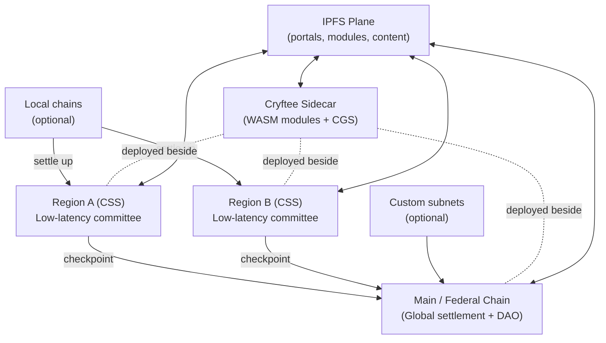
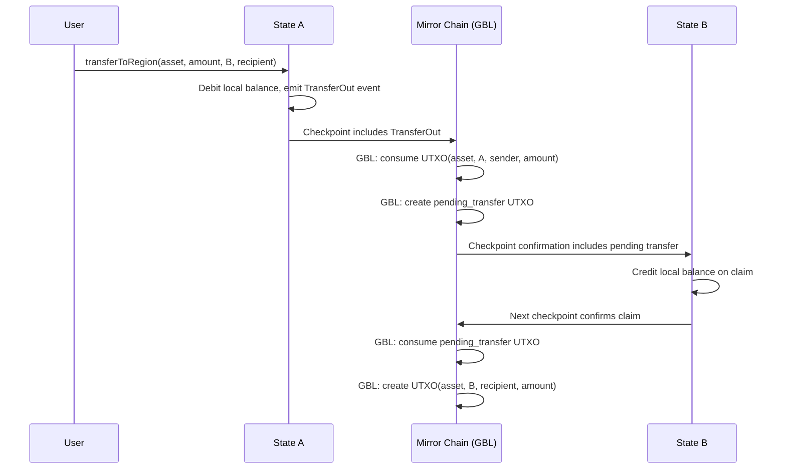
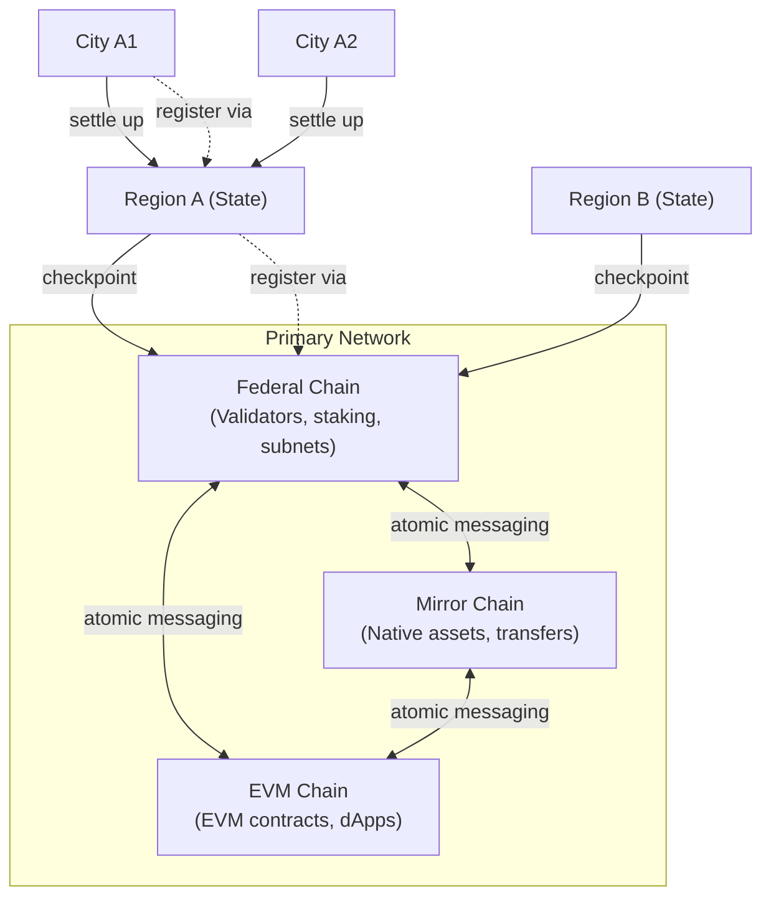
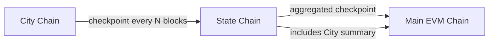

## 4. System overview

CryftNet is organized as a federation:

- **Primary Network (Federal + Mirror + EVM):** The canonical foundation consisting of three chains: Federal Chain (validator/subnet management), Mirror Chain (native asset transfers), and EVM Chain (EVM smart contracts). Together they provide settlement, cross-chain registries, global governance, and the primary validator DAO.
- **Regional chains (States):** Low-latency committees tuned for users within a latency domain. Most user activity is expected to be region-local and finalizes quickly.
- **Local chains (Cities):** Optional, for dense communities or enterprise enclaves. These settle to a region.
- **Cryftee plane:** A sidecar runtime deployed alongside validators and infrastructure nodes, hosting signed modules and CGS.
- **IPFS plane:** Content-addressed distribution for portals, modules, and application assets, with incentives for availability.

**Figure 1: CryftNet federation overview (conceptual)**

This diagram shows the high-level federation architecture. The Primary Network (Federal Chain + Mirror Chain + EVM Chain) serves as the canonical settlement layer, with Regions providing low-latency service and optional Local chains for dense communities. Cryftee sidecars run alongside all validator nodes, hosting WASM modules and CGS. The IPFS plane provides content distribution across the network.



The Primary Network and regions are linked by checkpointing. Regions confirm locally, then periodically anchor a
signed checkpoint to Federal Chain. Cross-region transfers use these checkpoints and standard message
formats. The federation is "edge-like" in the sense that regions provide fast service nearby, but it
avoids centralized operators: validator sets are governed by DAOs and measured for eligibility using
network performance signals.

### 4.1 Primary Network architecture (Federal Chain + Mirror Chain + EVM Chain)

Inspired by Avalanche's multi-chain architecture, CryftNet's Primary Network is composed of **three specialized chains**, each optimized for a distinct role. Cryft Labs maintains first-class implementations and long-term governance over all three chains, while subnets may add additional chains as needed:

| Chain | Purpose | VM | Consensus | Typical Operations |
|:------|:--------|:---|:----------|:-------------------|
| **Federal Chain** (Federal) | Validator set management, staking, subnet lifecycle, chain registration/metadata, governance coordination | Native | Snowman (v1 baseline) | Validator add/remove, stake/unstake, subnet registration, governance proposals, slashing |
| **Mirror Chain** (Mirror) | Native asset creation and transfers optimized for throughput (UTXO-style), base asset movements | Native (UTXO) | Snowman (v1 baseline) | CRYFT transfers, asset issuance, cross-chain atomic swaps, high-frequency payments |
| **EVM Chain** (EVM Execution) | Account-based smart contract execution compatible with Solidity/Vyper tooling (the dApp chain) | EVM | Snowman (v1 baseline) | Token contracts, DEX swaps, NFTs, DeFi protocols, user dApp interactions |

**Why three separate chains?**

1. **Performance isolation:** Validator/staking traffic (Federal Chain), asset transfer traffic (Mirror Chain), and smart contract execution traffic (EVM Chain) do not compete for the same bottleneck. This prevents governance operations from being priced out during DeFi congestion, and prevents EVM gas spikes from affecting base asset transfers.

2. **Security differentiation:** Federal Chain can use more conservative parameters (larger committees, longer finality windows) for critical validator/subnet operations. Mirror Chain optimizes for throughput. EVM Chain balances speed with EVM determinism requirements.

3. **Specialized state models:** Federal Chain uses validator set / stake accounting. Mirror Chain uses UTXO for parallel asset transfers. EVM Chain uses account-based EVM state. Each model is optimal for its domain.

4. **Upgrade isolation:** EVM upgrades (new opcodes, gas changes) affect only EVM Chain. Federal Chain and Mirror Chain native VMs can evolve independently based on federation needs.

5. **Economic clarity:** Staking rewards flow through Federal Chain. Asset issuance/burns happen on Mirror Chain. DeFi fees stay on EVM Chain. Clean separation prevents cross-subsidy confusion.

6. **Atomic cross-chain coordination:** Shared validator set enables atomic messaging between chains. Block proposers produce **bundle blocks** containing state transitions for all three chains with a shared `bundle_hash = keccak256(federal_header || mirror_header || evm_header)`. Validators vote on the entire bundle atomically--failures cause rollback across all chains. **Execution semantics**: (1) Each chain's state transition validated independently against its VM rules; (2) Cross-chain message invariants verified (e.g., GBL conservation: debit on Mirror + credit on EVM must balance); (3) If ANY chain invalid OR invariant violated, entire bundle rejected; (4) Upon quorum acceptance, all three chains advance atomically to same bundle height. **Rollback boundary**: Only unfinalized bundles can be rolled back; finality is bundle-finality (single finality event for all three chains). **Failure handling**: Mid-execution failures (validator crash, network partition) trigger rollback to last finalized bundle; proposer may be slashed for invalid bundle proposal. (See Appendix 16.4 for detailed atomic messaging specification.)

   **⚠️ Architectural Note:** This atomic bundle block design is **NOT** Avalanche's standard model of separate chains with independent block production sharing only a validator set. CryftNet implements a **multi-VM atomic commit per height**--a novel kernel-level behavior where validators produce and vote on synchronized state transitions across all three VMs in a single atomic unit. This is a significant architectural departure from typical multi-chain systems and requires custom consensus/execution engine implementation. The trade-off: eliminates cross-chain bridge complexity and latency at the cost of tighter coupling between chains and more complex validator duties.

   **Bundle Block Execution Mechanics (detailed):**

   **Execution Ordering:** VMs execute in fixed order within each bundle to ensure deterministic cross-chain reads:
   ```text
   1. Federal Chain executes first (validator set updates, governance)
   2. Mirror Chain executes second (GBL updates, asset transfers, Code Vault updates)
   3. EVM Chain executes third (smart contracts, with read access to updated GBL via precompiles)
   ```

   **Cross-chain message application:** Messages are applied *before* the receiving chain executes its transactions:
   ```text
   For each chain C in [Federal, Mirror, EVM]:
     1. Apply pending cross-chain messages TO chain C (from other chains in previous bundles)
     2. Execute chain C's transactions for this bundle
     3. Generate outgoing cross-chain messages FROM chain C
     4. Validate cross-chain invariants (e.g., GBL conservation)
   ```

   **Liveness Failure Modes:**

   | Failure Scenario | Behavior | Recovery |
   |:-----------------|:---------|:---------|
   | One VM crashes during execution | Entire bundle rejected; proposer slashed; next proposer selected | Next proposer creates recovery bundle with valid state |
   | One VM times out (>5s execution) | Bundle considered invalid; proposer may not be slashed (timeout may be environmental); next proposer selected | Governance may adjust block gas limits or VM parameters |
   | One VM produces invalid state transition | Bundle rejected during validation phase; proposer slashed for invalid bundle | Next proposer creates valid bundle |
   | All three VMs execute successfully but cross-chain invariant violated | Bundle rejected; proposer slashed for invariant violation | Next proposer creates bundle respecting invariants |
   | Validator set cannot reach quorum on bundle validity | Bundle remains unfinalized; timeout triggers re-proposal | After 3 failed attempts, governance intervention or automatic fallback to empty bundle |

   **Critical property:** If ANY VM fails (crash, timeout, invalid transition), the ENTIRE network waits for the next bundle proposal. There is no "partial advancement" where two chains move forward and one stays behind. This ensures atomic commit but means **liveness depends on the health of all three VMs**. If the EVM implementation has a bug that crashes on a specific opcode, Federal and Mirror chains cannot finalize new blocks until the bug is fixed.

   **Mitigation strategies for VM liveness coupling:**

   1. **Emergency governance bypass:** Main governance can vote to skip a problematic bundle (e.g., if a malicious tx exploits a VM bug). Requires supermajority (80%) + 24hr timelock.
   
   2. **Empty bundle fallback:** If bundle proposal fails 3 consecutive times, validators may propose an empty bundle (no transactions, only cross-chain message settlement). This keeps the chain alive while problematic transactions are excluded.
   
   3. **Per-VM feature flags:** Governance can temporarily disable risky VM features (e.g., new opcodes, experimental precompiles) if they threaten liveness.
   
   4. **Testnet validation:** All VM upgrades MUST be tested on incentivized testnet for >= 30 days before Main deployment.

   **Data Availability & Bandwidth Requirements:**

   To vote on a bundle, validators MUST have access to:
   - Federal header + transaction list (~10-50 KB typical)
   - Mirror header + UTXO transaction list (~50-200 KB typical)
   - EVM header + transaction list (~100-500 KB typical, could be larger for complex blocks)
   - Cross-chain message queue (~10-50 KB)
   - Cross-chain invariant proofs (~5-20 KB)

   **Total per bundle:** ~200-1000 KB depending on activity level. At 2 bundles/second (target), this is ~400 KB/s to 2 MB/s download bandwidth per validator.

   **Light vote path:** Validators may vote based on headers + Merkle roots + invariant proofs WITHOUT downloading full transaction lists. This reduces bandwidth to ~20-50 KB per bundle but requires trusting that >67% of validators validated full data. Not recommended for high-value chains.

   **Data availability sampling (DAS) integration:** Once DAS is deployed (post-mainnet), validators can use erasure coding + sampling to verify data availability with ~10-20 KB samples instead of full downloads. This improves scalability while maintaining security.

   **Crash Consistency & Persistent Checkpoints:**

   Validators maintain persistent state at three levels:

   ```text
   1. Last Finalized Bundle (LFB):
      - Federal state root at height H_f
      - Mirror state root at height H_m
      - EVM state root at height H_e
      - bundle_hash, finalization quorum signature
      - Stored on disk with fsync() guarantee before voting on next bundle
   
   2. Pending Bundle (in-memory):
      - Tentative state roots for current bundle being validated
      - Not persisted until quorum reached
   
   3. Rollback Log (write-ahead log):
      - Before applying bundle B, write: "BEGIN_BUNDLE_B, parent=LFB, changes=[...]"
      - After bundle finalized, write: "COMMIT_BUNDLE_B"
      - If validator crashes mid-bundle, on restart: discard in-progress bundle, revert to LFB
   ```

   **Crash scenarios:**

   | Crash Point | Recovery |
   |:------------|:---------|
   | During bundle execution (before voting) | Discard in-progress bundle; revert to LFB; re-sync missing bundles from peers |
   | After voting but before quorum | Local vote lost; wait for quorum from other validators; apply finalized bundle if quorum reached |
   | During bundle commit to disk | Rollback log replayed on restart; either full commit or full rollback (no partial state) |
   | After commit but before LFB update | Re-commit is idempotent; LFB pointer updated to new bundle |

   **Key invariant:** No validator can have "half-applied" bundles. Either all three chains are at bundle height H, or all three are at H-1. Partial application is impossible due to atomic commit semantics.

#### 4.1.1 Block cadence & asynchronicity

Each chain in the Primary Network (Federal, Mirror, EVM) and each region/state chain runs as an **independent Snowman instance** with its own block production loop, finality cadence, and target block interval.

- **Asynchronous production** -- Chains are **not** required to produce blocks at the same real-time cadence. Federal Chain might target 2-second blocks, Mirror 1-second, EVM 1.5-second, and individual regions 0.3–1 second -- all running in parallel.
- **Atomic finality only** -- Synchronization occurs only at the **bundle level** for the Primary Network: proposers collect state from all three chains, execute in order, and propose a single bundle vote using the shared Snowman consensus. Finality advances atomically across Federal, Mirror, and EVM only when a bundle is accepted.
- **Regions remain fully independent** -- Region/state chains produce and finalize blocks asynchronously, checkpointing upward to Federal Chain periodically (async message). No real-time coordination is required between regions or between regions and Primary.

This design preserves the performance isolation and regional low-latency goals while enabling atomic cross-chain settlement when needed.

   **Upgrade Coupling & VM Independence:**

   **Problem:** If VMs must execute in lockstep, how do we upgrade one VM without risking a network halt if the upgrade has bugs?

   **Solution: Staged upgrade with governance escape hatches**

   ```text
   Upgrade process for VM X (e.g., EVM Chain):
   
   Phase 1: Testnet deployment (30 days minimum)
     - Deploy upgraded VM on incentivized testnet
     - Monitor for liveness issues, crashes, consensus divergence
     - Bounty program for breaking the upgrade
   
   Phase 2: Governance proposal
     - Propose upgrade on Main
     - Include: upgrade block height, fallback conditions, emergency rollback procedure
     - Voting period: 14 days
     - Acceptance threshold: 67% validator vote
   
   Phase 3: Activation
     - At block height H, validators switch to new VM implementation
     - First 1000 bundles with new VM are "probation period"
     - If >3 bundle failures during probation, automatic rollback to old VM triggered
   
   Phase 4: Stabilization
     - After 1000 successful bundles, upgrade considered stable
     - Old VM implementation kept as backup for 90 days
   ```

   **Emergency rollback conditions:**

   - Governance supermajority (80%) votes to rollback
   - Automated trigger: >3 bundle failures within 1000 blocks
   - Critical bug discovered (e.g., consensus divergence, VM crash on valid input)

   **VM independence limit:** Federal, Mirror, and EVM CAN have different upgrade schedules, but their bundle execution interface must remain compatible. If EVM adds a new precompile, Federal/Mirror don't need to change. If Federal changes validator set encoding, EVM/Mirror don't need to change. **BUT:** If the bundle format itself changes (e.g., adding a 4th chain), all three VMs must upgrade together.

   **Subsystem Degradation (if atomic coordination is lost):**

   This section clarifies what happens if the bundle block system fails catastrophically:

   **If bundle blocks become non-viable (e.g., persistent liveness failures):**
   1. **Fallback to independent chains:** Federal, Mirror, and EVM can continue producing blocks independently using standard Avalanche consensus
   2. **Cross-chain coordination degrades to async bridges:** GBL updates become async message-passing instead of atomic precompile reads
   3. **Latency increases:** Cross-chain transactions require checkpoint-based settlement (5-30s instead of 2-5s)
   4. **Security model changes:** Trust assumptions shift from "single validator set consensus" to "economic security of bridge contracts"

   **The chain still produces blocks**--regional committees can finalize blocks locally even if Main bundle blocks are broken. Federation-wide atomic settlement is lost, but individual regions remain operational. This is an **acceptable degradation** because the core value (regional low-latency execution) is preserved, and only cross-region atomic settlement is affected.


**Federal Chain responsibilities:**

- **Validator Registry:** Global validator identities, stake bonds, delegation relationships, and slashing records. All staking operations occur on Federal Chain.
- **Subnet Registry:** All State/Region chains register here with their chain_id, validator set commitments, consensus parameters, and CEP compatibility declarations.
- **Checkpoint Acceptance:** Receives and validates checkpoint submissions from all registered subnets; maintains the canonical checkpoint history.
- **Governance Coordination:** Proposal lifecycle, voting tallies, timelocks, and execution triggers. Governance decisions are recorded on Federal Chain.
- **Validator Rewards Distribution:** Emission schedule, reward allocation, and validator/delegator payouts.

**Mirror Chain responsibilities:**

- **Native Asset Issuance:** Creation of new asset types (tokens, NFTs) with UTXO-based ownership.
- **High-Throughput Transfers:** Optimized for CRYFT and other native asset movements (not EVM tokens).
- **Cross-Chain Atomic Swaps:** UTXO-style atomic swaps between Mirror Chain assets and EVM Chain ERC-20 tokens.
- **Base Layer Transfers:** Users moving large amounts of CRYFT between wallets typically use Mirror Chain (lower fees than EVM Chain EVM gas).

**EVM Chain responsibilities:**

- **EVM Smart Contracts:** All Solidity/Vyper contracts, DeFi protocols, NFT marketplaces, and dApps.
- **Contract Mirror Registry (CMR):** Authoritative record of federation contract deployments--tracking target_regions[], deployed_regions[], mirror_status per region, and deployment fees paid. Updated via region checkpoints. Lives on EVM Chain (not Mirror).
- **Federation Contract Registry:** Tracks CREATE2 deployments, code hashes, and cross-region contract verification.
- **User-Facing dApp Interface:** When users "interact with CryftNet," they typically transact on EVM Chain (or regional EVM Chain instances).
- **GBL Access:** EVM Chain contracts query Mirror Chain's GBL via atomic cross-chain messaging or precompiles.

**Mirror Chain additional responsibilities:**

- **Global Balance Ledger (GBL):** The authoritative partitioned ledger for EVM token balances across all regions, **managed by Mirror Chain using an extended UTXO model**. Each UTXO includes metadata: {asset_id, region_id, account, amount}, tracking which account owns how much of each asset on which region. Mirror Chain serves as the single source of truth for partitioned balances; EVM Chain and subnets access GBL state via atomic cross-chain messaging or precompiles. Native CRYFT balances also use Mirror Chain (standard UTXO). **GBL tracking is opt-in for subnets--no custom bridge contracts required.**

- **Code Vault (Bytecode Vault):** The canonical storage and commitment layer for federation-deployable smart contract code. Stores code metadata including init_code_hash, runtime_code_hash, and optionally init_code blobs or IPFS CIDs. Each code package is assigned a unique code_id and is cryptographically committed. EVM Chain's CMR references these code_ids for deployment authorization and verification. Mirror Chain does NOT execute smart contracts--it only stores code commitments to enable deterministic CREATE2 deployment across regions. Regions verify deployed bytecode matches the runtime_code_hash from the Code Vault after deployment. This enables lazy mirroring (deploy-on-first-use) while guaranteeing identical contract addresses across all opted-in regions.

**Global Balance Ledger (GBL) architecture:**

The GBL tracks **EVM token balances** (ERC-20, ERC-721, etc.) across regions using **Mirror Chain's extended UTXO model**. Native CRYFT also uses standard UTXO on Mirror Chain. The GBL is **managed entirely by Mirror Chain** as a partitioned ledger; EVM Chain and subnets access it via atomic cross-chain messaging:

```text
GlobalBalanceLedger (Mirror Chain extended UTXO) {
  // Each UTXO carries metadata for partitioned balance tracking
  utxo_set: [
    {
      utxo_id: bytes32,           // Unique UTXO identifier
      asset_id: address,          // EVM token address (or CRYFT for native)
      region_id: uint64,          // Which region this balance belongs to
      account: address,           // EVM account owner
      amount: uint256,            // Balance amount
      lock_script: bytes,         // Spend authorization (signature requirements)
    },
    ...
  ]
  
  // Total supply per asset (derived from UTXO set)
  // total_supply[asset] = sum(utxo.amount for utxo in utxo_set if utxo.asset_id == asset)
  
  // Pending cross-region transfers (also as UTXOs with pending status)
  pending_transfers: [
    {
      transfer_id: bytes32,
      asset_id: address,
      amount: uint256,
      from_region: uint64,
      to_region: uint64,
      sender: address,
      recipient: address,
      initiated_checkpoint: uint64,
      status: enum { Pending, Claimed, Expired, Refunded },
    },
    ...
  ]
  
  // Conservation invariant: sum(utxo.amount for asset_id) == total_supply[asset_id]
}
```

**Why GBL lives on Mirror Chain (not EVM Chain or Federal Chain):**

1. **UTXO efficiency:** Mirror Chain's UTXO model naturally supports parallel validation and partitioned balances without account-based contention.
2. **Native asset layer:** Native CRYFT already uses Mirror Chain UTXO; extending for EVM token tracking unifies the asset layer.
3. **Atomic cross-chain messaging:** Primary Network's three-chain architecture enables atomic reads/writes from EVM Chain to Mirror GBL.
4. **Simple and robust:** Mirror remains lean (no smart contracts)--GBL is a ledger operation, not execution.
5. **Conservation checks:** UTXO model makes conservation invariant (`sum(utxo.amount) == total_supply`) mechanically enforceable.
6. **Modularity:** EVM Chain focuses on execution; Mirror Chain focuses on asset custody and partitioned balances.
7. **Opt-in for subnets:** Subnets query Mirror GBL via precompiles or bridge contracts--no Cryftee module dependency.

**GBL update flow:**

This sequence diagram illustrates a cross-region asset transfer from State A to State B. The flow shows the debit-checkpoint-credit pattern: (1) User initiates transfer on State A, (2) State A debits local balance and includes TransferOut in its checkpoint to Mirror Chain, (3) Mirror Chain GBL consumes source UTXO and creates pending transfer UTXO, (4) State B credits the recipient's local balance on claim, (5) State B's next checkpoint confirms the claim to Mirror Chain, (6) Mirror Chain GBL consumes pending transfer UTXO and creates destination UTXO, marking transfer complete.



**EVM Chain contracts accessing Mirror GBL (authoritative model):**

**CRITICAL:** Mirror Chain GBL is the **single authoritative source** for partitioned balances. EVM contracts MUST NOT maintain independent balance state for federation-verified tokens. Local `balances` mappings in contracts are **read-only caches** synchronized from Mirror GBL.

**Execution-time truth rule:** During transaction execution, balance reads MUST query Mirror GBL via precompile (authoritative). Local storage cache is updated post-execution for UX convenience but is NOT used for balance decisions. **Cache synchronization guarantee:** Before a transaction executes, validators ensure local cache reflects the latest Mirror GBL state from the current bundle block. Cache drift is impossible because bundle blocks are atomic across all three chains.

**Invariants enforced by validator consensus:**
1. **Atomic bundle guarantee:** Mirror GBL updates and EVM state transitions occur in the same bundle block. No interleaving.
2. **Pre-execution sync:** Validators MUST sync cache from Mirror GBL before executing any balance-touching transaction in the bundle.
3. **Single source of truth:** All balance decisions (transfer validation, allowance checks) use Mirror GBL precompile response, never cached storage.
4. **Post-execution consistency:** Cache updates occur deterministically after successful Mirror GBL state change. Failures roll back both.
5. **No divergence:** If cache != GBL at bundle proposal time, bundle is invalid and rejected by honest validators.

**GBL Precompile Interface (address 0x0100):**

```solidity
interface IGBLPrecompile {
    // Query balance for (asset_id, region_id, account)
    // Returns: balance in smallest unit (e.g., wei for ETH-like tokens)
    // Gas cost: 700 gas (warm) / 2600 gas (cold, first access in tx)
    // Reverts: Never (returns 0 for non-existent balances)
    function queryBalance(bytes32 asset_id, uint64 region_id, address account) 
        external view returns (uint256 balance);
    
    // Transfer within same region (atomic, synchronous)
    // Effects: Updates Mirror GBL UTXO set atomically with EVM state
    // Gas cost: 5000 gas base + 700 per account touched
    // Reverts: If insufficient balance, invalid region_id, or GBL invariant violation
    function transfer(
        bytes32 asset_id, 
        uint64 region_id, 
        address from, 
        address to, 
        uint256 amount
    ) external returns (bool success);
    
    // Initiate cross-region transfer (async, creates pending state)
    // Effects: Debits from_region balance, creates pending claim on to_region
    // Returns: transfer_id for tracking settlement status
    // Gas cost: 15000 gas (higher due to cross-chain message queueing)
    // Settlement time: 5-30 seconds (via checkpoint to Main)
    // Reverts: If insufficient balance or invalid region configuration
    function transferToRegion(
        bytes32 asset_id, 
        uint64 from_region, 
        uint64 to_region, 
        address from,
        address to, 
        uint256 amount
    ) external returns (bytes32 transfer_id);
    
    // Query pending cross-region transfer status
    // Returns: (settled, dest_region_height) where settled=true means funds available on dest
    // Gas cost: 700 gas
    function getTransferStatus(bytes32 transfer_id) 
        external view returns (bool settled, uint64 dest_region_height);
    
    // Query total supply for asset across ALL regions
    // Useful for federation-wide token metrics
    // Gas cost: 2000 gas (aggregates across regions)
    function totalSupply(bytes32 asset_id) 
        external view returns (uint256 total);
    
    // Query which regions have non-zero balances for an account
    // Returns: array of region_ids where account has balance > 0
    // Gas cost: 5000 gas base + 100 per region
    // Use case: Wallets discovering user's multi-region balances
    function getAccountRegions(bytes32 asset_id, address account) 
        external view returns (uint64[] memory regions);
}
```

**Precompile behavior specifications:**

**Reentrancy protection:**
- GBL precompile calls are NON-REENTRANT
- If contract A calls GBL precompile, which triggers callback to A, the callback CANNOT call GBL precompile again
- Violation: Reverts with "GBL: reentrant call"
- Reason: Prevents complex cross-chain reentrancy exploits

**Failure modes and error codes:**

```text
queryBalance():
  - Never reverts
  - Returns 0 for invalid asset_id or account with no balance
  - Returns 0 if region_id not in asset's target_regions

transfer():
  - Reverts "GBL: insufficient balance" if from.balance < amount
  - Reverts "GBL: invalid region" if region_id not in asset's target_regions
  - Reverts "GBL: zero amount" if amount == 0
  - Reverts "GBL: self transfer" if from == to (no-op transfers forbidden)
  - Reverts "GBL: conservation violated" if debit+credit doesn't balance (critical error, bundle rejected)

transferToRegion():
  - Reverts "GBL: insufficient balance" if from.balance < amount
  - Reverts "GBL: invalid source region" if from_region != current_region
  - Reverts "GBL: region not federated" if to_region not in asset's target_regions
  - Reverts "GBL: zero amount" if amount == 0
  - Reverts "GBL: same region" if from_region == to_region (use transfer() instead)
```

**Gas cost rationale:**

- queryBalance (700 gas): Comparable to SLOAD, reflects Mirror UTXO read cost
- transfer (5000 gas): Comparable to ERC-20 transfer (2x SLOAD + 2x SSTORE ~= 5200 gas)
- transferToRegion (15000 gas): Higher due to cross-chain message queuing and checkpoint overhead
- totalSupply (2000 gas): Aggregates cached per-region totals (not full UTXO scan)

**Cache consistency enforcement (validator duty):**

Before executing bundle B:
  ```text
  For each asset_id in federation registry:
    For each region_id in asset's target_regions:
      cached_root = EVM_Chain.gblCacheRoot(asset_id, region_id)
      mirror_root = Mirror_Chain.gblRoot(asset_id, region_id)
      
      IF cached_root != mirror_root:
        REJECT bundle B
        REASON: "GBL cache desync detected"
        PROPOSER: Slashed (5% stake)
  ```

This check happens during Phase 4 (invariant validation) of bundle execution. Prevents cache drift from ever reaching consensus.

**Composability constraints:**

- DEXes (Uniswap, etc.) work normally within a region (GBL precompile is just a different balance read)
- Cross-region DEX trades require async settlement (initiator locks funds, counterparty claims after checkpoint)
- Flashloan compatibility: Within-region flashloans work; cross-region flashloans not supported (async nature breaks atomicity)
- Reentrancy: Standard EVM reentrancy guards still apply; GBL precompile adds its own non-reentrancy check

**ERC-20 wrapper pattern (recommended):**

```solidity
// Wrapper ensures ERC-20 compatibility while using GBL backend
contract FederatedERC20 {
    IGBLPrecompile constant GBL = IGBLPrecompile(0x0100);
    bytes32 public immutable ASSET_ID;
    uint64 public immutable REGION_ID;
    
    // Cache (synced by validators before tx execution)
    mapping(address => uint256) private _cachedBalances;
    
    function balanceOf(address account) public view returns (uint256) {
        // Always query authoritative source
        return GBL.queryBalance(ASSET_ID, REGION_ID, account);
    }
    
    function transfer(address to, uint256 amount) public returns (bool) {
        require(GBL.transfer(ASSET_ID, REGION_ID, msg.sender, to, amount), "Transfer failed");
        
        // Update cache (deterministic, validators verify this matches GBL)
        _cachedBalances[msg.sender] -= amount;
        _cachedBalances[to] += amount;
        
        emit Transfer(msg.sender, to, amount);
        return true;
    }
    
    // Standard ERC-20 allowance mechanism (region-local)
    mapping(address => mapping(address => uint256)) private _allowances;
    
    function approve(address spender, uint256 amount) public returns (bool) {
        _allowances[msg.sender][spender] = amount;
        emit Approval(msg.sender, spender, amount);
        return true;
    }
    
    function transferFrom(address from, address to, uint256 amount) public returns (bool) {
        uint256 currentAllowance = _allowances[from][msg.sender];
        require(currentAllowance >= amount, "Insufficient allowance");
        
        require(GBL.transfer(ASSET_ID, REGION_ID, from, to, amount), "Transfer failed");
        
        _allowances[from][msg.sender] = currentAllowance - amount;
        _cachedBalances[from] -= amount;
        _cachedBalances[to] += amount;
        
        emit Transfer(from, to, amount);
        return true;
    }
}
```


**Required pattern for federation-verified tokens:**

```text
// Federation-verified ERC-20 wrapper contract
contract FederationToken {
  // Local storage is CACHE ONLY - not authoritative
  mapping(address => uint256) public balances;  // synced from Mirror GBL
  
  // All balance-modifying operations MUST use Mirror GBL precompiles
  function transfer(address to, uint256 amount) external {
    // Authority: Mirror Chain GBL via precompile at 0x0000...0100
    MIRROR_GBL_PRECOMPILE.transfer(ASSET_ID, REGION_ID, msg.sender, to, amount);
    
    // Update local cache for read convenience
    balances[msg.sender] -= amount;
    balances[to] += amount;
  }
  
  function transferToRegion(uint64 destRegion, address to, uint256 amount) external {
    // Cross-region transfer via Mirror GBL
    MIRROR_GBL_PRECOMPILE.transferToRegion(ASSET_ID, REGION_ID, destRegion, msg.sender, to, amount);
    balances[msg.sender] -= amount;  // debit local cache
  }
  
  function balanceOf(address account) external view returns (uint256) {
    // Query authoritative source
    return MIRROR_GBL_PRECOMPILE.queryBalance(ASSET_ID, REGION_ID, account);
  }
}
```

**Allowances and approvals (ERC-20 compatibility clarification):**

**For local-region operations**: Standard `approve/allowance/transferFrom` semantics are preserved on-region. Approval mappings (`mapping(address => mapping(address => uint256)) public allowances`) live in contract storage as usual. This ensures existing DeFi contracts (Uniswap, Aave, etc.) work without modification.

**For cross-region operations**: Approvals are region-local and do not automatically transfer. Cross-region token movements use direct `transferToRegion()` (sender-initiated) rather than delegated transfers. Future versions may support cross-region approval via Mirror UTXO lock scripts.

**Trade-off**: This maintains full ERC-20 compatibility within a region (recommended) at the cost of region-local approval state. Alternative: Implement approvals as Mirror lock scripts (breaks ERC-20 compatibility but enables cross-region approvals).

**Decision**: CryftNet v1 chooses ERC-20 compatibility to maximize ecosystem adoption.

**Realism tie-in:** Similar to Optimism's canonical bridged tokens (L1 authoritative, L2 cached) or Cosmos ICS-20 (chain-of-origin authoritative).

**Non-federation tokens:** Standard ERC-20 contracts without GBL integration maintain local state as usual (not partitioned across regions).

Note: Native CRYFT balances use standard Mirror Chain UTXO (not extended). EVM Chain can wrap CRYFT via bridge contract (wrapped CRYFT is ERC-20 on EVM Chain, backed 1:1 by Mirror UTXO).

**Contract Mirror Registry (CMR) architecture:**

The CMR is EVM Chain's native data structure for tracking federation contract deployments and mirror state:

```text
ContractMirrorRegistry {
  // Per-contract deployment record
  contracts: Map<contract_address ->' ContractMirrorRecord>
  
  // Region deployment queue (contracts pending mirroring)
  pending_mirrors: Map<(contract_address, region_id) ->' PendingMirror>
  
  // Fee tracking per contract
  fees_paid: Map<contract_address ->' FeeRecord>
}

ContractMirrorRecord {
  contract_address: address,
  code_hash: bytes32,
  deployer: address,
  salt: bytes32,
  home_region: uint64,                    // Where initial deployment occurred
  target_regions: uint64[],               // Regions developer opted into
  deployed_regions: uint64[],             // Regions where contract is live
  mirror_status: Map<region_id ->' MirrorStatus>,  // Per-region status
  balance_portability: bool,
  verification_level: VerificationLevel,  // Unverified, Publisher, Federation
  created_at: uint64,
  last_updated: uint64
}

MirrorStatus {
  status: enum { Pending, Deployed, Failed, Revoked },
  deployed_at: uint64,
  init_hash: bytes32,          // Hash of initialization data
  initialized: bool,
  last_checkpoint: uint64      // Last checkpoint confirming this region
}

// Status transitions via region checkpoints:
// 1. Main receives deployment event ->' creates record, status[home] = Deployed
// 2. Main queues mirror to target_regions ->' status[target] = Pending
// 3. Region confirms deployment ->' status[target] = Deployed
// 4. Region reports failure ->' status[target] = Failed (auto-retry)
```

**CMR update flow (region-first deployment):**

```text
1) Developer deploys on Region A:
   - RegionDeployer.deploy(init_code, salt, options={target_regions: [A,B,C]})
   - Emits DeploymentEvent with region IDs and fee payment

2) Region A checkpoint -> Main EVM Chain:
   - EVM Chain processes DeploymentEvent
   - CMR creates: contracts[0xToken] = {
       home_region: A,
       target_regions: [A, B, C],
       deployed_regions: [A],
       mirror_status: {A: Deployed, B: Pending, C: Pending}
     }

3) Main triggers mirror to Regions B, C:
   - CMR updates: pending_mirrors[(0xToken, B)] = {queued}
   - CMR updates: pending_mirrors[(0xToken, C)] = {queued}

4) Region B, C receive mirror instruction and deploy:
   - RegionDeployer.mirror() called on each region
   - Region confirms in next checkpoint

5) Region B checkpoint -> Main EVM Chain:
   - EVM Chain updates CMR: deployed_regions: [A, B], mirror_status[B] = Deployed

6) Region C checkpoint -> Main EVM Chain:
   - EVM Chain updates CMR: deployed_regions: [A, B, C], mirror_status[C] = Deployed

CMR is authoritative - regions derive mirror permissions from EVM Chain state.
```

**CMR region expansion (post-deployment):**

```text
1) Developer requests expansion to Region D:
   - Calls FederationRegistry.expandRegions(0xToken, [D])
   - Pays expansion fee (0.01 CRYFT per region)

2) Checkpoint carries expansion request to Main:
   - EVM Chain verifies caller == deployer
   - EVM Chain verifies fee paid
   - CMR updates: target_regions: [A, B, C, D]
   - CMR updates: mirror_status[D] = Pending

3) Main triggers mirror to Region D

4) Region D confirms deployment in checkpoint:
   - CMR updates: deployed_regions: [A, B, C, D], mirror_status[D] = Deployed
```

**Cross-chain communication (Federal -> Mirror -> EVM):**

The Primary Network's three chains share the same validator set and use atomic messaging:

```text
Federal Chain -> EVM Chain:
- Validator set updates (Federal -> EVM for on-chain verification in EVM Chain contracts)
- Governance execution results (Federal -> EVM to trigger contract upgrades)
- Stake/unstake requests (EVM -> Federal when users interact via EVM Chain interface)
- Checkpoint finality confirmations (Federal -> EVM for subnet validation)
- Slashing events (Federal -> EVM to freeze validator-operated contracts)

Mirror Chain -> EVM Chain:
- CRYFT wrapping/unwrapping (Mirror -> EVM for native -> ERC-20 bridge)
- Cross-chain atomic swaps (Mirror -> EVM for asset exchanges)
- Asset issuance events (Mirror -> EVM when native assets need EVM representation)

Federal Chain -> Mirror Chain:
- Validator reward payouts (Federal -> Mirror for native CRYFT distribution)
- Emission schedule updates (Federal -> Mirror for minting authorization)
```

All three chains share the same block production schedule and validators, ensuring atomic cross-chain messaging without external bridges or delays.

**Figure: Primary Network three-chain architecture with subnet hierarchy**

This diagram shows the three-chain Primary Network (Federal, Mirror, EVM) with atomic messaging between them. States (Regions A and B) checkpoint to Federal Chain for settlement. Cities (A1, A2) checkpoint to their parent State, not directly to Main. Registration flows are shown with dotted lines.



### 4.2 Validator cross-participation requirements

A key architectural question is whether subnet (State/Region) validators must also validate the Primary Network. CryftNet adopts a **tiered requirement model**:

**Terminology clarification:**
- **Primary Network** = Federal Chain + Mirror Chain + EVM Chain (three chains, shared validator set)
- **Federal Chain** = Settlement/checkpoint/DAO chain specifically  
- **Main EVM Chain** = EVM Chain within Primary Network (hosts CMR, registries)
- Legacy references to "Main" are deprecated; use specific chain names for clarity

**Tier 1: CSS-1 State chains (required Primary Network participation)**

Validators for Cryft Standard Subnet (CSS-1) State chains **must** also be validators on the Primary Network (validating Federal Chain, Mirror Chain, and EVM Chain). This requirement ensures:

- **Security alignment:** State validators have direct stake in the Primary Network's security (via Federal Chain staking), preventing "vampire" attacks where a State chain extracts value without contributing to federation security.
- **Checkpoint integrity:** Validators who sign State checkpoints also validate those checkpoints on Federal Chain, creating accountability.
- **Governance participation:** State validators participate in Primary Network governance (via Federal Chain), ensuring federation decisions reflect the interests of active State operators.
- **Simplified slashing:** Misbehavior on a State chain can be slashed on Federal Chain without complex cross-chain evidence.

**Cryftee requirement for CSS-1 validators:** CSS-1 validators are required to run a full Cryftee instance (with at minimum `bls_tls_signer_v1` and `ipfs_v1` modules) to participate in Primary Network consensus and earn rewards. This ensures all CSS-1 validators have the necessary off-chain utilities for staking operations, checkpoint signing, Code Vault access, and runtime attestation. Non-consensus nodes (RPC, archive) are exempt from this requirement.

**Tier 2: Custom subnets (optional Primary Network participation)**

Custom subnets (non-CSS) may choose whether their validators participate in the Primary Network:

| Participation Level | Requirements | Benefits | Trade-offs |
|:--------------------|:-------------|:---------|:-----------|
| **Full** | Validate Primary Network + subnet | Full federation services, governance rights, priority routing | Higher operational cost |
| **Partial** | Stake on Federal Chain, validate subnet only | Bridge access, registry listing, basic services | No governance votes, standard routing |
| **None** | Subnet-only validation | Maximum independence | No federation services, manual bridging only |

**Minimum stake requirements (canonical):**

```text
Primary Network validator:    1,000 CRYFT minimum stake (see Appendix 16.8)
CSS-1 State validator:         500 CRYFT additional stake (per State)
Custom subnet validator:       Defined by subnet parameters
City validator:                Defined by parent State (typically lower)
```

**Cross-validation benefits:**

- Validators earn rewards from both Main and subnet block production.
- Unified slashing: a single misbehavior affects all validator roles.
- Simplified key management: same validator identity across chains.
- Reputation portability: good behavior on Main improves subnet opportunities.

**Exemptions and transitions:**

- New State chains may request a **bootstrap period** (up to 6 months) where validators are not required to validate Main, allowing the State to establish itself before full integration.
- Validators may **delegate** their Main validation duties to a trusted operator while retaining their subnet role, subject to delegation limits.

### 4.3 Hierarchical chain registration (Cities via States)

CryftNet supports a three-tier hierarchy: Main ->' State (Region) ->' City (Local). A critical design decision is whether City chains must register directly with Main or can register only via their parent State.

**Recommended model: State-mediated City registration**

City chains register **only with their parent State chain**, not directly with Main's EVM Chain. This enables:

1. **Faster experimentation:** Launching a City requires only State DAO approval, not Main governance. This allows rapid iteration for local communities, enterprise enclaves, and specialized use cases.

2. **Reduced Main burden:** Main's EVM Chain does not need to track potentially thousands of City chains. It only tracks the ~10-100 State chains.

3. **State sovereignty:** States can define their own City policies--minimum stake, validator requirements, allowed VMs, and compliance rules--without Main override.

4. **Appropriate trust model:** Users of a City chain trust their State chain; they don't need global Main consensus for local operations.

**State-level City Registry:**

Each CSS-1 State chain maintains a **City Registry** contract/module with:

```text
CityRegistration {
  city_id: uint64,
  city_chain_id: uint256,
  parent_state_id: uint64,
  validator_set_hash: bytes32,
  consensus_type: string,
  vm_type: string,                  // "EVM", "WASM", "Custom"
  cep_compatibility: string,        // "CSS-1", "CSS-lite", "none"
  checkpoint_frequency: uint32,     // blocks between checkpoints to State
  registered_at: uint64,
  status: enum { Active, Suspended, Deregistered },
  metadata_cid: string              // IPFS CID for extended metadata
}
```

**City ->' State settlement:**

**Figure: City checkpoint aggregation flow**

Cities checkpoint to their parent State (not to the Primary Network). The State aggregates City checkpoints and includes a summary (e.g., Merkle root) in its own checkpoint to Federal Chain. The Primary Network does not verify City checkpoints directly.



The State's checkpoint to Federal Chain **may include** an aggregated City summary (Merkle root of City checkpoints), but this is optional. The Primary Network does not verify City checkpoints directly--it trusts the State to manage its Cities.

**City benefits and limitations:**

| Capability | City via State | Direct Main registration |
|:-----------|:---------------|:-------------------------|
| Registration latency | Minutes (State DAO) | Days-weeks (Main governance) |
| Federation Contract Registry | Via State (inherited) | Direct Main access |
| Cross-State bridging | Through State first | Direct (if allowed) |
| Main governance participation | None (vote via State) | Possible |
| Visibility to Main | Aggregated only | Full |
| Slashing authority | State | Main |

**Cross-City transfers (same State):**

Transfers between Cities under the same State settle via the State chain without touching Main:

```text
City A1 ->' City A2 (same State A):
1. City A1 includes transfer in checkpoint to State A
2. State A verifies and includes in State block
3. City A2 claims from State A's confirmed checkpoint
4. No Main involvement required
```

**Cross-City transfers (different States):**

Transfers between Cities under different States route through the Primary Network:

```text
City A1 (State A) ->' City B1 (State B):
1. City A1 checkpoints to State A
2. State A checkpoints to Federal Chain (includes City A1's outbound message)
3. State B receives from Federal Chain
4. City B1 claims from State B
```

**City upgrade path:**

A successful City may choose to "graduate" to State status:

1. City demonstrates sustained activity and validator quality.
2. City applies to Federal Chain governance for State registration.
3. Upon approval, City registers directly with Federal Chain and EVM Chain.
4. City's existing users and contracts migrate or bridge.
5. City can now spawn its own sub-Cities.

### 4.4 City-level account management (State-mediated balances)

Since Cities register only via their parent State (not directly with Main), their account balances are managed **through the State**, not the federal Mirror Chain's Global Balance Ledger. This creates a clean separation:

| Level | Balance Authority | Settlement Target | Account Visibility |
|:------|:------------------|:------------------|:-------------------|
| Main (Mirror Chain) | Mirror Chain GBL (extended UTXO) | Final (self) | Global |
| State | Mirror Chain GBL (via checkpoints) | Main | Global |
| City | State Balance Ledger (SBL) | Parent State | State-local only |

**State Balance Ledger (SBL):**

Each CSS-1 State maintains its own **State Balance Ledger** for its Cities, mirroring Mirror Chain's GBL structure but at the State level:

```text
StateBalanceLedger {
  // Per-asset, per-city, per-account balance
  city_balances: Map<(asset_id, city_id, account) -> uint256>
  
  // State-level aggregate (what Mirror Chain GBL sees for this State)
  state_total: Map<(asset_id, account) -> uint256>
  
  // Invariant: state_total[asset, account] = 
  //   state_direct[asset, account] + sum(city_balances[asset, *, account])
  
  // Pending City->City and City->State transfers
  pending_city_transfers: Map<transfer_id -> PendingCityTransfer>
}
```

**Key architectural principle: Main doesn't see City accounts**

From Main's perspective, a State is a single entity. The Mirror Chain GBL tracks:
- `UTXO(USDC, State_A, Alice, 1000)`

From Main's perspective, a State is a single entity. The GBL tracks:
- `balances[USDC, State_A, Alice] = 1000`

But within State A, Alice's 1000 USDC might be distributed:
- State A direct: 200 USDC
- City A1: 500 USDC
- City A2: 300 USDC

Main doesn't know or care about this internal distribution--it's State A's responsibility to manage.

**City->'City transfers (same State):**

```text
City A1 ->' City A2 transfer (both under State A):

1) User on City A1 calls cityBridge.transferToCity(asset, amount, cityA2, recipient)
2) City A1 debits local balance, emits CityTransferOut
3) City A1 checkpoints to State A
4) State A's SBL updates:
   - city_balances[USDC, A1, Alice] -= 500
   - pending_city_transfers[id] = {Pending, dest=A2, ...}
5) City A2's next checkpoint sync from State includes pending transfer
6) Recipient claims on City A2
7) City A2 checkpoints claim confirmation to State A
8) State A's SBL updates:
   - city_balances[USDC, A2, Bob] += 500
   - pending_city_transfers[id].status = Claimed

Note: Main EVM Chain is NOT involved. State A's total balance is unchanged.
```

**City->'State transfer (escalation):**

```text
City A1 ->' State A direct transfer:

1) User calls cityBridge.escalateToState(asset, amount, recipient)
2) City A1 debits, checkpoints to State A
3) State A's SBL:
   - city_balances[USDC, A1, Alice] -= 500
   - state_direct[USDC, Alice] += 500
4) Alice can now spend directly on State A (faster, more liquidity)

Main still sees: balances[USDC, State_A, Alice] = 1000 (unchanged)
```

**City->Different State transfer (requires Main):**

```text
City A1 (State A) -> State B transfer:

1) City A1: cityBridge.transferToRegion(asset, amount, State_B, recipient)
2) City A1 checkpoints to State A with cross-State intent
3) State A's SBL:
   - city_balances[USDC, A1, Alice] -= 500
   - Cross-State transfer queued for next Main checkpoint
4) State A checkpoints to Main Mirror Chain with:
   - TransferOut(USDC, 500, from=State_A, to=State_B, ...)
5) Mirror Chain GBL:
   - Consume UTXO(USDC, State_A, Alice, old_amount)
   - Create pending_transfer UTXO
6) State B receives, recipient claims
7) Mirror Chain GBL:
   - Consume pending_transfer UTXO
   - Create UTXO(USDC, State_B, Bob, 500)

Note: Main only sees State-level balances. It doesn't know the transfer originated from a City.
```

**City balance visibility:**

| Query | Where to Ask | Response |
|:------|:-------------|:---------|
| "What's my total balance?" | Main Mirror Chain GBL | Sum across all States |
| "What's my State A balance?" | Main Mirror Chain GBL | Single State total |
| "What's my City A1 balance?" | State A SBL | City-specific balance |
| "Where exactly are my assets?" | State A SBL + each City | Full breakdown |

**Wallets and City balances:**

Wallets display City-level balances by:
1. Querying Mirror Chain GBL for State-level totals
2. For each State with balance > 0, querying the State's SBL for City breakdown
3. Displaying hierarchical view:

```text
Alice's USDC:
|-- Primary Network:  500 USDC
|-- State A:      1,000 USDC
|   |-- Direct:     200 USDC
|   |-- City A1:    500 USDC
|   `-- City A2:    300 USDC
`-- State B:        250 USDC
    `-- Direct:     250 USDC
-----------------------------
Total:            1,750 USDC
```

**Why Cities don't register with the Primary Network:**

This hierarchical model provides:

1. **Scalability:** Mirror Chain GBL tracks ~100 States, not ~10,000 Cities.
2. **State sovereignty:** States control their City ecosystem without Primary Network approval.
3. **Latency:** City->City transfers within a State are fast (no Federal Chain checkpoint wait).
4. **Appropriate trust:** City users trust their State; they don't need global Primary Network consensus.
5. **Simpler governance:** Federal Chain governs States; States govern Cities.

**City emergency exit:**

If a City chain fails or its State censors it, users can still recover:

1. Prove City balance via State's last confirmed checkpoint
2. Submit proof to State requesting balance escalation to State-direct
3. If State refuses, appeal to Federal Chain governance with evidence
4. Federal Chain can force-escalate City balances to State level (emergency measure)
5. User then exits State->Primary Network via normal cross-region transfer

This ensures users are never permanently trapped in a City.

This hierarchical model balances federation coherence with local autonomy, enabling CryftNet to scale to thousands of chains without overwhelming Main governance.

### 4.5 Code Vault Storage Modes: On-Chain vs. IPFS-Referenced

The Code Vault on Mirror Chain supports two storage modes for smart contract bytecode: **on-chain storage** (direct inclusion in the UTXO) and **IPFS-referenced storage** (storing a CID that points to pinned content on IPFS). This dual-model approach allows deployers to choose between maximum permanence (on-chain, at higher cost) and cost-efficiency (IPFS, with pinning incentives ensuring availability). Both modes maintain the same security guarantees for code integrity and deterministic deployment, as regions verify against committed hashes regardless of storage location.

#### 4.5.1 Design Rationale
- **On-Chain Storage**: Bytecode is stored directly in the Mirror Chain UTXO, ensuring it is replicated across all validators and immune to pinning failures or IPFS network issues. This mode is ideal for high-value, canonical contracts (e.g., federation governance or stablecoins) where data loss is unacceptable. Trade-off: Higher transaction fees due to data size.
- **IPFS-Referenced Storage**: Bytecode is uploaded to IPFS and referenced via a CID in the UTXO. Availability is ensured through the network's pinning rewards (Section 11.4), with auditors and challenges verifying persistence. This mode is cheaper and scalable for larger contracts but relies on economic incentives. Trade-off: Theoretical risk of pinning errors, mitigated by protocol-level rewards and slashing.

Deployers specify the mode during Code Vault deposit. Regions fetching for lazy mirroring (via `ensureDeployedAndCall()`) only need the hashes for verification--full bytecode retrieval (if needed) is off-chain and optional.

#### 4.5.2 Storage Mode Invariants
- **Integrity**: Both modes commit `init_code_hash` and `runtime_code_hash` in the UTXO. Regions reject deployments if the deployed bytecode does not match `runtime_code_hash`.
- **Availability**: On-chain is guaranteed by chain replication; IPFS uses pinning jobs with budgets and SLAs (e.g., 98% uptime).
- **Immutability**: Once committed, the `code_id` (derived from UTXO ID) cannot be altered. Spending the UTXO is forbidden via a "burn" lock script.
- **Fallback**: If IPFS fetch fails during deployment, regions can query Mirror Chain for a full blob fallback (if stored on-chain) or retry pinning providers.

#### 4.5.3 Extended UTXO Structure for Code Vault Deposits
Code Vault entries use a specialized UTXO with the following structure (binary-encoded in transactions):

| Field                  | Type          | Description                                                                 |
|------------------------|---------------|-----------------------------------------------------------------------------|
| `utxo_id`             | bytes32      | Unique UTXO identifier (hash-based).                                        |
| `asset_id`            | bytes32      | Reserved for Code Vault (e.g., `0xCODE_VAULT`).                             |
| `region_id`           | uint64       | 0 for federation-wide; optional region-specific.                            |
| `account`             | address      | Deployer's address (for authorization and ownership).                       |
| `amount`              | uint256      | 0 (no monetary value; data storage only).                                   |
| `lock_script`         | bytes        | Contains mode, hashes, and data/CID; signed by deployer.                    |

The `lock_script` is extended as follows:

```json
{
  "type": "CODE_COMMIT",
  "storage_mode": "ON_CHAIN" | "IPFS",  // Deployer choice
  "init_code_hash": "bytes32",          // keccak256(init_code)
  "runtime_code_hash": "bytes32",       // keccak256(runtime_bytecode)
  
  // Mode-specific fields (mutually exclusive)
  "init_code_blob": "bytes"?,           // Full init_code if ON_CHAIN
  "runtime_bytecode": "bytes"?,         // Full runtime bytecode if ON_CHAIN
  "init_code_cid": "string"?,           // IPFS CID if IPFS
  "runtime_bytecode_cid": "string"?,    // IPFS CID if IPFS
  
  "pin_duration_epochs": "uint64"?,     // Optional for IPFS: epochs for pinning job
  "pin_budget": "uint256"?,             // Optional for IPFS: CRYFT budget for pinning
  "nonce": "uint64",                    // Replay protection
  "sig": "bytes"                        // Deployer signature over lock_script hash
}
```

- **Size Limits**: On-chain blobs have governance-configurable size limits per UTXO to prevent chain bloat; oversized deposits revert. IPFS has no inherent limit (scalable). **EVM Compatibility Constraint**: Regardless of storage mode, the runtime bytecode MUST NOT exceed the maximum contract bytecode size enforced by the target regional or Federal EVM chains (typically 24KB per EIP-170, though regions may configure different limits). Code Vault deposits with runtime_bytecode exceeding the destination chain's limit will be rejected during deployment, even if the Code Vault UTXO was successfully created. Deployers should verify target chain limits before depositing.
- **Fees**: Base fee + `data_size * GAS_PER_BYTE` (e.g., 16 gas/byte for on-chain). IPFS mode adds optional `pin_budget` (escrowed for rewards).

#### 4.5.4 Transaction Flow for Code Vault Deposit
Deployers submit a Mirror Chain transaction to create a Code Vault UTXO. Below is a conceptual flow with examples.

##### Example 1: On-Chain Storage (Direct Bytecode Inclusion)
Assume a small contract (e.g., simple ERC-20) with runtime bytecode ~10KB.

```python
# Pseudocode: Mirror Chain SDK transaction builder
deployer = "0xDeployer"
private_key = "0xPrivateKey"

# Bytecode (truncated example)
init_code = "0x6080604052..."  # Full init code
runtime_bytecode = "0x6060604052..."  # Runtime portion

# Hashes
init_hash = keccak256(init_code)
runtime_hash = keccak256(runtime_bytecode)

# Lock script
lock_script = {
    "type": "CODE_COMMIT",
    "storage_mode": "ON_CHAIN",
    "init_code_hash": init_hash,
    "runtime_code_hash": runtime_hash,
    "init_code_blob": init_code,
    "runtime_bytecode": runtime_bytecode,
    "nonce": get_nonce(deployer),
}
script_hash = keccak256(lock_script)
signature = sign(script_hash, private_key)
lock_script["sig"] = signature

# Input UTXO (for fees)
input = {"utxo_id": "0xInputUTXO", "amount": 1000}  # Enough for fees

# Output UTXO (Code Vault entry)
output = {
    "asset_id": "0xCODE_VAULT",
    "region_id": 0,
    "account": deployer,
    "amount": 0,
    "lock_script": lock_script
}

# Build, sign, submit
tx = build_tx(inputs=[input], outputs=[output])
signed_tx = sign_tx(tx, private_key)
submit_tx(signed_tx)  # Returns tx_id; code_id = keccak256(tx_id)
```

- **Estimated Cost**: Base fee (~0.01 CRYFT) + data fee (10KB * gas/byte -> ~0.05 CRYFT extra).
- **Result**: Bytecode is now on-chain; no pinning needed.

##### Example 2: IPFS-Referenced Storage (CID with Pinning)
For larger bytecode (>24KB), upload to IPFS first.

```python
# Pseudocode
# Step 1: Upload to IPFS (via Cryftee ipfs_v1 module)
init_cid = ipfs_upload(init_code)  # "QmInitCID"
runtime_cid = ipfs_upload(runtime_bytecode)  # "QmRuntimeCID"

# Lock script
lock_script = {
    "type": "CODE_COMMIT",
    "storage_mode": "IPFS",
    "init_code_hash": keccak256(init_code),
    "runtime_code_hash": keccak256(runtime_bytecode),
    "init_code_cid": init_cid,
    "runtime_bytecode_cid": runtime_cid,
    "pin_duration_epochs": 4320,  # ~30 days
    "pin_budget": 2500,           # CRYFT escrowed for pinning rewards
    "nonce": get_nonce(deployer),
}
script_hash = keccak256(lock_script)
signature = sign(script_hash, private_key)
lock_script["sig"] = signature

# Input/Output same as above, but input amount includes pin_budget
input["amount"] = 1000 + 2500  # Fees + budget

# Build, sign, submit
tx = build_tx(inputs=[input], outputs=[output])
signed_tx = sign_tx(tx, private_key)
submit_tx(signed_tx)
```

- **Estimated Cost**: Base tx (~0.01 CRYFT) + pin_budget (escrowed, released over epochs to providers).
- **Pinning Integration**: Transaction auto-creates a Pin Job (Section 11.4) with the provided budget/SLA.
- **Result**: Bytecode on IPFS; Code Vault UTXO holds CIDs + hashes. Pinning ensures availability.

#### 4.5.5 Integration with CMR and Deployment
- **CMR Reference**: CMR entries include `code_id` from the UTXO. Storage mode is queryable via Mirror Chain precompiles.
- **Lazy Mirroring**: During `ensureDeployedAndCall()`, regions fetch bytecode based on mode:
  - ON_CHAIN: Direct from Mirror Chain UTXO (atomic query).
  - IPFS: From pinned providers; fallback to Mirror if unavailable.
- **Failure Handling**: If IPFS fetch fails (despite pinning), deployment reverts; user can retry or appeal via governance (slashing pin providers if fault proven).

This model empowers deployers with choice while leveraging CryftNet's incentives for robust availability. For critical contracts, on-chain mode eliminates external dependencies; for others, IPFS reduces costs without compromising integrity.

## 5. Network model and latency strategy

### 5.1 Regions as latency domains

A region is defined as a set of validators and routing policies optimized for a latency domain. The
domain can be geographic (e.g., Midwest US) or network-derived (e.g., a set of AS paths). The key
requirement is that a significant portion of users experience low RTT (round-trip time) to a sufficient
number of regional validators.

### 5.2 Validator eligibility via ping measurements

To prevent a "region" from being nominal only, CryftNet uses ping-based eligibility. A validator is
eligible for Region R only if it can demonstrate sustained low-latency connectivity to a quorum of
Region R measurement beacons.
Mechanism (proposal): 1) Region R maintains a Beacon Set: B = {b1..bm}. Beacons are run by
independent operators approved by the region DAO and optionally co-hosted by regional validators.
2) During each epoch, validators perform signed ping sessions to beacons using a fixed protocol
(e.g., QUIC PING or UDP echo with replay protection). Beacons also ping validators. 3) Beacons emit
signed measurement reports containing distribution summaries (p50, p95, loss rate, jitter) and
timestamps. 4) Validators submit an aggregated proof to the region chain. The chain computes an
Eligibility Score.
```text
EligibilityScore(v, R) =

  w1 * clamp(1 - p95_rtt(v,R)/RTT_MAX, 0, 1)
+ w2 * clamp(1 - loss(v,R)/LOSS_MAX, 0, 1)
+ w3 * clamp(1 - jitter(v,R)/JITTER_MAX, 0, 1)
+ w4 * beacon_quorum_ok(v,R)
Constraints:
- beacon_quorum_ok requires at least q of m beacons reporting in-window measurements.
- reports are signed by beacons and include nonces to prevent replay.
- Validator eligibility also requires a valid Cryftee attestation (`/v1/runtime/attestation` signed proof of module set) for consensus participants.
