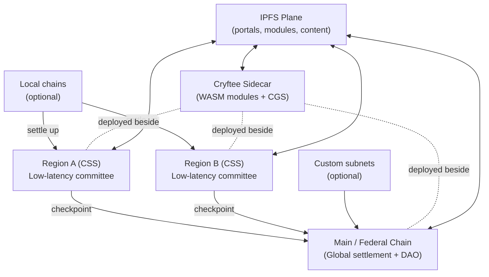
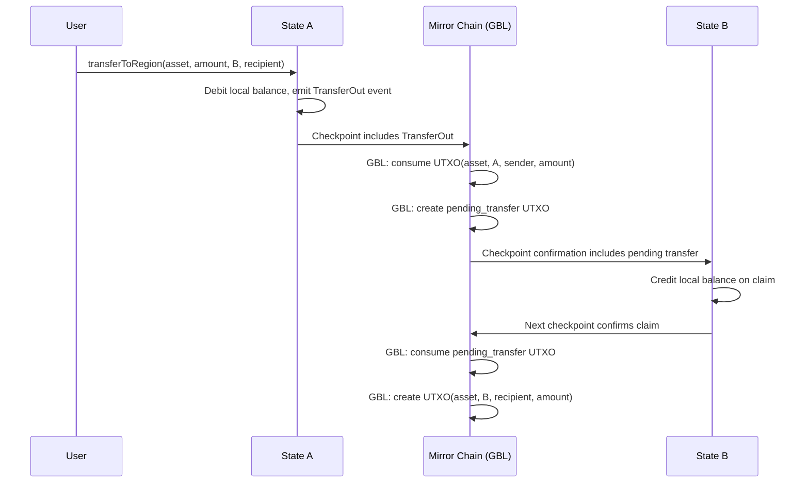
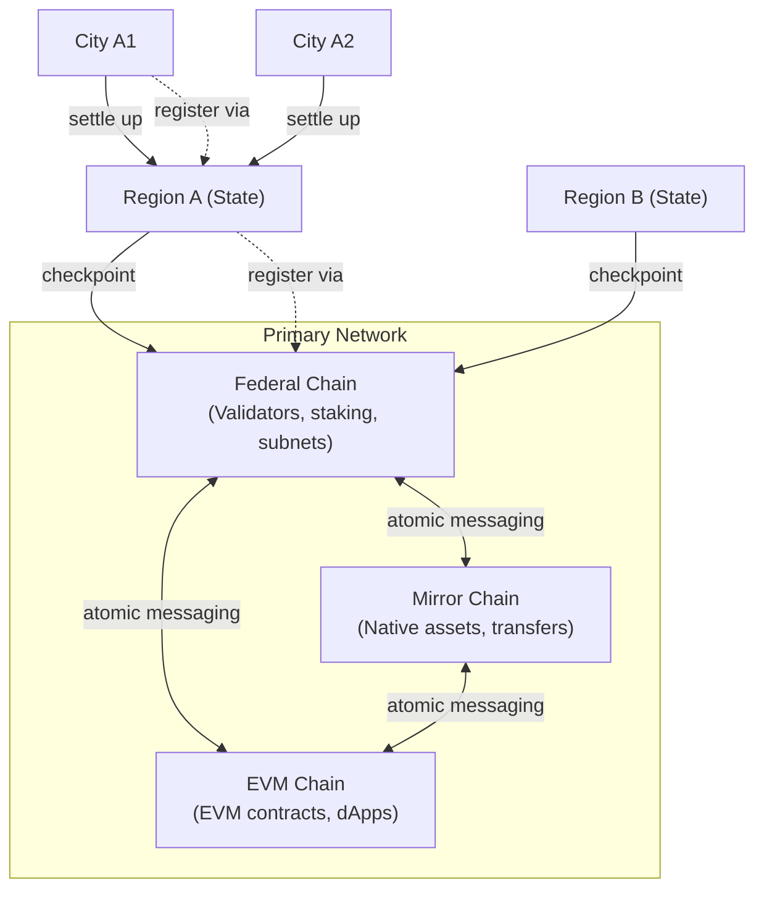
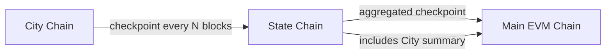

## 4. System overview

CryftNet is organized as a federation:

- **Primary Network (Federal + Mirror + EVM):** The canonical foundation consisting of three chains: Federal Chain (validator/subnet management), Mirror Chain (native asset transfers), and EVM Chain (EVM smart contracts). Together they provide settlement, cross-chain registries, global governance, and the primary validator DAO.
- **Regional chains (States):** Low-latency committees tuned for users within a latency domain. Most user activity is expected to be region-local and finalizes quickly.
- **Local chains (Cities):** Optional, for dense communities or enterprise enclaves. These settle to a region.
- **Cryftee plane:** A sidecar runtime deployed alongside validators and infrastructure nodes, hosting signed modules and CGS.
- **IPFS plane:** Content-addressed distribution for portals, modules, and application assets, with incentives for availability.

**Figure 1: CryftNet federation overview (conceptual)**

This diagram shows the high-level federation architecture. Main (Federal Chain) serves as the canonical settlement layer, with Regions providing low-latency service and optional Local chains for dense communities. Cryftee sidecars run alongside all validator nodes, hosting WASM modules and CGS. The IPFS plane provides content distribution across the network.



Main and regions are linked by checkpointing. Regions confirm locally, then periodically anchor a
signed checkpoint to Main. Cross-region transfers use these checkpoints and standard message
formats. The federation is "edge-like" in the sense that regions provide fast service nearby, but it
avoids centralized operators: validator sets are governed by DAOs and measured for eligibility using
network performance signals.

### 4.1 Primary Network architecture (Federal Chain + Mirror Chain + EVM Chain)

Inspired by Avalanche's multi-chain architecture, CryftNet's Primary Network is composed of **three specialized chains**, each optimized for a distinct role. Cryft Labs maintains first-class implementations and long-term governance over all three chains, while subnets may add additional chains as needed:

| Chain | Purpose | VM | Consensus | Typical Operations |
|:------|:--------|:---|:----------|:-------------------|
| **Federal Chain** (Federal) | Validator set management, staking, subnet lifecycle, chain registration/metadata, governance coordination | Native | CRVS (high security) | Validator add/remove, stake/unstake, subnet registration, governance proposals, slashing |
| **Mirror Chain** (Mirror) | Native asset creation and transfers optimized for throughput (UTXO-style), base asset movements | Native (UTXO) | CRVS (high throughput) | CRYFT transfers, asset issuance, cross-chain atomic swaps, high-frequency payments |
| **EVM Chain** (EVM Execution) | Account-based smart contract execution compatible with Solidity/Vyper tooling (the dApp chain) | EVM | CRVS (fast finality) | Token contracts, DEX swaps, NFTs, DeFi protocols, user dApp interactions |

**Why three separate chains?**

1. **Performance isolation:** Validator/staking traffic (Federal Chain), asset transfer traffic (Mirror Chain), and smart contract execution traffic (EVM Chain) do not compete for the same bottleneck. This prevents governance operations from being priced out during DeFi congestion, and prevents EVM gas spikes from affecting base asset transfers.

2. **Security differentiation:** Federal Chain can use more conservative parameters (larger committees, longer finality windows) for critical validator/subnet operations. Mirror Chain optimizes for throughput. EVM Chain balances speed with EVM determinism requirements.

3. **Specialized state models:** Federal Chain uses validator set / stake accounting. Mirror Chain uses UTXO for parallel asset transfers. EVM Chain uses account-based EVM state. Each model is optimal for its domain.

4. **Upgrade isolation:** EVM upgrades (new opcodes, gas changes) affect only EVM Chain. Federal Chain and Mirror Chain native VMs can evolve independently based on federation needs.

5. **Economic clarity:** Staking rewards flow through Federal Chain. Asset issuance/burns happen on Mirror Chain. DeFi fees stay on EVM Chain. Clean separation prevents cross-subsidy confusion.

**Federal Chain responsibilities:**

- **Validator Registry:** Global validator identities, stake bonds, delegation relationships, and slashing records. All staking operations occur on Federal Chain.
- **Subnet Registry:** All State/Region chains register here with their chain_id, validator set commitments, consensus parameters, and CEP compatibility declarations.
- **Checkpoint Acceptance:** Receives and validates checkpoint submissions from all registered subnets; maintains the canonical checkpoint history.
- **Governance Coordination:** Proposal lifecycle, voting tallies, timelocks, and execution triggers. Governance decisions are recorded on Federal Chain.
- **Validator Rewards Distribution:** Emission schedule, reward allocation, and validator/delegator payouts.

**Mirror Chain responsibilities:**

- **Native Asset Issuance:** Creation of new asset types (tokens, NFTs) with UTXO-based ownership.
- **High-Throughput Transfers:** Optimized for CRYFT and other native asset movements (not EVM tokens).
- **Cross-Chain Atomic Swaps:** UTXO-style atomic swaps between Mirror Chain assets and EVM Chain ERC-20 tokens.
- **Base Layer Transfers:** Users moving large amounts of CRYFT between wallets typically use Mirror Chain (lower fees than EVM Chain EVM gas).

**EVM Chain responsibilities:**

- **EVM Smart Contracts:** All Solidity/Vyper contracts, DeFi protocols, NFT marketplaces, and dApps.
- **Contract Mirror Registry (CMR):** Authoritative record of federation contract deployments--tracking target_regions[], deployed_regions[], mirror_status per region, and deployment fees paid. Updated via region checkpoints. Lives on EVM Chain (not Mirror).
- **Federation Contract Registry:** Tracks CREATE2 deployments, code hashes, and cross-region contract verification.
- **User-Facing dApp Interface:** When users "interact with CryftNet," they typically transact on EVM Chain (or regional EVM Chain instances).
- **GBL Access:** EVM Chain contracts query Mirror Chain's GBL via atomic cross-chain messaging or precompiles.

**Mirror Chain additional responsibilities:**

- **Global Balance Ledger (GBL):** The authoritative partitioned ledger for EVM token balances across all regions, **managed by Mirror Chain using an extended UTXO model**. Each UTXO includes metadata: {asset_id, region_id, account, amount}, tracking which account owns how much of each asset on which region. Mirror Chain serves as the single source of truth for partitioned balances; EVM Chain and subnets access GBL state via atomic cross-chain messaging or precompiles. Native CRYFT balances also use Mirror Chain (standard UTXO). **GBL tracking is opt-in for subnets--no custom bridge contracts required.**

- **Code Vault (Bytecode Vault):** The canonical storage and commitment layer for federation-deployable smart contract code. Stores code metadata including init_code_hash, runtime_code_hash, and optionally init_code blobs or IPFS CIDs. Each code package is assigned a unique code_id and is cryptographically committed. EVM Chain's CMR references these code_ids for deployment authorization and verification. Mirror Chain does NOT execute smart contracts--it only stores code commitments to enable deterministic CREATE2 deployment across regions. Regions verify deployed bytecode matches the runtime_code_hash from the Code Vault after deployment. This enables lazy mirroring (deploy-on-first-use) while guaranteeing identical contract addresses across all opted-in regions.

**Global Balance Ledger (GBL) architecture:**

The GBL tracks **EVM token balances** (ERC-20, ERC-721, etc.) across regions using **Mirror Chain's extended UTXO model**. Native CRYFT also uses standard UTXO on Mirror Chain. The GBL is **managed entirely by Mirror Chain** as a partitioned ledger; EVM Chain and subnets access it via atomic cross-chain messaging:

```text
GlobalBalanceLedger (Mirror Chain extended UTXO) {
  // Each UTXO carries metadata for partitioned balance tracking
  utxo_set: [
    {
      utxo_id: bytes32,           // Unique UTXO identifier
      asset_id: address,          // EVM token address (or CRYFT for native)
      region_id: uint64,          // Which region this balance belongs to
      account: address,           // EVM account owner
      amount: uint256,            // Balance amount
      lock_script: bytes,         // Spend authorization (signature requirements)
    },
    ...
  ]
  
  // Total supply per asset (derived from UTXO set)
  // total_supply[asset] = sum(utxo.amount for utxo in utxo_set if utxo.asset_id == asset)
  
  // Pending cross-region transfers (also as UTXOs with pending status)
  pending_transfers: [
    {
      transfer_id: bytes32,
      asset_id: address,
      amount: uint256,
      from_region: uint64,
      to_region: uint64,
      sender: address,
      recipient: address,
      initiated_checkpoint: uint64,
      status: enum { Pending, Claimed, Expired, Refunded },
    },
    ...
  ]
  
  // Conservation invariant: sum(utxo.amount for asset_id) == total_supply[asset_id]
}
```

**Why GBL lives on Mirror Chain (not EVM Chain or Federal Chain):**

1. **UTXO efficiency:** Mirror Chain's UTXO model naturally supports parallel validation and partitioned balances without account-based contention.
2. **Native asset layer:** Native CRYFT already uses Mirror Chain UTXO; extending for EVM token tracking unifies the asset layer.
3. **Atomic cross-chain messaging:** Primary Network's three-chain architecture enables atomic reads/writes from EVM Chain to Mirror GBL.
4. **Simple and robust:** Mirror remains lean (no smart contracts)--GBL is a ledger operation, not execution.
5. **Conservation checks:** UTXO model makes conservation invariant (`sum(utxo.amount) == total_supply`) mechanically enforceable.
6. **Modularity:** EVM Chain focuses on execution; Mirror Chain focuses on asset custody and partitioned balances.
7. **Opt-in for subnets:** Subnets query Mirror GBL via precompiles or bridge contracts--no Cryftee module dependency.

**GBL update flow:**

This sequence diagram illustrates a cross-region asset transfer from State A to State B. The flow shows the debit-checkpoint-credit pattern: (1) User initiates transfer on State A, (2) State A debits local balance and includes TransferOut in its checkpoint to Mirror Chain, (3) Mirror Chain GBL consumes source UTXO and creates pending transfer UTXO, (4) State B credits the recipient's local balance on claim, (5) State B's next checkpoint confirms the claim to Mirror Chain, (6) Mirror Chain GBL consumes pending transfer UTXO and creates destination UTXO, marking transfer complete.



**EVM Chain contracts accessing Mirror GBL:**

EVM Chain contracts **query** Mirror Chain GBL state via atomic cross-chain messaging or precompiles:

```text
// EVM Chain contract queries Mirror GBL via precompile or atomic message
function getRegionalBalance(address asset, uint64 regionId, address account) 
  returns (uint256) {
  // Precompile at 0x0000...0100 queries Mirror Chain GBL
  return MIRROR_GBL_PRECOMPILE.queryBalance(asset, regionId, account);
}

// Useful for:
// - DeFi protocols that need to know user's federation-wide balance
// - Governance contracts weighting votes by total holdings
// - Treasury contracts distributing rewards proportionally
```

Note: Native CRYFT balances use standard Mirror Chain UTXO. EVM Chain can wrap CRYFT via bridge contract (wrapped CRYFT is ERC-20 on EVM Chain, backed 1:1 by Mirror UTXO).

**Contract Mirror Registry (CMR) architecture:**

The CMR is EVM Chain's native data structure for tracking federation contract deployments and mirror state:

```text
ContractMirrorRegistry {
  // Per-contract deployment record
  contracts: Map<contract_address ->' ContractMirrorRecord>
  
  // Region deployment queue (contracts pending mirroring)
  pending_mirrors: Map<(contract_address, region_id) ->' PendingMirror>
  
  // Fee tracking per contract
  fees_paid: Map<contract_address ->' FeeRecord>
}

ContractMirrorRecord {
  contract_address: address,
  code_hash: bytes32,
  deployer: address,
  salt: bytes32,
  home_region: uint64,                    // Where initial deployment occurred
  target_regions: uint64[],               // Regions developer opted into
  deployed_regions: uint64[],             // Regions where contract is live
  mirror_status: Map<region_id ->' MirrorStatus>,  // Per-region status
  balance_portability: bool,
  verification_level: VerificationLevel,  // Unverified, Publisher, Federation
  created_at: uint64,
  last_updated: uint64
}

MirrorStatus {
  status: enum { Pending, Deployed, Failed, Revoked },
  deployed_at: uint64,
  init_hash: bytes32,          // Hash of initialization data
  initialized: bool,
  last_checkpoint: uint64      // Last checkpoint confirming this region
}

// Status transitions via region checkpoints:
// 1. Main receives deployment event ->' creates record, status[home] = Deployed
// 2. Main queues mirror to target_regions ->' status[target] = Pending
// 3. Region confirms deployment ->' status[target] = Deployed
// 4. Region reports failure ->' status[target] = Failed (auto-retry)
```

**CMR update flow (region-first deployment):**

```text
1) Developer deploys on Region A:
   - RegionDeployer.deploy(init_code, salt, options={target_regions: [A,B,C]})
   - Emits DeploymentEvent with region IDs and fee payment

2) Region A checkpoint -> Main EVM Chain:
   - EVM Chain processes DeploymentEvent
   - CMR creates: contracts[0xToken] = {
       home_region: A,
       target_regions: [A, B, C],
       deployed_regions: [A],
       mirror_status: {A: Deployed, B: Pending, C: Pending}
     }

3) Main triggers mirror to Regions B, C:
   - CMR updates: pending_mirrors[(0xToken, B)] = {queued}
   - CMR updates: pending_mirrors[(0xToken, C)] = {queued}

4) Region B, C receive mirror instruction and deploy:
   - RegionDeployer.mirror() called on each region
   - Region confirms in next checkpoint

5) Region B checkpoint -> Main EVM Chain:
   - EVM Chain updates CMR: deployed_regions: [A, B], mirror_status[B] = Deployed

6) Region C checkpoint -> Main EVM Chain:
   - EVM Chain updates CMR: deployed_regions: [A, B, C], mirror_status[C] = Deployed

CMR is authoritative - regions derive mirror permissions from EVM Chain state.
```

**CMR region expansion (post-deployment):**

```text
1) Developer requests expansion to Region D:
   - Calls FederationRegistry.expandRegions(0xToken, [D])
   - Pays expansion fee (0.01 CRYFT per region)

2) Checkpoint carries expansion request to Main:
   - EVM Chain verifies caller == deployer
   - EVM Chain verifies fee paid
   - CMR updates: target_regions: [A, B, C, D]
   - CMR updates: mirror_status[D] = Pending

3) Main triggers mirror to Region D

4) Region D confirms deployment in checkpoint:
   - CMR updates: deployed_regions: [A, B, C, D], mirror_status[D] = Deployed
```

**Cross-chain communication (Federal -> Mirror -> EVM):**

The Primary Network's three chains share the same validator set and use atomic messaging:

```text
Federal Chain -> EVM Chain:
- Validator set updates (Federal -> EVM for on-chain verification in EVM Chain contracts)
- Governance execution results (Federal -> EVM to trigger contract upgrades)
- Stake/unstake requests (EVM -> Federal when users interact via EVM Chain interface)
- Checkpoint finality confirmations (Federal -> EVM for subnet validation)
- Slashing events (Federal -> EVM to freeze validator-operated contracts)

Mirror Chain -> EVM Chain:
- CRYFT wrapping/unwrapping (Mirror -> EVM for native -> ERC-20 bridge)
- Cross-chain atomic swaps (Mirror -> EVM for asset exchanges)
- Asset issuance events (Mirror -> EVM when native assets need EVM representation)

Federal Chain -> Mirror Chain:
- Validator reward payouts (Federal -> Mirror for native CRYFT distribution)
- Emission schedule updates (Federal -> Mirror for minting authorization)
```

All three chains share the same block production schedule and validators, ensuring atomic cross-chain messaging without external bridges or delays.

**Figure: Primary Network three-chain architecture with subnet hierarchy**

This diagram shows the three-chain Primary Network (Federal, Mirror, EVM) with atomic messaging between them. States (Regions A and B) checkpoint to Federal Chain for settlement. Cities (A1, A2) checkpoint to their parent State, not directly to Main. Registration flows are shown with dotted lines.



### 4.2 Validator cross-participation requirements

A key architectural question is whether subnet (State/Region) validators must also validate the Primary Network. CryftNet adopts a **tiered requirement model**:

**Tier 1: CSS-1 State chains (required Primary Network participation)**

Validators for Cryft Standard Subnet (CSS-1) State chains **must** also be validators on the Primary Network (validating Federal Chain, Mirror Chain, and EVM Chain). This requirement ensures:

- **Security alignment:** State validators have direct stake in the Primary Network's security (via Federal Chain staking), preventing "vampire" attacks where a State chain extracts value without contributing to federation security.
- **Checkpoint integrity:** Validators who sign State checkpoints also validate those checkpoints on Federal Chain, creating accountability.
- **Governance participation:** State validators participate in Primary Network governance (via Federal Chain), ensuring federation decisions reflect the interests of active State operators.
- **Simplified slashing:** Misbehavior on a State chain can be slashed on Federal Chain without complex cross-chain evidence.

**Tier 2: Custom subnets (optional Primary Network participation)**

Custom subnets (non-CSS) may choose whether their validators participate in the Primary Network:

| Participation Level | Requirements | Benefits | Trade-offs |
|:--------------------|:-------------|:---------|:-----------|
| **Full** | Validate Main + subnet | Full federation services, governance rights, priority routing | Higher operational cost |
| **Partial** | Stake on Main, validate subnet only | Bridge access, registry listing, basic services | No governance votes, standard routing |
| **None** | Subnet-only validation | Maximum independence | No federation services, manual bridging only |

**Minimum stake requirements:**

```text
Main validator:           100,000 CRYFT minimum stake
CSS-1 State validator:    50,000 CRYFT additional stake (per State)
Custom subnet validator:  Defined by subnet parameters
City validator:           Defined by parent State (typically lower)
```

**Cross-validation benefits:**

- Validators earn rewards from both Main and subnet block production.
- Unified slashing: a single misbehavior affects all validator roles.
- Simplified key management: same validator identity across chains.
- Reputation portability: good behavior on Main improves subnet opportunities.

**Exemptions and transitions:**

- New State chains may request a **bootstrap period** (up to 6 months) where validators are not required to validate Main, allowing the State to establish itself before full integration.
- Validators may **delegate** their Main validation duties to a trusted operator while retaining their subnet role, subject to delegation limits.

### 4.3 Hierarchical chain registration (Cities via States)

CryftNet supports a three-tier hierarchy: Main ->' State (Region) ->' City (Local). A critical design decision is whether City chains must register directly with Main or can register only via their parent State.

**Recommended model: State-mediated City registration**

City chains register **only with their parent State chain**, not directly with Main's EVM Chain. This enables:

1. **Faster experimentation:** Launching a City requires only State DAO approval, not Main governance. This allows rapid iteration for local communities, enterprise enclaves, and specialized use cases.

2. **Reduced Main burden:** Main's EVM Chain does not need to track potentially thousands of City chains. It only tracks the ~10-100 State chains.

3. **State sovereignty:** States can define their own City policies--minimum stake, validator requirements, allowed VMs, and compliance rules--without Main override.

4. **Appropriate trust model:** Users of a City chain trust their State chain; they don't need global Main consensus for local operations.

**State-level City Registry:**

Each CSS-1 State chain maintains a **City Registry** contract/module with:

```text
CityRegistration {
  city_id: uint64,
  city_chain_id: uint256,
  parent_state_id: uint64,
  validator_set_hash: bytes32,
  consensus_type: string,
  vm_type: string,                  // "EVM", "WASM", "Custom"
  cep_compatibility: string,        // "CSS-1", "CSS-lite", "none"
  checkpoint_frequency: uint32,     // blocks between checkpoints to State
  registered_at: uint64,
  status: enum { Active, Suspended, Deregistered },
  metadata_cid: string              // IPFS CID for extended metadata
}
```

**City ->' State settlement:**

**Figure: City checkpoint aggregation flow**

Cities checkpoint to their parent State (not to Main). The State aggregates City checkpoints and includes a summary (e.g., Merkle root) in its own checkpoint to Main EVM Chain. Main does not verify City checkpoints directly.



The State's checkpoint to Main **may include** an aggregated City summary (Merkle root of City checkpoints), but this is optional. Main does not verify City checkpoints directly--it trusts the State to manage its Cities.

**City benefits and limitations:**

| Capability | City via State | Direct Main registration |
|:-----------|:---------------|:-------------------------|
| Registration latency | Minutes (State DAO) | Days-weeks (Main governance) |
| Federation Contract Registry | Via State (inherited) | Direct Main access |
| Cross-State bridging | Through State first | Direct (if allowed) |
| Main governance participation | None (vote via State) | Possible |
| Visibility to Main | Aggregated only | Full |
| Slashing authority | State | Main |

**Cross-City transfers (same State):**

Transfers between Cities under the same State settle via the State chain without touching Main:

```text
City A1 ->' City A2 (same State A):
1. City A1 includes transfer in checkpoint to State A
2. State A verifies and includes in State block
3. City A2 claims from State A's confirmed checkpoint
4. No Main involvement required
```

**Cross-City transfers (different States):**

Transfers between Cities under different States route through Main:

```text
City A1 (State A) ->' City B1 (State B):
1. City A1 checkpoints to State A
2. State A checkpoints to Main (includes City A1's outbound message)
3. State B receives from Main
4. City B1 claims from State B
```

**City upgrade path:**

A successful City may choose to "graduate" to State status:

1. City demonstrates sustained activity and validator quality.
2. City applies to Main governance for State registration.
3. Upon approval, City registers directly with EVM Chain.
4. City's existing users and contracts migrate or bridge.
5. City can now spawn its own sub-Cities.

### 4.4 City-level account management (State-mediated balances)

Since Cities register only via their parent State (not directly with Main), their account balances are managed **through the State**, not the federal Mirror Chain's Global Balance Ledger. This creates a clean separation:

| Level | Balance Authority | Settlement Target | Account Visibility |
|:------|:------------------|:------------------|:-------------------|
| Main (Mirror Chain) | Mirror Chain GBL (extended UTXO) | Final (self) | Global |
| State | Mirror Chain GBL (via checkpoints) | Main | Global |
| City | State Balance Ledger (SBL) | Parent State | State-local only |

**State Balance Ledger (SBL):**

Each CSS-1 State maintains its own **State Balance Ledger** for its Cities, mirroring Mirror Chain's GBL structure but at the State level:

```text
StateBalanceLedger {
  // Per-asset, per-city, per-account balance
  city_balances: Map<(asset_id, city_id, account) -> uint256>
  
  // State-level aggregate (what Mirror Chain GBL sees for this State)
  state_total: Map<(asset_id, account) -> uint256>
  
  // Invariant: state_total[asset, account] = 
  //   state_direct[asset, account] + sum(city_balances[asset, *, account])
  
  // Pending City->City and City->State transfers
  pending_city_transfers: Map<transfer_id -> PendingCityTransfer>
}
```

**Key architectural principle: Main doesn't see City accounts**

From Main's perspective, a State is a single entity. The Mirror Chain GBL tracks:
- `UTXO(USDC, State_A, Alice, 1000)`

From Main's perspective, a State is a single entity. The GBL tracks:
- `balances[USDC, State_A, Alice] = 1000`

But within State A, Alice's 1000 USDC might be distributed:
- State A direct: 200 USDC
- City A1: 500 USDC
- City A2: 300 USDC

Main doesn't know or care about this internal distribution--it's State A's responsibility to manage.

**City->'City transfers (same State):**

```text
City A1 ->' City A2 transfer (both under State A):

1) User on City A1 calls cityBridge.transferToCity(asset, amount, cityA2, recipient)
2) City A1 debits local balance, emits CityTransferOut
3) City A1 checkpoints to State A
4) State A's SBL updates:
   - city_balances[USDC, A1, Alice] -= 500
   - pending_city_transfers[id] = {Pending, dest=A2, ...}
5) City A2's next checkpoint sync from State includes pending transfer
6) Recipient claims on City A2
7) City A2 checkpoints claim confirmation to State A
8) State A's SBL updates:
   - city_balances[USDC, A2, Bob] += 500
   - pending_city_transfers[id].status = Claimed

Note: Main EVM Chain is NOT involved. State A's total balance is unchanged.
```

**City->'State transfer (escalation):**

```text
City A1 ->' State A direct transfer:

1) User calls cityBridge.escalateToState(asset, amount, recipient)
2) City A1 debits, checkpoints to State A
3) State A's SBL:
   - city_balances[USDC, A1, Alice] -= 500
   - state_direct[USDC, Alice] += 500
4) Alice can now spend directly on State A (faster, more liquidity)

Main still sees: balances[USDC, State_A, Alice] = 1000 (unchanged)
```

**City->Different State transfer (requires Main):**

```text
City A1 (State A) -> State B transfer:

1) City A1: cityBridge.transferToRegion(asset, amount, State_B, recipient)
2) City A1 checkpoints to State A with cross-State intent
3) State A's SBL:
   - city_balances[USDC, A1, Alice] -= 500
   - Cross-State transfer queued for next Main checkpoint
4) State A checkpoints to Main Mirror Chain with:
   - TransferOut(USDC, 500, from=State_A, to=State_B, ...)
5) Mirror Chain GBL:
   - Consume UTXO(USDC, State_A, Alice, old_amount)
   - Create pending_transfer UTXO
6) State B receives, recipient claims
7) Mirror Chain GBL:
   - Consume pending_transfer UTXO
   - Create UTXO(USDC, State_B, Bob, 500)

Note: Main only sees State-level balances. It doesn't know the transfer originated from a City.
```

**City balance visibility:**

| Query | Where to Ask | Response |
|:------|:-------------|:---------|
| "What's my total balance?" | Main Mirror Chain GBL | Sum across all States |
| "What's my State A balance?" | Main Mirror Chain GBL | Single State total |
| "What's my City A1 balance?" | State A SBL | City-specific balance |
| "Where exactly are my assets?" | State A SBL + each City | Full breakdown |

**Wallets and City balances:**

Wallets display City-level balances by:
1. Querying Mirror Chain GBL for State-level totals
2. For each State with balance > 0, querying the State's SBL for City breakdown
3. Displaying hierarchical view:

```text
Alice's USDC:
|-- Main:           500 USDC
|-- State A:      1,000 USDC
|   |-- Direct:     200 USDC
|   |-- City A1:    500 USDC
|   `-- City A2:    300 USDC
`-- State B:        250 USDC
    `-- Direct:     250 USDC
-----------------------------
Total:            1,750 USDC
```

**Why Cities don't register with Main:**

This hierarchical model provides:

1. **Scalability:** Main Mirror GBL tracks ~100 States, not ~10,000 Cities.
2. **State sovereignty:** States control their City ecosystem without Main approval.
3. **Latency:** City->City transfers within a State are fast (no Main checkpoint wait).
4. **Appropriate trust:** City users trust their State; they don't need global Main consensus.
5. **Simpler Main governance:** Main governs States; States govern Cities.

**City emergency exit:**

If a City chain fails or its State censors it, users can still recover:

1. Prove City balance via State's last confirmed checkpoint
2. Submit proof to State requesting balance escalation to State-direct
3. If State refuses, appeal to Main governance with evidence
4. Main can force-escalate City balances to State level (emergency measure)
5. User then exits State->'Main via normal cross-region transfer

This ensures users are never permanently trapped in a City.

This hierarchical model balances federation coherence with local autonomy, enabling CryftNet to scale to thousands of chains without overwhelming Main governance.

## 5. Network model and latency strategy

### 5.1 Regions as latency domains

A region is defined as a set of validators and routing policies optimized for a latency domain. The
domain can be geographic (e.g., Midwest US) or network-derived (e.g., a set of AS paths). The key
requirement is that a significant portion of users experience low RTT (round-trip time) to a sufficient
number of regional validators.

### 5.2 Validator eligibility via ping measurements

To prevent a "region" from being nominal only, CryftNet uses ping-based eligibility. A validator is
eligible for Region R only if it can demonstrate sustained low-latency connectivity to a quorum of
Region R measurement beacons.
Mechanism (proposal): 1) Region R maintains a Beacon Set: B = {b1..bm}. Beacons are run by
independent operators approved by the region DAO and optionally co-hosted by regional validators.
2) During each epoch, validators perform signed ping sessions to beacons using a fixed protocol
(e.g., QUIC PING or UDP echo with replay protection). Beacons also ping validators. 3) Beacons emit
signed measurement reports containing distribution summaries (p50, p95, loss rate, jitter) and
timestamps. 4) Validators submit an aggregated proof to the region chain. The chain computes an
Eligibility Score.
```text
EligibilityScore(v, R) =

  w1 * clamp(1 - p95_rtt(v,R)/RTT_MAX, 0, 1)
+ w2 * clamp(1 - loss(v,R)/LOSS_MAX, 0, 1)
+ w3 * clamp(1 - jitter(v,R)/JITTER_MAX, 0, 1)
+ w4 * beacon_quorum_ok(v,R)
Constraints:
- beacon_quorum_ok requires at least q of m beacons reporting in-window measurements.
- reports are signed by beacons and include nonces to prevent replay.
