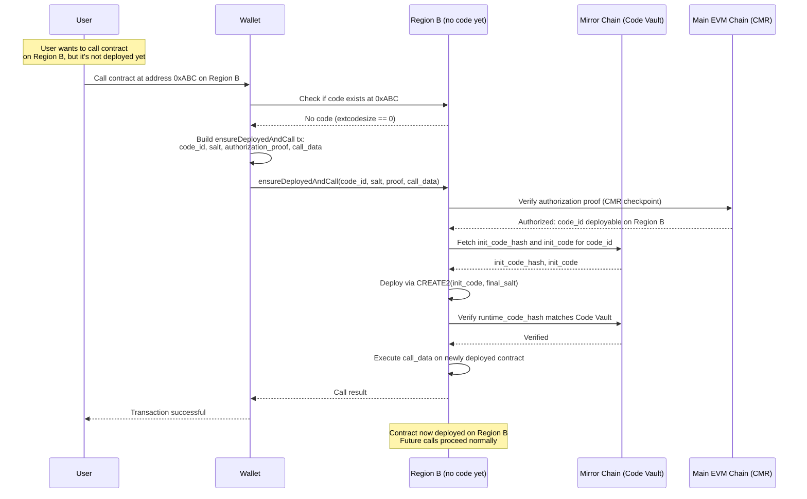

Operation                          | Fee per Region
-----------------------------------|----------------
Contract deployment mirroring      | 0.01 CRYFT
Balance portability setup          | 0.005 CRYFT
Cross-region balance update        | 0.001 CRYFT
Region expansion (post-deploy)     | 0.01 CRYFT

Example: Deploy token to 5 regions with balance portability
- Local deployment gas: ~500k gas
- Mirroring to 4 additional regions: 4 × 0.01 = 0.04 CRYFT
- Balance portability on 5 regions: 5 × 0.005 = 0.025 CRYFT
- Total federation fee: 0.065 CRYFT + local gas

Fees flow to:
- 50% -> Main treasury (funds federation operations)
- 30% -> Target region validators (incentivizes mirroring)
- 20% -> Checkpoint relayers (incentivizes fast propagation)
```

**RegionDeployer architecture:**

To ensure deterministic addresses across regions, every region has a `RegionDeployer` contract at the same address:

```text
RegionDeployer (exists at 0xRegionDeployer on all chains):

  // Federation fee receiver (Main treasury on each region)
  address public immutable FEE_RECEIVER;
  
  // Per-region mirroring fee (set by Main governance)
  uint256 public mirrorFeePerRegion;
  uint256 public portabilityFeePerRegion;

  // Developer-initiated deployment (region-first)
  function deploy(
    bytes calldata init_code,
    bytes32 salt,
    DeployOptions calldata options
  ) external payable returns (address) {
    
    // Calculate required federation fee
    uint256 requiredFee = calculateFederationFee(options);
    require(msg.value >= requiredFee, "Insufficient federation fee");
    
    // Forward fee to Main treasury
    if (requiredFee > 0) {
      FEE_RECEIVER.transfer(requiredFee);
    }
    
    // Compute deterministic address
    bytes32 final_salt = keccak256(abi.encode(msg.sender, salt));
    address deployed = CREATE2(init_code, final_salt);
    
    // Record deployment with explicit region targets
    deployments[deployed] = DeploymentRecord({
      deployer: msg.sender,
      code_hash: keccak256(init_code),
      salt: salt,
      final_salt: final_salt,
      target_regions: options.target_regions,  // EXPLICIT region list
      balance_portability: options.balance_portability,
      home_region: REGION_ID,
      fee_paid: requiredFee,
      timestamp: block.timestamp
    });
    
    emit ContractDeployed(deployed, msg.sender, options.target_regions, requiredFee);
    return deployed;
  }
  
  function calculateFederationFee(DeployOptions calldata options) 
    public view returns (uint256) {
    
    uint256 fee = 0;
    
    // Mirroring fee for each target region beyond home
    uint256 mirrorRegions = options.target_regions.length > 0 
      ? options.target_regions.length - 1 
      : 0;
    fee += mirrorRegions * mirrorFeePerRegion;
    
    // Balance portability fee for each target region
    if (options.balance_portability) {
      fee += options.target_regions.length * portabilityFeePerRegion;
    }
    
    return fee;
  }
  
  // Lazy mirroring: deploy-on-first-use
  // This enables contracts to be deployed on-demand when first called on a region
  function ensureDeployedAndCall(
    bytes32 code_id,
    bytes32 salt,
    bytes calldata authorization_proof,
    bytes calldata call_data
  ) external payable returns (bytes memory) {
    
    // 1. Compute deterministic address
    bytes32 final_salt = keccak256(abi.encode(msg.sender, salt));
    address contractAddress = computeAddress(final_salt, code_id);
    
    // 2. Check if already deployed
    uint256 codeSize;
    assembly { codeSize := extcodesize(contractAddress) }
    
    if (codeSize == 0) {
      // 3. Contract not yet deployed on this region - deploy it now
      
      // 3a. Verify authorization from Main CMR via checkpoint proof
      require(
        verifyDeploymentAuthorization(code_id, salt, REGION_ID, authorization_proof),
        "Unauthorized deployment for this region"
      );
      
      // 3b. Fetch init_code from Mirror Chain Code Vault (or use loader init_code)
      bytes memory init_code = fetchInitCode(code_id);
      
      // 3c. Deploy via CREATE2
      address deployed;
      assembly {
        deployed := create2(0, add(init_code, 0x20), mload(init_code), final_salt)
      }
      require(deployed == contractAddress, "CREATE2 address mismatch");
      
      // 3d. Verify runtime bytecode matches Code Vault commitment
      bytes32 deployed_code_hash;
      assembly { deployed_code_hash := extcodehash(deployed) }
      require(
        verifyRuntimeCodeHash(code_id, deployed_code_hash),
        "Runtime bytecode mismatch"
      );
      
      // 3e. First caller pays deployment gas + federation fee
      uint256 deploymentFee = mirrorFeePerRegion;
      require(msg.value >= deploymentFee, "Insufficient deployment fee");
      FEE_RECEIVER.transfer(deploymentFee);
      
      emit ContractLazilyDeployed(contractAddress, code_id, msg.sender, deploymentFee);
    }
    
    // 4. Execute the call atomically (forward remaining value after fee)
    uint256 callValue = codeSize == 0 ? msg.value - deploymentFee : msg.value;
    (bool success, bytes memory result) = contractAddress.call{value: callValue}(call_data);
    require(success, "Contract call failed");
    
    return result;
  }
  
  // Compute CREATE2 address without deploying
  function computeAddress(bytes32 final_salt, bytes32 code_id) 
    public view returns (address) {
    
    bytes32 init_code_hash = getInitCodeHash(code_id);
    bytes32 hash = keccak256(
      abi.encodePacked(
        bytes1(0xff),
        address(this),
        final_salt,
        init_code_hash
      )
    );
    return address(uint160(uint256(hash)));
  }
  
  // Verify deployment authorization from Main CMR checkpoint
  function verifyDeploymentAuthorization(
    bytes32 code_id,
    bytes32 salt,
    uint64 region_id,
    bytes calldata proof
  ) internal view returns (bool) {
    // Verify that Main CMR authorizes this code_id deployment on this region
    // Proof is either:
    // (a) Merkle proof against finalized Main checkpoint root, or
    // (b) ZK validity proof of CMR state, or
    // (c) Quorum signature from Main validators
    
    // Implementation depends on checkpoint verification mechanism
    return CMR_VERIFIER.verify(code_id, region_id, proof);
  }
  
  // Fetch init_code from Mirror Chain Code Vault
  function fetchInitCode(bytes32 code_id) 
    internal view returns (bytes memory) {
    
    // Query Mirror Chain Code Vault via atomic cross-chain read
    // Returns either full init_code or loader init_code that fetches from IPFS
    return MIRROR_CODE_VAULT.getInitCode(code_id);
  }
  
  // Get init_code_hash for CREATE2 computation
  function getInitCodeHash(bytes32 code_id) 
    internal view returns (bytes32) {
    
    // Query Mirror Chain Code Vault for init_code_hash commitment
    return MIRROR_CODE_VAULT.getInitCodeHash(code_id);
  }
  
  // Verify runtime bytecode matches Code Vault commitment
  function verifyRuntimeCodeHash(bytes32 code_id, bytes32 deployed_code_hash) 
    internal view returns (bool) {
    
    // Query Mirror Chain Code Vault for runtime_code_hash commitment
    bytes32 expected_hash = MIRROR_CODE_VAULT.getRuntimeCodeHash(code_id);
    return expected_hash == deployed_code_hash;
  }
```

**Lazy mirroring flow (deploy-on-first-use):**

This sequence diagram illustrates how a contract can be deployed on-demand when first called on a region, without requiring eager deployment across all target regions:



**Key properties of lazy mirroring:**

1. **Same address guaranteed:** CREATE2 with canonical deployer + salt + init_code_hash ensures identical address on all regions.

2. **Deploy-on-first-use:** Contracts don't need to be deployed eagerly on all target regions. First caller on a region pays deployment gas + federation fee; subsequent callers pay normal gas.

3. **Authorization enforcement:** Regions only deploy contracts authorized by Main CMR. The authorization_proof (checkpoint Merkle proof or ZK proof) prevents unauthorized code injection.

4. **Code integrity:** Runtime bytecode must match Code Vault's runtime_code_hash commitment. This prevents code tampering.

5. **Seamless UX:** Wallets can transparently wrap calls in ensureDeployedAndCall(), making lazy deployment invisible to users.

6. **Constructor safety:** Federation-verified contracts MUST use zero-balance constructors. Initial state set via separate initialize() call restricted to home_region or authorized initializer. This prevents constructor-based supply duplication across regions.
