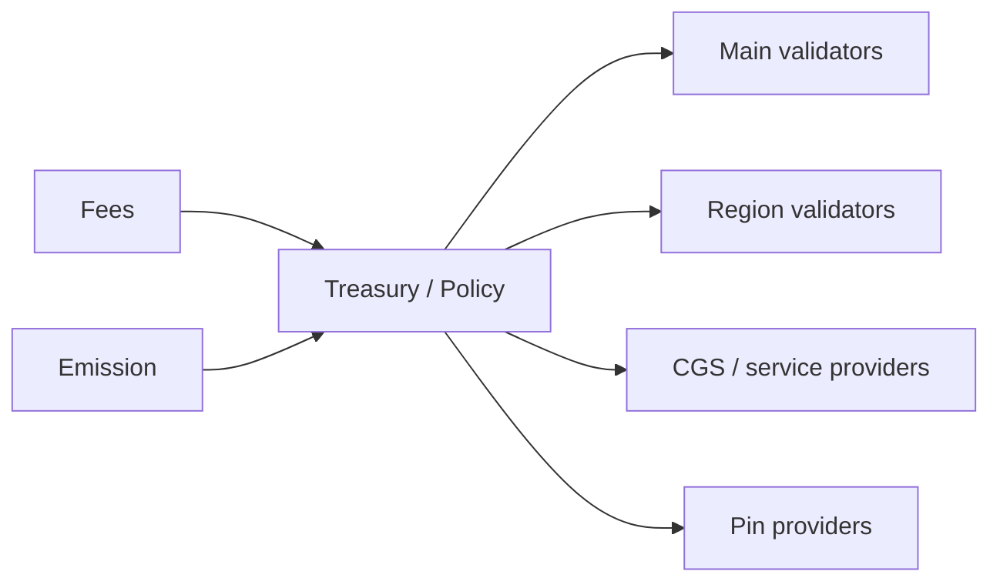

   
5) INITIAL MINT (Main only):
   - Circle calls USDC.mint(Circle, 1_000_000_000)
   - GBL records: balances[USDC, Main, Circle] = 1B
   - GBL records: total_supply[USDC] = 1B
   
6) DEPLOY ON REGIONS (after checkpoint):
   - Each region deploys same code at 0xUSDC
   - All regional contracts start with ZERO balances
   - Only Main has Circle's balance
   
7) DISTRIBUTION:
   - Circle transfers USDC to users via normal transfers
   - Cross-region transfers move balances as needed
   - GBL always enforces: Σ(regional) = total_supply
```

**Racing attack is now impossible:**

```text
Attack attempt: Attacker races to deploy on Region B before Main checkpoint

1) Attacker tries to call FederationDeployer.deploy(USDC_bytecode, salt) on Region B
2) FederationDeployer checks authorization from Main checkpoint
3) Authorization not yet received â†' REVERTS
4) Attacker cannot deploy

Even if attacker deploys their own version:
- Uses different deployer â†' different address (not 0xUSDC)
- Not in Federation Registry â†' wallets warn users
- Cannot mint because they're not authorized_minter on a verified contract
```

**Handling native CRYFT:**

The native gas token (CRYFT) uses the same partitioned model, but at the protocol level rather than contract level:

- Each region tracks CRYFT balances independently.
- Cross-region CRYFT transfers use the same debit-checkpoint-credit flow.
- Main tracks total supply and ensures conservation: Σ(region_balances) = total_supply.

**Comparison: Partitioned vs. Wrapped model:**

| Aspect | Partitioned Balances | Wrapped Tokens (LMB) |
|:-------|:--------------------|:---------------------|
| User mental model | "I have 300 USDC on Region A" | "I have 300 wUSDC (wrapped) on Region A" |
| Contract address | Same everywhere | Different (bridge + wrapped token) |
| Token symbol | Same (USDC) | Different (wUSDC, USDC.a, etc.) |
| Transfer mechanism | transferToRegion() | lock() + claim() |
| Accounting | Sum of regional balances | Locked on home + wrapped on others |
| Implementation complexity | Simpler | More contracts |
| Wallet UX | Cleaner (one token, regional balances) | Confusing (multiple token symbols) |

**Recommendation:** Use the **partitioned balance model** as the default for CSS-1 regions. The wrapped token model remains available for custom subnets or bridging to external chains (Ethereum, etc.).

**Supply conservation invariant:**

```text
For any token T deployed via federation registry:

Σ (balances[region][account] for all accounts, for all regions) = total_supply[T]

This is verified by:
1) Each region reports its total balance in checkpoints
2) Main aggregates and verifies: Σ(region_totals) = expected_supply
3) Discrepancy triggers investigation and potential bridge pause
```

**Handling the "follow-me" mirroring case:**

The account mirroring feature (Section 10.6) can work with the partitioned model, but requires careful design. Mirroring allows a user to have **spending authorization** across multiple regions without explicitly transferring each time.

**Important:** Mirroring does NOT duplicate assets. It provides a **credit line** mechanism:

1. User deposits assets on Main into a mirroring contract.
2. Mirroring contract grants spending credit to selected regions.
3. User can spend up to their credit on any mirrored region.
4. Main reconciles all spending after checkpoints and adjusts remaining credit.
5. If user overspends (double-spend attempt), later transactions are reverted.

```text
Mirroring with partitioned balances:

User Alice enables mirroring for 1000 USDC across regions [A, B, C]:

Step 1: Deposit
- Alice transfers 1000 USDC from her Region A balance to Main mirroring contract
- Her Region A balance: 1000 â†' 0 USDC
- Main mirroring contract holds: 1000 USDC for Alice

Step 2: Credit allocation
- Main grants Alice credit_line = 1000 on each mirrored region
- This is NOT balance duplicationâ€"it's spending authorization

Step 3: Spending
- Alice spends 300 on Region A â†' local_spent[A] = 300
- Alice spends 200 on Region B â†' local_spent[B] = 200
- Total spent: 500, within 1000 limit âœ"

Step 4: Reconciliation (on checkpoint)
- Main receives: spent_A=300, spent_B=200, spent_C=0
- Main debits mirroring contract: 1000 - 500 = 500 remaining
- New credit_line pushed to regions: 500 each

Step 5: Double-spend attempt (attack)
- Alice tries to spend 400 on A and 400 on B simultaneously (total 800)
- Before sync: both succeed locally (each within 500 credit)
- Checkpoint order: A finalizes first â†' spent_A=400, remaining=100
- B's checkpoint arrives â†' spent_B=400 would exceed remaining
- Main rejects B's spend, marks for revert on Region B
- Alice penalized; mirroring may be suspended
```

The key insight: **mirroring converts partitioned balances into a credit system**, where Main is the source of truth and regions operate optimistically with reconciliation.

**Protocol-level enforcement:**

The single-location invariant (or partitioned balance integrity) is enforced at multiple layers:

1. **Partitioned balance contracts** track per-region balances separately.
2. **Cross-region transfers** require debit-checkpoint-credit flow.
3. **Checkpoint verification** (on Main) ensures only valid debits are recognized.
4. **Claim verification** (on destination) verifies Merkle proofs and tracks consumed transfer_ids.
5. **ZK validity proofs** (optional) make forgery computationally infeasible.
6. **Federation Contract Registry** ensures same code at same address across regions.
7. **Slashing** for validators who sign invalid checkpoints.

**Emergency procedures:**

If a bug or attack causes balance discrepancy:

1. **Pause cross-region transfers** via federation governance emergency action.
2. **Audit discrepancy** using checkpoint history on Main.
3. **Reconcile** by adjusting balances on affected region(s) or compensating from treasury.
4. **Post-mortem** and protocol upgrade to prevent recurrence.

The combination of partitioned balances, cryptographic proofs, deterministic deployment, and governance oversight ensures that the sum of all regional balances always equals the canonical supply.

---

## 11. Asset model, rewards, and monetary policy

### 11.1 Native gas asset across the federation

CryftNet uses a native gas asset (denoted CRYFT in this document) for transaction fees on Main and
on CSS chains by default. Custom subnets may use alternative fee assets, but must publish their fee
asset policy in their Federation Interface Declaration. A consistent fee asset simplifies routing, pricing,
and cross-chain UX, but is not mandatory for all subnets.

### 11.2 Fee markets

There are multiple fee markets: - Execution fees: EVM gas fees on Main and on subnets. - Settlement
fees: fees for anchoring checkpoints and relaying cross-chain messages. - CGS fees: fees for private
intent propagation, threshold services, and spam resistance. - Storage/pinning fees: budgets
attached to pin jobs for IPFS availability.

### 11.3 Validator rewards: Main and regions

Reward sources are a sum of: - base emission (optional): E_epoch - transaction fees: F_epoch (gas
fees) net of burns (if any) - settlement fees: S_epoch - treasury subsidies: T_epoch (optional) Let

```text
R_epoch = E_epoch + F_epoch + S_epoch + T_epoch. Rewards are split: - Main validator set:
R_main = R_epoch * w_main - Region validator sets: R_regions = R_epoch * w_regions (distributed
among participating regions by activity and stake) - CGS service providers: R_cgs = R_epoch *
w_cgs - Pin providers: R_pin = P_epoch (separately budgeted by pin jobs, plus optional treasury
top-ups) Where w_main + w_regions + w_cgs <= 1; remaining may be burned or sent to treasury.
```

#### 11.3.1 Parameter table (example defaults)

| Parameter | Symbol | Example | Notes |
|:----------|:-------|:--------|:------|
| Epoch length | EPOCH | 10 minutes (regions), 30 minutes (Main) | Regions shorter; Main longer for stability |
| Fast quorum | q_fast | 67% | Used in CRVS fast path |
| Slow quorum | q_slow | 80% | Used in CRVS slow path |
| Ping RTT max (region) | RTT_MAX | 80 ms | Eligibility gate; region-specific |
| Ping quorum | q_beacon | >= 3 of 5 beacons | Prevents single beacon bias |
| Slashing max | SLASH_MAX | up to 5% stake | For provable misbehavior; governed |

```text
Example weight policy (governance-controlled):
w_main   = 0.35
w_regions= 0.45
w_cgs    = 0.10
w_treas  = 0.10   // treasury accumulation
(These are illustrative, not fixed.)
```

Within a validator set, rewards are distributed by a combination of stake weight and performance:

- **stake_weight(v):** based on bonded stake (and delegated stake where supported)
- **perf(v):** based on uptime, vote participation, relay responsiveness, and (for regions) eligibility score from pings

```text
RewardShare(v) = stake_weight(v)^a * perf(v)^b / Z
```

with exponents a,b set by governance (typical: a near 1, b in [0.3, 1.0]).

**Figure 2: Reward flows (illustrative)**



### 11.4 IPFS pinning rewards: availability as a protocol primitive

CryftNet treats IPFS availability as a rewarded service rather than a background assumption. Pinning
rewards are designed to keep critical content (portals, module binaries, and app assets) available
with measurable reliability. Key components: 1) Pin Provider Registry: providers stake/bond and
advertise a service endpoint (or declare they operate via Cryftee ipfs_v1). 2) Pin Jobs: on-chain
