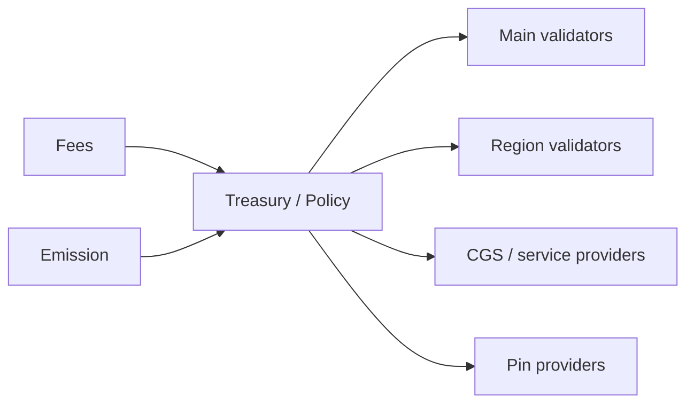

   
5) INITIAL MINT (Main only):
   - Circle calls USDC.mint(Circle, 1_000_000_000)
   - Mirror GBL creates: UTXO(USDC, Main, Circle, 1B)
   - Mirror GBL records: total_supply[USDC] = 1B
   
6) DEPLOY ON REGIONS (after checkpoint):
   - Each region deploys same code at 0xUSDC
   - All regional contracts start with ZERO balances
   - Only Main has Circle's balance
   
7) DISTRIBUTION:
   - Circle transfers USDC to users via normal transfers
   - Cross-region transfers move balances as needed
   - Mirror Chain GBL always enforces: sum(regional) = total_supply
```

**Racing attack is now impossible:**

```text
Attack attempt: Attacker races to deploy on Region B before Main checkpoint

1) Attacker tries to call FederationDeployer.deploy(USDC_bytecode, salt) on Region B
2) FederationDeployer checks authorization from Main checkpoint
3) Authorization not yet received ->' REVERTS
4) Attacker cannot deploy

Even if attacker deploys their own version:
- Uses different deployer ->' different address (not 0xUSDC)
- Not in Federation Registry ->' wallets warn users
- Cannot mint because they're not authorized_minter on a verified contract
```

**Handling native CRYFT:**

The native gas token (CRYFT) uses the same partitioned model, but at the protocol level rather than contract level:

- Each region tracks CRYFT balances independently.
- Cross-region CRYFT transfers use the same debit-checkpoint-credit flow.
- Main tracks total supply and ensures conservation: sum(region_balances) = total_supply.

**Comparison: Partitioned vs. Wrapped model:**

| Aspect | Partitioned Balances | Wrapped Tokens (LMB) |
|:-------|:--------------------|:---------------------|
| User mental model | "I have 300 USDC on Region A" | "I have 300 wUSDC (wrapped) on Region A" |
| Contract address | Same everywhere | Different (bridge + wrapped token) |
| Token symbol | Same (USDC) | Different (wUSDC, USDC.a, etc.) |
| Transfer mechanism | transferToRegion() | lock() + claim() |
| Accounting | Sum of regional balances | Locked on home + wrapped on others |
| Implementation complexity | Simpler | More contracts |
| Wallet UX | Cleaner (one token, regional balances) | Confusing (multiple token symbols) |

**Recommendation:** Use the **partitioned balance model** as the default for CSS-1 regions. The wrapped token model remains available for custom subnets or bridging to external chains (Ethereum, etc.).

**Supply conservation invariant:**

```text
For any token T deployed via federation registry:

sum (balances[region][account] for all accounts, for all regions) = total_supply[T]

This is verified by:
1) Each region reports its total balance in checkpoints
2) Main aggregates and verifies: sum(region_totals) = expected_supply
3) Discrepancy triggers investigation and potential bridge pause
```

**Handling the "follow-me" mirroring case:**

The account mirroring feature (Section 10.6) can work with the partitioned model, but requires careful design. Mirroring allows a user to have **spending authorization** across multiple regions without explicitly transferring each time.

**Important:** Mirroring does NOT duplicate assets. It provides a **credit line** mechanism:

1. User deposits assets on Main into a mirroring contract.
2. Mirroring contract grants spending credit to selected regions.
3. User can spend up to their credit on any mirrored region.
4. Main reconciles all spending after checkpoints and adjusts remaining credit.
5. If user overspends (double-spend attempt), later transactions are reverted.

```text
Mirroring with partitioned balances:

User Alice enables mirroring for 1000 USDC across regions [A, B, C]:

Step 1: Deposit
- Alice transfers 1000 USDC from her Region A balance to Main mirroring contract
- Her Region A balance: 1000 ->' 0 USDC
- Main mirroring contract holds: 1000 USDC for Alice

Step 2: Credit allocation
- Main grants Alice credit_line = 1000 on each mirrored region
- This is NOT balance duplication--it's spending authorization

Step 3: Spending
- Alice spends 300 on Region A ->' local_spent[A] = 300
- Alice spends 200 on Region B ->' local_spent[B] = 200
- Total spent: 500, within 1000 limit ✓

Step 4: Reconciliation (on checkpoint)
- Main receives: spent_A=300, spent_B=200, spent_C=0
- Main debits mirroring contract: 1000 - 500 = 500 remaining
- New credit_line pushed to regions: 500 each

Step 5: Double-spend attempt (attack)
- Alice tries to spend 400 on A and 400 on B simultaneously (total 800)
- Before sync: both succeed locally (each within 500 credit)
- Checkpoint order: A finalizes first ->' spent_A=400, remaining=100
- B's checkpoint arrives ->' spent_B=400 would exceed remaining
- Main rejects B's spend, marks for revert on Region B
- Alice penalized; mirroring may be suspended
```

The key insight: **mirroring converts partitioned balances into a credit system**, where Main is the source of truth and regions operate optimistically with reconciliation.

**Protocol-level enforcement:**

The single-location invariant (or partitioned balance integrity) is enforced at multiple layers:

1. **Partitioned balance contracts** track per-region balances separately.
2. **Cross-region transfers** require debit-checkpoint-credit flow.
3. **Checkpoint verification** (on Main) ensures only valid debits are recognized.
4. **Claim verification** (on destination) verifies Merkle proofs and tracks consumed transfer_ids.
5. **ZK validity proofs** (optional) make forgery computationally infeasible.
6. **Federation Contract Registry** ensures same code at same address across regions.
7. **Slashing** for validators who sign invalid checkpoints.

**Emergency procedures:**

If a bug or attack causes balance discrepancy:

1. **Pause cross-region transfers** via federation governance emergency action.
2. **Audit discrepancy** using checkpoint history on Main.
3. **Reconcile** by adjusting balances on affected region(s) or compensating from treasury.
4. **Post-mortem** and protocol upgrade to prevent recurrence.

The combination of partitioned balances, cryptographic proofs, deterministic deployment, and governance oversight ensures that the sum of all regional balances always equals the canonical supply.

---

## 11. Asset model, rewards, and monetary policy

### 11.1 Native gas asset across the federation

CryftNet uses a native gas asset (denoted CRYFT in this document) for transaction fees on Main and
on CSS chains by default. Custom subnets may use alternative fee assets, but must publish their fee
asset policy in their Federation Interface Declaration. A consistent fee asset simplifies routing, pricing,
and cross-chain UX, but is not mandatory for all subnets.

### 11.2 Fee markets

There are multiple fee markets: - Execution fees: EVM gas fees on Main and on subnets. - Settlement
fees: fees for anchoring checkpoints and relaying cross-chain messages. - CGS fees: fees for private
intent propagation, threshold services, and spam resistance. - Storage/pinning fees: budgets
attached to pin jobs for IPFS availability.

### 11.3 Validator rewards: Primary Network and regions

**v1 Fixed Policy (Mainnet Launch):**
CryftNet mainnet v1 launches with a **fixed monetary policy** (see Appendix 16.8 for canonical specification):
- **No emission**: 0 CRYFT/block (no inflation)
- **Fee distribution**: 50% burned, 30% to validator rewards, 20% to treasury
- **Minimum stake**: 1,000 CRYFT for Primary Network validators
- **Slashing rate**: 5% of stake per provable misbehavior (see Section 11.3.2 for v1 evidence specification)

This v1 policy provides economic predictability for mainnet launch.

#### 11.3.1 v1 Slashing Evidence Specification (Snowman Consensus)

**Provable Misbehavior Set for v1 (Snowman/Avalanche Consensus):**

Unlike BFT consensus protocols with explicit double-vote detection, Snowman consensus does not produce a simple "conflicting block signature" evidence surface. v1 slashing is limited to behaviors with **cryptographically verifiable on-chain evidence**.

**Slashable in v1:**

1. **Checkpoint Equivocation (5% stake)**
   - **Evidence**: Two checkpoint signatures from same validator for same height with conflicting state roots.
   - **Messages**: `CheckpointSignature{height, state_root, merkle_root, validator_pubkey, signature}`
   - **Verification on Federal Chain**:
     ```
     1. Verify both signatures are valid for validator_pubkey
     2. Verify height is identical
     3. Verify state_root or merkle_root differ
     4. Verify validator was in active set at that height
     ```
   - **Rationale**: Checkpoints anchor region/subnet state to Federal Chain; conflicting checkpoints enable double-spend attacks on cross-chain transfers.

2. **Invalid Bundle Proposal (3% stake)**
   - **Evidence**: Bundle proposal with provably invalid state transition (e.g., violated cross-chain invariant, invalid EVM execution).
   - **Messages**: `BundleProposal{height, federal_block, mirror_block, evm_block, proposer_sig}` + `InvalidStateProof{violated_invariant, merkle_proof}`
   - **Verification on Federal Chain**:
     ```
     1. Verify proposer signature on bundle
     2. Re-execute state transition deterministically
     3. Verify invariant violation (e.g., Mirror debit != EVM credit)
     4. Verify proposer was scheduled for that bundle height
     ```
   - **Rationale**: Primary Network atomic bundles require all three VMs to execute validly; proposers who submit invalid bundles are penalized.

3. **Cryftee Attestation Fraud (10% stake)**
   - **Evidence**: Node submits attestation claiming valid Cryftee modules, but peer verification or governance audit proves attestation is forged or modules are malicious.
   - **Messages**: `AttestationClaim{node_id, module_hashes[], signature}` + `FraudProof{challenge_response, verification_failure}`
   - **Verification on Federal Chain**:
     ```
     1. Verify attestation signature matches validator's registered key
     2. Governance committee or quorum of validators submit counter-proof
     3. Counter-proof shows module hashes do not match canonical registry OR attestation signature is invalid
     ```
   - **Rationale**: Cryftee attestation is a security-critical requirement for validators; forging attestation undermines the entire execution integrity model.

**NOT Slashable in v1 (lack of objective proof substrate):**

1. **Snowman Vote Equivocation**: Snowman uses preference signaling, not finalization votes. Validators may legitimately change preferences during the consensus process. No objective "double-vote" surface exists.

2. **Block Withholding**: Validators in Snowman do not have explicit block proposal duties based on deterministic assignment. Withholding cannot be proven without timing assumptions that are not consensus-safe.

3. **Invalid Snowman Block Propagation**: Invalid blocks are rejected by peers during normal consensus operation; propagating an invalid block is not distinguishable from network errors or software bugs. No objective evidence format exists.

4. **Liveness Failures**: Offline validators or delayed block production cannot be slashed because network conditions, hardware failures, and software bugs are indistinguishable from intentional behavior.

**Evidence Submission Flow:**

1. **Observation**: Any network participant observes slashable misbehavior.
2. **Evidence Construction**: Participant constructs evidence package with required cryptographic proofs.
3. **On-Chain Submission**: Evidence submitted to Federal Chain via `submitSlashingEvidence(evidence_bytes)` transaction.
4. **Automated Verification**: Federal Chain VM verifies evidence deterministically using rules above.
5. **Slashing Execution**: If valid, Federal Chain immediately:
   - Reduces validator's bonded stake by slashing percentage
   - Marks validator as "slashed" (may affect future participation)
   - Burns slashed amount or distributes to treasury per governance policy
6. **Appeal Process**: Validator may appeal via governance proposal within 30 days; requires supermajority vote to reverse.

**Future Flexibility (Post-Mainnet via Governance):**
After mainnet stabilizes, governance may propose adjustments including:
- Optional emission schedules
- Adjustable fee burn rates and reward splits  
- Regional reward weight tuning
- CGS service provider compensation models

Any changes require supermajority governance approval on Federal Chain.

#### 11.3.2 Parameter table (example defaults)

| Parameter | Symbol | Example | Notes |
|:----------|:-------|:--------|:------|
| Epoch length | EPOCH | 10 minutes (regions), 30 minutes (Main) | Regions shorter; Main longer for stability |
| Fast quorum | q_fast | 67% | Used in CRVS fast path |
| Slow quorum | q_slow | 80% | Used in CRVS slow path |
| Ping RTT max (region) | RTT_MAX | 80 ms | Eligibility gate; region-specific |
| Ping quorum | q_beacon | >= 3 of 5 beacons | Prevents single beacon bias |
| Slashing max | SLASH_MAX | up to 5% stake | For provable misbehavior; governed |

```text
Example weight policy (governance-controlled):
w_main   = 0.35
w_regions= 0.45
w_cgs    = 0.10
w_treas  = 0.10   // treasury accumulation
(These are illustrative, not fixed.)
```

Within a validator set, rewards are distributed by a combination of stake weight and performance:

- **stake_weight(v):** based on bonded stake (and delegated stake where supported)
- **perf(v):** based on uptime, vote participation, relay responsiveness, and (for regions) eligibility score from pings

```text
RewardShare(v) = stake_weight(v)^a * perf(v)^b / Z
```

with exponents a,b set by governance (typical: a near 1, b in [0.3, 1.0]).

**Figure 2: Reward flows (illustrative)**

This diagram shows how fees and emissions flow through the treasury to various network participants. Fees collected from transactions and newly minted tokens (emissions) flow into the Treasury, which distributes rewards to Main validators, Region validators, CGS service providers, and IPFS pin providers according to governance-defined policies.



### 11.4 IPFS pinning rewards: availability as a protocol primitive

CryftNet treats IPFS availability as a rewarded service rather than a background assumption. Pinning
rewards are designed to keep critical content (portals, module binaries, and app assets) available
with measurable reliability. Key components: 1) Pin Provider Registry: providers stake/bond and
advertise a service endpoint (or declare they operate via Cryftee ipfs_v1). 2) Pin Jobs: on-chain
