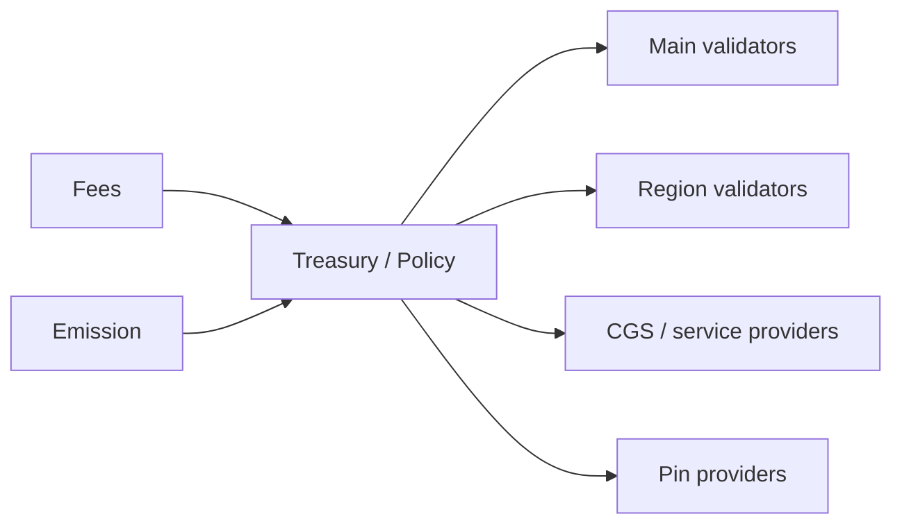

   
5) INITIAL MINT (Main only):
   - Circle calls USDC.mint(Circle, 1_000_000_000)
   - Mirror GBL creates: UTXO(USDC, Main, Circle, 1B)
   - Mirror GBL records: total_supply[USDC] = 1B
   
6) DEPLOY ON REGIONS (after checkpoint):
   - Each region deploys same code at 0xUSDC
   - All regional contracts start with ZERO balances
   - Only Main has Circle's balance
   
7) DISTRIBUTION:
   - Circle transfers USDC to users via normal transfers
   - Cross-region transfers move balances as needed
   - Mirror Chain GBL always enforces: sum(regional) = total_supply
```

**Racing attack is now impossible:**

```text
Attack attempt: Attacker races to deploy on Region B before Main checkpoint

1) Attacker tries to call FederationDeployer.deploy(USDC_bytecode, salt) on Region B
2) FederationDeployer checks authorization from Main checkpoint
3) Authorization not yet received ->' REVERTS
4) Attacker cannot deploy

Even if attacker deploys their own version:
- Uses different deployer ->' different address (not 0xUSDC)
- Not in Federation Registry ->' wallets warn users
- Cannot mint because they're not authorized_minter on a verified contract
```

**Handling native CRYFT:**

The native gas token (CRYFT) uses the same partitioned model, but at the protocol level rather than contract level:

- Each region tracks CRYFT balances independently.
- Cross-region CRYFT transfers use the same debit-checkpoint-credit flow.
- Main tracks total supply and ensures conservation: sum(region_balances) = total_supply.

**Comparison: Partitioned vs. Wrapped model:**

| Aspect | Partitioned Balances | Wrapped Tokens (LMB) |
|:-------|:--------------------|:---------------------|
| User mental model | "I have 300 USDC on Region A" | "I have 300 wUSDC (wrapped) on Region A" |
| Contract address | Same everywhere | Different (bridge + wrapped token) |
| Token symbol | Same (USDC) | Different (wUSDC, USDC.a, etc.) |
| Transfer mechanism | transferToRegion() | lock() + claim() |
| Accounting | Sum of regional balances | Locked on home + wrapped on others |
| Implementation complexity | Simpler | More contracts |
| Wallet UX | Cleaner (one token, regional balances) | Confusing (multiple token symbols) |

**Recommendation:** Use the **partitioned balance model** as the default for CSS-1 regions. The wrapped token model remains available for custom subnets or bridging to external chains (Ethereum, etc.).

**Supply conservation invariant:**

```text
For any token T deployed via federation registry:

sum (balances[region][account] for all accounts, for all regions) = total_supply[T]

This is verified by:
1) Each region reports its total balance in checkpoints
2) Main aggregates and verifies: sum(region_totals) = expected_supply
3) Discrepancy triggers investigation and potential bridge pause
```

**Handling the "follow-me" mirroring case:**

The account mirroring feature (Section 10.6) can work with the partitioned model, but requires careful design. Mirroring allows a user to have **spending authorization** across multiple regions without explicitly transferring each time.

**Important:** Mirroring does NOT duplicate assets. It provides a **credit line** mechanism:

1. User deposits assets on Main into a mirroring contract.
2. Mirroring contract grants spending credit to selected regions.
3. User can spend up to their credit on any mirrored region.
4. Main reconciles all spending after checkpoints and adjusts remaining credit.
5. If user overspends (double-spend attempt), later transactions are reverted.

```text
Mirroring with partitioned balances:

User Alice enables mirroring for 1000 USDC across regions [A, B, C]:

Step 1: Deposit
- Alice transfers 1000 USDC from her Region A balance to Main mirroring contract
- Her Region A balance: 1000 ->' 0 USDC
- Main mirroring contract holds: 1000 USDC for Alice

Step 2: Credit allocation
- Main grants Alice credit_line = 1000 on each mirrored region
- This is NOT balance duplication--it's spending authorization

Step 3: Spending
- Alice spends 300 on Region A ->' local_spent[A] = 300
- Alice spends 200 on Region B ->' local_spent[B] = 200
- Total spent: 500, within 1000 limit ✓

Step 4: Reconciliation (on checkpoint)
- Main receives: spent_A=300, spent_B=200, spent_C=0
- Main debits mirroring contract: 1000 - 500 = 500 remaining
- New credit_line pushed to regions: 500 each

Step 5: Double-spend attempt (attack)
- Alice tries to spend 400 on A and 400 on B simultaneously (total 800)
- Before sync: both succeed locally (each within 500 credit)
- Checkpoint order: A finalizes first ->' spent_A=400, remaining=100
- B's checkpoint arrives ->' spent_B=400 would exceed remaining
- Main rejects B's spend, marks for revert on Region B
- Alice penalized; mirroring may be suspended
```

The key insight: **mirroring converts partitioned balances into a credit system**, where Main is the source of truth and regions operate optimistically with reconciliation.

**Protocol-level enforcement:**

The single-location invariant (or partitioned balance integrity) is enforced at multiple layers:

1. **Partitioned balance contracts** track per-region balances separately.
2. **Cross-region transfers** require debit-checkpoint-credit flow.
3. **Checkpoint verification** (on Main) ensures only valid debits are recognized.
4. **Claim verification** (on destination) verifies Merkle proofs and tracks consumed transfer_ids.
5. **ZK validity proofs** (optional) make forgery computationally infeasible.
6. **Federation Contract Registry** ensures same code at same address across regions.
7. **Slashing** for validators who sign invalid checkpoints.

**Emergency procedures:**

If a bug or attack causes balance discrepancy:

1. **Pause cross-region transfers** via federation governance emergency action.
2. **Audit discrepancy** using checkpoint history on Main.
3. **Reconcile** by adjusting balances on affected region(s) or compensating from treasury.
4. **Post-mortem** and protocol upgrade to prevent recurrence.

The combination of partitioned balances, cryptographic proofs, deterministic deployment, and governance oversight ensures that the sum of all regional balances always equals the canonical supply.

---

## 11. Asset model, rewards, and monetary policy

### 11.1 Native gas asset across the federation

CryftNet uses a native gas asset (denoted CRYFT in this document) for transaction fees on Main and
on CSS chains by default. Custom subnets may use alternative fee assets, but must publish their fee
asset policy in their Federation Interface Declaration. A consistent fee asset simplifies routing, pricing,
and cross-chain UX, but is not mandatory for all subnets.

### 11.2 Fee markets

There are multiple fee markets: - Execution fees: EVM gas fees on Main and on subnets. - Settlement
fees: fees for anchoring checkpoints and relaying cross-chain messages. - CGS fees: fees for private
intent propagation, threshold services, and spam resistance. - Storage/pinning fees: budgets
attached to pin jobs for IPFS availability.

### 11.3 Miner and validator rewards: Primary Network and regions

**v1 PoW Bootstrap Policy (Mainnet Launch):**
CryftNet mainnet v1 launches with **Proof of Work consensus** and an **uncapped supply** with continuous issuance, following Ethereum's original launch model (see Appendix 16.8 for canonical specification):
- **PoW block rewards**: 2 CRYFT/bundle block (matching Ethereum's pre-Merge 2 ETH/block reward), continuous issuance with no supply cap
- **Fee distribution (PoW phase)**: All transaction fees go to the block miner (same as Ethereum pre-EIP-1559)
- **Fee distribution (post-PoS transition)**: EIP-1559-style: base fee burned, priority fee to validator; plus issuance rewards proportional to staked amount
- **Minimum stake (post-PoS)**: 32,000 CRYFT for Primary Network validators (mirroring Ethereum's 32 ETH threshold)
- **Slashing rate (post-PoS)**: 1/32 of stake (~3.125%) per provable misbehavior, scaling with correlated failures (see Section 11.3.2 for evidence specification)

**Supply model:** CRYFT has **no maximum supply cap**. New CRYFT is continuously issued as block rewards (PoW phase) and validator rewards (PoS phase). During the PoW phase, there is no fee burn--all fees go to miners, exactly as Ethereum operated from 2015 to 2021. EIP-1559-style base fee burning is introduced at the PoS transition, adding a deflationary counterweight: when network usage is high, more CRYFT is burned than issued, making the supply net deflationary (as observed on Ethereum post-Merge).

The PoW bootstrap phase ensures fair CRYFT distribution to early participants before transitioning to PoS economics.

#### 11.3.1 v1 Misbehavior Specification (PoW Phase and Post-PoS Transition)

**Provable Misbehavior Set for PoW Phase:**

During the PoW bootstrap, misbehavior enforcement is limited to standard Nakamoto consensus rules:

1. **Invalid block rejection:** Blocks with invalid PoW solutions, invalid state transitions, or violated cross-chain invariants are rejected by peers (standard consensus rule, no explicit slashing--miners lose only the wasted computation).

2. **Checkpoint equivocation (post-PoS slashable):** If a miner signs conflicting checkpoints for the same height, the evidence is recorded for slashing once PoS activates. Miners who plan to become validators have incentive to behave honestly during PoW phase.

**Provable Misbehavior Set for Post-PoS (Snowman/Avalanche Consensus):**

Unlike BFT consensus protocols with explicit double-vote detection, Snowman consensus does not produce a simple "conflicting block signature" evidence surface. v1 slashing is limited to behaviors with **cryptographically verifiable on-chain evidence**.

**Slashable in v1:**

1. **Checkpoint Equivocation (5% stake)**
   - **Evidence**: Two checkpoint signatures from same validator for same height with conflicting state roots.
   - **Messages**: `CheckpointSignature{height, state_root, merkle_root, validator_pubkey, signature}`
   - **Verification on Federal Chain**:
     ```
     1. Verify both signatures are valid for validator_pubkey
     2. Verify height is identical
     3. Verify state_root or merkle_root differ
     4. Verify validator was in active set at that height
     ```
   - **Rationale**: Checkpoints anchor region/subnet state to Federal Chain; conflicting checkpoints enable double-spend attacks on cross-chain transfers.

2. **Invalid Bundle Proposal (3% stake)**
   - **Evidence**: Bundle proposal with provably invalid state transition (e.g., violated cross-chain invariant, invalid EVM execution).
   - **Messages**: `BundleProposal{height, federal_block, mirror_block, evm_block, proposer_sig}` + `InvalidStateProof{violated_invariant, merkle_proof}`
   - **Verification on Federal Chain**:
     ```
     1. Verify proposer signature on bundle
     2. Re-execute state transition deterministically
     3. Verify invariant violation (e.g., Mirror debit != EVM credit)
     4. Verify proposer was scheduled for that bundle height
     ```
   - **Rationale**: Primary Network atomic bundles require all three VMs to execute validly; proposers who submit invalid bundles are penalized.

3. **Cryftee Attestation Fraud (10% stake)**
   - **Evidence**: Node submits attestation claiming valid Cryftee modules, but peer verification or governance audit proves attestation is forged or modules are malicious.
   - **Messages**: `AttestationClaim{node_id, module_hashes[], signature}` + `FraudProof{challenge_response, verification_failure}`
   - **Verification on Federal Chain**:
     ```
     1. Verify attestation signature matches validator's registered key
     2. Governance committee or quorum of validators submit counter-proof
     3. Counter-proof shows module hashes do not match canonical registry OR attestation signature is invalid
     ```
   - **Rationale**: Cryftee attestation is a security-critical requirement for validators; forging attestation undermines the entire execution integrity model.

**NOT Slashable in v1 (lack of objective proof substrate):**

1. **Snowman Vote Equivocation**: Snowman uses preference signaling, not finalization votes. Validators may legitimately change preferences during the consensus process. No objective "double-vote" surface exists.

2. **Block Withholding**: Validators in Snowman do not have explicit block proposal duties based on deterministic assignment. Withholding cannot be proven without timing assumptions that are not consensus-safe.

3. **Invalid Snowman Block Propagation**: Invalid blocks are rejected by peers during normal consensus operation; propagating an invalid block is not distinguishable from network errors or software bugs. No objective evidence format exists.

4. **Liveness Failures**: Offline validators or delayed block production cannot be slashed because network conditions, hardware failures, and software bugs are indistinguishable from intentional behavior.

**Evidence Submission Flow:**

1. **Observation**: Any network participant observes slashable misbehavior.
2. **Evidence Construction**: Participant constructs evidence package with required cryptographic proofs.
3. **On-Chain Submission**: Evidence submitted to Federal Chain via `submitSlashingEvidence(evidence_bytes)` transaction.
4. **Automated Verification**: Federal Chain VM verifies evidence deterministically using rules above.
5. **Slashing Execution**: If valid, Federal Chain immediately:
   - Reduces validator's bonded stake by slashing percentage
   - Marks validator as "slashed" (may affect future participation)
   - Burns slashed amount or distributes to treasury per governance policy
6. **Appeal Process**: Validator may appeal via governance proposal within 30 days; requires supermajority vote to reverse.

**Future Flexibility (Post-Mainnet via Governance):**
After mainnet stabilizes, governance may propose adjustments including:
- Optional emission schedules
- Adjustable fee burn rates and reward splits  
- Regional reward weight tuning
- CGS service provider compensation models

Any changes require supermajority governance approval on Federal Chain.

#### 11.3.2 Parameter table (example defaults)

| Parameter | Symbol | Example | Notes |
|:----------|:-------|:--------|:------|
| Epoch length | EPOCH | 10 minutes (regions), 30 minutes (Main) | Regions shorter; Main longer for stability |
| Fast quorum | q_fast | 67% | Used in CRVS fast path |
| Slow quorum | q_slow | 80% | Used in CRVS slow path |
| Ping RTT max (region) | RTT_MAX | 80 ms | Eligibility gate; region-specific |
| Ping quorum | q_beacon | >= 3 of 5 beacons | Prevents single beacon bias |
| Slashing max | SLASH_MAX | up to 5% stake | For provable misbehavior; governed |

```text
Example weight policy (governance-controlled):
w_main   = 0.35
w_regions= 0.45
w_cgs    = 0.10
w_treas  = 0.10   // treasury accumulation
(These are illustrative, not fixed.)
```

Within a validator set, rewards are distributed by a combination of stake weight and performance:

- **stake_weight(v):** based on bonded stake (and delegated stake where supported)
- **perf(v):** based on uptime, vote participation, relay responsiveness, and (for regions) eligibility score from pings

```text
RewardShare(v) = stake_weight(v)^a * perf(v)^b / Z
```

with exponents a,b set by governance (typical: a near 1, b in [0.3, 1.0]).

**Figure 2: Reward flows (illustrative)**

This diagram shows how fees and emissions flow through the treasury to various network participants. Fees collected from transactions and newly minted tokens (emissions) flow into the Treasury, which distributes rewards to Main validators, Region validators, CGS service providers, and IPFS pin providers according to governance-defined policies.



### 11.4 IPFS pinning rewards: availability as a protocol primitive

CryftNet treats IPFS availability as a rewarded service rather than a background assumption. Pinning
rewards are designed to keep critical content (portals, module binaries, and app assets) available
with measurable reliability. Key components: 1) Pin Provider Registry: providers stake/bond and
advertise a service endpoint (or declare they operate via Cryftee ipfs_v1). 2) Pin Jobs: on-chain

### 11.5 Ethereum-style issuance: continuous rewards with planned fee-burn upgrade (v1 bootstrap model)

**Monetary philosophy:** CryftNet follows Ethereum's historical path. The network launches with pure Proof of Work and simple fee-to-miner economics (Ethereum 2015-2021), then introduces EIP-1559 fee burning at the PoS transition (Ethereum 2021+), and finally moves to PoS with continuous issuance plus fee burn (Ethereum post-Merge 2022+). There is **no supply cap**. During the PoW phase, supply grows through block rewards and all fees flow to miners, maximizing miner incentives for fair distribution. At the PoS transition, EIP-1559 is activated, introducing base fee burning as a deflationary counterweight.

This section details the v1 bootstrap economics under the PoW fair launch phase.

#### 11.5.1 Fee and reward expectations (launch economics)

**Realistic revenue projections for miners (PoW phase, conservative model):**

\\	ext
Assumptions (Month 1 post-mainnet):
- Block time: 10 seconds (8,640 blocks/day)
- Block reward: 2 CRYFT/block = 17,280 CRYFT/day network-wide issuance
- Primary Network transactions: 100-500 tx/block (~6,000-30,000 tx/day)
- Average gas price: 20 gwei (~\.05 per tx at ETH-equivalent pricing)
- All transaction fees go to miners (no burn during PoW phase)

Daily miner revenue (Month 1, network-wide):
  Block rewards:     17,280 CRYFT/day (guaranteed by protocol)
  Transaction fees:  ~300-1,500 CRYFT/day (depends on usage)
  Total:             ~17,580-18,780 CRYFT/day

Per-miner revenue (assuming 100 active miners, equal hashrate):
  Block rewards:     ~172.8 CRYFT/day
  Fee share:         ~3-15 CRYFT/day
  Total:             ~176-188 CRYFT/day = ~5,280-5,640 CRYFT/month

Mining hardware cost (GPU rig):  ~\,000 one-time
Electricity:                     ~\-5/day (~\-150/month)
Break-even: Day 1 at any CRYFT price > ~\.03
\
**Month 6 projections (growth scenario):**

\\	ext
Assumptions:
- 10x transaction growth (early dApp adoption, DeFi migration)
- 300 active miners (network growth)
- Higher gas prices due to demand (~50 gwei average)

Daily miner revenue (Month 6, network-wide):
  Block rewards:     17,280 CRYFT/day (unchanged -- constant 2 CRYFT/block)
  Transaction fees:  ~3,000-15,000 CRYFT/day (10x volume, higher gas prices)
  Total:             ~20,280-32,280 CRYFT/day

Per-miner revenue (300 miners, equal hashrate):
  ~68-108 CRYFT/day = ~2,040-3,240 CRYFT/month

Note: Per-miner CRYFT revenue decreases as more miners join (hashrate dilution),
but CRYFT price appreciation typically compensates. This mirrors Ethereum's 2015-2017
mining economics where ETH price growth outpaced hashrate dilution.
\
**Key insight:** During the PoW phase, miners earn both block rewards (2 CRYFT/block) AND all transaction fees--exactly as Ethereum operated from its 2015 launch through 2021. This maximizes miner income and incentivizes early participation. EIP-1559 fee burning is introduced later at the PoS transition.

#### 11.5.2 Genesis distribution and Proof of Work fair launch

**Problem:** Fair initial distribution of CRYFT tokens is critical for network legitimacy and long-term decentralization. Pre-mined allocations and insider-heavy genesis distributions concentrate power and undermine credible neutrality.

**Solution: Proof of Work mining as the primary distribution mechanism during bootstrap**

The Primary Network (Federal Chain, Mirror Chain, EVM Chain) launches with Proof of Work consensus. CRYFT tokens enter circulation exclusively through mining during the bootstrap phase (estimated 6-12 months). This ensures that early participants earn tokens proportional to the computational work they contribute, establishing a broad holder base before the transition to Proof of Stake.

**Genesis allocation and continuous issuance (no supply cap):**

CRYFT has **no maximum supply**. Supply grows continuously through block rewards (PoW phase) and validator issuance (PoS phase), following Ethereum's model. The genesis block mints only the pre-allocated amounts below; all other CRYFT enters circulation through mining and staking rewards over time.

**Genesis pre-allocation (minted at Block 0, time-locked):**

| Allocation | Amount (CRYFT) | Purpose | Unlock Schedule |
|:-----------|:---------------|:--------|:----------------|
| **Treasury** | 50,000,000 | Protocol development, grants, ecosystem growth | DAO-controlled; locked until PoS transition |
| **Core team & advisors** | 25,000,000 | Cryft Labs team, strategic advisors | 4-year vest, 1-year cliff; begins at PoS transition |
| **Early investors** | 25,000,000 | Seed/Series A fundraising | 2-year vest, 6-month cliff; begins at PoS transition |
| **Ecosystem incentives** | 25,000,000 | Liquidity mining, State chain grants, developer rewards | DAO-controlled, 2-year distribution post-transition |
| **Total genesis pre-allocation** | **125,000,000** | | All locked until PoS transition |

**Continuous issuance (no cap, Ethereum-style):**

| Phase | Issuance Rate | Mechanism | Fee Model |
|:------|:-------------|:----------|:----------|
| **PoW bootstrap** (Months 0-12) | 2 CRYFT/block (~6,307,200 CRYFT/year at 10s blocks) | Block rewards to miners | All fees to miner (pre-EIP-1559, like Ethereum 2015-2021) |
| **PoS phase** (Month 12+) | ~3-4% annual yield on staked CRYFT (Ethereum-equivalent curve) | Validator issuance proportional to sqrt(total_staked) | EIP-1559: base fee burned, priority fee to validator |

**Key design principle:** The vast majority of CRYFT in circulation is earned through permissionless participation (mining, then staking). Genesis pre-allocations are small (~125M) relative to cumulative issuance, and are fully locked until the PoS transition. By the time insider tokens unlock, miners will have earned hundreds of millions of CRYFT, ensuring a broad and decentralized holder base that prevents any single party from dominating governance or staking.

**PoW mining parameters (v1 bootstrap):**

```text
Mining Algorithm:    SHA3-256 (ASIC-resistant during early phase; governance may adjust)
Block time target:   10 seconds (bundle blocks, like Ethereum's ~12s pre-Merge)
Block reward:        2 CRYFT/block (matching Ethereum's pre-Merge 2 ETH/block)
Reward schedule:     Constant 2 CRYFT/block -- NO halving, NO supply cap
                     (Governance may adjust reward rate post-transition, as Ethereum
                     adjusted from 5 -> 3 -> 2 ETH via EIP-2384/EIP-4345)
Difficulty adjustment: Every 2,016 blocks (retarget to maintain 10s target block time)
Annual PoW issuance: ~6,307,200 CRYFT/year (2 CRYFT * 6 blocks/min * 60 * 24 * 365)

Fee handling during PoW phase (pre-EIP-1559, same as Ethereum 2015-2021):
  - Miners set a minimum gas price they accept (gas_price floor)
  - Users bid gas_price to prioritize inclusion (first-price auction)
  - ALL transaction fees (gas_used * gas_price) go to the block miner
  - NO fee burning during the PoW phase
  - Block reward (2 CRYFT) + all tx fees = total miner revenue per block
  - EIP-1559 fee burning is introduced at the PoS transition (see Section 11.6)

Projected supply growth (PoW phase, ~12 months):
  Year 1 gross issuance: ~6,307,200 CRYFT (block rewards only)
  Year 1 tx fee income:  100% to miners (no burn)
  Year 1 total new supply: ~6,307,200 CRYFT (plus genesis 125M pre-allocation)
  Total circulating after Year 1: ~125M (genesis, locked) + ~6.3M (mined) = ~131.3M CRYFT
  Note: Only ~6.3M CRYFT is freely circulating; genesis allocations remain locked
```

**Mining accessibility (fair launch principles):**

1. **CPU/GPU friendly:** SHA3-256 is chosen to resist early ASIC dominance, ensuring hobbyist miners can participate meaningfully during the critical initial distribution window.
2. **No pre-mine:** Zero CRYFT exists before the genesis block. All tokens enter circulation through mining or are locked in vesting contracts that do not unlock until after the PoS transition.
3. **No hidden allocation:** Treasury, team, and investor allocations are committed in the genesis block but are **time-locked and non-transferable** until the PoS transition governance vote passes.
4. **Pool-friendly:** Mining is compatible with standard pool protocols, enabling smaller participants to earn proportional rewards.

**Atomic bundle mining:**

During the PoW phase, the bundle block system (Section 4.1) operates with PoW instead of Snowman voting:

```text
Bundle PoW Block Production:
1. Miner collects pending transactions for Federal, Mirror, and EVM chains
2. Miner executes all three VMs in order (Federal -> Mirror -> EVM)
3. Miner constructs bundle_hash = keccak256(federal_header || mirror_header || evm_header)
4. Miner performs PoW: find nonce such that H(bundle_hash || nonce) < difficulty_target
5. Miner broadcasts solved bundle block to network
6. Peers validate: PoW solution + all three VM state transitions + cross-chain invariants
7. Longest valid chain rule determines canonical chain (Nakamoto consensus)

Fork resolution: Standard longest-chain rule. Orphaned blocks' transactions return to mempool.
Reorganization depth limit: 100 blocks (deeper reorgs rejected; governance intervention required).
```

**Miner economics (v1 PoW bootstrap):**

```text
Example miner (Month 1, GPU rig with 500 MH/s SHA3-256):

Assumptions:
  - Network hashrate: 50 GH/s (early phase, moderate competition)
  - Miner share: 500 MH/s / 50 GH/s = 1% of network hashrate
  - Block rewards: 2 CRYFT/block * 8,640 blocks/day = 17,280 CRYFT/day (network total)
  - Miner daily block reward: 17,280 * 0.01 = 172.8 CRYFT/day
  - Plus ALL transaction fees: ~5-20 CRYFT/day share (early network, 100% to miners)
  - Total miner daily income: ~178-193 CRYFT/day

  Hardware cost: ~$2,000 (mid-range GPU rig)
  Electricity: ~$3-5/day
  Monthly mining revenue: ~178 CRYFT/day * 30 = 5,340 CRYFT/month

  At estimated early price (~$0.10/CRYFT): ~$534/month revenue, ~$150 electricity = $384 profit
  At estimated $1.00/CRYFT (post-exchange listing): ~$5,340/month revenue

Note: Like early Ethereum mining (2015-2021), all transaction fees go directly to miners.
No fee burn occurs during the PoW phase. EIP-1559 activates at the PoS transition.
```

**Anti-gaming measures during PoW phase:**

- **Selfish mining detection:** Nodes monitor for blocks that appear to be withheld and released strategically; anomalous patterns flagged for community review.
- **Timestamp manipulation limits:** Block timestamps must be within +/- 15 seconds of network-adjusted time; violating blocks are rejected.
- **Empty block penalties:** Miners who consistently produce empty blocks (to collect rewards without processing transactions) receive reduced difficulty credit after governance activation.

#### 11.5.3 Regional State fee subsidies (opt-in mechanism)

**Problem:** New State chains have low transaction volume initially, making it hard to attract validators.

**Solution: State deployers can subsidize fees using treasury grants or self-funding**

**State Fee Subsidy Pool (governance-approved mechanism):**

`solidity
contract StateFeeSubsidyPool {
    mapping(uint64 region_id => uint256 subsidy_balance) public subsidies;
    
    // State deployer or DAO deposits subsidy budget
    function depositSubsidy(uint64 region_id, uint256 amount) external {
        require(msg.sender == regionDeployer[region_id] || msg.sender == DAO, "Unauthorized");
        subsidies[region_id] += amount;
    }
    
    // Validators claim subsidized rewards (on top of base fees)
    function claimSubsidy(uint64 region_id, uint256 epoch) external {
        require(isValidator(msg.sender, region_id), "Not validator");
        
        // Calculate validator's share based on participation
        uint256 validatorShare = calculateShare(msg.sender, region_id, epoch);
        uint256 subsidy = subsidies[region_id] * validatorShare / totalShares[region_id];
        
        // Pay out (capped by remaining subsidy balance)
        uint256 payout = min(subsidy, subsidies[region_id]);
        subsidies[region_id] -= payout;
        payable(msg.sender).transfer(payout);
        
        emit SubsidyClaimed(region_id, msg.sender, payout, epoch);
    }
}
`

**Subsidy policy examples:**

```text
Example 1: Enterprise State (self-funded)
- Deployer: MegaCorp deploys State 1042 for internal supply chain dApp
- Subsidy budget: $50,000 CRYFT (from MegaCorp treasury)
- Duration: 12 months
- Validator incentive: $50,000 / 12 months / 20 validators = $208/validator/month
- MegaCorp benefits: Guaranteed validator participation, low fees for internal users

Example 2: Community State (DAO grant)
- Deployer: DeFi DAO deploys State 1101 for decentralized exchange
- Subsidy budget: 500,000 CRYFT (approved via CryftNet DAO proposal)
- Duration: 6 months (bootstrap only)
- Validator incentive: Tapers from $2,000/month (Month 1) to $500/month (Month 6)
- DAO benefits: Attracts early liquidity, then transitions to fee-based sustainability

Example 3: No subsidy (organic growth)
- Deployer: Public goods State (donation-funded)
- Subsidy budget: 0 CRYFT
- Validator incentive: Pure fee-based (validators join only if volume justifies)
- Result: Slower initial adoption but no artificial incentives
```

**Governance controls:**

- Treasury-funded subsidies require DAO vote (>51% approval)
- Maximum subsidy per State: 1,000,000 CRYFT (prevents capture)
- Subsidy duration cap: 24 months (forces transition to sustainability)
- Audit requirement: Subsidized States must publish monthly transaction volume reports

#### 11.5.4 Treasury validator stipends (emergency backstop, governance-gated)

**Problem:** Catastrophic scenariousage crashes, fee revenue drops below validator costs, validators churn.

**Solution: Treasury emergency validator stipend program (requires DAO supermajority)**

**Activation criteria (all must be true):**

1. Network-wide fee revenue <$1,000/day for 14 consecutive days
2. Validator count drops below 75 (security threshold: 100 minimum)
3. DAO approves emergency stipend via 67% supermajority vote
4. Treasury balance >5,000,000 CRYFT (sufficient runway)

**Stipend structure (if activated):**

```text
Duration: Maximum 90 days (must resolve underlying usage problem, not prop up indefinitely)
Amount: $500/validator/month (covers AWS costs + 50% margin)
Eligibility: Validators with >95% uptime over previous 30 days
Cap: 150 validators maximum (total cost: $75,000/month from treasury)

Conditions:
  - DAO must simultaneously approve "usage recovery plan" (marketing, partnerships, fee reductions)
  - Stipend automatically sunsets after 90 days (requires re-vote to extend)
  - If fee revenue recovers to >$1,000/day, stipend ends immediately (return unused funds to treasury)
```

**Why this works without long-term dependency:**

1. **Time-limited:** 90-day maximum forces focus on fundamentals (usage, product-market fit)
2. **Supermajority gating:** Prevents frivolous use (requires broad community consensus that network is worth saving)
3. **Auto-sunset:** No "perpetual UBI" for validators; stipend ends when crisis resolves or time expires
4. **Transparency:** All stipend payments on-chain, auditable in real-time

**Historical precedent:** Similar emergency programs exist in other networks (Cosmos Hub community pool, Polkadot Treasury) but are rarely activated because fee revenue typically grows with adoption.

#### 11.5.5 Long-term sustainability model (post-PoS transition -- Ethereum-style issuance)

**Timeline: After PoS transition (estimated Month 7-12+)**

After the Proof of Work bootstrap phase ends and the network transitions to Snowman (PoS) consensus, the issuance model shifts from PoW block rewards to **PoS validator issuance**, following Ethereum's post-Merge economics:

```text
Post-PoS Issuance Model (Ethereum-equivalent):

  Validator issuance formula (per epoch):
    base_reward_per_validator = MAX_EFFECTIVE_BALANCE * BASE_REWARD_FACTOR / sqrt(total_staked)
    
    Where:
      MAX_EFFECTIVE_BALANCE = 32,000 CRYFT (per validator)
      BASE_REWARD_FACTOR = 64 (Ethereum's value; tunable by governance)
      total_staked = sum of all validator stakes
    
    Annual yield curve (approximate, matching Ethereum):
      1M CRYFT staked:   ~18% APR (~180,000 CRYFT/year issuance)
      10M CRYFT staked:  ~5.6% APR (~560,000 CRYFT/year issuance)
      50M CRYFT staked:  ~2.5% APR (~1,250,000 CRYFT/year issuance)
      100M CRYFT staked: ~1.8% APR (~1,800,000 CRYFT/year issuance)
    
    Key property: Issuance scales with sqrt(total_staked), so:
      - More stakers = lower per-validator yield but higher total security budget
      - Fewer stakers = higher per-validator yield, incentivizing new stakers to join
      - Self-correcting equilibrium (proven on Ethereum since September 2022)

Revenue sources for validators (post-PoS transition):
  1. Issuance rewards (continuous, no cap -- Ethereum-style sqrt curve)
  2. Priority fees (tips) from transactions
  3. MEV rewards (proposer-builder separation, if adopted)
  4. State chain validation fees (regional validators)
  5. Cross-region transfer fees (checkpoint validators)
  6. Federation fees (contract mirroring, balance portability)

Fee burn (EIP-1559, introduced at PoS transition):
  - Base fee burned on every transaction (activated at PoS transition, not during PoW)
  - When burns > issuance, supply is NET DEFLATIONARY
  - Ethereum has been net deflationary for extended periods post-Merge
  - CryftNet targets same equilibrium: low-usage = mild inflation; high-usage = deflation
  - During PoW phase, all fees go to miners (no burn) -- same as Ethereum 2015-2021

Profitability projection (Month 12, moderate success scenario):
  Staked CRYFT: 10M (assumes ~8% of circulating supply staked)
  Validator count: 312 validators (10M / 32,000 per validator)
  Annual issuance yield: ~5.6% APR
  Per-validator annual issuance: 10M * 0.056 / 312 = ~1,795 CRYFT/year = ~150 CRYFT/month
  Plus priority fees: ~$5-15/month per validator (early network)
  Validator costs (optimized): $100-150/month
  Break-even: Achieved when CRYFT > ~$1.00 (fees + issuance covers costs)
```

**Why uncapped Ethereum-style issuance is the right model:**

1. **Proven at scale:** Ethereum's issuance model secures $400B+ in value with continuous issuance + fee burn. No supply cap has not prevented ETH from being valued at thousands of dollars.
2. **Self-regulating:** The sqrt(total_staked) curve automatically adjusts yield to attract/retain the right amount of staking. No governance intervention needed for basic security budget.
3. **Aligned incentives:** Validators are always incentivized to participate (guaranteed issuance), while users pay for network usage (fee burn post-EIP-1559). Neither side subsidizes the other.
4. **Deflationary potential:** Once EIP-1559 activates at PoS transition, high network usage means more CRYFT burned than issued, creating positive price pressure without artificial scarcity.
5. **No "final block" problem:** Capped-supply networks face a security crisis when block rewards approach zero (Bitcoin's long-term fee-only security debate). Continuous issuance eliminates this risk entirely.
6. **Battle-tested phasing:** Ethereum proved this exact sequence works: launch with PoW + all-fees-to-miner (2015), add EIP-1559 fee burn (2021), transition to PoS (2022). CryftNet follows the same proven path.

**Failure scenario and pivot options:**

If fee revenue or staking participation is insufficient:

1. **Governance can adjust BASE_REWARD_FACTOR** to increase/decrease issuance rate
2. **Adjust minimum stake** (lower from 32,000 CRYFT to encourage more validators)
3. **Introduce MEV smoothing** (distribute MEV rewards across all validators, not just proposers)
4. **Protocol optimization** (lower validator costs via client improvements)

**Key principle:** CryftNet follows Ethereum's proven evolutionary path: PoW with simple fee economics first, then EIP-1559 fee burn + PoS transition, then continuous issuance with deflationary counterweight. The PoW fair launch ensures broad initial distribution; the PoS + EIP-1559 model ensures long-term sustainability.

### 11.6 Proof of Work to Proof of Stake transition plan

The transition from PoW to PoS (Snowman consensus) is the most significant protocol upgrade in CryftNet's lifecycle. It must be carefully coordinated to preserve security, maintain fair economics, and ensure smooth network continuity.

#### 11.6.1 Transition trigger conditions

The PoW-to-PoS transition is activated when **all** of the following conditions are met:

```text
Transition Trigger Conditions (ALL required):

1. Distribution threshold:
   - >= 3,200,000 CRYFT in circulation from mining (enough for 100 validators at 32,000 CRYFT each)
   - Held by >= 1,000 distinct addresses (not exchange hot wallets)
   - No single address (excluding locked vesting contracts) holds > 5% of circulating supply

2. Network maturity:
   - >= 6 months since genesis block
   - >= 500 unique miners have produced at least 1 block
   - Network hashrate has been stable (< 50% variance) for >= 30 days

3. Governance approval:
   - PoS transition proposal submitted on Federal Chain
   - 67% supermajority approval from CRYFT holders (weighted by balance, not hashrate)
   - 14-day voting period with >= 20% of circulating supply participating

4. Technical readiness:
   - Snowman consensus implementation audited and tested on incentivized testnet for >= 90 days
   - Staking contract deployed and tested on testnet
   - At least 100 prospective validators have signaled intent to stake >= 32,000 CRYFT each
```

#### 11.6.2 Transition mechanics

```text
PoW-to-PoS Transition Sequence:

Phase A: Announcement (Block H - 50,000 blocks, ~6 days before transition)
  - Transition block height H published on Federal Chain
  - Miners and future validators prepare infrastructure
  - Staking deposits open: validators can pre-stake CRYFT to be active at block H

Phase B: Final PoW blocks (Block H - 1,000 to Block H)
  - Mining difficulty frozen (no more adjustments)
  - Final PoW blocks mined normally
  - Staking validator set finalized at Block H - 100

Phase C: Transition block (Block H)
  - Last PoW block mined at height H
  - Network pauses for transition window (target: < 60 seconds)
  - Snowman consensus activates at Block H + 1
  - First PoS block produced by the initial validator set
  - All state (balances, contracts, UTXOs) carries over without modification

Phase D: Stabilization (Block H + 1 to Block H + 10,000)
  - Conservative Snowman parameters (longer finality windows)
  - Emergency rollback to PoW available via governance supermajority (80%)
  - Monitoring for consensus issues, fork events, or liveness failures

Phase E: Full PoS operations (Block H + 10,001+)
  - Normal Snowman parameters activated
  - PoS issuance begins (Ethereum-style sqrt curve, continuous, no cap)
  - EIP-1559 fee model activates: base fee burned, priority fee to validators
  - Team/investor vesting schedules begin unlocking
  - PoW mining no longer produces valid blocks
```

#### 11.6.3 Miner-to-validator transition incentives

To encourage PoW miners to become PoS validators (preserving operational expertise and infrastructure):

```text
Miner Transition Program:

1. Staking bonus: Miners who stake >= 32,000 mined CRYFT within 30 days of PoS transition
   receive a 10% staking bonus (funded from early issuance).
   
2. Hardware repurposing: PoS validator hardware requirements (8 vCPU, 32GB RAM, 1TB NVMe)
   are intentionally compatible with typical mining rig specifications.

3. Priority validator slots: Addresses that mined >= 100 blocks during PoW phase receive
   priority inclusion in the initial PoS validator set (no queue).

4. Legacy mining recognition: Miner addresses are permanently recorded in a genesis 
   attestation on Federal Chain, recognizing their contribution to fair launch.
```

#### 11.6.4 Security during transition

```text
Transition Security Measures:

1. Finality freeze: No cross-region transfers processed during the transition window
   (< 60 seconds). Pending transfers resume after first PoS block is finalized.

2. Checkpoint anchor: Final PoW state root is anchored as the genesis state for PoS.
   All subsequent PoS blocks reference this anchor.

3. Rollback capability: If PoS fails to produce blocks within 10 minutes of transition,
   network automatically reverts to PoW at Block H. Governance can re-attempt transition
   after resolving issues.

4. Double-spend window: The transition block H has special handling--it requires
   6 PoW confirmations AND the first PoS block to reference it before cross-chain
   operations resume.
```

